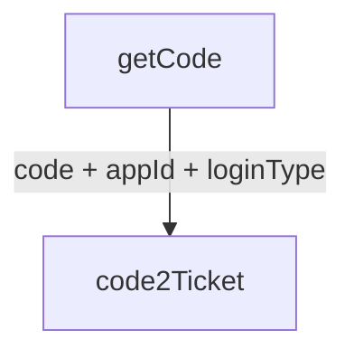
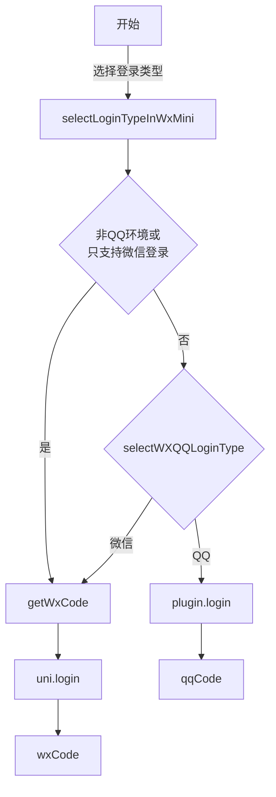

# 小程序登录

整体流程

```mermaid
graph TD
getCode --"code + appId + loginType"--> code2Ticket
```

获取 code 流程

```mermaid
graph TD
start[开始] --选择登录类型--> selectLoginTypeInWxMini

selectLoginTypeInWxMini --> isOnlyWX{非QQ环境或<br/>只支持微信登录}

isOnlyWX --否--> selectWXQQLoginType{selectWXQQLoginType}

isOnlyWX --是-->  getWxCode --> uniLogin["uni.login"] --> wxCode

selectWXQQLoginType --微信--> getWxCode
selectWXQQLoginType --QQ--> pluginLogin["plugin.login"] --> qqCode
```

