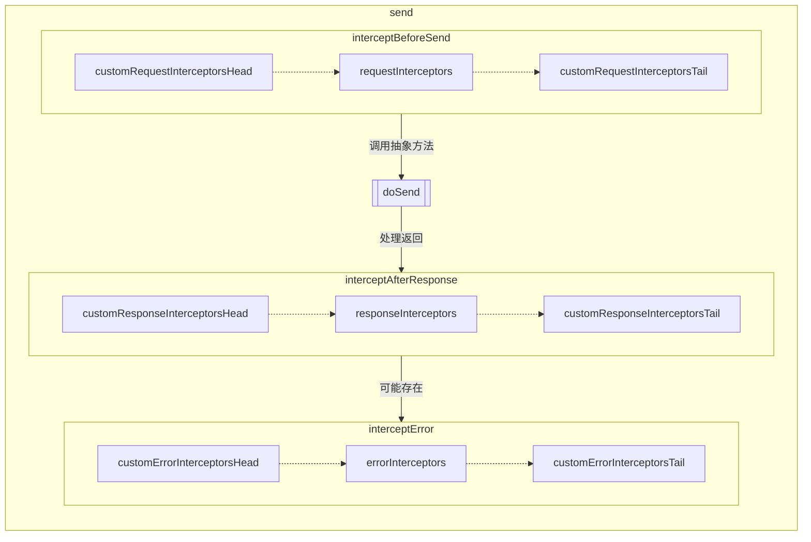
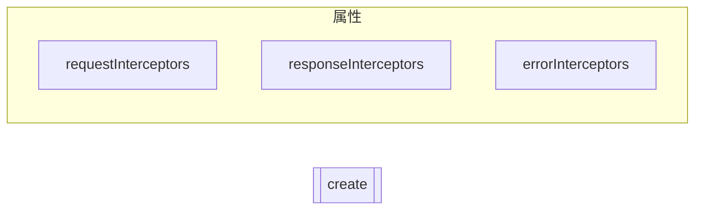
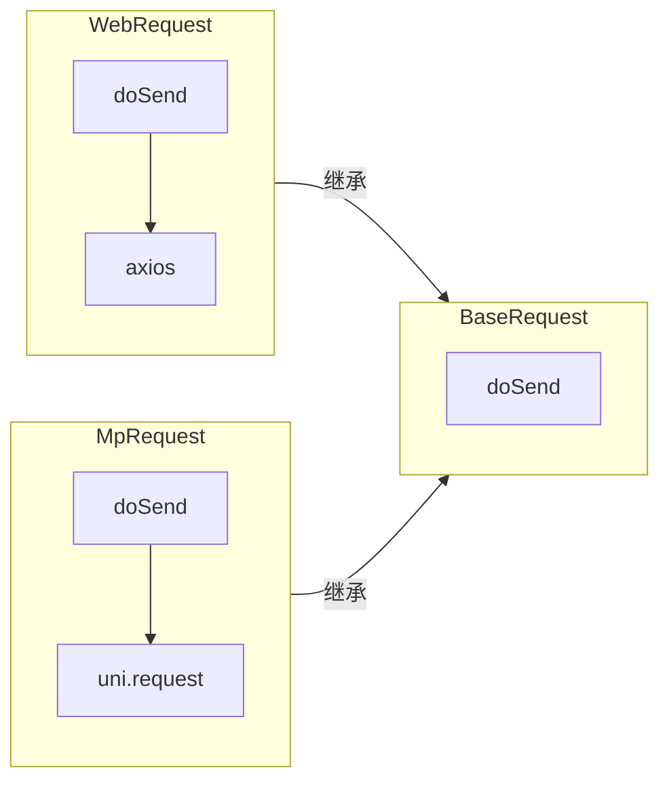
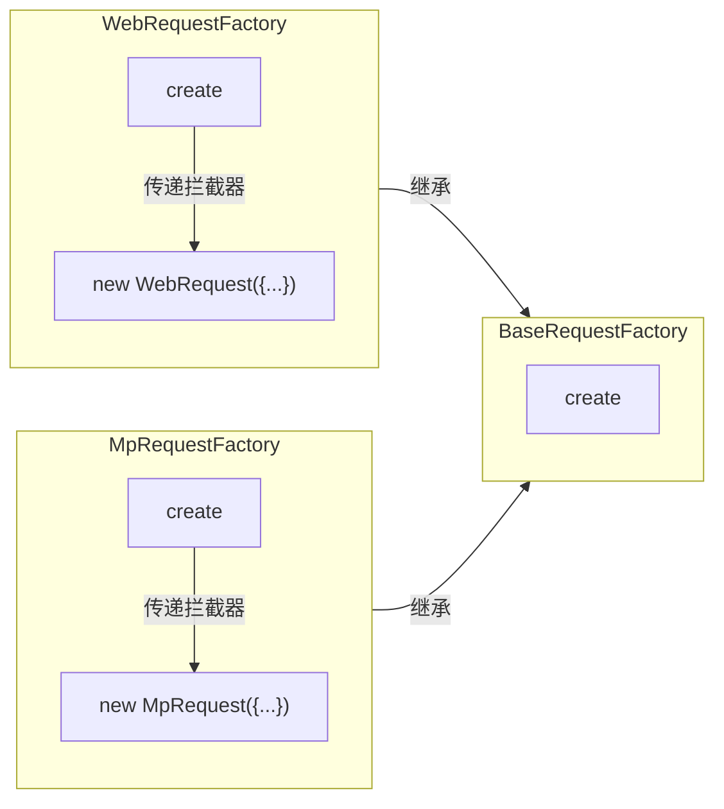
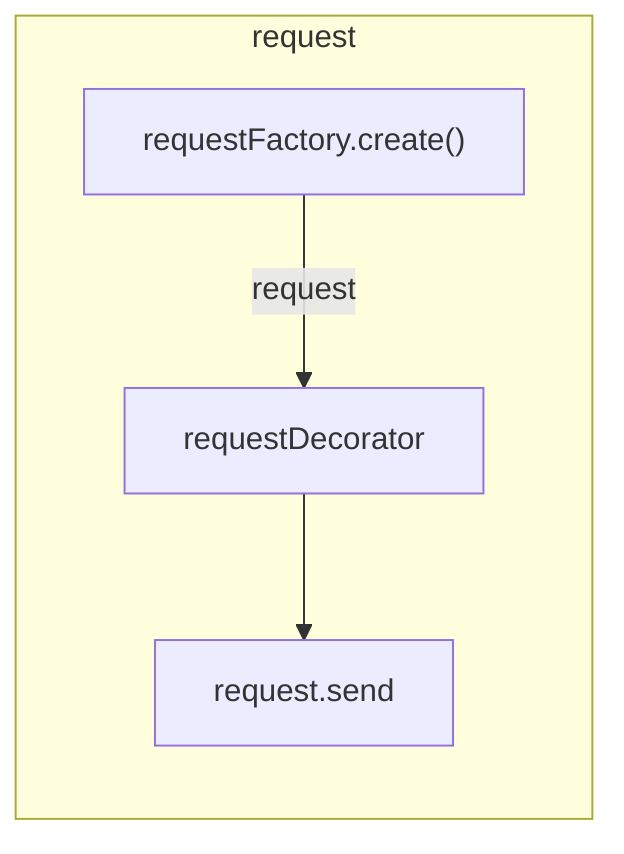
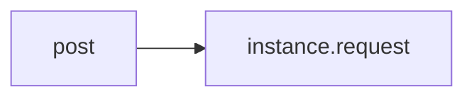
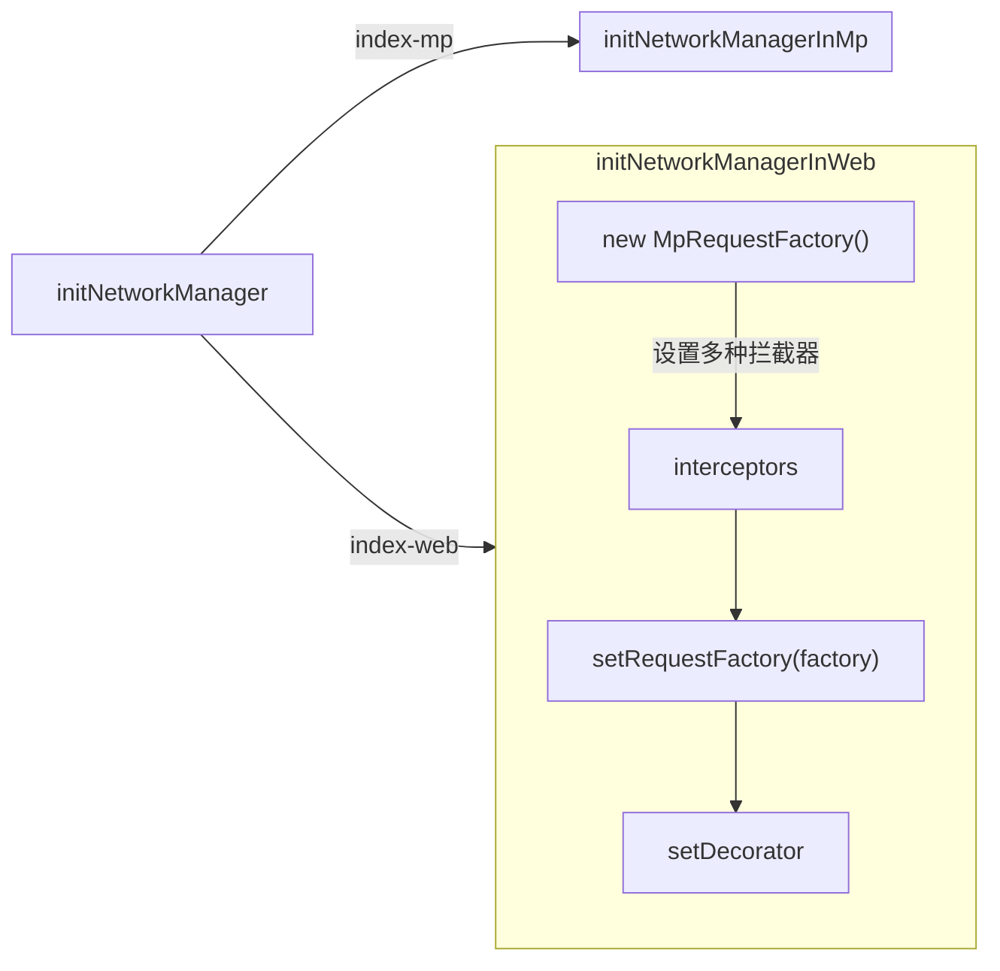
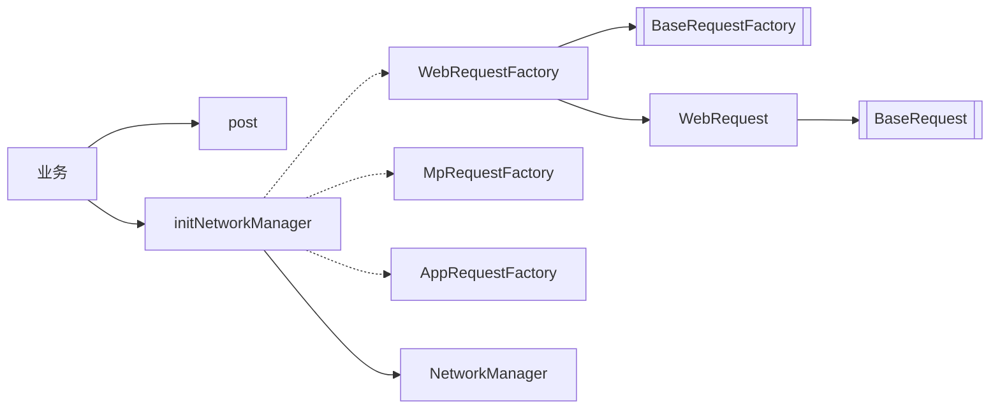

# 网络框架解析

## 1. 基础层

### 1.1. BaseRequest

- `BaseRequest` 是抽象类
- `send`，调用抽象方法 `doSend`
- 私有 `interceptBeforeSend`、`interceptAfterResponse`、`interceptError`
- 管理 `requestInterceptors`、`responseInterceptors`、`errorInterceptors`



### 1.2. BaseRequestFactory

- `BaseRequestFactory` 是抽象类
- 抽象方法 `create`，返回 `BaseRequest`
- `create` 表示创建一个实例，用于一次执行请求发送



### 1.3. MpRequest

- 继承自 `BaseRequest`
- 实现 `doSend`



### 1.4. MpRequestFactory

- 继承自 `BaseRequestFactory`
- `create` 方法返回 `new MpRequest()`



### 1.5. NetworkManager

- 是一个单例模式的网络请求管理器，提供统一的网络请求入口和拦截器机制
- 核心方法包括 **`setRequestFactory`、`setDecorator`、`request`**

```ts
public setRequestFactory(factory: BaseRequestFactory) {
  this.requestFactory = factory;
}
```

- `request(param)` 即 `NetworkManager.instance.request(param)`

```ts
public request(param: IBaseRequestParam): Promise<any> {
  const request = this.requestFactory.create(param);
  if (this.requestDecorator) {
    return this.requestDecorator(() => request.send(param, this.customInterceptor), param);
  }
  return request.send(param, this.customInterceptor);
}
```



### 1.6. post

就是调用 `NetworkManager` 实例的 `request` 方法

```ts
export function request(param: IBaseRequestParam): Promise<any> {
  return NetworkManager.instance.request(param);
}

export const post = request;
export const get = request;
```



## 2. 业务层

### 2.1. 示例

```ts
const factory = new MpRequestFactory();
factory.requestInterceptors = ['xxx'];
factory.responseInterceptors = ['xxx'];
factory.errorInterceptors = ['xxx'];
NetworkManager.instance.setRequestFactory(factory);
NetworkManager.instance.setDecorator(mpCodeScheduler);
```



## 3. 总览

所有类（方法）的总览视图



## 改动

1. 不是 `igame` 依赖 `default`，是 `default` 依赖 `igame`，`igame` 是明确的，`default` 可以换
2. 所有拦截器都支持异步操作
3. 微信小程序登录支持选择QQ/微信，根据环境及配置判断
4. 注意 `network` 有多余引入，`web` 环境也有引入 `MpRequestFactory`，但是只要项目支持 `tree-shaking` 问题不大，路径在 `packages/network/src/index.ts`
