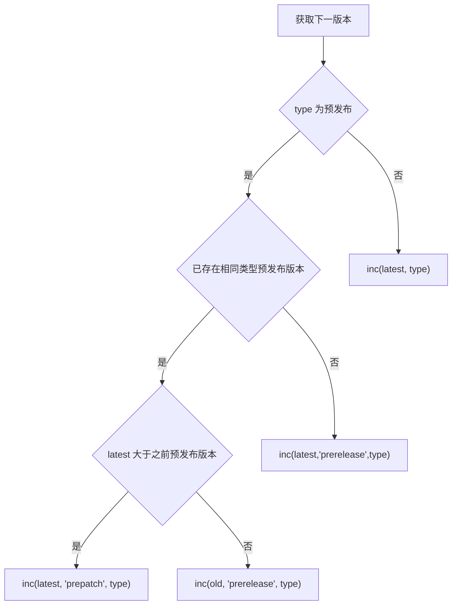

预发布即 `versionType` 为 `alpha/beta/rc`

下图 `type` 即位 `versionType`

```mermaid
graph TD
  start[获取下一版本] --> isPrerelease{type 为预发布}
  isPrerelease --是--> isPrereleaseVersionExisted{已存在相同类型预发布版本}
  isPrerelease --否--> releaseVersion["inc(latest, type)"]
  isPrereleaseVersionExisted --是--> isSmallThanLatest{latest 大于之前预发布版本}
  isSmallThanLatest --是--> getNextVersion["inc(latest, 'prepatch', type)"]
  isSmallThanLatest --否--> getNextVersion2["inc(old, 'prerelease', type)"]
  isPrereleaseVersionExisted --否--> getNextVersion3["inc(latest,'prerelease',type)"]
```

```mermaid
graph LR
  build[Build] --> bump[Bump Version]
  bump --> changelog[Change Log]
  changelog --> commit[Commit]
  commit --> tag[Tag]
  tag --> publish[Publish]
  publish --> message[Message]
```
