:::info 作者

novlan1

2026.1.1

:::

# TDesign 碎片笔记

## 看看 faq 的其他部分，有没有可以优化的语句，不专业的语句可以优化的

`2026-06-16`

好的，我已经读完整份 [`faq.md`](command:gongfeng.gongfeng-copilot.chat.open-relative-path?%7B%22%24mid%22%3A1%2C%22fsPath%22%3A%22%2FUsers%2Fguowangyang%2FDocuments%2Fgithub%2Ftdesign-miniprogram%2Fpackages%2Ftdesign-uniapp%2Fsite%2Fdocs%2Ffaq.md%22%2C%22path%22%3A%22%2FUsers%2Fguowangyang%2FDocuments%2Fgithub%2Ftdesign-miniprogram%2Fpackages%2Ftdesign-uniapp%2Fsite%2Fdocs%2Ffaq.md%22%2C%22scheme%22%3A%22file%22%7D)（在你提供的 attached 内容里）。整体写得不算差，但作为对外官方文档，**口语化、指代不清、措辞过随意**的地方有一些。下面分两块：

1. 我的诊断（哪里不专业 / 不够清晰）
2. 给出可直接落地的修订版

## 一、问题诊断

| 位置 | 原文 | 问题 |
|------|------|------|
| 写在前面 | "可以查看[这篇文章]" | "这篇文章"过于口语化，建议明确"实现原理介绍" |
| 外部样式类 | "在 `tdesign-uniapp` 中被转成了 `props`" | "转成了"偏口语；"被" 字句不必要 |
| 外部样式类 | "使用的时候要在样式文件中增加 `:deep` 标记，否则会因为 `scoped` 而失败" | "增加 `:deep` 标记"不准确，`:deep()` 是**伪类选择器**，不是"标记"；"会因为 scoped 而失败"指代不明，应说"会因 scoped 隔离导致样式不生效" |
| 外部样式类 | "如果是非页面级别组件，需要增加 `options: { styleIsolation: 'shared' }`" | 这是**小程序端**特有，且只对编译到 mp-weixin 等平台生效；H5/App 不需要。原文没区分平台，会误导 |
| 事件参数 | "都被去掉了 [`detail`](command:gongfeng.gongfeng-copilot.chat.open-symbol-in-file?%5B%7B%22%24mid%22%3A1%2C%22fsPath%22%3A%22%2FUsers%2Fguowangyang%2FDocuments%2Fgithub%2Ftdesign-miniprogram%2Fpackages%2Ftdesign-uniapp%2Fsite%2Fdocs%2Ffaq.md%22%2C%22external%22%3A%22file%3A%2F%2F%2FUsers%2Fguowangyang%2FDocuments%2Fgithub%2Ftdesign-miniprogram%2Fpackages%2Ftdesign-uniapp%2Fsite%2Fdocs%2Ffaq.md%22%2C%22path%22%3A%22%2FUsers%2Fguowangyang%2FDocuments%2Fgithub%2Ftdesign-miniprogram%2Fpackages%2Ftdesign-uniapp%2Fsite%2Fdocs%2Ffaq.md%22%2C%22scheme%22%3A%22file%22%7D%2C%22detail%22%2C%5B%7B%22line%22%3A22%2C%22character%22%3A16%7D%2C%7B%22line%22%3A22%2C%22character%22%3A22%7D%5D%5D) 一层" | "去掉了 detail 一层"口语化；"detail 一层"指代不清（一层什么？） |
| 事件参数 | "这样做是为了简化使用。`tdesign-uniapp` 中很多组件都采用了这种方式。" | 后半句多余且不严谨——不是"很多"，是"所有"；建议合并精简 |
| onPageScroll | "在小程序、APP 等平台下，需要业务自己在页面中监听 `pageScroll` 事件，这是因为动态的监听不生效" | "业务自己" → "业务方"；"动态的监听不生效"语病——应为"动态注册的页面生命周期不生效" |
| onPageScroll | "这里给出一个最佳实践之一" | 病句："一个 ... 之一"重复 |
| onPageScroll 注释 | "// 该方法内部会通过 event-bus，传递参数给对应的组件" | "传递参数给对应的组件"→"将滚动事件分发到组件内部"更准 |
| slot 类型提示 | "uniapp 给的脚手架工程配置有问题" | "给的" 口语；"工程"→"模板" |
| slot 类型提示 | "另外，它这个脚手架太老了，自己的 [`tsconfig.json`](command:gongfeng.gongfeng-copilot.chat.open-relative-path?%7B%22%24mid%22%3A1%2C%22fsPath%22%3A%22%2FUsers%2Fguowangyang%2FDocuments%2Fgithub%2Ftdesign-miniprogram%2Ftsconfig.json%22%2C%22path%22%3A%22%2FUsers%2Fguowangyang%2FDocuments%2Fgithub%2Ftdesign-miniprogram%2Ftsconfig.json%22%2C%22scheme%22%3A%22file%22%7D) 还飘红，升级下 `@vue/tsconfig` 可解决。" | "它这个" / "太老了" / "飘红" / "升级下" 全是口语，**最不专业的一段** |
| slot 类型提示 | "这里有一个开箱即用的 uniapp Vue3 [脚手架项目]...你可以打开看看。" | "你可以打开看看"非常口语 |
| visible 受控 | 标题与正文 | 写得没问题，但**列表里 drawer 在 tdesign-uniapp 实际不存在**（需确认，下面会查证）|

我顺便核实一下 [`drawer`](command:gongfeng.gongfeng-copilot.chat.open-symbol-in-file?%5B%7B%22%24mid%22%3A1%2C%22fsPath%22%3A%22%2FUsers%2Fguowangyang%2FDocuments%2Fgithub%2Ftdesign-miniprogram%2Fpackages%2Ftdesign-uniapp%2Fsite%2Fdocs%2Ffaq.md%22%2C%22external%22%3A%22file%3A%2F%2F%2FUsers%2Fguowangyang%2FDocuments%2Fgithub%2Ftdesign-miniprogram%2Fpackages%2Ftdesign-uniapp%2Fsite%2Fdocs%2Ffaq.md%22%2C%22path%22%3A%22%2FUsers%2Fguowangyang%2FDocuments%2Fgithub%2Ftdesign-miniprogram%2Fpackages%2Ftdesign-uniapp%2Fsite%2Fdocs%2Ffaq.md%22%2C%22scheme%22%3A%22file%22%7D%2C%22drawer%22%2C%5B%7B%22line%22%3A86%2C%22character%22%3A2%7D%2C%7B%22line%22%3A86%2C%22character%22%3A8%7D%5D%5D) 是否真的存在，避免我在修文档时把不存在的组件保留下来：
[查找文件中]
[查找文件中]
好，[`drawer`](command:gongfeng.gongfeng-copilot.chat.open-symbol-in-file?%5B%7B%22%24mid%22%3A1%2C%22fsPath%22%3A%22%2FUsers%2Fguowangyang%2FDocuments%2Fgithub%2Ftdesign-miniprogram%2Fpackages%2Ftdesign-uniapp%2Fsite%2Fdocs%2Ffaq.md%22%2C%22external%22%3A%22file%3A%2F%2F%2FUsers%2Fguowangyang%2FDocuments%2Fgithub%2Ftdesign-miniprogram%2Fpackages%2Ftdesign-uniapp%2Fsite%2Fdocs%2Ffaq.md%22%2C%22path%22%3A%22%2FUsers%2Fguowangyang%2FDocuments%2Fgithub%2Ftdesign-miniprogram%2Fpackages%2Ftdesign-uniapp%2Fsite%2Fdocs%2Ffaq.md%22%2C%22scheme%22%3A%22file%22%7D%2C%22drawer%22%2C%5B%7B%22line%22%3A86%2C%22character%22%3A2%7D%2C%7B%22line%22%3A86%2C%22character%22%3A8%7D%5D%5D) 和 `color-picker` 都存在，原列表无需删除。

那我直接落地修订。下面是「**先给你看修订对照**，再问你是否落盘」的方式——但你这次问题是"看看有没有可以优化的语句，不专业的语句可以优化的"，更倾向于建议而不是直接改。所以我不动文件，先把建议改写贴出来，**等你确认后再修改**。

## 二、修订建议（按段落给出）

### ① "写在前面"
- 原：TDesign UniApp 的实现原理，可以查看[这篇文章](...)。
- 改：TDesign UniApp 的实现原理，可参考[原理介绍](...)。

### ② "外部样式类"
- 原：
  > `tdesign-miniprogram` 中的 `externalClasses`，在 `tdesign-uniapp` 中被转成了 `props`。
  >
  > 传参方式不变，都是 `t-class="xxx-class"`。使用的时候要在样式文件中增加 `:deep` 标记，否则会因为 `scoped` 而失败，如果是非页面级别组件，需要增加 `options: { styleIsolation: 'shared' }`。

- 改：
  > `tdesign-miniprogram` 中的 `externalClasses` 在 `tdesign-uniapp` 中以 `props` 形式提供。
  >
  > 传参方式保持一致，仍为 `t-class="xxx-class"`。使用时需注意：
  >
  > - 在样式文件中通过 `:deep()` 选择器穿透，否则会因 `<style scoped>` 隔离导致样式不生效；
  > - 在小程序平台下，若组件并非页面级组件，需要额外声明 `options: { styleIsolation: 'shared' }` 以解除组件样式隔离。

### ③ "事件参数"
- 原最后一句："这样做是为了简化使用。`tdesign-uniapp` 中很多组件都采用了这种方式。"
- 改："此约定适用于 `tdesign-uniapp` 全部组件，目的是简化使用。"
- 同时把上文 "都被去掉了 [`detail`](command:gongfeng.gongfeng-copilot.chat.open-symbol-in-file?%5B%7B%22%24mid%22%3A1%2C%22fsPath%22%3A%22%2FUsers%2Fguowangyang%2FDocuments%2Fgithub%2Ftdesign-miniprogram%2Fpackages%2Ftdesign-uniapp%2Fsite%2Fdocs%2Ffaq.md%22%2C%22external%22%3A%22file%3A%2F%2F%2FUsers%2Fguowangyang%2FDocuments%2Fgithub%2Ftdesign-miniprogram%2Fpackages%2Ftdesign-uniapp%2Fsite%2Fdocs%2Ffaq.md%22%2C%22path%22%3A%22%2FUsers%2Fguowangyang%2FDocuments%2Fgithub%2Ftdesign-miniprogram%2Fpackages%2Ftdesign-uniapp%2Fsite%2Fdocs%2Ffaq.md%22%2C%22scheme%22%3A%22file%22%7D%2C%22detail%22%2C%5B%7B%22line%22%3A22%2C%22character%22%3A16%7D%2C%7B%22line%22%3A22%2C%22character%22%3A22%7D%5D%5D) 一层" 改为 "统一去除了 `e.detail` 包装层"。

### ④ "onPageScroll"
- 原：
  > 在小程序、APP 等平台下，需要业务自己在页面中监听 `pageScroll` 事件，这是因为动态的监听不生效。这里给出一个最佳实践之一。

- 改：
  > 在小程序与 App 平台下，组件内部动态注册的页面生命周期钩子不会生效，因此需要业务方在页面中显式监听 [`onPageScroll`](command:gongfeng.gongfeng-copilot.chat.open-symbol-in-file?%5B%7B%22%24mid%22%3A1%2C%22fsPath%22%3A%22%2FUsers%2Fguowangyang%2FDocuments%2Fgithub%2Ftdesign-miniprogram%2Fpackages%2Ftdesign-uniapp%2Fsite%2Fdocs%2Ffaq.md%22%2C%22external%22%3A%22file%3A%2F%2F%2FUsers%2Fguowangyang%2FDocuments%2Fgithub%2Ftdesign-miniprogram%2Fpackages%2Ftdesign-uniapp%2Fsite%2Fdocs%2Ffaq.md%22%2C%22path%22%3A%22%2FUsers%2Fguowangyang%2FDocuments%2Fgithub%2Ftdesign-miniprogram%2Fpackages%2Ftdesign-uniapp%2Fsite%2Fdocs%2Ffaq.md%22%2C%22scheme%22%3A%22file%22%7D%2C%22onPageScroll%22%2C%5B%7B%22line%22%3A36%2C%22character%22%3A4%7D%2C%7B%22line%22%3A36%2C%22character%22%3A16%7D%5D%5D) 并转发给组件库，参考用法如下：

- 注释 `// 该方法内部会通过 event-bus，传递参数给对应的组件` → `// 该方法内部通过 event-bus 将滚动事件分发到组件内部`

### ⑤ "slot 类型提示"（这段口语最重，**重点重写**）
- 原：
  > uniapp 给的脚手架工程配置有问题，`src/env.d.ts` 文件的 [`vue`](command:gongfeng.gongfeng-copilot.chat.open-symbol-in-file?%5B%7B%22%24mid%22%3A1%2C%22fsPath%22%3A%22%2FUsers%2Fguowangyang%2FDocuments%2Fgithub%2Ftdesign-miniprogram%2Fpackages%2Ftdesign-uniapp%2Fsite%2Fdocs%2Ffaq.md%22%2C%22external%22%3A%22file%3A%2F%2F%2FUsers%2Fguowangyang%2FDocuments%2Fgithub%2Ftdesign-miniprogram%2Fpackages%2Ftdesign-uniapp%2Fsite%2Fdocs%2Ffaq.md%22%2C%22path%22%3A%22%2FUsers%2Fguowangyang%2FDocuments%2Fgithub%2Ftdesign-miniprogram%2Fpackages%2Ftdesign-uniapp%2Fsite%2Fdocs%2Ffaq.md%22%2C%22scheme%22%3A%22file%22%7D%2C%22vue%22%2C%5B%7B%22line%22%3A73%2C%22character%22%3A43%7D%2C%7B%22line%22%3A73%2C%22character%22%3A46%7D%5D%5D) 声明不对，没有声明 [`slot`](command:gongfeng.gongfeng-copilot.chat.open-symbol-in-file?%5B%7B%22%24mid%22%3A1%2C%22fsPath%22%3A%22%2FUsers%2Fguowangyang%2FDocuments%2Fgithub%2Ftdesign-miniprogram%2Fpackages%2Ftdesign-uniapp%2Fsite%2Fdocs%2Ffaq.md%22%2C%22external%22%3A%22file%3A%2F%2F%2FUsers%2Fguowangyang%2FDocuments%2Fgithub%2Ftdesign-miniprogram%2Fpackages%2Ftdesign-uniapp%2Fsite%2Fdocs%2Ffaq.md%22%2C%22path%22%3A%22%2FUsers%2Fguowangyang%2FDocuments%2Fgithub%2Ftdesign-miniprogram%2Fpackages%2Ftdesign-uniapp%2Fsite%2Fdocs%2Ffaq.md%22%2C%22scheme%22%3A%22file%22%7D%2C%22slot%22%2C%5B%7B%22line%22%3A60%2C%22character%22%3A4%7D%2C%7B%22line%22%3A60%2C%22character%22%3A8%7D%5D%5D) 的类型。
  >
  > 解决方案：
  >
  > 1. 注释掉 `src/env.d.ts` 文件中 [`vue`](command:gongfeng.gongfeng-copilot.chat.open-symbol-in-file?%5B%7B%22%24mid%22%3A1%2C%22fsPath%22%3A%22%2FUsers%2Fguowangyang%2FDocuments%2Fgithub%2Ftdesign-miniprogram%2Fpackages%2Ftdesign-uniapp%2Fsite%2Fdocs%2Ffaq.md%22%2C%22external%22%3A%22file%3A%2F%2F%2FUsers%2Fguowangyang%2FDocuments%2Fgithub%2Ftdesign-miniprogram%2Fpackages%2Ftdesign-uniapp%2Fsite%2Fdocs%2Ffaq.md%22%2C%22path%22%3A%22%2FUsers%2Fguowangyang%2FDocuments%2Fgithub%2Ftdesign-miniprogram%2Fpackages%2Ftdesign-uniapp%2Fsite%2Fdocs%2Ffaq.md%22%2C%22scheme%22%3A%22file%22%7D%2C%22vue%22%2C%5B%7B%22line%22%3A73%2C%22character%22%3A43%7D%2C%7B%22line%22%3A73%2C%22character%22%3A46%7D%5D%5D) 的声明
  > 2. [`tsconfig.json`](command:gongfeng.gongfeng-copilot.chat.open-relative-path?%7B%22%24mid%22%3A1%2C%22fsPath%22%3A%22%2FUsers%2Fguowangyang%2FDocuments%2Fgithub%2Ftdesign-miniprogram%2Ftsconfig.json%22%2C%22path%22%3A%22%2FUsers%2Fguowangyang%2FDocuments%2Fgithub%2Ftdesign-miniprogram%2Ftsconfig.json%22%2C%22scheme%22%3A%22file%22%7D) 中配置 `"moduleResolution": "bundler"`
  >
  > ...
  >
  > 另外，它这个脚手架太老了，自己的 [`tsconfig.json`](command:gongfeng.gongfeng-copilot.chat.open-relative-path?%7B%22%24mid%22%3A1%2C%22fsPath%22%3A%22%2FUsers%2Fguowangyang%2FDocuments%2Fgithub%2Ftdesign-miniprogram%2Ftsconfig.json%22%2C%22path%22%3A%22%2FUsers%2Fguowangyang%2FDocuments%2Fgithub%2Ftdesign-miniprogram%2Ftsconfig.json%22%2C%22scheme%22%3A%22file%22%7D) 还飘红，升级下 `@vue/tsconfig` 可解决。
  >
  > 这里有一个开箱即用的 uniapp Vue3 脚手架项目，支持自动导入、类型提示等，你可以打开看看。

- 改：
  > uniapp 官方脚手架的默认配置中，`src/env.d.ts` 对 [`vue`](command:gongfeng.gongfeng-copilot.chat.open-symbol-in-file?%5B%7B%22%24mid%22%3A1%2C%22fsPath%22%3A%22%2FUsers%2Fguowangyang%2FDocuments%2Fgithub%2Ftdesign-miniprogram%2Fpackages%2Ftdesign-uniapp%2Fsite%2Fdocs%2Ffaq.md%22%2C%22external%22%3A%22file%3A%2F%2F%2FUsers%2Fguowangyang%2FDocuments%2Fgithub%2Ftdesign-miniprogram%2Fpackages%2Ftdesign-uniapp%2Fsite%2Fdocs%2Ffaq.md%22%2C%22path%22%3A%22%2FUsers%2Fguowangyang%2FDocuments%2Fgithub%2Ftdesign-miniprogram%2Fpackages%2Ftdesign-uniapp%2Fsite%2Fdocs%2Ffaq.md%22%2C%22scheme%22%3A%22file%22%7D%2C%22vue%22%2C%5B%7B%22line%22%3A73%2C%22character%22%3A43%7D%2C%7B%22line%22%3A73%2C%22character%22%3A46%7D%5D%5D) 模块的类型声明不完整，未导出 slot 相关类型，会导致使用组件时缺失类型提示。
  >
  > 解决方案：
  >
  > 1. 注释掉 `src/env.d.ts` 中 `declare module 'vue'` 部分；
  > 2. 在 [`tsconfig.json`](command:gongfeng.gongfeng-copilot.chat.open-relative-path?%7B%22%24mid%22%3A1%2C%22fsPath%22%3A%22%2FUsers%2Fguowangyang%2FDocuments%2Fgithub%2Ftdesign-miniprogram%2Ftsconfig.json%22%2C%22path%22%3A%22%2FUsers%2Fguowangyang%2FDocuments%2Fgithub%2Ftdesign-miniprogram%2Ftsconfig.json%22%2C%22scheme%22%3A%22file%22%7D) 中将 `compilerOptions.moduleResolution` 设置为 `"bundler"`。
  >
  > ...
  >
  > 此外，官方脚手架自带的 [`tsconfig.json`](command:gongfeng.gongfeng-copilot.chat.open-relative-path?%7B%22%24mid%22%3A1%2C%22fsPath%22%3A%22%2FUsers%2Fguowangyang%2FDocuments%2Fgithub%2Ftdesign-miniprogram%2Ftsconfig.json%22%2C%22path%22%3A%22%2FUsers%2Fguowangyang%2FDocuments%2Fgithub%2Ftdesign-miniprogram%2Ftsconfig.json%22%2C%22scheme%22%3A%22file%22%7D) 在新版 TypeScript 下会出现类型报错，可通过升级 `@vue/tsconfig` 至最新版本解决。
  >
  > 推荐使用我们提供的开箱即用模板：[tdesign-uniapp-starter](https://github.com/TDesignOteam/tdesign-uniapp-starter)，已内置自动导入、类型提示等配置。

### ⑥ "visible 受控"（基本可保留，仅微调）
- 原："下面几个组件在关闭时，需要父组件中设置 [`visible`](command:gongfeng.gongfeng-copilot.chat.open-symbol-in-file?%5B%7B%22%24mid%22%3A1%2C%22fsPath%22%3A%22%2FUsers%2Fguowangyang%2FDocuments%2Fgithub%2Ftdesign-miniprogram%2Fpackages%2Ftdesign-uniapp%2Fsite%2Fdocs%2Ffaq.md%22%2C%22external%22%3A%22file%3A%2F%2F%2FUsers%2Fguowangyang%2FDocuments%2Fgithub%2Ftdesign-miniprogram%2Fpackages%2Ftdesign-uniapp%2Fsite%2Fdocs%2Ffaq.md%22%2C%22path%22%3A%22%2FUsers%2Fguowangyang%2FDocuments%2Fgithub%2Ftdesign-miniprogram%2Fpackages%2Ftdesign-uniapp%2Fsite%2Fdocs%2Ffaq.md%22%2C%22scheme%22%3A%22file%22%7D%2C%22visible%22%2C%5B%7B%22line%22%3A77%2C%22character%22%3A4%7D%2C%7B%22line%22%3A77%2C%22character%22%3A11%7D%5D%5D) 为 `false`，否则无法再次开启。也就是 [`visible`](command:gongfeng.gongfeng-copilot.chat.open-symbol-in-file?%5B%7B%22%24mid%22%3A1%2C%22fsPath%22%3A%22%2FUsers%2Fguowangyang%2FDocuments%2Fgithub%2Ftdesign-miniprogram%2Fpackages%2Ftdesign-uniapp%2Fsite%2Fdocs%2Ffaq.md%22%2C%22external%22%3A%22file%3A%2F%2F%2FUsers%2Fguowangyang%2FDocuments%2Fgithub%2Ftdesign-miniprogram%2Fpackages%2Ftdesign-uniapp%2Fsite%2Fdocs%2Ffaq.md%22%2C%22path%22%3A%22%2FUsers%2Fguowangyang%2FDocuments%2Fgithub%2Ftdesign-miniprogram%2Fpackages%2Ftdesign-uniapp%2Fsite%2Fdocs%2Ffaq.md%22%2C%22scheme%22%3A%22file%22%7D%2C%22visible%22%2C%5B%7B%22line%22%3A77%2C%22character%22%3A4%7D%2C%7B%22line%22%3A77%2C%22character%22%3A11%7D%5D%5D) 只能是受控的。可以用 `v-model:visible` 语法糖，可参考对应组件示例。"
- 改："以下组件在关闭时，需要父组件主动将 [`visible`](command:gongfeng.gongfeng-copilot.chat.open-symbol-in-file?%5B%7B%22%24mid%22%3A1%2C%22fsPath%22%3A%22%2FUsers%2Fguowangyang%2FDocuments%2Fgithub%2Ftdesign-miniprogram%2Fpackages%2Ftdesign-uniapp%2Fsite%2Fdocs%2Ffaq.md%22%2C%22external%22%3A%22file%3A%2F%2F%2FUsers%2Fguowangyang%2FDocuments%2Fgithub%2Ftdesign-miniprogram%2Fpackages%2Ftdesign-uniapp%2Fsite%2Fdocs%2Ffaq.md%22%2C%22path%22%3A%22%2FUsers%2Fguowangyang%2FDocuments%2Fgithub%2Ftdesign-miniprogram%2Fpackages%2Ftdesign-uniapp%2Fsite%2Fdocs%2Ffaq.md%22%2C%22scheme%22%3A%22file%22%7D%2C%22visible%22%2C%5B%7B%22line%22%3A77%2C%22character%22%3A4%7D%2C%7B%22line%22%3A77%2C%22character%22%3A11%7D%5D%5D) 重置为 `false`，否则无法再次打开。即这些组件的 [`visible`](command:gongfeng.gongfeng-copilot.chat.open-symbol-in-file?%5B%7B%22%24mid%22%3A1%2C%22fsPath%22%3A%22%2FUsers%2Fguowangyang%2FDocuments%2Fgithub%2Ftdesign-miniprogram%2Fpackages%2Ftdesign-uniapp%2Fsite%2Fdocs%2Ffaq.md%22%2C%22external%22%3A%22file%3A%2F%2F%2FUsers%2Fguowangyang%2FDocuments%2Fgithub%2Ftdesign-miniprogram%2Fpackages%2Ftdesign-uniapp%2Fsite%2Fdocs%2Ffaq.md%22%2C%22path%22%3A%22%2FUsers%2Fguowangyang%2FDocuments%2Fgithub%2Ftdesign-miniprogram%2Fpackages%2Ftdesign-uniapp%2Fsite%2Fdocs%2Ffaq.md%22%2C%22scheme%22%3A%22file%22%7D%2C%22visible%22%2C%5B%7B%22line%22%3A77%2C%22character%22%3A4%7D%2C%7B%22line%22%3A77%2C%22character%22%3A11%7D%5D%5D) 必须以受控方式使用，推荐使用 `v-model:visible` 语法糖，具体可参考各组件示例。"

### ⑦ "v-model 写法"（上一轮我刚加的，无需大改）
仅一处建议：把 "（与 React 版、原生小程序版保持一致）" 移到句末并括号化，读起来更顺：
> `tdesign-uniapp` 所有受控组件统一使用 [`value`](command:gongfeng.gongfeng-copilot.chat.open-symbol-in-file?%5B%7B%22%24mid%22%3A1%2C%22fsPath%22%3A%22%2FUsers%2Fguowangyang%2FDocuments%2Fgithub%2Ftdesign-miniprogram%2Fpackages%2Ftdesign-uniapp%2Fsite%2Fdocs%2Ffaq.md%22%2C%22external%22%3A%22file%3A%2F%2F%2FUsers%2Fguowangyang%2FDocuments%2Fgithub%2Ftdesign-miniprogram%2Fpackages%2Ftdesign-uniapp%2Fsite%2Fdocs%2Ffaq.md%22%2C%22path%22%3A%22%2FUsers%2Fguowangyang%2FDocuments%2Fgithub%2Ftdesign-miniprogram%2Fpackages%2Ftdesign-uniapp%2Fsite%2Fdocs%2Ffaq.md%22%2C%22scheme%22%3A%22file%22%7D%2C%22value%22%2C%5B%7B%22line%22%3A22%2C%22character%22%3A23%7D%2C%7B%22line%22%3A22%2C%22character%22%3A28%7D%5D%5D) 作为双向绑定属性名，**而非 Vue 3 默认的 [`modelValue`](command:gongfeng.gongfeng-copilot.chat.open-symbol-in-file?%5B%7B%22%24mid%22%3A1%2C%22fsPath%22%3A%22%2FUsers%2Fguowangyang%2FDocuments%2Fgithub%2Ftdesign-miniprogram%2Fpackages%2Ftdesign-uniapp%2Fsite%2Fdocs%2Ffaq.md%22%2C%22external%22%3A%22file%3A%2F%2F%2FUsers%2Fguowangyang%2FDocuments%2Fgithub%2Ftdesign-miniprogram%2Fpackages%2Ftdesign-uniapp%2Fsite%2Fdocs%2Ffaq.md%22%2C%22path%22%3A%22%2FUsers%2Fguowangyang%2FDocuments%2Fgithub%2Ftdesign-miniprogram%2Fpackages%2Ftdesign-uniapp%2Fsite%2Fdocs%2Ffaq.md%22%2C%22scheme%22%3A%22file%22%7D%2C%22modelValue%22%2C%5B%7B%22line%22%3A101%2C%22character%22%3A15%7D%2C%7B%22line%22%3A101%2C%22character%22%3A25%7D%5D%5D)**（与 React 版、原生小程序版保持一致）。

---

## 我的处理方式

按你之前的偏好（先征询、不擅自改用户代码），我**没有动文件**，先把上面 7 处建议交给你确认。

如果你 OK，我可以：
- 全部按上面文案落盘；
- 或你只勾选其中几处（比如只改最口语的 ⑤ slot 类型提示和 ④ onPageScroll），我就只改那几处。

需要我直接全部应用到 [`faq.md`](command:gongfeng.gongfeng-copilot.chat.open-relative-path?%7B%22%24mid%22%3A1%2C%22fsPath%22%3A%22%2FUsers%2Fguowangyang%2FDocuments%2Fgithub%2Ftdesign-miniprogram%2Fpackages%2Ftdesign-uniapp%2Fsite%2Fdocs%2Ffaq.md%22%2C%22path%22%3A%22%2FUsers%2Fguowangyang%2FDocuments%2Fgithub%2Ftdesign-miniprogram%2Fpackages%2Ftdesign-uniapp%2Fsite%2Fdocs%2Ffaq.md%22%2C%22scheme%22%3A%22file%22%7D) 吗？

## 非微信小程序下 getRelationNodes 不存在，这个能否优化下

`2026-06-15`

### 问题分析

`swiper.vue` 中 `updateNav` 方法目前调用了 `this.getRelationNodes('./swiper-nav')`：

```js
updateNav(currentValue) {
  if (this.navigation) return;
  const $nav = this.getRelationNodes('./swiper-nav')?.[0];
  if (!$nav) return;
  ...
}
```

`getRelationNodes` 是**微信小程序原生 Component 的方法**，在 uniapp 体系下（H5、APP、其他小程序）并不存在。原生小程序版本里靠 `relations` 配置 + `getRelationNodes` 来通信，但 uniapp 版本里通过 `ParentMixin / ChildrenMixin` 实现的 provide/inject 关系机制，子节点会被收集到 `this.children` 上（参见 `relation.js` 的 `bindRelation`）。

而且这里其实**逻辑本身有问题**：

1. 原小程序 `updateNav` 的目的是把 `current/total/direction/paginationPosition` 同步给 `<t-swiper-nav>` 子组件。
2. uniapp 版本里 `<t-swiper-nav>` 已通过 props 双向绑定 (`:current="navCurrent"`、`:total="list.length"`、`:direction`、`:pagination-position`)，本身就是响应式的，根本不需要再手动 setData。
3. 当前的 `updateNav` 写法 `this.current = currentValue; this.total = list.length;` 是直接对 props 赋值，会触发 Vue 的 props 修改告警（且不会生效），而 `direction/paginationPosition` 自赋值也无意义。

### 方案

根据 uniapp 版本的实际情况，最干净的做法是**直接移除 `updateNav` 的 DOM 查询逻辑**。因为：
- 模板上 `<t-swiper-nav>` 通过 props 已实现响应式同步；
- `watch.navCurrent` 实际上不需要再做任何事（保留 watch 也行，但里面什么都不用做）；
- 既然 watch 内部什么都不用做，就把 watch 也移除，逻辑更清晰。

我来直接修改：
[编辑文件中]
修改完成。下面验证一下结果：
[读取文件中]
修改已确认生效。下面对本次优化做个说明：

### 优化说明

#### 问题
`swiper.vue` 里的 `updateNav` 方法用了 `this.getRelationNodes('./swiper-nav')`，这是**微信小程序原生 Component 独有的 API**，在 H5、APP、其他小程序端都不存在，会报错。

#### 不能直接套用 `this.children`
理论上 uniapp 体系下 `ParentMixin` 通过 provide/inject 机制把子节点收集到 `this.children`，可以拿到 `<t-swiper-nav>` 实例。**但实际上根本不需要**：

#### 真正的根因 —— 这段代码本身是冗余的
原小程序版 `updateNav` 用 `$nav.setData()` 是因为**原生小程序 relations 是组件实例间的弱关联，子组件无法响应式拿到父组件 props 变化**，所以才需要手动 setData 同步。

而在 `swiper.vue` 模板里，`<t-swiper-nav>` 已经通过 props 完成了响应式绑定：

```html
<t-swiper-nav
  :current="navCurrent || 0"
  :total="list.length || 0"
  :direction="direction || 'horizontal'"
  :pagination-position="paginationPosition || 'bottom'"
  ...
/>
```

`navCurrent` 一变，子组件 `current` 自动更新，根本不需要再去查找子节点手动赋值。

并且原 `updateNav` 内的 `this.current = currentValue` `this.total = list.length` 实际上是在**直接修改 props**，会触发 Vue 的"Avoid mutating a prop directly"告警，本身就是一段错误代码。

#### 处理方式
直接移除 `updateNav` 方法和 `watch.navCurrent`：
- 模板已通过 props 实现响应式同步；
- watch 中只是调用 `updateNav`，移除后 watch 体内为空，所以一并删除；
- `mounted` 里的 `this.navCurrent = this.current` 保留，作为初始化。

逻辑更简洁，且彻底规避非微信小程序端调用不存在的 `getRelationNodes` 的问题。


## 2026H1 紧凑版本

`2026-06-11`

负责 TDesign 移动端组件开发与多端适配，横跨 miniprogram、mobile-vue、mobile-react 三大仓库。在小程序侧，主导 tdesign-uniapp 从 0.1.0 到 0.9.0 的全生命周期建设，实现 Vue2/Vue3 + H5 + 微信小程序多端适配，新增 Table、AI Chat 等组件并完成主题系统搭建；在 Vue 侧，增强 Table（fixedRows、scroll-to-bottom）、Dialog 异步关闭、Message 单例/间距、Slider 垂直模式等能力，完成 3 个版本发布；在 React 侧，新增 DateTimePicker 组件，扩展 Table/Calendar/Tabs/Popup 等组件能力，并系统性补充多组件测试用例。同时发表 TDesign UniApp 相关 KM 文章 2 篇，沉淀跨端适配方案与实践经验；TDesign UniApp 项目获得腾讯微创新奖。过去一年累计提交 109 次，净增代码 15.8 万行，完成 8+ 版本发布，覆盖新组件开发、Bug 修复、测试补充与国际化文档，对 TDesign 移动端三端生态的完整性和质量提升起到核心推动作用。

## 2026H1 原始数据

`2026-06-11`

tdesign-miniprogram

1. UniApp 从无到有，全平台适配 — 主导 tdesign-uniapp 从 0.1.0 → 0.9.0 的 多个 个版本发布，支持 Vue2/Vue3 + H5 + 微信小程序等多端
2. Table 组件开发 — 新增 Table 组件
3. 主题系统 — 实现 theme-light 支持 及 uniapp 主题样式
4. Chat 组件库 — 发布 tdesign-uniapp-chat 0.1.0 ~ 0.2.3，包含 chat-list、chat-thinking 等组件
5. 多项 Bug 修复 — stepper、upload、search、dialog、sidebar 等组件问题修复

tdesign-mobile-vue

1. Table 组件增强（scroll-to-bottom、footerSummary、fixedRows）
2. Dialog 异步 onConfirm 支持 (#2166)
3. Message 组件 single/gap 属性 (#1756)
4. Slider 垂直模式 (#1745)
5. Form string pattern 支持 (#1972)
6. 修复 cascader/tabs/radio/pull-down-refresh 等多组件问题
7. 发布 v1.9.1、v1.10.1、v1.11.0-beta 共 3 个版本

tdesign-mobile-react

1. DateTimePicker 新组件 (#672)
2. Table 组件 fixedRows + column.fixed 支持 (#662)
3. Calendar switchMode 支持 (#663)
4. Tabs 自动滚动到激活 tab (#693)
5. Popup duration 属性 (#691)
6. 修复 sticky/pull-down-refresh/guide/notice-bar 等组件问题
7. 补充 cascader/tag/toast/back-top/footer 等组件测试用例

## TD uniapp

`2026-05-19`

Vue3 hx 需要dist

## 榜首

`2026-05-19`


## tdesign-uniapp getting-started 改动

`2026-04-09`


### 文档结构变化

**修改前**（扁平、碎片化）：
```
## 使用
  1. 引入样式文件（CLI / HBuilderX）
  2. 在文件中使用（手动导入示例）
## 自动导入（推荐）     ← 与"使用"平级，逻辑不合理
  CLI 模式
  UNI_MODULES 模式      ← 命名不统一
## 编辑器提示            ← 独立章节，不清楚是否必须
```

**修改后**（步骤式、层级清晰）：
```
## 使用
  ### 步骤一：引入样式文件
    #### CLI 模式
    #### HBuilderX 模式
  ### 步骤二：注册组件
    #### 自动导入（推荐）    ← 归入使用流程
      CLI 模式 / HBuilderX 模式（统一命名）
    #### 手动导入
  ### 步骤三：配置编辑器提示（可选）
```

### 具体改进点

| # | 改进 | 说明 |
|---|------|------|
| 1 | **步骤编号** | 添加「步骤一/二/三」，用户按顺序操作一目了然 |
| 2 | **自动导入归入使用流程** | 从独立二级标题降为「注册组件」的子步骤，逻辑更合理 |
| 3 | **手动导入独立小节** | 原来混在步骤 2 中，现在与自动导入并列，对比清晰 |
| 4 | **自动导入增加使用示例** | 配置完 easycom 后，补充了直接使用组件的代码示例 |
| 5 | **统一模式命名** | "UNI_MODULES 模式" → "HBuilderX 模式"，全文一致 |
| 6 | **编辑器提示标注可选** | 加上"（可选）"，避免用户误以为是必须步骤 |
| 7 | **精简编辑器提示描述** | 去掉冗余的"安装注册 TDesign 之后"，直接说明操作 |

## 为什么不同写法的 uniComponent 会导致类型提示不一样

`2026-03-31`

原理：

uniComponent 是一个纯 JS 函数（定义在 .js 文件中，没有 TypeScript 类型注解），返回类型被推断为 any

当 export default uniComponent(...) 时，Vue 的类型系统拿到的 default export 就是 any

当 export default { ...uniComponent(...) } 时，虽然展开的内容也是 any，但外层是一个对象字面量，Vue/TypeScript 能将其推断为一个合法的 Vue 组件选项对象（ComponentOptions），从而提供具体类型

## TS 引入 JS 类型报错

`2026-03-31`

TS 文件引入 JS 文件，会报错 `xx implicitly has an 'any' type`。也就是所有的TS必须引入TS，或者有dts的JS。


## 【import { IsURLOptions } from …

`2026-03-31`

【import { IsURLOptions } from 'validator/es/lib/isURL'】

改成了

【import { IsURLOptions } from '@common'】

## @brand-color 和 @brand-color-…

`2026-03-11`

@brand-color 和 @brand-color-7 在浅色模式下效果是一样的，因为它们的值是一样：

https://github.com/Tencent/tdesign-common/blob/develop/style/web/theme/_light.less#L69

但在暗色模式下却不是相等的：

https://github.com/Tencent/tdesign-common/blob/develop/style/web/theme/_dark.less#L68

为了在浅色和暗色模式下都达到最好的展示效果，两种模式下会分别取浅色/暗色两套色板不同色阶的位置颜色，但语义化的 Token 含义是稳定的，就是 @brand-color 它表示了整个组件库的主色调。当你在组件样式中使用了 @brand-color 时，就可以在不同默认切换时自动使用最合适的色板值。

## 基础组件库短期内无法被AI取代。业务需要全局设计风格统一…

`2026-03-11`

基础组件库短期内无法被AI取代。业务需要全局设计风格统一，边界兼容性问题AI考虑不全，超复杂逻辑AI考虑不全，组件复用利于降低包体积、提升性能，性能问题AI考虑不全。上面所有问题都考虑全面费token。

## 其实td那么多未解决的issue，是不是已经违背了“凡事…

`2026-03-11`

其实td那么多未解决的issue，是不是已经违背了“凡事有交代，件件有着落，事事有回音”

## 少在issue底下说话，多在pr下说话。前者多面向外部用…

`2026-03-11`

少在issue底下说话，多在pr下说话。前者多面向外部用户，后者多面向内部开发者。

## 流程图

`2026-03-04`

### Button 渐变（transition）效果分析

#### 根本原因

`button.less` 第 250 行定义了：

```css
transition: all 0.3s;
```

这个 `transition: all` 是一切问题的根源。它意味着 **该元素上所有可动画 CSS 属性的变化都会有 0.3 秒的过渡动画**，包括 `color`、`background-color`、`border-color`、`opacity` 等。

#### 触发链路

当 `disabled` 属性发生变化时，触发路径如下：

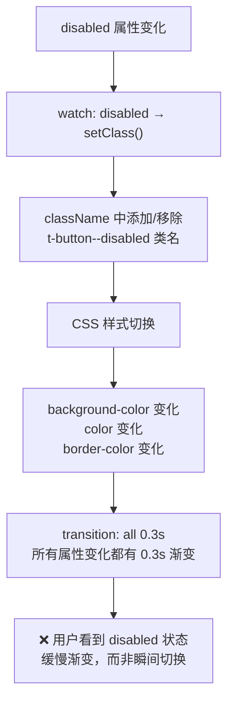

具体来说：

1. **Vue 组件层**：`button.vue` 中 `watch` 监听 `disabled` 变化 → 调用 `setClass()` → 动态添加/移除 `t-button--disabled` 类名

2. **CSS 层**：`t-button--disabled` 类名会改变以下属性（以 primary 主题为例）：
   - `color`: 正常色 → `@button-primary-disabled-color`
   - `background-color`: 正常色 → `@button-primary-disabled-bg`（`@brand-color-disabled`）
   - `border-color`: 正常色 → `@button-primary-disabled-border-color`

3. **过渡效果**：由于 `transition: all 0.3s` 的存在，上述 color/background/border 的变化会在 0.3 秒内平滑过渡，产生**渐变效果**

#### 为什么说是"突变"

Issue #4291 描述的应该是：**这个渐变效果本身就不符合预期**。对于 `disabled` 状态的切换，用户期望的是**瞬间**变为禁用态外观，而不是看到颜色慢慢渐变过去。这里所谓的"突变"可能是指：

- 在某些场景下（比如点击后立即 disable），用户能**明显感知**到颜色从正常态"慢慢褪色"到禁用态，体验不佳
- `transition: all` 过于粗暴，它不应该影响 disabled 状态切换，**本意只是为了 hover 按压态的过渡效果**

#### 解决方案

`transition: all 0.3s` 应该限定作用范围，而不是对所有属性生效。有两种方式：

**方案一：精确指定 transition 属性**（推荐）

```less
// 只对 hover 按压态需要的属性做过渡
transition: background-color 0.3s, border-color 0.3s;
```

**方案二：在 disabled 类上覆盖 transition**

```less
&.@{button}--disabled {
  transition: none;  // 禁用态不需要过渡动画
  // ...existing styles...
}
```

**方案三：结合两者**

```less
.@{button} {
  transition: background-color 0.3s, border-color 0.3s;

  &.@{button}--disabled {
    transition: none;
  }
}
```

#### 小结

| 属性 | 说明 |
|------|------|
| **问题根源** | `transition: all 0.3s`（button.less L250） |
| **触发方式** | `disabled` / `loading` / `theme` 等属性变化 → `setClass()` 动态切换类名 → CSS 属性变化被 transition 捕获 |
| **影响范围** | 所有 button 状态切换（disabled、loading、theme 切换等）都会有 0.3s 渐变 |
| **本意** | 仅为 hover 按压态提供平滑过渡 |
| **建议** | 将 `transition: all` 改为精确属性，或在 disabled 类上设置 `transition: none` |

## vue2 hx 模式要修改 index.html 中的 …

`2026-02-27`

vue2 hx 模式要修改 index.html 中的 favicon.icon、language 等，需要在 manifest.json 中配置 h5.template，否则不生效。

参考 https://uniapp.dcloud.net.cn/collocation/manifest.html#h5

## tdesign-uniapp-starter-vue3-…

`2026-02-26`

tdesign-uniapp-starter-vue3-hx 和 tdesign-uniapp-starter-vue2-hx 的预览应该也要上传。在 HBuilderX 中进行打包，切换到 docs 分支，将刚才的产物提交、push 即可。

## 链接分享

`2026-02-26`

https://github.com/Tencent/tdesign-miniprogram/pull/4282 form的样式，小程序并不稳定，要以 uniapp 自己的判断为准，miniprogram 的更新作为参考，校验完成后才能合。

## favicon.ico 需要使用远程的，而不是 stat…

`2026-02-26`

favicon.ico 需要使用远程的，而不是 static 目录下的，否则 GitHub pages 部署后找不到。

```diff
+ <link rel="icon" href="https://tdesign.tencent.com/favicon.ico" />
- <link rel="icon" href="/static/favicon.ico" />
```

## 图片笔记

`2026-02-26`


几个模板项目。

topic，包含 tdesign/tdesign-uniapp/uniapp/template/template-project/vue2/hbuilderx 等。

## 这个 MCP 确实有两个明显的问题：

`2026-02-22`

这个 MCP 确实有两个明显的问题：

### 问题一：没有生成中间文档（缺少文档预处理/中间层）

当前的 `get-component-docs` 工具（`docs.ts`）和 `get-component-source` 工具（`source.ts`）都是 **直接把原始的 Markdown 文档或 Vue 源码原封不动返回** 给 LLM 的。

以 `press-button` 为例，文档有 12KB，如果用户一次查询多个组件，比如表单页面涉及 `press-field`（14KB）、`press-form`（18KB）、`press-button`（12KB）等，token 消耗会非常大。

**应该做的**：在构建阶段预生成一份精简的「中间文档」，比如：
- 提取组件的 Props 表格、Events、Slots 等结构化信息
- 去掉示例代码中的冗余部分
- 生成一份 JSON 格式的 API 摘要

**这样 LLM 消耗的 token 少，响应更快也更准确**。

### 问题二：读取本地文件，NPM 包发布后无法使用

当前所有数据来源都是 **读取本地文件系统**：

```typescript
// helpers/index.ts
export function getDocsDir(): string {
  return path.join(getProjectRoot(), 'docs/components/press');
}

export function getPackagesDir(): string {
  return path.join(getProjectRoot(), 'src/packages');
}
```

`get-component-list` 用 `fs.readdir` 读目录、`get-component-docs` 用 `readLocalFile` 读 Markdown、`get-component-source` 用 `readLocalFile` 读 Vue 文件。

但看 `package.json` 的 `files` 字段只包含 `["dist", "README.md"]`，**文档和源码根本不会被打包进 npm 发布物里**。也就是说：

- ✅ **本地开发时可用**（因为文档和源码就在旁边的目录里）
- ❌ **通过 NPM 安装后完全不可用**（`dist/` 目录里不包含文档和源码，读取路径全部失效）

### 建议方案

有几种修复思路，你看想用哪种：

#### 方案 A：构建时内嵌（推荐）
在 `rollup` 构建阶段，把文档和源码的内容预处理后内嵌到 JS 产物中（比如生成一个 `data.json`），打包进 `dist/`。这样 NPM 发布后也能用，同时也顺带解决了中间文档的问题——可以在构建时做精简。

#### 方案 B：远程获取
把文档和源码部署到 CDN 或 API 服务，MCP 通过 HTTP 请求获取，而不是读取本地文件。

#### 方案 C：把文档也打包进 files
修改 `package.json` 的 `files` 字段，把 `docs/` 和 `src/packages/` 也包含进去，但这样会让包体积很大，而且还是没有中间文档精简的能力。

## mermaid 代码片段

`2026-02-14`

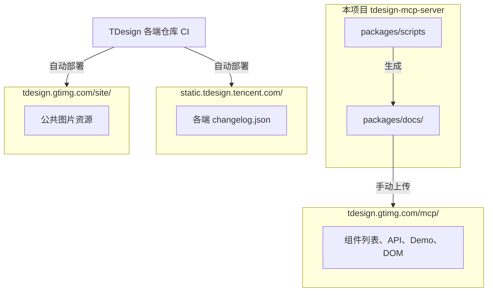


| CDN 地址 | 维护者 | 上传方式 |
|---------|-------|---------|
| `tdesign.gtimg.com/mcp/` | 本项目 | 手动上传 |
| `static.tdesign.tencent.com/` | TDesign 官方 | CI 自动部署 |
| `tdesign.gtimg.com/site/` | TDesign 官方 | CI 自动部署 |

## 6. 组件列表 https://tdesign.gtim…

`2026-02-14`

6. 组件列表 https://tdesign.gtimg.com/mcp/web-components.json

## 1. 组件列表 https://tdesign.gtim…

`2026-02-14`

1. 组件列表 https://tdesign.gtimg.com/mcp/tdesign-vue-next/index.json
2. dom 结构 https://tdesign.gtimg.com/mcp/tdesign-web-dom/avatar.html
3. 文档 https://tdesign.gtimg.com/mcp/tdesign-vue-next/button/api.md
4. 示例 https://tdesign.gtimg.com/mcp/tdesign-react/button/Demo.tsx，https://tdesign.gtimg.com/mcp/tdesign-vue-next/button/Demo.vue
5. changelog https://static.tdesign.tencent.com/vue-next/changelog.json

## plugin-light 中的类型修复，主要是在 tsc…

`2026-02-12`

plugin-light 中的类型修复，主要是在 tsconfig.json 中配置 `src/**/*.ts`，或者 `./**/*.d.ts` ，默认是继承自根目录下的 tsconfig.json，需要排除其他的。

## 两者的区别

`2026-02-11`

**两者的区别**

| 对比项 | `lib/index.esm.js` |`es/index.mjs`|
|--------|-------------------|----------------|
| **打包方式** | 单文件打包（所有代码打包在一起） | 保留源码结构（多文件） |
| **文件大小** | 较大（包含所有依赖） | 较小（入口文件） |
| **依赖处理** | 内部依赖已打包 | 依赖其他 `.mjs` 文件 |
| **加载方式** | 加载一个文件即可 | 需要加载多个文件 |
| **Tree Shaking** | 支持（但已打包） | 支持（更细粒度） |

 **潜在影响**

**优点：**
- 🌲 **更好的 Tree Shaking**：打包工具可以更精确地按需引入
- 📦 **更小的初始体积**：只加载入口文件，其他按需加载
- 🔧 **更灵活的优化**：打包工具可以对每个模块单独优化

**缺点：**
- ⚠️ **依赖关系复杂**：需要确保 `es/` 目录下的所有文件都正确发布
- ⚠️ **兼容性问题**：某些老旧的打包工具可能不支持 `.mjs` 扩展名
- ⚠️ **文件数量多**：需要发布整个 `es/` 目录

## 📊 产物对比表

`2026-02-11`

📊 产物对比表

| 产物 | 格式 | 目录结构 | 文件数量 | 使用场景 |
|------|------|----------|----------|----------|
| **lib/*.js** | CommonJS | 保留 | 多文件 | Node.js 环境 |
| **lib/index.esm.js** | ES Module | 单文件 | 1 个 | 现代打包工具（单文件） |
| **es/*.mjs** | ES Module | 保留 | 多文件 | 现代打包工具（按需引入） |

## 之前运行时的引入方式是 ，包体积大小：

`2026-02-11`

之前运行时的引入方式是 `import { xxx } from 't-comm/lib/xx/xx'`，包体积大小：


对 `t-comm` 改造，支持浏览器环境。业务中使用 `import { xxx } from 't-comm'` 后，包体积增加了 `30KB`。


尝试将 `package.json` 中的 `module` 由 `lib/index.esm.js` 改成 `es/index.mjs` 后，包体积恢复之前的大小：


## 为什么  没问题， 在浏览器中就有问题，是  做了什么吗

`2026-02-11`

为什么 `import * as fs from 'fs'` 没问题，`import { execSync, spawnSync } from 'child_process';` 在浏览器中就有问题，是 `vite` 做了什么吗

核心原因如下。

`fs` 和 `child_process` 都是 **Node.js 内置模块**，它们在浏览器环境中都是不存在的。但为什么表现不同呢？这主要是因为 **Vite（以及底层的 Rollup/esbuild）对不同模块的处理策略不同**。

1. `fs` 模块的处理

当你在浏览器代码中 `import * as fs from 'fs'` 时：

- **Vite 会自动将 `fs` 模块"空化"（shimmed/polyfilled）**
- 对于 `fs` 这类常见的 Node.js 模块，Vite/Rollup 默认会提供一个**空的 polyfill**
- 导入不会报错，但 `fs` 对象会是一个空对象 `{}`，调用任何方法都会失败

你可以验证：
```ts
import * as fs from 'fs';
console.log(fs); // 在浏览器中会输出 {} 或 undefined
```

2. `child_process` 模块的处理

而 `child_process` 模块：

- **Vite 默认不会为它提供 polyfill**
- 当你尝试导入时，打包工具找不到这个模块，就会直接报错
- 这是因为 `child_process` 涉及系统进程操作，根本无法在浏览器中模拟

3. Vite 的具体处理机制

Vite 使用了 `@rollup/plugin-node-resolve` 插件，它有一个 `browser` 字段处理逻辑：

```js
// Vite 内部大致的处理逻辑
{
  // 这些模块会被替换为空模块
  "fs": false,        // 被 shimmed 为空
  "path": "path-browserify",  // 有 polyfill
  "child_process": undefined  // 没有处理 → 报错
}
```

4. 为什么这样设计？

| 模块 | 浏览器 Polyfill | 原因 |
|------|----------------|------|
| `fs` | 空对象 `{}` | 某些库可能条件引入，空化可以避免打包失败 |
| `path` | `path-browserify` | 路径操作可以在浏览器模拟 |
| `child_process` | ❌ 无 | 进程操作完全无法模拟，直接报错更清晰 |

解决方案

如果你的代码中确实需要在浏览器中引用这些模块（比如共享代码），可以在 `vite.config.ts` 中配置：

```ts
export default defineConfig({
  resolve: {
    alias: {
      // 将 child_process 也替换为空模块
      'child_process': 'rollup-plugin-node-polyfills/polyfills/empty'
    }
  },
  // 或者使用 define 将其标记为外部模块
  define: {
    'process.env': {}
  }
})
```

或者使用条件导入：

```ts
// 只在 Node.js 环境中导入
if (typeof window === 'undefined') {
  const { execSync } = await import('child_process');
}
```

总结

| 问题 | 答案 |
|------|------|
| `fs` 为什么不报错？ | Vite 默认将其 shimmed 为空对象 |
| `child_process` 为什么报错？ | Vite 没有为它提供 polyfill |
| 是 Vite 做的吗？ | 是的，Vite + Rollup 的模块解析策略决定的 |

## - 难点，逆转化，多端适配，充分测试，e2e测试

`2026-02-10`

- 难点，逆转化，多端适配，充分测试，e2e测试
- Press UI 和 TDesign Uniapp 有哪些业务在使用，知名业务，影响力
- 带过哪些人，有8/9级的吗

## pnpm create uni 本质上是 pnpm ex…

`2026-02-08`

pnpm create uni 本质上是 pnpm exec create-uni 的简写，npm/pnpm/yarn 都遵循一个通用约定：

`[包管理器] create <name> ≈ [包管理器] exec create-<name>`

也就是说，当你执行 pnpm create uni 时，包管理器会自动：

1. 检查本地是否有 create-uni 包，没有则临时安装
2. 执行 create-uni 包中的可执行脚本（一般在 package.json 的 bin 字段定义）
3. 脚本执行脚手架的核心逻辑（拉取模板、初始化项目、交互配置等）

## 图片笔记

`2026-02-06`


活动报名模板

## 图片笔记

`2026-02-06`


社区内容模板、零售电商模板、组件库模板

## 流程图

`2026-02-05`

好的，这是将消息流程图转换为 Mermaid 格式：

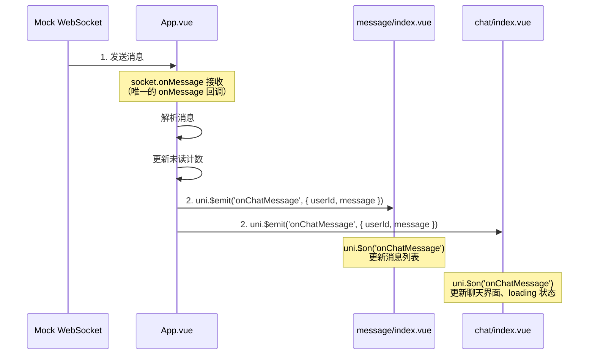

或者使用流程图格式：

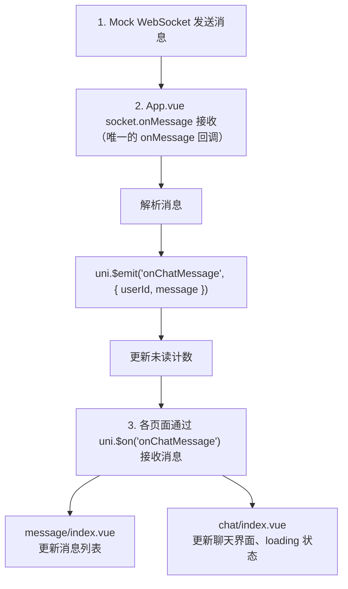

你可以根据需要选择使用时序图（sequenceDiagram）或流程图（flowchart）格式。

## - 走账号默认行为（可能是新面板也可能是旧面板）

`2026-02-04`

- 走账号默认行为（可能是新面板也可能是旧面板）
- 强制打开旧面板进行分享：页面访问需携带参数 _nsp=2
- 强制打开新面板进行分享：页面访问需携带参数 _nsp=1
- 如上场景下，切换不同的自定义分享信息正常

## 图片笔记

`2026-02-04`


Vue2 中数组类型的 prop，也要用函数返回。

## Vue2 组件中尽量不要用 _icon，_value, …

`2026-02-03`

Vue2 组件中尽量不要用 _icon，_value, _placement，一是有警告问题，二是有逻辑或显示问题，比如 guide 中对 _current 的 watch 失效，result 中 _icon 无法显示

## 语法对比

`2026-02-03`

语法对比

| 写法 | Vue 2 | Vue 3 |
|------|-------|-------|
| `v-model:visible="visible"` | ❌ 不支持 | ✅ 支持 |
| `:visible.sync="visible"` | ✅ 支持 | ❌ 已移除 |
| `:visible="visible" @update:visible="..."` | ✅ 支持 | ✅ 支持 |

使用 `:visible` + `@update:visible` 的手动绑定方式可以**同时兼容 Vue 2 和 Vue 3**。

## javascript 代码片段

`2026-02-03`

```javascript
newProps[key] = {
  type: [null, ...newType],
  default: null,
};
```

在 Vue 2 中，`type` 数组中包含 `null` 会导致 `Right-hand side of 'instanceof' is not an object` 错误，因为 Vue 2 会对 `type` 数组中的每个元素执行 `instanceof` 检查，而 `null` 不是一个有效的构造函数。

**解决方案**：将 `null` 从 `type` 数组中移除，只保留有效的类型构造函数。如果需要允许 `null` 值，可以通过 `default: null` 和 `validator` 来处理。
[编辑文件中]
已修复！将第 166 行的：

```javascript
type: [null, ...newType],
```

修改为：

```javascript
type: newType,
```

**原因说明**：
- Vue 2 在进行 prop 类型检查时，会遍历 `type` 数组并对每个元素执行 `instanceof` 检查
- `null` 不是一个有效的构造函数，所以 `value instanceof null` 会抛出 `Right-hand side of 'instanceof' is not an object` 错误
- Vue 3 对此做了处理，允许 `type` 中包含 `null`，但 Vue 2 不支持

修复后，`default: null` 仍然保留，这样 prop 的默认值依然是 `null`，只是类型检查时不再包含 `null`。

## 修复说明

`2026-02-01`

修复说明

1. 移除了 `"type": "module"`

当同时提供 ESM 和 CommonJS 两种格式时，不应设置 `type: module`，而应通过 `exports` 字段来声明不同格式的入口。

2. 修正了入口文件路径

- `main`: `dist/index.js` → `dist/index.cjs`（CommonJS 入口）
- `module`: `dist/index.mjs` → `dist/index.js`（ESM 入口，实际文件名）

3. 添加了 `exports` 字段

```json
"exports": {
  ".": {
    "import": {
      "types": "./dist/types/index.d.ts",
      "default": "./dist/index.js"
    },
    "require": {
      "types": "./dist/types/index.d.ts",
      "default": "./dist/index.cjs"
    }
  },
  "./dist/index.css": "./dist/index.css",
  "./style": "./dist/index.css"
}
```

这样 Node.js 和打包工具会根据导入方式自动选择正确的模块格式：

- ESM 项目（`import`）→ 使用 `dist/index.js`
- CJS 项目（`require`）→ 使用 `dist/index.cjs`

4. 添加了 `sideEffects` 字段

```json
"sideEffects": [
  "dist/index.css",
  "**/*.css"
]
```

告知打包工具 CSS 文件有副作用，防止被 tree-shaking 错误删除。

## - 正向先行断言，匹配后面紧跟pattern的位置，?=…

`2026-01-30`

- 正向先行断言，匹配后面紧跟pattern的位置，?=pattern
- 负向先行，匹配后面不紧跟…?!pattern
- 正向后行，匹配前面…?<pattetn
- 负向后行，匹配…?<!pattern

## 通过 scp 同步服务 nginx 配置，下载下来，改好…

`2026-01-30`

通过 scp 同步服务 nginx 配置，下载下来，改好，再上传，还有 git 记录。

## sh 代码片段

`2026-01-29`

```sh
pip3 install lizard -i http://pypi.douban.com/simple --trusted-host pypi.douban.com
```
```sh
lizard  -x "**/node_modules/*"
```

python2 装这个版本

```sh
pip install lizard==1.17.10
```

## pandoraShowEntrance

`2026-01-29`

pandoraShowEntrance

## css 尽量复用小程序端的

`2026-01-29`

css 尽量复用小程序端的

1. 小程序端和uniapp端样式部分差异小，相同部分远大于不同部分
2. css 难diff，一行一行的太分散，如果不复用的话，精确同步太费时间

既然要复用CSS

1. 其衍生出的文档中的 CSS 变量部分也要复用，或者生成变量的脚本复用
2. CSS 复制不是一次性工作，所以 uniapp 差异部分不要放在同一个文件里，单独拿出来或放到 vue 文件中

## td-uniapp 样式处理

`2026-01-29`

td-uniapp 样式处理

- 执行 notes/scripts/td/copy-less-files.js

## 不管分销转换产品、游戏还是其他维度，关键词TIP_STY…

`2026-01-29`

不管分销转换产品、游戏还是其他维度，关键词TIP_STYLE_NAME可以代替任何东西，凡是需要编译时进行单独打包的都可以用这个。

## pixui 中使用 vConsole 的卡点

`2026-01-29`

pixui 中使用 vConsole 的卡点

- parentElement
- initCustomEvent
- css variables

```js
return new CustomEvent(type, {
    detail,
    bubbles,
    cancelable
  })
```

## 图片笔记

`2026-01-29`


tsconfig.json用根目录的。

tdesign-miniprogram 依赖版本太低。

## 目前的构建包

`2026-01-28`

目前的构建包

包名|	作用
---|---
cherry-markdown.js<br/>cherry-markdown.min.js | 完整包，较大，包含cherry所有功能（工具栏、左侧编辑器、右侧预览器）
cherry-markdown.core.js	| 核心包，相比完整包，只少了mermaid功能，包大小小了50%以上（当然也可以在引入核心包后再传入mermaid，从而实现对mermaid的支持）
cherry-markdown.engine.core.js	| 解析引擎包，可以理解为只提供了将md解析成html的api

目标

在纯流式渲染的场景下，每个包都很大，希望再提供一个针对纯流式渲染场景的构建包，包里去掉：1、editor（编辑器组件，但可能要保留一个textarea）、toolbar（工具栏组件，包括顶部工具栏、侧边栏、悬浮目录）、mermaid（这个包太大了，引导用户自己引入就好了）

包名大概为：cherry-markdown.stream.js

确认排除的依赖：

- mermaid - 通过 rollup.stream.config.js 的 external 配置排除
- codemirror - 通过 rollup.stream.config.js 的 external 配置排除
- mathjax/katex - 没有打包进去，但在 Engine.js 中会动态加载（通过配置的 src 和 css）

## tdesign-vue-next/chat 中  用了 …

`2026-01-28`

tdesign-vue-next/chat 中 `chat-markdown` 用了 tdesign-web-components 中的 `chat-message/content/markdown-content`，后者又用了 cherry-markdown 中的 `dist/addons/cherry-code-block-mermaid-plugin` 和 `dist/cherry-markdown.core`，不止是 engine，是 core！

## 流程图

`2026-01-28`

`packages/cherry-markdown/src/core` 目录详解

📁 目录结构

```
core/
├── HookCenter.js          # 语法钩子注册中心
├── HooksConfig.js         # 默认钩子配置列表
├── SyntaxBase.js          # 行内语法基类
├── ParagraphBase.js       # 块级语法基类
├── SentenceBase.js        # 句子级钩子基类（已弃用）
└── hooks/                 # 具体语法钩子实现
    ├── 块级语法 (22个)
    └── 行内语法 (15个)
```

---

🎯 核心文件详解

1. HookCenter.js - 语法钩子注册中心

**作用**：管理所有 Markdown 语法钩子的注册、分类和优先级

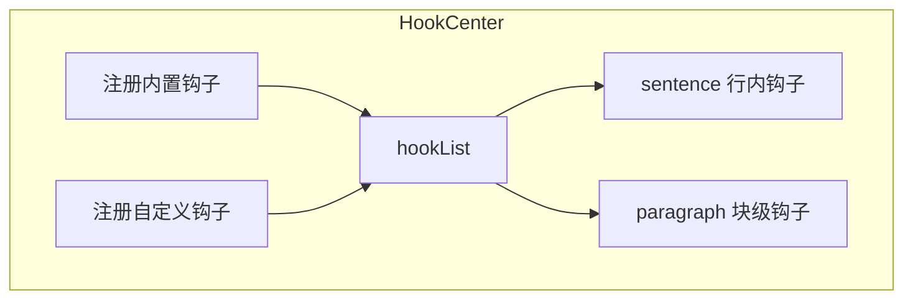

**核心功能**：
| 方法 | 说明 |
|------|------|
| `registerInternalHooks()` | 注册系统内置的语法钩子 |
| `registerCustomHooks()` | 注册用户自定义的语法钩子 |
| `register()` | 实际注册一个钩子实例 |
| `getHookList()` | 获取所有钩子（按类型分组） |

**关键逻辑**：
```javascript
// 钩子分为两类
this.hookList = {
  sentence: [],  // 行内语法钩子（如加粗、斜体）
  paragraph: [], // 块级语法钩子（如标题、代码块）
};
```

**自定义钩子支持**：
- 可以指定 `before`/`after` 插入位置
- 可以设置 `force: true` 覆盖同名内置钩子

---

2. HooksConfig.js - 默认钩子配置

**作用**：定义所有内置语法钩子的**加载顺序**

**执行顺序规则**：
- `beforeMakeHtml`：按数组顺序**正序**执行
- `makeHtml`：按数组顺序**正序**执行
- `afterMakeHtml`：按数组顺序**逆序**执行

**钩子加载顺序**：
```javascript
const hooksConfig = [
  // === 块级语法（先处理） ===
  FrontMatter,     // YAML 前置元数据
  CodeBlock,       // 代码块 ```
  InlineCode,      // 行内代码 `
  InlineMath,      // 行内公式 $
  MathBlock,       // 块级公式 $$
  AiFlowAutoClose, // AI 流式输出自动闭合
  HtmlBlock,       // HTML 块
  Footnote,        // 脚注 [^1]
  CommentReference,// 注释引用
  Transfer,        // 转义字符
  Br,              // 换行
  Table,           // 表格
  Toc,             // 目录
  Blockquote,      // 引用 >
  Header,          // 标题 #
  Hr,              // 水平线 ---
  List,            // 列表
  Detail,          // 折叠块 <details>
  Panel,           // 面板
  Paragraph,       // 普通段落

  // === 行内语法（后处理） ===
  Emoji,           // 表情 :smile:
  Image,           // 图片 
  Link,            // 链接 []()
  AutoLink,        // 自动链接
  Emphasis,        // 强调 *斜体* **粗体**
  BackgroundColor, // 背景色
  Color,           // 文字颜色
  Size,            // 字体大小
  Sub,             // 下标
  Sup,             // 上标
  Ruby,            // 注音
  Strikethrough,   // 删除线
  Underline,       // 下划线
  HighLight,       // 高亮
  Suggester,       // @ 提及
  Space,           // 连续空格
];
```

---

3. SyntaxBase.js - 行内语法基类

**作用**：所有**行内语法**钩子的基类（如加粗、斜体、链接）

**生命周期方法**：
```javascript
class SyntaxBase {
  // 在主渲染前预处理
  beforeMakeHtml(str) { return str; }

  // 核心渲染方法：Markdown → HTML
  makeHtml(str) { return str; }

  // 渲染后处理
  afterMakeHtml(str) { return str; }

  // 测试字符串是否匹配当前语法
  test(str) { return this.RULE.reg.test(str); }

  // 定义匹配规则（子类必须重写）
  rule(editorConfig) {
    return { begin: '', end: '', content: '', reg: new RegExp('') };
  }
}
```

**类型定义**：
```javascript
export const HOOKS_TYPE_LIST = {
  SEN: 'sentence',    // 行内语法
  PAR: 'paragraph',   // 块级语法
  DEFAULT: 'sentence',
};
```

---

4. ParagraphBase.js - 块级语法基类

**作用**：所有**块级语法**钩子的基类（如标题、代码块、表格）

**与 SyntaxBase 的区别**：
| 特性 | SyntaxBase | ParagraphBase |
|------|------------|---------------|
| 类型 | sentence | paragraph |
| 缓存机制 | ❌ | ✅ |
| 换行处理 | ❌ | ✅ |
| 行号计算 | ❌ | ✅ |

**缓存机制**：
```javascript
// 缓存用于提升性能，避免重复渲染
pushCache(str, sign, lineCount)  // 存入缓存
popCache(sign)                   // 取出缓存
restoreCache(html)               // 还原所有缓存
checkCache(wholeMatch, ...)      // 检查是否命中缓存
```

**缓存键格式**：
```
~~C${cacheCounter}I${sign}_L${lineCount}$
例如：~~C0Iabc123_L5$
```

**换行处理**：
```javascript
// 经典模式 vs 现代模式
this.classicBr = true;  // 一个换行被忽略，两个换行分段
this.classicBr = false; // 一个换行变<br>，两个换行分段
```

---

5. SentenceBase.js - 句子级基类（已弃用）

**作用**：早期版本的钩子基类，现已基本弃用

```javascript
class HookBase {
  getType() {
    const typeList = { 1: 'sentence', 2: 'paragraph', 3: 'page' };
    return typeList[this.HOOKTYPE] || 'sentence';
  }
}
```

---

📂 `hooks/` 子目录 - 具体语法实现

块级语法钩子（22个）

| 文件 | 钩子名 | 语法示例 | 说明 |
|------|--------|----------|------|
| Header.js | `header` | `# 标题` | 支持 ATX（#）和 Setext（===）两种风格 |
| CodeBlock.js | `codeBlock` | ` ```js ` | 支持语法高亮、行号、复制、展开、自定义渲染器 |
| Table.js | `table` | `\|a\|b\|` | 支持对齐、图表渲染（ECharts）|
| List.js | `list` | `- item` | 支持有序、无序、任务列表、多种样式 |
| Blockquote.js | `blockquote` | `> 引用` | 引用块 |
| MathBlock.js | `mathBlock` | `$$ ... $$` | 块级数学公式（MathJax/KaTeX）|
| Footnote.js | `footnote` | `[^1]` | 脚注 |
| Toc.js | `toc` | `[[toc]]` | 自动生成目录 |
| Hr.js | `hr` | `---` | 水平分割线 |
| Br.js | `br` | 换行 | 换行处理 |
| HtmlBlock.js | `htmlBlock` | `<div>` | HTML 块级元素 |
| FrontMatter.js | `frontMatter` | `---\nyaml\n---` | YAML 元数据 |
| Panel.js | `panel` | 自定义面板 | 信息/警告/错误面板 |
| Detail.js | `detail` | `<details>` | 可折叠内容 |
| Paragraph.js | `paragraph` | 普通文本 | 普通段落（兜底） |
| CommentReference.js | `commentReference` | `[ref]: url` | 全局引用定义 |
| Transfer.js | `transfer` | `\*` | 转义字符处理 |
| AiFlowAutoClose.js | `aiFlowAutoClose` | - | AI 流式输出自动闭合 |
| InlineCode.js | `inlineCode` | `` `code` `` | 行内代码（在块级处理）|
| InlineMath.js | `inlineMath` | `$x^2$` | 行内公式（在块级处理）|

行内语法钩子（15个）

| 文件 | 钩子名 | 语法示例 | 说明 |
|------|--------|----------|------|
| Emphasis.js | `fontEmphasis` | `**粗体**` `*斜体*` | 支持 * 和 _ 两种符号 |
| Image.js | `image` | `!alt` | 支持扩展属性、视频/音频 |
| Link.js | `link` | `text` | 支持 target 属性 |
| AutoLink.js | `autoLink` | `https://...` | 自动识别 URL |
| Strikethrough.js | `strikethrough` | `~~删除~~` | 删除线 |
| Underline.js | `underline` | - | 下划线 |
| HighLight.js | `highLight` | `==高亮==` | 文字高亮 |
| Color.js | `color` | - | 文字颜色 |
| BackgroundColor.js | `backgroundColor` | - | 背景颜色 |
| Size.js | `size` | - | 字体大小 |
| Sub.js | `sub` | `H~2~O` | 下标 |
| Sup.js | `sup` | `X^2^` | 上标 |
| Ruby.js | `ruby` | - | 注音（ruby 标签）|
| Emoji.js | `emoji` | `:smile:` | 表情符号 |
| Suggester.js | `suggester` | `@user` | @ 提及/智能建议 |
| Space.js | `space` | 多个空格 | 连续空格保留 |
| SuggestList.js | - | - | Suggester 的辅助模块 |
| Emoji.config.js | - | - | Emoji 配置数据 |

---

🔄 语法解析流程

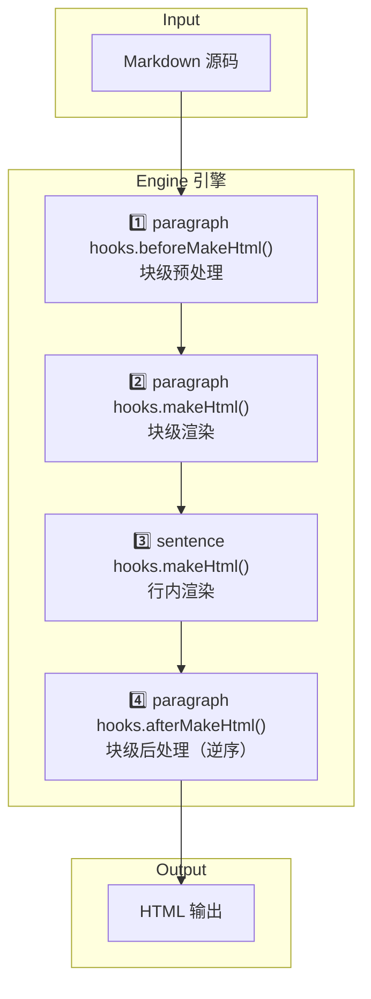

---

🛠️ 如何创建自定义语法钩子

1. 行内语法示例

```javascript
import SyntaxBase from '@/core/SyntaxBase';

class MyInlineHook extends SyntaxBase {
  static HOOK_NAME = 'myInline';

  makeHtml(str) {
    return str.replace(/\[\[(.+?)\]\]/g, '<mark>$1</mark>');
  }

  rule() {
    return {
      begin: '\\[\\[',
      content: '(.+?)',
      end: '\\]\\]',
      reg: /\[\[(.+?)\]\]/g,
    };
  }
}
```

2. 块级语法示例

```javascript
import ParagraphBase from '@/core/ParagraphBase';

class MyBlockHook extends ParagraphBase {
  static HOOK_NAME = 'myBlock';

  constructor() {
    super({ needCache: true }); // 启用缓存
  }

  makeHtml(str, sentenceMakeFunc) {
    return str.replace(/:::(\w+)\n([\s\S]+?)\n:::/g, (match, type, content) => {
      const { html } = sentenceMakeFunc(content);
      return this.pushCache(`<div class="${type}">${html}</div>`, this.sign);
    });
  }
}
```

---

📊 核心类继承关系

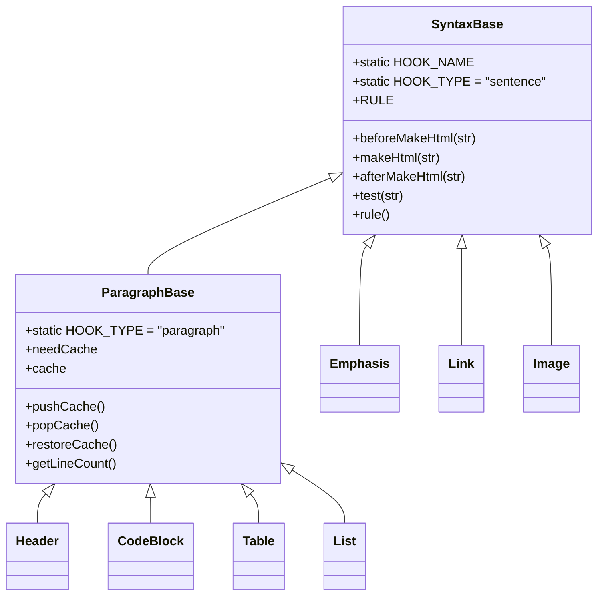

---

📝 总结

`core` 目录是 Cherry Markdown 的**语法解析核心**：

1. **HookCenter** - 统一管理所有语法钩子的注册和调度
2. **HooksConfig** - 定义语法处理的优先级顺序
3. **SyntaxBase** - 行内语法的基类（轻量、无缓存）
4. **ParagraphBase** - 块级语法的基类（支持缓存、行号计算）
5. **hooks/** - 37 个具体语法实现

**设计亮点**：
- 🔌 **插件化**：支持自定义语法扩展
- ⚡ **高性能**：块级语法支持缓存
- 🎯 **优先级**：通过配置数组控制处理顺序
- 🔄 **生命周期**：`beforeMakeHtml` → `makeHtml` → `afterMakeHtml`

## mermaid 代码片段

`2026-01-28`

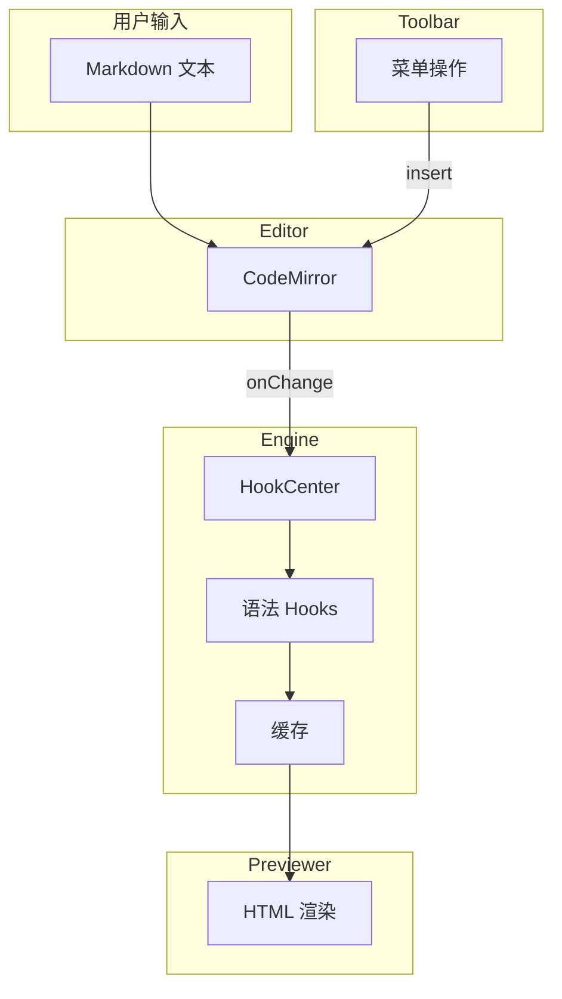

## 方法永远可以做到不私密，如果存在私密的方法，那么可以拆分…

`2026-01-28`

方法永远可以做到不私密，如果存在私密的方法，那么可以拆分出不私密的方法和私密的变量。

真正私密的永远是配置信息、密钥等常量，所以上面的方式永远有效。

## plugin-light-const 的定位：

`2026-01-28`

plugin-light-const 的定位：

1. 放配置信息、常量定义，比如 getCdnList
2. 有点私密，不方便放 t-comm 里
3. 如果是需要运行时和编译时都需要的函数，放到 t-comm 里，而不是 project-config-const 中

## 链接分享

`2026-01-27`

https://github.com/dcloudio/uni-app/issues/3793 这个评论不错，提到了 rpx 在uniapp H5 中的转换

## 要验证 PR 的改动（pkg.pr.new），或者 np…

`2026-01-26`

要验证 PR 的改动（pkg.pr.new），或者 npm 包内容

1. 进入工程，`cd packages/tdesign-uniapp/example`
2. 去掉 `vite.config.ts` 中 `alias` 的配置
3. 装包，如 `pnpm i https://pkg.pr.new/Tencent/tdesign-miniprogram/tdesign-uniapp@4201`
4. 执行 `dev` 等命令，如 `npm run dev:h5`

## 流程图

`2026-01-26`

demo 同步

一次性工作。

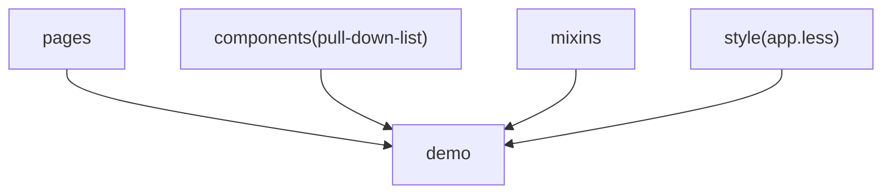

这部分是从 `vue3-cli` 同步到 `app/vue2-cli` 等目录中的。

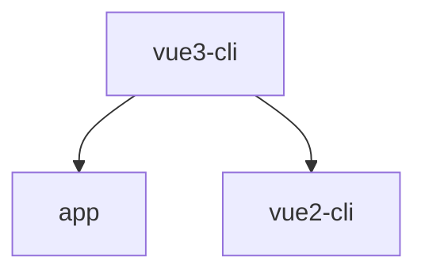

需要监听的部分，主要是组件和示例，组件目标是 `_tdesign`，或者 `uni_modules/tdesign-uniapp` 下。

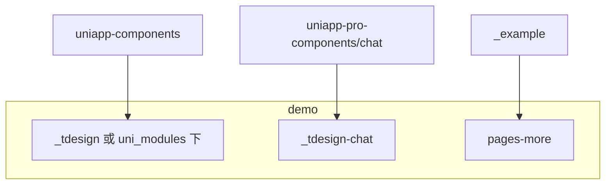

这部分是从 `uniapp-components` 等同步到 `vue3-cli/app/vue2-cli` 等目录中的。

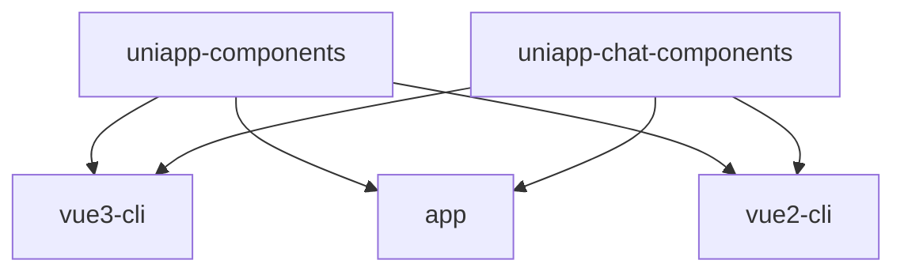

每个项目独特的部分

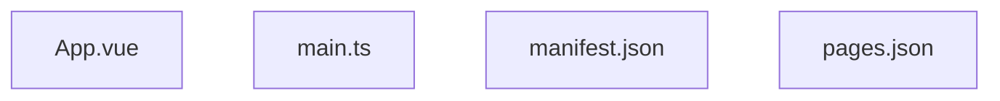

## 小程序长按图片，保存图片没反应？

`2026-01-26`

小程序长按图片，保存图片没反应？

原因是没返回签名地址，比较坑的是没有提示。

- 错误的：https://gamelife-1251917893.igcdn.cn/hpmatch/hpmatch_F6dFij4NT8R5.jpg
- 正确的：https://gamelife-1251917893.igcdn.cn/hpmatch/hpmatch_F6dFij4NT8R5.jpg?q-sign-algorithm=sha1&q-ak=xx&q-sign-time=xx&q-key-time=xx&q-header-list=host&q-url-param-list=&q-signature=xx

## - https://github.com/Tencent…

`2026-01-26`

- https://github.com/Tencent/tdesign-miniprogram/pull/4112/changes
- https://github.com/Tencent/tdesign-miniprogram/pull/4124/changes

这两个还要再看下

## td-mini 同步 td-uniapp 的步骤：

`2026-01-26`

td-mini 同步 td-uniapp 的步骤：

1. 可选，在 td-mini 大仓下进行 build 脚本的改造，去掉 `jsmin/jsonmin/wxmlmin` 的使用
2. 执行 `npm run build`（或者 `npm run build -- --ignore-terser`），生成 `_example` 目录
3. 复制 `_example` 目录到 `mini-to-uni` 工程下，进行覆盖
4. 可选，删除之前的 `_example_uni`
5. `mini-to-uni` 工程下执行 `node ./bin/wtu -i ./_example` 进行 uniapp 组件生成
6. 手动 diff，结合 PR，Git 记录，更新 td-uniapp 组件库

## 需要加上 ，否则边框位置不对。

`2026-01-26`

`1.t-grid-item__content--left` 需要加上 `width: 100%;box-sizing: border-box;`，否则边框位置不对。


## 要将所有的 :deep 改成 custom-style，…

`2026-01-26`

要将所有的 :deep 改成 custom-style，工作量有点大，退而求其次，只在组件 less 中加 :deep，不加、不删、不改其他样式。有改动的，记录下来，比如 dialog.less 的改动如下：


## 其实用  也是有兼容性问题的，Vue2 需要换，不如直接…

`2026-01-25`

其实用 `:deep(xx)` 也是有兼容性问题的，Vue2 需要换，不如直接用 customStyle

## packages/tdesign-uniapp/app/…

`2026-01-25`

packages/tdesign-uniapp/app/ 待删除

## 为什么小程序样式覆盖需要用 ，而 H5 不需要？

`2026-01-25`

为什么小程序样式覆盖需要用 `:deep`，而 H5 不需要？

原因是 H5 中节点会合并，或者说会替换成真正的子组件节点，可以看到下面的 `uni-button` 有两个 `data-v-xx`，而小程序不是。


## 贡献指南；mini-to-uniapp commit

`2026-01-25`

贡献指南；mini-to-uniapp commit

## td-uniapp 的难点，一是宏观，架构搭建、监听体系…

`2026-01-25`

td-uniapp 的难点，一是宏观，架构搭建、监听体系、更新策略，二是微观，又可分为实现原理和细节。实现上，对几十个组件了如指掌、如数家珍，不同端的兼容性、差异性有不同的处理策略，细节上，对每个组件的还原效果、深色模式、色值等效果对齐，抠每一处细节。

## vue2+cli/vue3+cli/vue2+hx/vu…

`2026-01-25`

vue2+cli/vue3+cli/vue2+hx/vue3+hx 组件基础示例，vue3+cli/vue3+hx 社区模板；chat mr 合入；eslint问题；src/api合入

## 今日已同步 td-mini 最新改动 v1.12.2（2…

`2026-01-25`

今日已同步 td-mini 最新改动 v1.12.2（2026-01-21）。不含 chat。

## td-uniapp 中的示例页面，加上 demo-nav…

`2026-01-25`

td-uniapp 中的示例页面，加上 demo-navbar 类名，就是白底黑色，否则就是透明底默认颜色。

```css
.demo-navbar {
  --td-navbar-bg-color: var(--td-bg-color-container);
  --td-navbar-color: var(--td-text-color-primary);
}
```

## 这个 issue 有意思，https://github.…

`2026-01-25`

这个 issue 有意思，[https://github.com/Tencent/tdesign-miniprogram/issues/3986](https://github.com/Tencent/tdesign-miniprogram/issues/3986)。

```ts
export function getMonthByOffset(date, offset) {
  const _date = new Date(date);
  _date.setMonth(_date.getMonth() + offset);
  return _date;
}
```

`getMonthByOffset(value, n)`，如果 value + n 月那一天没有 dd, 则会自动进入下一个月，也就是value+n+1。比如 10月31日 + 1月，会被处理成 12月，正常应该是 11 月。

## 流程图

`2026-01-20`

批量发布流程

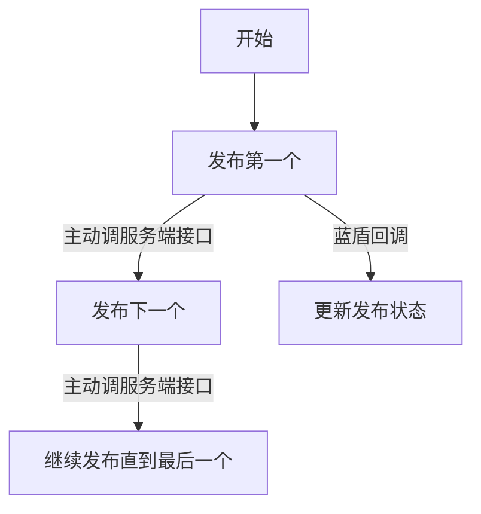

## 批量发布的核心字段 batchUpload，1. ser…

`2026-01-20`

批量发布的核心字段 batchUpload，1. server 传给流水线、流水线再回传给 server 2. 操作日志 operation 的 batchUpload 只做留存，无实际作用

## 操作记录 operation 的设计哲学应该是 1 有唯…

`2026-01-20`

操作记录 operation 的设计哲学应该是 1 有唯一的 pipelineId、pipelineRunId，且不应该变化 2. 不同类型的操作日志应该有统一的字段，类似于抽象类。

## 将 regionSelect 的 regionOptio…

`2026-01-17`

将 regionSelect 的 regionOptions 改为受控，当搜索时，之前的 selected 不在 regionOptions 时，就更新 selected。这样可以在 搜到一个值，不点选择，直接点外层确定也不会违反直觉。

search 输入框和 select 的回显用一个，即都是 input，这个之前的逻辑不变。

handleSelect 时，更新 searchValue 为选中的值，这个之前的逻辑不变。

展示 dropdown 时，清空 searchValue，来展示所有 regionOptions，这个之前的逻辑不变。

## monorepo 仓库的每次提交都应该只改动一个子包的，…

`2026-01-15`

monorepo 仓库的每次提交都应该只改动一个子包的，让 commit 信息更聚焦，生成的 changelog 更易读。
