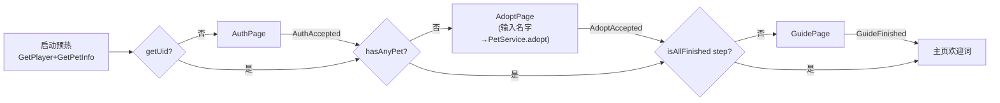

## 1. 修改清单

| 文件 | 动作 | 说明 |
|---|---|---|
| `AdoptPage.ts` | **新增** | 全屏领养页：米黄背景 + 标题/副标题 + 昵称 `EditBox`（1~12 字符）+ 主按钮 `PrimaryButton`；点击后调 `PetService.ins.adopt(nick)`，成功后 `refresh()` + 派发 `EventName.AdoptAccepted` + 关页 |
| `UIConfig.ts` | 修改 | 新增 `UIID.Adopt`（System 层，和 Auth 同层级，授权后未领养时全屏拦截） |
| `EventName.ts` | 修改 | 新增 `EventName.AdoptAccepted`（专用流程事件，避免和通用业务事件 `PetAdopted` 混用） |
| `Game.ts` | 修改 | `_registerUIs` 里追加 `UIID.Adopt` 工厂注册 |
| `GooseHomeApp.ts` | 修改 | 把 `_gateAuthAndGuide` 重构为 `_gateBootFlow` 三段流水线 |

## 2. 启动流程对照

**改造前**（只有两段，丢了"输入名字"）：
```
isUnauthorized? → Auth → AuthAccepted → Guide → Home
```

**改造后**（三段独立全屏页，每段一个独立事件）：


## 3. 关键判定的拆分

- **判断"是否授权"**：`PlayerService.ins.getUid()`（之前用 `isUnauthorized()` 这个二合一布尔，把"未登录"和"未领养"混在一起判，正好导致领养页被吞掉）
- **判断"是否领养"**：`PetService.ins.hasAnyPet()`
- **判断"引导是否完成"**：`isAllFinished(PlayerService.ins.getGuideStep())`

`isUnauthorized()` 仍保留并作为"启动预热一次"调用——它内部会顺手把 `GetPlayer` + `GetPetInfo` 都拉一遍并落到对应单源 service，正好供后面三段判定就近读。

## 4. 注意事项

1. **AdoptPage 仍是占位 UI**（和 AuthPage 同档次）：米黄底 + 直角描边输入框 + 主按钮。后续视觉同学给 figma 后切图替换即可，现在不阻塞流程。
2. **`PetService.adopt` 是幂等的**（服务端已领养会返回已有宠物），所以"刷新即可恢复"——不会因为重复点出二号宠物。
3. **昵称传给服务端**就是用户输入；如果服务端配置了默认名兜底，前端这里仍然做了 1~12 字符的本地校验，避免空白名提交。
4. 主页 `handleFeed` 那块已有的 `PetService.feed → refresh` 模式不动，和领养页的"调接口后 refresh"保持一致。
