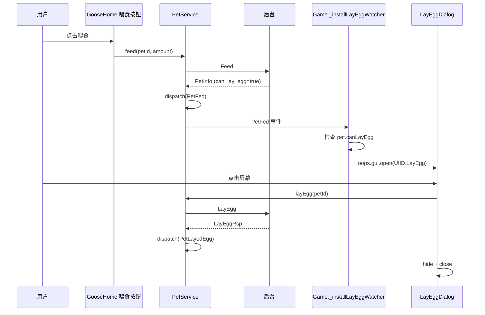

<!-- ## ✅ 已完成：喂饱收蛋自动弹窗 -->

### 1. 新建 `LayEggDialog.ts`（简单占位版）

- 全屏 80% 黑蒙层（用 `cc.Graphics` 纯色填充，符合"弹窗蒙层必须用 Graphics"规范）
- 居中：`哇！吃饱超开心，收获鹅蛋` + 🥚 emoji + `N 个` + `点击屏幕继续`
- **全屏 TOUCH_END** 监听 → 调 `PetService.ins.layEgg(petId)` → `oops.gui.close`
- `busy` 标志防双击；命名后缀 `Dialog` 符合规范
- ⚠️ 注释中明确标注："运行时绘制的占位版本，后续替换为美术 prefab"

### 2. `UIConfig.ts`

- 新增 `UIID.LayEgg`
- 默认层级 `LayerType.Dialog`（盖在主页 PopUp 之上）

### 3. `Game.ts`

- import `LayEggDialog` / `PetService`
- `_registerUIs()` 中注册 `UIID.LayEgg → LayEggDialog.build(parent)`
- 新增 `_installLayEggWatcher()`，在 `bootstrap` 启动业务服务之后立刻挂载：
  - 监听 `EventName.PetInfoLoaded`（进主页拉到信息后）
  - 监听 `EventName.PetFed`（每次喂食后）
  - 监听 `EventName.PetAdopted`（领养后，兼容）
  - 命中 `pet.canLayEgg === true` → `oops.gui.open(UIID.LayEgg)`
- 幂等：`_layEggWatcherInstalled` 标志 + `oops.gui.open` 内部复用同一 view
- 新增控制台调试方法：`__game.debugLayEgg(3)`

### 4. 触发链路（mermaid）



### 5. 后续工作（交给后面的人）

1. 用美术的蛋发光资源、鹅吃完图、`收蛋` 标题切图替换占位 `🥚` emoji 和文本
2. 服务端 `LayEggRsp` 加蛋数量字段后，`PetService.layEgg` 把数量塞到 `dispatch(PetLayedEgg, { count })`，再由 Watcher 透传给弹窗 `show({ count })`
3. 把 toast 出现同时播放"收蛋动效"（设计稿底部备注）—— 后续 `PetLayedEgg` 事件挂个 SE

### 6. 测试方式

控制台：
```js
__game.debugLayEgg(3)   // 直接看弹窗 UI（不走后台）
__game.debugFeed()      // 走 mock，喂到满会触发自动弹窗
```
