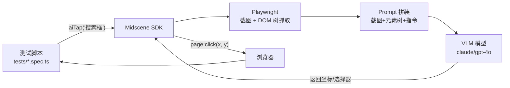
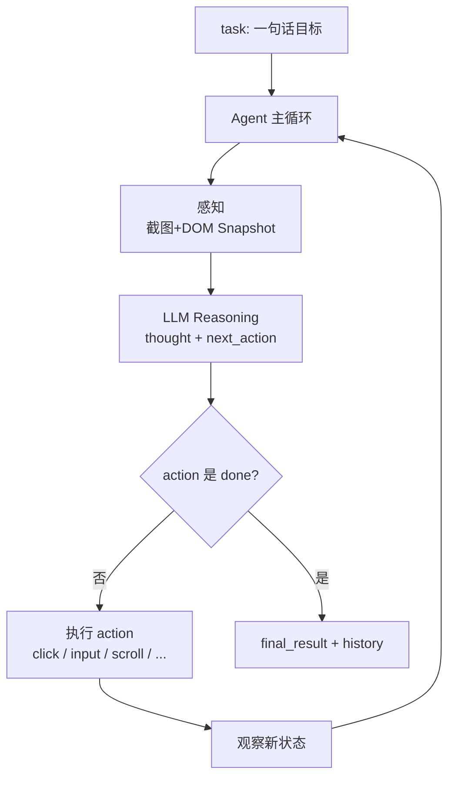

<!-- # Browser-Use vs Midscene 核心原理对比 -->

> 本文档结合 [`ai-e2e-platform`](../README.md) 中两条平行实验线（[`tests/`](../tests/) 用 Midscene，[`browser-use-lab/`](../browser-use-lab/) 用 Browser-Use），从架构原理层面拆解二者的根本差异，帮助选型与排错。

## 一、TL;DR（一句话总结）

| 项目            | 一句话定位                                                                                                               |
| --------------- | ------------------------------------------------------------------------------------------------------------------------ |
| **Midscene**    | **「AI as a Library」**——把 LLM 包装成 Playwright 上的 `aiTap / aiQuery / aiAssert` 等**原子方法**，由测试代码主导流程。 |
| **Browser-Use** | **「AI as an Agent」**——给一句目标，由 LLM 在 ReAct 循环里**自主决策**每一步动作直到 `done`。                            |

> 核心分歧不在"用哪个模型"，而在 **谁来决定执行路径**：人写的脚本，还是模型自己。

---

## 二、架构对比图

### 2.1 Midscene：指令式（脚本驱动 + 单步 AI 调用）



特点：**一次 ai\* 调用 = 一次模型请求 = 一个原子动作**，控制流仍在用户的 `await`/`expect` 里。

### 2.2 Browser-Use：Agent 自治（ReAct 循环）



特点：**整个任务一次启动**，模型在循环里反复"看-想-做-看"，直到自己宣布完成或达到 `max_steps`。

---

## 三、八大核心维度对比

| 维度           | **Midscene**                                                       | **Browser-Use**                                                                            |
| -------------- | ------------------------------------------------------------------ | ------------------------------------------------------------------------------------------ |
| **控制流归属** | **代码** 决定步骤顺序，AI 只负责"这一步具体怎么点"                 | **Agent** 决定步骤顺序，代码只给一个高层目标                                               |
| **粒度**       | 原子级：`aiTap` / `aiInput` / `aiQuery` / `aiAssert` / `aiWaitFor` | 任务级：`Agent(task=...).run()`                                                            |
| **感知方式**   | **截图 + DOM 树**（`hybrid` 模式）混合喂给模型，可定位到精确元素   | **截图 + 可交互元素索引**（DOMTree → 编号 0/1/2...）以"序号点击"避免坐标漂移               |
| **输出契约**   | 模型输出**坐标/选择器/JSON**，由 SDK 翻译成 Playwright 调用        | 模型输出**结构化 action 列表**（`{click:{index:3}}`、`{input:{...}}`），由 Controller 执行 |
| **循环机制**   | 无循环，每条 `await ai*()` 互相独立，前后强一致                    | **ReAct 循环**：thought → action → observation → thought ...                               |
| **失败处理**   | 失败=该行 `aiAssert` 抛异常，**定位到行号**                        | 失败=Agent 自己决定"换路再试 / 滚动找 / 放弃"，需要看 `history.json` 复盘                  |
| **token 消耗** | 低：每个动作 1 次模型调用                                          | 高：每步都喂截图 + 历史，**N 步 ≈ N 次截图调用**                                           |
| **可重现性**   | 高：脚本化，路径稳定                                               | 低：同一 task 重跑 3 次可能走 3 条不同路径                                                 |
| **典型用途**   | **回归测试 / 视觉断言 / 结构化抽取**                               | **探索测试 / 冒烟 / 自动化爬取 / 自然语言任务**                                            |

---

## 四、原理深挖

### 4.1 Midscene 的「视觉定位」原理

Midscene 的 `aiTap('搜索赛事名称的搜索框')` 内部分三步：

1. **抓页面状态**：Playwright 截图 + 抓 DOM 节点树（带 bbox、text、role）；
2. **Prompt 注入**：把截图 + DOM 文本 + 你的自然语言一起送给 VLM；
3. **解析输出**：模型返回**目标元素的坐标或 id**，SDK 翻译成 `page.mouse.click(x, y)` 或 `page.locator(...).click()`。

> 由于 DOM 树同时被喂入，模型在"和平精英"这种纯文本目标上不需要纯视觉 OCR，准确率比纯截图方案高。这就是 [`tests/gp-next-ai.spec.ts`](../tests/gp-next-ai.spec.ts) 里 `aiQuery` 能稳定抽出卡片标题的根本原因。

**关键约束**：Midscene **不会**自己决定"我要不要先滚动"或"是不是该等一下"——这些必须你在测试代码里用 Playwright 原生 API 写好（参见我们项目里的 `page.getByText(...).waitFor()` 兜底）。

### 4.2 Browser-Use 的「Agent ReAct」原理

Browser-Use 跑的是经典的 **ReAct (Reason + Act) 循环**：

```python
# 伪代码（实际见 browser_use/agent/service.py）
while step < max_steps:
    state = browser.get_state()           # 截图 + 编号过的可交互元素
    prompt = build_prompt(task, state, history)
    output = llm.chat(prompt)             # {thought, actions:[...]}
    if output.actions[0] == "done":
        break
    for action in output.actions:
        controller.execute(action)        # click / input / scroll / navigate
    history.append(state, output)
```

这里有几个关键设计：

1. **元素编号化**：每次截图后，Browser-Use 在 DOM 上给所有可交互元素打**数字编号**（叠加在截图上），模型只需要输出 `{click: {index: 7}}`，**避免了模型直接出坐标的不稳定**。
2. **Action Schema**：模型输出严格走 JSON Schema（`navigate / click / input / scroll / done / extract_content / ...`），由 Controller 派发，不让模型自由发挥执行字符串。
3. **历史压缩**：随着步数增加，旧的截图会被压缩成文本摘要，控制上下文长度。
4. **`initial_actions` 旁路**：像我们 [`browser-use-lab/tasks/_shared.py`](../browser-use-lab/tasks/_shared.py) 里那样，**确定性的步骤（鉴权 URL → 业务 URL）走 `initial_actions`，不消耗 token、不进决策循环**——这是 Agent 系统典型的"绕过 LLM"优化。

### 4.3 一张图看清楚两边的"模型调用次数"

```
Midscene ─────────────────────────────
  test 用例:
    aiAssert(...)   ──► 1 次 LLM 调用
    aiQuery(...)    ──► 1 次 LLM 调用
    ai('点搜索框')   ──► 1 次 LLM 调用
    ai('输入+点击') ──► 1 次 LLM 调用
                    总计 ≈ 4 次

Browser-Use ──────────────────────────
  Agent(task='搜索和平精英').run()
    step 1  截图+思考+点击搜索框   ──► 1 次 LLM 调用
    step 2  截图+思考+滚动看清楚   ──► 1 次 LLM 调用 ⚠️ 可能多余
    step 3  截图+思考+输入文字     ──► 1 次 LLM 调用
    step 4  截图+思考+点搜索按钮   ──► 1 次 LLM 调用
    step 5  截图+思考+done         ──► 1 次 LLM 调用
                    总计 ≈ 5~10+ 次（每次都带截图）
```

> 我们项目 `.cache/llm-proxy/` 里那一堆 50KB ~ 200KB 的 JSON 就是 Browser-Use 跑出来的截图调用，对比 Midscene 的明显小一截。

---

## 五、本项目实测对照（基于 [`gp-next-ai.spec.ts`](../tests/gp-next-ai.spec.ts) vs [`browser-use-lab/tasks/02_search_keyword.py`](../browser-use-lab/tasks/02_search_keyword.py)）

| 实测项                 | Midscene                              | Browser-Use                                      |
| ---------------------- | ------------------------------------- | ------------------------------------------------ |
| 完成"搜索和平精英"用例 | ~3 次 ai 调用，约 25s                 | ~6-10 step，约 60-90s                            |
| 失败时的产物           | 行号 + 截图 + Midscene 报告 HTML      | `history.json` + `replay.gif` + 自定义 HTML 报告 |
| 路径稳定性             | 每次都走相同步骤                      | 偶尔会自己滚一下、点错按钮再返回                 |
| 写代码心智             | 像写 Playwright，但选择器换成自然语言 | 像写 Prompt，几乎不写代码                        |
| Debug 难度             | 低（行级定位）                        | 中高（要看 Agent 思考链）                        |

---

## 六、选型建议

### 选 Midscene 当：

- ✅ 做**回归测试 / CI 流水线**：需要可复现、好定位、token 可控；
- ✅ **结构化数据抽取**（`aiQuery<T>()`）：把页面变成类型化 JSON；
- ✅ 已有 Playwright 沉淀，想**渐进式引入 AI**；
- ✅ 团队主要是 **QA / 前端**，习惯写 spec 文件。

### 选 Browser-Use 当：

- ✅ 做**探索性测试 / 冒烟**：写不出确定步骤，只能描述目标；
- ✅ **开放任务自动化**："去 X 网站找 Y 信息填到 Z 表单"；
- ✅ 需要 Agent **跨页跳转、自主纠错**；
- ✅ 团队主要是 **AI/Python 背景**，习惯写 prompt。

### 也可以混用（推荐）

我们项目的最终形态可能是：

```
┌─ Midscene  (tests/)         ──► 主回归库，CI 必跑
└─ Browser-Use (browser-use-lab/) ──► 周期性巡检 / 探索新页面
```

两边共用同一个 **Knot OpenAI 兼容代理**（`127.0.0.1:3939/v1`，见 [`scripts/proxy-server.ts`](../scripts/proxy-server.ts)），账单和模型切换都集中在一处。

---

## 七、一句话记忆点

> **Midscene 是给 Playwright 装上眼睛；Browser-Use 是给浏览器装上大脑。**
> 一个让你写得更少，一个让你想得更少。
