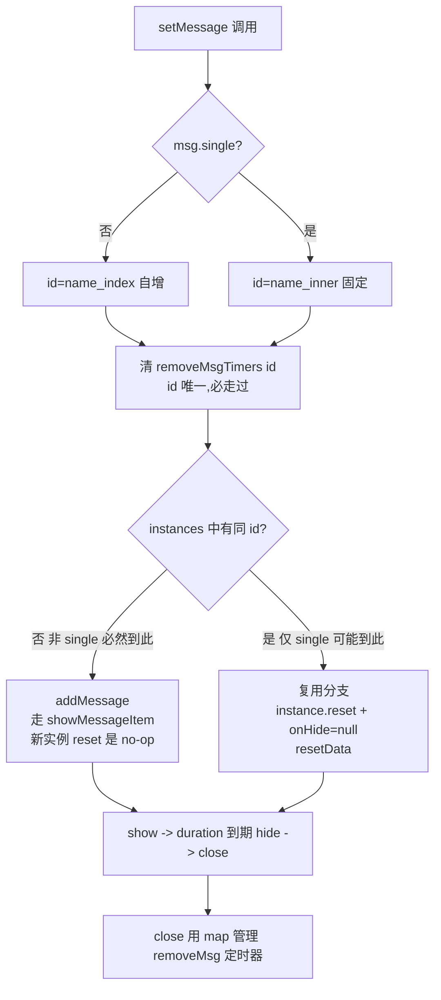

## 一、问题分类

非 single 模式（`msg.single` 为 false/未传）和 single 模式的代码路径完全不同，咱们先把两条路径理清：

| 模式 | id 生成 | 走的分支 | 是否复用 instance |
|------|---------|----------|-------------------|
| **非 single** | `${name}_${this.index}`（每次自增，必然唯一） | setMessage 里 `findIndex < 0` 永远成立 → 走 `addMessage` | ❌ 每次都是新建 |
| **single** | 固定 `${name}_inner` | 第一次走 addMessage，第二次起走复用分支 | ✅ 复用同一个组件 ref |

## 二、本轮 3 处修改逐个评估

### 修改 ① — `message-item.vue`：`hide` 里 setTimeout 加 `hideTimeoutContext`，`reset()` 中清掉

**作用范围**：所有模式（every message-item 实例）

**对非 single 的影响**：
- 非 single 模式下每条消息都是独立组件实例，每个实例只 hide 一次就销毁，`hideTimeoutContext` 只会被赋值一次，到期后自然走完逻辑
- `reset()` 清 `hideTimeoutContext` 仅在"组件还活着且要重新 show"时才有意义，非 single 模式不会发生这种情形（不复用），所以这段 clearTimeout 是个 no-op
- ✅ **完全无副作用**，对非 single 是纯防御性代码

### 修改 ② — `message.vue`：复用分支 `setMessage` 的 else 里 `instance.reset()` + `instance.onHide = null`

**作用范围**：**仅复用分支**（`instanceIndex >= 0`）

**对非 single 的影响**：
- 非 single 模式 id 每次自增，永远走不到 else 分支
- ✅ **路径上不可达，零影响**

### 修改 ③ — `message.vue`：`removeMsgTimers` map + `setMessage` 入口按 id 取消 pending removeMsg + `close` 用 map 管理 setTimeout

**作用范围**：所有模式

**对非 single 的影响**逐项看：

**a) `setMessage` 入口的 `if (this.removeMsgTimers[id]) clearTimeout`：**
- 非 single 模式 id 每次都是 `${name}_${this.index}`（this.index 在 addMessage 成功后 +1），id 单调递增不会重复
- 进入 setMessage 时 `removeMsgTimers[id]` 必然为 undefined，if 不成立，直接跳过
- ✅ **走不进去，零影响**

**b) `close` 中 `if (this.removeMsgTimers[id]) clearTimeout` + 用 map 替代裸 setTimeout：**
- 非 single 模式下，每条消息只会被 close 一次（duration 到期或手动关闭），map 里同 id 不会有 pending，if 也不成立
- 后续逻辑等价于 `this.removeMsgTimers[id] = setTimeout(() => { this.removeMsg(id); delete this.removeMsgTimers[id]; }, SHOW_DURATION); this.removeInstance(id);`
- 跟原来 `setTimeout(() => this.removeMsg(id), SHOW_DURATION); this.removeInstance(id);` 行为完全一致，只是多挂了个句柄到 map 上，到期 delete 自己
- ✅ **行为等价，零影响**

**c) 内存泄漏？**
- map 里 key 在 setTimeout 回调执行后就 `delete`，不会越积越多
- ✅ 没问题

### 修改 ④（顺带的）— `showMessageItem` 里的 `instance.reset()` + `onHide = null`

- 非 single 模式：`addMessage` 里通过 `this.$refs[id]` 拿到的就是新挂载的 message-item 实例，刚 mounted 没跑过 show，`closeTimeoutContext`/`hideTimeoutContext` 都是 0，调 reset() 就是几个 clearTimeout(0)，no-op
- ✅ **无副作用**

## 三、总览图

## 四、结论

| 修改点 | 对非 single 影响 |
|--------|------------------|
| ① message-item `hideTimeoutContext` | 无（纯防御） |
| ② setMessage 复用分支 reset | 无（路径不可达） |
| ③ removeMsgTimers map | 无（行为等价） |
| ④ showMessageItem reset | 无（no-op） |

✅ **本轮所有修改对非 single 模式零行为变化**，纯粹是修复 single 模式（复用同一 instance）下的定时器互踩问题。

## 五、修改思路一句话总结

> **single 模式连续点击的本质是同一个 message-item 实例的生命周期被反复打断/重启，但组件内部有 3 个 setTimeout（show 中的 close 计时、hide 中的 fade 延迟、message 容器中的 removeMsg 延迟）原本没有「成对的清除时机」。本次修复给这 3 个定时器都补上「下一次 show 之前先清掉上一次的」对称逻辑，从而保证新一轮 show 的时序不会被前一轮的残留定时器破坏。**
