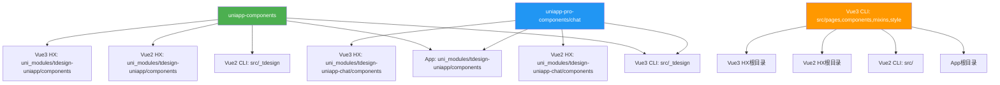
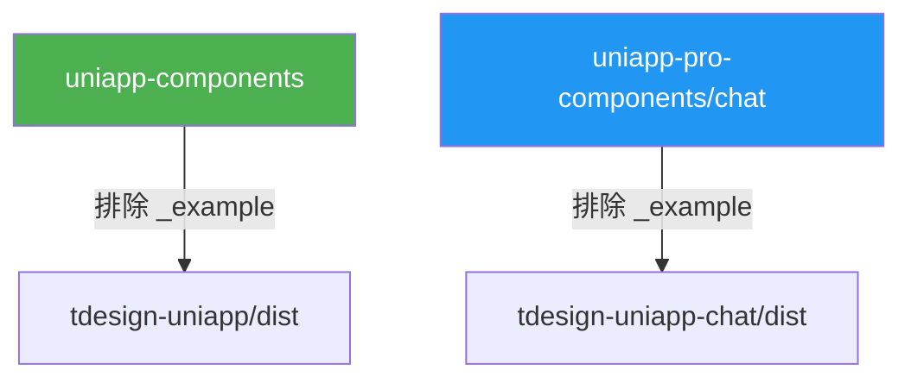

## 分析结论：两个命令**不冲突**，它们的复制目标和用途完全不同

以下是详细对比：

### 📋 对比总表

| 维度 | `init` | `release:prepare` |
|------|--------|-------------------|
| **源** | `uniapp-components/**/*` + `uniapp-pro-components/chat/**/*` | 相同 |
| **目标** | 多个 example/starter 项目 | `tdesign-uniapp/dist` + `tdesign-uniapp-chat/dist` |
| **用途** | 开发时同步组件到各示例项目 | 发布前构建 npm 包的 dist 产物 |
| **`_example` 处理** | 复制到 `pages-more` 目录 | **忽略**（`ignore: _example`） |
| **less 编译** | ✅ 通过 `copy()` → `processLess()` | ✅ 相同 |
| **黑名单** | ❌ 无 | ✅ 过滤 `tsconfig.eslint.json`、`.eslintrc.js` |

### 🔍 详细分析

#### 1. `init` 命令的复制流程

- 将**组件源码**（包含 `_example` demo）复制到各 starter 项目中
- 将 **Vue3 CLI 项目的基础设施文件**（pages、components、mixins、style）复制到其他 starter 项目
- `_example` 目录下的 demo 文件被提取到各项目的 `pages-more` 目录

#### 2. `release:prepare` 命令的复制流程

- 将组件源码复制到 `dist` 目录，用于 **npm 发包**
- **明确排除** `_example` 目录和黑名单文件
- 目标路径是 `tdesign-uniapp/dist` 和 `tdesign-uniapp-chat/dist`

### ✅ 为什么不冲突

1. **目标目录完全不同**：`init` 写入各 starter 项目（`src/_tdesign`、`uni_modules`），`release:prepare` 写入 `dist` 目录
2. **文件范围不同**：`init` 包含 `_example` demo 文件，`release:prepare` 排除了 `_example`
3. **额外操作不同**：`init` 还有 `copyInfra` 步骤复制基础设施文件，`release:prepare` 没有
4. **两者共用同一个 `copy()` 函数**（`core.js`），但通过不同的 `config` 参数（`targetDir`、`demoDir`）来区分行为

**唯一的"重叠"是数据源相同**（都读取 `uniapp-components` 和 `uniapp-pro-components/chat`），但这是合理的——一个是同步到开发环境，一个是打包到发布目录。两个命令可以安全地独立或顺序执行，不会互相覆盖或冲突。
