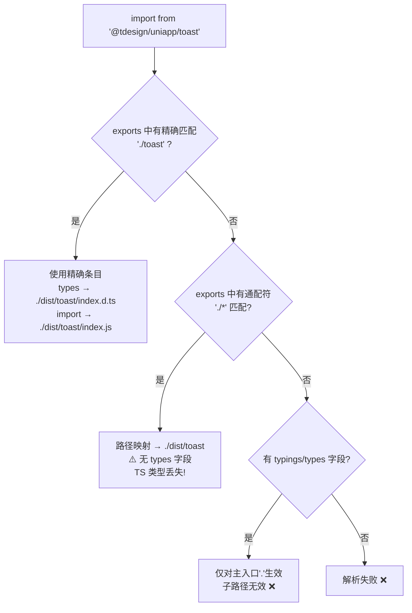

## 关于 exports 优先级的解释

你问的核心问题是：**既然已经有了 `"./*": "./dist/*"` 通配符，为什么还要逐个声明？**

Node.js 的 `exports` 字段遵循**最长前缀匹配 + 精确优先**的规则：

```
"./*": "./dist/*"
```

这个通配符确实能让 `import '@tdesign/uniapp/dialog/index.js'` 解析到 `./dist/dialog/index.js`，**但它有两个关键限制**：

1. **无法提供 `types` 字段**：通配符 `"./*": "./dist/*"` 是一个简单的字符串映射，不是条件导出对象。TypeScript 在解析 `import { Toast } from '@tdesign/uniapp/toast'` 时，**找不到 types 入口**，会 fallback 到 `typings` 字段（只对主入口 `.` 生效），最终导致类型丢失。

2. **无法区分 `import` / `default` 等条件**：通配符只做路径映射，不支持按 `import` / `require` / `default` 等条件分发。

所以精确声明的目的是：

| 导入方式 | 通配符能解析？ | 精确声明能解析？ |
|---|---|---|
| `import '@tdesign/uniapp/toast/index.js'` | ✅ 运行时 OK | ✅ |
| `import { Toast } from '@tdesign/uniapp/toast'`（类型） | ❌ 无 types | ✅ types → `./dist/toast/index.d.ts` |
| `import '@tdesign/uniapp/theme.css'`（类型） | ❌ 无 types | ✅ types → `./dist/theme.css.d.ts` |

**简单说：通配符管运行时路径映射，精确声明管 TypeScript 类型解析。两者互补，不冲突。**

---

## 改动总结

### 1. `index.js`（类型生成脚本）

- **`OTHER_EXPORTS`**：新增了 `./mixins/page-scroll`、`./dialog`、`./message`、`./toast`、`./action-sheet`、`./theme.css`、`./theme.less` 共 7 个精确子路径导出，确保 `gen:types` 运行后不会丢失这些 exports
- **`genIndexContent`**：新增 `EXTRA_INDEX_EXPORTS` 常量，在生成组件类型导出后自动追加 mixins 和函数式调用的导出，确保 `types/index.d.ts` 不会被覆盖丢失

### 2. `prepare.js`（发布准备脚本）

- **`generateStyleShortcuts`**：在生成 `theme.css` / `theme.less` 的同时，自动生成对应的 `theme.css.d.ts` / `theme.less.d.ts` 声明文件，内容为：
  ```ts
  declare const styles: string;
  export default styles;
  ```

### 3. `package.json`

- exports 中新增 `./theme.css` 和 `./theme.less` 两个条目，指向对应的 `.d.ts` 类型文件

这样用户使用 `import '@tdesign/uniapp/theme.css'` 或 `import '@tdesign/uniapp/theme.less'` 时就不会再报 TypeScript 类型错误了。

---

## gen:types

运行下面的命令重新生成 types 相关文件。

```bash
npm run uniapp -- run gen:types
```

---

## 一、字段逐个解析

### 1. `typings` / `types`

```json
"typings": "./dist/types/index.d.ts",
"types": "./dist/types/index.d.ts",
```

- **作用**：告诉 TypeScript **主入口**（即 `import xxx from '@tdesign/uniapp'`）的类型声明文件在哪里。
- **两者关系**：`typings` 是旧名称，`types` 是新名称，**功能完全相同**，写两个是为了兼容老版本 TypeScript。
- **生效条件**：仅当 `exports` 中**没有匹配到**对应路径的 `types` 条件时，才会 fallback 到这个字段。也就是说，如果 `exports` 中精确声明了 `types`，这个字段就不起作用了。
- **作用范围**：**只对主入口 `.` 生效**，对子路径（如 `@tdesign/uniapp/toast`）无效。

### 2. `exports`

```json
"exports": {
  ".": { ... },
  "./*": "./dist/*",
  "./dialog": { ... },
  "./theme.css": { ... },
  "./action-sheet/action-sheet.vue": { ... },
  ...
}
```

- **作用**：Node.js 的 **Package Exports Map**（包导出映射），是模块解析的**最高优先级**入口。定义了包的所有合法导入路径及其解析规则。
- **核心规则**：如果 `exports` 字段存在，**未在 exports 中声明的路径将无法被外部导入**（封装性）。

### 3. `exports` 中各条目的含义

#### 3.1 主入口 `"."`

```json
".": {
  "types": "./dist/types/index.d.ts",
  "default": "./dist/index.js"
}
```

| 条件 | 含义 |
|---|---|
| `types` | TypeScript 解析 `import {} from '@tdesign/uniapp'` 时使用的 `.d.ts` 文件 |
| `default` | 运行时兜底入口，所有环境都会匹配 |

#### 3.2 通配符 `"./*"`

```json
"./*": "./dist/*"
```

| 特性 | 说明 |
|---|---|
| 作用 | 将 `@tdesign/uniapp/xxx` 映射到 `./dist/xxx` |
| 类型 | 简单字符串映射，**不是条件导出对象** |
| 限制 | ❌ 无法提供 `types` 字段 → TypeScript 找不到类型 |
| 限制 | ❌ 无法区分 `import` / `require` / `default` 等条件 |

> 这就是为什么有了通配符还需要逐个声明的原因——**通配符只管运行时路径映射，不管类型解析**。

#### 3.3 精确子路径（函数式调用）

```json
"./dialog": {
  "types": "./dist/dialog/index.d.ts",
  "import": "./dist/dialog/index.js",
  "default": "./dist/dialog/index.js"
}
```

| 条件 | 含义 |
|---|---|
| `types` | TypeScript 类型解析入口（**最高优先级**，总是第一个匹配） |
| `import` | ESM `import` 语句使用的入口 |
| `default` | 兜底入口 |

#### 3.4 样式文件

```json
"./theme.css": {
  "types": "./dist/theme.css.d.ts",
  "default": "./dist/theme.css"
}
```

- 没有 `import` 条件，因为 CSS 文件不区分 ESM/CJS
- `types` 指向 `.d.ts` 文件，避免 `import '@tdesign/uniapp/theme.css'` 时 TS 报错

#### 3.5 纯类型入口

```json
"./global": {
  "types": "./global.d.ts"
}
```

- 只有 `types`，没有运行时入口
- 用于 `/// <reference types="@tdesign/uniapp/global" />` 这种纯类型引用

#### 3.6 组件 `.vue` 文件

```json
"./button/button.vue": {
  "types": "./dist/types/button.d.ts",
  "import": "./dist/button/button.vue",
  "default": "./dist/button/button.vue"
}
```

- 精确映射每个组件的 `.vue` 文件路径
- `types` 指向自动生成的 `.d.ts`，提供 Props/Emits 类型推导

---

## 二、优先级总结

TypeScript 和 Node.js 解析 `import '@tdesign/uniapp/toast'` 时的优先级：



**一句话总结**：
- `typings` / `types`：**主入口的类型声明**，是 `exports` 出现前的旧方案，现在作为兜底
- `exports`：**现代标准**，精确控制每个子路径的运行时入口和类型入口
- 通配符 `"./*"`：**运行时路径映射的兜底**，但无法提供类型信息
- 精确子路径声明：**为 TypeScript 提供类型解析**，与通配符互补而非冲突

---

---

## 自己总结

1. `exports` 是模块解析的最高优先级入口。
2. 如果 `exports` 字段存在，未在 `exports` 中声明的路径无法被外部引入。
3. `exports` 遵循“最长前缀匹配 + 精确优先”。

4. `types/typings` 是主入口的类型声明，对子路径（如`@tdesign/uniapp/toast`）无效，仅当 `exports` 中没有匹配到对应路径的 `types` 条件时，才会 `fallback` 到这个字段。

5. `exports` 中每个路径的 `default` 表示运行时兜底入口

6. 通配符 `"./*": "./dist/*"`，无法提供 `types` 字段，类型缺失。

7. `exports` 中的

```json
"./global": {
  "types": "./global.d.ts"
}
```

只是声明 `@tdesign/uniapp/global` 这个模块路径是可解析的，就是可以用 `import '@tdesign/uniapp/global'` ，但是仍然需要写到 `tsconfig.json` 中的 `compileOptions.types` 中，才能让 Typescript 自动加载这个类型声明到全局作用域，无需显式 import
