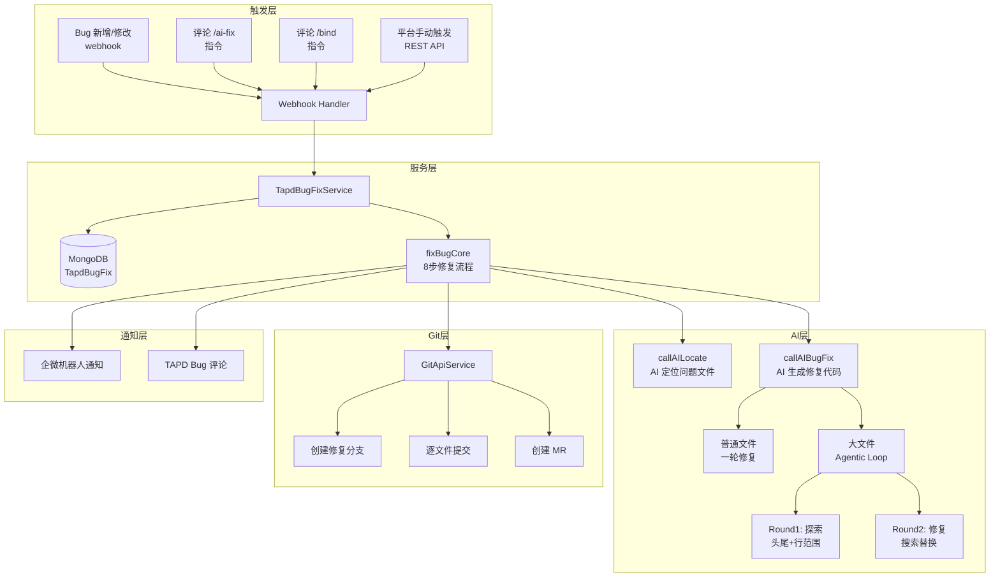
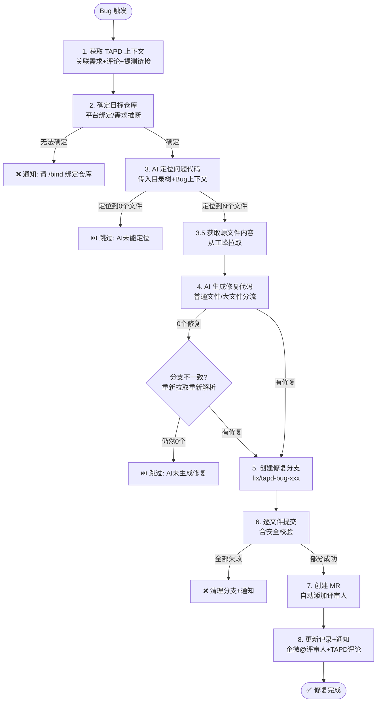
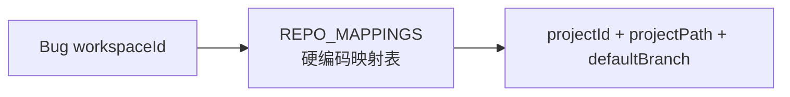
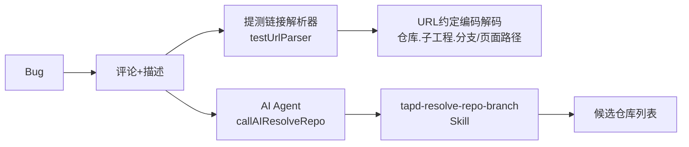
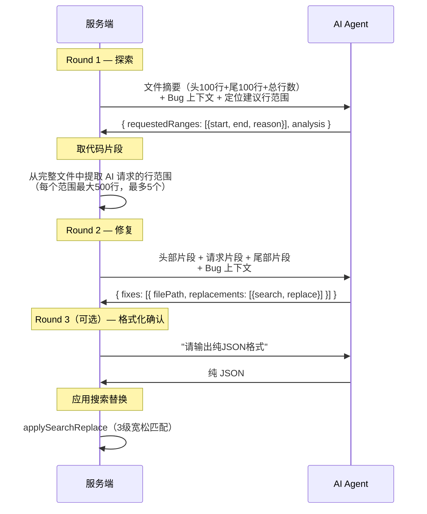
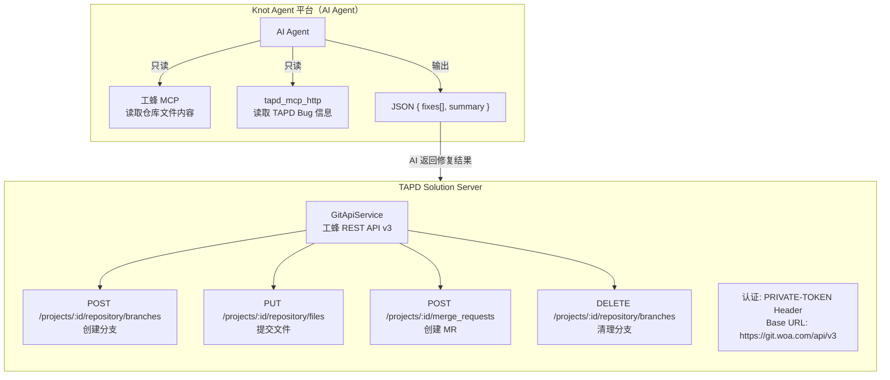
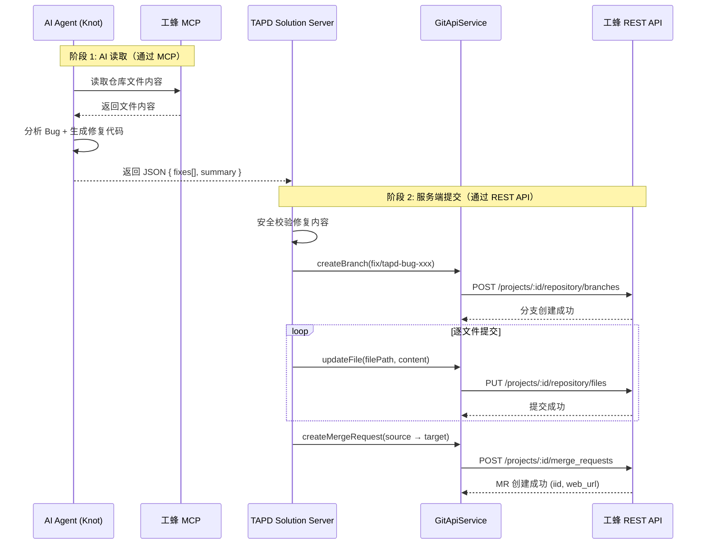
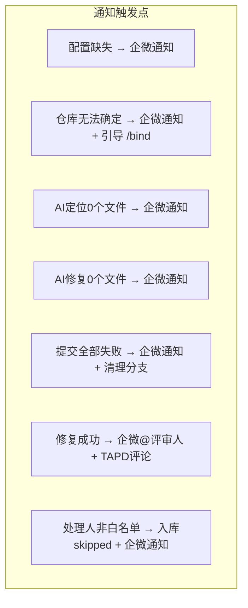

# TAPD Bug 自动修复系统：从 0 到 1 的进化之路

## 一、引言

> 测试同学提了一个 Bug，前端开发需要：打开 TAPD → 找仓库 → 切分支 → 定位代码 → 修 Bug → 提 MR → 通知评审人。
>
> 如果这一切都能自动化呢？

**TAPD Bug 自动修复系统**（TAPD Solution AI Bug Fix）是一个基于 AI Agent 的自动化系统，它能在 TAPD Bug 状态变更或评论触发时，自动完成从**问题定位 → 代码修复 → 分支创建 → MR 提交 → 评审人通知**的全流程。

本文将从系统架构、核心流程、方案进化、工程挑战四个维度，完整复盘这套系统的设计与演进。

---

## 二、系统架构总览



### 核心模块拆分

| 模块 | 文件 | 职责 |
|------|------|------|
| Webhook 入口 | `webhookHandlers.ts` | 解析 TAPD webhook 事件，分发到对应处理函数 |
| 核心修复流程 | `fixBugCore.ts` | 8 步修复主流程编排 |
| AI 调用层 | `aiCall.ts` | 封装 Knot Agent 交互，含定位、修复、大文件多轮对话 |
| 响应解析 | `responseParser.ts` | 将 AI 自由文本解析为结构化修复指令 |
| 提测链接解析 | `testUrlParser.ts` | 从评论中提取内网提测 URL，反推仓库/分支/子工程 |
| 搜索替换引擎 | `searchReplace.ts` | 3 级宽松匹配策略，应用 AI 补丁到源码 |
| 数据模型 | `TapdBugFix.ts` | MongoDB schema，含完整的修复生命周期字段 |
| 常量/类型 | `constants.ts` | System Prompt、Agent 配置、接口定义 |

---

## 三、8 步核心修复流程



### 逐步拆解

**Step 1 — 获取 TAPD 上下文**

并行获取关联需求 + Bug 评论，然后从四个数据源提取提测链接：
- Bug 评论
- Bug 描述
- 关联需求描述
- 关联需求评论

关联需求支持**三级回退**：硬关联（TAPD 关系） → SDK 关键词搜索打分 → AI 语义推测。

**Step 2 — 确定目标仓库**

只从平台绑定获取，优先级：
1. Bug 记录自身已绑定（来自 `/bind` 指令或平台页面）
2. 同需求下其他 Bug 记录的绑定（兄弟记录借用）
3. 失败 → 通知用户使用 `/bind` 命令

**Step 3 — AI 定位问题代码**

将仓库目录树 + Bug 全部上下文（标题、描述、需求、评论、提测链接）发给 AI Agent，AI 返回 `{ files: [{ filePath, reason, lineRange }], analysis }` 结构化定位结果。

**Step 4 — AI 生成修复代码**

分两条路径处理：
- **普通文件**（≤50000 字符）：一轮 AI 调用，AI 通过工蜂 MCP 读取文件后返回修复
- **大文件**（>50000 字符）：走 Agentic Loop（探索 → 取片段 → 修复）

**Step 5~8 — Git 操作 + 通知**

创建 `fix/tapd-bug-{bugId}` 分支（重名自动追加后缀），逐文件提交修复代码，创建 MR 并自动添加 Bug 处理人 + 默认评审人为 reviewer，最后通过企微机器人 @ 评审人通知。

> ⚡ **关键架构点**：所有 Git 写操作（创建分支、提交文件、创建 MR）均通过**服务端直接调用工蜂 REST API** 完成，而非通过工蜂 MCP。AI Agent 仅通过 MCP **读取**代码，详见第六节"挑战 1"。

---

## 四、方案进化史——仓库定位的三代演进

仓库定位是整个系统中**最难、迭代次数最多**的问题。一个 Bug 属于哪个仓库、哪个分支？这看似简单的问题，在实际场景中充满了挑战。

### 第一代：静态映射表



最初的方案是维护一个 `workspaceId → 仓库` 的静态映射表，加上从 Bug 描述中正则提取 `git.woa.com` 链接作为兜底。

**问题**：
- 一个 TAPD 项目可能对应多个仓库（主工程+子工程+组件库）
- 分支信息完全缺失（只能用默认分支 develop）
- 新增项目需要改代码重新部署

### 第二代：提测链接解析 + AI Agent 仓库定位



提测链接是业务中天然存在的"仓库指纹"——开发提测时发出的链接形如：

```
https://test.example.com/pmd-mobile.merchant.next.fission-card.feature.add-fission-card-plus/sub/points-card/views/index
```

通过约定编码解析（`.` 分隔 → 扫描分支关键字 → 反推仓库/子工程/分支），可以精确还原代码位置。

同时引入 AI Agent + `tapd-resolve-repo-branch` Skill 作为增强：让 AI 通过 TAPD MCP 读取 Bug 详情和评论，智能提取提测链接和工蜂链接。

**问题**：
- AI Agent 调用不稳定，成功率受模型召回影响
- 多一轮网络请求（Agent → Skill → TAPD MCP → 工蜂），链路太长
- 对于没有提测链接的 Bug，仍然无解

### 第三代（当前方案）：平台绑定 + 兄弟记录继承

```mermaid
graph TD
    USER[用户/开发者] -->|在 TAPD 评论| BIND[/bind 仓库路径 分支名]
    USER -->|在管理平台| PLATFORM[平台绑定页面]
    BIND --> RECORD[Bug 修复记录<br/>projectId + projectPath + targetBranch]
    PLATFORM --> RECORD

    BUG_NEW[新 Bug] -->|自身已绑定?| CHECK1{是}
    CHECK1 -->|是| USE[使用已有绑定]
    CHECK1 -->|否| CHECK2{关联需求?}
    CHECK2 -->|有| SIBLING[查兄弟Bug记录的绑定]
    CHECK2 -->|无| FAIL[通知: 请 /bind 绑定]
    SIBLING -->|找到| USE
    SIBLING -->|未找到| FAIL
```

**彻底放弃**自动推断仓库的方案，转为**让用户显式绑定**：

1. **`/bind` 指令**：在 TAPD Bug 或需求的评论里输入 `/bind 仓库路径 分支名`，支持多种格式（路径、HTTPS 链接、`tree/branch` URL）
2. **平台管理页面**：通过 Web UI 进行绑定
3. **兄弟记录继承**：同一个需求下的其他 Bug 已绑定仓库，新 Bug 自动继承

### 进化取舍决策

| 维度 | 第一代（映射表） | 第二代（AI推断） | 第三代（显式绑定） |
|------|-----------------|----------------|-------------------|
| 准确性 | ❌ 一对一，无法多仓库 | ⚠️ 依赖提测链接存在 | ✅ 100% 准确 |
| 维护成本 | ❌ 改代码部署 | ⚠️ AI 链路不稳定 | ✅ 用户自助 |
| 用户体验 | ✅ 零操作 | ✅ 零操作 | ⚠️ 需 `/bind` 一次 |
| 覆盖范围 | ❌ 仅预配置项目 | ⚠️ 依赖评论有链接 | ✅ 所有项目 |

**核心决策**：用**一次性的用户操作**（`/bind`）换取**100% 的准确性**和**零维护成本**。这是一个典型的"半自动优于全自动"的工程取舍——全自动方案的 80% 成功率反而不如 100% 准确的半自动方案实用，因为那 20% 的失败需要额外的人力排查和重试。

---

## 五、大文件修复的 Agentic Loop

普通文件直接传给 AI，但超过 50000 字符的大文件会超出 token 限制。解决方案是**多轮对话的 Agentic Loop**：



---

## 六、工程挑战与应对策略

### 挑战 1：Git 操作的架构选型 — 服务端 REST API vs 工蜂 MCP

在整个 Bug 自动修复流程中，涉及大量 Git 操作（读取文件、创建分支、提交代码、创建 MR）。一个自然的想法是：既然 AI Agent 运行在 Knot 平台上，Knot 已经配置了**工蜂 MCP（Model Context Protocol）**，能不能让 AI 直接通过 MCP 完成所有 Git 操作？

**我们的选择**：AI Agent 仅通过工蜂 MCP **读取**代码，所有 Git **写操作**（创建分支、提交文件、创建 MR）均由服务端通过**工蜂 REST API** 完成。

#### 架构分工



#### 为什么不让 AI 通过 MCP 直接提交？

| 维度 | 工蜂 MCP（AI 侧） | 服务端 REST API |
|------|-------------------|----------------|
| **可控性** | AI 行为不可预测，可能提交多余文件或错误分支 | 服务端完全控制提交时机、内容和分支 |
| **安全校验** | 无法在 AI 提交前插入安全校验逻辑 | 提交前可执行所有安全校验（非空、长度、行数比例等） |
| **事务性** | AI 按步骤执行，中途失败难以回滚 | 服务端可统一处理错误，失败时自动清理分支 |
| **可观测性** | AI 的操作日志分散在 Knot 平台 | 所有 Git 操作日志集中在服务端，便于排查 |
| **Token 管理** | MCP 使用 Agent 平台的 Token，权限难以细粒度控制 | 使用专用 `PRIVATE-TOKEN`，权限可精确配置 |

#### 核心实现：无需 clone 的远程提交

`GitApiService.updateFile()` 使用工蜂 REST API 的 `PUT /projects/:id/repository/files/:file_path` 接口，**直接在服务端完成文件提交，无需 clone 仓库到本地**：

```typescript
// GitApiService.updateFile() 核心逻辑
async updateFile(params: {
  projectId: number;
  filePath: string;
  content: string;
  branch: string;
  commitMessage: string;
}) {
  const url = `${this.baseUrl}/projects/${params.projectId}/repository/files`;
  return this.request('PUT', url, {
    file_path: params.filePath,
    branch: params.branch,
    content: Buffer.from(params.content).toString('base64'),
    encoding: 'base64',
    commit_message: params.commitMessage,
  });
}
```

这意味着：
- **无需安装 Git**：服务器不依赖 Git CLI，部署更简单
- **无磁盘开销**：不需要管理本地仓库缓存，避免并发 clone 导致的磁盘和网络开销
- **原子操作**：每次 `updateFile` 就是一次 commit，接口级别保证原子性

#### 完整的 Git 操作流程



### 挑战 2：AI 读了 feature 分支的代码，服务端拉的是 develop

**场景**：AI Agent 配置了工蜂 MCP，修复阶段 AI 自行通过 MCP 读取了 `feature/xxx` 分支的文件内容，生成的搜索替换补丁基于该分支。但服务端用 `targetBranch=develop` 拉取的文件内容不同，导致搜索替换全部匹配不上，`fixes` 为空。

**解决**：在 AI 返回的结构中要求携带 `branch` 字段。当 `fixes=0` 且 AI 报告了不同分支时，用 AI 报告的分支**重新拉取文件** → **重新解析搜索替换**：

```typescript
// 分支不一致时的搜索替换重新应用机制
if (!hasValidFixes && aiFixResult.branch && aiFixResult.branch !== targetBranch) {
  // 用 AI 报告的分支重新拉文件
  for (const file of locateResult.files) {
    const fileData = await GitApiService.getFileContent(projectId, file.filePath, aiFixResult.branch, gitToken);
    refetchedFileContents[file.filePath] = fileData.content;
  }
  // 重新解析 AI 的原始响应
  for (let i = aiFixResult.rawResponses.length - 1; i >= 0; i--) {
    const reParsed = parseAIFixResponse(aiFixResult.rawResponses[i], refetchedFileContents);
    if (reParsed.fixes?.length > 0) {
      aiFixResult.fixes = reParsed.fixes;
      break;
    }
  }
}
```

### 挑战 3：TAPD 评论中的 Unicode 空白字符

**场景**：TAPD 评论中的 `/bind` 命令和参数之间不是普通空格，而是 `&nbsp;`（U+00A0）或全角空格（U+3000），导致参数分割失败。

**解决**：在解析前统一将所有 Unicode 空白字符替换为普通空格：

```typescript
const plainComment = commentContent
  .replace(/<[^>]+>/g, '')        // 去除 HTML 标签
  .replace(/&nbsp;/gi, ' ')       // &nbsp; → 普通空格
  .replace(/[\u00A0\u2002\u2003\u2007\u2008\u2009\u200A\u200B\u202F\u205F\u3000]/g, ' ')
  .trim();
```

### 挑战 4：分支名已存在导致创建失败

**场景**：同一个 Bug 被多次触发修复（如失败后重试），`fix/tapd-bug-{bugId}` 分支已存在。

**解决**：自动追加后缀，最多尝试 10 次：

```typescript
for (let attempt = 0; attempt <= 10; attempt++) {
  const candidateBranch = attempt === 0 ? fixBranch : `${fixBranch}-${attempt}`;
  try {
    await GitApiService.createBranch(projectId, candidateBranch, effectiveTargetBranch, gitToken);
    fixBranch = candidateBranch;
    break;
  } catch (err) {
    if (isConflict(err)) continue;
    throw err;
  }
}
```

### 挑战 5：AI 返回的修复代码格式不稳定

**场景**：AI 有时返回纯 JSON，有时混杂自然语言解释，有时用 markdown 代码块包裹，有时搜索替换中包含行号前缀。

**解决**：
1. **格式化确认重试**：如果首次解析到 0 个修复，发送"请输出纯 JSON"让 AI 重新输出，最多重试 2 次（温和 → 强硬两个 prompt）
2. **3 级宽松匹配**的搜索替换引擎：
   - Level 1：精确匹配（`String.includes`）
   - Level 2：行尾宽松（`trimEnd` 后比较，容忍尾部空白差异）
   - Level 3：缩进归一化（忽略行首空白差异，替换时自适应文件实际缩进）
3. **行号前缀清理**：AI 从带行号的代码片段复制时会带入 `123: ` 前缀，解析前统一清理

### 挑战 6：MR 创建成功后后续步骤出错导致状态回退

**场景**：MR 已成功创建，但后续的"发送通知"或"添加 TAPD 评论"步骤异常，catch 块将状态回退为 `failed`，导致用户看到"修复失败"但实际 MR 已存在。

**解决**：状态保存前移——MR 创建成功后**立即** `save()` 为 `completed`，后续步骤的异常不会回退状态：

```typescript
// 立即保存 completed 状态，防止后续步骤失败导致状态回退
record.fixStatus = 'completed';
await record.save();

// catch 块中检查
if (record.fixStatus !== 'completed') {
  record.fixStatus = 'failed';  // 只有 MR 还没创建时才标记失败
}
```

### 挑战 7：Bug 未关联需求时无法获取上下文

**场景**：很多 Bug 在 TAPD 上没有关联需求，缺失需求上下文导致 AI 定位准确率下降。

**解决**：三级需求推测回退策略：
1. **TAPD 硬关联**：通过 TAPD API 获取 Bug 关联的需求（最高可信度）
2. **SDK 关键词搜索 + 打分**：从 Bug 标题中提取关键词，在 TAPD 需求列表中搜索，按标题相似度打分
3. **AI 语义推测**：将候选需求列表交给 AI Agent 做二次判断，输出置信度。低于 40% 则认为无匹配

推测结果记录到 DB（`storyMatchSource`/`storyMatchConfidence`/`storyMatchReason`），方便后续审计。

---

## 七、通知机制——不让任何一次失败静默消失

整个系统的通知设计遵循一个核心原则：**任何一次非预期的跳过或失败，都必须有人感知到**。



通知内容包含：触发来源、Bug 链接、处理人、失败阶段、失败原因、推测需求信息等。`completed` 时还会 `@` 所有评审人，提醒 review。

---

## 八、`/bind` 指令设计——让用户用得爽

`/bind` 是系统与用户交互的核心接口，设计上追求"怎么写都能用"：

| 使用方式 | 示例 |
|---------|------|
| 仓库路径+分支 | `/bind pmd-mobile/pmd-h5/t-comm feature/invalid-event` |
| HTTPS 链接 | `/bind https://git.woa.com/pmd-mobile/merchant/igame-vas feature/xxx` |
| tree URL 自动提取 | `/bind https://git.woa.com/group/project/tree/feature/xxx` |
| 只改分支 | `/bind --branch feature/xxx` 或 `/bind -b feature/xxx` |
| 追加子仓库 | `/bind --add pmd-mobile/pmd-h5/sub-repo develop` |
| 查看已绑定 | `/bind --list` |
| 移除绑定 | `/bind --remove pmd-mobile/pmd-h5/sub-repo` |

绑定时自动通过工蜂 API 验证仓库存在性，并在 TAPD 评论中回复确认信息。支持 Bug 评论和需求评论两种入口，后者可为一个需求下的所有 Bug 批量设置仓库。

---

## 九、关键设计决策总结

| 决策 | 选项 A | 选项 B | 最终选择 | 理由 |
|------|--------|--------|---------|------|
| 仓库定位 | AI 全自动推断 | 用户 `/bind` 显式绑定 | **B** | 80% 准确率的全自动 < 100% 准确的半自动 |
| 文件内容传递 | 服务端传完整文件给 AI | AI 通过工蜂 MCP 自行读取 | **B** | 减少 token 消耗，AI 读到更新的代码 |
| Git 写操作 | AI 通过工蜂 MCP 直接提交 | 服务端通过 REST API 提交 | **B** | 服务端可控、可校验、可回滚，详见第六节挑战 1 |
| 大文件处理 | 截断传入 | Agentic Loop 多轮交互 | **B** | 截断可能丢失关键代码 |
| 搜索替换匹配 | 严格精确匹配 | 3 级宽松匹配 | **B** | AI 生成的缩进/空白常有细微差异 |
| 会话管理 | 每步独立会话 | 定位→修复共享 conversationId | **B** | 复用上下文，AI 不需要重复理解 Bug |
| 状态保存时机 | 全部完成后保存 | MR 创建后立即保存 | **B** | 防止后续非关键步骤异常导致状态回退 |
| 需求关联 | 只用 TAPD 硬关联 | 硬关联 → SDK推测 → AI推测 | **B** | 提高上下文丰富度，但记录来源和置信度 |

---

## 十、数据模型设计亮点

```typescript
interface ITapdBugFix {
  // === Bug 元信息 ===
  workspaceId, bugId, bugTitle, bugDescription, bugOwner, ...

  // === 仓库绑定（支持多仓库） ===
  projectId, projectPath, targetBranch,  // 主仓库快捷字段
  bindings: [{ projectId, projectPath, targetBranch, bindUser, bindTime }],  // 子仓库列表

  // === 需求推测审计 ===
  storyId, storyTitle,
  storyMatchSource: 'tapd-relation' | 'sdk-inferred' | 'ai-inferred' | 'none',
  storyMatchConfidence: number,  // 0-100
  storyMatchReason: string,

  // === Agent 会话追溯 ===
  agentId, agentSessionIds: string[],  // 每轮 messageId → 可跳转 Agent 对话页

  // === AI 实际操作审计 ===
  aiDiscoveredBranch, aiDiscoveredRepo,  // AI 通过 MCP 发现的实际分支/仓库

  // === 修复生命周期 ===
  fixStatus: 'pending' | 'locating' | 'fixing' | 'completed' | 'failed' | 'skipped',
  fixBranch, fixMrIid, fixMrUrl, fixMrStatus, fixedFiles, fixSummary, fixedAt,
}
```

亮点：
- **多仓库绑定**：`bindings` 数组支持主工程+多个子工程
- **需求推测可追溯**：记录来源、置信度、推测原因，方便事后审计
- **Agent 会话可跳转**：保存每轮 `messageId`，前端可直接跳转到 Knot Agent 对话页查看 AI 的思考过程
- **AI 操作审计**：记录 AI 实际读取的分支/仓库，与预期不一致时可追溯

---

## 十一、总结

TAPD Bug 自动修复系统的进化过程，本质上是在**自动化程度**和**可靠性**之间反复权衡的过程：

1. **V1 静态映射**：低自动化 + 低维护成本，但覆盖面窄
2. **V2 AI 推断**：高自动化 + 高复杂度，但不够稳定
3. **V3 显式绑定**：适度自动化 + 高可靠性，用户一次操作换来 100% 准确

最终的架构选择了"该自动的自动（AI 定位 + AI 修复 + 分支创建 + MR 提交 + 通知），该人工的人工（仓库绑定）"的务实路线。

> 工程不是追求完美自动化，而是追求**在约束条件下的最优解**。有时候，让用户敲一行 `/bind`，比花三个月打磨 AI 仓库推断的准确率，更能解决问题。

