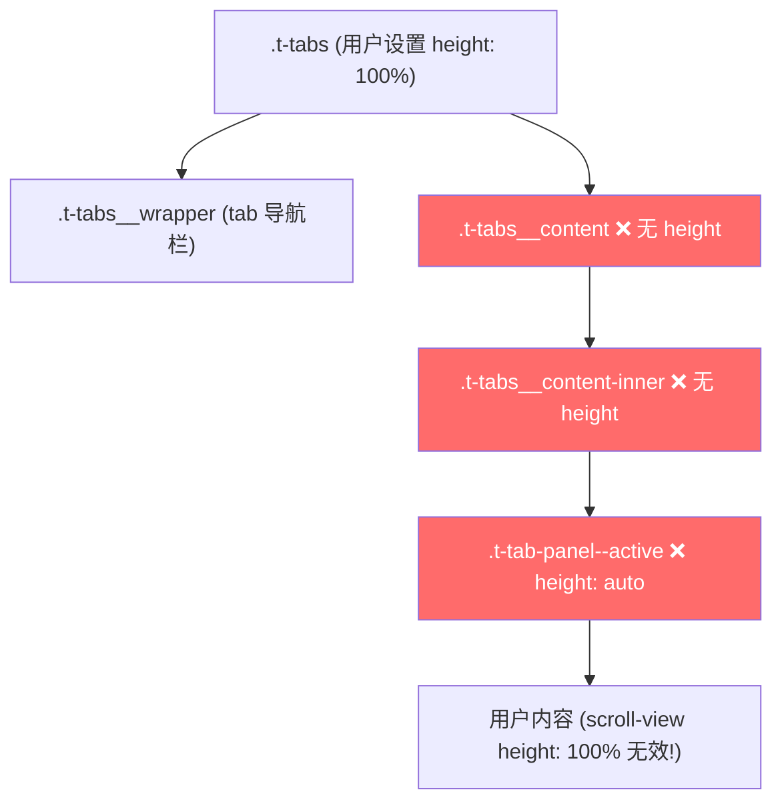

## 分析：组件库确实存在问题

### 问题 1：`t-tab-panel` 的高度矛盾

在 `tab-panel.css` 中：

```css
.t-tab-panel {
  height: 100%;        /* 默认 100% */
  overflow-y: auto;
}
.t-tab-panel--active {
  height: auto;        /* ❌ 激活后变成 auto，高度链断裂！ */
}
```

这是一个**自相矛盾的设计**：
- 默认状态 `height: 100%` 是正确的，说明设计意图是让 panel 撑满父容器
- 但激活状态 `.t-tab-panel--active` 却改成了 `height: auto`，导致高度链断裂
- 子元素再用 `height: 100%` 就无法继承到正确的高度

### 问题 2：`t-tabs__content` 和 `t-tabs__content-inner` 缺少高度传递

在 `tabs.css` 中：

```css
.t-tabs__content {
  overflow: hidden;
  width: 100%;
  /* ❌ 没有 height 设置！ */
}
.t-tabs__content-inner {
  display: block;
  /* ❌ 没有 height 设置！ */
}
```

高度链完全断裂：



### 问题根因

组件库的 `t-tabs` 在**非动画模式**下，没有考虑到用户需要让 tab 内容区域占满剩余高度的场景。它的设计假设是内容高度由内容本身决定（`height: auto`），但在实际使用中，很多场景需要 tab 内容区域是一个**固定高度的可滚动容器**（比如配合 `scroll-view` 或 `pull-down-refresh`）。

### 是否应该提 PR？

**建议提 PR**，理由如下：

1. **这是一个通用问题**：任何需要在 tab 内容区域使用 `scroll-view` 或需要固定高度滚动的场景都会遇到
2. **修复方案简单且无副作用**：
   - `.t-tab-panel--active` 应该保持 `height: 100%` 而不是改成 `auto`
   - `.t-tabs__content-inner` 在非动画模式下应该加上 `height: 100%`
3. **当前的 workaround 不优雅**：用户需要通过 `:deep()` 覆盖 3 个组件内部样式才能正常工作

### PR 建议修改

**tab-panel.css**：
```css
/* 修改前 */
.t-tab-panel--active {
  height: auto;
}

/* 修改后 - 保持高度继承 */
.t-tab-panel--active {
  height: 100%;
}
```

**tabs.css**：
```css
/* 修改前 */
.t-tabs__content-inner {
  display: block;
}

/* 修改后 - 非动画模式下也传递高度 */
.t-tabs__content-inner {
  display: block;
  height: 100%;
}
```

这样用户只需要给 `.t-tabs__content` 设置高度（这是合理的，因为组件不知道用户想要多高），内部的高度链就能自动传递下去，不再需要 `:deep()` hack。

### 当前项目的临时方案

你现在的代码中通过 `:deep()` 覆盖是正确的临时方案：

```less
:deep(.t-tab-panel--active) {
  height: 100%;
}

:deep(.t-tabs__content-inner) {
  height: 100%;
}
```

这两行 + 给 `.t-tabs__content` 设置高度，就能修复高度链断裂的问题。等组件库修复后可以移除这两行 `:deep()` 覆盖。
