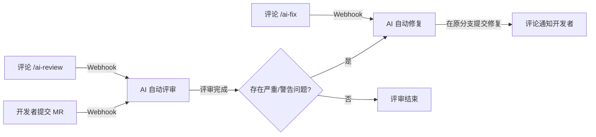
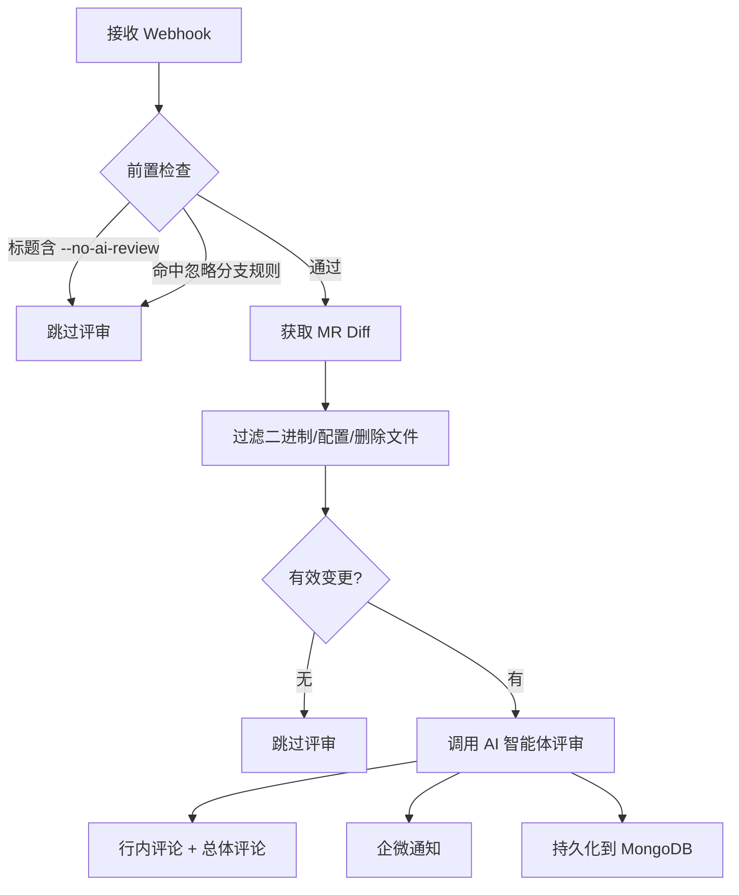
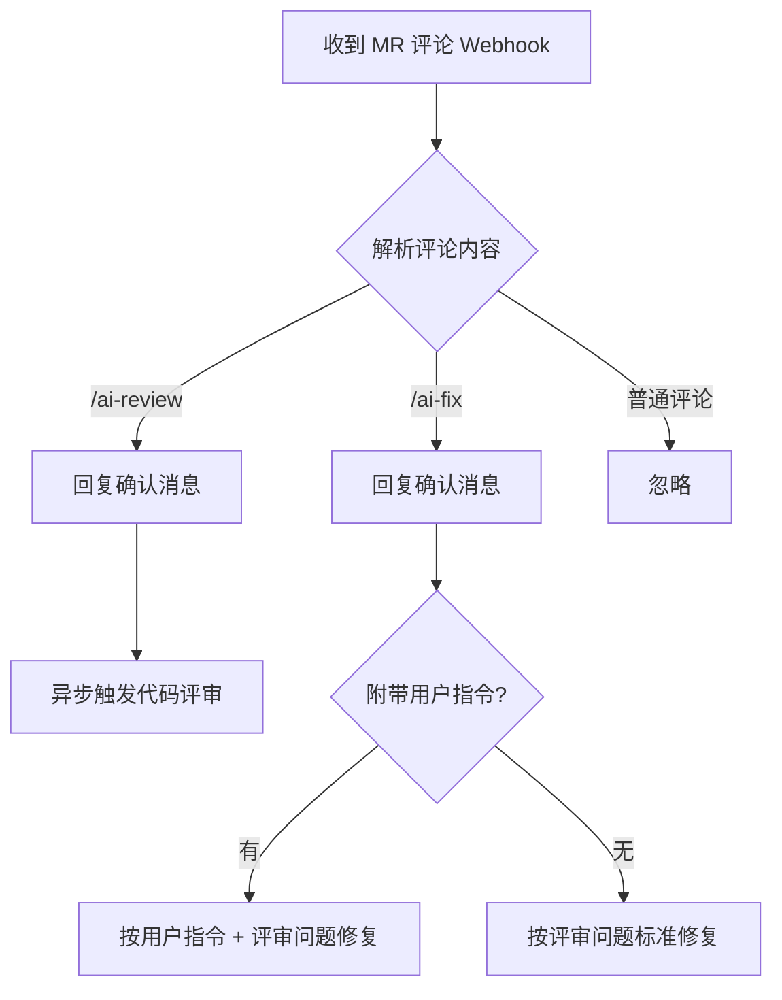

<!-- # AI 自动评审 & 自动修复：让代码评审提效 80% -->

<!-- > 代码评审是研发流程中最重要也最耗时的环节。我们在 TAPD Solution 中构建了 AI 自动评审和自动修复能力——MR 提交后，AI 自动完成代码评审并生成行内评论；发现严重问题后，直接在源分支提交修复代码。开发者还可以通过 `/ai-review` 和 `/ai-fix` 斜杠命令随时手动触发，甚至用自然语言指导 AI 修复。本文介绍这套系统的设计思路、核心流程和关键决策。 -->

## 1. 背景

代码评审（Code Review）是软件开发中不可或缺的环节，但也是最耗时的环节之一。评审者需要逐行阅读代码变更，理解上下文，发现潜在问题，提出修改建议——这个过程往往需要数十分钟甚至数小时。而开发者收到评审意见后，还需要理解问题、手动修改、再次提交，来回几轮下来，一个 MR 从提交到合入可能要拖上好几天。

更现实的问题是：很多团队的评审流于形式。评审者工作繁忙，往往只是粗略扫一眼就点了通过；或者评审意见集中在代码风格这类低价值问题上，真正的逻辑缺陷和安全隐患反而被忽略了。

我们在 TAPD Solution 中内置了 **AI 自动评审** 和 **AI 自动修复** 两大能力，目标很明确：**让 AI 先做一遍评审，发现问题后直接帮你改好，开发者只需要确认结果。**

## 2. 为什么不用工蜂自带的 AI 评审

工蜂平台已经提供了 AI 评审功能，但在实际使用中我们发现了三个核心问题：

1. **模型能力差距大**：工蜂使用的混元或 DeepSeek 模型，与 Claude Opus 级别的模型在代码理解和问题发现能力上差距明显，评审质量不够。
2. **缺乏中心化管理**：评审完就完了，没有统一的记录、追溯和统计能力，无法持续优化。
3. **自定义规则能力弱**：不同团队有不同的代码规范和关注点，一刀切的评审规则无法满足需求。

基于这些原因，我们决定自建 AI 评审和修复能力，深度集成到现有的研发流程中。

## 3. 整体架构

整个系统基于工蜂 Webhook 事件驱动，核心流程如下：



同时支持通过 MR 评论中的斜杠命令手动触发评审和修复，形成完整的人机协作闭环。

## 4. AI 自动评审

### 4.1. 触发方式

- **自动触发**：创建、更新、重新打开 MR 时自动触发
- **手动触发**：在 MR 评论中输入 `/ai-review`

### 4.2. 评审流程



1. 接收到 Webhook 后，先做前置检查——MR 标题是否包含跳过标记、是否命中忽略分支规则
2. 通过工蜂 API 获取 MR 的代码变更，过滤掉二进制文件、配置文件、纯删除文件等无需评审的内容
3. 将有效的 Diff 发送给 AI 智能体，获取结构化的评审结果
4. 将评审意见以**行内评论**的形式精准标注到工蜂 MR 的对应代码行
5. 同时发布一条**总体评论**，包含评分、摘要和问题分类统计
6. 推送企业微信通知，让开发者第一时间知晓评审结果
7. 所有记录持久化到 MongoDB，供后续查看和分析

### 4.3. 评审结果

评审结果包含 1-10 分的总体评分、一句话总结，以及详细的问题列表。每个问题标注了文件、行号、严重级别、分类和修复建议。

问题分为三个级别：
- 🔴 **严重（critical）**：安全漏洞、逻辑错误等必须修复的问题
- 🟡 **警告（warning）**：性能问题、边界条件缺失等建议修复的问题
- 🔵 **建议（suggestion）**：代码规范、可维护性等可选优化

总体评论示例：

```
🤖 AI Code Review — 总体评分: 7/10

📝 总体评价: 代码整体质量尚可，但存在一些安全和性能问题需要关注。

📊 共发现 5 个问题，🔴 严重: 1，🟡 警告: 2，🔵 建议: 2，✅ 其中 3 个已作为行内评论标注
```

AI 评审实际效果：


## 5. AI 自动修复

评审只是第一步。如果只是告诉开发者"这里有问题"，而不帮他解决，那 AI 的价值就只发挥了一半。

### 5.1. 触发方式

- **自动触发**：AI 评审完成后，如果存在严重或警告级别的问题，自动触发修复
- **手动触发**：在 MR 评论中输入 `/ai-fix`，支持附带自然语言指令

### 5.2. 修复流程

1. 从评审结果中筛选出严重和警告级别的问题
2. 通过工蜂 API 获取涉及文件的完整源代码
3. 将问题列表和源文件一起发送给 AI，生成修复后的完整文件内容
4. 对修复结果进行安全校验——内容不能为空、不能被截断、必须与原文件有实际差异
5. 直接在 MR 的源分支上提交修复 commit
6. 在 MR 上评论修复结果，告知开发者改了哪些文件

自动修复实际效果：


### 5.3. 为什么直接在原分支修改

这个设计决策经过了反复权衡。

最初我们采用的是"新建分支 + 提 MR"的方式，看起来更规范，但实际体验很差：开发者需要切到另一个 MR 查看修改、确认后合并回来，流程冗长。更麻烦的是容易"套娃"——修复 MR 本身又触发评审，又触发修复，没完没了。


直接在原分支上提交修复，开发者在自己的 MR 里就能看到 AI 的改动，不满意可以通过斜杠命令回退或调整。这个体验更接近本地 IDE 中的 AI 辅助——改完你看一眼，接受或拒绝，简单直接。

## 6. 斜杠命令：人机协作的桥梁

自动化是默认行为，但开发者应该始终拥有控制权。系统支持在 MR 评论中使用斜杠命令：

| 命令 | 说明 |
|------|------|
| `/ai-review` | 手动触发一次 AI 代码评审 |
| `/ai-fix` | 手动触发一次 AI 代码修复 |
| `/ai-fix <指令>` | 按用户指令进行修复 |

`/ai-fix` 后面可以跟自然语言指令，这让修复变成了一种对话式体验：

```
/ai-fix 回退上一次的改动
/ai-fix 把 Promise.all 改成 Promise.allSettled
/ai-fix 这个函数加上入参校验
```

AI 改的不对？告诉它怎么改，它再改一次。不需要自己动手，也不需要离开工蜂页面。

斜杠命令的处理流程如下：



/ai-fix 斜杠命令实际效果：


一个重要的设计原则：**斜杠命令始终生效**。不管 MR 标题里有没有跳过标记，不管是否命中了忽略分支规则，只要开发者主动输入了斜杠命令，就一定执行。因为这代表开发者的明确意图，不应该被任何自动化规则拦截。

收到命令后，系统会立即回复一条确认消息（如"收到 `/ai-fix` 命令，正在进行代码修复，请稍候..."），让开发者知道系统在工作中。这个细节很小，但对体验影响很大——没有反馈的等待最让人焦虑。

## 7. 灵活的控制机制

### 7.1. MR 标题标记

在 MR 标题中添加特定标记，可以控制 AI 行为：

- `--no-ai-review`：跳过 AI 评审和自动修复（紧急修复线上问题时使用）
- `--no-ai-fix`：只跳过自动修复，评审照常进行

```
feat: 紧急修复线上问题 --no-ai-review    # 跳过评审和修复
feat: 新增功能 --no-ai-fix               # 只评审不修复
```

### 7.2. 忽略分支规则

release 合回 develop、develop 合到 release 这类版本管理操作，代码本身已经在之前的 MR 中评审过了，默认不触发自动评审和修复，避免重复劳动。

### 7.3. 行为矩阵

| 场景 | 自动评审 | 自动修复 | `/ai-review` | `/ai-fix` |
|------|---------|---------|-------------|----------|
| 无标记 | ✅ | ✅ | ✅ | ✅ |
| 标题含 `--no-ai-fix` | ✅ | ❌ | ✅ | ✅ |
| 标题含 `--no-ai-review` | ❌ | ❌ | ✅ | ✅ |
| 命中忽略分支规则 | ❌ | ❌ | ✅ | ✅ |

## 8. 为什么不搞多轮修复

有人会问：要不要让两个 Agent 左右互搏，一个不断提问题，另一个不断改？

我们的答案是：**改一次就够了。**

这一点跟人不一样。人在反复讨论中会获得新的理解和视角，所以 Code Review 来回几轮是有价值的。但 AI 不是这样——你没给它增量信息，它的能力不会因为多跑一轮就提升。改 N 次和改一次，结果差不多。

所以我们将最大修复轮次默认设为 1。与其在同一个问题上反复折腾，不如把精力放在提升单次评审和修复的质量上。

## 9. 数据沉淀与管理

所有评审和修复记录都持久化到 MongoDB，前端提供了管理页面，支持：

- 查看评审历史、评分趋势、问题分布
- 查看修复记录，区分触发方式（自动触发 / 斜杠命令触发）
- 按触发方式筛选，查看用户自定义指令
- 为后续优化评审准确率和修复成功率提供数据支撑

## 10. 总结

AI 自动评审和自动修复的核心价值，不是替代人工评审，而是**把 80% 的常规问题先处理掉，让人把精力放在真正需要思考的 20% 上**。

它的设计理念可以概括为三点：

1. **自动化优先，人工兜底**：默认全自动，但开发者随时可以通过标题标记或斜杠命令介入控制
2. **评审 + 修复一体化**：不只是告诉你哪里有问题，而是直接帮你改好
3. **对话式修复体验**：通过斜杠命令，开发者可以用自然语言指导 AI 修复，形成高效的人机协作

对于开发团队来说，接入成本很低——只需要配置工蜂 Webhook 指向服务端即可。剩下的事情，交给 AI。
