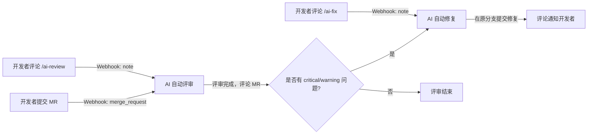
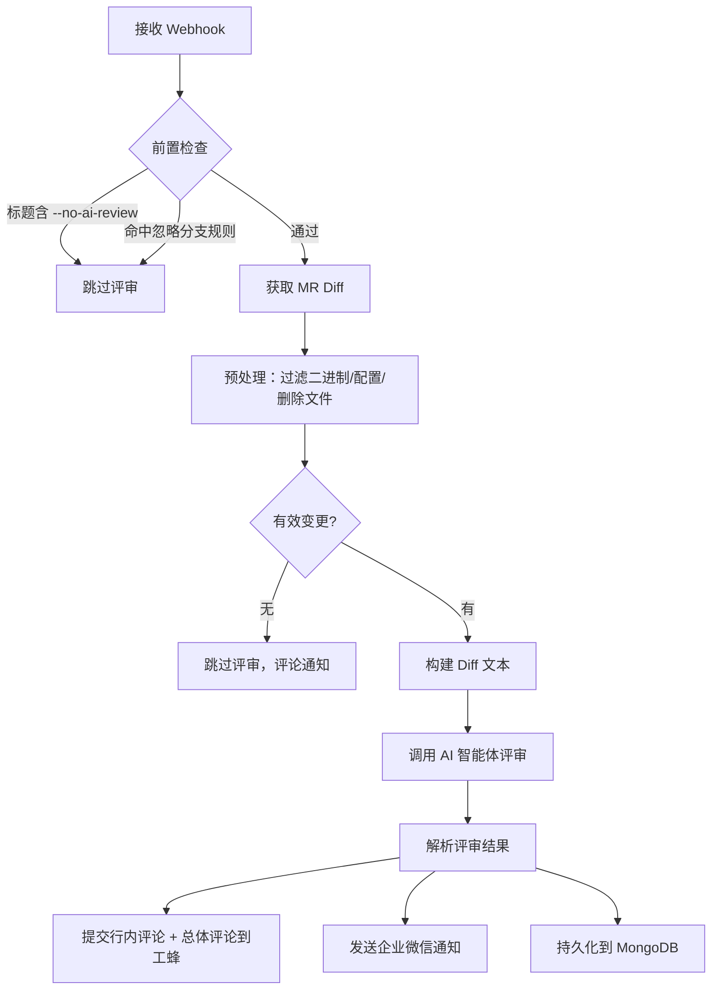
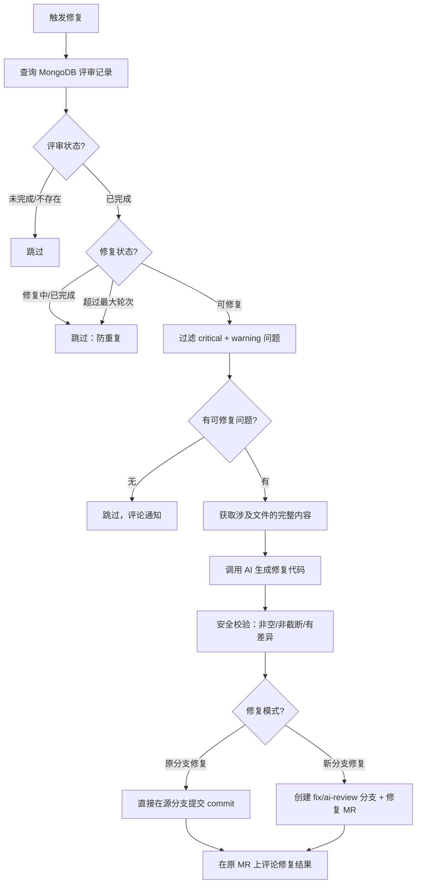
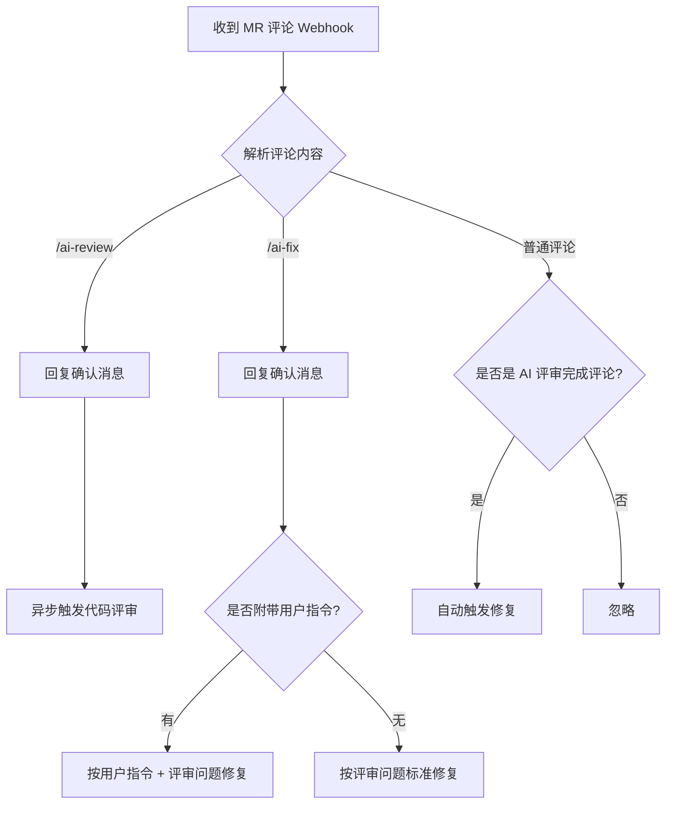

# AI 自动评审 & 自动修复

## 一、概述

TAPD Solution 内置了 **AI 自动评审（AI Code Review）** 和 **AI 自动修复（AI Auto Fix）** 两大能力，基于工蜂 Webhook 事件驱动，实现 MR 提交后自动进行代码评审，并根据评审结果自动生成修复代码。

整体架构如下：



## 二、AI 自动评审

### 2.1 触发方式

| 触发方式 | 说明 |
|---------|------|
| **MR 事件自动触发** | 创建（open）、更新（update）、重新打开（reopen）MR 时自动触发 |
| **斜杠命令手动触发** | 在 MR 评论中输入 `/ai-review` 手动触发评审 |

### 2.2 评审流程



1. **接收 Webhook** — 工蜂推送 `merge_request` 事件到服务端
2. **前置检查** — 检查 MR 标题是否包含 `--no-ai-review`（跳过标记）、是否命中忽略分支规则
3. **获取 MR Diff** — 通过工蜂 API 获取 MR 的代码变更内容
4. **预处理** — 过滤二进制文件、配置文件、删除文件等无需评审的变更
5. **调用 AI** — 将 Diff 发送给 AI 智能体（Agui Agent），获取评审结果
6. **提交评论** — 将评审意见以行内评论 + 总体评论的形式提交到工蜂 MR
7. **企微通知** — 发送企业微信机器人通知，包含评分、问题分类统计等
8. **持久化** — 评审结果存入 MongoDB，供前端管理页面查看

### 2.3 评审结果格式

评审结果包含：
- **总体评分**：1-10 分
- **总体评价**：一两句话概括
- **问题列表**：每个问题包含文件、行号、严重级别、分类、描述、修复建议

问题严重级别分为三级：
- 🔴 **critical** — 必须修复（安全漏洞、逻辑错误等）
- 🟡 **warning** — 建议修复（性能问题、边界条件等）
- 🔵 **suggestion** — 可选优化（代码规范、可维护性等）

### 2.4 MR 评论示例

总体评论会包含评分、摘要和问题分类统计：

```
🤖 AI Code Review — 总体评分: 7/10

📝 总体评价: 代码整体质量尚可，但存在一些安全和性能问题需要关注。

📊 共发现 5 个问题，🔴 严重: 1，🟡 警告: 2，🔵 建议: 2，✅ 其中 3 个已作为行内评论标注
```

AI 评审案例


## 三、AI 自动修复

### 3.1 触发方式

| 触发方式 | 说明 |
|---------|------|
| **评审完成自动触发** | AI 评审完成后，如果存在 critical/warning 级别问题，自动触发修复 |
| **斜杠命令手动触发** | 在 MR 评论中输入 `/ai-fix` 手动触发修复，支持附带指令 |

斜杠命令示例：
```
/ai-fix                          # 标准修复，根据评审问题修复
/ai-fix 回退 xxx 改动              # 按用户指令修复
/ai-fix 把 Promise.all 改成 Promise.allSettled  # 按用户指令修复
```

> **注意**：通过 `/ai-fix` 斜杠命令触发的修复**始终执行**，不受 MR 标题中 `--no-ai-fix` 标记的限制。

### 3.2 修复流程



1. **查询评审记录** — 从 MongoDB 获取该 MR 的评审结果
2. **过滤可修复问题** — 只修复 critical 和 warning 级别的问题
3. **获取源文件** — 通过工蜂 API 获取涉及文件的完整内容
4. **调用 AI 生成修复** — 将问题列表 + 源文件内容发送给 AI，生成修复后的完整文件
5. **安全校验** — 验证修复内容的有效性（非空、非截断、与原文件有差异等）
6. **提交修复** — 根据配置，在原分支直接提交或创建新修复分支
7. **评论通知** — 在原 MR 上评论修复结果

### 3.3 修复模式

| 模式 | 配置 | 说明 |
|------|------|------|
| **原分支修复**（默认） | `mrAutoFixOnSourceBranch: true` | 直接在 MR 的源分支上提交修复 commit |
| **新分支修复** | `mrAutoFixOnSourceBranch: false` | 创建 `fix/ai-review-{mrIid}` 分支并提交修复 MR |

## 四、斜杠命令

系统支持在 MR 评论中使用斜杠命令手动触发 AI 能力：

| 命令 | 说明 |
|------|------|
| `/ai-review` | 触发 AI 代码评审 |
| `/ai-fix` | 触发 AI 代码修复（根据评审问题） |
| `/ai-fix <指令>` | 触发 AI 代码修复，并附带用户自定义指令 |

收到斜杠命令后，系统会**立即回复确认消息**，然后异步执行评审或修复：

```
收到 `/ai-review` 命令，正在进行代码评审，请稍候...
```

```
收到 `/ai-fix` 命令，正在进行代码修复，请稍候...

**用户指令**: 回退 xxx 改动
```

### 斜杠命令处理流程



自动修复案例


/ai-fix 斜杠命令案例


## 五、MR 标题标记

通过在 MR 标题中添加特定标记，可以控制 AI 行为：

| 标记 | 效果 |
|------|------|
| `--no-ai-review` | 跳过 AI 评审 **和** 自动修复 |
| `--no-ai-fix` | 跳过 AI 自动修复，评审照常进行 |

示例：
```
feat: 紧急修复线上问题 --no-ai-review    # 跳过评审和修复
feat: 新增功能 --no-ai-fix               # 只评审不修复
```

> **注意**：即使标题包含 `--no-ai-fix`，通过评论 `/ai-fix` 仍然可以手动触发修复。

## 六、忽略分支规则

默认配置下，以下方向的 MR 不会触发自动评审和修复：

- `release -> develop`（release 分支合回 develop）
- `develop -> release`（develop 合到 release 分支）

支持通配符，如 `release/*->develop` 匹配所有 release 子分支。可通过环境变量 `MR_REVIEW_IGNORE_BRANCHES` 自定义。

## 七、配置项一览

| 配置项 | 环境变量 | 默认值 | 说明 |
|--------|---------|--------|------|
| `mrAutoFixEnabled` | `MR_AUTO_FIX_ENABLED` | `true` | 是否启用自动修复 |
| `mrAutoFixMaxRounds` | `MR_AUTO_FIX_MAX_ROUNDS` | `1` | 最大修复轮次（0=不限制） |
| `mrAutoFixOnSourceBranch` | `MR_AUTO_FIX_ON_SOURCE_BRANCH` | `true` | 是否在原分支直接提交修复 |
| `mrAutoFixSlashCommand` | `MR_AUTO_FIX_SLASH_COMMAND` | `/ai-fix` | 修复斜杠命令名称 |
| `mrAutoReviewSlashCommand` | `MR_AUTO_REVIEW_SLASH_COMMAND` | `/ai-review` | 评审斜杠命令名称 |
| `mrIgnoreAiFixFlag` | `MR_IGNORE_AI_FIX_FLAG` | `--no-ai-fix` | MR 标题跳过修复标记 |
| `mrIgnoreAiReviewFlag` | `MR_IGNORE_AI_REVIEW_FLAG` | `--no-ai-review` | MR 标题跳过评审标记 |
| `mrReviewIgnoreBranches` | `MR_REVIEW_IGNORE_BRANCHES` | `release->develop,develop->release` | 忽略分支规则 |

## 八、行为矩阵

| 场景 | 自动评审 | 自动修复 | `/ai-review` | `/ai-fix` |
|------|---------|---------|-------------|----------|
| 无标记 | ✅ | ✅ | ✅ | ✅ |
| 标题含 `--no-ai-fix` | ✅ | ❌ | ✅ | ✅ |
| 标题含 `--no-ai-review` | ❌ | ❌ | ✅ | ✅ |
| 命中忽略分支规则 | ❌ | ❌ | ✅ | ✅ |

> 斜杠命令始终生效，不受标题标记和分支规则限制。

## 九、前端管理

前端提供了评审记录和修复记录的[管理页面](https://mobile.woa.com/tapd-solution)，支持：

- 查看评审历史、评分、问题列表
- 查看修复记录，区分**触发方式**（自动触发 / 斜杠命令触发）
- 按触发方式筛选修复记录
- 查看用户自定义指令（斜杠命令场景）

## 十、FAQ

### 1. 为什么不直接用工蜂提供的评审功能

1. 模型太差，混元或DS跟Opus模型差的不是一点半点
2. 没有中心化记录，没法管理
3. 自定义规则能力太弱

### 2. 只要 AI 自动评审就够了吧，开发者自己改

只评审的话作用太有限，没发挥大模型真正的作用

### 3. 是否需要左右互搏，一个 Agent 不断提问题，另一个不断改？

改一次就够了，另一个 Agent 没给他增量信息，他的智力也没提升，这一点跟人不一样，所以改n次和改一次差不多。

### 4. 是否所有 MR 都会触发自动修复

考虑到主分支稳定性、业务可靠性等方面，release -> develop，develop -> release 目前不会触发。

### 5. 为什么不新建个 feature/fix-ai-review 分支，提 MR 来改，而是在原分支上修改

本质上，这个问题是开发者确认修复的时机，这个最好是交互式的确认，就像本地 IDE 一样，不过工蜂网页并不支持，退而求其次的话只能重新提 MR，或者自己做个插件，或者直接在原分支修改。

一开始确实采用过新建分支，然后提 MR 的方式，这种方式心智负担比较重，而且用户感知弱。

直接在原分支上改简单很多，而且支持斜杠命令后，可以方便回退，跟 AI 交互。

