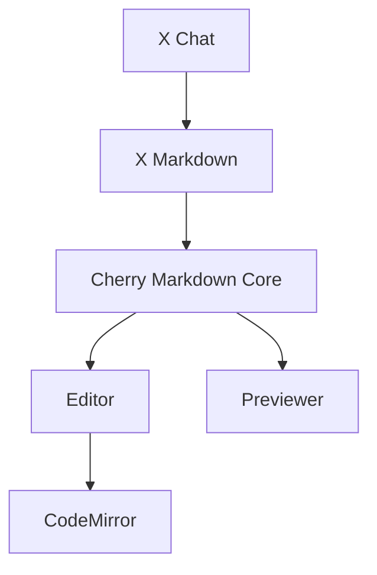

## 1. 背景

在 AI Chat 等流式输出场景中，Cherry Markdown 的引入体积较大，即使移除了 Mermaid 依赖，体积优化仍有较大空间。



通过[移除 Editor 模块](https://github.com/Tencent/cherry-markdown/issues/1596)，可以显著减少打包体积。

## 2. 流式输出包

### 2.1. 使用方式

Cherry Markdown 提供了专为流式输出场景优化的构建包。该包移除了 Mermaid、CodeMirror 等大型依赖，支持按需懒加载，非常适合 AI Chat 等实时渲染场景。

```javascript
import 'cherry-markdown/dist/cherry-markdown.css';
import Cherry from 'cherry-markdown/dist/cherry-markdown.stream';

// 流式输出包默认不包含以下依赖，可按需加载：
// - Mermaid（流程图渲染）
// - CodeMirror（代码编辑器）

const cherryInstance = new Cherry({
  id: 'markdown-container',
});

cherryInstance.setMarkdown('# Welcome to Cherry Editor!');
```

### 2.2. 按需加载 Mermaid 插件

```javascript
import 'cherry-markdown/dist/cherry-markdown.css';
import Cherry from 'cherry-markdown/dist/cherry-markdown.stream';
import CherryMermaidPlugin from 'cherry-markdown/dist/addons/cherry-code-block-mermaid-plugin';
import mermaid from 'mermaid';

// 注意：插件注册必须在 Cherry 实例化之前完成
Cherry.usePlugin(CherryMermaidPlugin, {
  mermaid,
  mermaidAPI: mermaid,
});

const cherryInstance = new Cherry({
  id: 'markdown-container',
});
```

### 2.3. 构建包对比

| 构建包     | 文件                        | 包含 Mermaid | 包含 CodeMirror | 适用场景           |
| ---------- | --------------------------- | ------------ | --------------- | ------------------ |
| 完整包     | `cherry-markdown.js`        | ✅            | ✅               | 通用场景           |
| 核心包     | `cherry-markdown.core.js`   | ❌            | ✅               | 无需 Mermaid 场景  |
| 流式输出包 | `cherry-markdown.stream.js` | ❌            | ❌               | AI Chat 流式渲染   |

> **注意**：MathJax/KaTeX 为外部依赖，通过 CDN 动态加载，不包含在任何构建包中。

### 2.4. 体积对比

| 构建包     | 体积大小 | 相比核心包 |
| ---------- | -------- | ---------- |
| 完整包     | 2089 KB  | +333%      |
| 核心包     | 482 KB   | -          |
| 流式输出包 | 291 KB   | -40%       |

**优化效果**：流式输出包相比核心包减少 191 KB，体积缩减约 40%，相比完整包减少 1798 KB，体积缩减约 86%。

### 2.5. 在线体验

👉 [在线体验流式输出效果](https://preview-pr-1614-cherry-markdown.surge.sh/ai_chat_stream.html)

