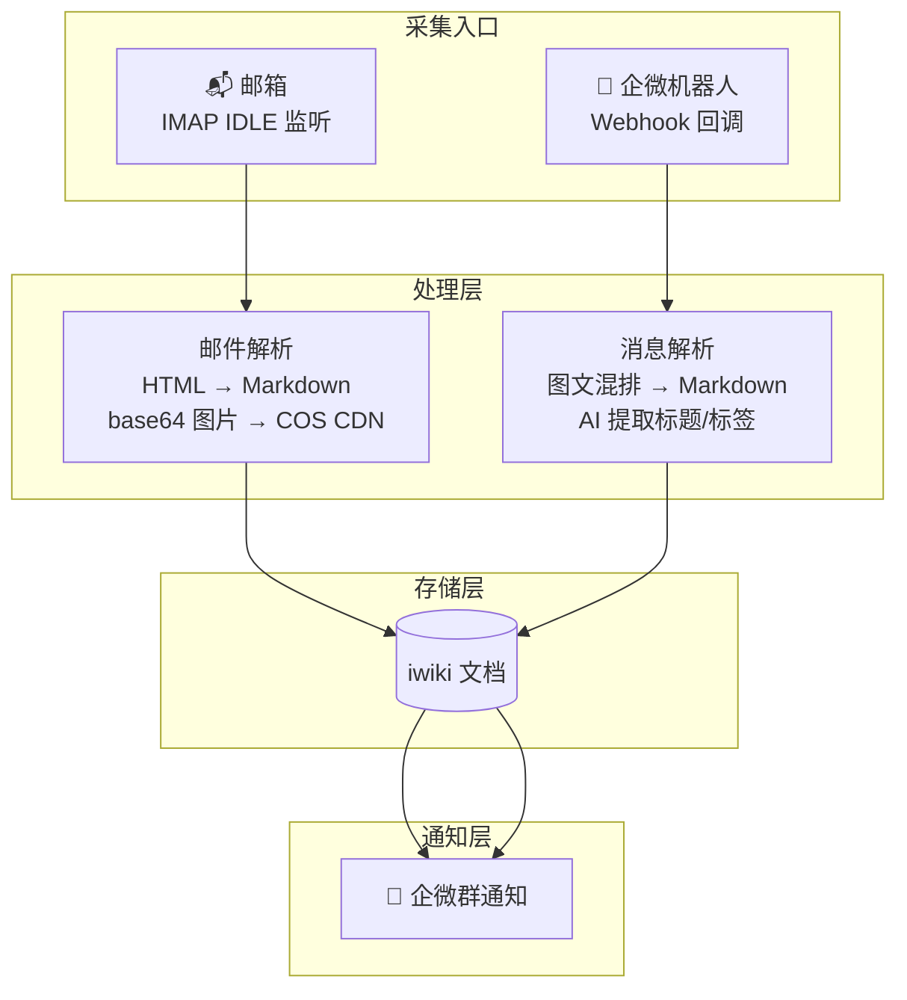
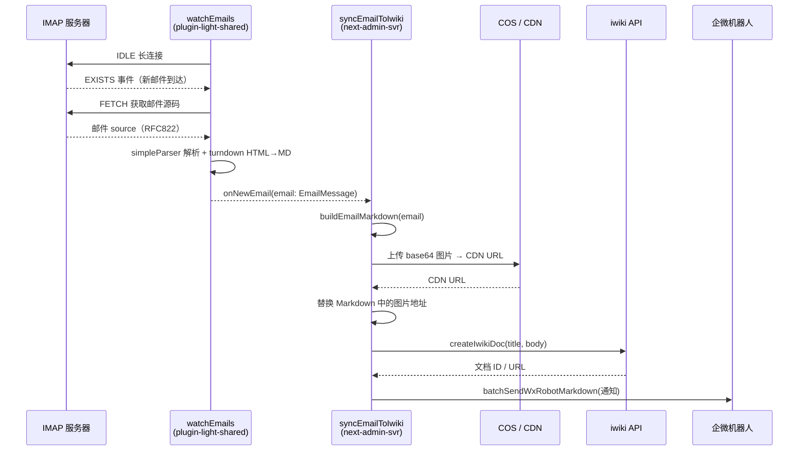
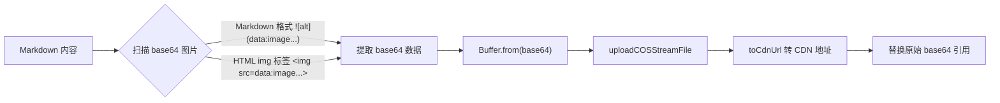
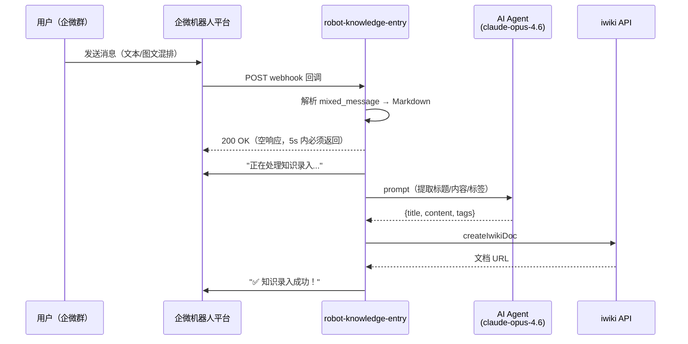

<!-- # 零成本知识沉淀：邮件监听 & 企微机器人自动录入 iwiki -->

<!-- 团队每天产生大量有价值的信息 —— 邮件里的技术方案、群聊中的排障经验、会议后的决策结论，但绝大多数都因为"录入成本太高"而白白流失。本文介绍一套自动化知识录入系统，通过 IMAP IDLE 邮件监听和企微机器人 Webhook 两条链路，将邮件和群聊中的碎片化知识自动采集、AI 整理、图文上传，最终一键沉淀为 iwiki 文档。整套系统配置即生效、开箱即用，真正实现"知识沉淀零成本"。 -->

## 一、能力价值

### 1.1 痛点与背景

在团队日常协作中，**知识沉淀**是一个长期难题：

- 📬 **邮件黑洞**：大量有价值的技术方案、审批结论、外部对接信息沉没在邮箱中，难以被团队检索和复用
- 💬 **群聊即逝**：企微群中分享的最佳实践、排障经验稍纵即逝，翻聊天记录成本极高
- ✍️ **录入门槛高**：手动登录 iwiki → 创建文档 → 排版格式化，流程繁琐，导致"知道该记但懒得记"
- 🔍 **知识孤岛**：信息散落在邮件、群聊、个人笔记中，团队无法共享

### 1.2 核心价值

本系统通过**自动化知识采集**，将团队知识沉淀成本降至零：

| 能力 | 价值 |
|------|------|
| **邮件自动同步** | 配置即生效，新邮件自动变 iwiki 文档，0 人工干预 |
| **群聊一键录入** | 在群里@机器人发消息，3 秒完成知识录入 |
| **AI 智能提取** | 自动从碎片化内容中提取标题、整理格式、打标签 |
| **图文完整保留** | base64 图片自动上传 CDN，图文混排结构完整保留 |
| **多账号/多群** | 配置驱动，一套代码服务多个邮箱、多个企微群、多个 iwiki 空间 |
| **实时通知** | 录入完成后自动发送企微群通知，团队成员及时感知新知识 |

### 1.3 为什么需要团队知识库

#### 知识管理的复利效应

团队知识库不是"锦上添花"，而是一个**具有复利效应的基础设施**：

- 📈 **知识复利**：每一篇文档都是团队资产。今天沉淀的一篇排障经验，可能在未来半年内帮助 10 个人各节省 2 小时，ROI 远超想象
- 🧠 **降低团队 Bus Factor**：关键知识不再只存在于某个人的脑中或邮箱里，人员变动时团队能力不会断崖式下降
- 🔍 **从"问人"到"搜索"**：新人入职、跨团队协作时，第一反应从"找谁问"变为"搜一下"，极大降低沟通成本
- 🤖 **AI 时代的数据底座**：结构化的知识库天然适合作为 RAG（检索增强生成）的数据源，为团队 AI 助手提供高质量私域语料

#### 自动化录入 vs 手动录入

| 维度 | 手动录入 | 自动化录入（本系统） |
|------|---------|-------------------|
| **录入成本** | 10-30 分钟/篇（登录→创建→排版→发布） | 0 分钟（邮件自动）/ 3 秒（群聊@机器人） |
| **录入率** | < 10%（大量知识因"懒得记"而流失） | > 90%（自动采集，几乎无遗漏） |
| **格式质量** | 参差不齐，依赖个人排版习惯 | AI 统一整理，格式规范一致 |
| **图片处理** | 手动上传，经常丢图 | 自动上传 CDN，图文完整保留 |
| **时效性** | 滞后数小时到数天 | 实时（邮件秒级同步，群聊 3 秒内完成） |
| **可持续性** | 依赖人的自觉，难以持续 | 系统自动运行，7×24 不间断 |

> 💡 **核心洞察**：知识沉淀最大的敌人不是"不想记"，而是"录入成本太高"。将录入成本降至零，知识沉淀就会自然发生。

### 1.4 典型应用场景

```
场景一：外部合作邮件自动归档
  产品同学收到合作方邮件 → 系统自动同步到 iwiki → 团队群收到通知 → 全员可查阅

场景二：群聊知识快速沉淀
  开发同学在群里分享排障经验 → @知识助手 → AI 整理为结构化文档 → 录入 iwiki

场景三：会议纪要即时录入
  会议结束后将纪要发到群里 → 指定标题后 @机器人 → 自动创建 iwiki 文档
```

## 二、系统概述

本系统围绕"**知识自动化录入**"这一核心目标，提供了两条互补的知识采集链路：

1. **邮件监听链路**（`watchEmailAndSyncToIwiki`）：通过 IMAP IDLE 长连接实时监听邮箱，收到新邮件后自动提取内容、上传图片、创建 iwiki 文档、发送企微群通知。
2. **企微机器人链路**（`robot-knowledge-entry`）：通过企业微信机器人 webhook 接收群消息，经 AI 提取标题和标签后，创建 iwiki 文档并回复用户。

两条链路共享同一套 iwiki 文档创建和企微通知能力，最终汇聚到 iwiki 知识库中。



## 三、效果展示

### 3.1 邮件自动同步效果

**Step 1 — 收到新邮件**


**Step 2 — 自动创建 iwiki 文档**


**Step 3 — 企微群收到通知**


### 3.2 企微机器人知识录入效果

**Step 1 — 群内/私聊发送图文消息**


**Step 2 — 机器人回复处理中**


**Step 3 — 录入成功通知**


**Step 4 — iwiki 文档效果**


### 3.3 base64 图片自动上传 COS 效果

**Before — 邮件原始内容含 base64 图片（内容过长无法上传）**


**After — 自动替换为 CDN 地址（内容精简、图片正常显示）**


## 四、模块架构

项目采用 **三层分包架构**，各层职责清晰：

| 层级 | 包名 | 职责 |
|------|------|------|
| **底层共享库** | `plugin-light-shared` | 提供通用能力：IMAP 邮件监听（`watchEmails`）、COS 配置获取（`getUploadCosConfig`）、CDN URL 转换（`toCdnUrl`）等 |
| **底层公共工具** | `t-comm` | 提供基础设施：iwiki 文档创建（`createIwikiDoc`）、企微机器人消息（`batchSendWxRobotMarkdown`）、COS 上传（`uploadCOSStreamFile`）、日志记录（`saveJsonToLog`） |
| **应用层** | `next-admin-svr` | 业务编排：邮件同步到 iwiki（`watch-and-sync-iwiki.ts`）、机器人知识录入路由（`robot-knowledge-entry.ts`） |

```
packages/
├── plugin-light-shared/src/
│   ├── email/
│   │   ├── index.ts                    # 导出 watchEmails 及相关类型
│   │   └── watch-unread.ts             # IMAP IDLE 邮件监听核心实现
│   └── image/
│       └── image.ts                    # getUploadCosConfig / toCdnUrl
│
└── next-admin-svr/src/
    ├── index.ts                        # 模块导出入口
    ├── routes/
    │   └── robot-knowledge-entry.ts    # 企微机器人知识录入路由
    └── utils/email/
        └── watch-and-sync-iwiki.ts     # 邮件监听 + 同步 iwiki
```

## 五、链路一：邮件监听自动同步 iwiki

### 5.1 核心流程



### 5.2 底层：IMAP IDLE 邮件监听

> 源文件：`packages/plugin-light-shared/src/email/watch-unread.ts`

`watchEmails` 是 `plugin-light-shared` 提供的通用邮件监听能力，基于 [imapflow](https://github.com/postalsys/imapflow) 实现：

**核心设计：**

```ts
export interface WatchEmailsOptions extends ImapConfig {
  mailbox?: string;                    // 监听文件夹，默认 'INBOX'
  onNewEmail: (email: EmailMessage) => void | Promise<void>;
  onError?: (error: Error) => void;
  onConnected?: () => void;
  onDisconnected?: () => void;
  autoReconnect?: boolean;             // 默认 true
  reconnectInterval?: number;          // 默认 5000ms
  maxReconnectAttempts?: number;       // 默认 Infinity
}

export async function watchEmails(options: WatchEmailsOptions): Promise<EmailWatcher>;
```

**关键实现细节：**

1. **IDLE 长连接**：通过 `ImapFlow` 的 `mailboxOpen` 打开邮箱后，自动进入 IDLE 模式，监听 `exists` 事件感知新邮件到达。
2. **邮件解析**：使用 `mailparser.simpleParser` 解析 RFC822 原始邮件，使用 `TurndownService` 将 HTML 转 Markdown。
3. **自动重连**：内置指数退避重连机制（`reconnectInterval * reconnectAttempts`，上限 60s），监听 `close` 事件触发。
4. **TLS 兼容**：`tls.rejectUnauthorized = false` 兼容内网自签名证书；默认 143 端口使用 STARTTLS。

**返回的 `EmailMessage` 结构：**

```ts
export interface EmailMessage {
  uid: number;
  subject: string;
  from: string;
  to: string;
  date: Date | undefined;
  text: string | undefined;
  html: string | false;
  markdown: string;         // HTML 自动转换的 Markdown
  attachments: Array<{ filename: string; contentType: string; size: number }>;
}
```

### 5.3 应用层：邮件同步到 iwiki

> 源文件：`packages/next-admin-svr/src/utils/email/watch-and-sync-iwiki.ts`

#### 5.3.1 配置驱动设计

整个同步流程通过三组独立配置驱动，全部支持外部覆盖：

```ts
// 邮箱连接配置
const EMAIL_CONFIG = {
  host: 'imap.woa.com',
  user: 'pmd_ai@tencent.com',
  passwordEnvName: 'EMAIL_PASSWORD_PMD_AI',  // 密码通过环境变量注入
};

// iwiki 目标配置
const IWIKI_CONFIG = {
  urlPrefixInOA: 'http://api.sgw.woa.com/ebus/iwiki/prod/tencent/api',
  iwikiUrlPrefix: 'https://iwiki.woa.com/p/',
  spacekey: 'robotKnot',
  parentDocId: 4018268655,
  paasid: 'paasfront_fly_woa_com',
  paasTokenEnvName: 'ROBOT_KNOWLEDGE_ENTRY_PASS_TOKEN',
};

// 通知机器人配置
const ROBOT_NOTIFY_CONFIG = {
  webhookUrl: 'd55cd1c9-67c8-47e9-a4e0-d6ecdfecec22',
  chatId: 'wrkSFfCgAAogAID57QZIlWyLeKV3gu8g',
};
```

#### 5.3.2 支持多账号监听

`watchEmailAndSyncToIwiki` 通过 `options` 参数实现配置合并，天然支持多次调用监听不同邮箱：

```ts
export async function watchEmailAndSyncToIwiki(
  options: WatchEmailAndSyncToIwikiOptions = {}
) {
  // 配置合并：外部传入的配置覆盖默认值
  const mergedEmailConfig = { ...EMAIL_CONFIG, ...options.emailConfig };
  const mergedIwikiConfig = { ...IWIKI_CONFIG, ...options.iwikiConfig };
  const mergedRobotNotifyConfig = { ...ROBOT_NOTIFY_CONFIG, ...options.robotNotifyConfig };

  // 密码从环境变量获取
  const password = process.env[mergedEmailConfig.passwordEnvName];
  // ...创建独立的 IMAP 连接
}
```

**多账号使用示例：**

```ts
// 账号 A —— 使用默认配置
const watcherA = await watchEmailAndSyncToIwiki();

// 账号 B —— 同步到另一个 iwiki 空间，通知另一个群
const watcherB = await watchEmailAndSyncToIwiki({
  emailConfig: {
    user: 'another@tencent.com',
    passwordEnvName: 'EMAIL_PASSWORD_ANOTHER',
  },
  iwikiConfig: {
    spacekey: 'AnotherSpace',
    parentDocId: 1234567890,
  },
  robotNotifyConfig: {
    webhookUrl: 'another-webhook-key',
    chatId: 'another-chat-id',
  },
});

// 每个 watcher 独立管理生命周期
await watcherA?.stop();
await watcherB?.stop();
```

每次调用创建完全独立的 IMAP 连接、配置上下文和 `EmailWatcher` 实例，互不干扰。

#### 5.3.3 base64 图片自动上传 COS

邮件中嵌入的 base64 图片会导致文档内容过长，无法上传 iwiki。系统通过以下流程自动处理：



**关键实现：**

- 使用 `getUploadCosConfig(cdn)` 自动获取 COS 密钥配置（来自 `plugin-light-const`）
- 使用 `uploadCOSStreamFile` 上传 Buffer 到 COS
- 使用 `toCdnUrl` 将 COS URL 转为 CDN URL（域名映射）
- 文件名格式：`next-svr/email-images/{timestamp}_{md5hash}.{ext}`
- 并发上传所有图片（`Promise.allSettled`），单张失败不影响其他

## 六、链路二：企微机器人知识录入

> 源文件：`packages/next-admin-svr/src/routes/robot-knowledge-entry.ts`

### 6.1 核心流程



### 6.2 配置驱动的多群支持

机器人路由通过 `webhookKeyMap` 实现**一个接口服务多个群聊**，每个 webhook key 映射到不同的 iwiki 空间：

```ts
const CONFIG = {
  webhookKeyMap: {
    'd55cd1c9-...': {         // robotKnot 群
      spacekey: 'robotKnot',
      robotDocParentId: 4018268622,
    },
    'a6d0ea4a-...': {         // IGameFrontDevPlat 群
      spacekey: 'IGameFrontDevPlat',
      robotDocParentId: 4018270476,
    },
    'b9efc7b0-...': {         // PMDDEV 群
      spacekey: 'PMDDEV',
      robotDocParentId: 4018271242,
    },
  },
};
```

收到消息时，通过 `getConfigByWebhookKey(webhookUrl)` 从 URL 中提取 key，自动路由到对应空间。未匹配时兜底使用第一个配置。

### 6.3 图文混排消息解析

企微机器人的 `mixed_message` 是图文混排格式，`parseMixedMessage` 按原始顺序将其转为 Markdown：

```ts
// 输入：mixed_message.msg_item 数组
[
  { msg_type: 'text', text: { content: '这是一段知识...' } },
  { msg_type: 'image', image: { url: 'https://...' } },
  { msg_type: 'text', text: { content: '继续说明...' } },
]

// 输出：保持图文穿插顺序的 Markdown
"这是一段知识...\n\n\n\n继续说明..."
```

支持的消息类型：`text`、`image`、`file`、`video`，以及单独的附件消息。

### 6.4 AI 标题提取

使用 `@tencent-ai/agent-sdk` 的 `query` 方法，调用 `claude-opus-4.6` 模型从碎片化内容中提取结构化知识：

```ts
const response = query({
  prompt: `从以下用户输入中提取：
    1. 简洁标题（不超过30字）
    2. 整理后的 Markdown 内容
    3. 1-5 个标签
    
    返回 JSON: {title, content, tags}`,
  options: {
    model: 'claude-opus-4.6',
    permissionMode: 'bypassPermissions',
  },
});
```

AI 不可用时，`fallbackExtract` 兜底：取首行内容作标题，剩余作正文。

用户也可以显式指定标题（优先级最高）：
- `标题：xxx` / `标题:xxx`
- `title: xxx`
- `#标题#`

## 七、共享能力层

### 7.1 iwiki 文档创建

两条链路共享同一个 `createIwikiDoc` 调用方式（来自 `t-comm`）：

```ts
const res = await createIwikiDoc({
  prefix: 'http://api.sgw.woa.com/ebus/iwiki/prod/tencent/api',
  paasId: 'paasfront_fly_woa_com',
  paasToken: process.env.ROBOT_KNOWLEDGE_ENTRY_PASS_TOKEN,
  parentid: 4018268655,       // 父文档 ID
  spacekey: 'robotKnot',      // iwiki 空间
  bodymode: 'md',              // Markdown 格式
  title: '文档标题',
  body: '文档正文 (Markdown)',
});
// res.data.id → 文档 ID → https://iwiki.woa.com/p/{id}
```

### 7.2 企微机器人通知

两条链路都使用 `batchSendWxRobotMarkdown`（来自 `t-comm`）发送 Markdown 消息：

```ts
await batchSendWxRobotMarkdown({
  content: '📬 **邮件知识已同步到 iwiki**\n...',
  chatId: 'wrkSFfCgAAogAID57QZIlWyLeKV3gu8g',
  webhookUrl: 'd55cd1c9-...',
  isV2: true,
});
```

### 7.3 COS 图片上传与 CDN 转换

> 源文件：`packages/plugin-light-shared/src/image/image.ts`

- `getUploadCosConfig(cdnDomain)` — 通过 CDN 域名反查 COS 配置（`secretId/secretKey/bucket/region`），数据源来自 `plugin-light-const` 的 CDN 列表
- `toCdnUrl(cosUrl)` — 将 COS 域名映射为 CDN 域名，支持 `https://`、`http://`、`//`、纯域名等多种格式
- `uploadCOSStreamFile({ file, key, ... })` — 来自 `t-comm`，将 Buffer 上传到 COS

## 八、配置与环境变量汇总

| 环境变量 | 用途 | 使用方 |
|---------|------|--------|
| `EMAIL_PASSWORD_PMD_AI` | 默认邮箱密码 | 邮件监听 |
| `ROBOT_KNOWLEDGE_ENTRY_PASS_TOKEN` | iwiki PaaS Token | 两条链路共用 |
| `WECOM_ROBOT_ENCODING_AES_KEY` | 企微机器人验证密钥 | 机器人路由 |
| `CODEBUDDY_API_KEY` | AI Agent SDK Key | 机器人 AI 提取 |

## 九、启动方式

在 `packages/next-admin-svr/src/index.ts` 中导出，由上层应用在服务启动时调用：

```ts
// 邮件监听（可多次调用监听不同邮箱）
export { watchEmailAndSyncToIwiki } from './utils/email/watch-and-sync-iwiki';

// 机器人路由（挂载到 Express）
export { default as robotKnowledgeEntryRouter } from './routes/robot-knowledge-entry';
```

```ts
// 实际启动示例
import { watchEmailAndSyncToIwiki, robotKnowledgeEntryRouter } from 'next-admin-svr';

// 启动邮件监听
await watchEmailAndSyncToIwiki();

// 挂载机器人路由
app.use('/api/robot-knowledge', robotKnowledgeEntryRouter);
```

## 十、两条链路对比

| 维度 | 邮件监听链路 | 企微机器人链路 |
|------|-------------|---------------|
| **触发方式** | IMAP IDLE 长连接，被动接收 | HTTP POST webhook，实时回调 |
| **内容来源** | 邮件（HTML/纯文本） | 企微消息（文本/图文混排/附件） |
| **标题生成** | 直接使用 `email.subject` | AI 提取 / 用户指定 / 兜底截取 |
| **图片处理** | base64 → COS → CDN URL | 企微自带图片 URL，直接内嵌 |
| **多目标支持** | 通过多次调用 + options 覆盖 | 通过 `webhookKeyMap` 路由映射 |
| **配置驱动** | `EmailConfig` + `IwikiConfig` + `RobotNotifyConfig` 三组配置合并 | `CONFIG.webhookKeyMap` 按 key 路由 |
| **可靠性** | 自动重连（指数退避，最大 60s） | 依赖企微平台重试机制 |
| **交互性** | 单向（监听 → 同步 → 通知） | 双向（接收消息 → 回复结果） |

## 十一、总结

本系统以**"零成本知识沉淀"**为目标，通过两条自动化链路（邮件监听 + 企微机器人）覆盖了团队日常最主要的信息流通渠道。核心设计亮点：

| 设计理念 | 体现 |
|---------|------|
| **配置驱动** | 邮箱、iwiki 空间、通知群均可通过配置覆盖，新增接入方无需改代码 |
| **能力复用** | iwiki 创建、企微通知、COS 上传等下沉为共享层，两条链路复用 |
| **多租户隔离** | 多邮箱独立 IMAP 连接，多群通过 webhookKeyMap 路由，互不干扰 |
| **容错与可靠** | IMAP 指数退避重连、图片上传 `Promise.allSettled` 单张失败不阻塞、AI 提取兜底策略 |
| **开箱即用** | 邮件链路一行代码启动，机器人链路一行路由挂载，5 分钟完成接入 |

如需将该能力复用到其他团队，只需：
1. 准备一个邮箱账号 / 创建一个企微机器人
2. 在 iwiki 上创建目标空间和父文档
3. 传入对应配置调用 `watchEmailAndSyncToIwiki()` 或挂载 `robotKnowledgeEntryRouter`
