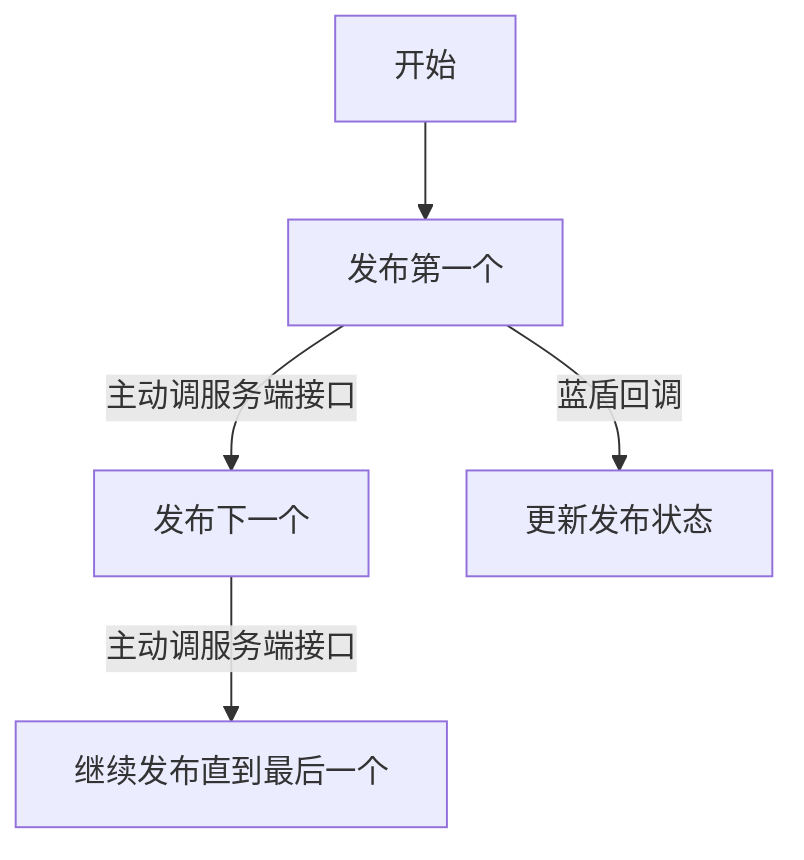

孤独是人生常态，不被理解是人生常态，不被认可更是人生常态。

-- 2026-01-24 19:19:59
 

批量发布流程

-- 2026-01-20 22:28:38
 

批量发布的核心字段 batchUpload，1. server 传给流水线、流水线再回传给 server 2. 操作日志 operation 的 batchUpload 只做留存，无实际作用

-- 2026-01-20 22:24:41
 

操作记录 operation 的设计哲学应该是 1 有唯一的 pipelineId、pipelineRunId，且不应该变化 2. 不同类型的操作日志应该有统一的字段，类似于抽象类。

-- 2026-01-20 22:21:57
 

将 regionSelect 的 regionOptions 改为受控，当搜索时，之前的 selected 不在 regionOptions 时，就更新 selected。这样可以在 搜到一个值，不点选择，直接点外层确定也不会违反直觉。

search 输入框和 select 的回显用一个，即都是 input，这个之前的逻辑不变。

handleSelect 时，更新 searchValue 为选中的值，这个之前的逻辑不变。

展示 dropdown 时，清空 searchValue，来展示所有 regionOptions，这个之前的逻辑不变。

-- 2026-01-17 00:53:15
 

monorepo 仓库的每次提交都应该只改动一个子包的，让 commit 信息更聚焦，生成的 changelog 更易读。

-- 2026-01-15 01:01:13
 

没人认可，那就想办法自己扩大自己的影响力，多写文章，多写内容。

-- 2026-01-13 14:07:15
 

你一直在拖着，就是潜意识觉得它在等着你，其实不是，有些事，你现在不做，后面就没机会了。

-- 2026-01-12 03:05:08
 

活是核心活，事是核心事，人是边缘人。

-- 2026-01-11 14:11:16
 

-- 2026-01-10 16:52:13
 

-- 2026-01-10 16:51:16
 

不应该想着自己至关重要，而应该想着自己无足轻重。从这6年的12次绩效就能看出来了，额外的想法都是幻想。

-- 2026-01-09 19:00:35
 

不应该想着上班的时候只做工作，晚上再做开源，而且再尽可能提高效率，上班时做完所有能想到的事情，晚上还有其他学习任务，比如临时看到的好文章，主动搜的b站基础知识，新了解到的框架。

-- 2026-01-09 19:00:13
 

又虚伪，又觉自己公正，又菜，又觉自己掌控一切，感觉好恶心。

-- 2026-01-08 21:34:45
 

哪怕你写个Vue出来，哪怕你攻克了项目的难点，他一样能找1000个理由给你中低绩效。

-- 2026-01-04 08:30:04
 

绩效的本质是认可，跟产出多少没关系。对方认为你做得好你就做得好，认为你不行你做多少也没用。

-- 2026-01-04 08:28:24
 

