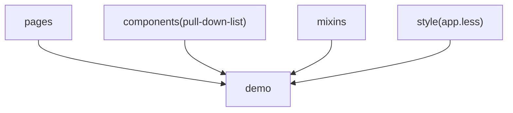
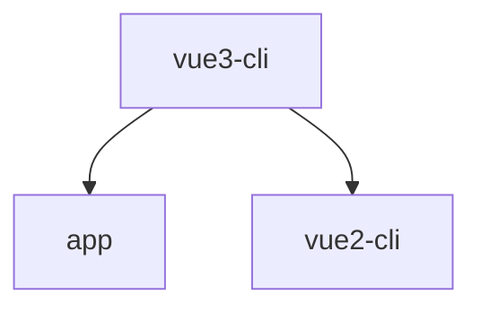
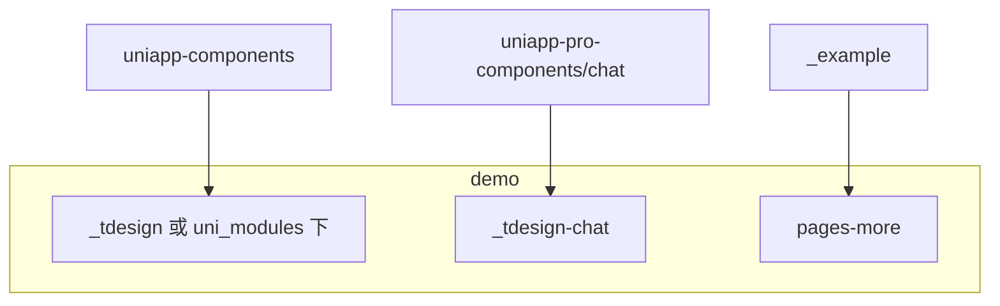
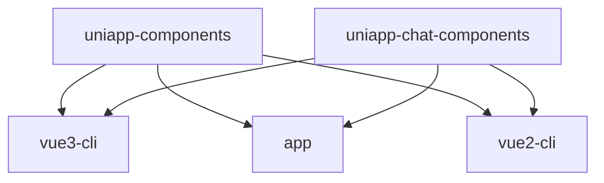
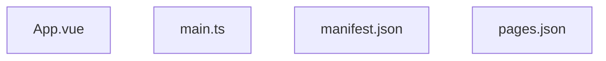
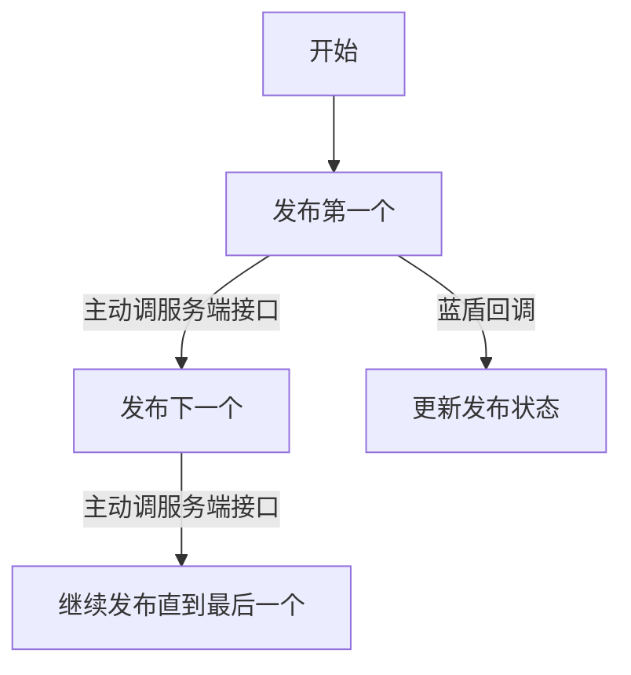

小程序是去中心化的，用户创造、使用都是通过搜索、扫码、分享等形式，是自发的。

-- 2026-01-26 20:31:45
<br>

- 收入是产品的副产品，不是为了收入做产品，但是游戏好像是为了收入而做的。
- 做游戏的意义感是啥。
- mark: 钱给够
- 微信没有很多很多产品，比ieg更缺少锻炼
- 人不是培养的，而是筛选出来的
- 不能在一个地方待着。

-- 2026-01-26 18:01:01
<br>

要验证 PR 的改动（pkg.pr.new），或者 npm 包内容

1. 进入工程，`cd packages/tdesign-uniapp/example`
2. 去掉 `vite.config.ts` 中 `alias` 的配置
3. 装包，如 `pnpm i https://pkg.pr.new/Tencent/tdesign-miniprogram/tdesign-uniapp@4201`
4. 执行 `dev` 等命令，如 `npm run dev:h5`

-- 2026-01-26 17:59:42
<br>

demo 同步

一次性工作。



这部分是从 `vue3-cli` 同步到 `app/vue2-cli` 等目录中的。



需要监听的部分，主要是组件和示例，组件目标是 `_tdesign`，或者 `uni_modules/tdesign-uniapp` 下。



这部分是从 `uniapp-components` 等同步到 `vue3-cli/app/vue2-cli` 等目录中的。



每个项目独特的部分



-- 2026-01-26 15:35:00

小程序长按图片，保存图片没反应？

原因是没返回签名地址，比较坑的是没有提示。

- 错误的：https://gamelife-1251917893.igcdn.cn/hpmatch/hpmatch_F6dFij4NT8R5.jpg
- 正确的：https://gamelife-1251917893.igcdn.cn/hpmatch/hpmatch_F6dFij4NT8R5.jpg?q-sign-algorithm=sha1&q-ak=xx&q-sign-time=xx&q-key-time=xx&q-header-list=host&q-url-param-list=&q-signature=xx

-- 2026-01-26 15:05:00

- https://github.com/Tencent/tdesign-miniprogram/pull/4112/changes
- https://github.com/Tencent/tdesign-miniprogram/pull/4124/changes

这两个还要再看下

-- 2026-01-26 12:43:28
<br>

td-mini 同步 td-uniapp 的步骤：

1. 可选，在 td-mini 大仓下进行 build 脚本的改造，去掉 `jsmin/jsonmin/wxmlmin` 的使用
2. 执行 `npm run build`（或者 `npm run build -- --ignore-terser`），生成 `_example` 目录
3. 复制 `_example` 目录到 `mini-to-uni` 工程下，进行覆盖
4. 可选，删除之前的 `_example_uni`
5. `mini-to-uni` 工程下执行 `node ./bin/wtu -i ./_example` 进行 uniapp 组件生成
6. 手动 diff，结合 PR，Git 记录，更新 td-uniapp 组件库

-- 2026-01-26 12:31:56
<br>

`1.t-grid-item__content--left` 需要加上 `width: 100%;box-sizing: border-box;`，否则边框位置不对。


-- 2026-01-26 12:02:44
<br>

- 拉起链接 https://cdn.partner.esports.pubgmobile.com/os-pubgm/en/link.html?scheme=igame1320%3A%2F%2F%3Fmodule%3D1000096%26gameId%3Dafp5CYxaDf524MmUiETKmc%26teamId%3D199D4B3B%26from%3DteamDetailShare

- 配置地址 `game://?module=1000096`

-- 2026-01-26 11:06:55
<br>

地区选择那个，不能用 selectedIndex === optionIndex 判断当前是否选中，因为搜索框的存在，下拉框是会变的。

比如你选了泰国，selectedIndex 为 0，搜索了 马来西亚，由于 selectedIndex 没变，所以导致 马来西来依然高亮，用户会误解。

当然也可以在 searchValue 或者 options 改变的时候，更新下 selectedIndex。

-- 2026-01-26 10:20:19
<br>

要将所有的 :deep 改成 custom-style，工作量有点大，退而求其次，只在组件 less 中加 :deep，不加、不删、不改其他样式。有改动的，记录下来，比如 dialog.less 的改动如下：


-- 2026-01-26 00:28:41
<br>

其实用 `:deep(xx)` 也是有兼容性问题的，Vue2 需要换，不如直接用 customStyle

-- 2026-01-25 23:13:45
<br>

packages/tdesign-uniapp/app/ 待删除

-- 2026-01-25 21:13:23
<br>

为什么小程序样式覆盖需要用 `:deep`，而 H5 不需要？

原因是 H5 中节点会合并，或者说会替换成真正的子组件节点，可以看到下面的 `uni-button` 有两个 `data-v-xx`，而小程序不是。


-- 2026-01-25 19:54:49
<br>

文档中单组件“更新日志”有问题，加载不出来

-- 2026-01-25 11:17:36
<br>

贡献指南；mini-to-uniapp commit

-- 2026-01-25 04:26:54
<br>

心如猛虎，细嗅蔷薇

-- 2026-01-25 04:24:01
<br>

td-uniapp 的难点，一是宏观，架构搭建、监听体系、更新策略，二是微观，又可分为实现原理和细节。实现上，对几十个组件了如指掌、如数家珍，不同端的兼容性、差异性有不同的处理策略，细节上，对每个组件的还原效果、深色模式、色值等效果对齐，抠每一处细节。

-- 2026-01-25 04:22:09
<br>

vue2+cli/vue3+cli/vue2+hx/vue3+hx 组件基础示例，vue3+cli/vue3+hx 社区模板；chat mr 合入；eslint问题；src/api合入


-- 2026-01-25 04:14:53
<br>

今日已同步 td-mini 最新改动 v1.12.2（2026-01-21）。不含 chat。

-- 2026-01-25 04:10:00
<br>

td-uniapp 中的示例页面，加上 demo-navbar 类名，就是白底黑色，否则就是透明底默认颜色。

```css
.demo-navbar {
  --td-navbar-bg-color: var(--td-bg-color-container);
  --td-navbar-color: var(--td-text-color-primary);
}
```

-- 2026-01-25 03:54:35
<br>

这个 issue 有意思，[https://github.com/Tencent/tdesign-miniprogram/issues/3986](https://github.com/Tencent/tdesign-miniprogram/issues/3986)。

```ts
export function getMonthByOffset(date, offset) {
  const _date = new Date(date);
  _date.setMonth(_date.getMonth() + offset);
  return _date;
}
```

`getMonthByOffset(value, n)`，如果 value + n 月那一天没有 dd, 则会自动进入下一个月，也就是value+n+1。比如 10月31日 + 1月，会被处理成 12月，正常应该是 11 月。

-- 2026-01-25 00:45:20
<br>

良心，有就是有，没有就是没有，不存在唤醒一说

-- 2026-01-24 20:01:55
<br>

发现问题、提出问题比解决问题更重要

-- 2026-01-24 20:01:04
<br>

孤独是人生常态，不被理解是人生常态，不被认可更是人生常态。

-- 2026-01-24 19:19:59
<br>

批量发布流程




-- 2026-01-20 22:28:38
<br>

批量发布的核心字段 batchUpload，1. server 传给流水线、流水线再回传给 server 2. 操作日志 operation 的 batchUpload 只做留存，无实际作用

-- 2026-01-20 22:24:41
<br>

操作记录 operation 的设计哲学应该是 1 有唯一的 pipelineId、pipelineRunId，且不应该变化 2. 不同类型的操作日志应该有统一的字段，类似于抽象类。

-- 2026-01-20 22:21:57
<br>

将 regionSelect 的 regionOptions 改为受控，当搜索时，之前的 selected 不在 regionOptions 时，就更新 selected。这样可以在 搜到一个值，不点选择，直接点外层确定也不会违反直觉。

search 输入框和 select 的回显用一个，即都是 input，这个之前的逻辑不变。

handleSelect 时，更新 searchValue 为选中的值，这个之前的逻辑不变。

展示 dropdown 时，清空 searchValue，来展示所有 regionOptions，这个之前的逻辑不变。


-- 2026-01-17 00:53:15
<br>

monorepo 仓库的每次提交都应该只改动一个子包的，让 commit 信息更聚焦，生成的 changelog 更易读。

-- 2026-01-15 01:01:13
<br>

没人认可，那就想办法自己扩大自己的影响力，多写文章，多写内容。

-- 2026-01-13 14:07:15
<br>

你一直在拖着，就是潜意识觉得它在等着你，其实不是，有些事，你现在不做，后面就没机会了。

-- 2026-01-12 03:05:08
<br>

活是核心活，事是核心事，人是边缘人。

-- 2026-01-11 14:11:16
<br>


-- 2026-01-10 16:52:13
<br>


-- 2026-01-10 16:51:16
<br>

不应该想着自己至关重要，而应该想着自己无足轻重。从这6年的12次绩效就能看出来了，额外的想法都是幻想。

-- 2026-01-09 19:00:35
<br>

不应该想着上班的时候只做工作，晚上再做开源，而且再尽可能提高效率，上班时做完所有能想到的事情，晚上还有其他学习任务，比如临时看到的好文章，主动搜的b站基础知识，新了解到的框架。

-- 2026-01-09 19:00:13
<br>

又虚伪，又觉自己公正，又菜，又觉自己掌控一切，感觉好恶心。

-- 2026-01-08 21:34:45
<br>

哪怕你写个Vue出来，哪怕你攻克了项目的难点，他一样能找1000个理由给你中低绩效。

-- 2026-01-04 08:30:04
<br>

绩效的本质是认可，跟产出多少没关系。对方认为你做得好你就做得好，认为你不行你做多少也没用。

-- 2026-01-04 08:28:24
<br>

