面对冲突，一般人会有以下三种反应：

1. 不作为，逃避
2. 期待领导解决
3. 对抗，导致关系破裂


-- 2026-02-10 15:34:44
<br>


-- 2026-02-10 12:36:01
<br>

先有行动，才有自信。而不是先有自信，才有行动。


-- 2026-02-10 11:22:32
<br>


-- 2026-02-10 10:58:45
<br>


一方面不屑，另一方面又嫉妒。

-- 2026-02-10 10:47:00
<br>


-- 2026-02-10 10:43:08
<br>

- 认知上的误区：只要我努力工作，就一定会升职
- 知识上的盲点：曝光很重要，但是不知道该怎么做
- 心理上的门槛：和人交往就是搞关系，和领导接触就是溜须拍马，不屑去做

-- 2026-02-10 10:35:25
<br>

泼妇是一种生存手段，有时是唯一的一种。

-- 2026-02-09 13:32:53
<br>

拖延的本质，不是“做”的不够，是“想”的不够。不一定是想的不够多，而是想的不够具体、明确、透彻，没抓住本质，或者是没在做中想、想中做。

-- 2026-02-09 08:15:00
<br>

- 模型训练过程就是不断前向传播、损失计算、反向传播、参数更新的过程。

- 模型推理就是根据训练好的参数，进行前向传播的过程。

-- 2026-02-09 08:07:59
<br>

pnpm create uni 本质上是 pnpm exec create-uni 的简写，npm/pnpm/yarn 都遵循一个通用约定：

`[包管理器] create <name> ≈ [包管理器] exec create-<name>`

也就是说，当你执行 pnpm create uni 时，包管理器会自动：

1. 检查本地是否有 create-uni 包，没有则临时安装
2. 执行 create-uni 包中的可执行脚本（一般在 package.json 的 bin 字段定义）
3. 脚本执行脚手架的核心逻辑（拉取模板、初始化项目、交互配置等）

-- 2026-02-08 21:20:19
<br>

预期管理的思考。急踩刹车时，司机和乘客，一个有预期，一个没有，有预期的就能很好应对。年终奖，你本来想着10块，给你 100块你就非常高兴，如果反过来，你就非常失落，绩效也一样，婚姻里也一样，子女教育也一样。

-- 2026-02-07 17:32:23
<br>


支持向量机（Support Vector Machine，简称 SVM）是一种强大的分类算法，在数据科学和机器学习领域广泛应用。SVM 的核心思想是，找到一个最优的决策边界，或者称为“超平面”，这个边界能够以最大的间隔将不同类别的数据分开。这里有几个关键点需要好好理解一下。

超平面：在二维空间中，这个边界就是一条线；在三维空间中，是一个平面；而在更高维度的空间中，我们称之为“超平面”。这个超平面的任务就是尽可能准确地分隔开不同类别的数据点。
最大间隔：SVM 不仅仅寻找一个能够将数据分类的边界，它寻找的是能够以最大间隔分开数据的边界。这个间隔是指不同类别的数据点到这个边界的最近距离，SVM 试图使这个距离尽可能大。直观上，这样的边界更能抵抗数据中的小变动，提高模型的泛化能力。
支持向量：决定这个最优超平面位置的几个关键数据点被称为支持向量。它们是最靠近决策边界的点，实际上这个最大间隔的边界就是通过这些点来确定的。
核技巧：当数据不是线性可分时，也就是说无法通过一个直线或平面来分隔，SVM 可以利用所谓的核技巧将数据映射到一个更高维的空间，在这个空间中数据可能是线性可分的。这使得 SVM 在处理非线性数据时非常强大。

简单来说，你可以将 SVM 想象成一个尽可能在不同类别间画一条粗的、清晰的界线，而这条界线是由距离它最近的几个点（支持向量）决定的。这种方法使得分类决策不仅仅依赖于数据的分布，而且具有很好的泛化能力，能够应对未见过的新数据。

-- 2026-02-06 13:28:36
<br>

SVM 的核心思想是，找到一个最优的决策边界，或者称为“超平面”，这个边界能够以最大的间隔将不同类别的数据分开。

-- 2026-02-06 13:27:40
<br>


活动报名模板

-- 2026-02-06 02:22:47
<br>


社区内容模板、零售电商模板、组件库模板

-- 2026-02-06 02:18:32
<br>

有人的地方就有背叛

-- 2026-02-05 21:24:07
<br>

好的，这是将消息流程图转换为 Mermaid 格式：

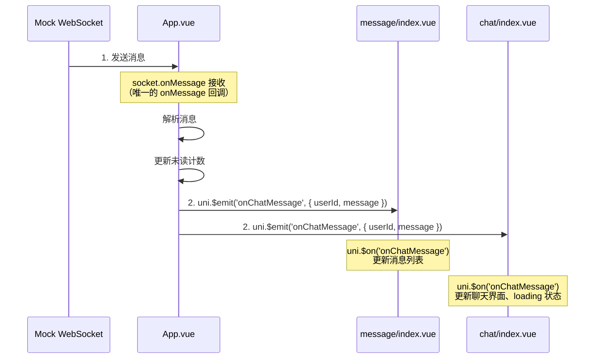

或者使用流程图格式：

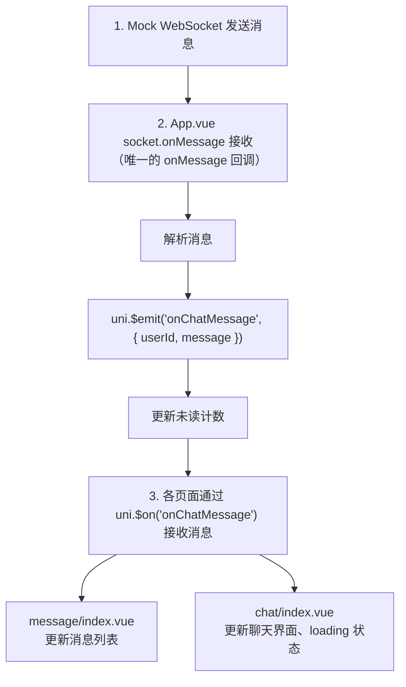

你可以根据需要选择使用时序图（sequenceDiagram）或流程图（flowchart）格式。

-- 2026-02-05 17:45:31
<br>


任务、上下文、范例、角色、格式、语气

-- 2026-02-04 18:30:45
<br>


提示工程师

-- 2026-02-04 18:29:33
<br>

- 走账号默认行为（可能是新面板也可能是旧面板）
- 强制打开旧面板进行分享：页面访问需携带参数 _nsp=2
- 强制打开新面板进行分享：页面访问需携带参数 _nsp=1
- 如上场景下，切换不同的自定义分享信息正常


-- 2026-02-04 17:22:03
<br>


Vue2 中数组类型的 prop，也要用函数返回。

-- 2026-02-04 09:46:19
<br>

Vue2 组件中尽量不要用 _icon，_value, _placement，一是有警告问题，二是有逻辑或显示问题，比如 guide 中对 _current 的 watch 失效，result 中 _icon 无法显示

-- 2026-02-03 16:41:54
<br>

语法对比

| 写法 | Vue 2 | Vue 3 |
|------|-------|-------|
| `v-model:visible="visible"` | ❌ 不支持 | ✅ 支持 |
| `:visible.sync="visible"` | ✅ 支持 | ❌ 已移除 |
| `:visible="visible" @update:visible="..."` | ✅ 支持 | ✅ 支持 |

使用 `:visible` + `@update:visible` 的手动绑定方式可以**同时兼容 Vue 2 和 Vue 3**。

-- 2026-02-03 15:52:33
<br>


```javascript
newProps[key] = {
  type: [null, ...newType],
  default: null,
};
```

在 Vue 2 中，`type` 数组中包含 `null` 会导致 `Right-hand side of 'instanceof' is not an object` 错误，因为 Vue 2 会对 `type` 数组中的每个元素执行 `instanceof` 检查，而 `null` 不是一个有效的构造函数。

**解决方案**：将 `null` 从 `type` 数组中移除，只保留有效的类型构造函数。如果需要允许 `null` 值，可以通过 `default: null` 和 `validator` 来处理。
[编辑文件中]
已修复！将第 166 行的：

```javascript
type: [null, ...newType],
```

修改为：

```javascript
type: newType,
```

**原因说明**：
- Vue 2 在进行 prop 类型检查时，会遍历 `type` 数组并对每个元素执行 `instanceof` 检查
- `null` 不是一个有效的构造函数，所以 `value instanceof null` 会抛出 `Right-hand side of 'instanceof' is not an object` 错误
- Vue 3 对此做了处理，允许 `type` 中包含 `null`，但 Vue 2 不支持

修复后，`default: null` 仍然保留，这样 prop 的默认值依然是 `null`，只是类型检查时不再包含 `null`。

-- 2026-02-03 15:50:41
<br>


 ✅ Robot 子 Agent 系统已完成

我已经重新检查并确认了整个系统结构完整。以下是文件结构和功能说明：

📁 文件结构

```
src/next-admin-svr/robot/
├── index.ts                          # 模块导出入口
├── types.ts                          # 类型定义
├── orchestrator.ts                   # 编排器（核心调度）
└── agents/
    ├── index.ts                      # Agents 导出入口
    ├── intent-recognition-agent.ts   # 意图识别 Agent
    ├── project-search-agent.ts       # 项目搜索 Agent
    └── publish-agent.ts              # 发布 Agent
```

🔄 工作流程

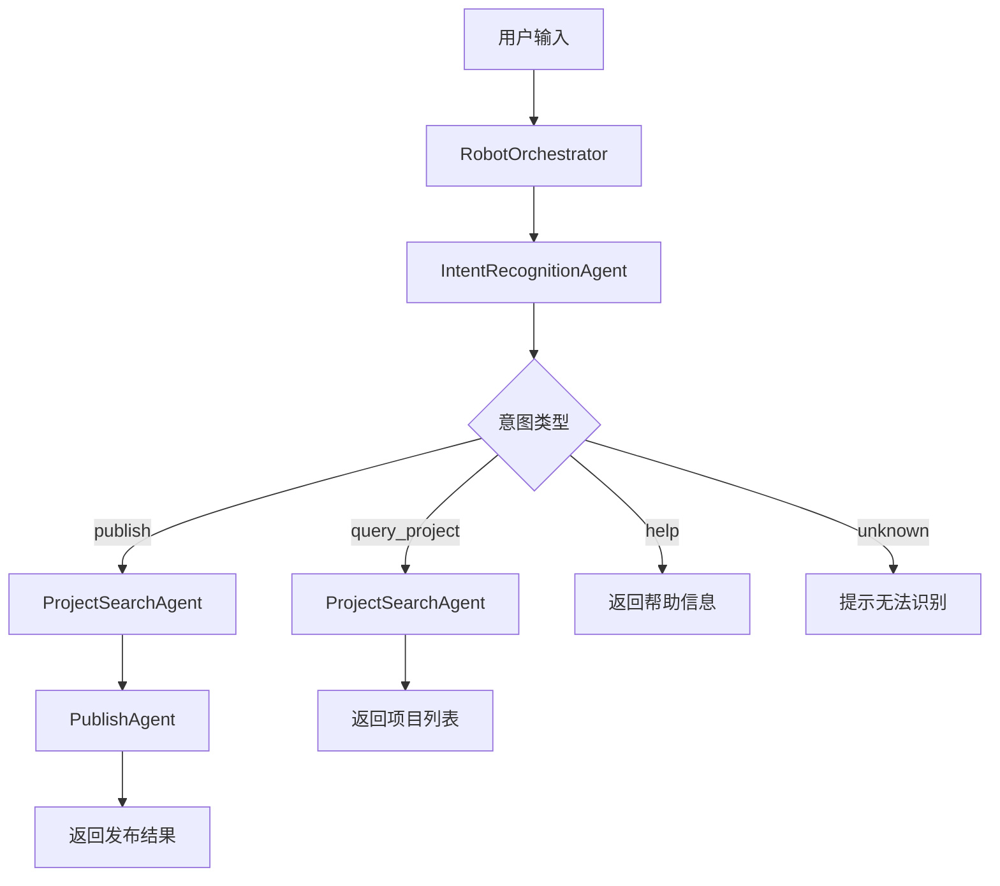

🎯 各 Agent 职责

| Agent | 职责 | 实现方式 |
|-------|------|---------|
| **IntentRecognitionAgent** | 解析用户意图 | 正则匹配 + AI（`@tencent-ai/agent-sdk`） |
| **ProjectSearchAgent** | 模糊匹配项目 | 数据库查询 + 评分算法 |
| **PublishAgent** | 执行发布操作 | 调用 `mcpPublish` |

💬 支持的命令

```
1. 发布 <项目名> [分支名] [发布原因]
   例: 发布 gp-next develop
   例: 发布 gp-next release 修复bug

2. 查询 <项目名>
   例: 查询 gp-next

3. 帮助 / help
```

🔌 集成方式

路由文件 robot.ts 已集成：

```typescript
import { RobotOrchestrator } from '../robot';

const orchestrator = new RobotOrchestrator({
  useAI: true, // 启用 AI 意图识别
});

router.post('/', async (req, res) => {
  const response = await orchestrator.handleMessage(messageText, {
    staffname,
    messageId: req.body.msgid,
  });
  res.send(response);
});
```

 📝 扩展新功能

后续要添加新功能，只需：

1. **定义新的意图类型**：在 `types.ts` 的 `IntentType` 枚举中添加
2. **创建新的 Agent**：在 `agents/` 目录下创建新的 Agent 类
3. **注册到编排器**：在 `orchestrator.ts` 中添加处理流程

例如，添加"回滚"功能：

```typescript
// 1. types.ts
export enum IntentType {
  // ...
  ROLLBACK = 'rollback',  // 新增
}

// 2. agents/rollback-agent.ts
export class RollbackAgent implements IAgent<RollbackParams, RollbackResult> { ... }

// 3. orchestrator.ts handleMessage 中添加 case
case IntentType.ROLLBACK:
  return this.handleRollbackFlow(intent, context);
```


-- 2026-02-03 10:14:17
<br>

如果你现在不花时间，去创造你想要的生活，你将被迫花时间，去应付你不想要的生活。

成功的路上没有人会叫你起床，也没有人会为你买单。

你必须要自我管理，自我突破，自我成长。

-- 2026-02-01 13:46:09
<br>

codebuddy 中的输出内容需要替换

第1步

```js
command:gongfeng[^)]+ 替换为
```


第2步

```js
\[([^]+?)\]\(\) 替换为 $1
```


-- 2026-02-01 11:54:53
<br>


修复说明

1. 移除了 `"type": "module"`

当同时提供 ESM 和 CommonJS 两种格式时，不应设置 `type: module`，而应通过 `exports` 字段来声明不同格式的入口。

2. 修正了入口文件路径

- `main`: `dist/index.js` → `dist/index.cjs`（CommonJS 入口）
- `module`: `dist/index.mjs` → `dist/index.js`（ESM 入口，实际文件名）

3. 添加了 `exports` 字段

```json
"exports": {
  ".": {
    "import": {
      "types": "./dist/types/index.d.ts",
      "default": "./dist/index.js"
    },
    "require": {
      "types": "./dist/types/index.d.ts",
      "default": "./dist/index.cjs"
    }
  },
  "./dist/index.css": "./dist/index.css",
  "./style": "./dist/index.css"
}
```

这样 Node.js 和打包工具会根据导入方式自动选择正确的模块格式：

- ESM 项目（`import`）→ 使用 `dist/index.js`
- CJS 项目（`require`）→ 使用 `dist/index.cjs`

4. 添加了 `sideEffects` 字段

```json
"sideEffects": [
  "dist/index.css",
  "**/*.css"
]
```

告知打包工具 CSS 文件有副作用，防止被 tree-shaking 错误删除。

-- 2026-02-01 11:51:37
<br>

- 正向先行断言，匹配后面紧跟pattern的位置，?=pattern
- 负向先行，匹配后面不紧跟…?!pattern
- 正向后行，匹配前面…?<pattetn
- 负向后行，匹配…?<!pattern

-- 2026-01-30 08:29:31
<br>

通过 scp 同步服务 nginx 配置，下载下来，改好，再上传，还有 git 记录。

-- 2026-01-30 08:04:38
<br>


-- 2026-01-29 11:54:48
<br>


-- 2026-01-29 11:54:33
<br>

```sh
pip3 install lizard -i http://pypi.douban.com/simple --trusted-host pypi.douban.com
```
```sh
lizard  -x "**/node_modules/*"
```

python2 装这个版本

```sh
pip install lizard==1.17.10
```

-- 2026-01-29 11:53:46
<br>

pandoraShowEntrance

-- 2026-01-29 11:49:32
<br>

css 尽量复用小程序端的

1. 小程序端和uniapp端样式部分差异小，相同部分远大于不同部分
2. css 难diff，一行一行的太分散，如果不复用的话，精确同步太费时间

既然要复用CSS

1. 其衍生出的文档中的 CSS 变量部分也要复用，或者生成变量的脚本复用
2. CSS 复制不是一次性工作，所以 uniapp 差异部分不要放在同一个文件里，单独拿出来或放到 vue 文件中

-- 2026-01-29 11:49:07
<br>

td-uniapp 样式处理

- 执行 notes/scripts/td/copy-less-files.js

-- 2026-01-29 11:48:18
<br>

不管分销转换产品、游戏还是其他维度，关键词TIP_STYLE_NAME可以代替任何东西，凡是需要编译时进行单独打包的都可以用这个。

-- 2026-01-29 11:44:17
<br>

```sh
grep "\[webHookData\]" /root/.pm2/logs/rd-platform-svr-out.log -A 200 -B 20

grep "\[nextSubProjectName\]" /root/.pm2/logs/rd-platform-svr-out.log -A 5 -B 5
```

-- 2026-01-29 11:41:41
<br>

pixui 中使用 vConsole 的卡点

- parentElement
- initCustomEvent
- css variables

```js
return new CustomEvent(type, {
    detail,
    bubbles,
    cancelable
  })
```


-- 2026-01-29 11:38:02
<br>


tsconfig.json用根目录的。

tdesign-miniprogram 依赖版本太低。

-- 2026-01-29 11:36:49
<br>


-- 2026-01-29 11:36:10
<br>

https://image-1251917893.cos.ap-guangzhou.myqcloud.com/next-svr/files/2025/10/own_mike_kCJpK32ekenn6cdh.html

-- 2026-01-29 11:35:29
<br>

https://image-1251917893.file.myqcloud.com/igame/html/auto-scheme-mp.html?scheme=weixin%3A%2F%2Fdl%2Fbusiness%2F%3Fappid%3Dwx92e3eeeae1a636de%26path%3Dviews%2Fmatch-reward-claim%2Findex%26env_version%3Dtrial%26query%3DgameId%253D123

-- 2026-01-29 11:35:08
<br>

test

-- 2026-01-29 11:16:11
<br>


目前的构建包

包名|	作用
---|---
cherry-markdown.js<br/>cherry-markdown.min.js | 完整包，较大，包含cherry所有功能（工具栏、左侧编辑器、右侧预览器）
cherry-markdown.core.js	| 核心包，相比完整包，只少了mermaid功能，包大小小了50%以上（当然也可以在引入核心包后再传入mermaid，从而实现对mermaid的支持）
cherry-markdown.engine.core.js	| 解析引擎包，可以理解为只提供了将md解析成html的api

目标

在纯流式渲染的场景下，每个包都很大，希望再提供一个针对纯流式渲染场景的构建包，包里去掉：1、editor（编辑器组件，但可能要保留一个textarea）、toolbar（工具栏组件，包括顶部工具栏、侧边栏、悬浮目录）、mermaid（这个包太大了，引导用户自己引入就好了）

包名大概为：cherry-markdown.stream.js

确认排除的依赖：

- mermaid - 通过 rollup.stream.config.js 的 external 配置排除
- codemirror - 通过 rollup.stream.config.js 的 external 配置排除
- mathjax/katex - 没有打包进去，但在 Engine.js 中会动态加载（通过配置的 src 和 css）


-- 2026-01-28 17:13:37
<br>

tdesign-vue-next/chat 中 `chat-markdown` 用了 tdesign-web-components 中的 `chat-message/content/markdown-content`，后者又用了 cherry-markdown 中的 `dist/addons/cherry-code-block-mermaid-plugin` 和 `dist/cherry-markdown.core`，不止是 engine，是 core！

-- 2026-01-28 16:15:23
<br>

# `packages/cherry-markdown/src/core` 目录详解

📁 目录结构

```
core/
├── HookCenter.js          # 语法钩子注册中心
├── HooksConfig.js         # 默认钩子配置列表
├── SyntaxBase.js          # 行内语法基类
├── ParagraphBase.js       # 块级语法基类
├── SentenceBase.js        # 句子级钩子基类（已弃用）
└── hooks/                 # 具体语法钩子实现
    ├── 块级语法 (22个)
    └── 行内语法 (15个)
```

---

🎯 核心文件详解

1. HookCenter.js - 语法钩子注册中心

**作用**：管理所有 Markdown 语法钩子的注册、分类和优先级

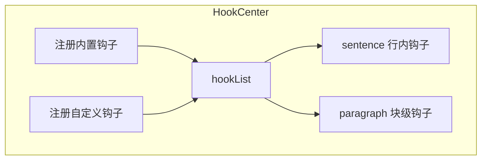

**核心功能**：
| 方法 | 说明 |
|------|------|
| `registerInternalHooks()` | 注册系统内置的语法钩子 |
| `registerCustomHooks()` | 注册用户自定义的语法钩子 |
| `register()` | 实际注册一个钩子实例 |
| `getHookList()` | 获取所有钩子（按类型分组） |

**关键逻辑**：
```javascript
// 钩子分为两类
this.hookList = {
  sentence: [],  // 行内语法钩子（如加粗、斜体）
  paragraph: [], // 块级语法钩子（如标题、代码块）
};
```

**自定义钩子支持**：
- 可以指定 [`before`]()/[`after`]() 插入位置
- 可以设置 `force: true` 覆盖同名内置钩子

---

2. HooksConfig.js - 默认钩子配置

**作用**：定义所有内置语法钩子的**加载顺序**

**执行顺序规则**：
- [`beforeMakeHtml`]()：按数组顺序**正序**执行
- [`makeHtml`]()：按数组顺序**正序**执行
- [`afterMakeHtml`]()：按数组顺序**逆序**执行

**钩子加载顺序**：
```javascript
const hooksConfig = [
  // === 块级语法（先处理） ===
  FrontMatter,     // YAML 前置元数据
  CodeBlock,       // 代码块 ```
  InlineCode,      // 行内代码 `
  InlineMath,      // 行内公式 $
  MathBlock,       // 块级公式 $$
  AiFlowAutoClose, // AI 流式输出自动闭合
  HtmlBlock,       // HTML 块
  Footnote,        // 脚注 [^1]
  CommentReference,// 注释引用
  Transfer,        // 转义字符
  Br,              // 换行
  Table,           // 表格
  Toc,             // 目录
  Blockquote,      // 引用 >
  Header,          // 标题 #
  Hr,              // 水平线 ---
  List,            // 列表
  Detail,          // 折叠块 <details>
  Panel,           // 面板
  Paragraph,       // 普通段落

  // === 行内语法（后处理） ===
  Emoji,           // 表情 :smile:
  Image,           // 图片 
  Link,            // 链接 []()
  AutoLink,        // 自动链接
  Emphasis,        // 强调 *斜体* **粗体**
  BackgroundColor, // 背景色
  Color,           // 文字颜色
  Size,            // 字体大小
  Sub,             // 下标
  Sup,             // 上标
  Ruby,            // 注音
  Strikethrough,   // 删除线
  Underline,       // 下划线
  HighLight,       // 高亮
  Suggester,       // @ 提及
  Space,           // 连续空格
];
```

---

3. SyntaxBase.js - 行内语法基类

**作用**：所有**行内语法**钩子的基类（如加粗、斜体、链接）

**生命周期方法**：
```javascript
class SyntaxBase {
  // 在主渲染前预处理
  beforeMakeHtml(str) { return str; }

  // 核心渲染方法：Markdown → HTML
  makeHtml(str) { return str; }

  // 渲染后处理
  afterMakeHtml(str) { return str; }

  // 测试字符串是否匹配当前语法
  test(str) { return this.RULE.reg.test(str); }

  // 定义匹配规则（子类必须重写）
  rule(editorConfig) {
    return { begin: '', end: '', content: '', reg: new RegExp('') };
  }
}
```

**类型定义**：
```javascript
export const HOOKS_TYPE_LIST = {
  SEN: 'sentence',    // 行内语法
  PAR: 'paragraph',   // 块级语法
  DEFAULT: 'sentence',
};
```

---

4. ParagraphBase.js - 块级语法基类

**作用**：所有**块级语法**钩子的基类（如标题、代码块、表格）

**与 SyntaxBase 的区别**：
| 特性 | SyntaxBase | ParagraphBase |
|------|------------|---------------|
| 类型 | sentence | paragraph |
| 缓存机制 | ❌ | ✅ |
| 换行处理 | ❌ | ✅ |
| 行号计算 | ❌ | ✅ |

**缓存机制**：
```javascript
// 缓存用于提升性能，避免重复渲染
pushCache(str, sign, lineCount)  // 存入缓存
popCache(sign)                   // 取出缓存
restoreCache(html)               // 还原所有缓存
checkCache(wholeMatch, ...)      // 检查是否命中缓存
```

**缓存键格式**：
```
~~C${cacheCounter}I${sign}_L${lineCount}$
例如：~~C0Iabc123_L5$
```

**换行处理**：
```javascript
// 经典模式 vs 现代模式
this.classicBr = true;  // 一个换行被忽略，两个换行分段
this.classicBr = false; // 一个换行变<br>，两个换行分段
```

---

5. SentenceBase.js - 句子级基类（已弃用）

**作用**：早期版本的钩子基类，现已基本弃用

```javascript
class HookBase {
  getType() {
    const typeList = { 1: 'sentence', 2: 'paragraph', 3: 'page' };
    return typeList[this.HOOKTYPE] || 'sentence';
  }
}
```

---

📂 `hooks/` 子目录 - 具体语法实现

块级语法钩子（22个）

| 文件 | 钩子名 | 语法示例 | 说明 |
|------|--------|----------|------|
| Header.js | `header` | `# 标题` | 支持 ATX（#）和 Setext（===）两种风格 |
| CodeBlock.js | `codeBlock` | ` ```js ` | 支持语法高亮、行号、复制、展开、自定义渲染器 |
| Table.js | `table` | `\|a\|b\|` | 支持对齐、图表渲染（ECharts）|
| List.js | [`list`]() | `- item` | 支持有序、无序、任务列表、多种样式 |
| Blockquote.js | `blockquote` | `> 引用` | 引用块 |
| MathBlock.js | `mathBlock` | `$$ ... $$` | 块级数学公式（MathJax/KaTeX）|
| Footnote.js | `footnote` | `[^1]` | 脚注 |
| Toc.js | `toc` | `[[toc]]` | 自动生成目录 |
| Hr.js | `hr` | `---` | 水平分割线 |
| Br.js | [`br`]() | 换行 | 换行处理 |
| HtmlBlock.js | `htmlBlock` | `<div>` | HTML 块级元素 |
| FrontMatter.js | `frontMatter` | `---\nyaml\n---` | YAML 元数据 |
| Panel.js | `panel` | 自定义面板 | 信息/警告/错误面板 |
| Detail.js | `detail` | `<details>` | 可折叠内容 |
| Paragraph.js | `paragraph` | 普通文本 | 普通段落（兜底） |
| CommentReference.js | `commentReference` | `[ref]: url` | 全局引用定义 |
| Transfer.js | `transfer` | `\*` | 转义字符处理 |
| AiFlowAutoClose.js | `aiFlowAutoClose` | - | AI 流式输出自动闭合 |
| InlineCode.js | `inlineCode` | `` `code` `` | 行内代码（在块级处理）|
| InlineMath.js | `inlineMath` | `$x^2$` | 行内公式（在块级处理）|

行内语法钩子（15个）

| 文件 | 钩子名 | 语法示例 | 说明 |
|------|--------|----------|------|
| Emphasis.js | `fontEmphasis` | `**粗体**` `*斜体*` | 支持 * 和 _ 两种符号 |
| Image.js | `image` | `!alt` | 支持扩展属性、视频/音频 |
| Link.js | `link` | [`text`]() | 支持 target 属性 |
| AutoLink.js | `autoLink` | `https://...` | 自动识别 URL |
| Strikethrough.js | `strikethrough` | `~~删除~~` | 删除线 |
| Underline.js | `underline` | - | 下划线 |
| HighLight.js | `highLight` | `==高亮==` | 文字高亮 |
| Color.js | `color` | - | 文字颜色 |
| BackgroundColor.js | `backgroundColor` | - | 背景颜色 |
| Size.js | `size` | - | 字体大小 |
| Sub.js | `sub` | `H~2~O` | 下标 |
| Sup.js | `sup` | `X^2^` | 上标 |
| Ruby.js | `ruby` | - | 注音（ruby 标签）|
| Emoji.js | `emoji` | `:smile:` | 表情符号 |
| Suggester.js | `suggester` | `@user` | @ 提及/智能建议 |
| Space.js | `space` | 多个空格 | 连续空格保留 |
| SuggestList.js | - | - | Suggester 的辅助模块 |
| Emoji.config.js | - | - | Emoji 配置数据 |

---

🔄 语法解析流程

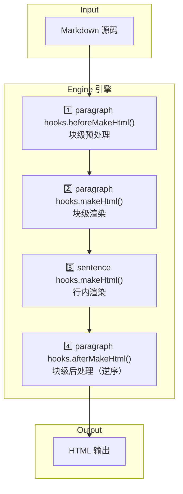

---

🛠️ 如何创建自定义语法钩子

1. 行内语法示例

```javascript
import SyntaxBase from '@/core/SyntaxBase';

class MyInlineHook extends SyntaxBase {
  static HOOK_NAME = 'myInline';

  makeHtml(str) {
    return str.replace(/\[\[(.+?)\]\]/g, '<mark>$1</mark>');
  }

  rule() {
    return {
      begin: '\\[\\[',
      content: '(.+?)',
      end: '\\]\\]',
      reg: /\[\[(.+?)\]\]/g,
    };
  }
}
```

2. 块级语法示例

```javascript
import ParagraphBase from '@/core/ParagraphBase';

class MyBlockHook extends ParagraphBase {
  static HOOK_NAME = 'myBlock';

  constructor() {
    super({ needCache: true }); // 启用缓存
  }

  makeHtml(str, sentenceMakeFunc) {
    return str.replace(/:::(\w+)\n([\s\S]+?)\n:::/g, (match, type, content) => {
      const { html } = sentenceMakeFunc(content);
      return this.pushCache(`<div class="${type}">${html}</div>`, this.sign);
    });
  }
}
```

---

📊 核心类继承关系

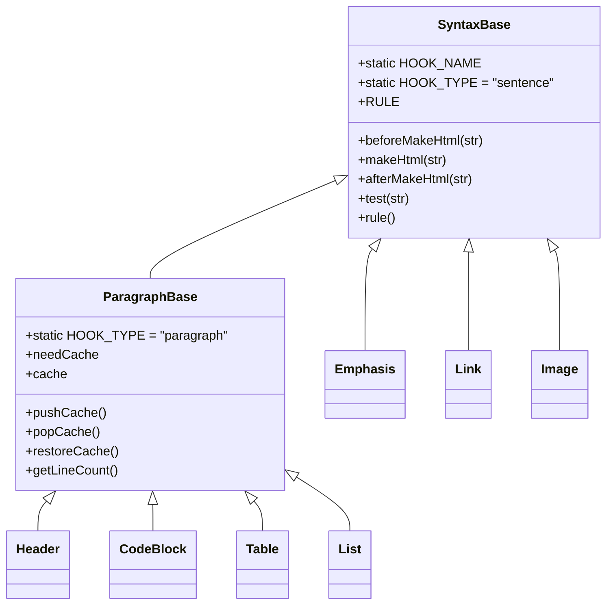

---

📝 总结

`core` 目录是 Cherry Markdown 的**语法解析核心**：

1. **HookCenter** - 统一管理所有语法钩子的注册和调度
2. **HooksConfig** - 定义语法处理的优先级顺序
3. **SyntaxBase** - 行内语法的基类（轻量、无缓存）
4. **ParagraphBase** - 块级语法的基类（支持缓存、行号计算）
5. **hooks/** - 37 个具体语法实现

**设计亮点**：
- 🔌 **插件化**：支持自定义语法扩展
- ⚡ **高性能**：块级语法支持缓存
- 🎯 **优先级**：通过配置数组控制处理顺序
- 🔄 **生命周期**：[`beforeMakeHtml`]() → [`makeHtml`]() → [`afterMakeHtml`]()


-- 2026-01-28 15:18:41
<br>

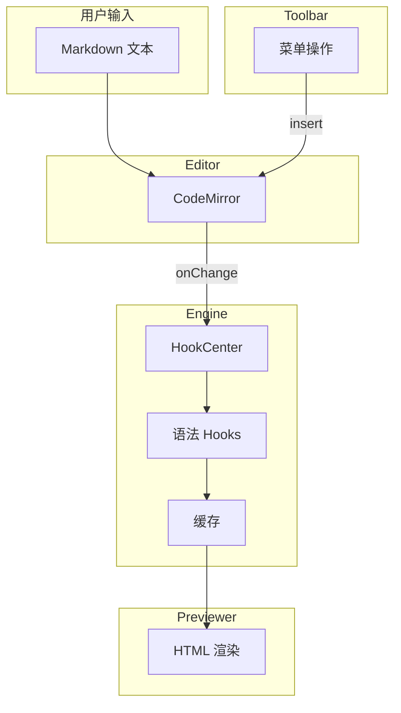

-- 2026-01-28 11:42:05
<br>

语法丰富、开箱即用、易于扩展且高性能的 Markdown 编辑器

-- 2026-01-28 09:52:13
<br>

方法永远可以做到不私密，如果存在私密的方法，那么可以拆分出不私密的方法和私密的变量。

真正私密的永远是配置信息、密钥等常量，所以上面的方式永远有效。

-- 2026-01-28 00:56:06
<br>

plugin-light-const 的定位：

1. 放配置信息、常量定义，比如 getCdnList
2. 有点私密，不方便放 t-comm 里
3. 如果是需要运行时和编译时都需要的函数，放到 t-comm 里，而不是 project-config-const 中

-- 2026-01-28 00:53:47
<br>


-- 2026-01-27 20:51:48
<br>


-- 2026-01-27 20:51:11
<br>


-- 2026-01-27 16:51:55
<br>

https://github.com/dcloudio/uni-app/issues/3793 这个评论不错，提到了 rpx 在uniapp H5 中的转换

-- 2026-01-27 11:27:01
<br>

小程序是去中心化的，用户创造、使用都是通过搜索、扫码、分享等形式，是自发的。

-- 2026-01-26 20:31:45
<br>

- 收入是产品的副产品，不是为了收入做产品，但是游戏好像是为了收入而做的。
- 做游戏的意义感是啥。
- mark: 钱给够
- 微信没有很多很多产品，比ieg更缺少锻炼
- 人不是培养的，而是筛选出来的
- 不能在一个地方待着。

-- 2026-01-26 18:01:01
<br>

要验证 PR 的改动（pkg.pr.new），或者 npm 包内容

1. 进入工程，`cd packages/tdesign-uniapp/example`
2. 去掉 `vite.config.ts` 中 `alias` 的配置
3. 装包，如 `pnpm i https://pkg.pr.new/Tencent/tdesign-miniprogram/tdesign-uniapp@4201`
4. 执行 `dev` 等命令，如 `npm run dev:h5`

-- 2026-01-26 17:59:42
<br>

demo 同步

一次性工作。

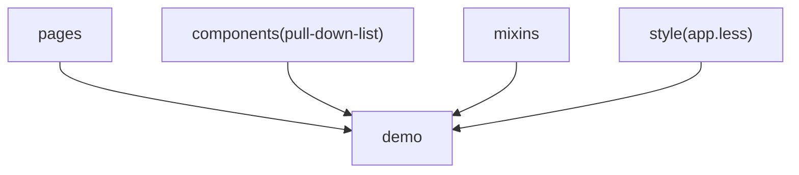

这部分是从 `vue3-cli` 同步到 `app/vue2-cli` 等目录中的。

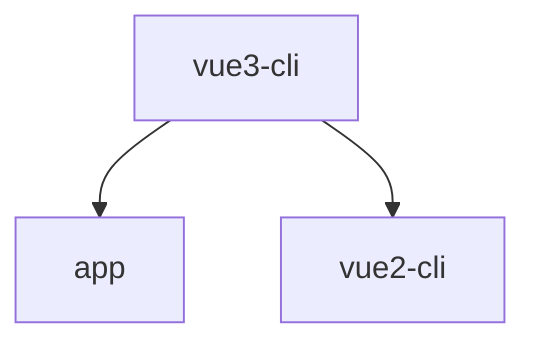

需要监听的部分，主要是组件和示例，组件目标是 `_tdesign`，或者 `uni_modules/tdesign-uniapp` 下。

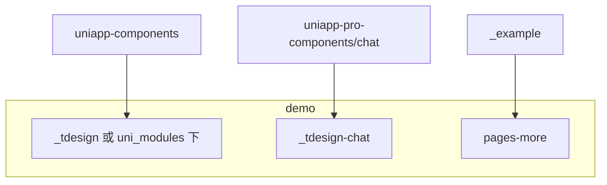

这部分是从 `uniapp-components` 等同步到 `vue3-cli/app/vue2-cli` 等目录中的。

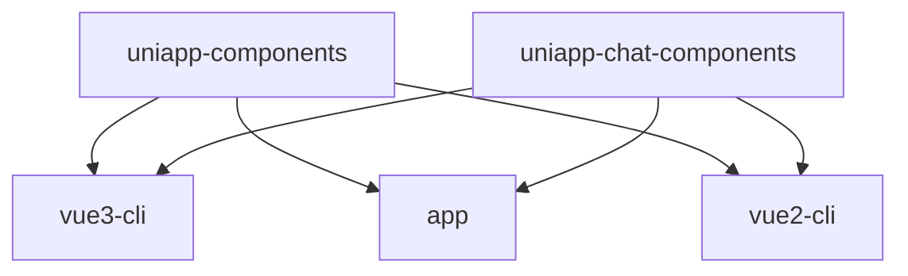

每个项目独特的部分

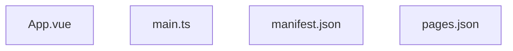

-- 2026-01-26 15:35:00

小程序长按图片，保存图片没反应？

原因是没返回签名地址，比较坑的是没有提示。

- 错误的：https://gamelife-1251917893.igcdn.cn/hpmatch/hpmatch_F6dFij4NT8R5.jpg
- 正确的：https://gamelife-1251917893.igcdn.cn/hpmatch/hpmatch_F6dFij4NT8R5.jpg?q-sign-algorithm=sha1&q-ak=xx&q-sign-time=xx&q-key-time=xx&q-header-list=host&q-url-param-list=&q-signature=xx

-- 2026-01-26 15:05:00

- https://github.com/Tencent/tdesign-miniprogram/pull/4112/changes
- https://github.com/Tencent/tdesign-miniprogram/pull/4124/changes

这两个还要再看下

-- 2026-01-26 12:43:28
<br>

td-mini 同步 td-uniapp 的步骤：

1. 可选，在 td-mini 大仓下进行 build 脚本的改造，去掉 `jsmin/jsonmin/wxmlmin` 的使用
2. 执行 `npm run build`（或者 `npm run build -- --ignore-terser`），生成 `_example` 目录
3. 复制 `_example` 目录到 `mini-to-uni` 工程下，进行覆盖
4. 可选，删除之前的 `_example_uni`
5. `mini-to-uni` 工程下执行 `node ./bin/wtu -i ./_example` 进行 uniapp 组件生成
6. 手动 diff，结合 PR，Git 记录，更新 td-uniapp 组件库

-- 2026-01-26 12:31:56
<br>

`1.t-grid-item__content--left` 需要加上 `width: 100%;box-sizing: border-box;`，否则边框位置不对。


-- 2026-01-26 12:02:44
<br>

- 拉起链接 https://cdn.partner.esports.pubgmobile.com/os-pubgm/en/link.html?scheme=igame1320%3A%2F%2F%3Fmodule%3D1000096%26gameId%3Dafp5CYxaDf524MmUiETKmc%26teamId%3D199D4B3B%26from%3DteamDetailShare

- 配置地址 `game://?module=1000096`

-- 2026-01-26 11:06:55
<br>

地区选择那个，不能用 selectedIndex === optionIndex 判断当前是否选中，因为搜索框的存在，下拉框是会变的。

比如你选了泰国，selectedIndex 为 0，搜索了 马来西亚，由于 selectedIndex 没变，所以导致 马来西来依然高亮，用户会误解。

当然也可以在 searchValue 或者 options 改变的时候，更新下 selectedIndex。

-- 2026-01-26 10:20:19
<br>

要将所有的 :deep 改成 custom-style，工作量有点大，退而求其次，只在组件 less 中加 :deep，不加、不删、不改其他样式。有改动的，记录下来，比如 dialog.less 的改动如下：


-- 2026-01-26 00:28:41
<br>

其实用 `:deep(xx)` 也是有兼容性问题的，Vue2 需要换，不如直接用 customStyle

-- 2026-01-25 23:13:45
<br>

packages/tdesign-uniapp/app/ 待删除

-- 2026-01-25 21:13:23
<br>

为什么小程序样式覆盖需要用 `:deep`，而 H5 不需要？

原因是 H5 中节点会合并，或者说会替换成真正的子组件节点，可以看到下面的 `uni-button` 有两个 `data-v-xx`，而小程序不是。


-- 2026-01-25 19:54:49
<br>

文档中单组件“更新日志”有问题，加载不出来

-- 2026-01-25 11:17:36
<br>

贡献指南；mini-to-uniapp commit

-- 2026-01-25 04:26:54
<br>

心如猛虎，细嗅蔷薇

-- 2026-01-25 04:24:01
<br>

td-uniapp 的难点，一是宏观，架构搭建、监听体系、更新策略，二是微观，又可分为实现原理和细节。实现上，对几十个组件了如指掌、如数家珍，不同端的兼容性、差异性有不同的处理策略，细节上，对每个组件的还原效果、深色模式、色值等效果对齐，抠每一处细节。

-- 2026-01-25 04:22:09
<br>

vue2+cli/vue3+cli/vue2+hx/vue3+hx 组件基础示例，vue3+cli/vue3+hx 社区模板；chat mr 合入；eslint问题；src/api合入


-- 2026-01-25 04:14:53
<br>

今日已同步 td-mini 最新改动 v1.12.2（2026-01-21）。不含 chat。

-- 2026-01-25 04:10:00
<br>

td-uniapp 中的示例页面，加上 demo-navbar 类名，就是白底黑色，否则就是透明底默认颜色。

```css
.demo-navbar {
  --td-navbar-bg-color: var(--td-bg-color-container);
  --td-navbar-color: var(--td-text-color-primary);
}
```

-- 2026-01-25 03:54:35
<br>

这个 issue 有意思，[https://github.com/Tencent/tdesign-miniprogram/issues/3986](https://github.com/Tencent/tdesign-miniprogram/issues/3986)。

```ts
export function getMonthByOffset(date, offset) {
  const _date = new Date(date);
  _date.setMonth(_date.getMonth() + offset);
  return _date;
}
```

`getMonthByOffset(value, n)`，如果 value + n 月那一天没有 dd, 则会自动进入下一个月，也就是value+n+1。比如 10月31日 + 1月，会被处理成 12月，正常应该是 11 月。

-- 2026-01-25 00:45:20
<br>

良心，有就是有，没有就是没有，不存在唤醒一说

-- 2026-01-24 20:01:55
<br>

发现问题、提出问题比解决问题更重要

-- 2026-01-24 20:01:04
<br>

孤独是人生常态，不被理解是人生常态，不被认可更是人生常态。

-- 2026-01-24 19:19:59
<br>

批量发布流程

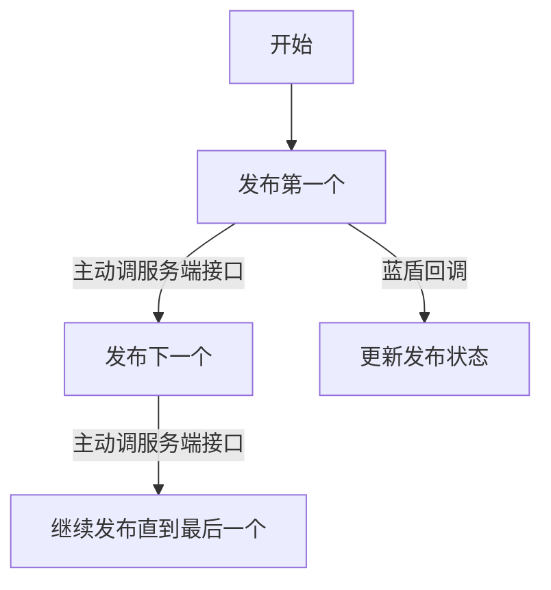


-- 2026-01-20 22:28:38
<br>

批量发布的核心字段 batchUpload，1. server 传给流水线、流水线再回传给 server 2. 操作日志 operation 的 batchUpload 只做留存，无实际作用

-- 2026-01-20 22:24:41
<br>

操作记录 operation 的设计哲学应该是 1 有唯一的 pipelineId、pipelineRunId，且不应该变化 2. 不同类型的操作日志应该有统一的字段，类似于抽象类。

-- 2026-01-20 22:21:57
<br>

将 regionSelect 的 regionOptions 改为受控，当搜索时，之前的 selected 不在 regionOptions 时，就更新 selected。这样可以在 搜到一个值，不点选择，直接点外层确定也不会违反直觉。

search 输入框和 select 的回显用一个，即都是 input，这个之前的逻辑不变。

handleSelect 时，更新 searchValue 为选中的值，这个之前的逻辑不变。

展示 dropdown 时，清空 searchValue，来展示所有 regionOptions，这个之前的逻辑不变。


-- 2026-01-17 00:53:15
<br>

monorepo 仓库的每次提交都应该只改动一个子包的，让 commit 信息更聚焦，生成的 changelog 更易读。

-- 2026-01-15 01:01:13
<br>

没人认可，那就想办法自己扩大自己的影响力，多写文章，多写内容。

-- 2026-01-13 14:07:15
<br>

你一直在拖着，就是潜意识觉得它在等着你，其实不是，有些事，你现在不做，后面就没机会了。

-- 2026-01-12 03:05:08
<br>

活是核心活，事是核心事，人是边缘人。

-- 2026-01-11 14:11:16
<br>


-- 2026-01-10 16:52:13
<br>


-- 2026-01-10 16:51:16
<br>

不应该想着自己至关重要，而应该想着自己无足轻重。从这6年的12次绩效就能看出来了，额外的想法都是幻想。

-- 2026-01-09 19:00:35
<br>

不应该想着上班的时候只做工作，晚上再做开源，而且再尽可能提高效率，上班时做完所有能想到的事情，晚上还有其他学习任务，比如临时看到的好文章，主动搜的b站基础知识，新了解到的框架。

-- 2026-01-09 19:00:13
<br>

又虚伪，又觉自己公正，又菜，又觉自己掌控一切，感觉好恶心。

-- 2026-01-08 21:34:45
<br>

哪怕你写个Vue出来，哪怕你攻克了项目的难点，他一样能找1000个理由给你中低绩效。

-- 2026-01-04 08:30:04
<br>

绩效的本质是认可，跟产出多少没关系。对方认为你做得好你就做得好，认为你不行你做多少也没用。

-- 2026-01-04 08:28:24
<br>

