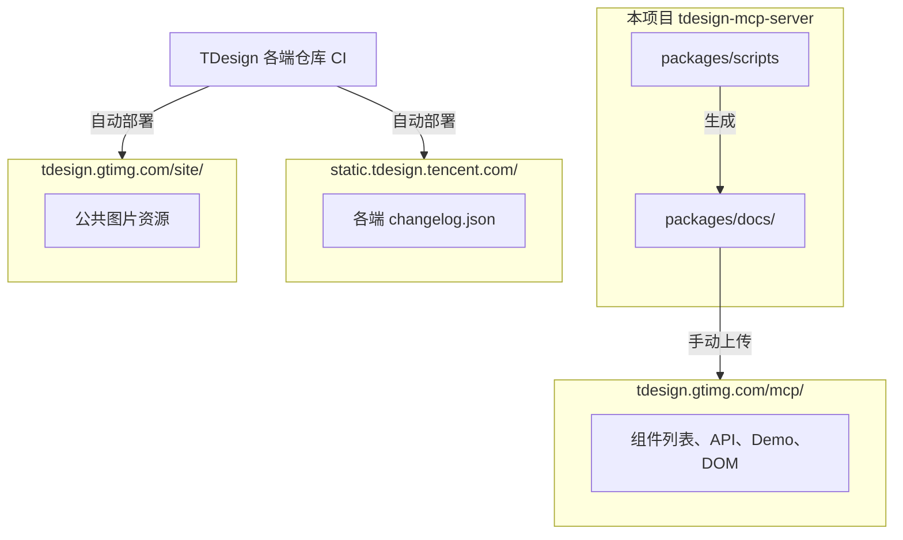
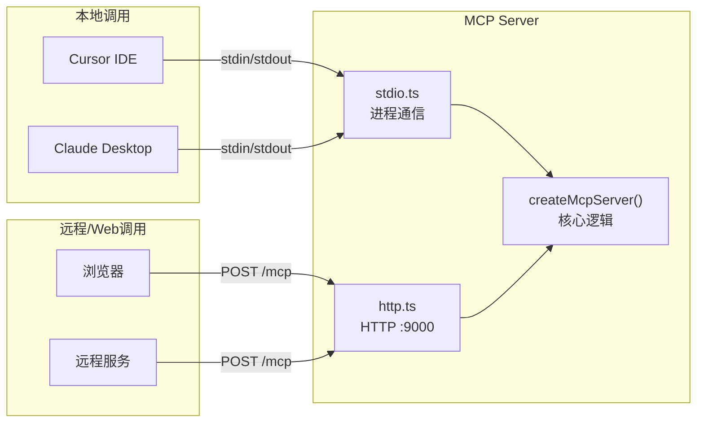

其实，所有的商业模式都可以用这样一句话来概括：为谁提供什么“价值”，靠什么方式转换为“收入”，这两者之间通过什么商业“过程”来支撑。 因此，获取收入的要点就是想清楚价值、收入和过程。

长尾需求就是指多样性用户的过于多样化、个性化的需求，这里最经典的就是亚马逊。原来在线下书店，因为受有限货架的限制，有很多小众图书都买不到，而后来亚马逊就满足了这一需求，由此打开了长尾需求的市场。

-- 2026-02-20 23:11:06
<br>

基因，自驱力。

Ability 能力

我也非常看重优秀的学习能力，和良好的沟通方式。学习能力是优秀产品经理和平庸产品经理的一条分界线。优秀的产品经理一定是喜欢阅读、喜欢总结，能够深度思考并且具备复盘习惯的。想考察这一点，我们可以问问对方有没有在某件事情上成为 Top 1% 的经历。优秀的学习能力是一个人可以不断迭代自我，不断成长的基础。

而沟通方式背后体现的其实是同理心。如果一个人与同事沟通困难，那么他与用户的沟通自然也好不到哪里去。而且，能切换到不同的视角看问题，是做好产品、平衡好用户生态中多种多样用户利益的基础。这一点，在面试全过程中，可以有一个感性的认知。

最后的 Knowledge 知识和 Experience 经历，重点在于匹配。我把这种匹配又分为两部分，一是行业认知，二是项目经验。

-- 2026-02-20 23:03:43
<br>

那产品经理岗位如何做结构化面试呢？我借用从一位企业家那里听来的框架来介绍这件事，这个框架叫“GASKE”，即五个英文单词的首字母：

- G，Gene 基因，是指底层的性格、素质，这是一个人与生俱来和长期生活积淀下来的东西，很难改，比如感性理性、主动被动、内向外向；
- A，Ability 能力，这里的能力偏抽象、难以量化，比如学习能力、沟通能力；
- S，Skill 技术，和能力不同，这里的技术是具象的，比如熟练掌握常用的用户研究技巧、会做全面的竞品分析；
- K，Knowledge 知识，如字面意思，就是知道哪些事情，比如知道产品开发的主干流程、知道硬件产品经常碰到的坑、知道某个行业的规则与潜规则；
- E，Experience 经历，就是说过往的相关工作中，都做过什么事情。

这五方面，越靠前的越本质，越靠后的越表象；越靠前的越稳定，越靠后的越易变。前面的会影响后面的，是后面的基础。

但有趣的是，面试的时候，没经验的面试官往往更关注后面的，比如曾经在某个大厂做过几年、参与过某某业界耳熟能详的产品。

-- 2026-02-20 22:57:11
<br>

产品平台化

这个跨越最关键的变化就是用户出现了多样性，有些用户在满足另一些用户的需求。既然要有平台，就至少有供需双方，比如老师与学生、卖家与买家、司机与乘客、作者与读者……有时候甚至有多方，比如外卖平台上的商家、买家和骑手。这个阶段，产品和用户的关系要从“个体粘性”发展到“群体粘性”，我们可以借助群体中多种用户间的关联，建立平台的增强回路。

-- 2026-02-20 21:41:57
<br>

博得千万人的赞赏，不如得到一个长官的提拔。

博士论文两个难点，一是选题目，二是数据资料。如果一个题目没人选，要么是不值得做，要么是做过的人都失败了。

-- 2026-02-19 14:18:35
<br>

一点也不亲的亲戚。在一个最不开明的地方，遇上一个最不开明的大家长。

-- 2026-02-19 13:26:10
<br>

项目产品化。这是从抓零散的单次机会，转变为打一眼可以持续出水的井。对用户来说，就是要从提供“个体价值”到产生“个体粘性”，一方面是可以持续供给，另一方面是用户持续有需求。类比一下，有点像从采集到农耕、从打猎到游牧的变化，是从打了一只野猪饱餐一顿，跨越到驯化野猪为家猪，大猪生小猪，顿顿有肉吃。

项目产品化，靠的是总结提炼，把服务某个用户的能力，泛化到服务一类用户身上。


-- 2026-02-19 06:33:37
<br>

方法论只能用来提高下限，却无法提升上限。

方法论只能告诉我们哪些方向是大概率要失败的，即方法论可以帮助我们避开天坑、做减法。具体一点，M2V6P 的方法论可以帮助我们更早发现错误，从而减少时间、人员、金钱的损失。这有点像很多伟大的球星，通过日常的刻苦训练，做好每一个基本动作，然后成功的概率就自然提升了。


-- 2026-02-19 06:26:20
<br>

技术的尽头是产品，产品的尽头是商业，商业的尽头是组织

-- 2026-02-19 06:25:06
<br>

再强的人，创新也经常面临失败。

很多硅谷的投资人把失败者看作“有经验的人”，扎克伯格也经常在公司里讲，“如果你没有遇到失败，说明你跑得还不够快。”

这里的“宽容”不但是对“失败”这一结果的宽容，还表现在开始时就做好失败的心理准备，认可“快死”比“半死不活”要好得多。所谓“死亡是一个公司对社会的最后一次贡献”，以及“淘汰掉不适合的人，对双方都是解脱”就是这个意思。

在这种宽容下，风险资本、连续创业者才能愈挫愈勇。

-- 2026-02-19 06:13:37
<br>

而我认为组织、团队能够保持持续创新的真正决定因素，恐怕还是今天这一讲的主题——文化与价值观。是否有创新文化、好奇心，当地的人民群众是否乐于去探索、接受新鲜事物等等才是关键点。

我认为共同构成了硅谷形成的基因序列的是叛逆精神、拒绝平庸、宽容失败、多元文化。


-- 2026-02-19 06:12:04
<br>


整个阿里这么多年，从 PSF 到 PMF 到 PRF，找到了自己的立身之本——让天下没有难做的生意，拥有的资源也是不断累积，一是用户、二是数据、三是各种经验，都围绕着做生意、商业、零售这些话题。

首先说可复用，盒马可以复用阿里已有的资源，比如，在选址时，利用阿里积累的零售数据，知道哪些城市哪些小区的用户，消费能力与盒马比较匹配，消费的商品是盒马有供应链优势的；又比如，通过多年的历史数据，盒马可以有预测地调整采购，避免决策滞后。

然后是能积累，盒马在线下线上产生的各种交易，都是直接数字化的，可以回馈给阿里整个数据池子，丰富整个电商数据，让其他产品可以获益。而盒马在各种大型 Shopping Mall 里积累的经验，又可以指导阿里其他新零售业务的尝试。

最后是善生死，在 2019 年，阿里发现盒马的业务和天猫超市的业务有很大的关联性，于是又做了一些业务和团队上的整合，该增强的增强、该减弱的减弱、该砍掉的砍掉，这波操作，也是我提到的广义的“善生死”。


-- 2026-02-19 06:00:44
<br>

产品创新价值的四个层次
- 发明价值
- 用户价值
- 商业价值
- 社会价值

-- 2026-02-19 05:50:42
<br>

我对发明和创新这两个词有着不同的理解：发明，只需要东西新，但创新，还需要“有用”。

-- 2026-02-19 05:49:04
<br>

我一直说，用户和产品是一体的，协同演化，那么在共同提升产品创新课的价值上，你的每一次分享、转发，都为它做了贡献。

于是乎，我最在乎的成功指标，也一定是和主动分享相关的，而不是付费用户数和收入。


-- 2026-02-19 05:13:33
<br>

产品和工具都是解决某个问题的东西。

-- 2026-02-19 05:08:36
<br>

小结一下，产品到底是什么，以及要做什么？

- 内核：要不断迭代内核。
- 包装：要适应场景包装。
- 服务：要从实体到服务。
- 平台：要从自营到平台。

产品，及其要做的事情，其实包括但不限于以上提到的这些，因为在我的定义里，产品就是“解决某个问题的东西”。随着你对问题思考的不断深入，产品就可以不断延展，要做的事情也会延展，就像千岛湖啤酒，从“酿酒”到“酿造快乐生活”。

-- 2026-02-19 05:07:38
<br>

一、什么是KANO模型

KANO模型（卡诺模型）是东京理工大学狩野纪昭教授于1984年提出的需求分类与优先级排序工具，核心是：不同功能对用户满意度的影响是非线性的。

• 横轴：功能具备程度

• 纵轴：用户满意度

• 用途：划分需求优先级、指导产品研发与资源分配

二、五大需求类型（核心）

1. 必备型需求（Must-be / 基本型）

• 特点：用户认为理所当然必须有；满足了不加分，缺失/不足会极度不满

• 例子：手机能打电话、App能登录、外卖能按时送达

• 策略：必须做、做扎实，是产品底线

2. 期望型需求（One-dimensional / 性能型）

• 特点：用户明确提出，满足度与满意度线性正相关；做得越好越满意，越差越不满

• 例子：手机续航、外卖速度、App响应速度

• 策略：重点投入、做差异化，是竞争主战场

3. 魅力型需求（Attractive / 兴奋型）

• 特点：超出预期、用户想不到；没有不会不满，有了会大幅提升满意度与忠诚度

• 例子：iPhone初代多点触控、外卖送小零食、App夜间模式

• 策略：创新突破、打造亮点，易形成口碑

4. 无差异型需求（Indifferent）

• 特点：用户不在乎；做不做都不影响满意度

• 例子：App换肤、非核心页面的小装饰

• 策略：少投入或不做，避免浪费资源

5. 反向型需求（Reverse）

• 特点：做了反而降低满意度，引起反感

• 例子：强制广告、过度索取隐私、冗余复杂功能

• 策略：坚决不做

三、优先级排序（黄金法则）

1. 先保必备型：守住底线，不踩坑

2. 再做期望型：提升竞争力，满足显性需求

3. 最后做魅力型：创造惊喜，打造差异化

4. 砍掉无差异/反向：避免无效投入

四、怎么用（快速落地）

1. 列出待评估功能

2. 设计问卷：分别问用户“有这个功能”和“没有这个功能”的感受

3. 按规则归类到5类

4. 按优先级排期开发


-- 2026-02-19 04:48:43
<br>

老婆曾说，爸爸如此的任劳任怨，所以才有这么多工头愿意找他。在家里也是，干活不说累，不挑活，不耍滑头。

-- 2026-02-18 23:23:03
<br>

如梦一般的日子转眼就过去了。

-- 2026-02-18 22:01:12
<br>

杂草。有人弃你如杂草。

-- 2026-02-18 22:00:18
<br>

有花堪折直须折，莫待无花空折枝。能卷的时候就要卷。

-- 2026-02-18 21:59:35
<br>

- 痛点：基础功能，没有的时候不可忍受；
- 爽点：亮点功能，有了以后惊喜连连；
- 痒点：期望功能，可有可无，能有最好。

今天我们系统梳理了一下 KANO 模型对应的五种功能，并且给出了做产品创新时的应对之策：

- 基础功能：留足资源；
- 亮点功能：做成本低的（对更多创新产品而言）；
- 期望功能：看性价比；
- 无差别功能：做好低成本验证；
- 反向功能：权衡多方利益。

-- 2026-02-18 15:20:32
<br>

定性研究通常是对少量样本的深入研究，可以找出问题的原因，属于个体研究；而定量研究是对大量样本的研究，可以发现现象、验证事实，属于群体研究。

定性研究可能会存在的问题是“以偏概全”。

简单来说，如果你的产品有几百万用户，而定性研究经常只针对几十个用户，那么这几十人是否能代表全体呢？比如你为了调研的方便，只选取了北京五环内的用户，这种情况下很可能被部分样本的特殊情况带入歧途，所以我们要辅以定量的方法。

但是定量会“以表代本”（表面的表，本质的本），只能用来发现表面的现象，却无法从中知道背后的深层次原因。

比如，你通过定量的数据发现 11 月份用户活跃度比 10 月份降了 5 个百分点，那么，就可以抽取几个 10 月活跃但 11 月不活跃的用户，做一个定性的访谈，来搞清楚到底发生了什么。

需求采集理解用户的过程，并不违背人类认知新事物的一般规律——从观点到行为，再从行为到观点，一样会从定性到定量，再从定量到定性，以实现螺旋式上升，使了解和证实在不断迭代中得到进化。

-- 2026-02-18 10:25:07
<br>

“双十一”的例子说完，我发现“做出来”和“推出去”效率的提升方法，其实也可以用在生活中。

比如我知道有些程序员，夏天会一次性买一打黑色 T 恤，想必这种标准化操作，这就是他们能提升生活效率，空出更多时间写代码的绝招吧。


-- 2026-02-18 10:15:04
<br>

对比总结一下，我觉得——不那么好的指标（我们在后面把它叫做虚荣指标），通常是对公司有价值的，而好的指标，是对用户有价值的，我们把它叫做成功指标。

所以，我试着下了一个定义：真正的成功指标，是可以反映出用户“非受迫、无诱导的成功行为”的。这里有三个关键词，我来解释一下：

- 非受迫：用户没有被逼着做没价值的事情，比如有些 App 里的签到才能获得某个价值；
- 无诱导：用户的行为不是“奖励就有，没奖励就没有”，比如有红包才会转发；
- 成功行为：指的是指标考察的行为，本身就为用户创造了价值，而不只对公司有价值。

当然，这里还有一个前提，那就是“真正的成功指标”要与正确的业务目标契合。

再来体会一下上面的几个例子：

- 得到用户对内容的主动分享数据，非受迫、无诱导，用户价值是让自己有优越感，让朋友们听到了好的内容；
- 支付宝用户的支付成功率，非受迫、无诱导，用户价值显而易见；
- 网易云音乐用户的主动评论数据，非受迫、无诱导，用户价值是自我表达，互动分享。

-- 2026-02-17 23:06:16
<br>


简单地说，验证期做留存，爆发期做拉新，平台期做激活，衰退期做变现。随着版本的迭代，成功的产品呈现波浪式上升的曲线，可以把早期版本的衰退化于无形。

而更长期来看，产品和用户生态是协同演化的，各种要素一起，决定了整个生态的走向，我们要尊重自然规律，顺势而为。


-- 2026-02-17 22:58:27
<br>

一个产品的从无到有，要想清楚、做出来、推出去。

-- 2026-02-17 22:57:42
<br>


用户使用产品的逻辑是依次经历四个模块：发现、启程、习惯、精通，但做产品的顺序应该是：习惯、启程、发现、精通。

这样的产品起步思维是有实用场景的，更适用于正在从小量用户逐步扩展到大量用户的产品。如果你服务的是少数大客户，第一次交付的产品就需要已经相对完整才行。


-- 2026-02-17 22:43:06
<br>

在生活中，我一直觉得和别人建立关系的过程，很像好产品依次呈现出的特性，这是给一个很有意思的话题，你可以对应思考，我们顺便复习一下。

某个时间点上，你要依次让对方觉得你有用（帮他解决问题）、好用（服务心态，为对方着想）、爱用（带上一些温暖的关怀）。

随着时间推移，你要依次呈现出个体价值（就是有用、好用）、个体粘性（你是个靠谱的人，合作愉快）、群体粘性（互相融入对方的朋友圈）、生态系统（建立更深的长期合作，彼此成就）的特性。


-- 2026-02-17 22:35:01
<br>

在生活中，我一直觉得和别人建立关系的过程，很像好产品依次呈现出的特性，这是给一个很有意思的话题，你可以对应思考，我们顺便复习一下。

某个时间点上，你要依次让对方觉得你有用（帮他解决问题）、好用（服务心态，为对方着想）、爱用（带上一些温暖的关怀）。

随着时间推移，你要依次呈现出个体价值（就是有用、好用）、个体粘性（你是个靠谱的人，合作愉快）、群体粘性（互相融入对方的朋友圈）、生态系统（建立更深的长期合作，彼此成就）的特性。


-- 2026-02-17 22:34:39
<br>

简单地说，使命是“我们要做什么”，愿景是“我们希望成为什么”，价值观就是“对事情对错、优先级的判断准则”。用通俗的话来说，就是要想清楚自己到底想做什么，这辈子是为什么而活，从而做到“有所为，有所不为”。

每家足够成功的公司，他们的终极目标都不是赚钱，比如阿里要“让天下没有难做的生意”，Google 要“整合全球信息，使人人都能访问并从中受益”。

这个世界上没有什么有价值的事情可以随随便便、轻轻松松达成，只有想清楚了这事儿符合自己的意愿，符合自己的起心动念，才能在碰到困难的时候依然坚持走下去。

-- 2026-02-17 12:11:09
<br>

不知道你有没有理解，最最广义的竞品，它的本质到底是什么？

在我看来，只要两个产品的目标用户是同一群人或者组织，那这两个产品在某种程度上都会形成竞争关系。当然，竞争与合作在这个时代是可以并存的，竞争不是你死我活，也可以是互相成就。所有的广义竞品一起，组成了一个跨公司的产品矩阵，共同服务着某一群用户。

-- 2026-02-17 10:55:29
<br>

当你的认知太过局限的时候，很多选择根本不存在，也就很难设计出更优的解决方案。打开对广义竞品的视野是产品创新的第一步，是非常关键的。

-- 2026-02-17 10:54:49
<br>

我将“加深用户理解”的过程分为四个主要步骤，分别是用户故事、用户生态、用户画像、用户旅程。自始至终，有没有产品并不是关键，关键是充分理解用户。

-- 2026-02-17 10:38:27
<br>

任何一个真正值得解决的问题，用户一定已经开始尝试解决了。

-- 2026-02-17 10:37:46
<br>

所以，岗位不重要，解决问题才重要，多年来，我自己做事围绕的关键词从产品经理到产品思维，再到产品创新，看似区别不大，可背后其实是我自己认知的提升。

- 产品经理阶段：我自己在做这个岗位，也会服务产品经理同行。
- 产品思维阶段：我去服务泛产品经理，抽象出背后相对通用的思维方式，去影响更多人。
- 产品创新阶段：我认识到产品思维是方法，而产品创新是目的，更直接地，从想到做，从思维方式到做事方法，更落地。

最后，我将这一讲的内容小结为一句话——“做产品，而不是做产品经理”。

产品经理岗位，终将不再存在，做出更好的产品，会是人类永恒的追求，而适应新时代的产品创新方法，就是做出更好产品的钥匙。

-- 2026-02-17 10:28:12
<br>

由目标的差异推导，你不难发现，项目经理更强调执行，是接到一个任务，正确地做事，产品经理更强调创新，是设定一个目标，做正确的事。这两种能力很难兼备，甚至有些互相冲突。回顾过去几十年，我的体会是，过去更强调项目经理，而现在更强调产品经理，这个变化有着很深刻的时代背景。

那就是，我们的社会，各种产品的供给，都在从短缺走向丰饶。

当供给短缺时，所有的产品做出来，都不愁没人用、没人买。于是，竞争变成厂家之间的行为，所有人都在追求谁能更高效地把产品做出来，这时的用户需求并没有那么重要。

而随着技术的进步，工具的发达，产品供给开始丰饶起来，用户的选择越来越多，这时候的竞争，就更重视谁能够打动用户，谁能成为用户的首选。

-- 2026-02-17 10:24:44
<br>

不知道是老家的方言，还是说它们的人，总是一副牛逼哄哄，高高在上的语气，仿佛开天的是他们，不是盘古，补天的是他们，不是女娲。

-- 2026-02-17 10:17:36
<br>

据可查的资料显示，产品经理（Product Manager）诞生于 20 世纪二三十年代的宝洁，产品经理做的事情呢，听起来和项目经理（Project Manager）很像。没错，这两个“经理”都是一个跨职能部门的负责人，通常都没有实权，而且需要做很多沟通协调的事情。

-- 2026-02-17 10:15:55
<br>




| CDN 地址 | 维护者 | 上传方式 |
|---------|-------|---------|
| `tdesign.gtimg.com/mcp/` | 本项目 | 手动上传 |
| `static.tdesign.tencent.com/` | TDesign 官方 | CI 自动部署 |
| `tdesign.gtimg.com/site/` | TDesign 官方 | CI 自动部署 |


-- 2026-02-14 15:11:39
<br>



-- 2026-02-14 14:58:30
<br>

6. 组件列表 https://tdesign.gtimg.com/mcp/web-components.json

-- 2026-02-14 14:50:02
<br>

1. 组件列表 https://tdesign.gtimg.com/mcp/tdesign-vue-next/index.json
2. dom 结构 https://tdesign.gtimg.com/mcp/tdesign-web-dom/avatar.html
3. 文档 https://tdesign.gtimg.com/mcp/tdesign-vue-next/button/api.md
4. 示例 https://tdesign.gtimg.com/mcp/tdesign-react/button/Demo.tsx，https://tdesign.gtimg.com/mcp/tdesign-vue-next/button/Demo.vue
5. changelog https://static.tdesign.tencent.com/vue-next/changelog.json

-- 2026-02-14 14:48:53
<br>


ti18n-mcp

-- 2026-02-12 21:42:25
<br>

如果面临一个两难的沟通场景，可以体现增量思维的是，“在现有选项外增加新的选择”。

-- 2026-02-12 17:01:23
<br>

plugin-light 中的类型修复，主要是在 tsconfig.json 中配置 `src/**/*.ts`，或者 `./**/*.d.ts` ，默认是继承自根目录下的 tsconfig.json，需要排除其他的。

-- 2026-02-12 16:42:15
<br>

当你意识到一切都需要钱的时候，你的青春就已经悄然落幕，你的时间只会越来越快。

初见少年拉满弓，不惧岁月不惧风。东风吹破少年志，从此再无赤子心。

-- 2026-02-11 21:17:43
<br>

今天包改动的目的
1. 放的更底层，让改动成本变高，充分思考后再改
2. 放的更合理，fs 模块就放到 fs 里，不要放到 node 下，其实就是更具体，更细

-- 2026-02-11 16:45:26
<br>

**两者的区别**

| 对比项 | `lib/index.esm.js` |`es/index.mjs`|
|--------|-------------------|----------------|
| **打包方式** | 单文件打包（所有代码打包在一起） | 保留源码结构（多文件） |
| **文件大小** | 较大（包含所有依赖） | 较小（入口文件） |
| **依赖处理** | 内部依赖已打包 | 依赖其他 `.mjs` 文件 |
| **加载方式** | 加载一个文件即可 | 需要加载多个文件 |
| **Tree Shaking** | 支持（但已打包） | 支持（更细粒度） |

 **潜在影响**

**优点：**
- 🌲 **更好的 Tree Shaking**：打包工具可以更精确地按需引入
- 📦 **更小的初始体积**：只加载入口文件，其他按需加载
- 🔧 **更灵活的优化**：打包工具可以对每个模块单独优化

**缺点：**
- ⚠️ **依赖关系复杂**：需要确保 `es/` 目录下的所有文件都正确发布
- ⚠️ **兼容性问题**：某些老旧的打包工具可能不支持 `.mjs` 扩展名
- ⚠️ **文件数量多**：需要发布整个 `es/` 目录


-- 2026-02-11 12:46:07
<br>

📊 产物对比表

| 产物 | 格式 | 目录结构 | 文件数量 | 使用场景 |
|------|------|----------|----------|----------|
| **lib/*.js** | CommonJS | 保留 | 多文件 | Node.js 环境 |
| **lib/index.esm.js** | ES Module | 单文件 | 1 个 | 现代打包工具（单文件） |
| **es/*.mjs** | ES Module | 保留 | 多文件 | 现代打包工具（按需引入） |


-- 2026-02-11 12:44:11
<br>

之前运行时的引入方式是 `import { xxx } from 't-comm/lib/xx/xx'`，包体积大小：


对 `t-comm` 改造，支持浏览器环境。业务中使用 `import { xxx } from 't-comm'` 后，包体积增加了 `30KB`。


尝试将 `package.json` 中的 `module` 由 `lib/index.esm.js` 改成 `es/index.mjs` 后，包体积恢复之前的大小：


-- 2026-02-11 12:36:02
<br>

增量思维，听出更多信息，找出更多选项。本质是不是一种“学习”？学习是最体现增量思维的活动了。

-- 2026-02-11 11:29:40
<br>

为什么 `import * as fs from 'fs'` 没问题，`import { execSync, spawnSync } from 'child_process';` 在浏览器中就有问题，是 `vite` 做了什么吗

核心原因如下。

`fs` 和 `child_process` 都是 **Node.js 内置模块**，它们在浏览器环境中都是不存在的。但为什么表现不同呢？这主要是因为 **Vite（以及底层的 Rollup/esbuild）对不同模块的处理策略不同**。

1. `fs` 模块的处理

当你在浏览器代码中 `import * as fs from 'fs'` 时：

- **Vite 会自动将 `fs` 模块"空化"（shimmed/polyfilled）**
- 对于 `fs` 这类常见的 Node.js 模块，Vite/Rollup 默认会提供一个**空的 polyfill**
- 导入不会报错，但 `fs` 对象会是一个空对象 `{}`，调用任何方法都会失败

你可以验证：
```ts
import * as fs from 'fs';
console.log(fs); // 在浏览器中会输出 {} 或 undefined
```

2. `child_process` 模块的处理

而 `child_process` 模块：

- **Vite 默认不会为它提供 polyfill**
- 当你尝试导入时，打包工具找不到这个模块，就会直接报错
- 这是因为 `child_process` 涉及系统进程操作，根本无法在浏览器中模拟

3. Vite 的具体处理机制

Vite 使用了 `@rollup/plugin-node-resolve` 插件，它有一个 `browser` 字段处理逻辑：

```js
// Vite 内部大致的处理逻辑
{
  // 这些模块会被替换为空模块
  "fs": false,        // 被 shimmed 为空
  "path": "path-browserify",  // 有 polyfill
  "child_process": undefined  // 没有处理 → 报错
}
```

4. 为什么这样设计？

| 模块 | 浏览器 Polyfill | 原因 |
|------|----------------|------|
| `fs` | 空对象 `{}` | 某些库可能条件引入，空化可以避免打包失败 |
| `path` | `path-browserify` | 路径操作可以在浏览器模拟 |
| `child_process` | ❌ 无 | 进程操作完全无法模拟，直接报错更清晰 |

解决方案

如果你的代码中确实需要在浏览器中引用这些模块（比如共享代码），可以在 `vite.config.ts` 中配置：

```ts
export default defineConfig({
  resolve: {
    alias: {
      // 将 child_process 也替换为空模块
      'child_process': 'rollup-plugin-node-polyfills/polyfills/empty'
    }
  },
  // 或者使用 define 将其标记为外部模块
  define: {
    'process.env': {}
  }
})
```

或者使用条件导入：

```ts
// 只在 Node.js 环境中导入
if (typeof window === 'undefined') {
  const { execSync } = await import('child_process');
}
```

总结

| 问题 | 答案 |
|------|------|
| `fs` 为什么不报错？ | Vite 默认将其 shimmed 为空对象 |
| `child_process` 为什么报错？ | Vite 没有为它提供 polyfill |
| 是 Vite 做的吗？ | 是的，Vite + Rollup 的模块解析策略决定的 |


-- 2026-02-11 10:56:30
<br>

- 难点，逆转化，多端适配，充分测试，e2e测试
- Press UI 和 TDesign Uniapp 有哪些业务在使用，知名业务，影响力
- 带过哪些人，有8/9级的吗

-- 2026-02-10 20:53:38
<br>

如果必须让孩子在人见人爱，和内心自洽之中做选择，你希望孩子做哪个？

-- 2026-02-10 20:51:58
<br>

https://www.codebuddy.cn/docs/cli/mcp

-- 2026-02-10 20:34:37
<br>

算力就是生产力。算力的富足将我们带入计算时代。算力重新锚定了科技创新的坐标。

-- 2026-02-10 20:34:18
<br>

- 抵制分心的三句话是，“我的目标是什么”、“我现在在做什么”、“我现在做的事对我的目标有没有帮助”
- 成功者找方法，失败者找借口。细品

-- 2026-02-10 20:29:14
<br>

100 - 1 等于0 ，指的是漏掉任何一个细节，都可能导致整个工作失败。

-- 2026-02-10 20:28:11
<br>

- 自我管理的核心是管理好动力，实现“要我干”到“我要干”的转变。而不是时间管理、情绪管理、目标设定。
- 职场成功的三个关键素质，有理想、愿意吃苦、具备能力。
- 先付法则指的是，先让付出超过报酬，之后报酬会超过付出，这是成功的规律。
- 成功学的第一个要点是，把梦想转为目标。
- 梦想写在沙滩上，目标刻在岩石上。指的是梦想容易被轻易改变或放弃，而目标难以消失，体现目标的坚定和持久性。
- “能干的人往往最无效”，因为很多有才华的人把才华当作结果，而不是用于实践，没有付诸行动，导致无效。

-- 2026-02-10 20:27:37
<br>

- 成长来自肯定，成熟来自折磨。
- 抵挡诱惑的最佳方法是远离诱惑，不要高估自己的意志力。


-- 2026-02-10 20:25:52
<br>

面对冲突，一般人会有以下三种反应：

1. 不作为，逃避
2. 期待领导解决
3. 对抗，导致关系破裂


-- 2026-02-10 15:34:44
<br>


-- 2026-02-10 12:36:01
<br>

先有行动，才有自信。而不是先有自信，才有行动。


-- 2026-02-10 11:22:32
<br>


-- 2026-02-10 10:58:45
<br>


一方面不屑，另一方面又嫉妒。

-- 2026-02-10 10:47:00
<br>


-- 2026-02-10 10:43:08
<br>

- 认知上的误区：只要我努力工作，就一定会升职
- 知识上的盲点：曝光很重要，但是不知道该怎么做
- 心理上的门槛：和人交往就是搞关系，和领导接触就是溜须拍马，不屑去做

-- 2026-02-10 10:35:25
<br>

泼妇是一种生存手段，有时是唯一的一种。

-- 2026-02-09 13:32:53
<br>

拖延的本质，不是“做”的不够，是“想”的不够。不一定是想的不够多，而是想的不够具体、明确、透彻，没抓住本质，或者是没在做中想、想中做。

-- 2026-02-09 08:15:00
<br>

- 模型训练过程就是不断前向传播、损失计算、反向传播、参数更新的过程。

- 模型推理就是根据训练好的参数，进行前向传播的过程。

-- 2026-02-09 08:07:59
<br>

pnpm create uni 本质上是 pnpm exec create-uni 的简写，npm/pnpm/yarn 都遵循一个通用约定：

`[包管理器] create <name> ≈ [包管理器] exec create-<name>`

也就是说，当你执行 pnpm create uni 时，包管理器会自动：

1. 检查本地是否有 create-uni 包，没有则临时安装
2. 执行 create-uni 包中的可执行脚本（一般在 package.json 的 bin 字段定义）
3. 脚本执行脚手架的核心逻辑（拉取模板、初始化项目、交互配置等）

-- 2026-02-08 21:20:19
<br>

预期管理的思考。急踩刹车时，司机和乘客，一个有预期，一个没有，有预期的就能很好应对。年终奖，你本来想着10块，给你 100块你就非常高兴，如果反过来，你就非常失落，绩效也一样，婚姻里也一样，子女教育也一样。

-- 2026-02-07 17:32:23
<br>


支持向量机（Support Vector Machine，简称 SVM）是一种强大的分类算法，在数据科学和机器学习领域广泛应用。SVM 的核心思想是，找到一个最优的决策边界，或者称为“超平面”，这个边界能够以最大的间隔将不同类别的数据分开。这里有几个关键点需要好好理解一下。

超平面：在二维空间中，这个边界就是一条线；在三维空间中，是一个平面；而在更高维度的空间中，我们称之为“超平面”。这个超平面的任务就是尽可能准确地分隔开不同类别的数据点。
最大间隔：SVM 不仅仅寻找一个能够将数据分类的边界，它寻找的是能够以最大间隔分开数据的边界。这个间隔是指不同类别的数据点到这个边界的最近距离，SVM 试图使这个距离尽可能大。直观上，这样的边界更能抵抗数据中的小变动，提高模型的泛化能力。
支持向量：决定这个最优超平面位置的几个关键数据点被称为支持向量。它们是最靠近决策边界的点，实际上这个最大间隔的边界就是通过这些点来确定的。
核技巧：当数据不是线性可分时，也就是说无法通过一个直线或平面来分隔，SVM 可以利用所谓的核技巧将数据映射到一个更高维的空间，在这个空间中数据可能是线性可分的。这使得 SVM 在处理非线性数据时非常强大。

简单来说，你可以将 SVM 想象成一个尽可能在不同类别间画一条粗的、清晰的界线，而这条界线是由距离它最近的几个点（支持向量）决定的。这种方法使得分类决策不仅仅依赖于数据的分布，而且具有很好的泛化能力，能够应对未见过的新数据。

-- 2026-02-06 13:28:36
<br>

SVM 的核心思想是，找到一个最优的决策边界，或者称为“超平面”，这个边界能够以最大的间隔将不同类别的数据分开。

-- 2026-02-06 13:27:40
<br>


活动报名模板

-- 2026-02-06 02:22:47
<br>


社区内容模板、零售电商模板、组件库模板

-- 2026-02-06 02:18:32
<br>

有人的地方就有背叛

-- 2026-02-05 21:24:07
<br>

好的，这是将消息流程图转换为 Mermaid 格式：


或者使用流程图格式：


你可以根据需要选择使用时序图（sequenceDiagram）或流程图（flowchart）格式。

-- 2026-02-05 17:45:31
<br>


任务、上下文、范例、角色、格式、语气

-- 2026-02-04 18:30:45
<br>


提示工程师

-- 2026-02-04 18:29:33
<br>

- 走账号默认行为（可能是新面板也可能是旧面板）
- 强制打开旧面板进行分享：页面访问需携带参数 _nsp=2
- 强制打开新面板进行分享：页面访问需携带参数 _nsp=1
- 如上场景下，切换不同的自定义分享信息正常


-- 2026-02-04 17:22:03
<br>


Vue2 中数组类型的 prop，也要用函数返回。

-- 2026-02-04 09:46:19
<br>

Vue2 组件中尽量不要用 _icon，_value, _placement，一是有警告问题，二是有逻辑或显示问题，比如 guide 中对 _current 的 watch 失效，result 中 _icon 无法显示

-- 2026-02-03 16:41:54
<br>

语法对比

| 写法 | Vue 2 | Vue 3 |
|------|-------|-------|
| `v-model:visible="visible"` | ❌ 不支持 | ✅ 支持 |
| `:visible.sync="visible"` | ✅ 支持 | ❌ 已移除 |
| `:visible="visible" @update:visible="..."` | ✅ 支持 | ✅ 支持 |

使用 `:visible` + `@update:visible` 的手动绑定方式可以**同时兼容 Vue 2 和 Vue 3**。

-- 2026-02-03 15:52:33
<br>


```javascript
newProps[key] = {
  type: [null, ...newType],
  default: null,
};
```

在 Vue 2 中，`type` 数组中包含 `null` 会导致 `Right-hand side of 'instanceof' is not an object` 错误，因为 Vue 2 会对 `type` 数组中的每个元素执行 `instanceof` 检查，而 `null` 不是一个有效的构造函数。

**解决方案**：将 `null` 从 `type` 数组中移除，只保留有效的类型构造函数。如果需要允许 `null` 值，可以通过 `default: null` 和 `validator` 来处理。
[编辑文件中]
已修复！将第 166 行的：

```javascript
type: [null, ...newType],
```

修改为：

```javascript
type: newType,
```

**原因说明**：
- Vue 2 在进行 prop 类型检查时，会遍历 `type` 数组并对每个元素执行 `instanceof` 检查
- `null` 不是一个有效的构造函数，所以 `value instanceof null` 会抛出 `Right-hand side of 'instanceof' is not an object` 错误
- Vue 3 对此做了处理，允许 `type` 中包含 `null`，但 Vue 2 不支持

修复后，`default: null` 仍然保留，这样 prop 的默认值依然是 `null`，只是类型检查时不再包含 `null`。

-- 2026-02-03 15:50:41
<br>

✅ Robot 子 Agent 系统已完成

已经重新检查并确认了整个系统结构完整。以下是文件结构和功能说明：

📁 文件结构

```
src/next-admin-svr/robot/
├── index.ts                          # 模块导出入口
├── types.ts                          # 类型定义
├── orchestrator.ts                   # 编排器（核心调度）
└── agents/
    ├── index.ts                      # Agents 导出入口
    ├── intent-recognition-agent.ts   # 意图识别 Agent
    ├── project-search-agent.ts       # 项目搜索 Agent
    └── publish-agent.ts              # 发布 Agent
```

🔄 工作流程


🎯 各 Agent 职责

| Agent | 职责 | 实现方式 |
|-------|------|---------|
| **IntentRecognitionAgent** | 解析用户意图 | 正则匹配 + AI（`@tencent-ai/agent-sdk`） |
| **ProjectSearchAgent** | 模糊匹配项目 | 数据库查询 + 评分算法 |
| **PublishAgent** | 执行发布操作 | 调用 `mcpPublish` |

💬 支持的命令

```
1. 发布 <项目名> [分支名] [发布原因]
   例: 发布 gp-next develop
   例: 发布 gp-next release 修复bug

2. 查询 <项目名>
   例: 查询 gp-next

3. 帮助 / help
```

🔌 集成方式

路由文件 robot.ts 已集成：

```typescript
import { RobotOrchestrator } from '../robot';

const orchestrator = new RobotOrchestrator({
  useAI: true, // 启用 AI 意图识别
});

router.post('/', async (req, res) => {
  const response = await orchestrator.handleMessage(messageText, {
    staffname,
    messageId: req.body.msgid,
  });
  res.send(response);
});
```

 📝 扩展新功能

后续要添加新功能，只需：

1. **定义新的意图类型**：在 `types.ts` 的 `IntentType` 枚举中添加
2. **创建新的 Agent**：在 `agents/` 目录下创建新的 Agent 类
3. **注册到编排器**：在 `orchestrator.ts` 中添加处理流程

例如，添加"回滚"功能：

```typescript
// 1. types.ts
export enum IntentType {
  // ...
  ROLLBACK = 'rollback',  // 新增
}

// 2. agents/rollback-agent.ts
export class RollbackAgent implements IAgent<RollbackParams, RollbackResult> { ... }

// 3. orchestrator.ts handleMessage 中添加 case
case IntentType.ROLLBACK:
  return this.handleRollbackFlow(intent, context);
```


-- 2026-02-03 10:14:17
<br>

如果你现在不花时间，去创造你想要的生活，你将被迫花时间，去应付你不想要的生活。

成功的路上没有人会叫你起床，也没有人会为你买单。

你必须要自我管理，自我突破，自我成长。

-- 2026-02-01 13:46:09
<br>

codebuddy 中的输出内容需要替换

第1步

```js
command:gongfeng[^)]+ 替换为
```


第2步

```js
\[([^]+?)\]\(\) 替换为 $1
```


-- 2026-02-01 11:54:53
<br>


修复说明

1. 移除了 `"type": "module"`

当同时提供 ESM 和 CommonJS 两种格式时，不应设置 `type: module`，而应通过 `exports` 字段来声明不同格式的入口。

2. 修正了入口文件路径

- `main`: `dist/index.js` → `dist/index.cjs`（CommonJS 入口）
- `module`: `dist/index.mjs` → `dist/index.js`（ESM 入口，实际文件名）

3. 添加了 `exports` 字段

```json
"exports": {
  ".": {
    "import": {
      "types": "./dist/types/index.d.ts",
      "default": "./dist/index.js"
    },
    "require": {
      "types": "./dist/types/index.d.ts",
      "default": "./dist/index.cjs"
    }
  },
  "./dist/index.css": "./dist/index.css",
  "./style": "./dist/index.css"
}
```

这样 Node.js 和打包工具会根据导入方式自动选择正确的模块格式：

- ESM 项目（`import`）→ 使用 `dist/index.js`
- CJS 项目（`require`）→ 使用 `dist/index.cjs`

4. 添加了 `sideEffects` 字段

```json
"sideEffects": [
  "dist/index.css",
  "**/*.css"
]
```

告知打包工具 CSS 文件有副作用，防止被 tree-shaking 错误删除。

-- 2026-02-01 11:51:37
<br>

- 正向先行断言，匹配后面紧跟pattern的位置，?=pattern
- 负向先行，匹配后面不紧跟…?!pattern
- 正向后行，匹配前面…?<pattetn
- 负向后行，匹配…?<!pattern

-- 2026-01-30 08:29:31
<br>

通过 scp 同步服务 nginx 配置，下载下来，改好，再上传，还有 git 记录。

-- 2026-01-30 08:04:38
<br>


-- 2026-01-29 11:54:48
<br>


-- 2026-01-29 11:54:33
<br>

```sh
pip3 install lizard -i http://pypi.douban.com/simple --trusted-host pypi.douban.com
```
```sh
lizard  -x "**/node_modules/*"
```

python2 装这个版本

```sh
pip install lizard==1.17.10
```

-- 2026-01-29 11:53:46
<br>

pandoraShowEntrance

-- 2026-01-29 11:49:32
<br>

css 尽量复用小程序端的

1. 小程序端和uniapp端样式部分差异小，相同部分远大于不同部分
2. css 难diff，一行一行的太分散，如果不复用的话，精确同步太费时间

既然要复用CSS

1. 其衍生出的文档中的 CSS 变量部分也要复用，或者生成变量的脚本复用
2. CSS 复制不是一次性工作，所以 uniapp 差异部分不要放在同一个文件里，单独拿出来或放到 vue 文件中

-- 2026-01-29 11:49:07
<br>

td-uniapp 样式处理

- 执行 notes/scripts/td/copy-less-files.js

-- 2026-01-29 11:48:18
<br>

不管分销转换产品、游戏还是其他维度，关键词TIP_STYLE_NAME可以代替任何东西，凡是需要编译时进行单独打包的都可以用这个。

-- 2026-01-29 11:44:17
<br>

```sh
grep "\[webHookData\]" /root/.pm2/logs/rd-platform-svr-out.log -A 200 -B 20

grep "\[nextSubProjectName\]" /root/.pm2/logs/rd-platform-svr-out.log -A 5 -B 5
```

-- 2026-01-29 11:41:41
<br>

pixui 中使用 vConsole 的卡点

- parentElement
- initCustomEvent
- css variables

```js
return new CustomEvent(type, {
    detail,
    bubbles,
    cancelable
  })
```


-- 2026-01-29 11:38:02
<br>


tsconfig.json用根目录的。

tdesign-miniprogram 依赖版本太低。

-- 2026-01-29 11:36:49
<br>


-- 2026-01-29 11:36:10
<br>

https://image-1251917893.cos.ap-guangzhou.myqcloud.com/next-svr/files/2025/10/own_mike_kCJpK32ekenn6cdh.html

-- 2026-01-29 11:35:29
<br>

https://image-1251917893.file.myqcloud.com/igame/html/auto-scheme-mp.html?scheme=weixin%3A%2F%2Fdl%2Fbusiness%2F%3Fappid%3Dwx92e3eeeae1a636de%26path%3Dviews%2Fmatch-reward-claim%2Findex%26env_version%3Dtrial%26query%3DgameId%253D123

-- 2026-01-29 11:35:08

<br>


目前的构建包

包名|	作用
---|---
cherry-markdown.js<br/>cherry-markdown.min.js | 完整包，较大，包含cherry所有功能（工具栏、左侧编辑器、右侧预览器）
cherry-markdown.core.js	| 核心包，相比完整包，只少了mermaid功能，包大小小了50%以上（当然也可以在引入核心包后再传入mermaid，从而实现对mermaid的支持）
cherry-markdown.engine.core.js	| 解析引擎包，可以理解为只提供了将md解析成html的api

目标

在纯流式渲染的场景下，每个包都很大，希望再提供一个针对纯流式渲染场景的构建包，包里去掉：1、editor（编辑器组件，但可能要保留一个textarea）、toolbar（工具栏组件，包括顶部工具栏、侧边栏、悬浮目录）、mermaid（这个包太大了，引导用户自己引入就好了）

包名大概为：cherry-markdown.stream.js

确认排除的依赖：

- mermaid - 通过 rollup.stream.config.js 的 external 配置排除
- codemirror - 通过 rollup.stream.config.js 的 external 配置排除
- mathjax/katex - 没有打包进去，但在 Engine.js 中会动态加载（通过配置的 src 和 css）


-- 2026-01-28 17:13:37
<br>

tdesign-vue-next/chat 中 `chat-markdown` 用了 tdesign-web-components 中的 `chat-message/content/markdown-content`，后者又用了 cherry-markdown 中的 `dist/addons/cherry-code-block-mermaid-plugin` 和 `dist/cherry-markdown.core`，不止是 engine，是 core！

-- 2026-01-28 16:15:23
<br>

`packages/cherry-markdown/src/core` 目录详解

📁 目录结构

```
core/
├── HookCenter.js          # 语法钩子注册中心
├── HooksConfig.js         # 默认钩子配置列表
├── SyntaxBase.js          # 行内语法基类
├── ParagraphBase.js       # 块级语法基类
├── SentenceBase.js        # 句子级钩子基类（已弃用）
└── hooks/                 # 具体语法钩子实现
    ├── 块级语法 (22个)
    └── 行内语法 (15个)
```

---

🎯 核心文件详解

1. HookCenter.js - 语法钩子注册中心

**作用**：管理所有 Markdown 语法钩子的注册、分类和优先级


**核心功能**：
| 方法 | 说明 |
|------|------|
| `registerInternalHooks()` | 注册系统内置的语法钩子 |
| `registerCustomHooks()` | 注册用户自定义的语法钩子 |
| `register()` | 实际注册一个钩子实例 |
| `getHookList()` | 获取所有钩子（按类型分组） |

**关键逻辑**：
```javascript
// 钩子分为两类
this.hookList = {
  sentence: [],  // 行内语法钩子（如加粗、斜体）
  paragraph: [], // 块级语法钩子（如标题、代码块）
};
```

**自定义钩子支持**：
- 可以指定 `before`/`after` 插入位置
- 可以设置 `force: true` 覆盖同名内置钩子

---

2. HooksConfig.js - 默认钩子配置

**作用**：定义所有内置语法钩子的**加载顺序**

**执行顺序规则**：
- `beforeMakeHtml`：按数组顺序**正序**执行
- `makeHtml`：按数组顺序**正序**执行
- `afterMakeHtml`：按数组顺序**逆序**执行

**钩子加载顺序**：
```javascript
const hooksConfig = [
  // === 块级语法（先处理） ===
  FrontMatter,     // YAML 前置元数据
  CodeBlock,       // 代码块 ```
  InlineCode,      // 行内代码 `
  InlineMath,      // 行内公式 $
  MathBlock,       // 块级公式 $$
  AiFlowAutoClose, // AI 流式输出自动闭合
  HtmlBlock,       // HTML 块
  Footnote,        // 脚注 [^1]
  CommentReference,// 注释引用
  Transfer,        // 转义字符
  Br,              // 换行
  Table,           // 表格
  Toc,             // 目录
  Blockquote,      // 引用 >
  Header,          // 标题 #
  Hr,              // 水平线 ---
  List,            // 列表
  Detail,          // 折叠块 <details>
  Panel,           // 面板
  Paragraph,       // 普通段落

  // === 行内语法（后处理） ===
  Emoji,           // 表情 :smile:
  Image,           // 图片 
  Link,            // 链接 []()
  AutoLink,        // 自动链接
  Emphasis,        // 强调 *斜体* **粗体**
  BackgroundColor, // 背景色
  Color,           // 文字颜色
  Size,            // 字体大小
  Sub,             // 下标
  Sup,             // 上标
  Ruby,            // 注音
  Strikethrough,   // 删除线
  Underline,       // 下划线
  HighLight,       // 高亮
  Suggester,       // @ 提及
  Space,           // 连续空格
];
```

---

3. SyntaxBase.js - 行内语法基类

**作用**：所有**行内语法**钩子的基类（如加粗、斜体、链接）

**生命周期方法**：
```javascript
class SyntaxBase {
  // 在主渲染前预处理
  beforeMakeHtml(str) { return str; }

  // 核心渲染方法：Markdown → HTML
  makeHtml(str) { return str; }

  // 渲染后处理
  afterMakeHtml(str) { return str; }

  // 测试字符串是否匹配当前语法
  test(str) { return this.RULE.reg.test(str); }

  // 定义匹配规则（子类必须重写）
  rule(editorConfig) {
    return { begin: '', end: '', content: '', reg: new RegExp('') };
  }
}
```

**类型定义**：
```javascript
export const HOOKS_TYPE_LIST = {
  SEN: 'sentence',    // 行内语法
  PAR: 'paragraph',   // 块级语法
  DEFAULT: 'sentence',
};
```

---

4. ParagraphBase.js - 块级语法基类

**作用**：所有**块级语法**钩子的基类（如标题、代码块、表格）

**与 SyntaxBase 的区别**：
| 特性 | SyntaxBase | ParagraphBase |
|------|------------|---------------|
| 类型 | sentence | paragraph |
| 缓存机制 | ❌ | ✅ |
| 换行处理 | ❌ | ✅ |
| 行号计算 | ❌ | ✅ |

**缓存机制**：
```javascript
// 缓存用于提升性能，避免重复渲染
pushCache(str, sign, lineCount)  // 存入缓存
popCache(sign)                   // 取出缓存
restoreCache(html)               // 还原所有缓存
checkCache(wholeMatch, ...)      // 检查是否命中缓存
```

**缓存键格式**：
```
~~C${cacheCounter}I${sign}_L${lineCount}$
例如：~~C0Iabc123_L5$
```

**换行处理**：
```javascript
// 经典模式 vs 现代模式
this.classicBr = true;  // 一个换行被忽略，两个换行分段
this.classicBr = false; // 一个换行变<br>，两个换行分段
```

---

5. SentenceBase.js - 句子级基类（已弃用）

**作用**：早期版本的钩子基类，现已基本弃用

```javascript
class HookBase {
  getType() {
    const typeList = { 1: 'sentence', 2: 'paragraph', 3: 'page' };
    return typeList[this.HOOKTYPE] || 'sentence';
  }
}
```

---

📂 `hooks/` 子目录 - 具体语法实现

块级语法钩子（22个）

| 文件 | 钩子名 | 语法示例 | 说明 |
|------|--------|----------|------|
| Header.js | `header` | `# 标题` | 支持 ATX（#）和 Setext（===）两种风格 |
| CodeBlock.js | `codeBlock` | ` ```js ` | 支持语法高亮、行号、复制、展开、自定义渲染器 |
| Table.js | `table` | `\|a\|b\|` | 支持对齐、图表渲染（ECharts）|
| List.js | `list` | `- item` | 支持有序、无序、任务列表、多种样式 |
| Blockquote.js | `blockquote` | `> 引用` | 引用块 |
| MathBlock.js | `mathBlock` | `$$ ... $$` | 块级数学公式（MathJax/KaTeX）|
| Footnote.js | `footnote` | `[^1]` | 脚注 |
| Toc.js | `toc` | `[[toc]]` | 自动生成目录 |
| Hr.js | `hr` | `---` | 水平分割线 |
| Br.js | `br` | 换行 | 换行处理 |
| HtmlBlock.js | `htmlBlock` | `<div>` | HTML 块级元素 |
| FrontMatter.js | `frontMatter` | `---\nyaml\n---` | YAML 元数据 |
| Panel.js | `panel` | 自定义面板 | 信息/警告/错误面板 |
| Detail.js | `detail` | `<details>` | 可折叠内容 |
| Paragraph.js | `paragraph` | 普通文本 | 普通段落（兜底） |
| CommentReference.js | `commentReference` | `[ref]: url` | 全局引用定义 |
| Transfer.js | `transfer` | `\*` | 转义字符处理 |
| AiFlowAutoClose.js | `aiFlowAutoClose` | - | AI 流式输出自动闭合 |
| InlineCode.js | `inlineCode` | `` `code` `` | 行内代码（在块级处理）|
| InlineMath.js | `inlineMath` | `$x^2$` | 行内公式（在块级处理）|

行内语法钩子（15个）

| 文件 | 钩子名 | 语法示例 | 说明 |
|------|--------|----------|------|
| Emphasis.js | `fontEmphasis` | `**粗体**` `*斜体*` | 支持 * 和 _ 两种符号 |
| Image.js | `image` | `!alt` | 支持扩展属性、视频/音频 |
| Link.js | `link` | `text` | 支持 target 属性 |
| AutoLink.js | `autoLink` | `https://...` | 自动识别 URL |
| Strikethrough.js | `strikethrough` | `~~删除~~` | 删除线 |
| Underline.js | `underline` | - | 下划线 |
| HighLight.js | `highLight` | `==高亮==` | 文字高亮 |
| Color.js | `color` | - | 文字颜色 |
| BackgroundColor.js | `backgroundColor` | - | 背景颜色 |
| Size.js | `size` | - | 字体大小 |
| Sub.js | `sub` | `H~2~O` | 下标 |
| Sup.js | `sup` | `X^2^` | 上标 |
| Ruby.js | `ruby` | - | 注音（ruby 标签）|
| Emoji.js | `emoji` | `:smile:` | 表情符号 |
| Suggester.js | `suggester` | `@user` | @ 提及/智能建议 |
| Space.js | `space` | 多个空格 | 连续空格保留 |
| SuggestList.js | - | - | Suggester 的辅助模块 |
| Emoji.config.js | - | - | Emoji 配置数据 |

---

🔄 语法解析流程


---

🛠️ 如何创建自定义语法钩子

1. 行内语法示例

```javascript
import SyntaxBase from '@/core/SyntaxBase';

class MyInlineHook extends SyntaxBase {
  static HOOK_NAME = 'myInline';

  makeHtml(str) {
    return str.replace(/\[\[(.+?)\]\]/g, '<mark>$1</mark>');
  }

  rule() {
    return {
      begin: '\\[\\[',
      content: '(.+?)',
      end: '\\]\\]',
      reg: /\[\[(.+?)\]\]/g,
    };
  }
}
```

2. 块级语法示例

```javascript
import ParagraphBase from '@/core/ParagraphBase';

class MyBlockHook extends ParagraphBase {
  static HOOK_NAME = 'myBlock';

  constructor() {
    super({ needCache: true }); // 启用缓存
  }

  makeHtml(str, sentenceMakeFunc) {
    return str.replace(/:::(\w+)\n([\s\S]+?)\n:::/g, (match, type, content) => {
      const { html } = sentenceMakeFunc(content);
      return this.pushCache(`<div class="${type}">${html}</div>`, this.sign);
    });
  }
}
```

---

📊 核心类继承关系


---

📝 总结

`core` 目录是 Cherry Markdown 的**语法解析核心**：

1. **HookCenter** - 统一管理所有语法钩子的注册和调度
2. **HooksConfig** - 定义语法处理的优先级顺序
3. **SyntaxBase** - 行内语法的基类（轻量、无缓存）
4. **ParagraphBase** - 块级语法的基类（支持缓存、行号计算）
5. **hooks/** - 37 个具体语法实现

**设计亮点**：
- 🔌 **插件化**：支持自定义语法扩展
- ⚡ **高性能**：块级语法支持缓存
- 🎯 **优先级**：通过配置数组控制处理顺序
- 🔄 **生命周期**：`beforeMakeHtml` → `makeHtml` → `afterMakeHtml`


-- 2026-01-28 15:18:41
<br>


-- 2026-01-28 11:42:05
<br>

语法丰富、开箱即用、易于扩展且高性能的 Markdown 编辑器

-- 2026-01-28 09:52:13
<br>

方法永远可以做到不私密，如果存在私密的方法，那么可以拆分出不私密的方法和私密的变量。

真正私密的永远是配置信息、密钥等常量，所以上面的方式永远有效。

-- 2026-01-28 00:56:06
<br>

plugin-light-const 的定位：

1. 放配置信息、常量定义，比如 getCdnList
2. 有点私密，不方便放 t-comm 里
3. 如果是需要运行时和编译时都需要的函数，放到 t-comm 里，而不是 project-config-const 中

-- 2026-01-28 00:53:47
<br>


-- 2026-01-27 20:51:48
<br>


-- 2026-01-27 20:51:11
<br>


-- 2026-01-27 16:51:55
<br>

https://github.com/dcloudio/uni-app/issues/3793 这个评论不错，提到了 rpx 在uniapp H5 中的转换

-- 2026-01-27 11:27:01
<br>

小程序是去中心化的，用户创造、使用都是通过搜索、扫码、分享等形式，是自发的。

-- 2026-01-26 20:31:45
<br>

- 收入是产品的副产品，不是为了收入做产品，但是游戏好像是为了收入而做的。
- 做游戏的意义感是啥。
- mark: 钱给够
- 微信没有很多很多产品，比ieg更缺少锻炼
- 人不是培养的，而是筛选出来的
- 不能在一个地方待着。

-- 2026-01-26 18:01:01
<br>

要验证 PR 的改动（pkg.pr.new），或者 npm 包内容

1. 进入工程，`cd packages/tdesign-uniapp/example`
2. 去掉 `vite.config.ts` 中 `alias` 的配置
3. 装包，如 `pnpm i https://pkg.pr.new/Tencent/tdesign-miniprogram/tdesign-uniapp@4201`
4. 执行 `dev` 等命令，如 `npm run dev:h5`

-- 2026-01-26 17:59:42
<br>

demo 同步

一次性工作。


这部分是从 `vue3-cli` 同步到 `app/vue2-cli` 等目录中的。


需要监听的部分，主要是组件和示例，组件目标是 `_tdesign`，或者 `uni_modules/tdesign-uniapp` 下。


这部分是从 `uniapp-components` 等同步到 `vue3-cli/app/vue2-cli` 等目录中的。


每个项目独特的部分


-- 2026-01-26 15:35:00

小程序长按图片，保存图片没反应？

原因是没返回签名地址，比较坑的是没有提示。

- 错误的：https://gamelife-1251917893.igcdn.cn/hpmatch/hpmatch_F6dFij4NT8R5.jpg
- 正确的：https://gamelife-1251917893.igcdn.cn/hpmatch/hpmatch_F6dFij4NT8R5.jpg?q-sign-algorithm=sha1&q-ak=xx&q-sign-time=xx&q-key-time=xx&q-header-list=host&q-url-param-list=&q-signature=xx

-- 2026-01-26 15:05:00

- https://github.com/Tencent/tdesign-miniprogram/pull/4112/changes
- https://github.com/Tencent/tdesign-miniprogram/pull/4124/changes

这两个还要再看下

-- 2026-01-26 12:43:28
<br>

td-mini 同步 td-uniapp 的步骤：

1. 可选，在 td-mini 大仓下进行 build 脚本的改造，去掉 `jsmin/jsonmin/wxmlmin` 的使用
2. 执行 `npm run build`（或者 `npm run build -- --ignore-terser`），生成 `_example` 目录
3. 复制 `_example` 目录到 `mini-to-uni` 工程下，进行覆盖
4. 可选，删除之前的 `_example_uni`
5. `mini-to-uni` 工程下执行 `node ./bin/wtu -i ./_example` 进行 uniapp 组件生成
6. 手动 diff，结合 PR，Git 记录，更新 td-uniapp 组件库

-- 2026-01-26 12:31:56
<br>

`1.t-grid-item__content--left` 需要加上 `width: 100%;box-sizing: border-box;`，否则边框位置不对。


-- 2026-01-26 12:02:44
<br>

- 拉起链接 https://cdn.partner.esports.pubgmobile.com/os-pubgm/en/link.html?scheme=igame1320%3A%2F%2F%3Fmodule%3D1000096%26gameId%3Dafp5CYxaDf524MmUiETKmc%26teamId%3D199D4B3B%26from%3DteamDetailShare

- 配置地址 `game://?module=1000096`

-- 2026-01-26 11:06:55
<br>

地区选择那个，不能用 selectedIndex === optionIndex 判断当前是否选中，因为搜索框的存在，下拉框是会变的。

比如你选了泰国，selectedIndex 为 0，搜索了 马来西亚，由于 selectedIndex 没变，所以导致 马来西来依然高亮，用户会误解。

当然也可以在 searchValue 或者 options 改变的时候，更新下 selectedIndex。

-- 2026-01-26 10:20:19
<br>

要将所有的 :deep 改成 custom-style，工作量有点大，退而求其次，只在组件 less 中加 :deep，不加、不删、不改其他样式。有改动的，记录下来，比如 dialog.less 的改动如下：


-- 2026-01-26 00:28:41
<br>

其实用 `:deep(xx)` 也是有兼容性问题的，Vue2 需要换，不如直接用 customStyle

-- 2026-01-25 23:13:45
<br>

packages/tdesign-uniapp/app/ 待删除

-- 2026-01-25 21:13:23
<br>

为什么小程序样式覆盖需要用 `:deep`，而 H5 不需要？

原因是 H5 中节点会合并，或者说会替换成真正的子组件节点，可以看到下面的 `uni-button` 有两个 `data-v-xx`，而小程序不是。


-- 2026-01-25 19:54:49
<br>

文档中单组件“更新日志”有问题，加载不出来

-- 2026-01-25 11:17:36
<br>

贡献指南；mini-to-uniapp commit

-- 2026-01-25 04:26:54
<br>

心如猛虎，细嗅蔷薇

-- 2026-01-25 04:24:01
<br>

td-uniapp 的难点，一是宏观，架构搭建、监听体系、更新策略，二是微观，又可分为实现原理和细节。实现上，对几十个组件了如指掌、如数家珍，不同端的兼容性、差异性有不同的处理策略，细节上，对每个组件的还原效果、深色模式、色值等效果对齐，抠每一处细节。

-- 2026-01-25 04:22:09
<br>

vue2+cli/vue3+cli/vue2+hx/vue3+hx 组件基础示例，vue3+cli/vue3+hx 社区模板；chat mr 合入；eslint问题；src/api合入


-- 2026-01-25 04:14:53
<br>

今日已同步 td-mini 最新改动 v1.12.2（2026-01-21）。不含 chat。

-- 2026-01-25 04:10:00
<br>

td-uniapp 中的示例页面，加上 demo-navbar 类名，就是白底黑色，否则就是透明底默认颜色。

```css
.demo-navbar {
  --td-navbar-bg-color: var(--td-bg-color-container);
  --td-navbar-color: var(--td-text-color-primary);
}
```

-- 2026-01-25 03:54:35
<br>

这个 issue 有意思，[https://github.com/Tencent/tdesign-miniprogram/issues/3986](https://github.com/Tencent/tdesign-miniprogram/issues/3986)。

```ts
export function getMonthByOffset(date, offset) {
  const _date = new Date(date);
  _date.setMonth(_date.getMonth() + offset);
  return _date;
}
```

`getMonthByOffset(value, n)`，如果 value + n 月那一天没有 dd, 则会自动进入下一个月，也就是value+n+1。比如 10月31日 + 1月，会被处理成 12月，正常应该是 11 月。

-- 2026-01-25 00:45:20
<br>

良心，有就是有，没有就是没有，不存在唤醒一说

-- 2026-01-24 20:01:55
<br>

发现问题、提出问题比解决问题更重要

-- 2026-01-24 20:01:04
<br>

孤独是人生常态，不被理解是人生常态，不被认可更是人生常态。

-- 2026-01-24 19:19:59
<br>

批量发布流程


-- 2026-01-20 22:28:38
<br>

批量发布的核心字段 batchUpload，1. server 传给流水线、流水线再回传给 server 2. 操作日志 operation 的 batchUpload 只做留存，无实际作用

-- 2026-01-20 22:24:41
<br>

操作记录 operation 的设计哲学应该是 1 有唯一的 pipelineId、pipelineRunId，且不应该变化 2. 不同类型的操作日志应该有统一的字段，类似于抽象类。

-- 2026-01-20 22:21:57
<br>

将 regionSelect 的 regionOptions 改为受控，当搜索时，之前的 selected 不在 regionOptions 时，就更新 selected。这样可以在 搜到一个值，不点选择，直接点外层确定也不会违反直觉。

search 输入框和 select 的回显用一个，即都是 input，这个之前的逻辑不变。

handleSelect 时，更新 searchValue 为选中的值，这个之前的逻辑不变。

展示 dropdown 时，清空 searchValue，来展示所有 regionOptions，这个之前的逻辑不变。


-- 2026-01-17 00:53:15
<br>

monorepo 仓库的每次提交都应该只改动一个子包的，让 commit 信息更聚焦，生成的 changelog 更易读。

-- 2026-01-15 01:01:13
<br>

没人认可，那就想办法自己扩大自己的影响力，多写文章，多写内容。

-- 2026-01-13 14:07:15
<br>

你一直在拖着，就是潜意识觉得它在等着你，其实不是，有些事，你现在不做，后面就没机会了。

-- 2026-01-12 03:05:08
<br>

活是核心活，事是核心事，人是边缘人。

-- 2026-01-11 14:11:16
<br>


-- 2026-01-10 16:52:13
<br>


-- 2026-01-10 16:51:16
<br>

不应该想着自己至关重要，而应该想着自己无足轻重。从这6年的12次绩效就能看出来了，额外的想法都是幻想。

-- 2026-01-09 19:00:35
<br>

不应该想着上班的时候只做工作，晚上再做开源，而且再尽可能提高效率，上班时做完所有能想到的事情，晚上还有其他学习任务，比如临时看到的好文章，主动搜的b站基础知识，新了解到的框架。

-- 2026-01-09 19:00:13
<br>

又虚伪，又觉自己公正，又菜，又觉自己掌控一切，感觉好恶心。

-- 2026-01-08 21:34:45
<br>

哪怕你写个Vue出来，哪怕你攻克了项目的难点，他一样能找1000个理由给你中低绩效。

-- 2026-01-04 08:30:04
<br>

绩效的本质是认可，跟产出多少没关系。对方认为你做得好你就做得好，认为你不行你做多少也没用。

-- 2026-01-04 08:28:24
<br>

