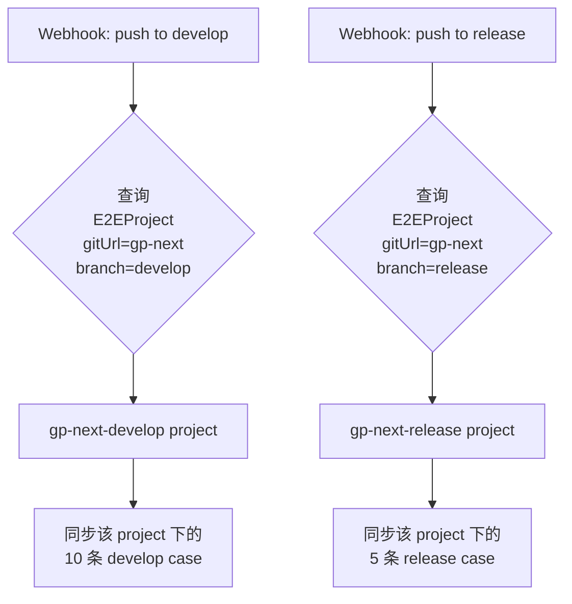
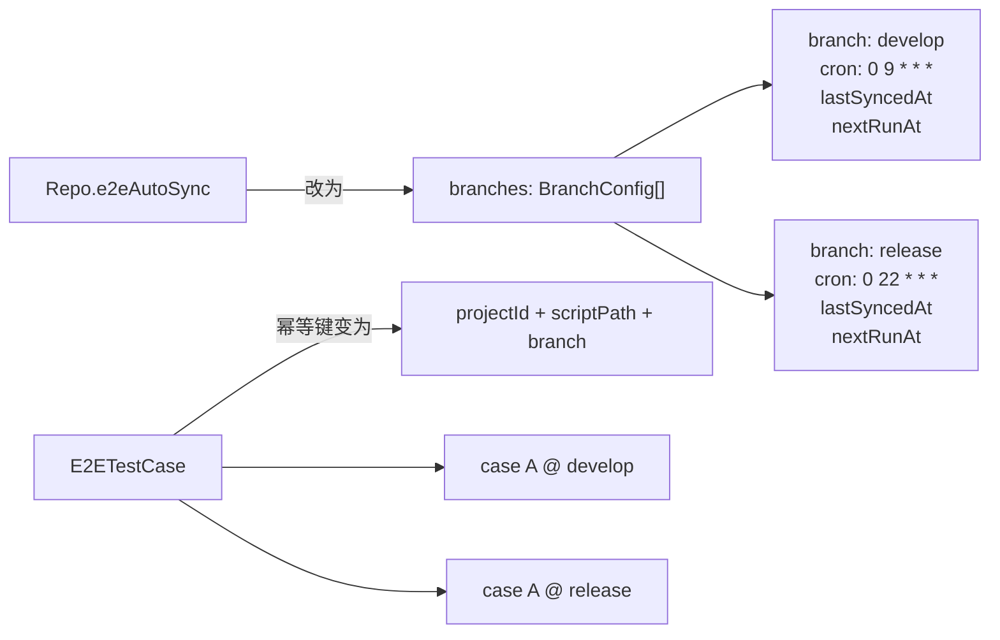
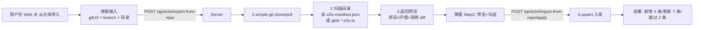
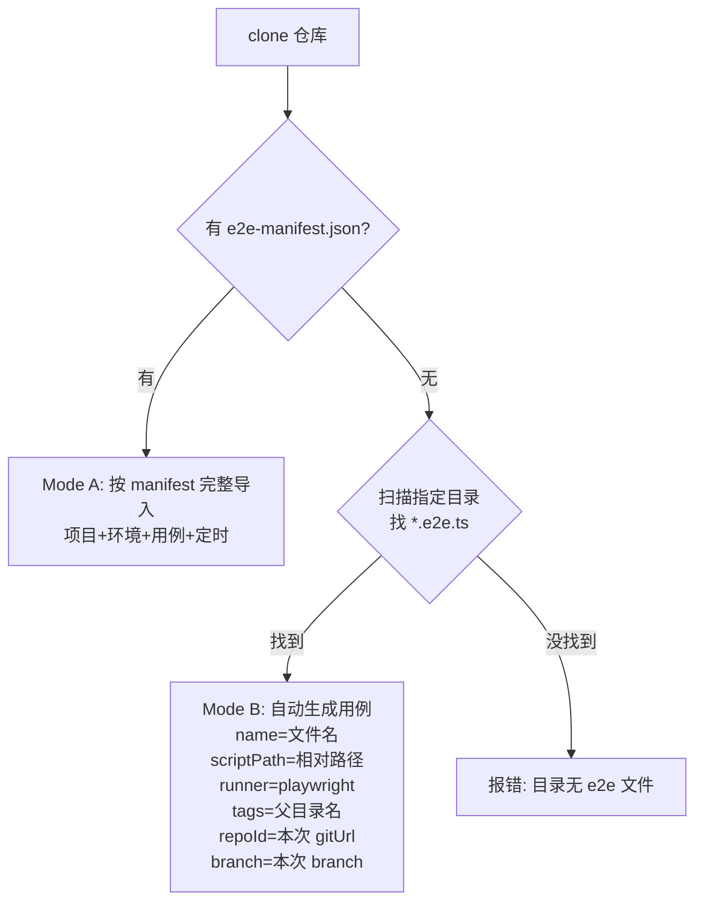
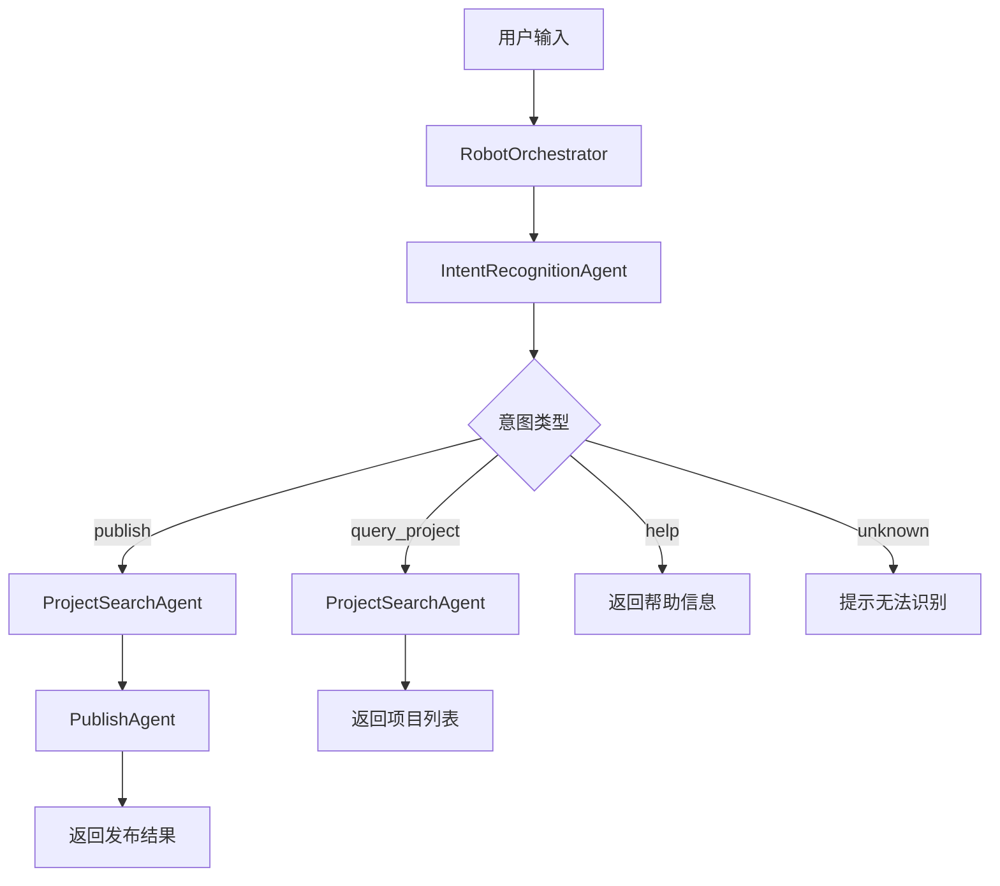

:::info 作者

novlan1

2026.2.1

:::

# AI 模块笔记

## UAT

`2026-06-10`

自动化UAT长期面临三大难点：谁能想全测试场景？谁来写自动化脚本？谁来维护脚本的频繁变更？

为此，我们自2019年起前瞻性地启动了结构化需求沉淀，针对单页支付在多端体验不一致的问题，我们致力于通过结构化方式厘清需求。

在大模型的加持下，UAT的核心突破在于解决了结构化需求转化为测试脚本过程中的语义澄清难题。


## UAT 概念

`2026-06-10`

所谓UAT，即端到端的用户验收测试。这里的“端”既指用户可见的界面，也包括商户侧的API接口，只有通过此类测试，才能证明系统具备对外可用的稳定性，在此过程中，测全率至关重要。传统的单元测试往往仅能做到行覆盖，难以实现条件组合覆盖，测试强度不足，而在AI的加持下，这一状况得到了显著改善。


测试里 UAT 通俗解释

- 全称：User Acceptance Testing
- 中文：用户验收测试

一句话理解

- 最终用户/业务方，来验收系统能不能正常用
- 相当于：甲方亲自上手验货

简单层级对比

1. 开发自测：程序员自己测
2. QA测试：测试人员专业测
3. UAT验收：业务/客户最终确认没问题


## AI 依然是解决次要困难的超级工具

`2026-06-10`

核心原则是将右侧的质量与合规工作尽可能提前到左侧处理，把风险在早期化解，对高频事项优先解决。通过显性化业务知识、利用自动化手段压降人为因素，并推行“不许重复发明轮子”的原则，确保所有组件都经过业务连续性评价，我们实现了设计左移与领域知识显性化。

对于存量业务，如果系统代码注释质量尚可，某些工具能够提炼历史代码逻辑，经人工加工后即可沉淀为结构化需求，当需求实现结构化后，不仅能大幅减轻产品经理在需求阶段的负担，使其仅凭交互稿和 TAPT 即可澄清需求，更能让测试环节发挥关键作用。

未来我们期望实现从产品完成 TAPD 到业务架构翻译成结构化需求的自动化衔接，使开发与测试并行推进。目前核心业务已能在一周内追上增量需求并开展 UAT，显著降低了上线成本。同时，引入基于性质的测试，能有效弥补开发人员易忽视异常场景的短板，帮助发现许多奇怪的Bug。这种测试与需求之间形成的增强回路，将激励组织更有动力去维护需求沉淀。

在研发工具层面，我们已从过去的“命题作文”式开发，转变为通过收敛提炼组件规范与流程，让开发同学主要做填空题或选择题。前端开发同样如此，推行组件化开发以避免手工搓代码，这不仅利于检查与规范落地，也为 AI 和企业带来了便利。这种组织管理上的一致性要求，配合元数据的集中统一管理，使得 AI 的介入变得更为简单。

综合来看，多年的暗知识显性化与元数据统一管理，在 AI 时代汇聚成了一个核心词汇——知识工程。这些积累的知识的让 AI 能够高效利用，形成了从需求工程、模型设计、AI 生成到自动化测试的完美闭环。

基础设施同学将更为关键，因为能力被压缩在组件中，业务只需简单选择。这些传统软件建设的基础能力，在 AI 时代是重要的战略资产，不应被放弃，而应转型。

此外，技术债务是影响组织交付的重大阻碍，绝大多数债务实则是团队“明知故犯”的结果，是为了短期利益牺牲了长期利益。为此，我们通过系统数字化地度量和登记了所有债务，并实施了SOA治理，将SOA架构理论落地实践，使每个团队的水平清晰可见。这些指标直接与管理者绩效挂钩，确保在业务推进的同时，债务清理工作必须完成。

AI 依然是解决次要困难的超级工具，它无法解决需求模糊、领域知识理解错误、架构设计糟糕以及管理不善等根本困难，这些概念不一致的深层次问题依然没有银弹。

## AI E2E

`2026-06-10`

跑→失败→诊断→修→重跑

## 那么多紧急的问题

`2026-06-10`

如果有那么多紧急的问题，说明前面都没做对，做对就没那么多紧急的问题。

测试是重要的技能，业务对稳定性要求越高，测试越重要。

## 产品经理

`2026-06-10`

产品经理的定位是提供创意和想法

## UAT测试

`2026-06-10`

UAT测试至关重要，指标通过才能验收，才能上线。能否上线就看这个。

测试开发是一项技能，从2025.12就没有专门的测试开发了。

当你的可用性和稳定性要求很高的时候，就必须建设UAT测试了，是三个九、四个九还是五个九。

全面监控、灰度、UAT都是保障线上稳定性的手段

## 文档和测试

`2026-06-10`

文档和测试，在AI下变得无比重要。将他们用起来，才会不断迭代，形成正反馈。

## UAT

`2026-06-10`

实用主义者，什么有用就用啥。单元测试可以搞，但更看重UAT

## 让AI同时生成业务代码和UAT是否存在模型同时既当裁判员和运动员？

`2026-06-10`

AI生成的业务代码是根据设计生成的，而非根据需求生成，但UAT是按照需求生成的。所以他们是以需求作为唯一标准来作测试的，并不存在既当裁判员又当运动员的问题。具体而言，因为业务代码是人工对需求的理解后做了设计，然后再根据设计来生成，需要经历多阶段工作。而UAT是理解需求来生成测试，再判断是否与需求目标一致。

## Review AI

`2026-06-10`

AI写的代码不去Review是不对的，它只是辅助开发，而不是代理。

## 这种自主生成spec的方式是可靠的，业界都这么做吗，还是手工生成的多

`2026-05-28`

这是个很好的问题。坦白说：

## 业界现状

**手工编写 spec 仍然是绝对主流。** 自主探索生成 spec 是一个非常前沿的尝试，目前还没有成为行业标准做法。

### 主流做法分层

| 层级 | 做法 | 代表 | 占比估计 |
|------|------|------|----------|
| **L1：纯手写** | PM/QA 手写 test case → 开发写 e2e | 绝大多数团队 | ~70% |
| **L2：录制回放** | 用 Playwright codegen / Cypress recorder 录制操作 → 导出代码 → 手动补断言 | Playwright codegen, Chrome Recorder, Katalon | ~20% |
| **L3：AI 辅助生成用例代码** | 人手写 spec/需求描述 → LLM 生成 e2e 代码 | Copilot、各厂内部工具、我们的 `gen` 子命令 | ~8% |
| **L4：自主探索 + 生成 spec** | Agent 自主浏览页面 → 生成需求规约 → 再生成用例 | 我们的 `plan`、Octomind (部分)、QA Wolf (部分) | <2% |

我们的 `plan` 属于 **L4**，这一层目前全行业都在探索阶段，没有哪个方案被认为是"可靠且成熟的"。

### 最接近的业界产品

| 产品 | 做法 | 与我们的区别 |
|------|------|------|
| **Octomind** | Agent 自主发现测试路径 → 生成 Playwright 用例 → 自动维护 | 它跳过了 spec，直接从探索到代码；不生成人类可读的中间产物 |
| **QA Wolf** | 人工 + AI 混合：人类写高阶场景描述 → AI 生成代码 → 人类 review | 本质是 L3，人类仍负责"需求定义" |
| **Meticulous** | 录制真实用户流量 → 自动生成回归快照测试 | 完全不同路线：基于真实流量而非 Agent 探索 |
| **Testim (Tricentis)** | 视觉 AI 定位元素 + 低代码录制 | 本质是 L2 + 视觉兜底 |

### 为什么 L4 还没成为主流

1. **LLM 幻觉问题**：Agent 自报的 observedTexts / selectors 可能是编的，生成的 spec 可能包含页面上不存在的断言
2. **探索深度有限**：一次 20 步只能覆盖"首屏 + 一层入口"，复杂业务流程（如支付、多步表单）覆盖不到
3. **需求意图推断困难**：Agent 能看到"页面有什么"，但不知道"业务想要什么"——"这个按钮应该做什么" vs "这个按钮实际做什么"是两回事
4. **ROI 不确定**：一份 LLM 生成的 spec 仍然需要人工 review 15-30 分钟，而手写一份可能只要 20-40 分钟——节省的时间有限

### 我们这套方案的定位

**正确的定位是：降低"从零写 spec"的冷启动成本，不是替代人工。**

适用场景：
- ✅ 新项目/新页面冷启动：PM 还没来得及写测试用例，先用 plan 打底
- ✅ 遗留系统补测：老页面没有 spec，用 explorer 快速扫一遍出草稿
- ✅ 回归覆盖率扩充：已有几份手写 spec，用 plan 发现遗漏的入口

不适用场景：
- ❌ 精确的业务逻辑验证（如"余额不足时应弹二次确认"——这种需求意图 Agent 看不出来）
- ❌ 安全/权限相关用例（Agent 不会也不应该尝试越权操作）
- ❌ 替代 PM 写 PRD（spec 本质是 PM 意图的投射，不是页面现状的描述）

### 实话实说

```
可靠度排序：

  手写 spec（PM 意图驱动） >>>>  录制 + 人工补断言  >>  LLM 翻译人写 spec 为代码  >>  Agent 探索生成 spec
       最可靠                                                                        最不可靠但最省人力
```

我们的 plan → gen → heal 闭环的真正价值不在于 plan 产出的 spec 100% 可靠，而在于：

1. **plan** 出草稿（60-70% 准确率）
2. **人工 review** 修正 spec（5-15 分钟，比从零写快）
3. **gen** 把确认后的 spec 转代码（这一步可靠度高，因为输入已经是人类确认过的）
4. **heal** 自动修选择器/timing（这一步可靠度最高，纯试错循环）

**如果要追求更高的 spec 生成可靠性**，业界更常见的做法是：

- **从 TAPD/Jira 需求单 → spec**（已有人类写的需求描述，LLM 只做格式化翻译）
- **从 Figma 设计稿 → spec**（有明确的 UI 规格）
- **从已有 API 文档 → spec**（接口契约清晰）

这些"有明确人类输入"的路径，比"Agent 自己看页面推断需求"要靠谱得多。

---

**总结：我们的 plan 是行业前沿探索，目前不是主流做法，也确实不如人写可靠。但作为"冷启动草稿生成器 + 人工 review"的组合，ROI 是正的——关键是不要跳过 review 环节直接信任 plan 的产出。**

## 这个生成spec的方案可靠吗

`2026-05-28`

好问题。让我仔细审视一下 `plan` 子命令生成 spec 的完整链路，看看是否可靠。先重新读一下核心逻辑：
现在看 plan-runner 后半段——exploration.json → spec.md 的 LLM 调用部分：
全链路审完了。以下是我的诚实评估：

---

## `plan` 生成 spec 方案可靠性分析

### 整体结论：**可用但有明确短板，适合"辅助起草 + 人工 review"，不适合直接当产出交付。**

---

### ✅ 可靠的部分

| 方面 | 设计 | 评价 |
|------|------|------|
| **trace 采集** | `page.on('request')` 抓网络 + `on_step_end` 抓 DOM 文本/可点元素 | 稳：都是 Playwright native API，数据确定性高 |
| **容错** | explorer 失败也写 exploration.json（含已有 trace） | LLM 基于不完整数据仍可出草稿 |
| **LLM prompt 约束** | 显式声明 frontmatter schema + 正文章节顺序 + 禁止编造 | 够严格，实测出来的 spec 格式基本合规 |
| **postProcess 兜底** | 剥 code fence + 保证 `---` 开头 | 对 LLM 常见越界有处理 |
| **id / slug 自动编号** | 扫 outDir 取 max+1 | 不会重复 |

### ⚠️ 明确短板/风险

| 风险点 | 原因 | 影响 | 建议 |
|------|------|------|------|
| **1. explorer 只跑一个 page，看不到多页态** | `initial_actions` 只打开一个 biz_url，Agent 最多做 5 次"点进去 + 返回"的一级探索 | 如果 spec 需要覆盖"从 A 页面跳到 B 页面"的跨页流程（如搜索→结果→详情），单次 explorer 无法给出完整 trace | 对跨页场景，要么让用户多跑几次 plan（每次指不同 biz_url），要么后续加"多种子 URL"支持 |
| **2. Agent 自主探索的不确定性** | browser-use Agent 是 LLM 驱动的；如果页面是 SPA + 延时加载 + WebSocket IM，Agent 经常在加载中就点下一步 | 导致 DOM snapshot 里的 texts/clickables 可能是中间态（loading）而非稳态 | 在 dom hook 里增加 `page.waitForLoadState('networkidle')` 兜底；或增加探索 prompt 里"等稳定再记录"的约束 |
| **3. network trace 过滤不够精细** | `trpc-like` 的正则 `/trpc\|cgi\|cgame\|esport\|api\//i` 会误命中大量无关请求（如 CDN API、Aegis 上报） | 喂给 LLM 的 `related_apis` 可能有噪声 | 加白名单正则：只留 `cgigame` / `esport_api` / `trpc.` 前缀的 |
| **4. `done` payload 依赖 LLM 自报** | Agent 的 `done(text=JSON)` 是 LLM 自己写的，不是从 DOM 程序化抽取的 | Agent 可能**编造**它没见过的 observedTexts / candidateSelectors | 在 prompt 里已有"只能来自真实页面"约束，但 LLM 仍可能幻觉。**建议**：用 domSnapshots 的 texts 交叉校验 donePayload.observedTexts，剔除在 trace 里没出现的文案 |
| **5. 生成 spec 的 LLM 也会幻觉** | `SPEC_GEN_SYSTEM` 说了"不要发明事实"，但 temperature=0.2 不是 0 | `related_apis`、`测试断言（E2E 锚点）` 段可能出现从未在 trace 里出现过的接口名/选择器 | **critical** —— 加一步后处理：`checkAssertionsAgainstTrace()`，把 spec 中引用的 text/api/selector 与 exploration.json 做 fuzzy match，不匹配的标 `⚠️ TODO: 人工确认` |
| **6. 没做 spec→已有 spec 去重** | 每次 plan 只看 outDir 的文件名编号，不检查内容是否与已有 spec 重复 | 多跑几次 plan 可能产出内容高度重复的 spec | 后续可加 embedding 比较或 title dedup |
| **7. related_pages 无法自动推断** | 从 trace 只能拿到 URL，推不出 `.vue` 源码路径 | frontmatter 的 `related_pages` 永远是 TODO 占位 | 可以做：根据 URL 的 path 片段到 gp-next src/ 里 grep 路由配置自动匹配 |

### 🔴 最高风险

**"trace 到 spec"这一步是单次 LLM 调用，没有自检环节。** 如果 LLM 一次生成的 spec：
- frontmatter 缺字段 → `ci-spec-sync-check` 会挡
- 测试断言引用了不存在的选择器 → 后面 gen 出来的 e2e 一定会 timeout
- 主流程写反了需求逻辑 → 人工 review 前无法发现

**改进方案**（推荐实施优先级）：

1. **（低成本高收益）加一轮结构化自检**：生成 spec 后再调一次 LLM（或纯规则），把 spec 里的"文案断言"和"接口名"与 `exploration.json.domSnapshots[*].texts` / `network[*].url` 做精确匹配，不命中的自动标 `⚠️`。
2. **（中等成本）`related_apis` 自动校验**：从 exploration 的 network JSONL 里 exact match spec 里列出的 API 名，不存在的删掉。
3. **（未来优化）多 pass 探索**：先跑一遍 → 根据 done 判断缺哪些路径 → 自动补一轮"定向下钻"探索（类似 human review → 再跑），目前 max_steps=20 只能做一遍宽度探索。

---

### 实操建议

> **当前阶段的正确使用姿势**：把 `plan` 当"spec 起草器"，人工必须 review `related_pages` / `related_apis` / `测试断言（E2E 锚点）` 三段后再推 `gen`。`gen` + `heal` 的闭环才是能自动化验证的——spec 本身仍需人工把关。

如果要让 spec 生成更可靠，我建议的最小改动优先级：
1. 加 `validateSpecAgainstTrace()` 后处理（纯规则，5min 可写）
2. `dom_hook` 加 `waitForLoadState('networkidle', timeout=3000)` 兜底
3. `done payload` 的 observedTexts 与 domSnapshots 交叉校验

要不要我现在动手实现第 1 点（trace↔spec 交叉校验）？这是最高 ROI 的改进。

## AI E2E

`2026-05-28`

### 生成 exploration.json

关键设计点：

1. 复用现有基建：`Knot proxy / venv / IPHONE_PROFILE / merge_auth_into_biz / resolveLoginPreset` 全部复用，零新依赖。
2. gp-next 兼容：spec 模板里 `frontmatter` 的字段顺序、`id `正则（`^[A-Z]{2,8}-\d{3}$``）、related_pages` 正则（`^src/.+\.vue$`）都通过 system+user prompt 约束 LLM 严格遵守，并把人工 review 项写到备注里，避免 LLM 编造。
3. trace 收口：`page.on('request')` 抓所有 XHR/fetch/document，过滤静态资源；DOM 快照用 page.evaluate 抓可见文本前 60 条 + 可点击元素（含 `data-testid`）；Agent done 时强制输出 JSON。三种证据汇总到一份 exploration.json。
4. safety：`--dry-run `只打印不落盘；`--next-id` 自动扫描 outDir 防止覆盖；`spec id` 自动 `padStart(3,'0')` 满足 schema。

### 生成 测试用例

关键设计
1. 零新依赖：手写一个轻量 `frontmatter` 解析（只支持 spec 模板用到的字段格式 + 字符串数组），避免引入 `js-yaml`。
2. CRLF 兼容 + 前置空行兼容：parseSpec 先 normalize 换行符，再用允许 (^|\n) 起始的正则匹配 `frontmatter`。
3. `section` 抽取的坑（已修）：必须不要用 `multiline m flag + $`，否则非贪婪匹配会在第一个行尾立刻停止；改用 `(?=\n##\\s+|(?![\\s\\S]))` 锁定下一节或字符串真结尾。
4. `fixture` 契约自适应：`summarizeFixtures` 优先读 gp-next 真实 _fixtures/test.ts 的 header 注释 + export 列表喂给 LLM，找不到时退到内置默认描述（不阻塞流程）。
5. 输出契约硬约束：`system prompt` 强制 LLM 只 `import ../_fixtures/test`、必须 `test.describe('<spec.id> <spec.title>', ...)`、主流程不 mock、接口正则不绑死域名；finalizeE2e 还做了 import + describe 的存在性自检——不达标直接拒收并把 raw 落到 `~/.e2e-skill/gens/<runId>/raw.txt` 便于排查。
6. trace 自动发现：gen 不传 --exploration 时，先看 spec 同目录的 `*.exploration.json，再回落到最近一次 ~/.e2e-skill/plans/*/reports/exploration.json`（按 mtime），找不到也允许跑（仅基于 spec）。
7. 路径推断：spec 路径若落在 `<root>/specs/<domain>/...`，自动推断 repoRoot 与镜像出 `<root>/e2e/<domain>/...`，不必手动传 --out / --repo-root。

### heal

关键设计
1. 复用 gp-next 既有 CI 契约：直接走 `playwright.ci.config.ts`（已含 `json/html/junit reporter`，固定输出 `e2e-report/result.json`），不污染 gp-next 也不需要在命令行追加 reporter 参数。
2. 可拔插的失败上下文：每个失败 spec 的输入材料 = 测试 `fullTitle` + `status` + 去 ANSI 的 `error.message/stack` + Playwright 自带的 `error-context.md`（含 Test source 行号箭头）；不解析 `trace.zip`（信息已足够 + 二进制处理太重）。
3. `retry attachment` 兜底：result.json 里 results[length-1]（retry1）的 attachment 可能因为原 outputDir 被清而失效；改为遍历所有 results，取第一个能 existsSync 的 error-context.md。
4. 轮内全产物落盘：每轮的 `playwright.stdout.log / stderr.log / result.json 副本 / before.e2e.ts / after.e2e.ts / prompt.user.md / failures.json / llm.raw.txt` 全部存到 `~/.e2e-skill/heals/<runId>/round-N/`，便于排查 + 回滚。
5. proxy 懒启动：第一轮就过的情况下不启 proxy（不调 LLM 也不需要 Knot 配置），节省 ~3-5s 启动开销。
6. LLM 输出契约硬约束：与 gen 共用 `finalizeE2e——`必须含 `import { test, expect } from '../_fixtures/test'` 和 `test.describe(`，否则拒收。
7. 守护循环：最大 3 轮（可调）；达到上限直接 failed；如果 LLM 返回内容与原文一致，警告但仍进入下一轮（避免假死）。
8. dry-run 友好：`--dry-run` 仅打印推断结果（`repoRoot / specFile / cmd / reportDir`），不真跑 playwright，方便用户先确认路径再开跑。

## 结合/Users/g/Documents/git-woa/gp-next业务项目，和这个仓库，看看你的建议，我觉得是自主探寻路径、生成spec、结合代码、生成确定性的测试用例（pagewright），自己跑、出现错误自己定位、自己改测试用例（有必要可以spec）

`2026-05-27`

我先看看两个项目的现状，再给你一个落地建议。
已经把 ai-e2e-platform（已有 browser-use + Knot proxy + Midscene + Playwright 的能力栈）和 gp-next（已有规范化的 `specs/<domain>/NN.xxx.spec.md ↔ e2e/<domain>/NN.xxx.e2e.ts` 双向同步）都摸清楚了。下面是结合两个仓库的现状给你的具体建议（不动代码，只给方案）。

---

## 一、先校准目标

你说的最终形态是一个**自治回路**：

```
种子 URL/路由 → 自主探索 → 写 spec.md → 生成 e2e.ts → 跑 → 失败自定位 → 改 e2e（必要时改 spec）
```

这里有 4 个独立能力，**没有任何单一开源项目能一把全包**。所以正确做法不是"换一个工具"，而是**把你 ai-e2e-platform 已经造好的轮子（Knot proxy + browser-use + Playwright + Midscene + skill CLI），按这 4 个能力分别拼装**。

---

## 二、4 个能力 × 各自最成熟的方案

| 能力 | 最适合的工具 | 你已有的基建 | 缺口 |
|---|---|---|---|
| ① 自主探索路径 | **browser-use**（你已在用）/ Playwright Test Agents Planner | `browser-use-lab/`、Knot proxy 已经把 OpenAI 协议接到 Knot | 没有"探索→spec"的产物约定 |
| ② 写 spec.md | **任何 LLM**（你的 Knot 模型即可）+ gp-next 的模板 | `specs/_schema/spec.template.md` + frontmatter schema | 没有"探索 trace → spec"的转换器 |
| ③ 生成 e2e.ts | **Playwright codegen** + LLM；或 Playwright v1.56+ Test Generator Agent | gp-next `e2e/_fixtures/test.ts`（authedGoto/storageState 都齐了） | 缺一个把 spec frontmatter+断言 → Playwright 代码的生成器 |
| ④ 跑+自愈 | **Playwright Test Healer**（v1.56+，最对口）；备选 Midscene 视觉断言兜底 | `playwright.config.ts`、`tip-toc-*` 选择器规约 | 失败定位需要 trace + DOM diff 喂给 LLM |

**结论**：不要把"探索"和"生成代码"绑到同一个 Agent 上。让 browser-use 只负责**探索 + 抓证据**，让 LLM 离线把证据转成 spec/e2e，让 Playwright 自己跑+自愈。

---

## 三、为什么不直接上 Playwright Test Agents（v1.56+）

它确实是官方方案，但对你来说有 3 个硬伤：

1. **它的 LLM 默认走 OpenAI/Anthropic 直连**，你公司只有 Knot；要接，又得给它再做一份 proxy（你 ai-e2e-platform 的 Knot proxy 是给 browser-use 走的 OpenAI 协议，不一定能直接喂给 VS Code agent loop）。
2. **它生成的 spec 是它自己的 markdown 格式**，跟 gp-next 已经定型的 frontmatter schema（`id/domain/related_pages/last_synced_commit` + `ci-spec-sync-check.ts`）不兼容，套上去会推翻 CI 的双向同步检查。
3. **Healer 的修复策略对 uniapp h5 的 class 选择器**（你们大量用 `.tip-toc-*` / `.press-tab--active`）效果一般，它更擅长 role/text 选择器。

可以**借鉴它的三 Agent 拆分思路**（Planner/Generator/Healer），但实现走自己 stack。

---

## 四、推荐的落地形态：在 ai-e2e-platform 里加 3 个 skill 子命令

复用现有 `packages/e2e-skill-cli/` + Knot proxy，**不引入新依赖**。

```
e2e-skill plan    --biz-url <seed> --domain home --out ../gp-next/specs/home/
e2e-skill gen     --spec ../gp-next/specs/home/04.xxx.spec.md --out ../gp-next/e2e/home/
e2e-skill heal    --e2e ../gp-next/e2e/home/04.xxx.e2e.ts
```

### 4.1 `plan`（探索 → spec）

- 直接复用你的 `browser-use-lab/runner.py` + Knot proxy
- 给 browser-use 一个**约束 prompt**：「探索 `<seed URL>` 下的主流路径，每发现一个独立 user value 就记录一条 trace（点击序列 + 截图 + 关键 DOM + 网络请求列表）」
- 探索结束产出 `runs/<runId>/exploration.json`
- 再用一个 LLM call（走同一个 Knot proxy 的 `/v1/chat/completions`）把 trace 套到 `specs/_schema/spec.template.md`，**自动填 frontmatter**（`related_pages` 从 trace 里访问过的 URL 反查、`related_apis` 从网络请求里抓 trpc method 名）

> 关键产出：一份**符合 gp-next CI 校验**的 spec.md。这是它跟 Playwright 官方 Planner 最大的不同。

### 4.2 `gen`（spec → e2e）

- 解析 spec 的 `## 测试断言（E2E 锚点）` 段（gp-next 已经形成稳定章节结构）
- 用 `playwright codegen` 拿到一份**确定性的选择器骨架**，再用 LLM 把"自然语言断言"映射为 `expect(...)` 调用
- 模板严格套 gp-next 的 `e2e/_fixtures/test.ts`（`authedGoto` + storageState）
- 编号取 `specs/<domain>/` 当前最大 + 1，避免破坏 CI 同步

### 4.3 `heal`（跑 → 失败自愈）

- `playwright test --reporter=json` + `--trace=on`
- 失败用例把 **trace.zip + 失败前的 DOM snapshot + spec.md** 一起喂给 LLM
- LLM 输出 patch（diff 形式）；先在 sandbox 跑一次绿了再写回
- **保护栏**：自愈最多重试 N 次；连续 2 次自愈仍失败 → 提示"可能是真的回归 / 需要改 spec"，而不是死循环改用例

> 这一步可以选择性用 **Midscene 兜底**：当选择器自愈失败，就让 Midscene 用视觉 + 自然语言断言代替（你们已经装了 `@midscene/web`），不会因为 uniapp class 名变化就崩。

---

## 五、为什么不推荐"全交给 Midscene"或"全交给 browser-use"

- **Midscene 强项**：视觉断言，写新用例很快；**弱项**：每次都要 VLM，成本高，CI 不稳定，不擅长生成 spec。所以只做"自愈兜底"。
- **browser-use 强项**：自主导航 + 点点看；**弱项**：它输出的是"操作历史"而不是"测试代码"，强行让它写 Playwright spec，结果就是 selector 全是 `getByText` + 偶尔崩。所以只做"探索 + 抓证据"。
- **Playwright 自带 codegen**：选择器生成最准（直接 inspect DOM），所以让它做"代码骨架"，AI 只补断言。

三者**各做最擅长的一段**，就是你想要的"确定性"。

---

## 六、一个最小可行起步（不用一上来全做）

我建议先做最有价值的 **`plan` + `gen` 串起来**，用 gp-next 的 `home` domain 做试点：

1. 在 `ai-e2e-platform/packages/e2e-skill-cli` 加一个子命令 `plan`，跑 browser-use 探索 `https://h5.igame.qq.com/.../views/index/index`
2. 产出 `specs/home/04.xxx.spec.md`（人工 review 一遍 frontmatter）
3. 再跑 `gen`，产出 `e2e/home/04.xxx.e2e.ts`
4. `pnpm e2e -- e2e/home/04.xxx.e2e.ts` 看通过率

这一步跑通后，再加 `heal`。

---

## 七、要不要我现在就动手

这只是方案，**没改任何代码**。如果你认可这个思路，告诉我从哪一步开始，我就直接在 `packages/e2e-skill-cli/src/` 里加 `plan.ts`、串通 browser-use → spec 模板 → 文件落盘。

📝 Session 005-10-09 — Turn 1 recorded.

## 想问下如何自动搜索路径，生成spec和测试用例，用browser-use还是什么其他工具能生成吗，可以给你个链接，你自己探索，有什么社区成熟的方案吗

`2026-05-27`

好的，基于你们项目的现状（已有 specs/*.md + e2e/*.ts 的流水线），来综合回答这个问题：

---

## 自动搜索路径、生成 Spec 和测试用例的成熟方案

### 方案一：Playwright 官方 Test Agents（最推荐，v1.56+）

这是 **Playwright 官方在 2025 年末推出的内置方案**，三个 Agent 正好对应你项目的现有工作流：

```
Planner → Spec(.md)   →   Generator → .spec.ts   →   Healer → 修复失败用例
```

| Agent | 对应你项目 | 做什么 |
|---|---|---|
| **Planner** | 生成 `specs/*.md` | 打开 URL，自动探索页面交互，输出 Markdown 测试计划 |
| **Generator** | 生成 `e2e/*.ts` | 读取 `.md` 转成可执行 Playwright 测试代码（实时验证选择器）|
| **Healer** | 修复 `e2e/*.ts` | 跑失败用例 → 自动分析 UI → 打补丁 |

**初始化方式：**
```bash
npx playwright init-agents --loop=vscode  # 或 --loop=claude
```

给一个 URL，Planner 会自己点击页面各路径、发现功能，生成 spec。**这就是「自动搜索路径」的核心能力**。

> ⚠️ 需要 Playwright v1.56+ 且 VS Code v1.105+

---

### 方案二：Playwright MCP + AI（当前最灵活）

```
AI (Claude/GPT/Cursor) + Playwright MCP Server → 控制真实浏览器 → 生成测试代码
```

给 AI 一个链接，让它：
1. 自己导航探索所有路由
2. 记录交互路径
3. 输出 Playwright spec

你已经在用 CodeBuddy，配合 Playwright MCP Server 就能实现，参考：[BrowserStack 指南](https://www.browserstack.com/guide/playwright-ai-test-generator)

---

### 方案三：Midscene.js（字节出品，视觉驱动）

```bash
pnpm add @midscene/web
```

**特点：用截图 + 自然语言断言代替选择器**：
```typescript
// 不写 locator，直接用 AI 理解 UI
await ai('点击「主理人赛」Tab');
await aiAssert('推荐关注横滑列表可见');
```

**适合你们项目的场景**：解决你们当前 `page.route` 拦截不稳定的问题，因为它是视觉层断言，不依赖 DOM 选择器或网络 mock。

---

### 方案四：browser-use（Python 生态）

browser-use 是 Python 的 AI 浏览器代理，**更偏向「操作任务」而非「生成测试」**，目前 JS 生态没有成熟的对应品。如果你的目标是生成 Playwright 测试代码，**不推荐走这条路**。

---

## 针对你项目的建议路线

你们的项目已经有 `specs/` + `e2e/` 的分层，**最自然的接入是 Playwright Test Agents**：

1. 升级 `playwright` 到 v1.56+
2. 运行 `npx playwright init-agents --loop=claude`（配合 CodeBuddy）
3. 给 Planner 一个种子 URL + 你的 `_fixtures/test.ts`（登录 fixture）
4. Planner 自动探索路由 → 生成 `specs/xxx.md` → Generator 生成 `e2e/xxx.ts`

如果想让我直接帮你跑一个页面的探索生成，你可以把那个页面链接发过来，我可以用 Playwright MCP 做演示。

## B方案是不是更好，我想的是，每个仓库的多个分支可以是完全不同的测试用例，caseA没必要自行复用其他用例，由代码侧通过mr维护。

`2026-05-27`

想清楚你的逻辑了——你这个角度其实是 **「分支即工程」**：develop 上有什么用例完全由 develop 的代码决定，release 上有什么用例完全由 release 的代码决定，平台不强行做映射。这个想法非常对，比方案 A 更纯粹。

但是 **方案 B（gitUrl 拼 #branch）我不推荐**——它脏。我提一个 **方案 D：项目=仓库×分支**，比 B 干净比 A 简单。

## 一、先把你的语义说清楚

```mermaid
flowchart LR
    subgraph 你的真实需求
      R[gp-next 仓库] -.- D[develop 分支]
      R -.- RL[release 分支]
      D --> CD["develop 用例集<br/>10 条 case<br/>由 develop MR 维护"]
      RL --> CR["release 用例集<br/>5 条 case 子集<br/>由 release MR 维护"]
    end

    CD -.|完全独立| CR
```

关键洞察：**「同一条 scriptPath 在两个分支可能是完全不同的实现」**——比如 `e2e/home/01.xxx.e2e.ts`，develop 上断言新功能 X，release 上还在断言旧功能 Y。**它们不应该在平台上是「同一条 case」**，而应该是两条独立 case。

## 二、对比三个方案

| 维度 | A: branches[] 数组 | B: gitUrl#branch | **D: Project=Repo×Branch** |
|---|---|---|---|
| Schema 改动 | 大（Repo + Case 复合索引 + migration） | 0 | 0（已有 schema 就够） |
| 同一仓库多分支 | branches[] 平铺 | 虚拟 gitUrl 区分 | 多个 E2EProject 实例 |
| 用例隔离性 | 弱（要靠复合索引） | 强（虚拟 gitUrl 隔离） | **强**（projectId 天然隔离） |
| URL 干净度 | ✅ | ❌ 脏 | ✅ |
| Webhook 实现 | 找 branches[] 匹配项 | 拼字符串匹配 | 找匹配 (gitUrl, branch) 的所有 project |
| 用户认知 | 一个项目多 cron | 一个项目多 cron | **一个项目=一个分支**（清晰） |
| 用例完全独立 | 需要复合索引 | 用 gitUrl 区分 | **天然独立** |
| 跨分支复用 | 内置（自动） | 不支持 | 不支持（你不要） |
| 触发用例时选 branch | 要选 | 要选 | 不用选（项目自带） |
| 前端 UX | 项目页带分支 tab | 项目带分支后缀 | **项目列表加 branch 列** |
| 实现复杂度 | 6/10 | 3/10 | **2/10** |

## 三、方案 D 的具体形态

每次「从仓库导入」时，**项目实例是 (gitUrl, branch) 的笛卡尔积**：

```
E2EProject 列表：
  ┌─────────────────────────────────────────────────────────┐
  │ name              displayName            gitUrl  branch │
  ├─────────────────────────────────────────────────────────┤
  │ gp-next-develop   gp-next（develop）     gp-next develop│
  │ gp-next-release   gp-next（release）     gp-next release│
  │ df-admin-develop  df-admin（develop）    df-admin develop│
  └─────────────────────────────────────────────────────────┘
```

每个 project：
- 自带固定 `gitUrl + branch`（写到 `E2EProject` 的两个新字段）
- 自己的 cases / envs / schedules / autoSync
- 自己的 webhook 触发条件（push 到 release → 找 branch=release 的 project）



## 四、Schema 改动（就两行）

```ts
// E2EProject schema 加两个字段
gitUrl: { type: String, default: '' },        // 该项目对应的仓库
branch: { type: String, default: '' },        // 该项目对应的分支

// 复合唯一索引：同一仓库同一分支只能有一个 project
E2EProjectSchema.index({ gitUrl: 1, branch: 1 }, {
  unique: true,
  partialFilterExpression: { gitUrl: { $ne: '' } },  // 老的没填的不卡
});
```

`E2ETestCase`、`Repo.e2eAutoSync`、`Schedule` 全部不动——因为它们都已经挂在 `projectId` 下，天然隔离了。

`Repo.e2eAutoSync` 也不需要 `branches[]`，因为现在不再是「Repo 同步」而是「Project 同步」——直接把 `e2eAutoSync` 字段 **从 Repo 移到 E2EProject** 即可（每个 project 独立 cron / lastSyncedAt）。

## 五、对照你提的两个具体诉求

| 你的诉求 | 方案 D 怎么满足 |
|---|---|
| 一个仓库支持多分支 | 每个 (gitUrl, branch) 是独立 E2EProject，无限多分支 |
| Webhook 按 branch 判断 | `E2EProject.find({ gitUrl, branch })`，找到才同步 |
| 前端用例列表顶部 branch 筛选 | **不需要**——项目本身就是按分支筛过的 |
| caseA 不需要跨分支复用 | 天然不复用，不同 project 之间互不可见 |
| 代码侧通过 MR 维护 | 每个分支的 manifest.json 各自维护，互不影响 |

## 六、还有几个补充建议（你问"看看还有没有补充的"）

1. **导入弹窗加"项目命名规则"提示**：默认 name 改成 `<repoSlug>-<branch>`（比如 `gp-next-develop`）
2. **同一仓库多分支引导**：在「从仓库导入」弹窗里，如果检测到该 gitUrl 已有别的分支项目，弹个 banner 提示「检测到该仓库已有 1 个分支项目（develop），当前导入会创建独立的 release 项目，互不影响」
3. **项目列表分组**：可选地按 gitUrl 把同一仓库的多分支 project 在 UI 上分组显示
4. **Repo 详情页**（前面提过的）：列出该 repo 下所有 (branch, project, lastSync, cron)，作为"仓库视角"入口
5. **Run 列表加 project / branch 列**：现在 Run 列表只看到 caseId，多分支后从 Run 反查应该明确知道"这是 release 分支跑的"
6. **触发运行时去掉 branch 参数**：因为 project 自带 branch，trigger 不再需要让用户选
7. **manifest 的 project.name 自动追加 branch**：如果 manifest 写的是 `name: "gp-next"`，但你导入到 release 分支，自动改成 `gp-next-release`，避免和 develop 撞名
8. **E2ETestCase.branch 字段**：可保留作"该用例运行时实际跑的 branch"（一般等于 project.branch，但留个手动覆盖入口给极端场景）
9. **跨分支差异 diff 视图**（未来）：在 Repo 详情页可以看到「develop 有哪些 case，release 有哪些 case，差集是什么」——纯展示，不操作
10. **Webhook 双向：删除分支事件**：当工蜂推送 `delete branch` 事件时，自动把对应 project 标记为 archived（不删数据，避免误删）

## 七、迁移代价

- 现有「gp-next」单 project → 升级为 `gp-next-develop`，自动填 `gitUrl + branch=develop`
- 一行 mongo update：`db.e2eprojects.updateMany({ gitUrl: { $exists: false } }, { $set: { gitUrl: '...', branch: 'develop' } })`
- E2ETestCase 数据完全不动

## 八、我的最终推荐

**方案 D**。理由：
- 实现复杂度最低（**2/10** vs A 的 **6/10**）
- 完美对齐你"代码侧通过 MR 维护"的心智
- 用户认知最清晰：「项目 = 仓库 × 分支」
- 0 复合索引、0 数据迁移痛点、0 schema 大改

**问你三件事再动手：**

1. **方案 D 同意吗**？还是你坚持要 A 那种"一个 project 内带多分支"？
2. **现有 gp-next project 如何处理**：自动改名为 `gp-next-develop`（推荐）还是保留 `gp-next` 不带分支后缀？
3. **「项目列表按仓库分组显示」要不要做**？（不做也行，列表加个 gitUrl + branch 列就够用）

回我这三个，我就开始写代码。


📝 Session 20260526-090813 — Turn 16 recorded.

## 我想一个仓库可以支持多个分支，现在没做到，webhook那里判断和branch，前端测试用例列表顶部也没有筛选，看看还有其他有没有补充的

`2026-05-27`

你说的对——现在 `e2eAutoSync.branch` 是单分支，多分支同时跑不了。我先把"多分支支持"的完整影响面梳清楚，再问你拍板。

## 一、现状盘点（哪些地方"绑死了单分支"）

```mermaid
flowchart TD
  A[Repo.e2eAutoSync.branch<br/>只有一个 string] --> B1[apply 时所有 case.branch 都用同一个]
  A --> B2[Webhook: 只有 branch === cfg.branch 才同步]
  A --> B3[Scheduler: 只能按一个 cron 跑一个分支]
  A --> B4[E2ETestCase.branch<br/>每条用例一个分支]
  A --> B5[前端用例列表<br/>没有 branch 筛选]
  A --> B6[apply 幂等键 (projectId, scriptPath)<br/>不含 branch -> 不同分支同 path 会互相覆盖]
```

最严重的是 **B6**：现在 case 的唯一性只看 `(projectId, scriptPath)`。如果同一个仓库同时跑 `develop / release` 两个分支，apply 会把同一条 `e2e/home/01.xxx.e2e.ts` 来回覆盖 branch 字段，根本存不下两份。

## 二、设计方案（请你选一个）

### 方案 A：**多分支并行**（功能完整但改动大）

把 `branch` 升级为 `branches[]`，每个分支独立持有一份用例 / cron / sync 状态。



**核心改动**：
1. `Repo.e2eAutoSync` 从 `{ branch, cron, lastSyncedAt }` → `{ branches: [{ branch, cron, manifestPath, scanDir, lastSyncedAt, nextRunAt, lastSyncOk, lastSyncedSha, lastSyncError }] }`
2. `E2ETestCase` 加复合唯一索引 `(projectId, scriptPath, branch)`，已有 case 数据通过 mongo migration 升级
3. `apply` 改成"按 (gitUrl, branch) upsert"，同分支才覆盖，不同分支独立存
4. Scheduler 从"扫 repo"改为"扫每个 branches 项"
5. Webhook 接到 push → 找到该分支的 cfg 才触发，找不到就忽略
6. 前端 `e2e-project-detail` 用例列表加 branch 筛选 + 列展示
7. 触发用例运行时（trigger）让用户选 branch（默认拿用例自身的 branch）

**好处**：完整支持「develop 每天跑、release 推送即跑」的真实场景。
**代价**：8 处改动，要写一次 mongo migration（给老数据 case 把 `branch` 字段补成索引一致）。

### 方案 B：**多 Repo 记录映射多分支**（最小改动）

每个分支登记成独立的 `Repo` 记录（虚拟），靠 gitUrl + branch 后缀区分：

```
gitUrl=https://git.woa.com/x/gp-next.git
gitUrl=https://git.woa.com/x/gp-next.git#release  (虚拟)
```

**好处**：0 schema 改动，前端只是过滤 list 时把 `#release` 当 tag 显示。
**代价**：脏，gitUrl 不再是真正的 URL；前端搜索框、复制粘贴、webhook 匹配全要做特例处理。**不推荐**。

### 方案 C：**多 Project 镜像多分支**（折中）

`gp-next-develop` 和 `gp-next-release` 分别建两个 E2EProject，各自指向同一个 Repo + 不同 branch。

**好处**：schema 完全不动，webhook 找 project 而不是 branch 就行。
**代价**：用户体验割裂——明明是一个项目，得在两个项目页面之间反复切。**不推荐**。

## 三、我推荐方案 A，并补这些「你没提但应该一起做」的点

| # | 项目 | 说明 | 优先级 |
|---|---|---|---|
| 1 | **多分支支持**（你提的） | branches[] + 复合唯一键 | P0 |
| 2 | **前端用例列表 branch 筛选**（你提的） | 顶部加 branch 下拉 + 列展示 | P0 |
| 3 | **Webhook 多分支匹配** | 接到 push 找 branches[] 里匹配的项 | P0 |
| 4 | **触发运行时选 branch** | 现在 trigger 强用 case.branch，用户没机会临时切 | P1 |
| 5 | **mongo migration 脚本** | 给老 case 补 `branch` 默认值 + 建复合索引 | P0（一起做） |
| 6 | **Repo 详情页**（新页面） | 列出所有 branches、上次同步时间、错误、立即同步按钮 | P1 |
| 7 | **同步历史日志表** | 新建 `E2ERepoSyncLog`，记每次自动同步的统计 / 错误 / 耗时 | P2 |
| 8 | **手动触发同步去重** | 防止用户连点三次「立即同步」，期间 webhook 又来一次 | P1（用 mongo distributed lock 或者内存 lock） |
| 9 | **Manifest 支持多分支差异化** | manifest 里允许声明`branchOverrides: { release: { schedules: [...] } }` | P2（按需） |
| 10 | **Run 列表加 branch 筛选** | 现在 `/e2e/runs` 也是平铺，多分支后会乱 | P1 |
| 11 | **「分支克隆」按钮** | 用户在 develop 分支调好后，一键把所有 case 克隆到 release | P2（很实用）|
| 12 | **autoSyncCron 校验提示** | 前端 cron 输入框 + 实时显示「下次触发时间」 | P1 |

## 四、风险点 & 决策

1. **历史数据兼容**：现有 case 都没填 `branch` 索引（默认 develop），加复合唯一索引前必须先 migration。我可以写脚本，但需要你确认现网 mongo 是不是能停服 30 秒（数据量很小应该秒级）
2. **Webhook 退化**：如果某分支既不在 `branches[]` 也不是已知项目分支，是直接忽略还是落 dump？我倾向**落 dump 但不触发**
3. **Scheduler 心跳压力**：每分钟扫 N 个 repo × M 个分支，按现有量级（< 50）完全无压力，不用提前优化
4. **前端 branch 筛选 UI**：是放顶部全局过滤、还是放表格列头筛选？我倾向**顶部 + 表格列同时支持**（顶部主、列头次）

## 五、我建议的执行顺序

如果你同意方案 A，我打算分两轮做完：

**第 1 轮（本轮）— 后端骨架（P0）**
- Repo.e2eAutoSync.branches[] schema 改造 + migration 脚本
- E2ETestCase 复合唯一索引 + migration
- E2EImportService.apply 按 branch 隔离
- E2ERepoSyncScheduler 扫 branches 而非 repo
- Webhook 多分支匹配
- 测试

**第 2 轮（下轮）— 前端 + 增强（P0/P1）**
- 用例列表顶部 branch 筛选 + 列
- Run 列表 branch 筛选
- 触发运行时选 branch
- ImportFromRepoDialog 弹窗支持配多分支 cron（当前是一个 input，要改成可增减的 list）
- 同步历史日志表 + 列表页
- 手动触发去重锁
- 前端 cron 表达式预览

## 六、问你三件事再动手

1. **方案 A / B / C 选哪个**？我推荐 A
2. **现网 mongo 数据量大概多少 case**？要不要写带 dry-run 的 migration 脚本？
3. **「分支克隆」按钮要不要做**（11 号）？很多团队做完 develop 调试后会一键克隆到 release

回我这三个，我下一轮就把第 1 轮全部代码写完。

## 这种登记的方式是不是不太好，能否设置一个主动拉取的按钮+弹窗，输入仓库地址、分支、目录，按照一定规则，自动拉取并录入

`2026-05-27`

这个想法非常好——**主动拉取 > 手工登记**，本质上是把 `e2e-manifest.json` 从"客户端配置"升级成"服务端约定"。给你完整方案，先讲清楚再问你要不要写。

## 一、设计



**两步式交互**（关键）：第一步只**预览** diff 不写库，第二步勾选后才 apply。避免把脏数据直接灌进去。

## 二、扫描规则（按优先级）



**Mode A（推荐）**：仓库已经有 `e2e-manifest.json`（gp-next 已经有了），全量导入项目+环境+用例+定时任务。

**Mode B（兜底）**：没有 manifest 时，扫 `e2e/**/*.e2e.ts` 自动生成最小用例。一行代码不写也能接入。

## 三、幂等策略（再次拉取不重复）

| 实体 | 幂等键 | 已存在时行为 |
|---|---|---|
| `Repo` | `gitUrl` | 复用 |
| `E2EProject` | `name` | 复用，更新 displayName/description |
| `E2EBizUrlAlias` | `name` | 复用，更新 url |
| `E2ELoginPreset` | `name` | **不动 authUrl**（authUrl 是手动维护的签名）|
| `E2EProjectEnv` | `(projectId, envKey)` | 更新绑定关系 |
| `E2ETestCase` | `(projectId, scriptPath)` | 更新 name/tags/branch，不覆盖 owner |
| `E2ETestSchedule` | `(projectId, name)` | 更新 cron/enabled |

每次再点"导入"，**只增量更新差异部分**，不会出现重复 case。

## 四、UI 草图

```
┌────────────────────────────────────────────┐
│ 从仓库导入用例                            ×│
├────────────────────────────────────────────┤
│ Git 仓库 *  [https://git.woa.com/...    ▼]│ ← select 自动从已登记 Repo 拉
│             [+ 新增仓库]                   │
│ 分支       [develop                      ] │
│ 扫描目录   [e2e                          ] │ ← 默认 e2e
│ Manifest   [e2e-manifest.json            ] │ ← 默认值，没有就走 Mode B
│                                            │
│            [取消]  [扫描预览]              │
└────────────────────────────────────────────┘

点扫描预览后 →

┌────────────────────────────────────────────┐
│ 导入预览（gp-next @ develop）            ×│
├────────────────────────────────────────────┤
│ ✅ Repo: gp-next      [已存在 复用]       │
│ ✅ 项目: gp-next      [新增]              │
│                                            │
│ 环境（2）        全选 ☑                    │
│  ☑ test  → gp-next-h5-test    [新增]      │
│  ☑ prod  → gp-next-h5-prod    [新增]      │
│                                            │
│ 用例（10）       全选 ☑    runner: playwright│
│  ☑ HOME-001 ... [新增]                     │
│  ☑ HOME-002 ... [新增]                     │
│  ☑ MSG-003 ...  [更新 scriptPath]         │
│  ☐ SEARCH-001 ... [无变化 跳过]           │
│                                            │
│ 定时任务（1）                              │
│  ☑ 每日冒烟 0 9 * * * [新增]              │
│                                            │
│            [上一步]  [确认导入]            │
└────────────────────────────────────────────┘
```

## 五、安全 / 边界

1. **clone 用 `--depth 1` 浅拉**，10 条用例的仓库基本秒级返回
2. **clone 路径放 `config.gitWorkDir` 下隔离子目录**（`log/projects/e2e-import/<repoSlug>`），完事不删（下次直接 `git fetch + reset`，更快）
3. **manifest 校验**：用 zod 严格校验 schema，schema 不匹配直接拒绝并指出错位置
4. **删除策略**：本次导入**不做**删除——manifest 删了某条 case 不会从平台删。删除走 Web 单条删，避免误清
5. **删除权限**：复用现有 `requireDeletePermission` 中间件思路，导入接口加个白名单
6. **登录态特殊处理**：manifest 里只放 `loginPreset.name`，**不放 authUrl**（敏感签名不入库），如果同名 preset 不存在则提示"请先在 `登录态预设页面` 创建 XXX"

## 六、文件改动清单（如果你说写）

### tapd-solution 后端

| 文件 | 改动 |
|---|---|
| `packages/server/src/services/E2EImportService.ts` | **新增**：clone/扫描/diff/apply 全部逻辑 |
| `packages/server/src/services/manifestSchema.ts` | **新增**：zod schema 用于 manifest 校验 |
| `packages/server/src/controllers/e2eImport.ts` | **新增**：`POST /api/e2e/import/preview` + `POST /api/e2e/import/apply` |
| `packages/server/src/routes/index.ts` | 挂载新路由 |

### tapd-solution 前端

| 文件 | 改动 |
|---|---|
| `packages/web/src/views/e2e-projects/ImportFromRepoDialog.vue` | **新增**：两步式弹窗（输入→预览→应用） |
| `packages/web/src/views/e2e-projects/index.vue` | 列表页加「从仓库导入」按钮 |

### gp-next（无改动）

`e2e-manifest.json` 已经写好了，直接拿来用。

## 七、可选增强（后续做）

- **定时同步**：在 Repo 上加 `autoSyncCron` 字段，每天定时拉一次仓库自动更新（依托现有 `E2ETestScheduleService` 心跳）
- **Webhook 触发**：仓库 push 时工蜂回调 `/webhook/e2e-manifest-sync`，自动同步
- **diff 详情**：每条用例的更新前/后用 monaco-diff 展示，便于审查
- **批量删除**：第二步预览里加"平台已存在但 manifest 没有"的"残留用例"分组，可选择性清理

## 决策点（你定）

1. **写不写**？写的话我下一轮就开搞，预计 6 个文件，全部 lint 通过
2. **Mode A only 还是 A + B 都支持**？我建议都支持，gp-next 走 A，其他还没写 manifest 的项目走 B
3. **路由权限**？是否要把"从仓库导入"限定到删除白名单同样的人？我建议是，避免普通同事乱拉

回这三个点，我直接动手。

## 智能机器人

`2026-05-26`

🚀杨国旺的知识库。🛸文档丰富，知无不言。☕️定期更新，内容保鲜。🐞请自行检查真伪后使用。网页版本可以使用 xxx

🛸文档丰富，知无不言。☕️定期更新，内容保鲜。网页版： xxx

## harness engineering

`2026-05-19`

https://openai.com/zh-Hans-CN/index/harness-engineering/

## Skill MCP CLI

`2026-05-19`

当 Agent 跑在云上，CLI 够不到的地方，MCP 是唯一的选择。

你的 Agent 跑在 Claude Cowork 里，跑在 Managed Agents 里，跑在手机上，它没有终端，没有文件系统，没法 pip install 一个 CLI。这时候一个标准化的远程 MCP 服务器，加上 OAuth 认证和 Vaults 凭证管理，确实是更为通用和合理的方案。

所以目前来看，接下来的图景大概是这样：

- 本地开发环境 → CLI + Skills，轻量、快速、上下文干净。

- 云端生产环境 → MCP + Skills，标准化、跨平台、认证完备。

- 简单场景 → 直连 API，别瞎折腾。

agent的能力扩展可以分为两类，自然语言和工具，skill就是自然语言+工具，mcp和cli是工具。skill有编排功能，是agent和人类的粘合剂，用来解决需要一些想法，流程可以固定的问题

## 早点回家吧

`2026-05-19`


## 组件

`2026-05-12`

AI不会让基建变得不重要，相反，稳固的组件、框架和一体化基建是AI可靠生成的基石。

##  `tsc` vs `tsx` 原理深度对比

`2026-04-23`


## 一、`tsc`（TypeScript Compiler）原理

### 架构

```
┌──────────────────────────────────────────────────────┐
│                      tsc                             │
│  ┌────────┐  ┌────────┐  ┌────────┐  ┌─────────┐     │
│  │Scanner │→ │ Parser │→ │ Binder │→ │ Checker │     │
│  │(词法)  │  │ (语法) │  │(作用域)│  │(类型检查)│    │
│  └────────┘  └────────┘  └────────┘  └─────────┘     │
│                                           ↓          │
│                                      ┌────────┐      │
│                                      │Emitter │      │
│                                      │(生成JS)│      │
│                                      └────────┘      │
└──────────────────────────────────────────────────────┘
```

### 完整流水线

```ts
// 输入
const age: number = 18;
```

**1. Scanner（词法分析）**：字符流 → token 流
```
['const', 'age', ':', 'number', '=', '18', ';']
```

**2. Parser（语法分析）**：token 流 → **AST**
```
VariableStatement
  └─ VariableDeclaration
       ├─ name: 'age'
       ├─ type: NumberKeyword
       └─ initializer: NumericLiteral(18)
```

**3. Binder（符号绑定）**：为每个 AST 节点建立 `Symbol`，构建作用域链。这样 `age` 在别处被引用时，知道它在哪里声明。

**4. Checker（类型检查）**：遍历 AST，根据类型规则、类型推导、泛型、控制流分析… 发现类型错误就报 diagnostic。**这一步最慢，占总耗时 60%+**。

**5. Emitter（代码生成）**：再遍历一次 AST，**剥掉类型**，按 `target`（ES5/ES2020）做语法降级，产出 `.js`、`.d.ts`、`.map`。

**输出**：
```js
"use strict";
const age = 18;
```

### 关键特性

- 用 **TypeScript 自己写的**（自举，`tsc` 源码 100+ MB）
- **增量编译**：`.tsbuildinfo` 缓存，改一个文件不用全量重编
- **单线程**：JavaScript 天生单线程
- **权威**：TS 官方语义，Checker 是所有 IDE 类型提示的核心

### 为什么慢？

- **Checker 要做完整的语义分析**：你写 `a + b`，它要递归解析 a/b 类型、找到所有可能的重载、做类型推导
- **JS 虚拟机限制**：V8 单核跑 TS Checker
- 典型速度：**100 ms/file 量级**（1000 个文件要几十秒）

---

## 二、`tsx`（TypeScript Execute）原理

### 架构

```
┌─────────────────────────────────────────────────────┐
│                       tsx                           │
│                                                     │
│        ┌────────────────────────────┐               │
│        │   esbuild (Go 写的)        │               │
│        │  ┌─────────┐  ┌──────────┐ │               │
│        │  │ Parser  │→ │Transform │ │               │
│        │  │(AST)    │  │(剥类型)  │ │               │
│        │  └─────────┘  └──────────┘ │               │
│        └────────────────────────────┘               │
│                        │                            │
│                        ↓  内存里的 JS                │
│        ┌────────────────────────────┐               │
│        │      Node.js ESM Loader    │               │
│        │  (通过 --import hook 注入) │               │
│        └────────────────────────────┘               │
└─────────────────────────────────────────────────────┘
```

### 完整流水线

**1. 启动时**：tsx 用 Node 的 Loader Hook 机制向 Node 注入一个"翻译层"：

```js
// 相当于
node --import tsx/esm your-file.ts
```

**2. Node 遇到 `.ts` 文件**（或 `.ts` 扩展名的 import），不会报错，而是交给 tsx 的 loader：

```
Node: 我要 import './foo.ts'
  ↓
tsx loader 拦截
  ↓
读取 foo.ts 源码 → 调 esbuild transform → 得到 foo.js 字符串
  ↓
塞回 Node，Node 当成普通 JS 执行
```

**3. esbuild 做了什么？**
- **只做 2 件事**：① parse 成 AST；② 遍历 AST 剥掉类型，转语法
- **没有 Checker**！类型完全被无视
- 用 **Go 语言**写，**并行**编译多文件，速度极快

### 转译示例

**输入** `foo.ts`：
```ts
interface User { name: string }
const user: User = { name: 'bob' };
console.log(user.name);
```

**esbuild 处理后（内存里）**：
```js
const user = { name: 'bob' };
console.log(user.name);
```

就这么简单 — `interface` 整个被删，`: User` 注解被删。

### 为什么快？

| 维度 | `tsc` | `tsx (esbuild)` |
|---|---|---|
| 语言 | TypeScript（跑在 V8） | Go（原生二进制） |
| 并行 | 单线程 | **多核并行** |
| 类型检查 | ✅ 做 | ❌ 跳过 |
| 语法转换 | 精细但慢 | 粗暴但快 |
| 典型速度 | 100 ms/file | **< 1 ms/file** |

esbuild 官方 benchmark：**比 tsc 快 20-100 倍**。

---

## 三、关键对比表

| 维度 | `tsc` | `tsx` |
|---|---|---|
| **本质** | 完整编译器 | Node 的 TS 包装器 |
| **是否产物** | 输出到 `outDir` | 不产出，内存里执行 |
| **类型检查** | ✅ 完整 | ❌ 跳过 |
| **语法转译** | 逐行精细，支持 target | 快糙猛，但够用 |
| **速度** | 慢 | 快 20-100x |
| **热重载** | 自带 `--watch`，但不重启进程 | `tsx watch` 自带进程重启 |
| **底层引擎** | TypeScript 自己（JS） | esbuild（Go） |
| **场景** | CI、build、类型校验 | 开发、脚本、tests |

---

## 四、tsx 的 Node.js Hook 原理（补充）

Node.js 从 v20 开始稳定的 `--import` + `module.register()` API：

```js
// tsx/esm 内部大概长这样
import { register } from 'node:module';
register('./tsx-loader.mjs', import.meta.url);

// tsx-loader.mjs
export async function load(url, context, next) {
  if (url.endsWith('.ts')) {
    const source = await readFile(url);
    const { code } = await esbuild.transform(source, { loader: 'ts' });
    return { format: 'module', source: code };
  }
  return next(url, context);
}
```

这就是为什么 `tsx` 能让 Node **"假装"自己原生支持 TypeScript** — 其实是在 import 时偷偷把 .ts 翻成 .js。

> 😄 花边：**Node.js v22.6+ 自己内置了 `--experimental-strip-types`**，直接跳过类型就能跑 .ts，原理和 tsx 一样（只剥类型不检查）。但社区还在用 tsx，因为它成熟、支持旧版本 Node、功能更全（watch、路径别名、jsx 等）。

---

## 五、为什么后端项目 dev 要 `tsx` + build 要 `tsc`

```
┌───────────────┐         ┌───────────────┐
│   开发时      │         │   生产时      │
│   tsx watch   │         │  tsc → node   │
└───────────────┘         └───────────────┘
      │                         │
      ↓                         ↓
  "快糙猛"体验             "稳权威"产物
  类型错 IDE 提示           类型错 CI 拦截
  改完毫秒重启              无 TS 解析开销
  不关心 .js 产物           纯 .js 直接跑
```

**简记**：
- `tsc` = **语义层面**的 TS → JS（慢但严格）
- `tsx` = **语法层面**的 TS → JS（快但宽容）+ Node 运行钩子

两者**互补**，不是替代关系。IDE（VSCode）里的红线也是由 `tsc` 的语言服务（`tsserver`）给出的，而不是 `tsx`。

## tsx vs tsc

`2026-04-23`

简短对比：

## 核心区别

| 维度 | **`tsx`** | **`tsc`** |
|---|---|---|
| 身份 | **运行器**（executor） | **编译器**（compiler） |
| 产物 | 不产出文件，内存里即时编译即时执行 | 产出 `.js` + `.d.ts` + `.map` 到 `outDir` |
| 类型检查 | ❌ **不做类型检查**（直接剥掉类型就跑） | ✅ 会报所有类型错误，错了不出产物 |
| 底层 | esbuild（超快，毫秒级） | TypeScript 官方编译器（慢，但权威） |
| 用途 | 开发/脚本即跑 | 生产构建、CI 类型校验 |
| 热重载 | 自带 `tsx watch` | 需要配合 `tsc --watch` + `nodemon` |
| 性能 | 启动 < 1s | 冷启动数秒 |

## 在本项目里的分工

```bash
# 开发：不关心类型错误，改代码立刻重启（esbuild 毫秒级）
pnpm dev:robot        →  tsx watch src/project/robot/server.ts
pnpm dev:cos-audit    →  tsx watch src/project/cos-audit/server.ts

# 构建：严格类型检查 + 产出 dist
pnpm build            →  tsc

# 生产：直接跑编译好的纯 js，无 ts 开销
pnpm start:robot      →  node dist/src/project/robot/server.js
```

## 关键区别演示

假设你写了一段错误代码：

```ts
const n: number = 'hello';  // 类型错误
console.log('run');
```

- **`tsx` 会照样打印 `run`**（类型被剥掉就执行了）
- **`tsc` 直接报错退出**，不产出 js

## 为什么不"一个工具干两件事"

- 只用 `tsc`：启动慢、不支持一键 watch 跑，dev 体验差
- 只用 `tsx`：类型错误永远发现不了，生产容易爆雷

所以标准做法：**dev 用 `tsx`（快），build + CI 用 `tsc`（严）**。如果你希望 CI 里独立做类型校验但不出产物，可以跑：

```bash
npx tsc --noEmit       # 只校验类型，不生成文件
```

## 类比

- `tsc` 就像 **gcc**：编译 → 产物 → 单独运行
- `tsx` 就像 **python**：直接 `tsx xxx.ts` 当脚本跑

这也是 `tapd-solution/packages/server` 和你现在这个项目采用的主流后端 TS 组合。

## 核心区别

| 维度 | **`tsx`** | **`tsc`** |
|---|---|---|
| 身份 | **运行器**（executor） | **编译器**（compiler） |
| 产物 | 不产出文件，内存里即时编译即时执行 | 产出 `.js` + `.d.ts` + `.map` 到 `outDir` |
| 类型检查 | ❌ **不做类型检查**（直接剥掉类型就跑） | ✅ 会报所有类型错误，错了不出产物 |
| 底层 | esbuild（超快，毫秒级） | TypeScript 官方编译器（慢，但权威） |
| 用途 | 开发/脚本即跑 | 生产构建、CI 类型校验 |
| 热重载 | 自带 `tsx watch` | 需要配合 `tsc --watch` + `nodemon` |
| 性能 | 启动 < 1s | 冷启动数秒 |

## 在本项目里的分工

```bash
# 开发：不关心类型错误，改代码立刻重启（esbuild 毫秒级）
pnpm dev:robot        →  tsx watch src/project/robot/server.ts
pnpm dev:cos-audit    →  tsx watch src/project/cos-audit/server.ts

# 构建：严格类型检查 + 产出 dist
pnpm build            →  tsc

# 生产：直接跑编译好的纯 js，无 ts 开销
pnpm start:robot      →  node dist/src/project/robot/server.js
```

## 关键区别演示

假设你写了一段错误代码：

```ts
const n: number = 'hello';  // 类型错误
console.log('run');
```

- **`tsx` 会照样打印 `run`**（类型被剥掉就执行了）
- **`tsc` 直接报错退出**，不产出 js

## 为什么不"一个工具干两件事"

- 只用 `tsc`：启动慢、不支持一键 watch 跑，dev 体验差
- 只用 `tsx`：类型错误永远发现不了，生产容易爆雷

所以标准做法：**dev 用 `tsx`（快），build + CI 用 `tsc`（严）**。如果你希望 CI 里独立做类型校验但不出产物，可以跑：

```bash
npx tsc --noEmit       # 只校验类型，不生成文件
```

## 类比

- `tsc` 就像 **gcc**：编译 → 产物 → 单独运行
- `tsx` 就像 **python**：直接 `tsx xxx.ts` 当脚本跑

这也是 `tapd-solution/packages/server` 和你现在这个项目采用的主流后端 TS 组合。

## tip-robot to ts

`2026-04-23`

好的，继续一次性迁移。先读取剩余所有 js 文件。
全部代码已读完。现在开始系统性迁移：

**计划：**
1. 先更新 `tsconfig.json`、`package.json`，添加 typings
2. 创建所有 `.ts` 文件（对应原 `.js`）
3. 最后删除所有 `.js` 文件

### Step 1: 更新 tsconfig 和 package.json
### Step 2: 创建所有 TS 文件

从叶子开始，先写 utils/config/core/middleware/router，最后入口。
现在写 robot 子项目：
继续 router 和 core/init：
现在写 robot 入口 server.ts + cos-audit 子包：
### Step 3: 删除所有旧的 .js 文件
### Step 4: 安装依赖并执行 tsc 校验
依赖已装好。执行 tsc 校验：
几个类型错误，都来自 ctx 字段可能 undefined，而目标参数要求 string。逐一修复：
-
-
`sendWxRobotMarkdown` 的 `webhookUrl` 是 `string`（必填）。修复 5 个类型错误：用 `(x as string)` 或添加默认值 `|| ''`：
-
-
-
现在修复 script/env/rainbow-env.ts 的 `rainbowAppId` 缺失问题 —— 检查原 js 是否漏掉了：

原 js 里确实没传 `rainbowAppId`，这是 t-comm 最新 ts 类型要求的新必填字段。用类型断言保持原逻辑：
再跑一次 tsc：
类型全部通过。执行 build 看能否正常产出 dist：
build 成功，dist 产出正常。验证一下入口文件：
最后清理 dist，并看下最终项目结构：
全部完成。总结：

## 迁移完成 ✅

### 核心变更

| 变更项 | 说明 |
|---|---|
| **28 个 `.js` → `.ts`** | 全部源文件迁移，架构不变，`cos-audit` / `robot` 仍独立 |
| **`tsconfig.json`** | 重写为 Node 后端配置：`target: ES2020`、`module: commonjs`、`outDir: dist`、`strict: true` + `noImplicitAny: false`、保留 `allowJs` |
| **`package.json`** | 新增 `typescript@5.7`、`tsx`、`@types/koa`、`@types/koa-router`、`@types/koa-bodyparser`、`@types/node`；脚本改为 dev 用 `tsx watch src/...`、start 跑 `node dist/src/...`、build 用 `tsc` |
| **`typings/index.d.ts`** | 为无 `@types` 的包（`@wecom/crypto`、`koa-xml-body`、`fast-xml-parser`、`@tencent/next-admin-svr`、`@tencent/rainbow-node-sdk`）写 shim；声明 `global.robotConfig` / `global.cosAuditConfig` / `global.errors`；按你的要求**没有**给 `t-comm` / `@tencent/t-comm` 写 declare（它们自带类型） |
| **删除** | `babel.config.js`（前端 Vue 的残留）、`tsconfig.eslint.json`（不再需要） |

### 验证结果

```
$ npx tsc --noEmit  →  exit 0（无错误）
$ npx tsc          →  dist/src/project/robot/server.js ✅
                       dist/src/project/cos-audit/server.js ✅
```

### 使用方式

```bash
# 开发（两个子包独立）
pnpm dev:robot         # tsx watch src/project/robot/server.ts
pnpm dev:cos-audit     # tsx watch src/project/cos-audit/server.ts

# 生产
pnpm build             # tsc → dist/
pnpm start:robot       # node dist/src/project/robot/server.js
pnpm start:cos-audit   # node dist/src/project/cos-audit/server.js
```

### 其他说明

1. 一些 Koa middleware 参数对 `ctx` 做了 `as any` / 可选字段断言，因为原来的 js 会往 ctx 上乱挂字段（`token`、`encodingAESKey`、`robotName`、`webhookUrl`、`chatId`、`msgType` 等），严格类型下只能用扩展接口 + 兜底，行为 100% 等价于原 js
2. `script/env/rainbow-env.ts` 里 `writeEnvFromRainbow` 的参数用了 `as any`，因为原 js 没传 t-comm 新增的 `rainbowAppId`。若业务上实际需要这个字段，请告诉我
3. 所有全局变量（`global.robotConfig` / `global.cosAuditConfig` / `global.errors`）在 `typings/index.d.ts` 中做了声明，行为保持不变

## 方案B是不是最合理的呢，一个类只做一件事情

`2026-04-23`

认真想一下这个问题。"单一职责"原则确实最优雅，但是否合理要看**现状和代价**。

## 原则 vs 现实

### 方案 B 的理论优势（你说得对）
- 单一职责（SRP）—— 每个类只做一件事
- 面向测试 —— 小类好 mock、好单测
- 未来扩展清晰 —— 新成员能快速找到代码

### 方案 B 在**本项目**的实际代价

我先看下这个类被多少地方引用：
**118+ 处内部自引用**，同一个类内 method 相互调用。还有外部调用：
看下外部文件引用：
## 分析

**外部只有 2 个引用点**，**内部 120+ 个自引用**。

### 方案 B 的真实代价

拆成多个独立 class（如 `TapdClient` / `TapdAIOrchestrator` / `TapdBindService` / `TapdWebhookService`）后，你会立刻遇到以下问题：

#### 问题 1：循环依赖的噩梦

举个例子：
- `TapdBindService.handleBindCommand()` 里调 `createAndFixBug()` → `fixBug()`
- `fixBug()` 在 `TapdBugFixCoreService` 里
- `fixBug()` 内部又要调 `TapdClient.fetchBugDetail()`、`TapdAIOrchestrator.callAILocate()`、发企业微信通知（`NotifyService`）
- `TapdAIOrchestrator.callAILocate()` 又要调 `GitApiService.getRepoTree()`

拆出来后：
```
TapdWebhookService → TapdBindService → TapdBugFixCoreService → TapdAIOrchestrator
                                                            → TapdClient
                                                            → NotifyService
TapdBugFixCoreService → NotifyService
TapdBugFixCoreService → TapdClient
TapdWebhookService → TapdClient（拉 Bug 详情、兜底）
TapdWebhookService → NotifyService（发通知）
```

这个依赖图是个**有向无环图**，但：
- 每个 class 都要 `import` 3-5 个其他 class
- 某些共享的辅助（比如 `sendTapdBugFixStatusNotification`、`buildMentionLine`、`isFrontendOwner`）要么放到一个 `TapdNotifyService`，要么复制多份
- 改一个 method 签名可能要改 3 个文件

#### 问题 2：`fixBug` 这个核心方法无法拆

`fixBug` 是整个流程的**编排者**，700 行代码里调用了：
- TAPD API（拉需求、评论、提测链接）
- AI（locate、fix、resolveRepo、大文件 loop）
- Git API（getRepoTree、getFileContent、createMR、createBranch）
- 通知（各种阶段通知）
- DB（record.save）

拆出子服务后，`fixBug` 位置无论放哪个类，都会：
- 依赖几乎**所有其他**子服务
- 每次调用变成 `TapdClient.fetchBugDetail(...)` 而不是 `this.fetchBugDetail(...)`

代码量**不会减少**，只是分散了。

#### 问题 3：属性私有性丢失

现在 `private static readonly FIX_AGENT_ID = '...'`、`private static callAgent(...)` 是私有的。
拆成多个类后，这些要改成 `public static` 或 `export function`，**封装性反而变差**。

#### 问题 4：118 处 `TapdBugFixService.xxx` 调用全要改

比如现在的：
```ts
TapdBugFixService.fetchBugDetail(...)
TapdBugFixService.callAILocate(...)
TapdBugFixService.sendTapdBugFixStatusNotification(...)
```

全变成：
```ts
TapdClient.fetchBugDetail(...)
TapdAIOrchestrator.callAILocate(...)
TapdNotifyService.sendTapdBugFixStatusNotification(...)
```

每个方法签名可能变（参数顺序、this 绑定），改点是 **118 处**，任何一处漏改都可能炸。

### 方案 A 其实也满足"单一职责"（但边界放在文件层）

方案 A 是**文件层面**的单一职责，而不是**class 层面**。

- `aiCall.ts` 只做 AI 调用
- `tapdApi.ts` 只做 TAPD API
- `webhookHandlers.ts` 只做 webhook 解析分发

**每个文件都是"一个职责"**。方案 A 依然是单一职责原则，只是把"单一职责的单元"从 class 改成了 file + module。

## 关键洞察

> **在大量内部耦合的工具类场景下，"拆文件 + 保留统一入口 class" 比 "拆成多个 class" 更合理。**

理由：
1. **内部调用频繁** → 保留 `TapdBugFixService.xxx` 这种统一调用路径最省心
2. **fixBug 是编排器** → 它天然要"看得见"所有下游，拆类反而让它成了跨类调度者，更混乱
3. **外部只有 2 个引用点** → 零 breaking change 的收益被浪费
4. **SRP 的粒度是"变化原因"** → 这个文件的所有代码都围绕"TAPD Bug 自动修复"这一件事变化，所以整体上它**就是**单一职责的

## 什么时候方案 B 才合理？

三种情况：

1. **`TapdClient` 有外部复用** —— 比如另一个业务要直接用 TAPD Open API
2. **`AI 调用` 要抽象成通用服务** —— 比如有 3 个 Agent 编排场景要共享 callAgent
3. **每个子职责有独立的演进节奏和 owner** —— 团队分工明确，不同人维护不同部分

目前这 3 个都不成立。

## 我的最终建议

**坚持方案 A。** 它就是"同一个类只做一件事"的合理落地形态，只是把拆分粒度从 class 降到 file。

如果你非常介意"class 层面"的单一职责，我给你**方案 A+**，介于 A 和 B 之间：

- 保留 `TapdBugFixService` 主类作为**门面**（Facade Pattern）
- 拆出 2-3 个**纯无状态辅助模块**（不是 class，是 file 导出的 function）
- 主类里调用辅助模块，但对外 API 完全不变

```
packages/server/src/services/tapdBugFix/
├── TapdBugFixService.ts          # 门面 + 核心 fixBug/webhook 编排
├── helpers/
│   ├── aiCall.ts                 # 独立函数：callAILocate/callAIFix/callAgent 等
│   ├── tapdApi.ts                # 独立函数：fetchBugDetail/fetchStory 等
│   ├── responseParser.ts         # 独立函数：parseAI*Response 等
│   └── constants.ts              # 常量 + PROMPTS + interfaces
└── index.ts                      # re-export TapdBugFixService
```

这样：
- 主类只剩 ~1000 行，聚焦"业务编排"（fixBug + webhook 路由 + /bind 指令）
- 其他 ~3500 行的"工具型代码"全在 helpers/ 下，彼此无依赖
- 外部调用 `TapdBugFixService.fixBug(...)` 零改动
- 真正符合"同一个类只做一件事" —— 主类只做"TAPD Bug 修复业务编排"，不再做 AI 调用细节 / TAPD API 细节 / 解析细节

## 决策建议

| 目标 | 推荐方案 |
|---|---|
| 快速降低文件行数、最稳 | **方案 A** |
| 兼顾 SRP + 稳妥 | **方案 A+**（推荐！） |
| 纯理论 SRP，不怕大改 | 方案 B（真的不推荐） |

你要不要我按 **方案 A+** 推进？下一步就是**第 1 轮**：抽 `constants.ts`（interfaces + SYSTEM_PROMPTS + 类级配置常量），大概能把主文件砍掉 550 行，风险最低，先验证路径可行。

## bug 仓库定位

`2026-04-22`


## 1. 能在本地用吗

**能，现在就能用。** 它已经落在 `~/.codebuddy/skills/tapd-resolve-repo-branch/SKILL.md`，属于**用户级 Skill**（location: `user`），对所有工作区全局可用。

你不用重启 IDE，下次对话里提到"bug 单"、"定位仓库"、"解析提测链接"、给 Bug URL 等关键词时，系统会把它列到 `<available_skills>` 里，我就能调 `use_skill("tapd-resolve-repo-branch")` 触发。

> 顺带一说：当前这一轮对话的 `<available_skills>` 里已经能看到它了（description 就是你刚写的那段）。所以**本地生效已经完成**。

---

## 2. 能在 Knot 智能体上用吗

**取决于 Knot 是不是同一套 CodeBuddy Skill 机制，大概率不行。**

- **用户级 Skill**（`~/.codebuddy/skills/`）跟着**你本机的 CodeBuddy IDE 插件**走。只有在你本机、通过 CodeBuddy 这个 Agent 运行时才能被发现。
- Knot 是独立智能体平台（腾讯内网），它有自己的工具/Skill 注册体系，**不会自动扫描你本机的 `~/.codebuddy/skills/`**。
- 如果你希望在 Knot 上复用这套 SOP，需要把 `SKILL.md` 里的内容作为**系统提示词 / Prompt 模板 / 知识库条目**注册到 Knot 智能体的配置里，并且把 `resolve.ts` 脚本包装成 Knot 能调用的工具（HTTP 接口或者 Knot 的 function tool 配置）。

简而言之：**Skill ≠ 跨平台通用能力**，它是 CodeBuddy 的本地扩展。想跨到 Knot，得走 Knot 自己的那套注册流程。

---

## 3. 怎么触发

三种方式，从被动到主动：

| 方式 | 怎么用 | 什么时候用 |
|------|--------|-----------|
| **自动触发** | 在对话里说到 description 里列的关键词（bug 修复、定位仓库、解析提测链接、TAPD bug、bug url 等）| 日常最常见 |
| **显式点名** | 直接说"用 tapd-resolve-repo-branch 这个 skill 处理一下" | 关键词不够明显、想强制走 SOP 时 |
| **斜杠命令**（如果 CodeBuddy 支持）| `/tapd-resolve-repo-branch` | 命令行风格，最快 |

触发后，AI（也就是我）会读到完整的 SOP 文本，按里面的流程调 `tapd_mcp_http` 工具拉 TAPD 内容 + 调 `scripts/tapd-resolve-repo-branch/resolve.ts` 脚本解析链接。

---

## 4. 怎么更新这个 Skill

**直接改 `~/.codebuddy/skills/tapd-resolve-repo-branch/SKILL.md` 即可。** 下次对话就是新版本，不需要重启、不需要编译、不需要任何注册动作。

如果想改脚本，改 `scripts/tapd-resolve-repo-branch/resolve.ts`，下次 AI 用 `npx tsx` 调的时候就是新版本。

**常见更新场景**：
- 新增一种 Bug 评论格式 → 改 SKILL.md 里"采集内容"那一节
- 新增一种 Git 链接形态（比如 GitLab）→ 改 `resolve.ts` 的正则
- 调整优先级顺序 → 改 SKILL.md 里"排序规则"那一节

---

## 5. 怎么"入库"——这才是最关键的问题

你说的"入库"，我理解有两层含义：

### 5.1 本机入库（Git 版本化）

**问题**：`~/.codebuddy/skills/` 在你用户目录下，不在项目仓库里，一换电脑就没了，团队成员也复用不到。

**解决方案**：在项目仓库里维护一份"**源版本**"，通过软链或同步脚本推到 `~/.codebuddy/skills/`。

具体可以这样组织：

```
tapd-solution/
├── .codebuddy/
│   └── skills/
│       └── tapd-resolve-repo-branch/
│           └── SKILL.md          # 源文件，受 Git 管理
├── scripts/
│   └── tapd-resolve-repo-branch/
│       └── resolve.ts             # 已经在仓库里了
└── script/
    └── install-skills.sh          # 同步脚本：ln -s 或 cp 到 ~/.codebuddy/skills/
```

要不要我顺手帮你：
1. 把 `SKILL.md` 从 `~/.codebuddy/skills/` **搬进** 项目 `.codebuddy/skills/` 下（项目级可版本化）
2. 写一个 `script/install-skills.sh`，团队成员 clone 后跑一次就把项目里的 skills 软链到 `~/.codebuddy/skills/`
3. 在 README 的 Skills 沉淀章节加个"如何安装"小节

### 5.2 团队/组织入库（让同事也能用）

目前看 CodeBuddy 的机制里，Skill 有三层：
- **user**（`~/.codebuddy/skills/`）：本人可用
- **manager** / **plugin**：系统预置或插件带的，无法自己改
- **项目级**（`<workspace>/.codebuddy/skills/`，如果 CodeBuddy 支持扫描这里）：随仓库走

最稳的办法就是 **5.1 的方案**——放在项目 `.codebuddy/skills/` 下，配合安装脚本。这样：
- 新同事 clone 仓库 → 跑 `bash script/install-skills.sh` → 本地立即可用
- Skill 升级 → 改完 commit → 同事 pull → 软链的话立即生效，cp 的话需要重跑脚本

### 5.3 跨到 Knot / 其他平台入库

这个得看 Knot 具体怎么管理智能体的 Prompt 和工具。一般路径：
- 把 `SKILL.md` 的正文作为 Knot 智能体的**系统提示词片段**或**知识库文档**
- 把 `resolve.ts` 包成 HTTP 服务或 Knot function tool
- 在 Knot 的智能体编排里把两者串起来

---

## 总结一张表

| 问题 | 答案 |
|------|------|
| 本地能用吗 | ✅ 已生效，下一轮对话就能触发 |
| Knot 能用吗 | ❌ 不能直接用，需要改造成 Knot 的 Prompt + Tool |
| 怎么触发 | 关键词自动触发 / 显式点名 `use_skill` / 斜杠命令 |
| 怎么更新 | 直接改 `SKILL.md` 或 `resolve.ts`，下轮对话即生效 |
| 本机入库 | 现在没入库，建议搬到项目 `.codebuddy/skills/` + 写安装脚本 |
| 团队入库 | 同上，靠仓库 + 安装脚本 |
| 跨平台入库 | 需要逐个平台按它自己的规范注册 |


## 支持非 AI Review 的自动修复

`2026-04-21`


## 改动说明（`handleSlashCommandFix` 中一处）

1. **合成虚拟 issue**
   - 当 DB 里没有匹配到 AI Review issue（`issuesByFile` 为空）但 `noteContext.filePath` 存在时
   - 用评论的 `filePath`/`line`/`parentNoteBody` 合成一条 `IReviewIssue` 塞入 `issuesByFile`
   - 这样 AI prompt 里会出现结构化的：
     ```
     ### 文件: pixui/.../record.tsx
     - **[warning]** 来自代码行内评论（非 AI Review）：Unexpected space before the ':'. [@typescript-eslint/type-annotation-spacing]
       行号: 91
     ```

2. **指令始终显式带文件+行号**
   - 原逻辑：有 `parentNoteBody` 就不带 `filePath`/`line` 的 fallback 提示
   - 新逻辑：只要 `noteContext.filePath` 存在，就在指令最前面加 `请修复文件 \`xxx\` 第 N 行 附近的问题`，再跟上父评论内容

## 覆盖场景

| 评论来源 | 修复前 | 修复后 |
|---|---|---|
| AI Review 行内评论 | 精准匹配 DB issue → OK | 精准匹配 DB issue → OK（无变化） |
| ESLint/lint bot 行内评论 | 无结构化 issue，AI 靠猜 | ✅ 合成虚拟 issue + 显式行号 |
| 人工 code review 行内评论 | 无结构化 issue，AI 靠猜 | ✅ 合成虚拟 issue + 显式行号 |
| MR 顶层评论（无 position） | 靠 userInstruction | 无变化（本身就没有文件锚点） |

## 风险评估

- 对 AI Review 场景**零影响**（只有在 `issuesByFile` 为空时才合成）
- 虚拟 issue 使用 `severity: 'warning'` / `category: 'other'`，符合现有类型定义
- AI prompt 里 `message` 字段明确标注"来自代码行内评论（非 AI Review）"，AI 能理解上下文

## `mr-auto-fix` 集合的主键

`2026-04-21`


## `mr-auto-fix` 集合的主键

**业务主键：Mongo 自动生成的 `_id`（ObjectId）**，也就是说**每次触发修复都会新增一条独立记录，互不覆盖**。

### 索引设计（见 `MRAutoFix.ts` 第 143–152 行）

| 索引字段 | 是否唯一 | 作用 |
|---|---|---|
| `_id` | ✅ 主键（Mongo 默认） | 一次修复 = 一条记录，永不覆盖 |
| `{ projectId: 1, mrIid: 1, createdAt: -1 }` | ❌ | 同一 MR 的多次修复按时间倒序排列 |
| `{ projectId: 1, fixMrIid: 1 }` | ❌ | 继续修复流程通过修复 MR iid 反查原始记录 |
| `{ status: 1 }` | ❌ | 按状态筛选/统计 |
| `{ createdAt: -1 }` | ❌ | 列表默认时间倒序 |
| `{ reviewId: 1 }` | ❌ | 按评审记录统计 `fixCount` 上限判断 |

### 和原来的区别

| | 旧：`MRReview` | 新：`MRAutoFix` |
|---|---|---|
| 主键 | `{ projectId, mrIid }` 唯一 | `_id` 自动生成 |
| 同一 MR 多次 `/ai-fix` | 覆盖最后一次 | **每次独立一条** |
| 修复方式查询 | 查 `MRReview.fixStatus: { $exists: true }` | 直接查 `MRAutoFix` 全表 |

这样你**同一 MR 多次 `/ai-fix` 都能看到完整历史**了 —— 也就是上次提的"同一个 mr 多次斜杠命令没有记录"的问题被彻底解决了。

## bugOwner

`2026-04-18`


**好消息：代码里其实已经有把 Bug 处理人（`bugOwner`）加入 MR 的逻辑了**（`TapdBugFixService.ts` 第 858-861 行）：

```typescript
const reviewers = [...TapdBugFixService.DEFAULT_REVIEWERS];
if (record.bugOwner && !reviewers.includes(record.bugOwner)) {
  reviewers.push(record.bugOwner);
}
```

**但之前的问题是**：这个列表只传给了工蜂 API 的 `assignee_list`（指派人），而不是 `reviewer_list`（评审人）。在工蜂中这两个是不同的概念：
- `assignee_list` → MR 的**指派人**
- `reviewer_list` → MR 的**评审人**（会收到 Code Review 通知）

**修改内容**：修改了 `GitApiService.ts` 的 `createMergeRequest` 方法：
1. 新增可选参数 `reviewerList`
2. 如果未单独指定 `reviewerList`，默认使用 `assigneeList` 同时作为评审人
3. 创建 MR 时同时传递 `assignee_list` 和 `reviewer_list`

这样 Bug 处理人会同时成为 MR 的**指派人和评审人**，会收到 Code Review 通知。


## 小程序组件转 uniapp

`2026-03-24`

之前一直在做将小程序组件转换为 uniapp 的工作。_example_uni 是用自动转换工具生成的结果，需要把其中新增的组件同步过去。

_example_uni 是用最新的自动转换工具产生的结果，可能有些组件源码有更新（原始小程序版本有改动），这些改动需要同步到已有的 uniapp 版本里。

## Claw 个人数字助理

`2026-03-13`

任何云端智能体都能成为 Claw 吗？

不是。成为 Claw（即个人数字助理）需要满足以下条件：

1. 需要有工作区（运行环境）：智能体必须绑定一个工作区（AnyDev 容器或本地设备），才能执行文件读写、Shell 命令等操作
2. 需要配置 Client 工具：在智能体配置页面启用代码读写工具（Knot CLI），才具备对设备的控制能力
3. 需要打通消息端：通过企微机器人、微信等渠道与工作区建立连接

简单说，普通的云端对话智能体（没有绑定工作区和 CLI 工具的）只能回答问题，无法控制设备，不能算 Claw。只有配置了 Knot CLI + 工作区 的智能体，才能实现 Claw 的核心能力

## Vibe Coding vs 传统编程

`2026-03-11`

1. 对「编程下限」的影响

传统编程

- 门槛高：语法、环境、逻辑、调试都要学
- 新手容易卡壳、写不出可运行代码
- 下限很低：很多人入门就放弃

Vibe Coding（AI 辅助）

- 自然语言就能生成代码
- 自动补全、纠错、给示例
- 零基础也能跑出可用程序

→ 下限被大幅拉高：几乎人人都能写代码

2. 对「编程上限」的影响

传统编程

- 上限 = 你的学习时间 + 经验 + 智商 + 精力
- 普通人很难摸到高上限

Vibe Coding

- 速度、广度、功能复杂度大幅提升
- 能做前后端、小产品、工具、脚本、简单系统
- 上限接近中高级程序员

但到顶就停：

- 架构设计、性能优化、高并发、安全、疑难Bug
- 大型项目、工程化、重构、技术债务

→ 上限到不了顶尖架构师/专家级

3. 核心结论

"Vibe Coding 极大提高了普通人编程的下限，也明显拉高了上限，但无法突破真正顶尖的技术天花板。"

4. 一句话总结

Vibe Coding 让普通人"会编程"变得极容易，也能做得更快更多，但真正的深度与架构，依然靠人。

## Vibe Coding 的局限性

`2026-03-11`

Vibe Coding 极大提高了普通人编程的下限，也明显拉高了上限，但无法突破真正顶尖的技术天花板。

- AI 生成代码常缺架构、性能、安全、异常处理、高并发能力。
- 复杂系统、底层优化、疑难 Bug、大规模工程，仍依赖深度编程理解。
- 项目变大后，维护、重构、技术债务会剧增。

## OpenClaw 与数据主权

`2026-03-10`

2026 年，AI Agent 领域迎来爆发式增长。然而，当越来越多的用户开始将个人数据、工作文档、日程安排托付给 AI 助手时，一个尖锐的问题浮出水面：我的数据去哪了？

传统 AI 助手几乎清一色采用云端架构——你的聊天记录、文件内容、行为偏好，统统上传到厂商服务器。用户在享受便利的同时，也在不知不觉中出让了最宝贵的东西：数据主权。

正是在这样的背景下，OpenClaw 凭借其"Local First"（本地优先）的核心理念横空出世，给出了一个截然不同的答案：AI 可以很强大，但你的数据必须留在你自己手里。

## MCP 与 Function Calling 的关系

`2026-03-06`

所以本质上 MCP 就是借助 Function Calling 的机制，对外提供一个服务，让既有的系统快速集成到 LLM 中，通常一个 MCP Server 有很多工具，而不是一种。

那 MCP 跟 Function Calling 是什么关系呢？这是网上大多数文章都有问题的地方，它们是协作关系！我们简单叙述一下流程：

1. 第一阶段：能力构建与协议初始化（前提条件）

- 大模型的微调 (Foundation)：通过微调使 LLM 获得核心能力，也就是能理解 MCP 标准的格式化请求。这个本质上跟训练如何识别 Function Calling 是一样的，所以有人说 MCP 就是基于 Function Calling 的。
- MCP 动态注册 (MCP Registration)：AI Agent 启动的时候，同时会启动在 Agent 里的 MCP client 客户端，MCP Client 客户端回拿到的数据返回给 AI Agent，然后 AI Agent 根据之前大模型训练好的如何接收 MCP 标准的格式化请求的要求，将这些动态获取的工具定义会随用户问题一起注入大模型

2. 第二阶段：实际运行与协议化调用

- 用户提问 (Query)：后续用户发起请求给 AI Agent
- 注入与识别：Agent 将"用户问题"与"从 MCP Server 拿到的工具定义"一并下发给 LLM
- 意图识别与决策：LLM 匹配工具集，识别出调用需求，输出符合 MCP 协议的指令，例如：call: { function_name: "...", arguments: "..." }
- 路由解析与分发：Agent 中枢解析指令，通过 MCP 客户端 将执行请求精确路由至对应的 MCP 服务器。
- 协议化执行：MCP Server 在其编程上下文（如本地数据库、Python 环境或 HTTP 远程服务）中执行函数。
- MCP Client 将返回的结果再次返回给 AI Agent, Agent 将获取的数据再次请求大模型, 最终返回给用户结果。

## 嵌入与向量

`2026-03-06`

你可以把"嵌入"理解为：给每一个词画一张极其精细的"多维画像"。

此时向量这个出现在很多科普文章中关键概念出现了，我会用更通俗易懂的方式来解释。举例：描述一个人，可以用四个维度：\[性别（0是女生，1是男生）, 身高, 体重, 年龄\]

"男人" → \[1, 175, 70, 30\]

"女人" → \[0, 165, 50, 25\]

这里的 \[1, 175, 70, 30\] 在数学上就叫 向量（Vector）。而把"男人"这个词映射到这串数字的过程，就叫 嵌入（Embedding）。

核心思想：在数学空间里产生"思维"

如果 4 个维度能描述一个人，那么大模型会用成千上万个维度（比如：褒贬、生命体、具体/抽象、科技术语等）来给每一个词画画像。

当所有的词都被打分并转化成"嵌入向量"后，神奇的事情发生了：这些词不再是孤立的符号，而是变成了多维空间里的一个点。

在这个数学空间里：

- 距离代表关系：意思相近的词（如"开心"和"快乐"），它们的画像数字非常接近，在空间里的距离也极短。
- 逻辑可以计算：因为每个词都是一组数字，它们竟然可以像加减法一样运算。

科学家们发现了一个震惊世界的现象：

"国王"的向量 - "男人"的向量 + "女人"的向量 ≈ "女王"的向量

换句话说："嵌入"技术不仅把文字变成了数字，还把文字背后的逻辑关系也一并平移到了数学世界里。这是大模型能够"思考"的物理基础。

## AI 时代的三个认知

`2026-02-26`

第一，最好的模型就是这个时代最大的信息差，从花费20刀开始。无论国内多少炸场、掀桌子、炸榜。目前最好的AI工具还是国外三巨头，这不是工具便好，而是认知分流，时间区间拉长，用谷歌的人认知大概率比百度的高、用ChatGPT、Claude、Gemini大概率比用其他的高。

第二，打破认知防御。不要当评委，当教练。给AI你的完整context——你的知识、你的标准、你的判断逻辑。你给得越多，它越像你的延伸。不是用工具，是在训练一个懂你的分身。

第三，与AI迭代加速度赛跑。AI能做的事价值在归零。问自己：我有什么是AI做不了的？不是学历，不是年限。是三样东西：你有而AI没有的一手经验、你对问题比AI更深一层的洞察、AI想不到的解法。

但这里有个悖论——你不深度用过AI，就不知道它的边界在哪。你不知道它的边界，就找不到自己真正的壁垒。

## ti18n-mcp

`2026-02-12`


ti18n-mcp

## CodeBuddy MCP 文档

`2026-02-10`

https://www.codebuddy.cn/docs/cli/mcp

## 算力即生产力

`2026-02-10`

算力就是生产力。算力的富足将我们带入计算时代。算力重新锚定了科技创新的坐标。

## 模型训练与推理

`2026-02-09`

- 模型训练过程就是不断前向传播、损失计算、反向传播、参数更新的过程。
- 模型推理就是根据训练好的参数，进行前向传播的过程。

## 支持向量机 SVM

`2026-02-06`

支持向量机（Support Vector Machine，简称 SVM）是一种强大的分类算法，在数据科学和机器学习领域广泛应用。SVM 的核心思想是，找到一个最优的决策边界，或者称为"超平面"，这个边界能够以最大的间隔将不同类别的数据分开。这里有几个关键点需要好好理解一下。

超平面：在二维空间中，这个边界就是一条线；在三维空间中，是一个平面；而在更高维度的空间中，我们称之为"超平面"。这个超平面的任务就是尽可能准确地分隔开不同类别的数据点。

最大间隔：SVM 不仅仅寻找一个能够将数据分类的边界，它寻找的是能够以最大间隔分开数据的边界。这个间隔是指不同类别的数据点到这个边界的最近距离，SVM 试图使这个距离尽可能大。直观上，这样的边界更能抵抗数据中的小变动，提高模型的泛化能力。

支持向量：决定这个最优超平面位置的几个关键数据点被称为支持向量。它们是最靠近决策边界的点，实际上这个最大间隔的边界就是通过这些点来确定的。

核技巧：当数据不是线性可分时，也就是说无法通过一个直线或平面来分隔，SVM 可以利用所谓的核技巧将数据映射到一个更高维的空间，在这个空间中数据可能是线性可分的。这使得 SVM 在处理非线性数据时非常强大。

简单来说，你可以将 SVM 想象成一个尽可能在不同类别间画一条粗的、清晰的界线，而这条界线是由距离它最近的几个点（支持向量）决定的。这种方法使得分类决策不仅仅依赖于数据的分布，而且具有很好的泛化能力，能够应对未见过的新数据。

## SVM 核心思想

`2026-02-06`

SVM 的核心思想是，找到一个最优的决策边界，或者称为"超平面"，这个边界能够以最大的间隔将不同类别的数据分开。

## Prompt 六要素

`2026-02-04`


任务、上下文、范例、角色、格式、语气

## 提示工程师

`2026-02-04`


提示工程师

### Robot 子 Agent 系统

`2026-02-03`

✅ Robot 子 Agent 系统已完成

已经重新检查并确认了整个系统结构完整。以下是文件结构和功能说明：

📁 文件结构

```
src/next-admin-svr/robot/
├── index.ts                          # 模块导出入口
├── types.ts                          # 类型定义
├── orchestrator.ts                   # 编排器（核心调度）
└── agents/
    ├── index.ts                      # Agents 导出入口
    ├── intent-recognition-agent.ts   # 意图识别 Agent
    ├── project-search-agent.ts       # 项目搜索 Agent
    └── publish-agent.ts              # 发布 Agent
```

🔄 工作流程



🎯 各 Agent 职责

| Agent | 职责 | 实现方式 |
|-------|------|---------|
| **IntentRecognitionAgent** | 解析用户意图 | 正则匹配 + AI（`@tencent-ai/agent-sdk`） |
| **ProjectSearchAgent** | 模糊匹配项目 | 数据库查询 + 评分算法 |
| **PublishAgent** | 执行发布操作 | 调用 `mcpPublish` |

💬 支持的命令

```
1. 发布 <项目名> [分支名] [发布原因]
   例: 发布 gp-next develop
   例: 发布 gp-next release 修复bug

2. 查询 <项目名>
   例: 查询 gp-next

3. 帮助 / help
```

🔌 集成方式

路由文件 robot.ts 已集成：

```typescript
import { RobotOrchestrator } from '../robot';

const orchestrator = new RobotOrchestrator({
  useAI: true, // 启用 AI 意图识别
});

router.post('/', async (req, res) => {
  const response = await orchestrator.handleMessage(messageText, {
    staffname,
    messageId: req.body.msgid,
  });
  res.send(response);
});
```

📝 扩展新功能

后续要添加新功能，只需：

1. **定义新的意图类型**：在 `types.ts` 的 `IntentType` 枚举中添加
2. **创建新的 Agent**：在 `agents/` 目录下创建新的 Agent 类
3. **注册到编排器**：在 `orchestrator.ts` 中添加处理流程

例如，添加"回滚"功能：

```typescript
// 1. types.ts
export enum IntentType {
  // ...
  ROLLBACK = 'rollback',  // 新增
}

// 2. agents/rollback-agent.ts
export class RollbackAgent implements IAgent<RollbackParams, RollbackResult> { ... }

// 3. orchestrator.ts handleMessage 中添加 case
case IntentType.ROLLBACK:
  return this.handleRollbackFlow(intent, context);
```

### CodeBuddy 输出内容替换

`2026-02-01`

codebuddy 中的输出内容需要替换

第1步

```js
command:gongfeng[^)]+ 替换为
```

第2步

```js
\[([^]+?)\]\(\) 替换为 $1
```
