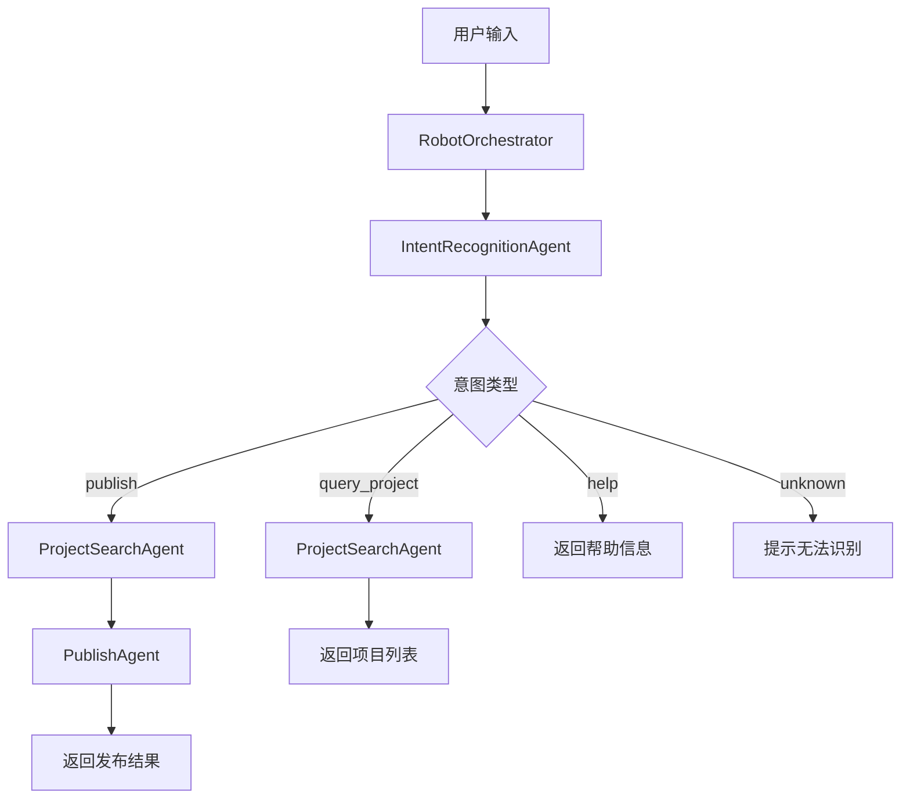

:::info 作者

novlan1

2026.2.1

:::

# AI 模块笔记

## `mr-auto-fix` 集合的主键

`2026-04-21`


## `mr-auto-fix` 集合的主键

**业务主键：Mongo 自动生成的 `_id`（ObjectId）**，也就是说**每次触发修复都会新增一条独立记录，互不覆盖**。

### 索引设计（见 `MRAutoFix.ts` 第 143–152 行）

| 索引字段 | 是否唯一 | 作用 |
|---|---|---|
| `_id` | ✅ 主键（Mongo 默认） | 一次修复 = 一条记录，永不覆盖 |
| `{ projectId: 1, mrIid: 1, createdAt: -1 }` | ❌ | 同一 MR 的多次修复按时间倒序排列 |
| `{ projectId: 1, fixMrIid: 1 }` | ❌ | 继续修复流程通过修复 MR iid 反查原始记录 |
| `{ status: 1 }` | ❌ | 按状态筛选/统计 |
| `{ createdAt: -1 }` | ❌ | 列表默认时间倒序 |
| `{ reviewId: 1 }` | ❌ | 按评审记录统计 `fixCount` 上限判断 |

### 和原来的区别

| | 旧：`MRReview` | 新：`MRAutoFix` |
|---|---|---|
| 主键 | `{ projectId, mrIid }` 唯一 | `_id` 自动生成 |
| 同一 MR 多次 `/ai-fix` | 覆盖最后一次 | **每次独立一条** |
| 修复方式查询 | 查 `MRReview.fixStatus: { $exists: true }` | 直接查 `MRAutoFix` 全表 |

这样你**同一 MR 多次 `/ai-fix` 都能看到完整历史**了 —— 也就是上次提的"同一个 mr 多次斜杠命令没有记录"的问题被彻底解决了。

## bugOwner

`2026-04-18`


**好消息：代码里其实已经有把 Bug 处理人（`bugOwner`）加入 MR 的逻辑了**（`TapdBugFixService.ts` 第 858-861 行）：

```typescript
const reviewers = [...TapdBugFixService.DEFAULT_REVIEWERS];
if (record.bugOwner && !reviewers.includes(record.bugOwner)) {
  reviewers.push(record.bugOwner);
}
```

**但之前的问题是**：这个列表只传给了工蜂 API 的 `assignee_list`（指派人），而不是 `reviewer_list`（评审人）。在工蜂中这两个是不同的概念：
- `assignee_list` → MR 的**指派人**
- `reviewer_list` → MR 的**评审人**（会收到 Code Review 通知）

**修改内容**：修改了 `GitApiService.ts` 的 `createMergeRequest` 方法：
1. 新增可选参数 `reviewerList`
2. 如果未单独指定 `reviewerList`，默认使用 `assigneeList` 同时作为评审人
3. 创建 MR 时同时传递 `assignee_list` 和 `reviewer_list`

这样 Bug 处理人会同时成为 MR 的**指派人和评审人**，会收到 Code Review 通知。


## 小程序组件转 uniapp

`2026-03-24`

之前一直在做将小程序组件转换为 uniapp 的工作。_example_uni 是用自动转换工具生成的结果，需要把其中新增的组件同步过去。

_example_uni 是用最新的自动转换工具产生的结果，可能有些组件源码有更新（原始小程序版本有改动），这些改动需要同步到已有的 uniapp 版本里。

## Claw 个人数字助理

`2026-03-13`

任何云端智能体都能成为 Claw 吗？

不是。成为 Claw（即个人数字助理）需要满足以下条件：

1. 需要有工作区（运行环境）：智能体必须绑定一个工作区（AnyDev 容器或本地设备），才能执行文件读写、Shell 命令等操作
2. 需要配置 Client 工具：在智能体配置页面启用代码读写工具（Knot CLI），才具备对设备的控制能力
3. 需要打通消息端：通过企微机器人、微信等渠道与工作区建立连接

简单说，普通的云端对话智能体（没有绑定工作区和 CLI 工具的）只能回答问题，无法控制设备，不能算 Claw。只有配置了 Knot CLI + 工作区 的智能体，才能实现 Claw 的核心能力

## Vibe Coding vs 传统编程

`2026-03-11`

1. 对「编程下限」的影响

传统编程

- 门槛高：语法、环境、逻辑、调试都要学
- 新手容易卡壳、写不出可运行代码
- 下限很低：很多人入门就放弃

Vibe Coding（AI 辅助）

- 自然语言就能生成代码
- 自动补全、纠错、给示例
- 零基础也能跑出可用程序

→ 下限被大幅拉高：几乎人人都能写代码

2. 对「编程上限」的影响

传统编程

- 上限 = 你的学习时间 + 经验 + 智商 + 精力
- 普通人很难摸到高上限

Vibe Coding

- 速度、广度、功能复杂度大幅提升
- 能做前后端、小产品、工具、脚本、简单系统
- 上限接近中高级程序员

但到顶就停：

- 架构设计、性能优化、高并发、安全、疑难Bug
- 大型项目、工程化、重构、技术债务

→ 上限到不了顶尖架构师/专家级

3. 核心结论

"Vibe Coding 极大提高了普通人编程的下限，也明显拉高了上限，但无法突破真正顶尖的技术天花板。"

4. 一句话总结

Vibe Coding 让普通人"会编程"变得极容易，也能做得更快更多，但真正的深度与架构，依然靠人。

## Vibe Coding 的局限性

`2026-03-11`

Vibe Coding 极大提高了普通人编程的下限，也明显拉高了上限，但无法突破真正顶尖的技术天花板。

- AI 生成代码常缺架构、性能、安全、异常处理、高并发能力。
- 复杂系统、底层优化、疑难 Bug、大规模工程，仍依赖深度编程理解。
- 项目变大后，维护、重构、技术债务会剧增。

## OpenClaw 与数据主权

`2026-03-10`

2026 年，AI Agent 领域迎来爆发式增长。然而，当越来越多的用户开始将个人数据、工作文档、日程安排托付给 AI 助手时，一个尖锐的问题浮出水面：我的数据去哪了？

传统 AI 助手几乎清一色采用云端架构——你的聊天记录、文件内容、行为偏好，统统上传到厂商服务器。用户在享受便利的同时，也在不知不觉中出让了最宝贵的东西：数据主权。

正是在这样的背景下，OpenClaw 凭借其"Local First"（本地优先）的核心理念横空出世，给出了一个截然不同的答案：AI 可以很强大，但你的数据必须留在你自己手里。

## MCP 与 Function Calling 的关系

`2026-03-06`

所以本质上 MCP 就是借助 Function Calling 的机制，对外提供一个服务，让既有的系统快速集成到 LLM 中，通常一个 MCP Server 有很多工具，而不是一种。

那 MCP 跟 Function Calling 是什么关系呢？这是网上大多数文章都有问题的地方，它们是协作关系！我们简单叙述一下流程：

1. 第一阶段：能力构建与协议初始化（前提条件）

- 大模型的微调 (Foundation)：通过微调使 LLM 获得核心能力，也就是能理解 MCP 标准的格式化请求。这个本质上跟训练如何识别 Function Calling 是一样的，所以有人说 MCP 就是基于 Function Calling 的。
- MCP 动态注册 (MCP Registration)：AI Agent 启动的时候，同时会启动在 Agent 里的 MCP client 客户端，MCP Client 客户端回拿到的数据返回给 AI Agent，然后 AI Agent 根据之前大模型训练好的如何接收 MCP 标准的格式化请求的要求，将这些动态获取的工具定义会随用户问题一起注入大模型

2. 第二阶段：实际运行与协议化调用

- 用户提问 (Query)：后续用户发起请求给 AI Agent
- 注入与识别：Agent 将"用户问题"与"从 MCP Server 拿到的工具定义"一并下发给 LLM
- 意图识别与决策：LLM 匹配工具集，识别出调用需求，输出符合 MCP 协议的指令，例如：call: { function_name: "...", arguments: "..." }
- 路由解析与分发：Agent 中枢解析指令，通过 MCP 客户端 将执行请求精确路由至对应的 MCP 服务器。
- 协议化执行：MCP Server 在其编程上下文（如本地数据库、Python 环境或 HTTP 远程服务）中执行函数。
- MCP Client 将返回的结果再次返回给 AI Agent, Agent 将获取的数据再次请求大模型, 最终返回给用户结果。

## 嵌入与向量

`2026-03-06`

你可以把"嵌入"理解为：给每一个词画一张极其精细的"多维画像"。

此时向量这个出现在很多科普文章中关键概念出现了，我会用更通俗易懂的方式来解释。举例：描述一个人，可以用四个维度：\[性别（0是女生，1是男生）, 身高, 体重, 年龄\]

"男人" → \[1, 175, 70, 30\]

"女人" → \[0, 165, 50, 25\]

这里的 \[1, 175, 70, 30\] 在数学上就叫 向量（Vector）。而把"男人"这个词映射到这串数字的过程，就叫 嵌入（Embedding）。

核心思想：在数学空间里产生"思维"

如果 4 个维度能描述一个人，那么大模型会用成千上万个维度（比如：褒贬、生命体、具体/抽象、科技术语等）来给每一个词画画像。

当所有的词都被打分并转化成"嵌入向量"后，神奇的事情发生了：这些词不再是孤立的符号，而是变成了多维空间里的一个点。

在这个数学空间里：

- 距离代表关系：意思相近的词（如"开心"和"快乐"），它们的画像数字非常接近，在空间里的距离也极短。
- 逻辑可以计算：因为每个词都是一组数字，它们竟然可以像加减法一样运算。

科学家们发现了一个震惊世界的现象：

"国王"的向量 - "男人"的向量 + "女人"的向量 ≈ "女王"的向量

换句话说："嵌入"技术不仅把文字变成了数字，还把文字背后的逻辑关系也一并平移到了数学世界里。这是大模型能够"思考"的物理基础。

## AI 时代的三个认知

`2026-02-26`

第一，最好的模型就是这个时代最大的信息差，从花费20刀开始。无论国内多少炸场、掀桌子、炸榜。目前最好的AI工具还是国外三巨头，这不是工具便好，而是认知分流，时间区间拉长，用谷歌的人认知大概率比百度的高、用ChatGPT、Claude、Gemini大概率比用其他的高。

第二，打破认知防御。不要当评委，当教练。给AI你的完整context——你的知识、你的标准、你的判断逻辑。你给得越多，它越像你的延伸。不是用工具，是在训练一个懂你的分身。

第三，与AI迭代加速度赛跑。AI能做的事价值在归零。问自己：我有什么是AI做不了的？不是学历，不是年限。是三样东西：你有而AI没有的一手经验、你对问题比AI更深一层的洞察、AI想不到的解法。

但这里有个悖论——你不深度用过AI，就不知道它的边界在哪。你不知道它的边界，就找不到自己真正的壁垒。

## ti18n-mcp

`2026-02-12`


ti18n-mcp

## CodeBuddy MCP 文档

`2026-02-10`

https://www.codebuddy.cn/docs/cli/mcp

## 算力即生产力

`2026-02-10`

算力就是生产力。算力的富足将我们带入计算时代。算力重新锚定了科技创新的坐标。

## 模型训练与推理

`2026-02-09`

- 模型训练过程就是不断前向传播、损失计算、反向传播、参数更新的过程。
- 模型推理就是根据训练好的参数，进行前向传播的过程。

## 支持向量机 SVM

`2026-02-06`

支持向量机（Support Vector Machine，简称 SVM）是一种强大的分类算法，在数据科学和机器学习领域广泛应用。SVM 的核心思想是，找到一个最优的决策边界，或者称为"超平面"，这个边界能够以最大的间隔将不同类别的数据分开。这里有几个关键点需要好好理解一下。

超平面：在二维空间中，这个边界就是一条线；在三维空间中，是一个平面；而在更高维度的空间中，我们称之为"超平面"。这个超平面的任务就是尽可能准确地分隔开不同类别的数据点。

最大间隔：SVM 不仅仅寻找一个能够将数据分类的边界，它寻找的是能够以最大间隔分开数据的边界。这个间隔是指不同类别的数据点到这个边界的最近距离，SVM 试图使这个距离尽可能大。直观上，这样的边界更能抵抗数据中的小变动，提高模型的泛化能力。

支持向量：决定这个最优超平面位置的几个关键数据点被称为支持向量。它们是最靠近决策边界的点，实际上这个最大间隔的边界就是通过这些点来确定的。

核技巧：当数据不是线性可分时，也就是说无法通过一个直线或平面来分隔，SVM 可以利用所谓的核技巧将数据映射到一个更高维的空间，在这个空间中数据可能是线性可分的。这使得 SVM 在处理非线性数据时非常强大。

简单来说，你可以将 SVM 想象成一个尽可能在不同类别间画一条粗的、清晰的界线，而这条界线是由距离它最近的几个点（支持向量）决定的。这种方法使得分类决策不仅仅依赖于数据的分布，而且具有很好的泛化能力，能够应对未见过的新数据。

## SVM 核心思想

`2026-02-06`

SVM 的核心思想是，找到一个最优的决策边界，或者称为"超平面"，这个边界能够以最大的间隔将不同类别的数据分开。

## Prompt 六要素

`2026-02-04`


任务、上下文、范例、角色、格式、语气

## 提示工程师

`2026-02-04`


提示工程师

### Robot 子 Agent 系统

`2026-02-03`

✅ Robot 子 Agent 系统已完成

已经重新检查并确认了整个系统结构完整。以下是文件结构和功能说明：

📁 文件结构

```
src/next-admin-svr/robot/
├── index.ts                          # 模块导出入口
├── types.ts                          # 类型定义
├── orchestrator.ts                   # 编排器（核心调度）
└── agents/
    ├── index.ts                      # Agents 导出入口
    ├── intent-recognition-agent.ts   # 意图识别 Agent
    ├── project-search-agent.ts       # 项目搜索 Agent
    └── publish-agent.ts              # 发布 Agent
```

🔄 工作流程



🎯 各 Agent 职责

| Agent | 职责 | 实现方式 |
|-------|------|---------|
| **IntentRecognitionAgent** | 解析用户意图 | 正则匹配 + AI（`@tencent-ai/agent-sdk`） |
| **ProjectSearchAgent** | 模糊匹配项目 | 数据库查询 + 评分算法 |
| **PublishAgent** | 执行发布操作 | 调用 `mcpPublish` |

💬 支持的命令

```
1. 发布 <项目名> [分支名] [发布原因]
   例: 发布 gp-next develop
   例: 发布 gp-next release 修复bug

2. 查询 <项目名>
   例: 查询 gp-next

3. 帮助 / help
```

🔌 集成方式

路由文件 robot.ts 已集成：

```typescript
import { RobotOrchestrator } from '../robot';

const orchestrator = new RobotOrchestrator({
  useAI: true, // 启用 AI 意图识别
});

router.post('/', async (req, res) => {
  const response = await orchestrator.handleMessage(messageText, {
    staffname,
    messageId: req.body.msgid,
  });
  res.send(response);
});
```

📝 扩展新功能

后续要添加新功能，只需：

1. **定义新的意图类型**：在 `types.ts` 的 `IntentType` 枚举中添加
2. **创建新的 Agent**：在 `agents/` 目录下创建新的 Agent 类
3. **注册到编排器**：在 `orchestrator.ts` 中添加处理流程

例如，添加"回滚"功能：

```typescript
// 1. types.ts
export enum IntentType {
  // ...
  ROLLBACK = 'rollback',  // 新增
}

// 2. agents/rollback-agent.ts
export class RollbackAgent implements IAgent<RollbackParams, RollbackResult> { ... }

// 3. orchestrator.ts handleMessage 中添加 case
case IntentType.ROLLBACK:
  return this.handleRollbackFlow(intent, context);
```

### CodeBuddy 输出内容替换

`2026-02-01`

codebuddy 中的输出内容需要替换

第1步

```js
command:gongfeng[^)]+ 替换为
```

第2步

```js
\[([^]+?)\]\(\) 替换为 $1
```
