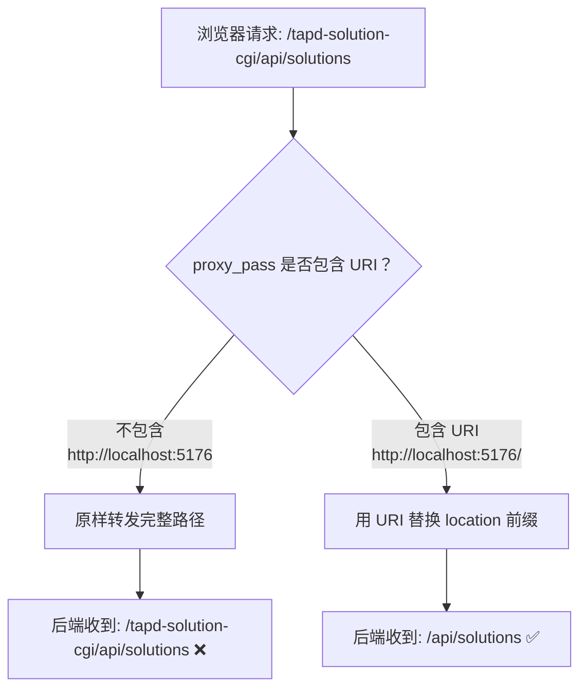
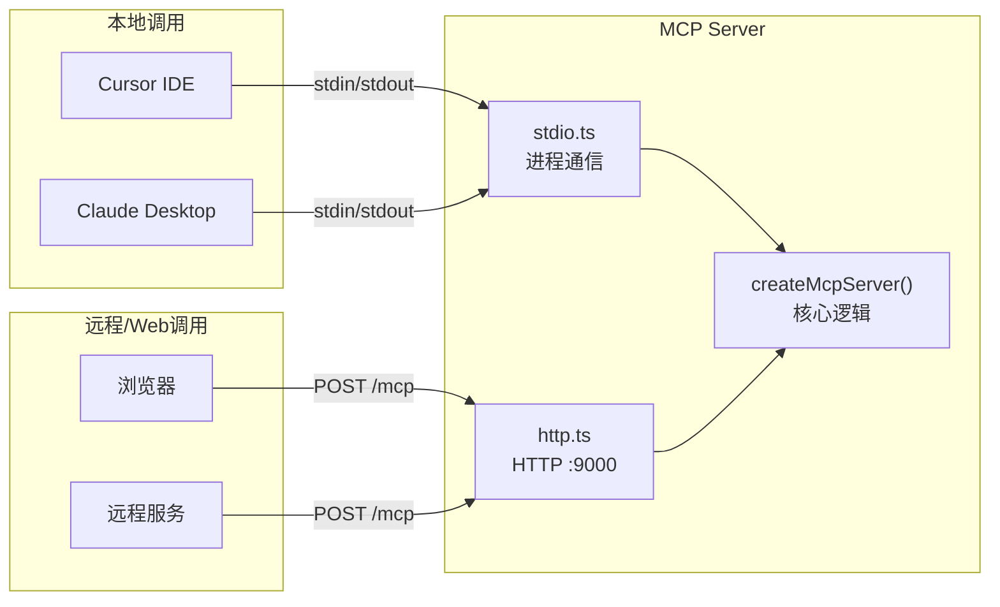

:::info 作者

novlan1

2026.1.1

:::

# 非技术思考笔记

## TDesign

`2026-03-31`


## 提效

`2026-03-31`

计划通过TAPD方案自动生成、代码自动生成、自动提MR、自动评审、自动发布测试环境等流程，进行需求开发的全链路提效，减少需求开发工时 50%。

## token

`2026-03-30`


## nginx 中  `proxy_pass` 带不带尾部 `/` 的区别

`2026-03-30`


#### 核心规则

Nginx 的 `proxy_pass` 有一个关键规则：

> **如果 `proxy_pass` 的 URL 中包含 URI 部分（哪怕只是一个 `/`），Nginx 会用这个 URI 替换掉 `location` 匹配到的部分。如果不包含 URI，则原样转发完整请求路径。**

### 什么算"包含 URI"？

| proxy_pass 写法 | 是否包含 URI | 说明 |
|---|---|---|
| `http://localhost:5176` | ❌ 不包含 | 没有任何路径部分 |
| `http://localhost:5176/` | ✅ 包含 | `/` 就是一个 URI |
| `http://localhost:5176/app` | ✅ 包含 | `/app` 是 URI |

#### 具体行为对比

假设 Nginx 配置：

```nginx
location /tapd-solution-cgi/ {
    proxy_pass http://localhost:5176;   # 不带 /
}
```

浏览器请求 `/tapd-solution-cgi/api/solutions`，Nginx 的处理逻辑：

```
proxy_pass 没有 URI 部分
→ 原样转发完整路径
→ 后端收到: /tapd-solution-cgi/api/solutions  ❌ 404
```

改成带 `/`：

```nginx
location /tapd-solution-cgi/ {
    proxy_pass http://localhost:5176/;  # 带 /
}
```

```
proxy_pass 有 URI 部分（/）
→ 用 "/" 替换掉 location 匹配的 "/tapd-solution-cgi/"
→ 后端收到: /api/solutions  ✅ 匹配成功
```

### 替换公式

用一个公式来理解：

```
后端收到的路径 = proxy_pass的URI + (原始请求路径 - location匹配的部分)
```

以请求 `/tapd-solution-cgi/api/solutions` 为例：

| 配置 | 计算过程 | 后端收到 |
|---|---|---|
| `proxy_pass http://localhost:5176;` | 无 URI，原样转发 | `/tapd-solution-cgi/api/solutions` |
| `proxy_pass http://localhost:5176/;` | `/` + (`/tapd-solution-cgi/api/solutions` - `/tapd-solution-cgi/`) | `/api/solutions` |
| `proxy_pass http://localhost:5176/v2/;` | `/v2/` + (`/tapd-solution-cgi/api/solutions` - `/tapd-solution-cgi/`) | `/v2/api/solutions` |

#### 流程图



#### 总结

一句话记住：**`proxy_pass` 不带路径 = 原样转发，带路径（哪怕只是 `/`）= 替换 location 前缀**。这就是为什么仅仅多一个 `/` 就能决定后端收到的是 `/tapd-solution-cgi/api/solutions` 还是 `/api/solutions`。

### 撤回废弃

`2026-03-29`

```bash
# 撤回废弃
npm deprecate tdesign-uniapp-chat ""

# 重新废弃
npm deprecate "tdesign-uniapp-chat@*" "This package has been renamed to @tdesign/uniapp-chat. Please install @tdesign/uniapp-chat instead. See https://tdesign.tencent.com/uniapp-chat/getting-started/ for more details."
```

### bash 代码片段

`2026-03-25`

```bash
npm deprecate tdesign-uniapp "This package has been renamed to @tdesign/uniapp. Please install @tdesign/uniapp instead. See https://tdesign.tencent.com/uniapp/getting-started/ for more details."
```

## 创业的概念已经变了，不再需要出来、招人等

`2026-03-24`

创业的概念已经变了，不再需要出来、招人等

## 工具库是否要建MCP呢？满足下面任意 1 条 → 建议做…

`2026-03-24`

工具库是否要建MCP呢？满足下面任意 1 条 → 建议做 MCP，否则完善 JSDoc 就行。

1. 参数复杂、嵌套
2. 强依赖顺序
3. 有状态/异步/缓存
4. 用法不直观，新人要看文档
5. 希望大模型自动编排
6. 工具数量 > 50，且用户需要"发现"哪些工具存在

### sh 代码片段

`2026-03-24`

```sh
# 下载 protoc 文件
scp group-new:/root/guowangyang/protoc-gen-http-ts/main /Users/guowangyang/Documents/git-woa/gen-proto-ts/main
```

### bash 代码片段

`2026-03-24`

```bash
# 上周总下载量
curl -s https://api.npmjs.org/downloads/point/last-week/@tdesign/uniapp

# 昨天总下载量
curl -s https://api.npmjs.org/downloads/point/last-day/@tdesign/uniapp

# 上周下载明细
curl -s https://api.npmjs.org/downloads/range/last-week/@tdesign/uniapp

# 指定日期
curl -s https://api.npmjs.org/downloads/point/2026-03-22-2026-03-23/@tdesign/uniapp
```

## npm 的下载量统计不是实时更新的：

`2026-03-24`

npm 的下载量统计不是实时更新的：

- 按天聚合：数据以 UTC 天 为粒度统计，不是每分钟更新

- 延迟约 24~48 小时：last-day 返回的是前一个完整 UTC 日的数据。比如今天是 3 月 24 日，返回的是 3 月 23 日（甚至可能是 3 月 22 日）的数据

- 每天批量更新一次：npm 的统计后端每天跑一次批处理任务来聚合前一天的下载日志，通常在 UTC 时间每天凌晨 更新完成

### slug 的含义

`2026-03-22`

### slug 的含义

在这个代码中，**slug** 是指文章的 **URL 友好标识符**，本质上就是 **markdown 文件名去掉 `.md` 后缀**的部分。

例如：

| 文件名 | slug |
|--------|------|
| `hello-world.md` | `hello-world` |
| `my-secret-note.md` | `my-secret-note` |
| `16.intl登录.md` | `16.intl登录` |

具体在代码中体现在两处：

1. **列表接口**（第 99 行）生成 slug：
   ```js
   const slug = filename.replace(/\.md$/, '');
   ```
   把文件名去掉 `.md` 后缀作为 slug 返回给前端。

2. **详情接口**（第 117 行）通过 slug 反查文件：
   ```js
   const filePath = path.join(PRIVATE_DIR, `${slug}.md`);
   ```
   前端传入 slug，后端拼回 `.md` 后缀去读取对应文件。

#### slug 这个词的来源

slug 是 Web 开发中的通用术语，源自新闻出版业，指的是一篇文章的**简短标识名**。它的特点是：

- **URL 友好**：可以直接放在 URL 路径中，比如 `/notes/article/hello-world`
- **人类可读**：比起用 id（如 `123`）或 UUID，slug 能让用户一眼看出是什么文章
- **唯一性**：在同一目录下文件名不会重复，所以 slug 天然唯一

在这个项目里，slug 的作用就是**充当文章的唯一标识**，替代了数据库中常用的 id 字段——因为文章是以文件形式存储的，文件名本身就是天然的唯一标识。

## 信息差就别人不知道你知道，别人没意识到但你意识到了，然后…

`2026-03-11`

信息差就别人不知道你知道，别人没意识到但你意识到了，然后迅速抢占资源，迅速做完。

## 赚钱的第一性原理是创造价值，而不是出卖时间。创造价值的第…

`2026-03-03`

赚钱的第一性原理是创造价值，而不是出卖时间。创造价值的第一性原理是解决问题，而不是付出劳动力。解决问题的第一性原理是识别真正的需求，然后快速实践反馈迅速迭代。快速迭代的第一性原理是验证模型，从而可以更好的进行系统复制。系统复制的第一性原理是杠杆思维，只有使用杠杆放大系统你才能真正摆脱苦力，并走向真正的自由。

## 每次回家，都是为了更好的出发。

`2026-03-03`

每次回家，都是为了更好的出发。

## 城市越大，越显得自己渺小，越没存在感、归属感。

`2026-03-03`

城市越大，越显得自己渺小，越没存在感、归属感。

## 过去的一年，我近距离接触了非常多 35+ 技术人，那些穿…

`2026-03-02`

过去的一年，我近距离接触了非常多 35+ 技术人，那些穿越 35+ 危机的人，在我看来都有这么三个特质。

1. 心态 open，对真实世界，对他人充满好奇，愿意开放学习。
2. 有非常清晰的自我认知，能很好地扬长避短。比如突破一般技术人过于追求确定的惯性，敢于冒险，敢于创新。把技术人的逻辑思维、分析问题 & 解决问题发挥到极致，即使转战新领域，依然能做出跟科班不一样的路。
3. 对未来有耐心，坚持“下场干”，保持长期主义，持续迭代。

## 习惯制造信息差，拉一些小群，既然如此，那就多做自己的事，…

`2026-02-28`

习惯制造信息差，拉一些小群，既然如此，那就多做自己的事，多做壁垒。

## 发券真是伟大的发明，有些东西很贵，比如吃饭、住宿、交通，…

`2026-02-28`

发券真是伟大的发明，有些东西很贵，比如吃饭、住宿、交通，不像奶茶，没法给免单，就发券吧。

## 餐饮（茶饮+餐食）、互联网会员/平台、运营商、零售、酒旅…

`2026-02-28`

餐饮（茶饮+餐食）、互联网会员/平台、运营商、零售、酒旅 OTA/出行

## 大局观

`2026-02-28`

大局观

## 最了解一个人的未必是他自己，以照镜子为例，有些人就是不照。

`2026-02-26`

最了解一个人的未必是他自己，以照镜子为例，有些人就是不照。

## 费曼学习法核心是通过输出倒逼输入，可以发现盲区。

`2026-02-26`

费曼学习法核心是通过输出倒逼输入，可以发现盲区。

## 你可以“创造”时间。

`2026-02-26`

你可以“创造”时间。

寻找方法将非生产性时间转变为生产性时间。找出一天或一周中的空闲时间。你可以富有成效地利用这些时间，而不是坐在那里等待事情发生。

通过运动和健康饮食增加你的能量。在你的每一小时里，你的精力越充沛，这一小时对你实现目标所发挥的作用就越大。

## 拖延是大敌。

`2026-02-26`

拖延是大敌。

拖延是一种令人讨厌的诱惑。然而，你必须同这种冲动进行斗争。

试着将自己设想成：你要么在前进，要么在后退。要么，你是在向着你的目标前进，这当然很好。要么，你是在远离你的目标。当你站着不动时，你的目标很有可能在离你远去。

## 确定优先次序的方法之一是要记住二八定律，也就是说，达成你…

`2026-02-26`

确定优先次序的方法之一是要记住二八定律，也就是说，达成你目标80%的进展来自你20%的活动。

## 时间管理专家告诉我们，杂乱对生产力来说，是具有破坏性的。

`2026-02-26`

时间管理专家告诉我们，杂乱对生产力来说，是具有破坏性的。
- 杂乱会引起情绪紧张。
- 杂乱会导致无所作为。
- 杂乱会降低效率。

## 拖延源自一种非常强大的物理法则，人们称之为惯性。

`2026-02-26`

拖延源自一种非常强大的物理法则，人们称之为惯性。

惯性法则表明：一个静止的物体将保持静止，除非受到外力的作用。换句话说，物体——包括人——倾向于待在原地不动。为了实现向前移动，人们需要推动自己。惯性倾向于使所有的人保持原地不动。

## 第一性原理的最大价值在于两点，其一是能够看清楚事物的本质…

`2026-02-25`

第一性原理的最大价值在于两点，其一是能够看清楚事物的本质，其二是能够在理解本质的基础上自由地创新。对于投资人而言，就是在回归投资的基本定义的基础上，理解商业的底层逻辑。

## 这段是刘强东多年前对当时电商行业格局、竞争对手及行业本质…

`2026-02-24`

这段是刘强东多年前对当时电商行业格局、竞争对手及行业本质的判断，核心观点如下：

1. 关于亚马逊
认为亚马逊Kindle模式在中国因盗版问题很难成功；亚马逊中国会长期留在中国市场，但受跨国公司决策链长、执行效率低的限制，很难超越京东。

2. 关于国美、苏宁
它们传统物流以B2B为主，小件B2C物流能力薄弱，过去的体系利用率很低，新建电商物流需要巨额资金和至少五年时间，不是光有钱就能快速做成。

3. 关于当当
李国庆、俞渝夫妇战略不错，但物流布局太晚。一是担心股权被稀释，二是寄希望于未来出现成熟第三方快递，而刘强东判断十年内都不会有能支撑电商的第三方物流。

4. 关于凡客
凡客发展很快，但品牌没有形成溢价，用户不愿为品牌多付钱，长期难以持续盈利；服装行业高度个性化、品牌分散，垂直电商很难做成超大平台，和京东也构不成直接竞争。

5. 对电商行业本质的判断

- 电商和纯互联网模式不同，不是靠模式快速爆发，而是需要十年左右沉淀才能站稳脚跟。

_ 核心壁垒是物流、供应链、服务、管理，需要大量资金、时间和人才积累，不是短期能复制。

- 综合型大电商门槛极高，后来者机会很小；小而美的电商仍有空间，被收购也是一种成功。

6. 对消费与竞争的看法
消费者核心只看产品、价格、服务，不管购物形式怎么变，这点不会变。
真正的壁垒是长期积累的体系能力，而非短期模式创新。

## 而是一直谦虚低调

`2026-02-24`

而是一直谦虚低调

## 不会说变得骄傲而说话自大、自吹自擂、盲目扩张等

`2026-02-24`

不会说变得骄傲而说话自大、自吹自擂、盲目扩张等

## 眼光看的长远才能宠辱不惊，像马化腾，创业、上市、市值68…

`2026-02-24`

眼光看的长远才能宠辱不惊，像马化腾，创业、上市、市值6800亿美元，都没有影响他心态。

## GASKE也可以用在自己面试或者被面试中，给别人打分或者…

`2026-02-24`

GASKE也可以用在自己面试或者被面试中，给别人打分或者给自己打分。

## 有用、好用、爱用其实也可以用在自己的提效工具自己组件库上。

`2026-02-24`

有用、好用、爱用其实也可以用在自己的提效工具自己组件库上。

## 矫枉必过正，不过矫不正。历史无数次证明了这一点。文化大革…

`2026-02-24`

矫枉必过正，不过矫不正。历史无数次证明了这一点。文化大革命后、扫黑除恶、疫情解除等

## “我肚子痛，要吃点老碗会”

`2026-02-22`

“我肚子痛，要吃点老碗会”

## “妈妈的花长锈了”

`2026-02-22`

“妈妈的花长锈了”


## 明天、后天或者明年、后年肯定没人记得你，论如何不在乎别人…

`2026-02-21`

明天、后天或者明年、后年肯定没人记得你，论如何不在乎别人的目光。

## 有用、好用、爱用，递进关系

`2026-02-21`

有用、好用、爱用，递进关系

## 用心听，但不要照着做。

`2026-02-21`

用心听，但不要照着做。

## 产品没做好前不要推，否则会伤害用户，用户一旦失望，还没再…

`2026-02-21`

产品没做好前不要推，否则会伤害用户，用户一旦失望，还没再回来使用。

平台期就要做商业化了。有花堪折直须折，莫待无花空折枝。

## 想清楚重要的不是效率，是深刻、透彻，做出来和推出去要将讲…

`2026-02-21`

想清楚重要的不是效率，是深刻、透彻，做出来和推出去要将讲究效率。

## 上线容易，下线难。“用的好好的功能，为什么要下线”

`2026-02-21`

上线容易，下线难。“用的好好的功能，为什么要下线”

## 社会学里有一个观点——语言会影响人的思维，在我看来，类似…

`2026-02-20`

社会学里有一个观点——语言会影响人的思维，在我看来，类似的道理，一个组织使用的软件工具，也会影响组织的文化，进而塑造组织行为，决定组织效率。

## 深度优先的 2B 领域，必然不会如广度优先的 2C 般一…

`2026-02-20`

深度优先的 2B 领域，必然不会如广度优先的 2C 般一家独大。

## 其实，所有的商业模式都可以用这样一句话来概括：为谁提供什…

`2026-02-20`

其实，所有的商业模式都可以用这样一句话来概括：为谁提供什么“价值”，靠什么方式转换为“收入”，这两者之间通过什么商业“过程”来支撑。 因此，获取收入的要点就是想清楚价值、收入和过程。

长尾需求就是指多样性用户的过于多样化、个性化的需求，这里最经典的就是亚马逊。原来在线下书店，因为受有限货架的限制，有很多小众图书都买不到，而后来亚马逊就满足了这一需求，由此打开了长尾需求的市场。

## 基因，自驱力。

`2026-02-20`

基因，自驱力。

Ability 能力

我也非常看重优秀的学习能力，和良好的沟通方式。学习能力是优秀产品经理和平庸产品经理的一条分界线。优秀的产品经理一定是喜欢阅读、喜欢总结，能够深度思考并且具备复盘习惯的。想考察这一点，我们可以问问对方有没有在某件事情上成为 Top 1% 的经历。优秀的学习能力是一个人可以不断迭代自我，不断成长的基础。

而沟通方式背后体现的其实是同理心。如果一个人与同事沟通困难，那么他与用户的沟通自然也好不到哪里去。而且，能切换到不同的视角看问题，是做好产品、平衡好用户生态中多种多样用户利益的基础。这一点，在面试全过程中，可以有一个感性的认知。

最后的 Knowledge 知识和 Experience 经历，重点在于匹配。我把这种匹配又分为两部分，一是行业认知，二是项目经验。

## 那产品经理岗位如何做结构化面试呢？我借用从一位企业家那里…

`2026-02-20`

那产品经理岗位如何做结构化面试呢？我借用从一位企业家那里听来的框架来介绍这件事，这个框架叫“GASKE”，即五个英文单词的首字母：

- G，Gene 基因，是指底层的性格、素质，这是一个人与生俱来和长期生活积淀下来的东西，很难改，比如感性理性、主动被动、内向外向；
- A，Ability 能力，这里的能力偏抽象、难以量化，比如学习能力、沟通能力；
- S，Skill 技术，和能力不同，这里的技术是具象的，比如熟练掌握常用的用户研究技巧、会做全面的竞品分析；
- K，Knowledge 知识，如字面意思，就是知道哪些事情，比如知道产品开发的主干流程、知道硬件产品经常碰到的坑、知道某个行业的规则与潜规则；
- E，Experience 经历，就是说过往的相关工作中，都做过什么事情。

这五方面，越靠前的越本质，越靠后的越表象；越靠前的越稳定，越靠后的越易变。前面的会影响后面的，是后面的基础。

但有趣的是，面试的时候，没经验的面试官往往更关注后面的，比如曾经在某个大厂做过几年、参与过某某业界耳熟能详的产品。

## 产品平台化

`2026-02-20`

产品平台化

这个跨越最关键的变化就是用户出现了多样性，有些用户在满足另一些用户的需求。既然要有平台，就至少有供需双方，比如老师与学生、卖家与买家、司机与乘客、作者与读者……有时候甚至有多方，比如外卖平台上的商家、买家和骑手。这个阶段，产品和用户的关系要从“个体粘性”发展到“群体粘性”，我们可以借助群体中多种用户间的关联，建立平台的增强回路。

## 博得千万人的赞赏，不如得到一个长官的提拔。

`2026-02-19`

博得千万人的赞赏，不如得到一个长官的提拔。

博士论文两个难点，一是选题目，二是数据资料。如果一个题目没人选，要么是不值得做，要么是做过的人都失败了。

## 一点也不亲的亲戚。在一个最不开明的地方，遇上一个最不开明…

`2026-02-19`

一点也不亲的亲戚。在一个最不开明的地方，遇上一个最不开明的大家长。

## 项目产品化。这是从抓零散的单次机会，转变为打一眼可以持续…

`2026-02-19`

项目产品化。这是从抓零散的单次机会，转变为打一眼可以持续出水的井。对用户来说，就是要从提供“个体价值”到产生“个体粘性”，一方面是可以持续供给，另一方面是用户持续有需求。类比一下，有点像从采集到农耕、从打猎到游牧的变化，是从打了一只野猪饱餐一顿，跨越到驯化野猪为家猪，大猪生小猪，顿顿有肉吃。

项目产品化，靠的是总结提炼，把服务某个用户的能力，泛化到服务一类用户身上。

## 方法论只能用来提高下限，却无法提升上限。

`2026-02-19`

方法论只能用来提高下限，却无法提升上限。

方法论只能告诉我们哪些方向是大概率要失败的，即方法论可以帮助我们避开天坑、做减法。具体一点，M2V6P 的方法论可以帮助我们更早发现错误，从而减少时间、人员、金钱的损失。这有点像很多伟大的球星，通过日常的刻苦训练，做好每一个基本动作，然后成功的概率就自然提升了。

## 技术的尽头是产品，产品的尽头是商业，商业的尽头是组织

`2026-02-19`

技术的尽头是产品，产品的尽头是商业，商业的尽头是组织

## 再强的人，创新也经常面临失败。

`2026-02-19`

再强的人，创新也经常面临失败。

很多硅谷的投资人把失败者看作“有经验的人”，扎克伯格也经常在公司里讲，“如果你没有遇到失败，说明你跑得还不够快。”

这里的“宽容”不但是对“失败”这一结果的宽容，还表现在开始时就做好失败的心理准备，认可“快死”比“半死不活”要好得多。所谓“死亡是一个公司对社会的最后一次贡献”，以及“淘汰掉不适合的人，对双方都是解脱”就是这个意思。

在这种宽容下，风险资本、连续创业者才能愈挫愈勇。

## 而我认为组织、团队能够保持持续创新的真正决定因素，恐怕还…

`2026-02-19`

而我认为组织、团队能够保持持续创新的真正决定因素，恐怕还是今天这一讲的主题——文化与价值观。是否有创新文化、好奇心，当地的人民群众是否乐于去探索、接受新鲜事物等等才是关键点。

我认为共同构成了硅谷形成的基因序列的是叛逆精神、拒绝平庸、宽容失败、多元文化。

## 整个阿里这么多年，从 PSF 到 PMF 到 PRF，找…

`2026-02-19`

整个阿里这么多年，从 PSF 到 PMF 到 PRF，找到了自己的立身之本——让天下没有难做的生意，拥有的资源也是不断累积，一是用户、二是数据、三是各种经验，都围绕着做生意、商业、零售这些话题。

首先说可复用，盒马可以复用阿里已有的资源，比如，在选址时，利用阿里积累的零售数据，知道哪些城市哪些小区的用户，消费能力与盒马比较匹配，消费的商品是盒马有供应链优势的；又比如，通过多年的历史数据，盒马可以有预测地调整采购，避免决策滞后。

然后是能积累，盒马在线下线上产生的各种交易，都是直接数字化的，可以回馈给阿里整个数据池子，丰富整个电商数据，让其他产品可以获益。而盒马在各种大型 Shopping Mall 里积累的经验，又可以指导阿里其他新零售业务的尝试。

最后是善生死，在 2019 年，阿里发现盒马的业务和天猫超市的业务有很大的关联性，于是又做了一些业务和团队上的整合，该增强的增强、该减弱的减弱、该砍掉的砍掉，这波操作，也是我提到的广义的“善生死”。

## 产品创新价值的四个层次

`2026-02-19`

产品创新价值的四个层次
- 发明价值
- 用户价值
- 商业价值
- 社会价值

## 我对发明和创新这两个词有着不同的理解：发明，只需要东西新…

`2026-02-19`

我对发明和创新这两个词有着不同的理解：发明，只需要东西新，但创新，还需要“有用”。

## 我一直说，用户和产品是一体的，协同演化，那么在共同提升产…

`2026-02-19`

我一直说，用户和产品是一体的，协同演化，那么在共同提升产品创新课的价值上，你的每一次分享、转发，都为它做了贡献。

于是乎，我最在乎的成功指标，也一定是和主动分享相关的，而不是付费用户数和收入。

## 产品和工具都是解决某个问题的东西。

`2026-02-19`

产品和工具都是解决某个问题的东西。

## 小结一下，产品到底是什么，以及要做什么？

`2026-02-19`

小结一下，产品到底是什么，以及要做什么？

- 内核：要不断迭代内核。
- 包装：要适应场景包装。
- 服务：要从实体到服务。
- 平台：要从自营到平台。

产品，及其要做的事情，其实包括但不限于以上提到的这些，因为在我的定义里，产品就是“解决某个问题的东西”。随着你对问题思考的不断深入，产品就可以不断延展，要做的事情也会延展，就像千岛湖啤酒，从“酿酒”到“酿造快乐生活”。

## 一、什么是KANO模型

`2026-02-19`

一、什么是KANO模型

KANO模型（卡诺模型）是东京理工大学狩野纪昭教授于1984年提出的需求分类与优先级排序工具，核心是：不同功能对用户满意度的影响是非线性的。

• 横轴：功能具备程度

• 纵轴：用户满意度

• 用途：划分需求优先级、指导产品研发与资源分配

二、五大需求类型（核心）

1. 必备型需求（Must-be / 基本型）

• 特点：用户认为理所当然必须有；满足了不加分，缺失/不足会极度不满

• 例子：手机能打电话、App能登录、外卖能按时送达

• 策略：必须做、做扎实，是产品底线

2. 期望型需求（One-dimensional / 性能型）

• 特点：用户明确提出，满足度与满意度线性正相关；做得越好越满意，越差越不满

• 例子：手机续航、外卖速度、App响应速度

• 策略：重点投入、做差异化，是竞争主战场

3. 魅力型需求（Attractive / 兴奋型）

• 特点：超出预期、用户想不到；没有不会不满，有了会大幅提升满意度与忠诚度

• 例子：iPhone初代多点触控、外卖送小零食、App夜间模式

• 策略：创新突破、打造亮点，易形成口碑

4. 无差异型需求（Indifferent）

• 特点：用户不在乎；做不做都不影响满意度

• 例子：App换肤、非核心页面的小装饰

• 策略：少投入或不做，避免浪费资源

5. 反向型需求（Reverse）

• 特点：做了反而降低满意度，引起反感

• 例子：强制广告、过度索取隐私、冗余复杂功能

• 策略：坚决不做

三、优先级排序（黄金法则）

1. 先保必备型：守住底线，不踩坑

2. 再做期望型：提升竞争力，满足显性需求

3. 最后做魅力型：创造惊喜，打造差异化

4. 砍掉无差异/反向：避免无效投入

四、怎么用（快速落地）

1. 列出待评估功能

2. 设计问卷：分别问用户“有这个功能”和“没有这个功能”的感受

3. 按规则归类到5类

4. 按优先级排期开发

## 老婆曾说，爸爸如此的任劳任怨，所以才有这么多工头愿意找他…

`2026-02-18`

老婆曾说，爸爸如此的任劳任怨，所以才有这么多工头愿意找他。在家里也是，干活不说累，不挑活，不耍滑头。

## 如梦一般的日子转眼就过去了。

`2026-02-18`

如梦一般的日子转眼就过去了。

## 杂草。有人弃你如杂草。

`2026-02-18`

杂草。有人弃你如杂草。

## 有花堪折直须折，莫待无花空折枝。能卷的时候就要卷。

`2026-02-18`

有花堪折直须折，莫待无花空折枝。能卷的时候就要卷。

## - 痛点：基础功能，没有的时候不可忍受；

`2026-02-18`

- 痛点：基础功能，没有的时候不可忍受；
- 爽点：亮点功能，有了以后惊喜连连；
- 痒点：期望功能，可有可无，能有最好。

今天我们系统梳理了一下 KANO 模型对应的五种功能，并且给出了做产品创新时的应对之策：

- 基础功能：留足资源；
- 亮点功能：做成本低的（对更多创新产品而言）；
- 期望功能：看性价比；
- 无差别功能：做好低成本验证；
- 反向功能：权衡多方利益。

## 定性研究通常是对少量样本的深入研究，可以找出问题的原因，…

`2026-02-18`

定性研究通常是对少量样本的深入研究，可以找出问题的原因，属于个体研究；而定量研究是对大量样本的研究，可以发现现象、验证事实，属于群体研究。

定性研究可能会存在的问题是“以偏概全”。

简单来说，如果你的产品有几百万用户，而定性研究经常只针对几十个用户，那么这几十人是否能代表全体呢？比如你为了调研的方便，只选取了北京五环内的用户，这种情况下很可能被部分样本的特殊情况带入歧途，所以我们要辅以定量的方法。

但是定量会“以表代本”（表面的表，本质的本），只能用来发现表面的现象，却无法从中知道背后的深层次原因。

比如，你通过定量的数据发现 11 月份用户活跃度比 10 月份降了 5 个百分点，那么，就可以抽取几个 10 月活跃但 11 月不活跃的用户，做一个定性的访谈，来搞清楚到底发生了什么。

需求采集理解用户的过程，并不违背人类认知新事物的一般规律——从观点到行为，再从行为到观点，一样会从定性到定量，再从定量到定性，以实现螺旋式上升，使了解和证实在不断迭代中得到进化。

## “双十一”的例子说完，我发现“做出来”和“推出去”效率的…

`2026-02-18`

“双十一”的例子说完，我发现“做出来”和“推出去”效率的提升方法，其实也可以用在生活中。

比如我知道有些程序员，夏天会一次性买一打黑色 T 恤，想必这种标准化操作，这就是他们能提升生活效率，空出更多时间写代码的绝招吧。

## 对比总结一下，我觉得——不那么好的指标（我们在后面把它叫…

`2026-02-17`

对比总结一下，我觉得——不那么好的指标（我们在后面把它叫做虚荣指标），通常是对公司有价值的，而好的指标，是对用户有价值的，我们把它叫做成功指标。

所以，我试着下了一个定义：真正的成功指标，是可以反映出用户“非受迫、无诱导的成功行为”的。这里有三个关键词，我来解释一下：

- 非受迫：用户没有被逼着做没价值的事情，比如有些 App 里的签到才能获得某个价值；
- 无诱导：用户的行为不是“奖励就有，没奖励就没有”，比如有红包才会转发；
- 成功行为：指的是指标考察的行为，本身就为用户创造了价值，而不只对公司有价值。

当然，这里还有一个前提，那就是“真正的成功指标”要与正确的业务目标契合。

再来体会一下上面的几个例子：

- 得到用户对内容的主动分享数据，非受迫、无诱导，用户价值是让自己有优越感，让朋友们听到了好的内容；
- 支付宝用户的支付成功率，非受迫、无诱导，用户价值显而易见；
- 网易云音乐用户的主动评论数据，非受迫、无诱导，用户价值是自我表达，互动分享。

## 简单地说，验证期做留存，爆发期做拉新，平台期做激活，衰退…

`2026-02-17`

简单地说，验证期做留存，爆发期做拉新，平台期做激活，衰退期做变现。随着版本的迭代，成功的产品呈现波浪式上升的曲线，可以把早期版本的衰退化于无形。

而更长期来看，产品和用户生态是协同演化的，各种要素一起，决定了整个生态的走向，我们要尊重自然规律，顺势而为。

## 一个产品的从无到有，要想清楚、做出来、推出去。

`2026-02-17`

一个产品的从无到有，要想清楚、做出来、推出去。

## 用户使用产品的逻辑是依次经历四个模块：发现、启程、习惯、…

`2026-02-17`

用户使用产品的逻辑是依次经历四个模块：发现、启程、习惯、精通，但做产品的顺序应该是：习惯、启程、发现、精通。

这样的产品起步思维是有实用场景的，更适用于正在从小量用户逐步扩展到大量用户的产品。如果你服务的是少数大客户，第一次交付的产品就需要已经相对完整才行。

## 在生活中，我一直觉得和别人建立关系的过程，很像好产品依次…

`2026-02-17`

在生活中，我一直觉得和别人建立关系的过程，很像好产品依次呈现出的特性，这是给一个很有意思的话题，你可以对应思考，我们顺便复习一下。

某个时间点上，你要依次让对方觉得你有用（帮他解决问题）、好用（服务心态，为对方着想）、爱用（带上一些温暖的关怀）。

随着时间推移，你要依次呈现出个体价值（就是有用、好用）、个体粘性（你是个靠谱的人，合作愉快）、群体粘性（互相融入对方的朋友圈）、生态系统（建立更深的长期合作，彼此成就）的特性。

## 在生活中，我一直觉得和别人建立关系的过程，很像好产品依次…

`2026-02-17`

在生活中，我一直觉得和别人建立关系的过程，很像好产品依次呈现出的特性，这是给一个很有意思的话题，你可以对应思考，我们顺便复习一下。

某个时间点上，你要依次让对方觉得你有用（帮他解决问题）、好用（服务心态，为对方着想）、爱用（带上一些温暖的关怀）。

随着时间推移，你要依次呈现出个体价值（就是有用、好用）、个体粘性（你是个靠谱的人，合作愉快）、群体粘性（互相融入对方的朋友圈）、生态系统（建立更深的长期合作，彼此成就）的特性。

## 简单地说，使命是“我们要做什么”，愿景是“我们希望成为什…

`2026-02-17`

简单地说，使命是“我们要做什么”，愿景是“我们希望成为什么”，价值观就是“对事情对错、优先级的判断准则”。用通俗的话来说，就是要想清楚自己到底想做什么，这辈子是为什么而活，从而做到“有所为，有所不为”。

每家足够成功的公司，他们的终极目标都不是赚钱，比如阿里要“让天下没有难做的生意”，Google 要“整合全球信息，使人人都能访问并从中受益”。

这个世界上没有什么有价值的事情可以随随便便、轻轻松松达成，只有想清楚了这事儿符合自己的意愿，符合自己的起心动念，才能在碰到困难的时候依然坚持走下去。

## 不知道你有没有理解，最最广义的竞品，它的本质到底是什么？

`2026-02-17`

不知道你有没有理解，最最广义的竞品，它的本质到底是什么？

在我看来，只要两个产品的目标用户是同一群人或者组织，那这两个产品在某种程度上都会形成竞争关系。当然，竞争与合作在这个时代是可以并存的，竞争不是你死我活，也可以是互相成就。所有的广义竞品一起，组成了一个跨公司的产品矩阵，共同服务着某一群用户。

## 当你的认知太过局限的时候，很多选择根本不存在，也就很难设…

`2026-02-17`

当你的认知太过局限的时候，很多选择根本不存在，也就很难设计出更优的解决方案。打开对广义竞品的视野是产品创新的第一步，是非常关键的。

## 我将“加深用户理解”的过程分为四个主要步骤，分别是用户故…

`2026-02-17`

我将“加深用户理解”的过程分为四个主要步骤，分别是用户故事、用户生态、用户画像、用户旅程。自始至终，有没有产品并不是关键，关键是充分理解用户。

## 任何一个真正值得解决的问题，用户一定已经开始尝试解决了。

`2026-02-17`

任何一个真正值得解决的问题，用户一定已经开始尝试解决了。

## 所以，岗位不重要，解决问题才重要，多年来，我自己做事围绕…

`2026-02-17`

所以，岗位不重要，解决问题才重要，多年来，我自己做事围绕的关键词从产品经理到产品思维，再到产品创新，看似区别不大，可背后其实是我自己认知的提升。

- 产品经理阶段：我自己在做这个岗位，也会服务产品经理同行。
- 产品思维阶段：我去服务泛产品经理，抽象出背后相对通用的思维方式，去影响更多人。
- 产品创新阶段：我认识到产品思维是方法，而产品创新是目的，更直接地，从想到做，从思维方式到做事方法，更落地。

最后，我将这一讲的内容小结为一句话——“做产品，而不是做产品经理”。

产品经理岗位，终将不再存在，做出更好的产品，会是人类永恒的追求，而适应新时代的产品创新方法，就是做出更好产品的钥匙。

## 由目标的差异推导，你不难发现，项目经理更强调执行，是接到…

`2026-02-17`

由目标的差异推导，你不难发现，项目经理更强调执行，是接到一个任务，正确地做事，产品经理更强调创新，是设定一个目标，做正确的事。这两种能力很难兼备，甚至有些互相冲突。回顾过去几十年，我的体会是，过去更强调项目经理，而现在更强调产品经理，这个变化有着很深刻的时代背景。

那就是，我们的社会，各种产品的供给，都在从短缺走向丰饶。

当供给短缺时，所有的产品做出来，都不愁没人用、没人买。于是，竞争变成厂家之间的行为，所有人都在追求谁能更高效地把产品做出来，这时的用户需求并没有那么重要。

而随着技术的进步，工具的发达，产品供给开始丰饶起来，用户的选择越来越多，这时候的竞争，就更重视谁能够打动用户，谁能成为用户的首选。

## 不知道是老家的方言，还是说它们的人，总是一副牛逼哄哄，高…

`2026-02-17`

不知道是老家的方言，还是说它们的人，总是一副牛逼哄哄，高高在上的语气，仿佛开天的是他们，不是盘古，补天的是他们，不是女娲。

## 据可查的资料显示，产品经理（Product Manage…

`2026-02-17`

据可查的资料显示，产品经理（Product Manager）诞生于 20 世纪二三十年代的宝洁，产品经理做的事情呢，听起来和项目经理（Project Manager）很像。没错，这两个“经理”都是一个跨职能部门的负责人，通常都没有实权，而且需要做很多沟通协调的事情。

### mermaid 代码片段

`2026-02-14`



## 如果面临一个两难的沟通场景，可以体现增量思维的是，“在现…

`2026-02-12`

如果面临一个两难的沟通场景，可以体现增量思维的是，“在现有选项外增加新的选择”。

## 当你意识到一切都需要钱的时候，你的青春就已经悄然落幕，你…

`2026-02-11`

当你意识到一切都需要钱的时候，你的青春就已经悄然落幕，你的时间只会越来越快。

初见少年拉满弓，不惧岁月不惧风。东风吹破少年志，从此再无赤子心。

## 今天包改动的目的

`2026-02-11`

今天包改动的目的
1. 放的更底层，让改动成本变高，充分思考后再改
2. 放的更合理，fs 模块就放到 fs 里，不要放到 node 下，其实就是更具体，更细

## 增量思维，听出更多信息，找出更多选项。本质是不是一种“学…

`2026-02-11`

增量思维，听出更多信息，找出更多选项。本质是不是一种“学习”？学习是最体现增量思维的活动了。

## 如果必须让孩子在人见人爱，和内心自洽之中做选择，你希望孩…

`2026-02-10`

如果必须让孩子在人见人爱，和内心自洽之中做选择，你希望孩子做哪个？

## - 抵制分心的三句话是，“我的目标是什么”、“我现在在做…

`2026-02-10`

- 抵制分心的三句话是，“我的目标是什么”、“我现在在做什么”、“我现在做的事对我的目标有没有帮助”
- 成功者找方法，失败者找借口。细品

## 100 - 1 等于0 ，指的是漏掉任何一个细节，都可能…

`2026-02-10`

100 - 1 等于0 ，指的是漏掉任何一个细节，都可能导致整个工作失败。

## - 自我管理的核心是管理好动力，实现“要我干”到“我要干…

`2026-02-10`

- 自我管理的核心是管理好动力，实现“要我干”到“我要干”的转变。而不是时间管理、情绪管理、目标设定。
- 职场成功的三个关键素质，有理想、愿意吃苦、具备能力。
- 先付法则指的是，先让付出超过报酬，之后报酬会超过付出，这是成功的规律。
- 成功学的第一个要点是，把梦想转为目标。
- 梦想写在沙滩上，目标刻在岩石上。指的是梦想容易被轻易改变或放弃，而目标难以消失，体现目标的坚定和持久性。
- “能干的人往往最无效”，因为很多有才华的人把才华当作结果，而不是用于实践，没有付诸行动，导致无效。

## - 成长来自肯定，成熟来自折磨。

`2026-02-10`

- 成长来自肯定，成熟来自折磨。
- 抵挡诱惑的最佳方法是远离诱惑，不要高估自己的意志力。

## 面对冲突，一般人会有以下三种反应：

`2026-02-10`

面对冲突，一般人会有以下三种反应：

1. 不作为，逃避
2. 期待领导解决
3. 对抗，导致关系破裂


## 图片笔记

`2026-02-10`


## 先有行动，才有自信。而不是先有自信，才有行动。

`2026-02-10`

先有行动，才有自信。而不是先有自信，才有行动。


## 图片笔记

`2026-02-10`


## 图片笔记

`2026-02-10`


一方面不屑，另一方面又嫉妒。

## 图片笔记

`2026-02-10`


## - 认知上的误区：只要我努力工作，就一定会升职

`2026-02-10`

- 认知上的误区：只要我努力工作，就一定会升职
- 知识上的盲点：曝光很重要，但是不知道该怎么做
- 心理上的门槛：和人交往就是搞关系，和领导接触就是溜须拍马，不屑去做

## 泼妇是一种生存手段，有时是唯一的一种。

`2026-02-09`

泼妇是一种生存手段，有时是唯一的一种。

## 拖延的本质，不是“做”的不够，是“想”的不够。不一定是想…

`2026-02-09`

拖延的本质，不是“做”的不够，是“想”的不够。不一定是想的不够多，而是想的不够具体、明确、透彻，没抓住本质，或者是没在做中想、想中做。

## 预期管理的思考。急踩刹车时，司机和乘客，一个有预期，一个…

`2026-02-07`

预期管理的思考。急踩刹车时，司机和乘客，一个有预期，一个没有，有预期的就能很好应对。年终奖，你本来想着10块，给你 100块你就非常高兴，如果反过来，你就非常失落，绩效也一样，婚姻里也一样，子女教育也一样。

## 有人的地方就有背叛

`2026-02-05`

有人的地方就有背叛

## 如果你现在不花时间，去创造你想要的生活，你将被迫花时间，…

`2026-02-01`

如果你现在不花时间，去创造你想要的生活，你将被迫花时间，去应付你不想要的生活。

成功的路上没有人会叫你起床，也没有人会为你买单。

你必须要自我管理，自我突破，自我成长。

## 图片笔记

`2026-01-29`


## 图片笔记

`2026-01-29`


### sh 代码片段

`2026-01-29`

```sh
grep "\[webHookData\]" /root/.pm2/logs/rd-platform-svr-out.log -A 200 -B 20

grep "\[nextSubProjectName\]" /root/.pm2/logs/rd-platform-svr-out.log -A 5 -B 5
```

## 图片笔记

`2026-01-29`


## 链接分享

`2026-01-29`

https://image-1251917893.cos.ap-guangzhou.myqcloud.com/next-svr/files/2025/10/own_mike_kCJpK32ekenn6cdh.html

## 链接分享

`2026-01-29`

https://image-1251917893.file.myqcloud.com/igame/html/auto-scheme-mp.html?scheme=weixin%3A%2F%2Fdl%2Fbusiness%2F%3Fappid%3Dwx92e3eeeae1a636de%26path%3Dviews%2Fmatch-reward-claim%2Findex%26env_version%3Dtrial%26query%3DgameId%253D123

## 语法丰富、开箱即用、易于扩展且高性能的 Markdown…

`2026-01-28`

语法丰富、开箱即用、易于扩展且高性能的 Markdown 编辑器

## 图片笔记

`2026-01-27`


## 图片笔记

`2026-01-27`


## 图片笔记

`2026-01-27`


## 小程序是去中心化的，用户创造、使用都是通过搜索、扫码、分…

`2026-01-26`

小程序是去中心化的，用户创造、使用都是通过搜索、扫码、分享等形式，是自发的。

## - 收入是产品的副产品，不是为了收入做产品，但是游戏好像…

`2026-01-26`

- 收入是产品的副产品，不是为了收入做产品，但是游戏好像是为了收入而做的。
- 做游戏的意义感是啥。
- mark: 钱给够
- 微信没有很多很多产品，比ieg更缺少锻炼
- 人不是培养的，而是筛选出来的
- 不能在一个地方待着。

## - 拉起链接 https://cdn.partner.e…

`2026-01-26`

- 拉起链接 https://cdn.partner.esports.pubgmobile.com/os-pubgm/en/link.html?scheme=igame1320%3A%2F%2F%3Fmodule%3D1000096%26gameId%3Dafp5CYxaDf524MmUiETKmc%26teamId%3D199D4B3B%26from%3DteamDetailShare

- 配置地址 `game://?module=1000096`

- `game://?module=1000096&from_type=fixed`
- `game://?module=1000096&from_type=operational`

## 地区选择那个，不能用 selectedIndex ===…

`2026-01-26`

地区选择那个，不能用 selectedIndex === optionIndex 判断当前是否选中，因为搜索框的存在，下拉框是会变的。

比如你选了泰国，selectedIndex 为 0，搜索了 马来西亚，由于 selectedIndex 没变，所以导致 马来西来依然高亮，用户会误解。

当然也可以在 searchValue 或者 options 改变的时候，更新下 selectedIndex。

## 文档中单组件“更新日志”有问题，加载不出来

`2026-01-25`

文档中单组件“更新日志”有问题，加载不出来

## 心如猛虎，细嗅蔷薇

`2026-01-25`

心如猛虎，细嗅蔷薇

## 良心，有就是有，没有就是没有，不存在唤醒一说

`2026-01-24`

良心，有就是有，没有就是没有，不存在唤醒一说

## 发现问题、提出问题比解决问题更重要

`2026-01-24`

发现问题、提出问题比解决问题更重要

## 孤独是人生常态，不被理解是人生常态，不被认可更是人生常态。

`2026-01-24`

孤独是人生常态，不被理解是人生常态，不被认可更是人生常态。

## 没人认可，那就想办法自己扩大自己的影响力，多写文章，多写…

`2026-01-13`

没人认可，那就想办法自己扩大自己的影响力，多写文章，多写内容。

## 你一直在拖着，就是潜意识觉得它在等着你，其实不是，有些事…

`2026-01-12`

你一直在拖着，就是潜意识觉得它在等着你，其实不是，有些事，你现在不做，后面就没机会了。

## 活是核心活，事是核心事，人是边缘人。

`2026-01-11`

活是核心活，事是核心事，人是边缘人。

## 图片笔记

`2026-01-10`


## 图片笔记

`2026-01-10`


## 不应该想着自己至关重要，而应该想着自己无足轻重。从这6年…

`2026-01-09`

不应该想着自己至关重要，而应该想着自己无足轻重。从这6年的12次绩效就能看出来了，额外的想法都是幻想。

## 不应该想着上班的时候只做工作，晚上再做开源，而且再尽可能…

`2026-01-09`

不应该想着上班的时候只做工作，晚上再做开源，而且再尽可能提高效率，上班时做完所有能想到的事情，晚上还有其他学习任务，比如临时看到的好文章，主动搜的b站基础知识，新了解到的框架。

## 又虚伪，又觉自己公正，又菜，又觉自己掌控一切，感觉好恶心。

`2026-01-08`

又虚伪，又觉自己公正，又菜，又觉自己掌控一切，感觉好恶心。

## 哪怕你写个Vue出来，哪怕你攻克了项目的难点，他一样能找…

`2026-01-04`

哪怕你写个Vue出来，哪怕你攻克了项目的难点，他一样能找1000个理由给你中低绩效。

## 绩效的本质是认可，跟产出多少没关系。对方认为你做得好你就…

`2026-01-04`

绩效的本质是认可，跟产出多少没关系。对方认为你做得好你就做得好，认为你不行你做多少也没用。
