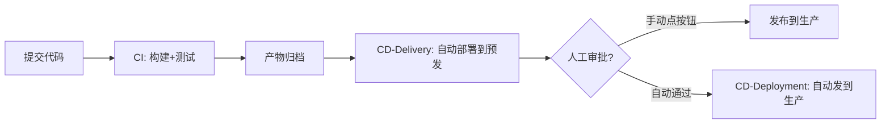

:::info 作者

novlan1

2026.06.10

:::

## CI 和 CD 的区别

`2026-06-10`

## 一、字面定义

| 缩写 | 全称 | 中文 |
|---|---|---|
| **CI** | Continuous Integration | 持续集成 |
| **CD** | Continuous Delivery / Continuous Deployment | 持续交付 / 持续部署 |

注意 CD 有**两个含义**，很多人混淆就在这里。

---

## 二、各自负责什么

### CI（持续集成）—— 解决"代码合得进去吗？"
开发者每次提交代码后，**自动**完成：

```
拉代码 → 安装依赖 → Lint → 单元测试 → 构建产物
```

目标：**尽早发现集成冲突和质量问题**，保证 main 分支随时是绿的。

### CD - Continuous Delivery（持续交付）—— 解决"代码随时能发吗？"
在 CI 基础上，**自动**把构建产物发布到**类生产环境**（预发/灰度/staging），并准备好可发布的制品。

> 关键：**最后上生产那一步是手动点按钮**（人为审批）。

### CD - Continuous Deployment（持续部署）—— 解决"代码自动上线"
比持续交付**更激进一步**：通过所有自动化测试后，**直接自动发到生产**，全程无人工干预。

---

## 三、流程对比图



三者关系：**CI ⊂ Continuous Delivery ⊂ Continuous Deployment**（后者包含前者）。

---

## 四、本质区别（核心）

| 维度 | CI | CD (Delivery) | CD (Deployment) |
|---|---|---|---|
| **关注点** | 代码**质量** | 发布**能力** | 发布**动作** |
| **解决的问题** | "合并不冲突、测试通过" | "随时可发布" | "随时已发布" |
| **产物终点** | 构建产物（artifact） | 预发/staging 环境 | 生产环境 |
| **人工干预** | 无 | **有**（决定何时上线） | 无 |
| **价值对象** | 开发团队 | 业务/产品决策 | 终端用户 |
| **失败的代价** | 重新提交即可 | 回滚 staging | **影响线上用户** |

### 一句话本质区别
- **CI 关心"代码能不能被信任"**（质量门禁）
- **CD 关心"产品能不能被交付"**（部署管道）

CI 是**面向代码**的工程实践，CD 是**面向价值流**的业务实践。CI 让你"敢合代码"，CD 让你"敢发版本"。

---

## 五、结合你项目的实例

看你 `bk` 目录里的脚本就是典型 CI/CD 流水线拆分：

| 文件 | 阶段 | 类型 |
|---|---|---|
| `bk/12.npm-publish/3.auditor.js`（审核） | 代码合并前检查 | **CI** |
| `bk/12.npm-publish/4.check-audit.js` | 测试 / 构建 | **CI** |
| `bk/4.cos-all-in-one/5.upload-to-cos.js`（上传 CDN） | 产物分发到 CDN | **CD** |
| `bk/3.gray-publish/*`（灰度发布） | 灰度上线、人工确认 | **CD-Delivery** |
| `bk/1.all-in-one-publish.backend/*`（k8s 镜像构建+部署） | 自动部署到 BCS | **CD-Deployment** |
| `bk/14.HoK 商户赛部署`（用 BCS 模板发布） | 部署生产环境 | **CD** |

可以看到：CI 主要是 lint/test/build/audit；CD 是 cos 上传、镜像 push、bcs 滚动更新这些"动产物"的事情。

---

## 六、容易混淆的点

1. **"自动化 ≠ CI/CD"**：写个脚本一键发布只是自动化，**频率高 + 触发自动 + 有质量门禁**才叫 CI/CD。
2. **CI 不是测试**：CI 包含测试，但本质是**集成**——多人代码频繁合到主干。
3. **没有 CI 就谈 CD 是耍流氓**：CD 必须建立在可靠的 CI 之上，否则只是把 bug 更快地推给用户。
4. **DevOps ≠ CI/CD**：CI/CD 是 DevOps 的**工程实践之一**，DevOps 还包括监控、IaC、协作文化等。

---

如果只让我用一句话总结：

> **CI 是把代码持续地"集成进主干"，CD 是把主干持续地"交付给用户"。前者保证写得对，后者保证发得快。**

## 找到环的入口节点 这个不理解，为什么 fast 是 a+b+b+c

`2026-06-10`

## 图解 fast 走过的路径

先看链表结构：

```
head ——→ ... ——→ 入口 ——→ ... ——→ 相遇点 ——→ ... ——→ (回到入口)
|←———— a ————→|←—— b ——→|←———— c ————→|
```

- `a`：head 到环入口的距离
- `b`：环入口到相遇点的距离
- `c`：相遇点再走回环入口的距离
- 环长 = `b + c`

## slow 走过的路径

slow 进入环后，**还没走完一圈就会被 fast 追上**（上面证明过），所以：

> slow 走的距离 = `a + b`

## fast 走过的路径

fast 在 slow 进入环之前，**已经在环里转了若干圈**。关键点：

- fast 也走了 `a` 步到达入口
- 然后在环里转，到相遇时 fast 走过的环内距离是 `b + n圈`

取最简情况 n=1（fast 比 slow 多走了恰好一圈环）：

> fast 走的距离 = `a + b + (b + c)` = `a + 2b + c`

其中 `(b + c)` 就是多走的那一整圈环。

## 为什么是多走一圈？

因为 fast 速度是 slow 的 2 倍：

```
fast的距离 = 2 × slow的距离
a + 2b + c = 2(a + b)
```

解方程：

```
a + 2b + c = 2a + 2b
        c = a        ← 关键结论！
```

## 更严谨地说

如果 fast 多走了 n 圈（n ≥ 1）：

```
fast = a + b + n(b + c)
2(a + b) = a + b + n(b + c)
a + b = n(b + c)
a = n(b + c) - b = (n-1)(b+c) + c
```

即 `a = (n-1)圈 + c`。

所以从 head 走 `a` 步 = 从相遇点走 `c` 步 + 转 `(n-1)` 整圈，**最终都停在环入口**。这就是为什么让两个指针分别从 head 和相遇点出发、各走一步，一定在入口相遇。

## 一句话总结

`a + 2b + c` 的含义是：**走 a 步到入口 → 走 b 步到相遇点 → 继续走完环剩下的 c 步回到入口 → 再走 b 步到相遇点**，即 fast 在环里多绕了一圈才和 slow 碰上。

## lengthOfLIS2 详解——贪心 + 二分

`2026-06-10`

### 核心思想

我们维护一个辅助数组 `tails`，其中 **`tails[i]` 表示：所有长度为 `i+1` 的递增子序列中，末尾元素的最小值**。

为什么要"最小末尾"？因为末尾越小，后面能接上更大元素的机会就越大——这就是**贪心**策略。

### `tails` 数组的关键性质

`tails` 始终是**严格递增**的。原因直觉上很好理解：更长的递增子序列，其末尾一定比更短的那个大。

### 算法流程

遍历 `nums` 中的每个 `num`，做一件事：**在 `tails` 里二分查找第一个 ≥ num 的位置 `l`**，然后 `tails[l] = num`。

这会产生两种情况：

| 情况 | 含义 |
|------|------|
| `l === tails.length` | `num` 比 `tails` 所有元素都大，追加到末尾，**LIS 长度 +1** |
| `l < tails.length` | 替换 `tails[l]`，让长度为 `l+1` 的子序列末尾变得更小（贪心优化），LIS 长度不变 |

### 用示例走一遍 `[10, 9, 2, 5, 3, 7, 101, 18]`

| 步骤 | num | 二分找到位置 l | 操作 | tails 状态 |
|------|-----|---------------|------|-----------|
| 1 | 10 | 0（空数组） | 追加 | `[10]` |
| 2 | 9 | 0（9 < 10，替换） | 替换 | `[9]` |
| 3 | 2 | 0（2 < 9，替换） | 替换 | `[2]` |
| 4 | 5 | 1（5 > 2，追加） | 追加 | `[2, 5]` |
| 5 | 3 | 1（3 < 5，替换） | 替换 | `[2, 3]` |
| 6 | 7 | 2（7 > 3，追加） | 追加 | `[2, 3, 7]` |
| 7 | 101 | 3（101 > 7，追加） | 追加 | `[2, 3, 7, 101]` |
| 8 | 18 | 3（18 < 101，替换） | 替换 | `[2, 3, 7, 18]` |

最终 `tails.length = 4`，即 LIS 长度为 4。

### 二分部分逐行解释

```42:55:leetcode/05-dp/09-longest-increasing-subsequence.js
function lengthOfLIS2(nums) {
  const tails = [];
  for (const num of nums) {
    let l = 0;
    let r = tails.length;       // 右边界是开区间
    while (l < r) {
      const m = (l + r) >> 1;   // 取中点
      if (tails[m] < num) l = m + 1;  // mid 太小，往右找
      else r = m;               // mid >= num，收缩右边界
    }
    tails[l] = num;             // l 就是第一个 >= num 的位置
  }
  return tails.length;
}
```

这是标准的**左边界二分**（lower_bound）：找到 `tails` 中第一个 ≥ `num` 的下标。

### 注意点

- `tails` **不是**真正的 LIS 序列（只保证长度正确，元素可能被替换过）。
- 时间复杂度 **O(n log n)**：外层遍历 O(n)，内层二分 O(log n)。
- 空间复杂度 **O(n)**：`tails` 最长和 `nums` 等长。

## JS 中的 >> 1

`2026-06-10`

`>> 1` 是**位运算右移 1 位**，等价于 **除以 2 并向下取整**（即 `Math.floor(x / 2)`）。

### 在代码中的作用

```49:49:leetcode/05-dp/09-longest-increasing-subsequence.js
const m = (l + r) >> 1;
```

这里就是计算二分查找的**中间下标**：`m = Math.floor((l + r) / 2)`。

### 为什么用 `>> 1` 而不是 `/ 2`？

1. **性能微优**：位运算比除法快（现代引擎差异极小，更多是习惯写法）
2. **自动取整**：`>> 1` 天然丢弃小数位，不需要额外调用 `Math.floor()`
3. **避免浮点**：`/ 2` 在 JS 中返回浮点数（如 `7 / 2 = 3.5`），而 `>> 1` 直接得到整数 `3`

### 几个例子

| 表达式 | 二进制过程 | 结果 |
|--------|-----------|------|
| `6 >> 1` | `110` → `011` | 3 |
| `7 >> 1` | `111` → `011` | 3（向下取整） |
| `10 >> 1` | `1010` → `0101` | 5 |

**总结**：`(l + r) >> 1` 就是取 `l` 和 `r` 的中点，是二分查找的标准写法。

## 二叉树遍历

`2026-06-10`

前序：根→左→右（用于复制树、序列化）
中序：左→根→右（BST 中输出有序序列）
后序：左→右→根（用于删除树、计算表达式）

## 子集和全排列的关键区别

`2026-06-10`


- 全排列：每层都从 0 遍历，用 used 标记避免重选同一个元素
- 子集：通过 start 参数只往后选，保证 [1,2] 和 [2,1] 不会重复出现，且每进入一次函数就收集结果（因为任何长度都是合法子集）

## searchLeftBound， 每次优先从左边判断，就会拿最左边的数字，这句话对吗

`2026-06-10`


这句注释**不太准确**，容易产生误导。

`searchLeftBound` 能找到最左边的 target，**核心原因不是"优先从左边判断"**，而是：

**当 `nums[mid] >= target` 时，不立即返回，而是收缩右边界 `right = mid`，继续往左搜索。**

具体来说：
- `nums[mid] < target` → `left = mid + 1`（排除 mid，往右找）
- `nums[mid] >= target` → `right = mid`（mid 可能是答案，但不排除左边还有更早的，所以继续往左逼近）

这个"找到了也不停，继续往左压缩"的行为，才是它能拿到**最左边那个 target** 的原因。

对比 `searchRightBound`，它把条件分界改为 `nums[mid] <= target` → `left = mid + 1`，即找到了也不停、继续往右压缩，所以拿到的是最右边。

建议把那行注释改为更准确的描述：
总结一下：

| 说法 | 正确性 |
|------|--------|
| "优先从左边判断" → 拿最左边 | ❌ 不准确 |
| 找到 `>=target` 时不停，继续收缩右边界往左逼近 → 拿最左边 | ✅ 正确 |

关键区别在于 **`else { right = mid }` 这一步**——它让算法在"可能已经找到答案"时仍然不停下来，继续向左压缩搜索区间，直到区间为空，此时 `left` 就是第一个 `>= target` 的位置。
