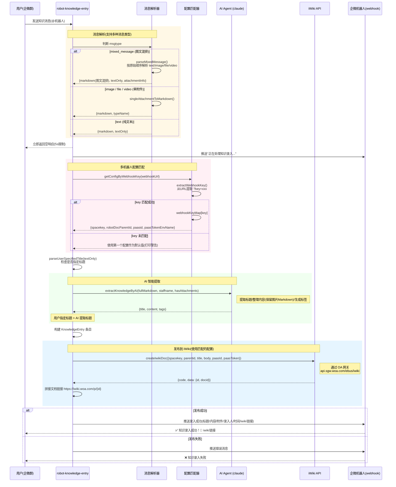
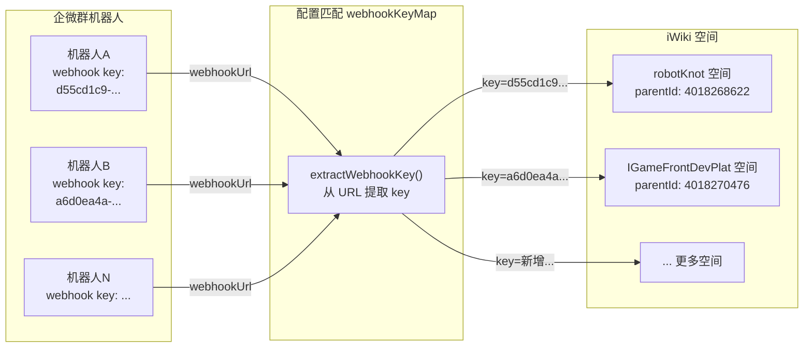

流程说明

1. **接收消息** → 用户在企微群中 @机器人 发送碎片化知识
2. **立即响应** → 先返回空响应满足企微 5s 限制，同时推送"正在处理"提示
3. **标题解析** → `parseUserSpecifiedTitle()` 检查用户是否用 `标题：xxx` 等格式指定了标题
4. **AI 提取** → 调用 `@tencent-ai/agent-sdk` 的 `query` 方法，让 AI 提取标题、整理内容、生成标签
5. **标题优先级** → 用户显式指定的标题 > AI 自动提取的标题
6. **发布到 iWiki**（蓝色高亮区域）：
   - 调用 `createIwikiDoc` API，通过 OA 网关 `api.sgw.woa.com/ebus/iwiki` 创建文档
   - 指定 `spacekey: 'robotKnot'`、`parentid` 父文档 ID、`bodymode: 'md'`
   - 获取返回的文档 `id`，拼接出 `https://iwiki.woa.com/p/{id}` 链接
7. **回复用户** → 通过 webhook 推送录入成功消息，包含标题、内容、录入人、时间和 **iwiki 文档链接**

多机器人配置映射关系

