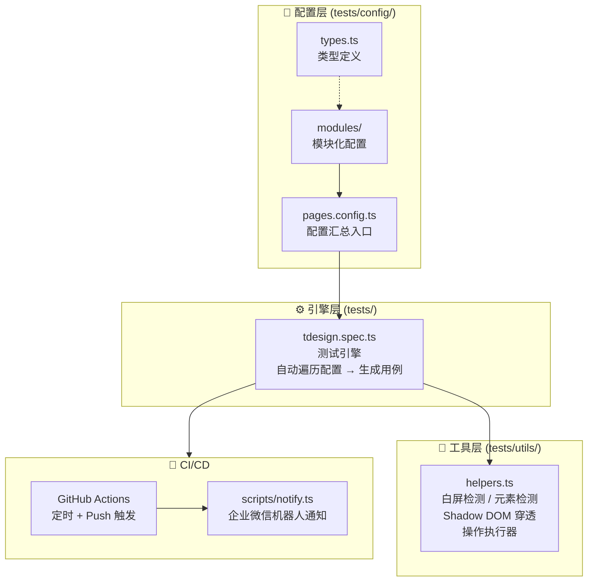
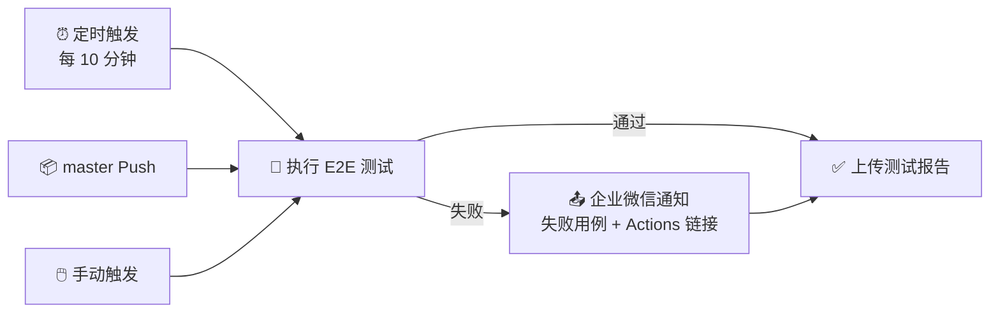

<!-- # TDesign E2E —— 一套配置驱动、可扩展的端到端测试框架 -->

## 一、项目背景

[TDesign](https://tdesign.tencent.com/) 是腾讯开源的企业级设计体系，覆盖了 Vue Next、UniApp、小程序、Mobile Vue 等多个技术栈，其官网承载着大量组件文档页面。随着站点规模增长，一个核心风险始终存在——**页面发布后白屏**或**关键元素丢失**。手工巡检不现实，传统的单元测试又覆盖不到真实浏览器的渲染链路。

[tdesign-e2e-test](https://github.com/TDesignOteam/tdesign-e2e-test) 正是为解决这一问题而设计的：基于 **Puppeteer + Jest**，通过 **纯配置驱动** 的方式，让开发者只需编写 JSON 风格的配置对象，即可自动生成完整的 E2E 测试用例，**零测试代码编写**。

---

## 二、整体架构

项目采用 **"配置层 → 引擎层 → 工具层"** 三层架构，各层职责清晰、互不耦合：



### 2.1 配置层：声明式描述"测什么"

配置层是用户唯一需要关注的部分。核心类型 `PageConfig` 定义了一个测试用例的完整描述：

```typescript
interface PageConfig {
  name: string;                // 用例名称
  url: string;                 // 目标页面
  whiteScreenCheck?: boolean;  // 是否白屏检测
  expectedSelectors?: string[];// 期望存在的元素
  actions?: PageAction[];      // 操作序列（点击/悬浮/导航/滚动/输入）
  afterActionCheck?: AfterActionCheck; // 操作后校验
  viewport?: { width; height };// 自定义视口
  skip?: boolean;              // 跳过标记
}
```

使用者只需填写配置对象，**不需要编写任何 `test()`、`expect()` 代码**。框架会自动将每条配置映射为一个独立的 Jest 测试用例。

### 2.2 引擎层：自动化遍历 + 用例生成

`tdesign.spec.ts` 是整个框架的"心脏"，核心逻辑仅约 120 行，但完成了以下工作：

1. **启动浏览器**：`beforeAll` 中初始化 Puppeteer，CI 环境自动切换 headless 模式
2. **遍历配置、生成用例**：`for (const pageConfig of pagesConfig)` 循环，为每条配置动态生成 `test()`
3. **标准化测试流程**：每个用例按统一管线执行——设置视口 → 注册错误收集 → 访问页面 → 等待网络空闲 → 白屏检测 → 元素检测 → 执行操作 → 操作后校验
4. **资源管理**：每个用例独立开启/关闭 Page，`afterAll` 中关闭浏览器，杜绝内存泄漏

这种设计让引擎层成为"不可变的骨架"——**新增测试用例永远不需要修改引擎代码**。

### 2.3 工具层：对抗 Web Components 的深度穿透

TDesign 官网大量使用了 Web Components + Shadow DOM（如 `<td-header>`、`<td-doc-layout>`），传统的 `document.querySelector` 无法穿透 Shadow DOM 边界。

`helpers.ts` 中实现了一套 **递归穿透 Shadow DOM 的选择器引擎**，这是整个项目最有技术含量的部分：

```
deepQuerySelector(page, selector)
│
├── 普通选择器 ".TDesign-header"
│   └── 递归遍历所有 ShadowRoot + Slot 分发内容
│
└── 穿透组合选择器 "td-header >>> .TDesign-header-nav"
    └── 按 ">>>" 分段，逐层进入 Shadow DOM
```

此外，`waitForVisible()` 实现了轮询等待机制，不仅检查元素存在，还验证其真实可见性（`getBoundingClientRect` + `getComputedStyle`），避免 `display:none` 或零尺寸元素的误判。

**白屏检测** 采用 4 层递进策略：

| 层级 | 检测项 | 目的 |
|------|--------|------|
| 1 | `body.children.length > 0` | 排除完全空白页 |
| 2 | `body.innerHTML.length > 50` | 排除仅有空标签壳 |
| 3 | 递归穿透 Shadow DOM 找可见内容 | 排除 Web Components 内部白屏 |
| 4 | 检查 SPA 根挂载点 + 自定义元素 | 排除框架未挂载 |

四层策略相互补充，既能检测传统 SPA 白屏，也能覆盖 Web Components 场景。

---

## 三、灵活的配置方式

### 3.1 五种操作类型覆盖主流交互

框架内置了 5 种操作类型，通过组合使用可以模拟几乎所有用户交互场景：

| 类型 | 用途 | 关键参数 |
|------|------|----------|
| `click` | 点击元素，支持自动等待导航 | `selector` |
| `hover` | 鼠标悬浮，验证浮层/下拉菜单 | `selector` |
| `navigate` | SPA 路由跳转 | `targetUrl` |
| `scroll` | 页面滚动，测试懒加载 | `scrollY` |
| `input` | 文本输入，测试搜索/表单 | `selector` + `inputValue` |

操作支持 `waitBefore` / `waitAfter` 精细控制时序，也支持链式组合——先滚动、再点击、再输入，一气呵成。

### 3.2 Shadow DOM 穿透选择器

针对 Web Components，框架设计了直观的 `>>>` 穿透语法：

```typescript
// 先找到 <td-header>，进入其 Shadow DOM，再找 .TDesign-header-nav
selector: 'td-header >>> .TDesign-header-nav'
```

普通选择器则自动递归穿透所有层级的 Shadow DOM，开发者无需关心元素在哪一层。

### 3.3 操作后校验

每条配置可以附带 `afterActionCheck`，在操作执行后自动验证：

- **白屏检测**：操作后页面是否正常渲染
- **元素检测**：操作后目标元素是否出现
- **URL 校验**：通过正则匹配验证跳转是否正确

---

## 四、可扩展性设计

### 4.1 模块化拆分

配置按 TDesign 子站拆分为独立模块，存放在 `tests/config/modules/` 目录下：

```
modules/
├── index.ts           ← 统一导出
├── home.ts            ← 官网首页
├── uniapp.ts          ← UniApp
├── miniprogram.ts     ← 小程序
├── vue-next.ts        ← Vue Next (桌面端)
└── mobile-vue.ts      ← Mobile Vue (移动端)
```

`pages.config.ts` 作为汇总入口，通过展开运算符合并所有模块：

```typescript
const config: PageConfig[] = [
  ...homePages,
  ...uniappPages,
  ...miniprogramPages,
  ...vueNextPages,
  ...mobileVuePages,
];
```

### 4.2 新增模块只需 3 步

以新增 React 模块为例：

1. **创建** `modules/react.ts`，导出 `PageConfig[]` 数组
2. **注册** 在 `modules/index.ts` 中添加一行 `export`
3. **合并** 在 `pages.config.ts` 中展开 `...reactPages`

整个过程不需要修改引擎代码、不需要新建测试文件、不需要改动 CI 配置。

### 4.3 新增操作类型

如果未来需要支持新的交互（如拖拽、长按），只需：

1. 在 `PageAction.type` 联合类型中新增枚举值
2. 在 `helpers.ts` 的 `executeActions` 中新增 `case` 分支

引擎层和配置层完全不受影响，体现了 **开闭原则（OCP）**。

---

## 五、易维护性

### 5.1 TypeScript 全链路类型安全

从配置定义到引擎消费，全程 TypeScript 强类型。`PageConfig` 接口确保：

- 拼错字段名 → 编译报错
- 遗漏必填字段 → 编译报错
- `action.type` 传入未知值 → 编译报错

类型系统充当了"活文档"，开发者阅读接口定义即可理解所有配置项。

### 5.2 配置与代码完全解耦

这是项目最核心的设计理念：**测试逻辑是稳定的框架代码，测试内容是可变的配置数据**。

- 新增页面？→ 只改配置
- 页面改版？→ 只改选择器
- 新增检测维度？→ 只改工具函数

三个变更方向互不干扰，团队中不同角色可以并行工作。

### 5.3 自动化 CI/CD + 告警闭环

项目集成了 [GitHub Actions 工作流](/Users/guowangyang/Documents/github/tdesign-e2e/.github/workflows/e2e-test.yml)，实现了完整的自动化闭环：



`notify.ts` 通知脚本会自动解析 Jest JSON 输出，提取失败用例的名称和错误信息，格式化为 Markdown 消息推送到企业微信，包含直达 Actions 日志的链接。

### 5.4 容错设计

框架在多处做了容错处理，保证单个用例失败不会拖垮整个测试：

- `networkIdle` 超时不阻塞测试（`.catch(() => {})`）
- 导航超时静默处理（适应 SPA 无导航场景）
- 每个用例独立开启/关闭 Page，`finally` 块确保资源释放
- 控制台错误仅记录告警，不直接判定失败
- `skip` 标记支持临时跳过不稳定用例

---

## 六、技术亮点总结

| 亮点 | 说明 |
|------|------|
| **配置驱动，零代码测试** | 使用者只写配置对象，框架自动生成测试用例 |
| **Shadow DOM 深度穿透** | 递归遍历 + `>>>` 穿透语法，完美适配 Web Components |
| **4 层白屏检测策略** | DOM 结构 + 内容长度 + 可见性 + SPA 挂载点，多维度交叉验证 |
| **模块化配置架构** | 按子站拆分，新增模块 3 步完成，零耦合 |
| **全链路 TypeScript** | 配置到执行全程类型安全，拼错即报错 |
| **自动化告警闭环** | 定时巡检 → 失败检测 → 企业微信推送 → Actions 日志溯源 |
| **容错隔离设计** | 单用例失败不扩散，资源自动回收，超时静默降级 |

---

## 七、适用场景

- **组件库官网巡检**：防止发布后白屏、关键文档元素丢失
- **多框架站点监控**：一套框架覆盖 Vue / UniApp / 小程序 / 移动端等所有子站
- **Web Components 场景**：内置 Shadow DOM 穿透，开箱即用
- **团队协作**：配置与代码分离，产品/QA 也能编写测试配置

这套框架的设计哲学是：**把测试的复杂性封装进框架，把测试的简单性交还给用户**。开发者只需要回答"测哪个页面、检查什么元素、执行什么操作"，剩下的一切——浏览器管理、Shadow DOM 穿透、白屏判定、CI 调度、失败告警——全部由框架接管。
