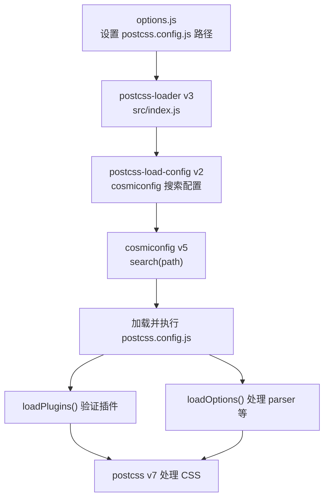
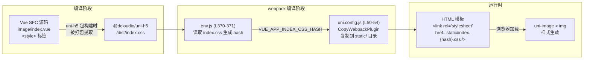
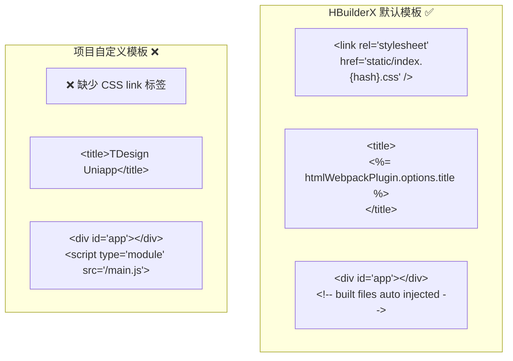
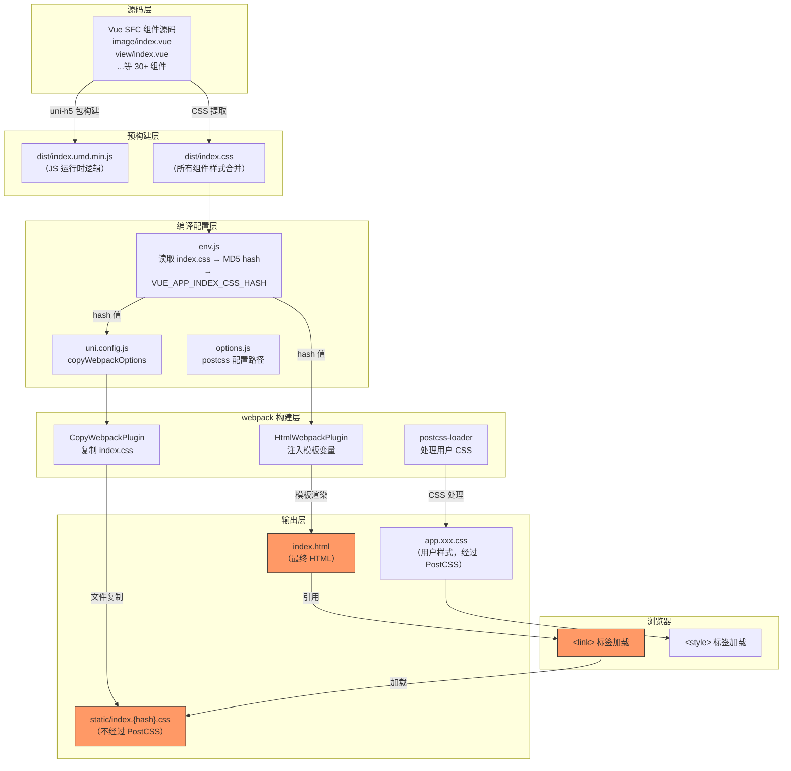
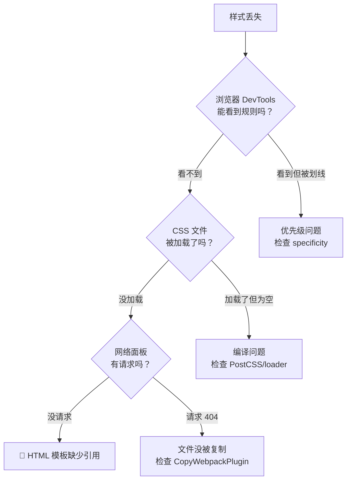
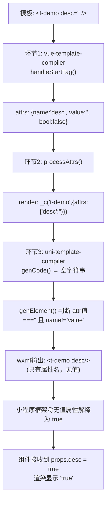

## 1. 从源码追踪 uni-app H5 平台 `uni-image > img` 样式丢失问题

### 1.1. 问题描述

在 HBuilderX Vue2 项目中，为了适配 TDesign 组件库（Vue3 → Vue2），我们在项目根目录创建了自定义的 `postcss.config.js`，添加了 `:deep()` → `::v-deep` 转换和 `rpx` → `px` 转换等自定义 PostCSS 插件。

结果发现：**H5 平台下 `uni-image > img` 等 uni-app 内置组件的默认样式完全消失了**。在浏览器开发者工具中完全找不到这条 CSS 规则。

### 1.2. 错误的排查方向：PostCSS 配置链路

#### 1.2.1. 第一个假设：缺少默认插件

最初的分析认为问题出在 `postcss.config.js` 缺少了 HBuilderX 默认的 `postcss-comment`、`postcss-import`、`autoprefixer` 插件。

HBuilderX 内置的默认配置（位于 `/Applications/HBuilderX.app/Contents/HBuilderX/plugins/uniapp-cli/postcss.config.js`）：

```js
const path = require('path')
module.exports = {
    parser: require('postcss-comment'),
    plugins: [
        require('postcss-import')({ resolve(id, basedir, importOptions) { ... } }),
        require('autoprefixer')({ remove: process.env.UNI_PLATFORM !== 'h5' }),
        require('@dcloudio/vue-cli-plugin-uni/packages/postcss')
    ]
}
```

于是补回了这三个插件。**但问题没有解决。**

#### 1.2.2. 第二个假设：`requireFromCli` 加载失败

因为项目的 `postcss.config.js` 位于项目目录而非 HBuilderX 的 `uniapp-cli/` 目录，直接 `require('postcss-comment')` 会找不到包。于是写了 `requireFromCli` 利用 `UNI_CLI_CONTEXT` 环境变量来从 HBuilderX 的 `node_modules` 中加载：

```js
function requireFromCli(id) {
  const cliContext = process.env.UNI_CLI_CONTEXT;
  if (cliContext) {
    try {
      return require(require.resolve(id, { paths: [cliContext] }));
    } catch (e) { /* fallback */ }
  }
  return require(id);
}
```

验证确认三个包都能正确 resolve。**但问题仍然没有解决。**

#### 1.2.3. 深入 PostCSS 配置加载链路

随后对整个配置加载链路进行了逐层源码分析：



具体分析了以下源码文件：

以下所有路径的公共前缀为 `/Applications/HBuilderX.app/Contents/HBuilderX/plugins/uniapp-cli/node_modules/`（简记为 `$CLI_MODULES/`）：

| 文件路径 | 作用 |
|---|---|
| `$CLI_MODULES/@dcloudio/vue-cli-plugin-uni/lib/options.js` (L99-107) | 决定使用用户还是默认的 postcss 配置 |
| `$CLI_MODULES/postcss-loader/src/index.js` (L67-77) | 从 options 中读取 config.path 传给 postcss-load-config |
| `$CLI_MODULES/postcss-load-config/src/index.js` (L82-86) | 调用 cosmiconfig.search(path) 搜索配置文件 |
| `$CLI_MODULES/postcss-load-config/src/plugins.js` | loadPlugins 验证插件数组 |
| `$CLI_MODULES/postcss-load-config/src/options.js` | loadOptions 处理 parser 等选项 |
| `$CLI_MODULES/cosmiconfig/dist/createExplorer.js` (L76) | getDirectory 将文件路径转为目录路径后搜索 |
| `$CLI_MODULES/@dcloudio/vue-cli-plugin-uni/packages/postcss/index.js` | uni-app 核心 PostCSS 插件（标签转换 + rpx 转换）|

**结论：整个 PostCSS 配置加载链路完全正常，没有任何逻辑错误。**

#### 1.2.4. 排除自定义插件干扰

- `deepSelectorPlugin`：只处理包含 `:deep(`、`::v-deep(`、`:slotted(`、`:global(` 的选择器，`uni-image > img` 不包含这些，**不受影响**
- `rpxToPxPlugin`：只处理值中包含 `rpx` 的声明，`uni-image > img` 的样式值是 `px` 和 `0`，**不受影响**
- `postcss-uniapp-plugin`：H5 下将 `image` → `uni-image` 转换，但有前缀检查 `tag.value.substring(0, 4) !== 'uni-'` 不会重复转换，**不受影响**

### 1.3. 真正的根因：HTML 模板缺少 CSS 引入

#### 1.3.1. 关键发现：uni-app H5 样式不走 PostCSS 流程

经过反复排查无果后，思路转向：**`uni-image > img` 的样式到底是通过什么途径加载到浏览器的？**

追踪源码发现了 uni-app H5 平台的组件样式加载链路：



**这个过程完全不经过 PostCSS 流程！** 是通过 `CopyWebpackPlugin` 直接文件复制 + HTML `<link>` 标签引入的静态 CSS。

#### 1.3.2. 源码追踪详解

Step 1：样式的源头

`uni-image > img` 的样式定义在 Vue SFC 源码中：

**文件**：`/Applications/HBuilderX.app/Contents/HBuilderX/plugins/uniapp-cli/node_modules/@dcloudio/uni-h5/src/core/view/components/image/index.vue`

```css
/* <style> 标签（非 scoped） */
uni-image>img {
  -webkit-touch-callout: none;
  -webkit-user-select: none;
  -moz-user-select: none;
  display: block;
  position: absolute;
  top: 0;
  left: 0;
  width: 100%;
  height: 100%;
  opacity: 0;
}
```

但 `@dcloudio/uni-h5` 的 `package.json` 中 `main` 字段指向 `dist/index.umd.min.js`，也就是说 **webpack 加载的是预编译好的 UMD 包，而非 Vue SFC 源码**。CSS 被单独提取到了 `dist/index.css` 中。

 Step 2：CSS hash 生成

**文件**：`/Applications/HBuilderX.app/Contents/HBuilderX/plugins/uniapp-cli/node_modules/@dcloudio/vue-cli-plugin-uni/lib/env.js`（L370-371）

```js
const indexCssBuffer = fs.readFileSync(
  require.resolve('@dcloudio/uni-h5/dist/index.css')
)
process.env.VUE_APP_INDEX_CSS_HASH = loaderUtils.getHashDigest(
  indexCssBuffer, 'md5', 'hex', 8
)
```

读取 `dist/index.css` 文件内容，计算 MD5 hash，设置为环境变量 `VUE_APP_INDEX_CSS_HASH`。

Step 3：CopyWebpackPlugin 复制 CSS

**文件**：`/Applications/HBuilderX.app/Contents/HBuilderX/plugins/uniapp-cli/node_modules/@dcloudio/uni-h5/lib/h5/uni.config.js`（L50-54）

```js
copyWebpackOptions(platformOptions, vueOptions) {
  const copyOptions = [
    {
      from: require.resolve('@dcloudio/uni-h5/dist/index.css'),
      to: getIndexCssPath(vueOptions.assetsDir, platformOptions.template,
        'VUE_APP_INDEX_CSS_HASH'),
      transform(content) {
        return transform(content, platformOptions)
      }
    },
    'hybrid/html'
  ]
}
```

其中 `getIndexCssPath` 函数（L28-42）会检查 HTML 模板中是否包含 `VUE_APP_INDEX_CSS_HASH` 关键字，据此决定输出路径：

```js
function getIndexCssPath(assetsDir, template, hashKey) {
  const VUE_APP_INDEX_CSS_HASH = process.env[hashKey]
  if (VUE_APP_INDEX_CSS_HASH) {
    const templateContent = fs.readFileSync(getTemplatePath(template))
    if (new RegExp('\\b' + hashKey + '\\b').test(templateContent)) {
      return path.join(assetsDir,
        `[name].${VUE_APP_INDEX_CSS_HASH}.[ext]`)
    }
  }
  return assetsDir  // fallback：不带 hash
}
```

Step 4：HTML 模板引入 CSS

**文件**：`/Applications/HBuilderX.app/Contents/HBuilderX/plugins/uniapp-cli/public/index.html`（HBuilderX 默认模板）

```html
<link rel="stylesheet" href="<%= BASE_URL %>static/index.<%= VUE_APP_INDEX_CSS_HASH %>.css" />
```

这行 `<link>` 标签就是浏览器加载 `uni-image > img` 等所有内置组件样式的入口。

Step 5：模板选择逻辑

**文件**：`/Applications/HBuilderX.app/Contents/HBuilderX/plugins/uniapp-cli/node_modules/@dcloudio/uni-h5/lib/h5/uni.config.js`（L4-10）

```js
function getTemplatePath(template) {
  if (template) {
    const userTemplate = path.resolve(process.env.UNI_INPUT_DIR, template)
    if (fs.existsSync(userTemplate)) { return userTemplate }
  }
  return path.resolve(process.env.UNI_CLI_CONTEXT, 'public/index.html')
}
```

如果 `manifest.json` 中配置了 `h5.template`，就使用用户自定义模板；否则使用 HBuilderX 默认模板。

#### 1.3.3. 根因定位

项目的 `manifest.json`（L60-65）中配置了：

```json
"h5": {
    "template": "./index.html",
    "router": {
      "base": "./"
    }
}
```

指向项目根目录的自定义 `index.html`。对比两个模板：



**项目的自定义模板完全缺少了关键的一行**：

```html
<link rel="stylesheet" href="<%= BASE_URL %>static/index.<%= VUE_APP_INDEX_CSS_HASH %>.css" />
```

而且这个模板看起来是从 Vite/Vue3 项目复制过来的（`<script type="module" src="/main.js">`），而 HBuilderX Vue2 项目使用的是 webpack（应该用 `htmlWebpackPlugin`）。

### 1.4. 完整的 H5 样式加载架构



**关键路径**（红色标注）：`dist/index.css` → `CopyWebpackPlugin` → `static/index.{hash}.css` → HTML `<link>` 标签 → 浏览器加载

这条路径**完全绕过了 PostCSS 处理流程**，所以无论怎么改 `postcss.config.js` 都不会影响这些样式是否加载。

#### 1.4.1. 附：文章涉及的所有源码文件完整路径

以 HBuilderX 安装目录 `/Applications/HBuilderX.app/Contents/HBuilderX/` 为根：

```
plugins/uniapp-cli/
├── postcss.config.js                          ← HBuilderX 默认 PostCSS 配置
├── public/
│   └── index.html                             ← HBuilderX 默认 HTML 模板（包含关键 <link> 标签）
└── node_modules/@dcloudio/
    ├── vue-cli-plugin-uni/
    │   ├── lib/
    │   │   ├── env.js                         ← 环境变量设置（L370: VUE_APP_INDEX_CSS_HASH 生成）
    │   │   └── options.js                     ← PostCSS 配置路径选择（L99-107）
    │   └── packages/
    │       └── postcss/
    │           └── index.js                   ← uni-app 核心 PostCSS 插件（标签转换）
    └── uni-h5/
        ├── dist/
        │   └── index.css                      ← 预编译的组件样式合集
        ├── lib/h5/
        │   └── uni.config.js                  ← CopyWebpackPlugin 配置（复制 CSS 到 static/）
        └── src/core/view/components/image/
            └── index.vue                      ← uni-image > img 样式源头（L239）
```

### 1.5. 修复方案

在项目的 `index.html` 的 `<head>` 中补上缺失的 `<link>` 标签：

```html
<link rel="stylesheet" href="<%= BASE_URL %>static/index.<%= VUE_APP_INDEX_CSS_HASH %>.css" />
```

### 1.6. 经验总结

#### 1.6.1. 不要想当然地假设 CSS 来源

uni-app H5 的组件样式存在**两条完全独立的 CSS 加载路径**：

| 路径 | 来源 | 是否经过 PostCSS | 引入方式 |
|---|---|---|---|
| **静态路径** | `@dcloudio/uni-h5/dist/index.css` | ❌ 不经过 | `CopyWebpackPlugin` + HTML `<link>` |
| **编译路径** | 用户 `.vue` 文件的 `<style>` | ✅ 经过 | webpack css-loader + postcss-loader → `<style>` 注入 |

`uni-image > img` 走的是**静态路径**，不受 PostCSS 配置影响。

#### 1.6.2. 自定义 HTML 模板的注意事项

当在 `manifest.json` 中设置 `h5.template` 使用自定义模板时，必须保留 HBuilderX 默认模板中的关键内容。最容易遗漏的就是这行 CSS 引入。

#### 1.6.3. debug 思路

当遇到"样式丢失"问题时，首先应该确认：



本次问题属于最底层的 **"HTML 模板缺少引用"**，在最上层的 PostCSS 配置上无论怎么调整都无济于事。

## 2. 组件 data 中不能放组件实例

这是 Vue 2 响应式系统的经典坑。`instances` 数组里存的是 **Vue 组件实例**（通过 `$refs` 获取的），每个组件实例上挂载了大量的响应式属性（`$data`、`$props`、`$watchers`、`_vnode`、`$children` 等等）。

### 2.1. 为什么放在 `data` 中会卡死

如果 `instances` 声明在 `data()` 中：

```js
data() {
  return {
    instances: [],  // ← 被 Vue 变成响应式
  };
}
```

当你 `this.instances.push(instance)` 时，Vue 2 会对 `instance`（整个组件实例）进行 **深度递归的响应式劫持**（`Object.defineProperty` 遍历所有属性）。而一个 Vue 组件实例的内部结构极其庞大且存在循环引用：

```
instance.$parent → message.vue
  → message.vue.$children → [instance]
    → instance.$parent → message.vue  ← 循环！
```

Vue 2 的 `Observer` 会尝试递归遍历这个巨大的对象树，导致：

1. **栈溢出 / 无限递归**：循环引用导致 `observe()` 无限深入
2. **巨量的 getter/setter 劫持**：即使不栈溢出，给组件实例上几千个属性都加上 `defineProperty` 也会导致极度卡顿
3. **任何对 instance 属性的修改都会触发依赖收集和派发更新**，进一步放大性能问题

### 2.2. 正确做法

原始代码中用的就是正确的方式——在 `created` 中声明为**非响应式属性**：

```js
created() {
  this.instances = [];  // ← 不经过 data()，不会被响应式劫持
},
```

这样 `this.instances` 只是组件实例上的一个普通 JavaScript 属性，`push` 组件实例进去不会触发任何响应式处理。

### 2.3. Vue 2 vs Vue 3

| | Vue 2 | Vue 3 |
|---|---|---|
| 响应式机制 | `Object.defineProperty` 递归遍历 | `Proxy` 惰性代理 |
| push 组件实例到 data | 🔴 深度递归劫持，卡死 | ⚠️ 也会代理，但有 `markRaw` 可用 |
| 解决方案 | 放在 `created` 或 `beforeCreate` 中直接赋值 | 使用 `markRaw()` 或 `shallowRef()` |

### 2.4. 小结

你当前代码中 [`created() { this.instances = [] }`](command:gongfeng.gongfeng-copilot.chat.open-symbol-in-file?%5B%7B%22%24mid%22%3A1%2C%22fsPath%22%3A%22%2FUsers%2Fguowangyang%2FDocuments%2Fgithub%2Ftdesign-uniapp-starter-vue2-cli%2Fsrc%2Fpages-more%2Fmessage%2Fbase%2Findex.vue%22%2C%22external%22%3A%22file%3A%2F%2F%2FUsers%2Fguowangyang%2FDocuments%2Fgithub%2Ftdesign-uniapp-starter-vue2-cli%2Fsrc%2Fpages-more%2Fmessage%2Fbase%2Findex.vue%22%2C%22path%22%3A%22%2FUsers%2Fguowangyang%2FDocuments%2Fgithub%2Ftdesign-uniapp-starter-vue2-cli%2Fsrc%2Fpages-more%2Fmessage%2Fbase%2Findex.vue%22%2C%22scheme%22%3A%22file%22%7D%2C%22created%28%29%20%7B%20this.instances%20%3D%20%5B%5D%20%7D%22%2C%5B%7B%22line%22%3A100%2C%22character%22%3A2%7D%2C%7B%22line%22%3A100%2C%22character%22%3A14%7D%5D%5D) 的写法是正确的，**千万不要**把 `instances` 移到 `data()` 中。凡是存储组件实例、DOM 元素、定时器 ID 等**不需要视图响应的大型对象**，都应该用这种方式声明。


## 3. 模板中使用到的变量需在 data 中声明

但由于 `innerIcon` 不在 `data()` 中，Vue2 的 `Object.defineProperty `没有对其进行 `getter/setter` 拦截。这意味着：

- `this.innerIcon = xxx` 不会触发响应式更新

- 小程序端的 `setData` 不会包含 `innerIcon` 的变化

- WXML 中 `{{innerIcon}}` 始终是上次 `setData` 传过去的值（可能是 `undefined`）


## 4. 小程序中传 `undefined` 的 props 不会回退到组件默认值

在 Vue2 UniApp 项目中使用组件库时，经常会遇到这样的写法：

```vue
<t-badge :max-count="badgeProps.maxCount || 99" />
```

直觉上，`|| 99` 似乎是多余的——组件 props 中已经定义了 `default: 99`，传 `undefined` 应该会自动使用默认值才对。但如果去掉这个兜底：

```vue
<t-badge :max-count="badgeProps.maxCount" />
```

在微信小程序中，`maxCount` 实际接收到的值是 `0`，而不是期望的 `99`。

这个问题的根因并不在 Vue2 本身，而是 **UniApp 微信小程序运行时中有一套独立的 props 处理逻辑**，它绕过了 Vue2 原生的默认值回退机制。

### 4.1. 标准 Vue2 的行为：正确回退默认值

Vue2 源码中的 [`validateProp`](https://github.com/vuejs/vue/blob/v2.6.14/src/core/util/props.js#L21-L62) 函数负责处理 props 的验证和默认值逻辑：

```js
// vue/src/core/util/props.js (Vue 2.6.14)
export function validateProp (key, propOptions, propsData, vm) {
  const prop = propOptions[key]
  const absent = !hasOwn(propsData, key)
  let value = propsData[key]
  // ...boolean casting...

  // ✅ 关键逻辑：value 为 undefined 时，调用 getPropDefaultValue 获取默认值
  if (value === undefined) {
    value = getPropDefaultValue(vm, prop, key)
    const prevShouldObserve = shouldObserve
    toggleObserving(true)
    observe(value)
    toggleObserving(prevShouldObserve)
  }
  return value
}
```

[`getPropDefaultValue`](https://github.com/vuejs/vue/blob/v2.6.14/src/core/util/props.js#L67-L93) 会正确地从组件的 props 定义中读取 `default` 值：

```js
function getPropDefaultValue (vm, prop, key) {
  if (!hasOwn(prop, 'default')) {
    return undefined
  }
  const def = prop.default
  // ...
  return typeof def === 'function' && getType(prop.type) !== 'Function'
    ? def.call(vm)
    : def
}
```

在 H5 端，这套逻辑正常工作。当 `badgeProps.maxCount` 为 `undefined` 时，`validateProp` 检测到 `value === undefined`，调用 `getPropDefaultValue` 返回 `99`。✅

### 4.2. UniApp 小程序运行时的行为：类型默认值覆盖了 props 默认值

问题出在 UniApp 的微信小程序运行时（`@dcloudio/uni-mp-weixin/dist/mp.js`）。它包含一套**独立于标准 Vue2 的** props 处理逻辑。

首先是一个按类型映射的默认值表：

```js
// @dcloudio/uni-mp-weixin/dist/mp.js
// https://github.com/dcloudio/uni-app/blob/v_4.65-vue2/packages/uni-mp-weixin/dist/mp.js#L566
const PROP_DEFAULT_VALUES = {
  [String]: '',
  [Number]: 0,       // ← Number 类型的默认值是 0，不是 Vue props 中定义的 default 值
  [Boolean]: false,
  [Object]: null,
  [Array]: [],
  [null]: null
};
```

然后是小程序端自己实现的 `validateProp`：

```js
// @dcloudio/uni-mp-weixin/dist/mp.js
// https://github.com/dcloudio/uni-app/blob/v_4.65-vue2/packages/uni-mp-weixin/dist/mp.js#L593
function validateProp (key, propsOptions, propsData, vm) {
  let value = propsData[key];
  if (value !== undefined) {
    // 值不为 undefined，走类型格式化
    const propOptions = propsOptions[key];
    const type = getType(propOptions);
    value = formatVal(value, type);
    // ...observer 逻辑...
    return value
  }
  // ❌ 值为 undefined 时，不是从 prop.default 取值，
  //    而是从 PROP_DEFAULT_VALUES 按类型取值
  return getPropertyVal(propsOptions[key])
}
```

`getPropertyVal` 最终调用 `getDefaultVal`，从 `PROP_DEFAULT_VALUES` 中按类型返回默认值：

```js
// @dcloudio/uni-mp-weixin/dist/mp.js
// https://github.com/dcloudio/uni-app/blob/v_4.65-vue2/packages/uni-mp-weixin/dist/mp.js#L575
function getDefaultVal (propType) {
  return PROP_DEFAULT_VALUES[propType]  // Number → 0
}

function getPropertyVal (options) {
  if (isPlainObject(options)) {
    if (hasOwn(options, 'value')) {
      return options.value
    }
    return getDefaultVal(options.type)  // 走到这里：type 为 Number → 返回 0
  }
  return getDefaultVal(options)
}
```

这是 `initProperties` 阶段的行为（组件初始化时调用）。但问题不止于此——在 `updateProperties` 阶段（父组件重新渲染时），还有第二重覆盖：

```js
// @dcloudio/uni-mp-weixin/dist/mp.js
// https://github.com/dcloudio/uni-app/blob/v_4.65-vue2/packages/uni-mp-weixin/dist/mp.js#L669
function updateProperties (vm) {
  const properties = vm.$options.mpOptions && vm.$options.mpOptions.properties;
  const propsData = vm.$options.propsData;
  if (propsData && properties) {
    Object.keys(properties).forEach(key => {
      if (hasOwn(propsData, key)) {
        // ❌ 直接用 formatVal 处理 propsData[key]
        //    不检查 undefined，不回退 default
        vm[key] = formatVal(propsData[key], getType(properties[key]));
      }
    });
  }
}
```

`formatVal` 对 Number 类型不做特殊处理，直接返回传入的值：

```js
// @dcloudio/uni-mp-weixin/dist/mp.js
// https://github.com/dcloudio/uni-app/blob/v_4.65-vue2/packages/uni-mp-weixin/dist/mp.js#L611
function formatVal (val, type) {
  if (type === Boolean) {
    return !!val     // undefined → false
  } else if (type === String) {
    return String(val)  // undefined → "undefined"
  }
  return val           // undefined → undefined（Number 类型走这里）
}
```

### 4.3. 完整的问题链路

以 TDesign 的 [tab-bar-item.vue](https://github.com/Tencent/tdesign-miniprogram/blob/develop/packages/uniapp-components/tab-bar-item/tab-bar-item.vue) 组件中的这段模板为例：

```vue
<t-badge
  :max-count="badgeProps.maxCount || 99"
  ...
/>
```

Badge 组件的 [props 定义](https://github.com/Tencent/tdesign-miniprogram/blob/develop/src/badge/props.ts)中 `maxCount` 的默认值是 `99`：

```js
maxCount: {
  type: Number,
  default: 99,
},
```

如果去掉 `|| 99`，写成 `:max-count="badgeProps.maxCount"`，当 `badgeProps` 对象上没有 `maxCount` 属性时：

| 阶段 | H5（标准 Vue2） | 小程序（UniApp mp 运行时） |
|------|----------------|--------------------------|
| 模板编译 | `propsData = { maxCount: undefined }` | 同左 |
| `validateProp` | `value === undefined` → 调用 `getPropDefaultValue` → 返回 **99** ✅ | `value === undefined` → 调用 `getPropertyVal` → `PROP_DEFAULT_VALUES[Number]` → 返回 **0** ❌ |
| 组件接收到的值 | `99` | `0` |

### 4.4. 为什么 `propsData` 中 key 存在但值是 `undefined`

有人可能会问：如果 `badgeProps.maxCount` 是 `undefined`，那 `propsData` 中应该不存在这个 key 才对？

实际上不是这样。模板 `:max-count="badgeProps.maxCount"` 编译后，会生成类似如下的渲染函数：

```js
createElement(TBadge, {
  props: {
    maxCount: badgeProps.maxCount  // key 存在，值为 undefined
  }
})
```

`hasOwn(propsData, 'maxCount')` 为 `true`，`propsData['maxCount']` 为 `undefined`。在标准 Vue2 的 `validateProp` 中，这种情况会被 `if (value === undefined)` 分支正确捕获。但在 UniApp 小程序运行时的 `updateProperties` 中，`hasOwn(propsData, key)` 为 `true` 后，直接执行了 `vm[key] = formatVal(propsData[key], ...)` ——把 `undefined` 直接赋给了组件实例属性。

### 4.5. 为什么 UniApp 小程序运行时要另起一套逻辑

小程序的组件模型和 Web 端根本不同。微信小程序原生的 `Component({ properties: { ... } })` API 要求在 `properties` 中声明属性的类型和默认值（`value`）。UniApp 在小程序端需要将 Vue 的 props 体系桥接到小程序的 properties 体系，因此实现了自己的一套 `initProperties` + `updateProperties` 逻辑，用于在两套体系之间同步数据。

但这套桥接逻辑在处理 `undefined` 值时的策略不同于标准 Vue2：它优先使用**类型对应的零值**（`Number → 0`、`String → ''`、`Boolean → false`），而非 Vue props 定义中的 `default` 值。

### 4.6. 总结与最佳实践

在 Vue2 UniApp 小程序项目中，如果需要传递可能为 `undefined` 的 props 值，**必须在模板中显式提供兜底默认值**，不能依赖子组件 props 定义中的 `default`：

```vue
<!-- ❌ 小程序中 maxCount 会变成 0，而非期望的 99 -->
<t-badge :max-count="badgeProps.maxCount" />

<!-- ✅ 显式兜底，保证传入有效值 -->
<t-badge :max-count="badgeProps.maxCount || 99" />
```

这不是 Vue2 的 bug，而是 UniApp 小程序运行时在桥接 Vue props 和小程序 properties 时的设计差异。只有在 H5 端，标准 Vue2 的 `validateProp` → `getPropDefaultValue` 链路才会正确生效。

### 4.7. 源码位置分析

以下是经过实际验证的正确源码位置。

#### 4.7.1. Props 转换为小程序 properties

**Vue 2** — `initProperties` 函数将 Vue props 定义转换为小程序 Component 的 `properties`，当 `default` 值为 `undefined` 时，该字段的 `value` 就是 `undefined`，后续会被 JSON 序列化丢弃：

📄 [src/core/runtime/wrapper/util.js#L251](https://github.com/dcloudio/uni-app/blob/v_4.65-vue2/src/core/runtime/wrapper/util.js#L251)

```js
// 第251行
export function initProperties (props, isBehavior = false, file = '', options) {
  // ...
  Object.keys(props).forEach(key => {
    const opts = props[key]
    if (isPlainObject(opts)) {
      let value = opts.default        // ← default: undefined 时 value 就是 undefined
      if (isFn(value)) { value = value() }
      properties[key] = {
        type: ...,
        value,                        // ← undefined 会在后续 JSON.stringify 时被丢弃
        observer: createObserver(key)
      }
    }
  })
}
```

该函数被微信小程序端的组件构建器调用：

📄 [src/platforms/mp-weixin/runtime/wrapper/component-base-parser.js](https://github.com/dcloudio/uni-app/blob/v_4.65-vue2/src/platforms/mp-weixin/runtime/wrapper/component-base-parser.js)

```js
properties: initProperties(vueOptions.props, false, vueOptions.__file, options),
```

**Vue 3** — props 不再转换为小程序 `properties.value`，而是使用 **内存缓存 + ID 引用** 机制传递：

📄 [packages/uni-mp-vue/src/helpers/renderProps.ts](https://github.com/dcloudio/uni-app/blob/v_4.87-vue3/packages/uni-mp-vue/src/helpers/renderProps.ts)

```ts
const propsCaches: Record<string, Record<string, any>[]> = Object.create(null)

export function renderProps(props: Record<string, unknown>) {
  const { uid, __counter } = getCurrentInstance()!
  // props 对象直接存入 JS 内存缓存，不经过任何序列化
  const propsId = (propsCaches[uid] || (propsCaches[uid] = [])).push(
    guardReactiveProps(props)!
  ) - 1
  return uid + ',' + propsId + ',' + __counter  // 只传递字符串 ID
}

export function findComponentPropsData(up: string) {
  const [uid, propsId] = up.split(',')
  return propsCaches[uid][parseInt(propsId)]  // 从内存直接取回，undefined 不会丢失
}
```

#### 4.7.2. 数据初始化时的 JSON 序列化

**Vue 2** — `initState` 中通过 `JSON.parse(JSON.stringify(...))` 深拷贝初始数据，**这是 `undefined` 被丢弃的根本原因**：

📄 [src/core/runtime/mp/polyfill/state/index.js](https://github.com/dcloudio/uni-app/blob/v_4.65-vue2/src/core/runtime/mp/polyfill/state/index.js)

```js
export function initState (vm) {
  // ⚠️ 这里 JSON.stringify 会丢弃所有值为 undefined 的字段！
  const instanceData = JSON.parse(JSON.stringify(vm.$options.mpOptions.data || {}))
  vm[SOURCE_KEY] = instanceData
  // ...
  initProperties(vm, instanceData)
}
```

**Vue 3** — 完全不使用 `JSON.parse(JSON.stringify(...))`，props 通过上面的 `renderProps` 内存缓存机制直接传递，组件接收端通过 `findPropsData` 读取：

📄 [packages/uni-mp-core/src/runtime/componentProps.ts](https://github.com/dcloudio/uni-app/blob/v_4.87-vue3/packages/uni-mp-core/src/runtime/componentProps.ts)

```ts
export function findPropsData(properties: Record<string, any>, isPage: boolean) {
  return (
    isPage
      ? findPagePropsData(properties)
      // 直接从内存缓存取回原始 props 对象，无 JSON 序列化
      : findComponentPropsData(resolvePropValue(properties.uP))
  ) || {}
}
```

#### 4.7.3. 运行时 props 校验与默认值

**Vue 2** — `validateProp` 函数中，`value !== undefined` 的判断导致 `undefined` 被视为"未传值"，回退到 `getPropertyVal` 取默认值：

📄 [src/core/runtime/mp/polyfill/state/properties.js](https://github.com/dcloudio/uni-app/blob/v_4.65-vue2/src/core/runtime/mp/polyfill/state/properties.js)

```js
const PROP_DEFAULT_VALUES = {
  [String]: '',
  [Number]: 0,
  [Boolean]: false,
  [Object]: null,
  [Array]: [],
  [null]: null        // ← null 类型的默认值是 null，可以保留
}

function validateProp (key, propsOptions, propsData, vm) {
  let value = propsData[key]
  if (value !== undefined) {   // ← undefined 直接跳过，视为未传值
    return value
  }
  return getPropertyVal(propsOptions[key])  // 回退到默认值
}
```

**Vue 3** — 通过 Vue 3 自身的 `createComponentInstance` 中的 `initProps` 处理，能正确区分 `undefined` 和"未传值"（通过 `hasOwn` 检查 key 是否存在于 propsData 中），不依赖 `value !== undefined` 的判断。

### 4.8. 总结对照表

| 差异点 | Vue 2 源码 | Vue 3 源码 |
|---|---|---|
| **Props 转 properties** | [wrapper/util.js#L251](https://github.com/dcloudio/uni-app/blob/v_4.65-vue2/src/core/runtime/wrapper/util.js#L251) | [renderProps.ts](https://github.com/dcloudio/uni-app/blob/v_4.87-vue3/packages/uni-mp-vue/src/helpers/renderProps.ts)（内存缓存） |
| **数据初始化** | [state/index.js](https://github.com/dcloudio/uni-app/blob/v_4.65-vue2/src/core/runtime/mp/polyfill/state/index.js)（`JSON.parse(JSON.stringify(...))`） | [componentProps.ts](https://github.com/dcloudio/uni-app/blob/v_4.87-vue3/packages/uni-mp-core/src/runtime/componentProps.ts)（`findPropsData` 内存直取） |
| **Props 校验/默认值** | [state/properties.js](https://github.com/dcloudio/uni-app/blob/v_4.65-vue2/src/core/runtime/mp/polyfill/state/properties.js)（`value !== undefined` 判断） | Vue 3 内核 `initProps`（`hasOwn` 判断） |
| **组件构建入口** | [component-base-parser.js](https://github.com/dcloudio/uni-app/blob/v_4.65-vue2/src/platforms/mp-weixin/runtime/wrapper/component-base-parser.js) | [component.ts](https://github.com/dcloudio/uni-app/blob/v_4.87-vue3/packages/uni-mp-core/src/runtime/component.ts) |

### 4.9. 精炼总结

在 Vue 2 + uni-app 微信小程序环境下，props 的 `default: undefined` 是无效的。根本原因有二：一是 [`state/index.js`](https://github.com/dcloudio/uni-app/blob/v_4.65-vue2/src/core/runtime/mp/polyfill/state/index.js) 中通过 `JSON.parse(JSON.stringify(...))` 初始化组件数据时，`undefined` 字段被直接丢弃；二是 [`state/properties.js`](https://github.com/dcloudio/uni-app/blob/v_4.65-vue2/src/core/runtime/mp/polyfill/state/properties.js) 中 `validateProp` 以 `value !== undefined` 判断是否传值，`undefined` 被视为"未传值"而回退到类型默认值。因此必须使用 `default: null`。而 Vue 3 + uni-app 彻底改变了架构——[`renderProps.ts`](https://github.com/dcloudio/uni-app/blob/v_4.87-vue3/packages/uni-mp-vue/src/helpers/renderProps.ts) 通过 **内存缓存 + ID 引用** 传递 props 对象，完全绕过了 JSON 序列化，`undefined` 不再丢失。TDesign 组件库统一采用 `type: [Boolean, null]` + `default: null` 的写法，是为了同时兼容两个版本。

## 5. 小程序下空字符串解析为 true 问题


```html
<t-demo desc="" />
```

### 5.1. 现象

在 Vue3 中组件正确接收到空字符串 `""`，在 Vue2 小程序中却接收到布尔值 `true`，页面显示 "true"。

### 5.2. 根因：三段式编译链路中的属性丢失

Vue2 + uni-app 编译小程序时，模板经历了一条**独特的三段式编译链路**：Vue 模板 → render 函数 → wxml。问题出在第三段。

第一段：HTML 解析器正确解析

📄 `@dcloudio/vue-cli-plugin-uni/packages/vue-template-compiler/build.js` [L476-L486](https://github.com/dcloudio/uni-app/blob/v_4.65-vue2/packages/vue-cli-plugin-uni/packages/vue-template-compiler/build.js#L476-L486):

```js
var value = args[3] || args[4] || args[5] || '';
attrs[i] = {
  name: args[1],
  value: decodeAttr(value, shouldDecodeNewlines),
  // fixed by xxxxxx 标记 Boolean Attribute
  bool: args[3] === undefined && args[4] === undefined && args[5] === undefined
};
```

`desc=""` 经正则匹配后 `args[3] = ""`（空字符串），`bool = false`。**解析正确**，不会被标记为布尔属性。

第二段：render 函数生成正确

📄 `vue-template-compiler/build.js` [L3220](https://github.com/dcloudio/uni-app/blob/v_4.65-vue2/packages/vue-cli-plugin-uni/packages/vue-template-compiler/build.js#L3220):

```js
// literal attribute
addAttr(el, name, JSON.stringify(value), list[i]);
```

`JSON.stringify("") = '""'`，生成的 render 函数为 `_c('t-demo',{attrs:{"desc":""}})`。**编码正确**。

第三段（根因）：wxml 生成时空值被丢弃

uni-template-compiler 将 render 函数 AST 转换为 wxml 模板，分两步出了问题：

**步骤 A**：`genCode` 将空字符串 AST 节点还原为真正的空字符串。

📄 `@dcloudio/uni-template-compiler/lib/util.js` [L95](https://github.com/dcloudio/uni-app/blob/v_4.65-vue2/packages/uni-template-compiler/lib/util.js#L95):

```js
function genCode (node, noWrapper = false, reverse = false, quotes = true) {
  if (t.isStringLiteral(node)) {
    return reverse ? `!(${node.value})` : node.value  // "" → ""
  }
}
```

📄 `@dcloudio/uni-template-compiler/lib/template/traverse.js` [L207](https://github.com/dcloudio/uni-app/blob/v_4.65-vue2/packages/uni-template-compiler/lib/template/traverse.js#L207):

```js
ret[attrProperty.key.value] = genCode(attrProperty.value) // ret['desc'] = ''
```

**步骤 B（🔴 根因）**：`genElement` 生成 wxml 标签时，**将空字符串属性简化为无值属性**。

📄 `@dcloudio/uni-template-compiler/lib/template/generate.js` [L141](https://github.com/dcloudio/uni-app/blob/v_4.65-vue2/packages/uni-template-compiler/lib/template/generate.js#L141):

```js
if (ast.attr[name] === '' && name !== 'value') { // ← 根因
  return name  // 只输出 "desc"，而不是 'desc=""'
}
```

这行代码的意图是优化 wxml 体积——将 `desc=""` 简化为 `desc`。但它忽略了一个关键问题：**微信小程序将无值属性视为布尔 `true`**。

最终生成的 wxml：

```html
<!-- 期望 -->
<t-demo desc=""/>
<!-- 实际 -->
<t-demo desc/>
```

小程序框架将 `<t-demo desc/>` 中的 `desc` 解释为 `true`，组件 props 接收到 `true`，模板渲染出字符串 `"true"`。



### 5.3. 为什么 Vue3 没有这个问题

**编译架构完全不同。** Vue3 + uni-app 使用 `@dcloudio/uni-mp-compiler`，基于 Vue3 的 `@vue/compiler-core`，采用了**一段式直出**架构：

| | Vue2 | Vue3 |
|---|---|---|
| **编译路径** | 模板 → render 函数 → AST → wxml（三段式） | 模板 → AST → wxml（一段式直出） |
| **核心编译器** | `vue-template-compiler`（生成 render 函数字符串） | `@vue/compiler-core`（AST transform 管线） |
| **属性表示** | render 函数中的 `attrs:{"desc":""}` 字面量 | AST `ATTRIBUTE` 节点，`value.content = ""` |
| **wxml 生成** | 从 render 函数字符串**反向解析**再生成 wxml | 从 AST **直接 codegen** 生成 wxml |

关键差异在于：

1. **Vue3 不经过 render 函数中间态**。`@vue/compiler-core` 的 `parseAttribute` ([源码](https://github.com/vuejs/core/blob/main/packages/compiler-core/src/parser.ts)) 解析 `desc=""` 后直接生成 `{ type: ATTRIBUTE, name: 'desc', value: { content: '' } }` AST 节点，全程保持类型信息。

2. **Vue3 的 codegen 不做"空值属性简化"**。`uni-mp-compiler` 在生成 wxml 时，空字符串属性会被忠实输出为 `desc=""`，不存在 Vue2 中 `generate.js` 那行 `if (ast.attr[name] === '')` 的优化逻辑。

3. **没有信息丢失环节**。Vue2 的三段式路径中，`genCode(StringLiteral(""))` 返回 JS 空字符串后，在 wxml 生成阶段与"属性不存在"无法区分；Vue3 全程用 AST 节点携带类型信息，空字符串和无属性是两种完全不同的节点。

### 5.4. 修复方式

在 Vue2 + uni-app 小程序中，给 props 传空字符串应使用**动态绑定**：

```html
<!-- ❌ 会被转为 true -->
<t-demo desc="" />

<!-- ✅ 正确传递空字符串 -->
<t-demo :desc="''" />
```

动态绑定走 `v-bind` 分支，不会经过 `generate.js` 中的静态属性简化逻辑。

## 6. 空标签

如图


uniapp vue2 小程序下的空标签，是因为组件的 `usingComponents` 没声明对应的组件，具体就是 `uniComponent` 这种写法不能被 `uniapp` 编译器识别，它只识别 `export default { components : { xx`。

现在都改成了:

```js
export default {
  components: {
    xxx: xxx
  },
  ...uniComponents: {
    xxx
  }
}
```

改成这种后，类型提示更友好了。

- `uniComponent` 是一个纯 JS 函数（定义在 `.js` 文件中，没有 TypeScript 类型注解），返回类型被推断为 `any`

- 当 `export default uniComponent(...)` 时，Vue 的类型系统拿到的 `default export` 就是 `any`

- 当 `export default { ...uniComponent(...) }` 时，虽然展开的内容也是 `any`，但外层是一个对象字面量，`Vue/TypeScript` 能将其推断为一个合法的 Vue 组件选项对象（`ComponentOptions`），从而提供具体类型。

## 7. style/class 不支持一些语法

不支持方法、模板字符串等。

如图


解决方式，前面加上 `'' + xx`。
