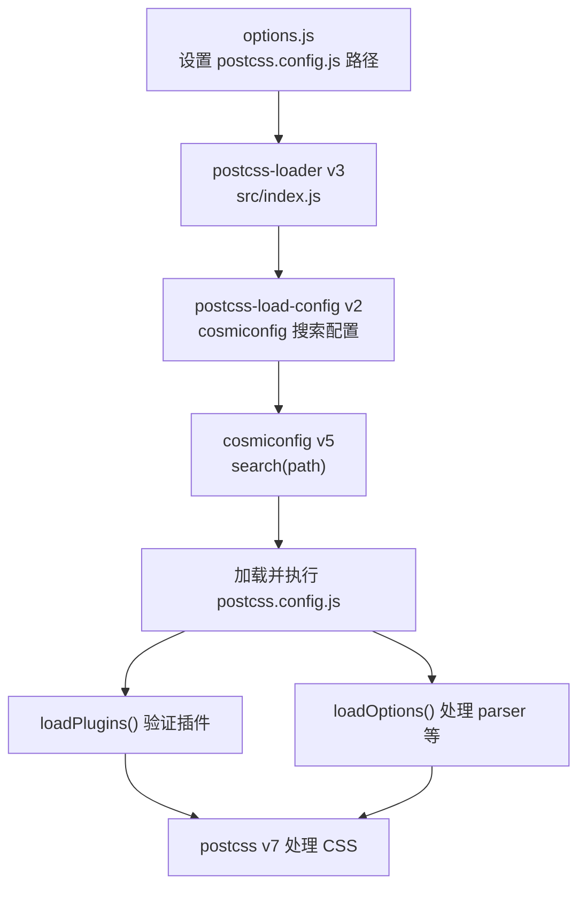
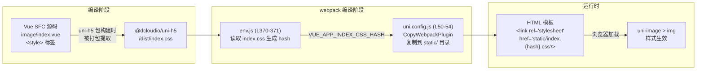
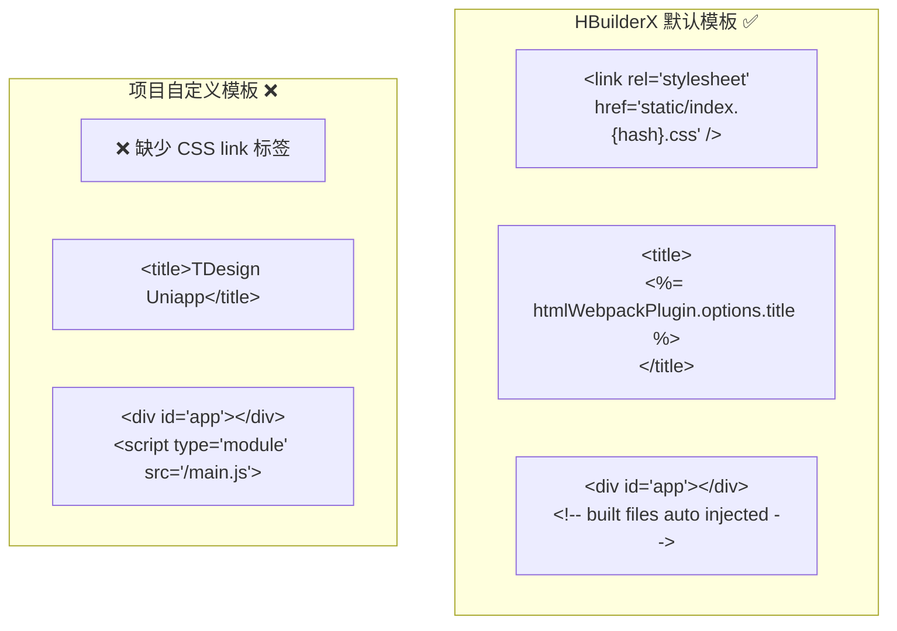
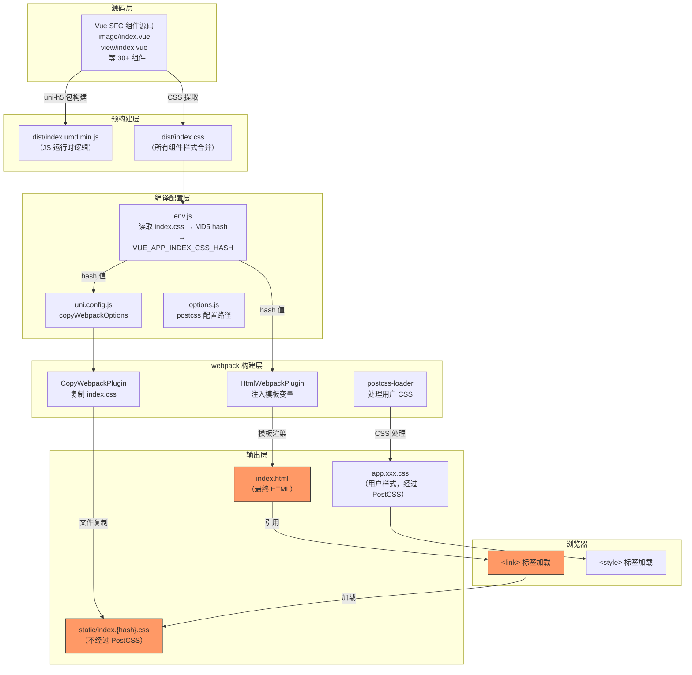
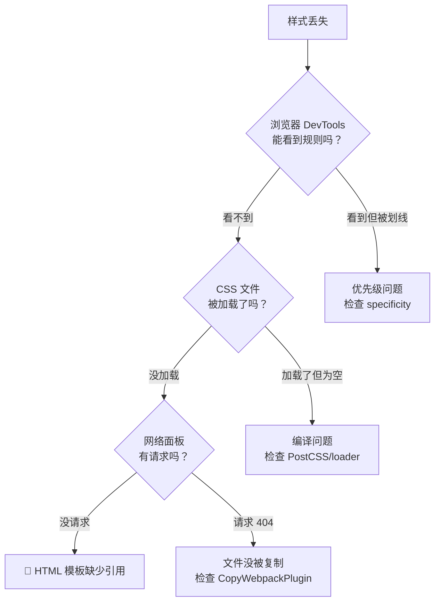

<!-- # 从源码追踪 uni-app H5 平台 `uni-image > img` 样式丢失之谜 -->

## 一、问题描述

在 HBuilderX Vue2 项目中，为了适配 TDesign 组件库（Vue3 → Vue2），我们在项目根目录创建了自定义的 `postcss.config.js`，添加了 `:deep()` → `::v-deep` 转换和 `rpx` → `px` 转换等自定义 PostCSS 插件。

结果发现：**H5 平台下 `uni-image > img` 等 uni-app 内置组件的默认样式完全消失了**。在浏览器开发者工具中完全找不到这条 CSS 规则。

## 二、错误的排查方向：PostCSS 配置链路

### 2.1 第一个假设：缺少默认插件

最初的分析认为问题出在 `postcss.config.js` 缺少了 HBuilderX 默认的 `postcss-comment`、`postcss-import`、`autoprefixer` 插件。

HBuilderX 内置的默认配置（位于 `/Applications/HBuilderX.app/Contents/HBuilderX/plugins/uniapp-cli/postcss.config.js`）：

```js
const path = require('path')
module.exports = {
    parser: require('postcss-comment'),
    plugins: [
        require('postcss-import')({ resolve(id, basedir, importOptions) { ... } }),
        require('autoprefixer')({ remove: process.env.UNI_PLATFORM !== 'h5' }),
        require('@dcloudio/vue-cli-plugin-uni/packages/postcss')
    ]
}
```

于是补回了这三个插件。**但问题没有解决。**

### 2.2 第二个假设：`requireFromCli` 加载失败

因为项目的 `postcss.config.js` 位于项目目录而非 HBuilderX 的 `uniapp-cli/` 目录，直接 `require('postcss-comment')` 会找不到包。于是写了 `requireFromCli` 利用 `UNI_CLI_CONTEXT` 环境变量来从 HBuilderX 的 `node_modules` 中加载：

```js
function requireFromCli(id) {
  const cliContext = process.env.UNI_CLI_CONTEXT;
  if (cliContext) {
    try {
      return require(require.resolve(id, { paths: [cliContext] }));
    } catch (e) { /* fallback */ }
  }
  return require(id);
}
```

验证确认三个包都能正确 resolve。**但问题仍然没有解决。**

### 2.3 深入 PostCSS 配置加载链路

随后对整个配置加载链路进行了逐层源码分析：



具体分析了以下源码文件：

以下所有路径的公共前缀为 `/Applications/HBuilderX.app/Contents/HBuilderX/plugins/uniapp-cli/node_modules/`（简记为 `$CLI_MODULES/`）：

| 文件路径 | 作用 |
|---|---|
| `$CLI_MODULES/@dcloudio/vue-cli-plugin-uni/lib/options.js` (L99-107) | 决定使用用户还是默认的 postcss 配置 |
| `$CLI_MODULES/postcss-loader/src/index.js` (L67-77) | 从 options 中读取 config.path 传给 postcss-load-config |
| `$CLI_MODULES/postcss-load-config/src/index.js` (L82-86) | 调用 cosmiconfig.search(path) 搜索配置文件 |
| `$CLI_MODULES/postcss-load-config/src/plugins.js` | loadPlugins 验证插件数组 |
| `$CLI_MODULES/postcss-load-config/src/options.js` | loadOptions 处理 parser 等选项 |
| `$CLI_MODULES/cosmiconfig/dist/createExplorer.js` (L76) | getDirectory 将文件路径转为目录路径后搜索 |
| `$CLI_MODULES/@dcloudio/vue-cli-plugin-uni/packages/postcss/index.js` | uni-app 核心 PostCSS 插件（标签转换 + rpx 转换）|

**结论：整个 PostCSS 配置加载链路完全正常，没有任何逻辑错误。**

### 2.4 排除自定义插件干扰

- `deepSelectorPlugin`：只处理包含 `:deep(`、`::v-deep(`、`:slotted(`、`:global(` 的选择器，`uni-image > img` 不包含这些，**不受影响**
- `rpxToPxPlugin`：只处理值中包含 `rpx` 的声明，`uni-image > img` 的样式值是 `px` 和 `0`，**不受影响**
- `postcss-uniapp-plugin`：H5 下将 `image` → `uni-image` 转换，但有前缀检查 `tag.value.substring(0, 4) !== 'uni-'` 不会重复转换，**不受影响**

## 三、真正的根因：HTML 模板缺少 CSS 引入

### 3.1 关键发现：uni-app H5 样式不走 PostCSS 流程

经过反复排查无果后，思路转向：**`uni-image > img` 的样式到底是通过什么途径加载到浏览器的？**

追踪源码发现了 uni-app H5 平台的组件样式加载链路：



**这个过程完全不经过 PostCSS 流程！** 是通过 `CopyWebpackPlugin` 直接文件复制 + HTML `<link>` 标签引入的静态 CSS。

### 3.2 源码追踪详解

#### Step 1：样式的源头

`uni-image > img` 的样式定义在 Vue SFC 源码中：

**文件**：`/Applications/HBuilderX.app/Contents/HBuilderX/plugins/uniapp-cli/node_modules/@dcloudio/uni-h5/src/core/view/components/image/index.vue`

```css
/* <style> 标签（非 scoped） */
uni-image>img {
  -webkit-touch-callout: none;
  -webkit-user-select: none;
  -moz-user-select: none;
  display: block;
  position: absolute;
  top: 0;
  left: 0;
  width: 100%;
  height: 100%;
  opacity: 0;
}
```

但 `@dcloudio/uni-h5` 的 `package.json` 中 `main` 字段指向 `dist/index.umd.min.js`，也就是说 **webpack 加载的是预编译好的 UMD 包，而非 Vue SFC 源码**。CSS 被单独提取到了 `dist/index.css` 中。

#### Step 2：CSS hash 生成

**文件**：`/Applications/HBuilderX.app/Contents/HBuilderX/plugins/uniapp-cli/node_modules/@dcloudio/vue-cli-plugin-uni/lib/env.js`（L370-371）

```js
const indexCssBuffer = fs.readFileSync(
  require.resolve('@dcloudio/uni-h5/dist/index.css')
)
process.env.VUE_APP_INDEX_CSS_HASH = loaderUtils.getHashDigest(
  indexCssBuffer, 'md5', 'hex', 8
)
```

读取 `dist/index.css` 文件内容，计算 MD5 hash，设置为环境变量 `VUE_APP_INDEX_CSS_HASH`。

#### Step 3：CopyWebpackPlugin 复制 CSS

**文件**：`/Applications/HBuilderX.app/Contents/HBuilderX/plugins/uniapp-cli/node_modules/@dcloudio/uni-h5/lib/h5/uni.config.js`（L50-54）

```js
copyWebpackOptions(platformOptions, vueOptions) {
  const copyOptions = [
    {
      from: require.resolve('@dcloudio/uni-h5/dist/index.css'),
      to: getIndexCssPath(vueOptions.assetsDir, platformOptions.template,
        'VUE_APP_INDEX_CSS_HASH'),
      transform(content) {
        return transform(content, platformOptions)
      }
    },
    'hybrid/html'
  ]
}
```

其中 `getIndexCssPath` 函数（L28-42）会检查 HTML 模板中是否包含 `VUE_APP_INDEX_CSS_HASH` 关键字，据此决定输出路径：

```js
function getIndexCssPath(assetsDir, template, hashKey) {
  const VUE_APP_INDEX_CSS_HASH = process.env[hashKey]
  if (VUE_APP_INDEX_CSS_HASH) {
    const templateContent = fs.readFileSync(getTemplatePath(template))
    if (new RegExp('\\b' + hashKey + '\\b').test(templateContent)) {
      return path.join(assetsDir,
        `[name].${VUE_APP_INDEX_CSS_HASH}.[ext]`)
    }
  }
  return assetsDir  // fallback：不带 hash
}
```

#### Step 4：HTML 模板引入 CSS

**文件**：`/Applications/HBuilderX.app/Contents/HBuilderX/plugins/uniapp-cli/public/index.html`（HBuilderX 默认模板）

```html
<link rel="stylesheet" href="<%= BASE_URL %>static/index.<%= VUE_APP_INDEX_CSS_HASH %>.css" />
```

这行 `<link>` 标签就是浏览器加载 `uni-image > img` 等所有内置组件样式的入口。

#### Step 5：模板选择逻辑

**文件**：`/Applications/HBuilderX.app/Contents/HBuilderX/plugins/uniapp-cli/node_modules/@dcloudio/uni-h5/lib/h5/uni.config.js`（L4-10）

```js
function getTemplatePath(template) {
  if (template) {
    const userTemplate = path.resolve(process.env.UNI_INPUT_DIR, template)
    if (fs.existsSync(userTemplate)) { return userTemplate }
  }
  return path.resolve(process.env.UNI_CLI_CONTEXT, 'public/index.html')
}
```

如果 `manifest.json` 中配置了 `h5.template`，就使用用户自定义模板；否则使用 HBuilderX 默认模板。

### 3.3 根因定位

项目的 `manifest.json`（L60-65）中配置了：

```json
"h5": {
    "template": "./index.html",
    "router": {
      "base": "./"
    }
}
```

指向项目根目录的自定义 `index.html`。对比两个模板：



**项目的自定义模板完全缺少了关键的一行**：

```html
<link rel="stylesheet" href="<%= BASE_URL %>static/index.<%= VUE_APP_INDEX_CSS_HASH %>.css" />
```

而且这个模板看起来是从 Vite/Vue3 项目复制过来的（`<script type="module" src="/main.js">`），而 HBuilderX Vue2 项目使用的是 webpack（应该用 `htmlWebpackPlugin`）。

## 四、完整的 H5 样式加载架构



**关键路径**（红色标注）：`dist/index.css` → `CopyWebpackPlugin` → `static/index.{hash}.css` → HTML `<link>` 标签 → 浏览器加载

这条路径**完全绕过了 PostCSS 处理流程**，所以无论怎么改 `postcss.config.js` 都不会影响这些样式是否加载。

### 附：文章涉及的所有源码文件完整路径

以 HBuilderX 安装目录 `/Applications/HBuilderX.app/Contents/HBuilderX/` 为根：

```
plugins/uniapp-cli/
├── postcss.config.js                          ← HBuilderX 默认 PostCSS 配置
├── public/
│   └── index.html                             ← HBuilderX 默认 HTML 模板（包含关键 <link> 标签）
└── node_modules/@dcloudio/
    ├── vue-cli-plugin-uni/
    │   ├── lib/
    │   │   ├── env.js                         ← 环境变量设置（L370: VUE_APP_INDEX_CSS_HASH 生成）
    │   │   └── options.js                     ← PostCSS 配置路径选择（L99-107）
    │   └── packages/
    │       └── postcss/
    │           └── index.js                   ← uni-app 核心 PostCSS 插件（标签转换）
    └── uni-h5/
        ├── dist/
        │   └── index.css                      ← 预编译的组件样式合集
        ├── lib/h5/
        │   └── uni.config.js                  ← CopyWebpackPlugin 配置（复制 CSS 到 static/）
        └── src/core/view/components/image/
            └── index.vue                      ← uni-image > img 样式源头（L239）
```

## 五、修复方案

在项目的 `index.html` 的 `<head>` 中补上缺失的 `<link>` 标签：

```html
<link rel="stylesheet" href="<%= BASE_URL %>static/index.<%= VUE_APP_INDEX_CSS_HASH %>.css" />
```

## 六、经验总结

### 6.1 不要想当然地假设 CSS 来源

uni-app H5 的组件样式存在**两条完全独立的 CSS 加载路径**：

| 路径 | 来源 | 是否经过 PostCSS | 引入方式 |
|---|---|---|---|
| **静态路径** | `@dcloudio/uni-h5/dist/index.css` | ❌ 不经过 | `CopyWebpackPlugin` + HTML `<link>` |
| **编译路径** | 用户 `.vue` 文件的 `<style>` | ✅ 经过 | webpack css-loader + postcss-loader → `<style>` 注入 |

`uni-image > img` 走的是**静态路径**，不受 PostCSS 配置影响。

### 6.2 自定义 HTML 模板的注意事项

当在 `manifest.json` 中设置 `h5.template` 使用自定义模板时，必须保留 HBuilderX 默认模板中的关键内容。最容易遗漏的就是这行 CSS 引入。

### 6.3 debug 思路

当遇到"样式丢失"问题时，首先应该确认：



本次问题属于最底层的 **"HTML 模板缺少引用"**，在最上层的 PostCSS 配置上无论怎么调整都无济于事。
