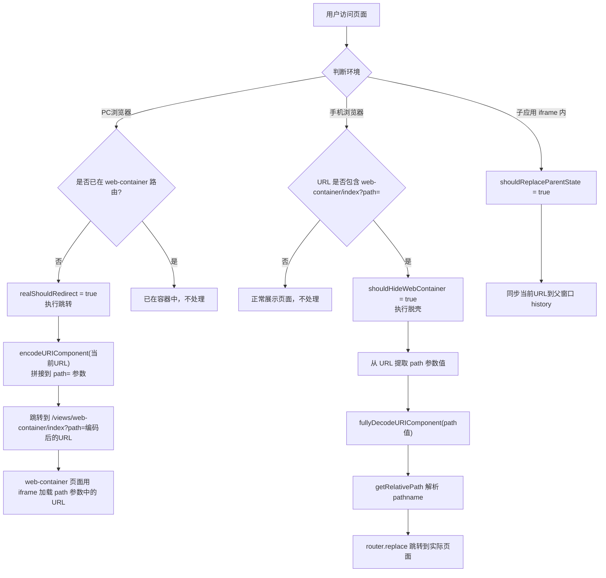
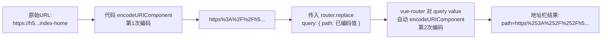

## 1. 功能概述

`web-container` 用于在 PC 端自动将 H5 页面包裹在模拟手机视窗的容器中展示，手机端打开时自动"脱壳"恢复为原始页面。

核心导出函数：`redirectToWebContainerInPC`

## 2. 流程说明



## 3. 三种运行模式

| 模式 | 触发条件 | 行为 |
|------|----------|------|
| **PC 跳转容器** | PC 浏览器 + 非容器页面 + 非白名单 | 跳转到 web-container 路由，用 iframe 包裹 |
| **手机脱壳** | 手机浏览器 + URL 含 web-container 路由 | 从 path 参数还原原始 URL，跳转到实际页面 |
| **子应用同步** | 在 iframe 子应用内 | 将当前 URL 同步到父窗口 history |

## 4. Bug 记录：TypeError: Invalid URL

### 4.1. 现象

手机打开以下链接必现报错：

```
https://h5.nes.smoba.qq.com/pvpesport.next.user/views/web-container/index?path=https%253A%252F%252Fh5.nes.smoba.qq.com%252Fpvpesport.next.user%252Fviews%252Findex%252Findex-home
```

错误：`Failed to construct 'URL': Invalid URL`，定位到 `getRelativePath` 中的 `new URL(target)`。

### 4.2. 根因分析：双重编码



**代码中手动调用了 `encodeURIComponent`，但 vue-router 的 `router.replace({ query })` 会自动再编码一次 query 的 value**，导致双重编码。

当手机端解析时：
1. 正则提取 `path=` 后的值：`https%253A%252F%252F...`
2. 只做一次 `decodeURIComponent` → `https%3A%2F%2F...`（仍然是编码的，不是合法 URL）
3. `new URL('https%3A%2F%2F...')` → **TypeError: Invalid URL** 💥

### 4.3. 修复方案

1. **新增 `fullyDecodeURIComponent` 函数** — 循环解码直到字符串不再变化，兼容任意次数的编码：

```typescript
function fullyDecodeURIComponent(str: string) {
  let decoded = str;
  try {
    let maxLoop = 5;
    while (maxLoop > 0) {
      maxLoop -= 1;
      const next = decodeURIComponent(decoded);
      if (next === decoded) break;
      decoded = next;
    }
  } catch (e) {}
  return decoded;
}
```

2. **`getRelativePath` 增加 try-catch** — 如果 `new URL(target)` 失败，尝试再 decode 一次后解析，最终兜底用 `location.pathname`。

3. **提取 path 参数时使用 `fullyDecodeURIComponent`** — 替换原来的 `decodeURIComponent(match[1])`。

### 4.4. 根源修复建议（可选）

如果要从根源消除双重编码，可以在 `router.replace` 分支中不手动编码：

```typescript
// router.replace 会自动编码 query value，不需要手动 encode
if (router) {
  router.replace({
    path: webContainerRoute,
    query: {
      path: window.location.href, // 不手动编码
    },
  });
} else {
  // 直接拼 URL 时需要手动编码
  const pathQuery = encodeURIComponent(window.location.href);
  window.location.href = `${prefixPath}${webContainerRoute}?path=${pathQuery}`;
}
```

但这样修改需要确保所有使用方的兼容性，当前的兜底方案（循环解码 + try-catch）更安全。

## 5. 参数说明

| 参数 | 类型 | 说明 |
|------|------|------|
| `corePath` | `string` | 项目路径前缀，如 `/pvpesport.next.user` |
| `pathWhiteList` | `string[]` | 白名单路径，命中则不跳转容器 |
| `disableWebContainerList` | `string[]` | 禁用容器的路径列表 |
| `shouldRedirect` | `boolean \| Function` | 是否应跳转，默认 `true` |
| `router` | `any` | vue-router 实例，传入则用 `router.replace` 跳转 |
| `webContainerRoute` | `string` | 容器路由路径，默认 `/views/web-container/index` |
| `log` | `boolean` | 是否打印调试日志 |
| `extraCheckRedirectFunc` | `Function` | 额外的跳转判断函数 |
| `extraCheckNoRedirectFunc` | `Function` | 额外的不跳转判断函数 |
