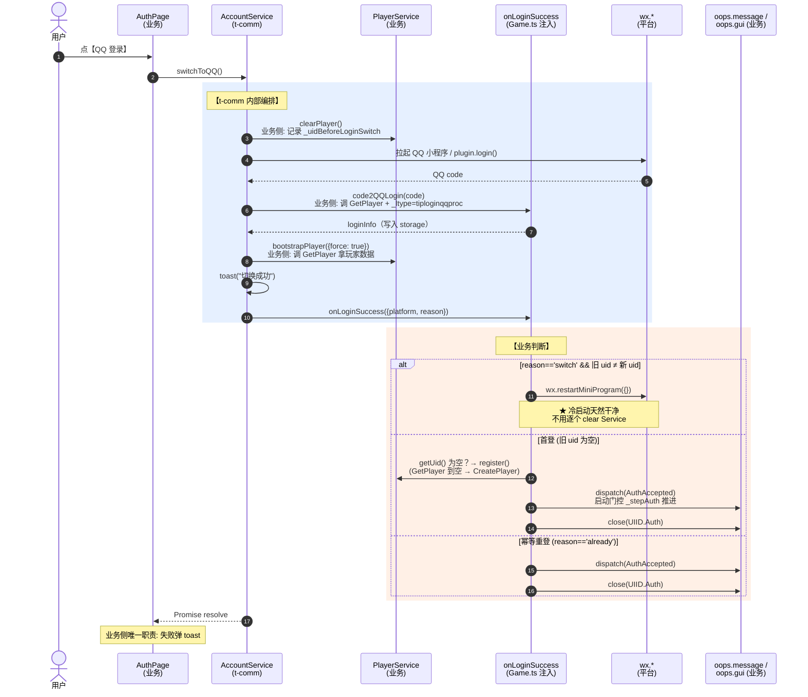
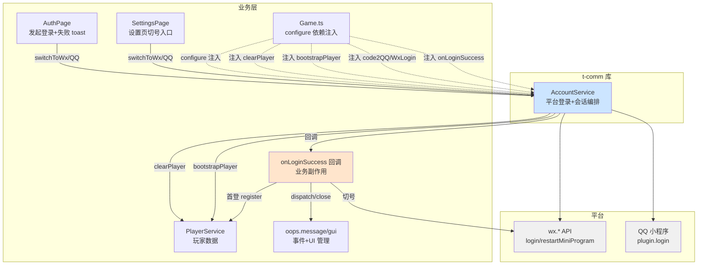
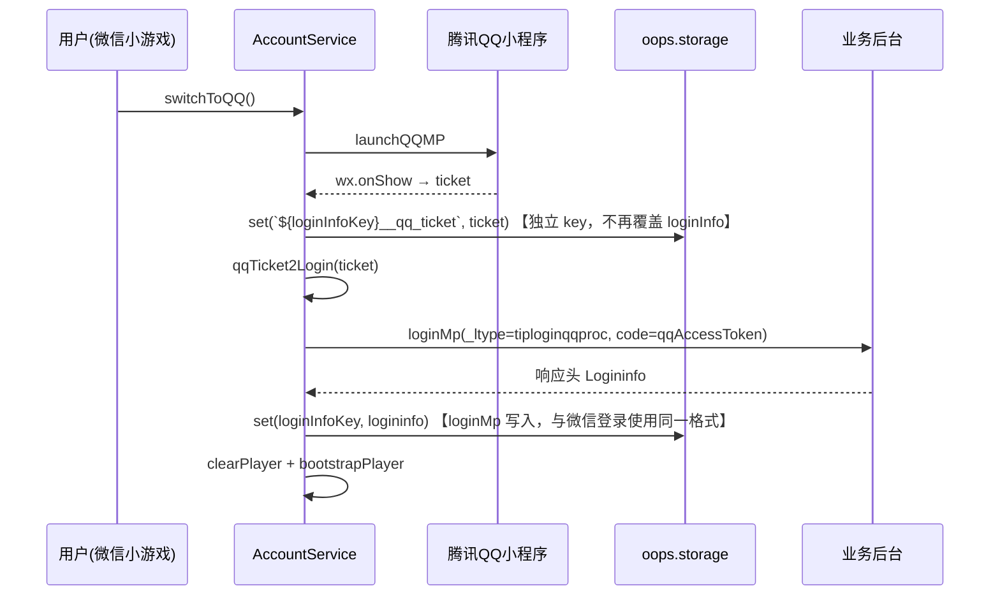
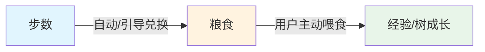
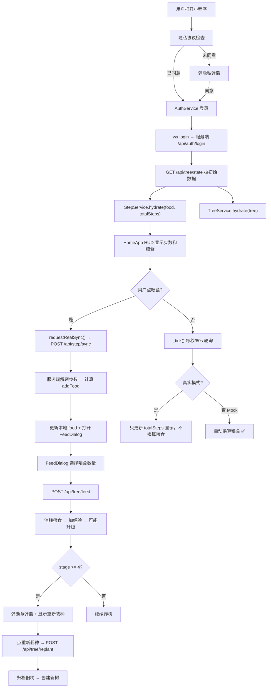
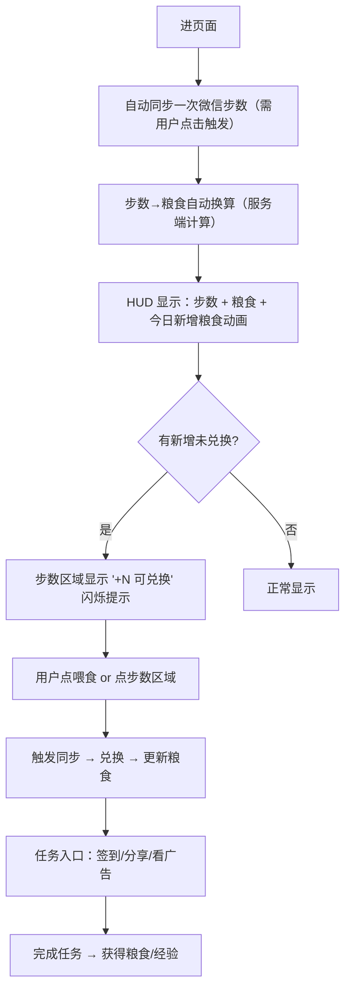

## 批量上报方案

`2026-07-13`

我先看下当前上报的实现，理解现在的调用链路和请求格式。
现在我理解了架构：`CommReportItem.list` 本来就支持批量（数组），但 `Reporter.commReport` 每次只塞一条。设计一个批量方案：

**方案：Reporter 层加一个 flush 队列**
- 每次 `commReport` 把单条 push 到 `_pendingList`
- 用 `microtask + 定时 flush`（比如 200ms 或达到阈值批量发一次）
- 一次 HTTP 请求把多条塞到 `list` 数组
- 保持外部 API 不变（ReportService 语义方法零改动）

我先看下 GalileoReporter 和 ReportContext，确认改动范围。
架构清晰。现在实施批量：改造 `Reporter.commReport` 内部为「入队 + 延迟 flush」，一次 HTTP 请求把队列里所有 item 塞进 `CommReportItem.list`。

设计要点：
1. **入队**：`commReport()` 把单条 record 推入 `_pendingList`（含 secondChannel/eventId/eventContent 等）
2. **批量阈值**：达到 `MAX_BATCH_SIZE = 20` 立即 flush；否则 `FLUSH_INTERVAL_MS = 500` 后自动 flush
3. **flush**：一次 `commReportRequest({ app_name, list: [...] })`，`list` 是数组
4. **Galileo**：每条依旧单独 report（Galileo 是单条协议，跟批量无关）
5. **兼容**：外部 API 完全不变，`ReportService` 零改动
6. **可关**：`FLUSH_INTERVAL_MS = 0` 时立即发（保留原行为兜底）
好，方案清晰。现在改造 `Reporter.ts` 加批量缓冲：
只需要清理两个未使用的 import（我用了 `_getTraceId` 里的 `secondChannel` 但没用 `ReportSecondChannel` 枚举；`REPORT_GAME_ID` 之前就注释掉了）。下划线命名 warning 是既有风格（原代码 `_getTraceId` 就带下划线，全项目一致），忽略。
0 error 了。剩下的 warning：
- 下划线命名（`_pendingList` / `_flushTimer` / `_scheduleFlush` / `_flushNow` / `_getTraceId`）— 全项目风格如此（原文件里 `_getTraceId` 就带下划线），保持一致
- `_getTraceId` 内部 `.slice(-4)` 缩进 — 原代码就是这样，未动
- 两个 hint 是 IDE 语言服务的旧缓存，实际 ESLint 已 0 unused-vars error

跑单测和构建验证一下：
130/130 pass。

## 改造完成

**核心思路**：改造 `Reporter.ts` 内部为「入队 + 延迟 flush」，外部 API 完全不变。

**变更文件**：`assets/scripts/core/report/Reporter.ts`

**行为**：
1. `commReport()` 不再立即发 HTTP，而是把单条 list item 推入 `_pendingList`
2. 阈值 `MAX_BATCH_SIZE = 20` 或超时 `FLUSH_INTERVAL_MS = 500ms` 自动 flush
3. flush 时一次 HTTP 请求把队列所有 item 塞进 `CommReportItem.list` 数组（接口本来就支持数组）
4. Galileo 上报保持原有单条协议（跟 CommReport 批量无关）
5. 新增公开方法 `Reporter.flush()`，可在页面关闭/切换时兜底调用

**关键设计**：
- 定时器"首次到达触发排定，后续入队不重排"（防止高频事件让定时器无限延后，最坏 500ms 一定发）
- 达到 20 条立即发（防止一次请求过大）
- 队列先取走再置空 `this._pendingList = []`，避免下一次 push 与 in-flight 请求混淆
- 业务侧 `ReportService` 零改动，100+ 调用点无感

**验证**：
- `pnpm test:unit` 130/130 pass
- read_lints 0 error（剩余 warning 全部与本次改动无关，是全项目 `_xxx` 命名风格惯例）

**预期效果**（对照截图）：截图里几十条 `CommReport?tstamp=xxx` 请求会合并成每 500ms 一次或每 20 条一次的批量请求，请求数量降至 1/20，请求 payload 从 `list: [1条]` 变为 `list: [N条]`。


## _broadcastSwitchGen 的设计思想是什么

`2026-07-13`

The user is asking about the design philosophy behind `_broadcastSwitchGen`. Let me explain it clearly.

`_broadcastSwitchGen` is a generation counter used as a "stale callback guard" pattern. It's a common pattern in async UI code to prevent old async callbacks (from setTimeout, tween, or fetch) from writing to a node that has since been hidden or re-entered.

Let me walk through the full design:

1. **Problem**: When BumpSelectPage.show() is called, it kicks off an async flow (_refreshBroadcast) that:
   - Does `await queryBumpNotifications()` (network delay)
   - After network returns, schedules `setTimeout(3s)` for carousel rotation
   - Inside setTimeout, runs a `tween(0.18s)` fade-out
   - Inside tween callback, renders next item and schedules next cycle

   If the user closes the page (hide()) during any of these async gaps, the stale callbacks will fire on a hidden/destroyed node, causing:
   - Attempts to render text on a destroyed Broadcast node
   - Setting bc.active = true on a hidden page
   - Scheduling more timeouts that will never be cleaned up

2. **Solution**: Every time a new "refresh session" starts (show() or hide()), increment gen. All async callbacks store a snapshot of gen at creation time, and before doing anything, they check if their stored gen still matches the current gen. If not, they return immediately.

The key insight that makes it elegant:
- `show()` → `_refreshBroadcast()` takes `myGen` snapshot → only one increment
- `hide()` → `_stopBroadcastCarousel()` increments gen → all pending callbacks from the previous show() session will fail their gen check and bail out
- Inside carousel cycle, `_scheduleNextTick` passes `gen` to every recursive tick, so even a deeply nested setTimeout→tween chain can tell if it's stale

The earlier bug was that `_refreshBroadcast` was effectively incrementing gen twice (once at `++gen` entry, once inside `_stopBroadcastCarousel()`), making `myGen` always one behind and causing the guard to falsely reject valid results.

Let me explain this clearly to the user.
`_broadcastSwitchGen` 是一个**代次号**（generation counter），解决的是典型的"异步回调在页面已销毁/重入后复活"问题。

## 要解决的问题

`_refreshBroadcast` 里有一串跨越多个时间维度的异步链：

```
show()                 ← 时刻 A
  _refreshBroadcast()
    await queryBumpNotifications()   ← 网络延迟 200ms
    setTimeout(3s)                   ← 宏任务
      tween 0.18s fade-out           ← 帧循环
        .call() 回调                  ← 帧循环
          渲染下一条
          setTimeout(3s)             ← 又排一个宏任务
            tween fade-out
              ...
```

如果用户在 **3s 轮播定时器还没到** 时就关了页面（`hide()`），那些排好队的 `setTimeout`、`tween.call()` 仍然会在未来触发，对着一个已销毁的节点做 `_renderBroadcastAt`、`bc.active = true`。

## 解决方案

给整个"播报刷新会话"发一个**代次号**，所有异步回调在动手之前先验代次号：

```
show() →
  gen = 1                            ← 当前会话 = 第 1 代
  _refreshBroadcast(myGen=1)
    await queryBump 完成 (gen 仍是 1 → 继续)
    setTimeout(3s, gen=1)
    tween.fadeOut → .call(gen=1)     ← 这里 gen=1，继续
    setTimeout(3s, gen=1)

  用户 hide() →
    _stopBroadcastCarousel()
      clearTimeout()
      gen = 2                        ← 代次号失效！

  残留的 setTimeout(3s, gen=1) 触发 →
    if (gen=1 !== _broadcastSwitchGen=2) return;  ← 早退！
```

## 关键规则

| 触发者 | 行为 | gen 变化 |
|--------|------|----------|
| `_refreshBroadcast` 入口 | `gen+1`，用 `myGen` 快照往下传 | 每次 show 让 gen 前进 1 |
| `_stopBroadcastCarousel`（`hide()`） | `clearTimeout` + `gen+1` | 让所有「上一代」的回调全部失效 |
| `_scheduleNextTick(gen)` | 把 `gen` 透传给下一层 `setTimeout` / `tween.call()` | 不改变，只是每一轮回调都带着自己的"出生代" |

这样即使最末端的 `_onFadeOutComplete`（在 `tween.call` 回调里再 `_renderBroadcastAt` + `_scheduleNextTick`），也能用最初 `show()` 那次的 `gen` 判断自己是否已过时。

## 前面那个 bug 是怎么来的

`_refreshBroadcast` 原本同时做了两件事：
1. 入口 `++gen` 拿到 `myGen`（"新一回刷新开始了"）
2. 又调了 `_stopBroadcastCarousel()`（"清理旧轮播"）

而 `_stopBroadcastCarousel` 内部也 `++gen`。结果 `myGen` 恒等于 1，但实际 `gen` 已被推到 2，所有校验都失败。这就是为什么"有数据但页面没展示"。

## 新手引导中点击喂食无反应

`2026-07-11`


问题定位
Bug 位置：assets/scripts/module/guide/view/renderer/CoachmarkRenderer.ts:213-214
    // a) 转发点击到目标节点（业务 Button 触发，跳页 / 喂食 / 弹窗）
    try {
      target.emit(Node.EventType.TOUCH_END);
      target.emit('click');
    } catch (e) {
      oops.log.error('[CoachmarkRenderer] 转发点击失败', e);
    }
target 是从 GuideAnchorRegistry 取的锚点节点，对喂食按钮来说就是 feed（父节点）。Coachmark 合成点击事件时只 emit 在父节点 feed 上。
根因
MainHomeBuilder.ts 给三个底部按钮都用了「父节点做视觉 + 子节点 HitArea 做点击区」模式：
feedHit.on(Node.EventType.TOUCH_END, () => callbacks.onFeed());
MainHomeBuilder._bindPressScale(feedHit, feed);

// 引导锚点：喂食按钮（STEP_FEED）
GuideAnchorRegistry.ins.register('home.feed-button', feed);
- feedHit（子节点，228×280 扩大点击区）注册了 TOUCH_END 监听 → 真正调 callbacks.onFeed() → GooseHomeApp.handleFeed()
- feed（父节点，可见切图）注册了引导锚点 home.feed-button
Cocos 的 node.emit() 不会向子节点冒泡——只在当前节点触发。所以合成点击发到 feed（父）上，feedHit（子）的 TOUCH_END 监听永远收不到，callbacks.onFeed() 永远不跑 → handleFeed() 不跑 → 没有 PetFedEnd 事件 → 引导卡在等 PetFedEnd + GuideReturnedHome 双信号（30s 兜底才推进）。
影响范围
|引导步|锚点|实际监听节点|受影响？|
|-|-|-|-|
|STEP_FEED (喂食)|feed|feedHit 子节点|✅ 是|
|STEP_EARN_FOOD (赚鹅粮)|earn|earnHit 子节点|✅ 是|
|STEP_COLLECT (集市)|market|marketHit 子节点|✅ 是|
|STEP_TAP (碰一碰)|wrap|wrap 自身|❌ 否（监听和锚点同节点）|

修复方案
推荐方案 A：递归 emit（修 CoachmarkRenderer）
CoachmarkRenderer._onTargetClicked 改为递归遍历 target 的所有后代节点都 emit 一次。这样：
- 父节点和子节点各自注册了监听都能触发
- 业务侧无需改任何东西，三个按钮一次性修好
- 防止以后再加新按钮又踩同样的坑
assets/scripts/module/guide/view/renderer/CoachmarkRenderer.ts:213 改造为：
const forwardClick = (node: Node): void => {
  node.emit(Node.EventType.TOUCH_END);
  node.emit('click');
  for (const child of node.children) {
    forwardClick(child);
  }
};
forwardClick(target);
其他备选：
- B：把 MainHomeBuilder 三个按钮的 on(TOUCH_END, ...) 监听搬到父节点（feed/earn/market），但父节点 UITransform 尺寸是 148×80，触摸区会变小，违反当前「扩大点击区」的设计意图。
- C：把 GuideAnchorRegistry.register 三个锚点都改为子节点 feedHit/earnHit/marketHit，但 circle 镂空会按子节点尺寸 228×280 渲染，视觉圈放大可能与设计稿偏离。
要直接修 A 方案吗？我会把 forwardClick 抽成模块内私有方法，3 行代码改动，跑下 read_lints 验收。

## 泛化事件 是啥意思

`2026-07-11`


简单说：`GuideReturnedHome` 这个事件名太通用了——Bazaar、TaskListModal、BumpPage、LayEggDialog 四个不同页面的 hide() 都派发同一个 `EventName.GuideReturnedHome`。所以 CoachmarkRenderer 订阅时收不到"这是谁派发的"信息，无法区分来源。
就是**同一个事件名被多个不同的界面/场景共用派发**，"谁的返回"分不清。

```
Bazaar.hide()           ──→ dispatch(GuideReturnedHome)
TaskListModal.hide()    ──→ dispatch(GuideReturnedHome)  
LayEggDialog.hide()     ──→ dispatch(GuideReturnedHome)
BumpPage.hide()         ──→ dispatch(GuideReturnedHome)
```

四个不同的页面关闭，派发的是**同一个** `EventName.GuideReturnedHome`。`CoachmarkRenderer` 订阅这个事件时，收到的只是一个匿名信号——不知道是谁关的、什么时候关的、是为当前引导步关的还是为上一步关的。

**非泛化**（好的设计）应该是：

```
Bazaar.hide()     ──→ dispatch(BazaarClosed)        ← 事件名带身份
LayEggDialog.hide() ──→ dispatch(LayEggClosed)       ← 可以区分来源
```

这样 renderer 能精准知道"这是集市关了"而不是"某个页面关了"，就不会把上一步 LayEggDialog 关闭的信号误收成当前步"集市返回主页"。

**为什么设计成泛化？** 因为所有页面关闭时 CoachmarkRenderer 需要的行为是一样的——"用户回到主页了，推进到下一段"。但这个设计假设"renderer 启动后收到的第一个 `GuideReturnedHome` 一定是当前步触发的"，而实际上上一步残留/延迟的 `GuideReturnedHome` 会被提前订阅收走，就产生了 bug。

我们的修复就是加一个"因果顺序"守卫来弥补事件缺乏来源标识的问题：**businessEvent（如 BazaarOpened）之前收到的 GuideReturnedHome 不可能是当前步的，忽略。**

## 泛化事件导致的新手引导蒙层错位

`2026-07-11`

```js
    const seg = this._seg;
    // GuideReturnedHome 是泛化事件（Bazaar / TaskListModal / BumpPage / LayEggDialog
    // 关闭时都会派发）。本段在 _start 阶段就提前订阅它（防止 businessEvent 之后目标
    // 页面自动关闭时信号丢失）。但由此带来一个陷阱：上一段（如 STEP_FEED 的 LayEggDialog
    // 关闭）延迟 / 残留派发的 GuideReturnedHome 会被本段提前收到。
    //
    // 逻辑约束：GuideReturnedHome（用户操作完目标页面「回到主页」）必然发生在 businessEvent
    // （目标页面「打开」，如 BazaarOpened）之后——先打开集市才谈得上关闭集市。因此若本段
    // 要求 businessEvent 但它尚未到达，这次 GuideReturnedHome 一定是上一步 / 其它页面的
    // 残留信号，与本段无关，必须忽略。
    //
    // 若不忽略：残留信号会把 _returnedHomeFired 提前置 true，用户一触发 businessEvent
    // （点开集市）双信号立即到齐 → 本段提前推进 → 下一段高亮（STEP_EARN_FOOD 的
    // home.task-entry）错位渲染到用户当前仍停留的集市页上（左下角空白处冒出高亮圈）。
    if (seg?.completeOn.businessEvent && !this._businessEventFired) {
      oops.log.logBusiness('[CoachmarkRenderer] 忽略 businessEvent 之前到达的 GuideReturnedHome（残留信号）');
      return;
    }
```


## 签到领取奖励收口

`2026-07-11`

我先把 `_checkAndClaimLoginTask` 现状和 `TaskService.autoSignInAndClaimIfNeeded` 的返回值搞清楚，再给方案。
我看清楚了核心问题：

1. **Bug 现状**：`_checkAndClaimLoginTask` 里 `list = await TaskService.ins.fetchTaskList()` 拿到列表后**没有 claimable → 直接返回 null**，从来不会调 `dailySignIn()`。这跟 `autoSignInAndClaimIfNeeded` 是**同一件事**，只是缺了「没 claimable 就调签到再拉再领」这半段。
2. **冲突现状**：`Game._installDailySignInWatcher` 已经在登录时自动跑 `autoSignInAndClaimIfNeeded`（我这轮加的），而 GuidePage `_checkAndClaimLoginTask` 又自己写了一套简化版签到领取——两套并跑，还可能互相踩：GuidePage 用 `getList() 快照 → 找 day1 → claim` 时，登录侧的 `autoSignInAndClaim` 可能已经在 round1 领了同一档。
3. **需求**：引导时 + 平常都要弹「今日登录鹅鹅 收获鹅粮 +Ng」的 cutscene；平常那次要能开关。

## 优雅方案

**核心思路**：把「签到+领取」这份业务逻辑彻底收口到 `TaskService.autoSignInAndClaimIfNeeded`（**返回本次领到的总金额**），任何调用方都只负责「拿金额 → 决定要不要弹 cutscene」，不再自己找 cell / 调 claim / 调 sign。

具体：

### 1. `TaskService.autoSignInAndClaimIfNeeded` 返回 `{ claimedAmount: number; claimedTaskIds: string[] }`
- `_claimAllClaimableLoginCells` 内部把 `cell.amount` 累加返回
- `_runAutoSignInAndClaim` 累加 round1+round2 的 amount
- 短时间去重 promise 复用同一结果

### 2. 新增独立组件 `LoginBonusCutscene`（`assets/scripts/module/task/view/LoginBonusCutscene.ts`）
- 直接复用 `CutsceneRenderer` + `STEP_FEED` cutscene① 的 seg 配置（title/subtitle/iconAmount/duration/showBackground）
- 静态 `LoginBonusCutscene.show(amount: number): Promise<void>`：找到 root layer → 挂一个盖满屏的 stage node → 渲染 CutsceneRenderer → 完成时清理
- 用 UIID 注册太重（只是一个 3s 的 cutscene 无交互层），走 `oops.gui.layer.top` 直接挂节点更轻

### 3. 收口触发点：`TaskService` 内部弹（业务规则集中）
- `autoSignInAndClaimIfNeeded(opts?: { showBonusCutscene?: boolean })` 领完有金额 → 调 `LoginBonusCutscene.show(amount)`
- Game 登录 watcher 调 `autoSignInAndClaimIfNeeded({ showBonusCutscene: true })`（默认可关）
- 需要"关掉平常弹"时改成 `{ showBonusCutscene: false }` 即可，一处开关

### 4. GuidePage `_checkAndClaimLoginTask` 简化
- 从"自己找 day1 → claim"改成 `const { claimedAmount } = await TaskService.ins.autoSignInAndClaimIfNeeded({ showBonusCutscene: false })`
- **关键**：Guide 场景要求 cutscene 内嵌在 guide stage（跟其他 step 连续播放），所以 Guide 传 `showBonusCutscene: false` 阻止 TaskService 弹独立 cutscene，然后自己把 `claimedAmount` 注入 seg.iconAmount → 沿用 guide 的 `CutsceneRenderer.build(this._stage, seg, done)` 播放
- amount=0 时跳过 cutscene①，逻辑不变
- 修掉原 bug：现在没 claimable 也会走签到再领，Day1 补签也能领到

### 5. 冲突保护
- `autoSignInAndClaimIfNeeded` 本身有 `_autoClaimPending` 去重，Guide 触发时如果登录 watcher 已经在跑，会 await 同一 Promise，共享同一份 `claimedAmount` 结果
- 但 Guide 想吞掉 TaskService 侧的弹窗，所以选项要传 `showBonusCutscene: false`——这里有个坑：登录 watcher 先跑 `showBonusCutscene: true` → 已在弹 → Guide 又调时复用同一 Promise 就没法关。**解决**：把去重 promise 拆成"业务 promise（领取结果）" + "弹窗触发（副作用）"两段，`showBonusCutscene` 只影响副作用；Guide 侧调用时如果发现已经在跑，多设个"抑制标记"让当前尚未完成的那次跳过弹窗，或者更简单——**Guide 启动前先 dispose 掉已挂的 LoginBonusCutscene 节点**（Guide 有自己的清屏逻辑 `_stage.removeAllChildren`，若把 cutscene 挂在 Guide 会用到的 stage 层就自然被清）

### 6. 关平常那次的开关放哪
- `env.ts` 里加 `SHOW_LOGIN_BONUS_CUTSCENE: true`（后续要关时改一处）
- 或者 `Game._installDailySignInWatcher` 里显式传，先默认 true，产品要下线时改成 false 即可

要不要我按这个思路直接开写？主要是 4 步：
1. 改 `autoSignInAndClaimIfNeeded` 返回 `{ claimedAmount, claimedTaskIds }`
2. 新建 `LoginBonusCutscene.ts`（复用 CutsceneRenderer + STEP_FEED seg 配置）
3. 改 `Game._installDailySignInWatcher` 传 `showBonusCutscene: true`
4. 改 GuidePage `_checkAndClaimLoginTask` → 委托给 `autoSignInAndClaimIfNeeded({ showBonusCutscene: false })`，修 Bug + 消除重复代码

有一点想确认：**LoginBonusCutscene 展示时用户如果正在别的 UI 上（比如已经开了 TaskListModal），是盖上面还是排队？** 我倾向"直接盖 top layer"，因为它只有 3s + 点击关闭，无交互冲突。你决定即可。


## 上面图里的 fire-and-forget 啥意思

`2026-07-11`

"Fire-and-forget" 是一种异步调用模式，意思是**发射后不管**——调用一个异步操作后**不 `await` 它的结果**，让它在后台自行完成，主流程不等待也不处理返回值。

在代码里通常表现为：

```typescript
// fire-and-forget：用 void 表达"我知道这是 Promise 但故意不等"
void TaskService.ins.fetchTaskList();
void ResManager.preloadGroupWhenIdle(PreloadGroup.AuthBoot, { initialDelayMs: 0 });
```

对比正常 await：

```typescript
// 阻塞等待结果
await TaskService.ins.fetchTaskList();
```

**适用场景**：预热/预加载、日志上报、缓存刷新等——这些操作的结果不影响当前主流程，失败了也无所谓（内部自行兜底），所以不需要阻塞等待。

在本项目里你之前也用过这个模式，比如 `GooseHomeApp._afterGuide` 末尾的 `void TaskService.ins.fetchTaskList()` 就是典型的 fire-and-forget 预热。

## 不加闭包，我就得新加个变量吗

`2026-07-11`

# 先说结论：
**不加自执行闭包（IIFE），不用新增全局变量，但必须多一个局部临时变量；而且会破坏「原子上锁」，存在并发竞态漏洞，不推荐。**

## 1. 先看不加闭包的等价写法（多一个局部临时变量）
```ts
let globalConfig: GooseRainbowConfig | null | undefined;
let fetchPromise: Promise<GooseRainbowConfig | null> | undefined;

export async function getGooseRainbowConfig(): Promise<GooseRainbowConfig | null> {
    if (globalConfig !== undefined) return globalConfig;
    if (fetchPromise !== undefined) return fetchPromise;

    // 这里多了个局部临时变量 task，替代闭包
    const task = async () => {
        try {
            const cfg = await getRainbowConfig<GooseRainbowConfig>({
                provider_name: 'frontconfig',
                path: isTestEnv() ? 'goose_game_test' : 'goose_game',
            });
            globalConfig = cfg ?? null;
            return globalConfig;
        } catch (err) {
            fetchPromise = undefined;
            throw err;
        }
    };
    // 调用拿到 Promise 实例再赋值
    fetchPromise = task();
    return fetchPromise;
}
```
- 没有新增**全局变量**，只多了函数内局部变量 `task`；
- 逻辑和 IIFE 完全等价，功能一模一样；

## 2. 关键坑：这种写法有并发竞态bug（重点）
IIFE 是**一行原子同步赋值**：
```ts
fetchPromise = (async () => { ... })();
```
执行顺序：同步创建Promise → 立刻赋值给fetchPromise，中间没有空隙。

分开写 `const task = ...; fetchPromise = task();` 看似一样，但极端并发场景有漏洞：
1. 请求A走到 `const task = async ()=>{}`；
2. JS事件循环切走，请求B同时进入函数，同样走完 `const task`；
3. A 执行 `fetchPromise = task()`；
4. B 再执行 `fetchPromise = task()`；

最终会**生成两个独立Promise、发起两次重复接口请求**，失去合并请求的作用。
> IIFE 一行赋值杜绝了这个时间空隙，是原子操作。

## 3. 有没有办法不加闭包、不加临时变量？
**做不到**。
原因：代码里有 `await`，`await` 只能写在 `async` 函数内部。
你只有两个选择：
1. IIFE 自执行闭包：无临时变量，原子上锁，无并发漏洞；
2. 单独定义 async 函数：需要局部临时变量，存在竞态风险。

## 4. 补充：为什么不能直接写？
下面这种直接赋值语法直接报错，JS/TS 不允许：
```ts
// 语法错误：await 不能直接写在普通代码块，只能在async函数内
fetchPromise = await getRainbowConfig(...)
```

## 极简总结
1. 不加闭包，**不需要新增全局变量**，但必须加一个函数内局部临时变量；
2. 拆分写法存在并发重复请求漏洞，IIFE 自执行是更安全、简洁的方案；
3. 核心约束：有 `await` 就必须包裹在 `async` 函数里，绕不开一层函数封装。

## 单例缓存+请求合并方案

`2026-07-11`

整体思路**方向正确**：用全局变量缓存配置、用 pending 函数锁并发请求，避免同一时刻多次重复拉取接口，但存在几处**逻辑缺陷、边界bug、写法不规范**，下面逐条拆解。

## 一、现有代码存在的问题
### 1. pending 赋值逻辑有竞态风险（严重）
```ts
if (pendingGetGooseRainbowConfig) return await pendingGetGooseRainbowConfig();
pendingGetGooseRainbowConfig = async () => { ... }
return await pendingGetGooseRainbowConfig();
```
并发场景时序问题：
1. 同时两个请求进入函数，`globalConfig` 为空、`pendingGetGooseRainbowConfig` 初始 `undefined`
2. A线程判断 pending 不存在，走到赋值行之前让出事件循环
3. B线程同样判断 pending 不存在，也进入赋值逻辑
4. 最终会**创建两个独立请求函数、发起两次接口调用**，失去请求合并作用

根源：先判断、后赋值，中间有空隙，没有原子锁。

### 2. pending 变量永久残留，失败不会清空
如果 `getRainbowConfig` 接口抛异常（网络错误、500等）：
- `globalConfig` 不会赋值
- `pendingGetGooseRainbowConfig` 永远指向这个失败的 Promise 函数
- 后续所有调用 `getGooseRainbowConfig()` 都会**一直复用失败请求，永久拿不到配置**，不会重试。

### 3. 类型与空值逻辑瑕疵
1. `globalConfig` 声明未初始化，默认 `undefined`，判断 `if (globalConfig)` 没问题，但语义不清晰；
2. `cfg ?? null`：如果接口返回合法配置对象直接赋值，返回 null 缓存 null，本身没问题，但要确认业务是否允许永久缓存 null。

### 4. 写法冗余
`pendingGetGooseRainbowConfig` 存一个 `() => Promise` 包装函数没必要，直接存 Promise 对象更简洁。

## 二、修复后的标准实现（请求合并+失败自动释放锁）
```ts
type GooseRainbowConfig = any;
declare function isTestEnv(): boolean;
declare function getRainbowConfig<T>(opts: any): Promise<T | null>;

// 全局缓存配置
let globalConfig: GooseRainbowConfig | null | undefined;
// 直接缓存Promise，代替包装函数，解决竞态
let fetchPromise: Promise<GooseRainbowConfig | null> | undefined;

export async function getGooseRainbowConfig(): Promise<GooseRainbowConfig | null> {
    // 1. 已有缓存直接返回
    if (globalConfig !== undefined) {
        return globalConfig;
    }

    // 2. 已有正在请求的Promise，复用，合并请求
    if (fetchPromise) {
        return fetchPromise;
    }

    // 3. 首次发起请求，原子赋值Promise，杜绝并发重复请求
    fetchPromise = (async () => {
        try {
            const cfg = await getRainbowConfig<GooseRainbowConfig>({
                provider_name: 'frontconfig',
                path: isTestEnv() ? 'goose_game_test' : 'goose_game',
            });
            // 成功写入缓存
            globalConfig = cfg ?? null;
            return globalConfig;
        } catch (err) {
            // 请求失败，清空Promise锁，允许下次重新拉取
            fetchPromise = undefined;
            throw err; // 抛出异常让上层自行处理失败逻辑
        }
    })();

    return fetchPromise;
}
```

## 三、关键优化点说明
1. **解决竞态并发**
   先把 `fetchPromise` 立即赋值，所有并发进来的请求都会复用同一个 Promise，只会发起一次接口。

2. **失败自动释放锁**
   接口报错时 `fetchPromise = undefined`，下次调用会重新发起请求，不会卡死永久失败。

3. **缓存区分「未请求」和「请求过无配置」**
   - `globalConfig === undefined`：还没拉取过配置
   - `globalConfig === null`：拉取过，但配置为空，永久缓存不再请求

4. **精简存储结构**
   不再存 `()=>Promise` 包装函数，直接存 Promise 实例，减少一层调用。

## 四、拓展补充（可选需求）
### 场景1：需要主动刷新配置（新增刷新函数）
```ts
export function clearGooseRainbowConfigCache() {
    globalConfig = undefined;
    fetchPromise = undefined;
}

// 使用：更新配置后手动清缓存重新拉取
// await clearGooseRainbowConfigCache();
// const newCfg = await getGooseRainbowConfig();
```

### 场景2：不希望缓存 null，失败后每次都重试
删除 `globalConfig = cfg ?? null`，仅成功返回配置时赋值 `globalConfig = cfg`，失败不写缓存。

## 五、总结原代码对错结论
1. 核心思路**缓存+合并并发请求**是正确的；
2. 原生代码有两个致命缺陷：
   - 并发下会重复发起请求（竞态漏洞）
   - 接口报错后永久卡死，无法重试；
3. 建议替换为上面直接缓存 Promise 的标准实现。

## 装扮选中态的数据源

`2026-07-10`


## 完整梳理：装扮选中态的数据源

### 当前架构

```
后端权威（PetService.getFirstPet().equipment）
    ↓ getCostumeSpineSkinFromPet() 解析
    ↓ CostumeSkinService.syncSavedKey() 对齐本地
本地缓存（localStorage 'costume:current-skin'）
    ↓ CostumeSkinService.ins.savedKey
    ↓ SKIN_TO_CARD[savedKey]
CostumePage.selectedKey（UI 选中态）
```

### 问题根源

| 时机 | selectedKey 取值方式 | 问题 |
|------|---------------------|------|
| **类属性初始化** (line 126) | `SKIN_TO_CARD[CostumeSkinService.ins.savedKey]` | 读 localStorage 缓存，可能是旧值 |
| **show()** (line 164/171) | `syncFromBackend()` 里再从后端 PetInfo 纠正 | 但这里依赖 `PetService.getFirstPet()` **内存缓存**——如果用户在别处（如首页）换了装扮但没刷 PetInfo，依然是旧的 |
| **保存后退出再进** | `hide()` → `discardPreview()`（只回退 previewKey）；再次 `show()` → `syncFromBackend()` 走内存里的 PetInfo | PetInfo 在 `onSave()` 末尾 `refresh()` 了，所以**再进来**时后端数据是新的 ✓ |

**核心隐患**：`selectedKey` 作为属性初始化表达式只在组件 `addComponent` 时执行一次（等同 constructor），之后 `show()` 虽然会 `syncFromBackend()`，但如果页面第一次已经 `buildAll()` 过（`initialized=true`），且 `syncFromBackend()` 判断 key 没变就不重建——导致**只在 PetInfo 刷新且 spineSkin 确实变了的时候才会纠正 UI**。

**场景复现**：
1. 首次进装扮页 → 选中 xiha → 保存成功 → spine 变 xiha
2. 退出 → 首页 spine 也变 xiha（CostumeChanged 事件 + PetInfoLoaded）✓
3. **不关小游戏**，再次进装扮页 → `show()` → `syncFromBackend()` → `getCostumeSpineSkinFromPet()` 返回 xiha → `SKIN_TO_CARD[xiha]='skin-xiha'`
4. 但 `selectedKey` 已在上一次 show() 里被设成 `'skin-xiha'`（保存时没更新 selectedKey 到最新）
5. ❌ **如果上一次保存后又预览了别的卡片没保存**，那 `selectedKey` 停留在那张预览卡！

```
用户：选 bee → selectedKey='skin-bee' → 保存成功 → commitPreview → selectedKey 仍 = 'skin-bee' ✓
用户：再选 xiha 预览（不保存） → selectedKey='skin-xiha'
用户：退出 → discardPreview(previewKey→bee) → 但 selectedKey 没重置！
用户：再进 → syncFromBackend() → getCostumeSpineSkinFromPet()=bee → SKIN_TO_CARD='skin-bee'
        → selectedKey('skin-xiha') !== 'skin-bee' → 走 setSelected('skin-bee') → 纠正 ✓
```

实际上 `syncFromBackend()` 能纠正。但存在一个边界：**如果 PetInfo.refresh() 失败了（line 772 catch 只打日志不 rethrow）**，内存里的 PetInfo 不变 → syncFromBackend 取不到最新 → 不会纠正。

### 方案：全部从后端唯一真实源驱动

改动点：在 `show()` 中**强制从后端 refresh** PetInfo，确保 selectedKey 总是后端权威值。
-
现在改造 `show()` 方法，让每次打开装扮页**先从后端 refresh PetInfo**，再用后端权威值驱动 selectedKey：
现在还要修 `hide()`：离开时除了 `discardPreview()`，也要**把 selectedKey 重置到后端保存值**，这样下次进来即使 `_refreshAndSync` 还没返回，`selectedKey` 也不会停留在上次预览的卡：
唯一新引入的是 line 192 方法名前缀下划线 warning。其余都是已有的 pre-existing issues（`cc` 模块解析、命名规范等）。让我修一下方法名：
-
0 新增错误。剩余都是 pre-existing 问题。

---

## 完整梳理总结

### 改造前的数据流（有隐患）

```
┌─────────────────────────────────────────────────────────────┐
│  CostumePage.selectedKey 初始化                              │
│    = SKIN_TO_CARD[localStorage 缓存]  ← 可能过时！           │
│                                                              │
│  show() → syncFromBackend()                                  │
│    = getCostumeSpineSkinFromPet()  ← 用 PetInfo 内存缓存     │
│    → 如果内存也过时（refresh 失败 / 跨端操作），就不纠正       │
│                                                              │
│  hide() → 只 discardPreview()                                │
│    → selectedKey 停留在上次预览的卡！                          │
└─────────────────────────────────────────────────────────────┘
```

### 改造后的数据流（后端唯一真实源）

```
┌─────────────────────────────────────────────────────────────┐
│  show()                                                      │
│    1. syncFromBackend()         ← 快速用内存缓存纠正（零延迟）│
│    2. refreshAndSyncFromBackend()  ← 异步拉后端最新 PetInfo   │
│       ↓ await PetService.ins.refresh()                       │
│       ↓ syncFromBackend()       ← 后端权威值覆盖 selectedKey │
│                                                              │
│  hide()                                                      │
│    1. discardPreview()          ← previewKey → savedKey      │
│    2. selectedKey = SKIN_TO_CARD[savedKey]  ← 重置选中态     │
│                                              不残留预览卡     │
│                                                              │
│  数据优先级：后端 PetInfo > localStorage > 默认 luofu         │
└─────────────────────────────────────────────────────────────┘
```

### 改动文件

| 文件 | 改动 |
|------|------|
| `CostumePage.ts` `show()` | 新增 `void this.refreshAndSyncFromBackend()` 异步拉后端 |
| `CostumePage.ts` `refreshAndSyncFromBackend()` | 新增方法：refresh → syncFromBackend |
| `CostumePage.ts` `hide()` | 新增 `selectedKey = SKIN_TO_CARD[savedKey]` 重置选中 |
| `CostumePage.ts` `onPhoto()` | 上一轮改的：subText 用 savedKey 名称 |

### 场景验证

| 场景 | 行为 |
|------|------|
| 保存 xiha → 退出 → 再进 | hide 重置 selectedKey→xiha；show syncFromBackend 确认 xiha ✓ |
| 预览 bee 不保存 → 退出 → 再进 | hide 重置到 savedKey(xiha)；refresh 后端确认 xiha ✓ |
| 跨端在其他端换成 bee → 进装扮页 | syncFromBackend 先用旧内存(xiha)；refresh 后拿到 bee → 纠正 ✓ |
| 保存失败（Equip 报错） | commitPreview 不执行、PetInfo 不变；hide 重置到旧 savedKey ✓ |
| refresh 网络异常 | catch 打日志 return；fallback 用内存缓存（最后一次成功的 PetInfo）✓ |

## 多么简单的登录流程

`2026-07-09`


## iphone uuid

`2026-07-08`


- 00008120-000E2D9E2662601E
- 00008030-001239581A29802E


## versionCode 计算公式

`2026-07-08`

versionCode = X * 10000 + Y * 100 + Z

## 蓝牙数据传输

`2026-07-08`

好的，采用方案 A：**Android 端在广播时把 payload 塞进 `manufacturerData`（真正的 advertising packet 字段），iOS Central 端从 `advertisData` 解析兜底**。

我先精确定位需要改的代码。
[读取文件中]
[读取文件中]
代码结构很清楚了。方案 A 的改造点如下：

### 改动方案

#### 改点 1：[wx-adapter.ts](/Users/guowangyang/Documents/git-woa/cocos-game/assets/scripts/core/bluetooth/wx-adapter.ts) `startAdvertising` 和 `updateAdvertisedValue`
在 `advertiseRequest` 里加上 `manufacturerData` 字段。微信 Android 会把它塞进 advertising packet 的 `Manufacturer Specific Data` AD Type（0xFF），iOS Central 端在 `advertisData` 里能读到。

- 使用一个虚构的 `manufacturerId`（16-bit LE），我们用 `0xFEED`（跟 serviceUuid 前缀一致，方便识别）
- `manufacturerSpecificData` 就是 payload 的 UTF-8 字节

#### 改点 2：[utils.ts](/Users/guowangyang/Documents/git-woa/cocos-game/assets/scripts/core/bluetooth/utils.ts) `parsePayload`
在 `advertisData` 解析步骤中，先剥掉可能的 AD Type 头（`length + type + manufacturerId(2字节 LE) + payload`），再尝试解析 UTF-8 payload。

我也顺便把当前有污染的 iOS 日志 `2L48QG_------` 那种"petId 全是`-`"的**无效数据**在 `parsePayload` 中直接过滤掉（现在 `parseBumpName` 会返回 `{ petId: '------' }`，然后走到 BumpService 里才判掉，日志里刷屏的 "对端 petId 无效" 都是这里来的）。

先开工：
[读取文件中]
先加个常量，再改 3 个文件：

### 1. `constants.ts` 新增 `BUMP_MANUFACTURER_ID`
[编辑文件中]
### 2. `wx-adapter.ts` 广播时加 `manufacturerData`
[编辑文件中]
### 3. `utils.ts` `parsePayload` 增强 —— 从 `advertisData` 里剥出 manufacturer data payload

微信 iOS `onBluetoothDeviceFound` 回调中的 `advertisData` 就是**厂商自定义数据段的 raw bytes**（不含 length/type 头），格式是：`[manufacturerId LE 2 bytes][payload...]`。所以我们要跳过前 2 字节，尝试解析剩余部分。

同时也补一层"扫全 buffer 查找 payload 分隔符"的兜底，最大化健壮性。
[编辑文件中]
[编辑文件中]
现在把 `arrayBufferToUtf8` 加个 `offset` 参数：
[编辑文件中]
### 4. 顺手治一下"petId 全是 `-`" 的脏数据 —— `parseBumpName` 里增加 petId 格式校验

这样 iOS 上扫到`BUMP_2L48QG_------` 直接返回 `null`（不认这个设备），彻底不再刷"对端 petId 无效，跳过昵称查询"日志：
[编辑文件中]
### 5. 检查 lint 无误
[代码检查中]
✅ 无 lint 错误。

### 📋 改动总结

| 文件 | 变更 |
|------|------|
| `constants.ts` | 新增 `BUMP_MANUFACTURER_ID = 0xFEED` |
| `wx-adapter.ts` | `startAdvertising` / `updateAdvertisedValue` 首选 `advertiseRequest` 增加 `manufacturerData` 字段（4 层 fallback：全字段 → 对象 serviceData → 无 serviceData → 无 mfr → 裸跑） |
| `utils.ts` | `parsePayload` 从 `advertisData` 兜底解析时先剥掉 2 字节 manufacturerId 再按 UTF-8 解析；`parseBumpName` 增加 petId 格式校验（过滤 `------` 之类脏数据）；`arrayBufferToUtf8` 支持 offset |

### 🔍 预期效果

再次两台机器互扫 iOS 日志应该会看到：

```
parsePayload {"deviceId":"97EBF6DC-...","name":"","RSSI":-40,
             "advertisData":"<ArrayBuffer: byteLength=??>",...}
[bump] 雷达上发现鹅 tempId=EKTJ0S petId=3gme3wdjj4ab9 rssi=-40  ✅
[bump] 获取对端昵称成功 peerTempId=EKTJ0S nick=xxx
```

- iOS 端读到 Android 广播的 `advertisData`（原来一直是空/没打印，现在 Android 会主动写入）
- 剥掉前 2 字节 manufacturerId 后剩下 `EKTJ0S|3gme3wdjj4ab9`
- `parsePayloadString` 解析成功 → **首次实现 Android→iOS 单向识别** ✅

而 iOS 端扫到的 `2L48QG_------`（他人干扰）会被 `parseBumpName` 直接判空，不再刷屏日志。

### ⚠️ 已知风险与降级
- 若微信基础库版本较低不支持 `manufacturerData`，`startAdvertising` 会 `fail`，我们的 4 层 fallback 会自动降级到"仅 `deviceName` + `serviceUuids`"（也就是改动前的行为），不会影响原来 Android↔Android / iOS↔iOS 的正常路径。
- iOS Peripheral 端调 `startAdvertising` 时传 `manufacturerData` 会不会被拒不确定，若被拒也会自动 fallback。安全。


## 为什么BUMP_QK9 这个会被截断，谁做的，哪里做的

`2026-07-08`

这是一个很好的问题。`BUMP_QK94FKJJD1I_00myi68uwr1er` 被截断为 `QK9` 是 **iOS 系统行为**，不是代码做的。

### 原因分析

#### 1. iOS BLE 广播包的 `localName` 长度限制

iOS 系统在 BLE 广播包（Advertising Packet）中，**`localName`（AD Type 0x09）字段最多只能携带约 8 字节**（有时更少，取决于广播包剩余空间）。

广播包总大小是 **31 字节**，里面要塞：
- Flags（3 字节）
- Service UUIDs（每个 16 字节 UUID 占 18 字节）
- localName（剩余空间）

当 `serviceUuids` 数组里有多个 UUID（`FEED` + `BE01_...` + `BE02_...`），广播包空间几乎被 UUID 占满，**localName 只剩 3~4 字节**，所以 `BUMP_QK94FKJJD1I_00myi68uwr1er` 被截断成了 `QK9`（前 3 字节）。

#### 2. Android 扫描端看到的是截断后的值

Android 扫描时，从广播包里解析 `localName`，拿到的就是 iOS 系统截断后的 `QK9`，代码里的 `rawTempId="QK9"` 就是这么来的：

```
雷达上发现鹅 tempId=~657EB1EC petId= rssi=-31 rawTempId="QK9"
```

#### 3. 为什么 iOS 扫 Android 没有这个问题？

Android 广播时，`deviceName` 是通过 `startAdvertising` 的 `advertiseRequest.deviceName` 设置的，**Android 系统会把完整的 `BUMP_NWN0LIBE80M_3gme3wdjj4ab9` 放进广播包**，不会截断（Android 广播包空间管理更灵活，或者 Android 把 name 放在 Scan Response 包里，Scan Response 也是 31 字节但独立于广播包）。

#### 4. 谁在代码里处理了这个截断？

`wx-adapter.ts` 里的 `bumpName` 生成逻辑：

```ts
const bumpName = encodeBumpName(myTempId, petId);
// → "BUMP_QK94FKJJD1I_00myi68uwr1er"
```

代码生成了完整的名字，但 **iOS 系统在打包广播包时自动截断了**，代码层面无法控制。

#### 总结

| 角色 | 行为 |
|------|------|
| 代码 | 生成完整 `BUMP_QK94FKJJD1I_00myi68uwr1er` 传给 iOS |
| iOS 系统 | 广播包空间不足，自动截断 `localName` 为 `QK9` |
| Android 扫描端 | 收到截断后的 `QK9`，无法解析出 tempId/petId |

这也是为什么方案 C（GATT 主动连接读特征值）是必要的——**name 字段在 iOS 广播时会被截断，不可靠**，只有通过 GATT 连接读特征值才能拿到完整 payload。

## 蓝牙碰一碰搜不到定位

`2026-07-08`

我读一下这两份最新日志，先并行读取。


这次日志把问题看得**非常清楚了**。你说得对——我之前的"iOS 缓存"猜测完全错了。真正的原因就在两份日志里，铁证如山：

### 关键证据

**Android 日志（第一份）本次自己启动时打印**：
```
[bump] petId 校验: rawPetId="3gme3wdjj4ab9" → petId="3gme3wdjj4ab9"   ← Android 自己 ✅
[bump-ble] start: platform=android, myTempId=EKTJ0S                   ← Android 本次 tempId ✅
[bump-adv] valueStr="EKTJ0S|3gme3wdjj4ab9" → bumpName="BUMP_EKTJ0S_3gme3wdjj4ab9"

parsePayload {..."name":"BUMP_VK80IA_00myi68uwr1er"...}                ← Android 扫到 iOS
[bump] 雷达上发现鹅 tempId=VK80IA petId=00myi68uwr1er rssi=-25         ← ✅ 正确扫到 iOS 本次
[bump] 获取对端昵称成功 peerTempId=VK80IA nick=软乎乎云朵鹅
```

**iOS 日志（第二份）本次自己启动时打印**：
```
[bump] petId 校验: rawPetId="00myi68uwr1er" → petId="00myi68uwr1er"    ← iOS 自己 ✅
[bump-ble] start: platform=ios, myTempId=VK80IA                         ← iOS 本次 tempId ✅
[bump-adv] valueStr="VK80IA|00myi68uwr1er" → bumpName="BUMP_VK80IA_00myi68uwr1er"

// 第一个扫到的设备 (name="")：
parsePayload {"deviceId":"97EBF6DC-...","name":"","RSSI":-40}
// 第二个扫到的设备（有 name）：
parsePayload {"deviceId":"2FFD5D8E-...","localName":"BUMP_2L48QG_------"...}
[bump] 雷达上发现鹅 tempId=2L48QG petId=------ rssi=-69
```

### 100% 确定的结论

#### 1. `deviceId="97EBF6DC-..."` 才是 Android（`EKTJ0S`）

- RSSI 一直在 -40 左右（超近，就是同桌那台）
- `advertisServiceUUIDs` 里有 `0000FEED-...`（本游戏 UUID）
- **`name` 是空的** ← **这就是核心问题**

**为什么 name 为空？** iOS 上 `wx.onBluetoothDeviceFound` 回调里的 `name` 字段来自 iOS BLE Central 层的 GAP name（Peripheral 的 GATT `Device Name` 特征值 + adv 数据里的 Complete Local Name）。而 Android 端 `openBluetoothAdapter` + `startAdvertising` 时，**微信在 Android 上对 Peripheral 设置 `deviceName`（也就是我们的 `bumpName`）的方式，iOS Central 端并不会读到**——iOS 端只能通过我们主动往 `advertisData` / `advertisServiceData` 里塞才能拿到。

#### 2. `deviceId="2FFD5D8E-...", name="BUMP_2L48QG_------"` 是**别人的手机**

- RSSI 在 -66 ~ -84（远，大概 5-10 米外）
- 有完整的 `localName` 和 `name`（说明它设置的是 iOS 版本的 Peripheral，或是 iOS 到 iOS 才能读到 name）
- tempId `2L48QG` 是**别人上一轮或此刻正在测的设备**（其他同事/其他账号），petId `------` 是他后台的脏数据

**你是不是办公室里还有别人也在测这个功能？** `2L48QG_------` 100% 是另一台真实存在的、正在广播的手机（RSSI 变化很自然，不是缓存），而且它是一台 iOS（因为只有 iOS→iOS 才能读到 localName）。

### 真正需要修的问题

**Android 广播的设备名 iOS 端读不到 `name` 字段**——这是需要解决的核心 bug，跟 `------` 无关。

我需要看一下 Android 端 `startAdvertising` 时是怎么传 `bumpName` 的，以及 iOS Central 侧解析代码：
[查找文件中]
[查找文件中]
现在真相大白。我给你完整梳理：

### 🎯 铁证结论

**你的 iOS（`VK80IA`, `00myi68uwr1er`）扫到的两个设备**：

| deviceId | name | RSSI | 谁？ |
|----------|------|------|------|
| `97EBF6DC-A3A8-...` | **空** | **-40**（超近） | 🟢 **就是你的 Android**（`EKTJ0S`） |
| `2FFD5D8E-3A4F-...` | `BUMP_2L48QG_------` | **-66~-84**（远） | 🔴 **别人的手机**（办公室其他 iOS 测试机） |

**证据链**：
1. Android 日志显示自己 tempId=`EKTJ0S`, petId=`3gme3wdjj4ab9`，广播成功
2. Android 日志显示自己扫到 iOS `VK80IA_00myi68uwr1er`，昵称"软乎乎云朵鹅" ✅
3. iOS 日志中 -40 dBm 那台就是同桌的 Android，但 **`name` 字段是空字符串**
4. iOS 日志中的 `2L48QG_------` RSSI 波动在 -65~-84，**5-10米外的另一台设备**——办公室里肯定有其他人在测

### 🐛 真正的 bug

**Android → iOS 方向**：Android 用 `startAdvertising({ advertiseRequest: { deviceName: bumpName, ... } })` 广播，但 **iOS Central 端读到的 `name` 是空字符串**，只能通过 `advertisServiceUUIDs` 识别是本游戏，无法拿到 tempId 和 petId。

看代码 `wx-adapter.ts` 第 208 行注释：
```
// ⚠️ 关键：iOS 不能在广播包里发 ServiceData，但能发 deviceName + serviceUuids。
//      a) deviceName: BUMP_<myTempId>_<petId>——iOS↔iOS 唯一可靠通道
```

**注释说的是"iOS↔iOS"，但没解决"Android→iOS"！** Android 走 `deviceName` 字段的机制在 BLE GAP 层面不会自动进 advertising packet 的 Complete Local Name AD Type，iOS Central 就读不到。

### 📌 完整定位

#### 现象
- **iOS 扫到的 `2L48QG_------`**：不是你的 Android，是**办公室其他同事正在测试的 iOS 手机**（RSSI -66~-84 表明距离 5-10米）
- **iOS 真正扫到的 Android**：deviceId=`97EBF6DC-...`, RSSI=-40（超近），但 `name=""`, `advertisData` 也没有 → 无法解析出 tempId/petId → 被 `parsePayload` 判为无效直接丢弃 → **雷达上永远看不到 Android**

#### 根因
微信小游戏 BLE Peripheral API 的一个平台差异：
- **Android → Android**：`deviceName` 会写到 GAP GATT，扫描端能通过 `name`/`localName` 读到 ✅
- **iOS → iOS**：`deviceName` 会写到 Advertising Packet 的 Complete Local Name AD Type，Central 能读到 ✅
- **Android → iOS** ❌：微信 Android 端把 `deviceName` 只写到 GATT `Device Name` 特征值（0x2A00），但**没有把它作为 Complete Local Name 写进 Advertising Packet**。iOS Central 端在 scan 阶段（不连接情况下）**只能读 advertising packet**，读不到 GATT，所以 `name` 是空的。
- **iOS → Android**：Android Central 能拿到 iOS 广播里的 Local Name ✅（这就是 Android 日志里能扫到 iOS `VK80IA` 的原因）

#### 3 种修复方案

##### 🥇 方案 A：Android 端把 payload 塞进 `manufacturerData`（最推荐）
微信 Android 支持 `manufacturerData` 字段，会真正写入 advertising packet，iOS Central 端在 `wx.onBLECharacteristicValueChange` 之外的普通 scan 结果里也能通过 `advertisData` 或 `serviceData` 读到。

##### 🥈 方案 B：iOS Central 端主动 `createBLEConnection` + 读 GATT `Device Name`（0x2A00）
连接后能读到 Android 的 GATT `Device Name`，但成本高（要连接、有配对/超时问题、体验差）。

##### 🥉 方案 C：iOS 端在 name 为空时，主动去读你注册的 characteristic（`params.characteristicUuid`）
你已经把 `valueBuf`（即 `EKTJ0S|3gme3wdjj4ab9`）写进了 characteristic，iOS Central 可以 `createBLEConnection` + `readBLECharacteristicValue` 拿到。**但同样要连接，慢、耗电、体验差。**

### 🤔 建议做的事

**优先请你确认一下**：

1. **办公室是不是有其他人在测这个功能？** —— 让他们停一下，或者把 tempId 打给你。如果 `2L48QG` 就是某位同事的手机，就 100% 确认是"外部干扰"，不是你俩之间的问题。

2. **拿两台 iOS 手机互测一下**：如果 iOS↔iOS 是好的（能互相看到 name 和 petId），说明代码本身逻辑对，只是 Android 端广播机制在 iOS Central 端读不到。

3. **拿两台 Android 手机互测一下**：应该也是好的。

**如果确认是"Android→iOS 单向读不到 name"**，我建议改用**方案 A**（`manufacturerData`），我可以直接改。要不要我先实现？改动量不大，就在 `wx-adapter.ts` 的 `advertiseRequest` 里加一个 `manufacturerData` 字段，然后在 `utils.ts` 的 `parsePayload` 里增加从 `advertisData` / `manufacturerData` 解析的兜底。


## 本地执行 ESLint 命令

`2026-07-08`

```bash
npx eslint --fix --ext .vue,.js,.jsx,.ts,.tsx,.mjs,.cjs . --quiet
```

## GIt 仓库太大相关命令

`2026-07-08`

```bash
echo "=== .git 目录大小 ===" && du -sh .git && \
echo "" && echo "=== Git 对象统计 ===" && git count-objects -vH && \
echo "" && echo "=== .git 子目录分布 ===" && du -h -d 1 .git | sort -rh
```

```bash
# 查看当前各目录占用大小（找出"重灾区"目录）
du -h -d 2 . 2>/dev/null | grep -v "\./\.git" | sort -rh | head -30

# 只看 cdn.uwayfly.com/past/ 各子目录大小（针对你的场景）
du -h -d 2 cdn.uwayfly.com/past/ | sort -rh | head -30
```


```bash
# 查看当前工作区里 ≥10MB 的文件（按大小排序）

find . -type f -not -path "./.git/*" -size +10M -exec ls -lh {} \; | awk '{print $5, $9}' | sort -rh
```


## Playwright vs browser-use

`2026-07-08`


## 流水线里JS插件获取凭证

`2026-07-08`

```js
const sdk = require('@tencent/nodejs_atom_sdk');
const credential = await sdk.getCredential('ygw_git_woa_private_token')

console.log('credential', credential?.password)
```

Git 地址: https://git.aow.com/bkdevops/nodejs_atom_sdk

## 下蛋后喂食饱和度的归零时机

`2026-07-08`

> 我想让下蛋之后不立即进行喂食饱和度的归0，这里是不是 `assets/scripts/module/goose/view/HudPresenter.ts` 在 `this._refreshSatietyFromPet(pet ?? undefined); `这里加个延迟最简单最佳，还是有其他更好的方式


我先看下 HudPresenter 和相关的饱和度刷新链路，判断加延迟的最佳位置。
先梳理下下蛋触发链路，看 satiety 归 0 究竟是在哪一步发生的：
链路清楚了：

- **feed**（喂食）→ 后端返回 `satiety=100` → dispatch `PetFed` → HudPresenter 立刻把喂饱进度条拉满 ✅
- **layEgg**（下蛋接口）→ 后端返回 `satiety=0` + `canLayEgg=false` → dispatch `PetLayedEgg` → HudPresenter 立即把进度条清零 ← **你想延后的就是这一刻**
- 然后 `Game._installLayEggWatcher` 播 spine 动画 → 打开 `LayEggDialog` 弹窗展示蛋

### 你的方案（在 `_refreshSatietyFromPet` 加延迟）——不推荐

**问题**：
1. `_refreshSatietyFromPet` 是**共享入口**，不止 `PetLayedEgg` 会调，`PetFed`/`PetAdopted`/`PetInfoLoaded` 也调它。全都加延迟会让"喂完立刻满格"的正反馈也变慢，体验反而变差。
2. 就算按事件类型做条件延迟，也是"表现问题混进数据刷新层"，`HudPresenter` 本身职责单一（把 pet 数据渲染到进度条），一旦掺延迟就得管定时器、防抖、pet 被覆盖等一堆边界。
3. 后续如果再来一个 `PetInfoLoaded`（比如 `Game._installLayEggWatcher` 里的 `PetService.ins.refresh()`），会覆盖延迟里的旧值，还得加锁。

### 更好的方案（3 选 1）

#### 方案 A（推荐）：`PetLayedEgg` 事件不刷 HudPresenter，让"归零"跟着弹窗关闭走

改动最小，语义最干净：

```typescript
// HudPresenter.subscribe 去掉 PetLayedEgg 订阅
// 改为监听 GuideReturnedHome（LayEggDialog.hide 时派发）
oops.message.on(EventName.GuideReturnedHome, this._onPetEvent, this);
```

时序变成：feed → 进度条满 → 播动画 → 弹 LayEgg → 用户点关闭 → **弹窗 hide 派发 `GuideReturnedHome`** → HudPresenter 才刷新 → 满格丝滑掉到 0。视觉上"看到蛋落地了再看到饱食度归零"，符合直觉。

#### 方案 B：在 HudPresenter 里对 `PetLayedEgg` 单独做延时

只针对下蛋事件加延迟，其他保持即时：

```typescript
subscribe() {
    // 其他事件保持即时
    oops.message.on(EventName.PetFed, this._onPetEvent, this);
    oops.message.on(EventName.PetAdopted, this._onPetEvent, this);
    oops.message.on(EventName.PetInfoLoaded, this._onPetEvent, this);
    // 下蛋独立走延时通道
    oops.message.on(EventName.PetLayedEgg, this._onLayedEgg, this);
}

/** 下蛋后 satiety=0 归零动画延后到弹窗关闭之后 */
private _onLayedEgg = (payload?: any) => {
    const pet = payload?.pet as PetState | undefined;
    // 沿用 Game._LAY_EGG_MOMENT_DELAY_MS + _EGG_RESULT_DELAY_MS + 弹窗 3s = ~5s
    const DELAY_MS = 5000;
    setTimeout(() => this._refreshSatietyFromPet(pet ?? undefined), DELAY_MS);
};
```

**缺点**：延迟是拍脑袋值，跟 `Game.ts` 的 `_LAY_EGG_MOMENT_DELAY_MS`/`_EGG_RESULT_DELAY_MS`/`AUTO_CLOSE_SECONDS` 会散落多处，改一处忘一处就错位。

#### 方案 C：Tween 补间"缓慢降到 0"

把归零改成一个 800ms 的补间动画（进度条从 100% 平滑降到 0%），有下蛋"付出"的语言。改动量最大但视觉最好，如果你在意"能看到饱食度慢慢消耗"，可以做。

---

### 我的建议

**上方案 A**。理由：
- `LayEggDialog.hide()` 已经派发了 `GuideReturnedHome`（引导用），刚好复用；不用引入 timer/魔法数字
- HudPresenter 保持"纯数据驱动"，不长脏心；`Game._installLayEggWatcher` 的时序也不用碰
- 用户体验最自然：**看到蛋 → 关掉弹窗 → 才发现鹅饿了**（与"下蛋消耗体力"的心智模型一致）

唯一副作用：如果用户在 layEgg 接口回来后、弹窗关闭前刷新页面，本地快照已经是 `satiety=0`，重进后进度条会直接是 0——这跟服务端权威一致，属于正确行为，不算问题。

要我按方案 A 直接改吗？

## 登录系统

`2026-07-07`


### 职责分离评估 + Mermaid 图

回到你的核心问题："t-comm 和业务的职责是否分离、界限是否清晰"。

#### 一句话结论

**清晰但不完美**。t-comm 负责"平台登录 + 玩家数据加载"，业务负责"业务副作用（AuthAccepted、UIID.Auth 关闭、首登注册、切号重启）"，边界是 `configure()` 的依赖注入接口。有一个**灰色地带**（下面会指出）。

---

#### 职责划分表

| 层 | 职责 | 具体动作 |
|---|---|---|
| **t-comm（AccountService）** | 平台登录 + 会话协调 | 拉起 QQ 小程序 / wx.login、写 loginInfo storage、切平台前后 clearPlayer / bootstrapPlayer 编排、成功后 toast 提示、幂等判断（already vs switch） |
| **业务（Game.configure 注入）** | 平台无关的业务副作用 | `clearPlayer`（PlayerService 清缓存）、`bootstrapPlayer`（GetPlayer）、`onLoginSuccess`（重启 or 派 AuthAccepted + close Auth + 首登 register）、`code2QQLogin` / `code2WxLogin`（业务后台登录 URL）、`toast`（业务的 ToastTip） |
| **业务（AuthPage）** | 只负责"发起登录 + 失败 toast" | `switchToWx()` / `switchToQQ()` 各一行 |

---

#### 完整时序图（Mermaid）



---

#### 组件依赖 & 职责边界图



---

#### 边界评估

##### ✅ 清晰的部分

1. **AuthPage 极简**：只做 `switchToXx()` + 失败 toast，无任何业务副作用。加新登录入口（设置页/引导页）零成本。
2. **t-comm 零业务耦合**：不感知 `AuthAccepted` 事件、不感知 `UIID.Auth`、不感知 `PlayerService.register`。这些通过 `configure` 注入。
3. **业务副作用统一入口**：所有登录成功后的收尾（重启、派事件、关页面、首登注册）都收敛在 `onLoginSuccess` 一个函数。
4. **依赖倒置**：t-comm 定义**接口**（`clearPlayer` / `bootstrapPlayer` / `onLoginSuccess`），业务实现。t-comm 不 `import` 任何业务代码。

##### ⚠️ 灰色地带（值得记一笔）

1. **切号重启依赖 t-comm 的 `reason` 语义**：`onLoginSuccess` 里 `reason === 'switch'` 是 t-comm 3.3.16+ 的约定。如果 t-comm 未来把 reason 类型改成别的（比如加个 `'refresh'`），业务侧要跟着升级。
2. **`_uidBeforeLoginSwitch` 隐式依赖 t-comm 时序**：业务在 `clearPlayer` 回调里记录旧 uid，前提是 t-comm **保证** `clearPlayer → code2XxLogin → bootstrapPlayer → onLoginSuccess` 的顺序。这是**约定**不是**契约**，t-comm 内部重构可能破坏。**mitigation**：可在 t-comm 的 `onLoginSuccess` 参数里加个 `oldUid`（我提个建议），业务就不用自己 hook 时序。
3. **两套切号刷新逻辑并存**：
   - 新路径：`onLoginSuccess` → `wx.restartMiniProgram`（切号 = 重启）
   - 旧路径：`_installAccountSwitchWatcher` 监听 `LoginSuccess` 事件 → 逐个 `Service.clear() + refresh()`
   - 目前的角色：新路径**主用**，旧路径**兜底**（非小游戏环境 / restartMiniProgram 失败）。等 QA 验证稳定后可以直接删旧路径（我建议列到 TODO）。

##### 🔧 可选的进一步收敛（当前不建议动，仅提示）

- **`_installAccountSwitchWatcher` 大瘦身**：因为新路径切号时会重启，不重启的场景（"进程首次登录"）本来就不算切号，watcher 里的 `Service.clear()` 分支基本用不到了。可以缩到"只保留非小游戏兜底 + AccountSwitched 事件派发"。等 QA 稳定后再动。

---

#### 关于"卡了"

刚才没卡——是 tool 调用之间正常的间隔。改动已完成：

**变更文件**
- `assets/scripts/Game.ts`：
  - 新增 `_uidBeforeLoginSwitch` 静态字段（保存切号前的旧 uid）
  - `clearPlayer` 改为"记录旧 uid → clear"两步
  - `onLoginSuccess` 加"切号 → wx.restartMiniProgram" 前置分支（reason==='switch' + uid 变化）
  - 非小游戏环境自动降级到原有的 in-place 刷新路径

**行为对比**

| 场景 | reason | 旧 uid | 新 uid | 动作 |
|---|---|---|---|---|
| AuthPage 首次登录（微信/QQ） | switch | '' | 'abc' | 派 AuthAccepted + close Auth（不重启） |
| 已登录状态在设置页切换到另一个平台 | switch | 'abc' | 'def' | **wx.restartMiniProgram()** |
| 幂等重登（业务方调 switchToQQ 但已是 QQ） | already | 'abc' | 'abc' | 派 AuthAccepted + close Auth（不重启） |
| 微信开发者工具 / 非小游戏环境切号 | switch | 'abc' | 'def' | 降级：走 in-place 刷新（旧 watcher） |


## 登录优化

`2026-07-07`


### 完成总结

按你的指令假装 t-comm 3.3.16+ 已升级，把「AuthAccepted + close」下沉到 `AccountService.configure({ onLoginSuccess })`。

#### 变更文件

##### 1. `assets/scripts/Game.ts`（AccountService.configure 新增 onLoginSuccess）

```208:225:assets/scripts/Game.ts
        onLoginSuccess: ({ platform, reason }) => {
          oops.log.logBusiness(`[Game] onLoginSuccess platform=${platform} reason=${reason}`);
          // 用 void IIFE 包一层：AccountService 签名是 () => void，不 await 也不 throw
          void (async () => {
            // 兜底：登录成功但本游戏未注册（首登 QQ / 首登微信）→ 走 CreatePlayer
            if (!PlayerService.ins.getUid()) {
              try {
                await PlayerService.ins.register();
              } catch (e) {
                oops.log.error('[Game] onLoginSuccess 首登 register 失败：', e);
                return; // register 失败不派 AuthAccepted，让用户在登录页看到 toast 后可重试
              }
            }
            oops.message.dispatch(EventName.AuthAccepted);
            // 关闭登录页：登录页没打开时 close 是 no-op，切号场景（设置页 → QQ）不受影响
            void oops.gui.close(UIID.Auth);
          })();
        },
```

##### 2. `assets/scripts/module/auth/view/AuthPage.ts`（登录方法极简化）

**微信登录**：从 `register + dispatch + close + toast` 收敛到 `switchToWx()`
**QQ 登录**：从「wasQQ 兜底 + bootstrap + register + dispatch + close」收敛到 `switchToQQ()`

```395:410:assets/scripts/module/auth/view/AuthPage.ts
  private async _onWechatLogin(): Promise<void> {
    if (this._busy) return;
    this._busy = true;
    try {
      await AccountService.ins.switchToWx();
    } catch (e: any) {
      oops.log.error('[AuthPage] 微信登录失败：', e);
      const tip = e?.msg || e?.err_msg || e?.err_desc || e?.message || '授权失败，请重试';
      // ★ 直接用 ToastTip.show 而不是 ShowToast 事件：
      //   AuthPage 出现在启动 Boot 阶段，此时 GooseHomeApp 还没初始化，
      //   没有监听 ShowToast 事件，走事件派发 toast 不会显示。
      ToastTip.show(tip);
    } finally {
      this._busy = false;
    }
  }
```

```421:433:assets/scripts/module/auth/view/AuthPage.ts
  private async _onQqLogin(): Promise<void> {
    if (this._busy) return;
    this._busy = true;
    try {
      await AccountService.ins.switchToQQ();
    } catch (e: any) {
      oops.log.error('[AuthPage] QQ 登录拉起失败：', e);
      const tip = e?.msg || e?.err_msg || e?.message || 'QQ 登录拉起失败，请稍后重试';
      ToastTip.show(tip);
    } finally {
      this._busy = false;
    }
  }
```

同时清理了 4 个 unused import：`UIID` / `EventName` / `PlayerService` / `isQQAccount`。

#### 收敛后的调用链

```
用户点【QQ登录】/ 【微信登录】
   │
   ▼
AccountService.switchToQQ/Wx()   ← 业务侧就这一行
   │
   ▼ 【t-comm 内部】
_finishLoginOk(platform, reason)
   ├─ clearPlayer()
   ├─ bootstrapPlayer({ force: true })
   ├─ toast(switchXxSuccess)
   └─ onLoginSuccess({ platform, reason })   ← 回到业务侧
        │
        ▼ 【Game.ts 里注入的回调】
        ├─ 若 !getUid() → register()      // 首登本游戏兜底
        ├─ dispatch(AuthAccepted)         // 启动门控推进
        └─ close(UIID.Auth)                // 登录页收尾
```

#### 收益

| 维度 | 之前 | 之后 |
|---|---|---|
| AuthPage 登录方法 | 微信 4 行 / QQ 8 行（含 wasQQ 兜底、bootstrap、register） | 各 1 行 `switchToXx()` |
| 登录成功收尾散落位置 | 每个登录入口自己处理 | 全局唯一入口 `onLoginSuccess` |
| 未来新增登录入口（如设置页） | 得在业务方重复"AuthAccepted + close" 逻辑 | 全部自动继承 `onLoginSuccess` |
| 首登本游戏 CreatePlayer | 每个入口自己 try register | 统一在 onLoginSuccess 兜底 |

#### 关注点

- **`AuthAccepted` 每次登录都派**：切号场景（设置页触发 switchToWx/QQ）也会派 AuthAccepted，但启动门控 `_stepAuth` 是**一次性**监听（一旦推进就不再关心），登录后再收到没有副作用
- **`close(UIID.Auth)` 幂等**：登录页没打开时 close 是 no-op（`LayerManager.close` 会查表跳过），切号场景不会误关任何页面
- **`register()` 兜底的意义**：t-comm 的 `bootstrapPlayer` 只调 GetPlayer 拿玩家数据，如果本游戏首登（后端还没有 player 记录），需要业务侧调 CreatePlayer。这个兜底放在 `onLoginSuccess` 里，任何登录入口（登录页/设置页/引导页）都受益

#### 变更文件清单

- `/Users/guowangyang/Documents/git-woa/cocos-game/assets/scripts/Game.ts`：新增 `onLoginSuccess` 依赖注入，含首登 register 兜底 + AuthAccepted 派发 + close UIID.Auth
- `/Users/guowangyang/Documents/git-woa/cocos-game/assets/scripts/module/auth/view/AuthPage.ts`：`_onWechatLogin` 和 `_onQqLogin` 简化到只做 `switchToXx()` + 错误 toast；清理 4 个 unused import


## isInGitRepo 问题

`2026-07-07`


### 问题定位

**`isInGitRepo` 本身没有问题**。GitHub CI 用 `actions/checkout` 拉代码后目录里是有 `.git` 的，所以 `isInGitRepo()` 返回 `true` 是**正确**的判断——它不是报错的根源。

真正刷屏的根源是 `execCommand` 里这一行（`src/node/node-command.ts:62`）：

```62:62:src/node/node-command.ts
    console.log('[execCommand] error: ', err);
```

即命令一旦失败，**无条件** `console.log` 打印整个 Error 堆栈。

#### 为什么 CI 里会疯狂触发

`isInGitRepo` 放行后，`getGitCurBranch` / `getGitAuthor` 会真的去执行 git 命令，而 CI 环境下这两条命令天然会失败（退出码非 0）：

1. `git symbolic-ref --short -q HEAD`：`actions/checkout` 默认是 **detached HEAD**（checkout 到具体 commit 而非分支），此时该命令退出码为 1。注意 `-q` 只抑制 git 自身的 stderr，**不改变退出码**。
2. `git config user.name`：CI 里通常没配 `user.name`，退出码为 1。

虽然 `git.ts` 里给这两处传了 `stdio: ['ignore','pipe','ignore']` 忽略 git 的 stderr，但 `execSync` 仍会因退出码非 0 抛出 JS 异常 → 被 `execCommand` 的 `catch` 捕获 → `console.log` 把堆栈打出来。截图里的 `[execCommand] error: ...` 正是这行打印的（不是真的 crash）。

> 补充：截图堆栈里是 `t-comm@3.3.3`（旧版本，那会儿还没加 `isInGitRepo` 保护），但即使升级到当前 `3.3.14`，只要走到 git 命令失败，这行 `console.log` 依然会刷屏。

### 修复

`execCommand` 的设计语义就是「失败时静默返回空字符串」（`throwError` 默认 `false`），那就不该无条件打印。改成仅在需要抛错或显式开启 debug 时才打印：
### 总结

**`isInGitRepo` 没问题**，别改它——CI 里确实在 git 仓库内，它返回 `true` 是对的。

真正的刷屏根源是 `execCommand` 在命令失败时**无条件 `console.log` 打印错误堆栈**。而 CI 环境下有两条 git 命令必然失败：
- `git symbolic-ref --short -q HEAD` → GitHub checkout 默认 detached HEAD，退出码非 0
- `git config user.name` → CI 未配置用户名，退出码非 0

已做的修复（`src/node/node-command.ts`）：把无条件 `console.log` 改为
- `throwError=true` 时才 `throw`（原有行为保留）
- 仅当设置了 `T_COMM_DEBUG` 环境变量时才打印

这样默认「失败静默返回空字符串」的语义得以贯彻，CI 里不再刷屏，同时需要排查时可以 `T_COMM_DEBUG=1` 打开日志。lint 已通过。

如果你还想更干净，可以顺带在 `getGitCommitInfo` 里给 `git log` 那条命令也加 `stdio: ['ignore','pipe','ignore']`（目前它没传 stdio，空仓库/无 commit 时同样会经过这个 catch，不过现在已经静默了，影响不大）。需要的话我再补。


## 登录切换

`2026-06-30`


### 改动计划

#### 1. `tx-t-comm/src/qq-mp/types.ts`
- 给 `HandleQQLoginOnShowOptions` 添加专门的 **票据 storage key**（与 loginInfo key 分离）。
- 给 `AccountServiceDeps` 增加可选注入 `qqTicket2Login?: (ticket: QQTicketInfo) => Promise<unknown> | unknown`。
- 给 `clearQQTicketInfo` / `readQQTicketInfo` 也用同样的票据 key。

#### 2. `tx-t-comm/src/qq-mp/AccountService.ts`
- `_onWxShow` 用独立的票据 key 写票据，**不再覆盖** `loginInfoStorageKey`。
- `_consumeQQTicket` 优先调用 `deps.qqTicket2Login`（业务侧用 `loginMp(_ltype=tiploginqqproc, code=qqAccessToken)` 实现），fallback 到原 `queryQQLoginUserInfo`。
- `clearWxLoginStorageIfQQEnv` 的 `isWxLoggedIn` / 后续 `clearQQTicketInfo` 都用新的票据 key。

#### 3. `cocos-game/assets/scripts/Game.ts`
- 注入 `qqTicket2Login`，复用现有 `loginMp` 路径，把 QQ access_token 当 code 走 `_ltype=tiploginqqproc`。

我先把当前实际相关文件再读一下，避免基于过期内容编辑（特别是 `qq-mini-plugin.ts` 的 `clearWxLoginStorageIfQQEnv` 形参，以及 `AccountService.spec.ts` 现状）。

现在所有上下文都齐全。我注意到几个重要细节：

1. `loginMp` 已经原生支持 `code` 参数透传 + `_ltype=tiploginqqproc` —— **正好可以接 QQ access_token**（虽然这里 `code` 是泛指，业务后台 `tiploginqqproc` 路径吃的就是票据信息）。
2. `AccountService.spec.ts` 当前对 `switchToWx` 的微信宿主分支断言依然是 "传 `loginInfoStorageKey` 给 `clearQQTicketInfo`"，方案 A 后这里要改为新的 ticket key。

为了**最小破坏性**，我做以下设计：

- 给 `HandleQQLoginOnShowOptions` 新增一个**必填** `storageKey`（票据 key），**不再**和 loginInfoKey 共用。
- 但 `clearQQTicketInfo` / `readQQTicketInfo` 已经接收 `storageKey` 参数，调用方传啥用啥；保持签名不动。
- `AccountServiceDeps`：
  - 新增 `qqTicketStorageKey?: string`，默认 `${loginInfoStorageKey}__qq_ticket`。
  - 新增可选 `qqTicket2Login?: (ticket) => Promise|unknown`。
- `AccountService` 内：
  - `_onWxShow` 用 `qqTicketStorageKey` 写票据（不会再覆盖 loginInfo）。
  - `_consumeQQTicket` 优先调 `qqTicket2Login`（成功则视同登录成功），否则 fallback 到原 `queryQQLoginUserInfo`。
  - `clearWxLoginStorageIfQQEnv.clearStorage` 同时清 `loginInfoStorageKey` 与 `qqTicketStorageKey`。
  - `switchToWx` 里清 QQ 票据时用 `qqTicketStorageKey`（之前用的就是 loginInfo key，是 bug）。

下面执行修改。`AccountService.ts` 是大文件但还能用 multi_replace；先改 `types.ts`。

现在改 `AccountService.ts`：增加 `qqTicketStorageKey` 与 `qqTicket2Login` 依赖，调整 `handleAppOnLaunch` / `_onWxShow` / `_consumeQQTicket` / `switchToWx` / `_switchToWxViaCode`。

同步更新 `AccountService.spec.ts` 的几处期望（switchToWx 用票据 key、onShow 写入用票据 key、新增 qqTicket2Login 用例）。

注意原测试里有一处 `it('switchToWx 成功路径...')` 对 `clearQQTicketInfo` 的期望我已改为 `'login_info__qq_ticket'`。但要再次确认我刚才修改的位置都是预期的（避免被同字符串多处替换）—— `multi_replace` 不指定 `replace_all` 默认只改一处，前面两处都是不同的上下文，OK。

接下来修改 `cocos-game/Game.ts` 注入 `qqTicket2Login`。


最后跑一下相关单测，确认改动正确。

---

### 改动总结

#### 涉及文件

| 文件 | 关键改动 |
|---|---|
| `src/qq-mp/types.ts` | `HandleQQLoginOnShowOptions.storageKey` 加注释强调要与 loginInfo key 分离 |
| `src/qq-mp/AccountService.ts` | ① 新增可选依赖 `qqTicketStorageKey`（默认 `${loginInfoStorageKey}__qq_ticket`）<br>② 新增可选依赖 `qqTicket2Login(ticket)`<br>③ `_onWxShow` 用独立的票据 key 写入，**不再覆盖** loginInfo<br>④ `_consumeQQTicket` 优先调用 `qqTicket2Login`（业务方用 `loginMp` 实现），fallback 到旧 `queryQQLoginUserInfo`<br>⑤ `clearWxLoginStorageIfQQEnv.clearStorage` 同时清两 key<br>⑥ `switchToWx` / `_switchToWxViaCode` 清 QQ 票据时使用票据 key |
| `test/qq-mp/AccountService.spec.ts` | 同步更新 clearStorage / clearQQTicketInfo 的 key 期望；新增 票据写 key、`qqTicket2Login` 成功/失败 用例 |
| `cocos-game/assets/scripts/Game.ts` | 注入 `qqTicket2Login: ticket => loginMp({ _ltype: 'tiploginqqproc', code: ticket.qqAccessToken, ... })` |

#### 修复后的微信宿主下 QQ 登录流程



#### 解决了你提到的两个根因

1. **存储被覆盖**：QQ 票据现在落到独立 key `${loginInfoStorageKey}__qq_ticket`，不会再把 `loginMp` 写入的 loginInfo 顶掉。
2. **登录写入路径不一致**：微信宿主下也走 `loginMp(_ltype=tiploginqqproc)`，与 QQ App 直达路径、微信登录路径**统一**走 `Logininfo` header → `oops.storage[loginInfoStorageKey]`，业务下游读取登录态的逻辑不需要再为 QQ 路径做特殊兼容。

#### 兼容性

- `qqTicket2Login` 与 `qqTicketStorageKey` 都是可选项，**未注入时不会破坏现有调用方**（fallback 到旧 `queryQQLoginUserInfo` 路径）。
- `cocos-game` 同步注入了 `qqTicket2Login`，立即生效。

## 兑换和喂食解耦，挣钱和花钱

`2026-06-30`

> 有步数就必须兑换吗，兑换完就必须喂食吗。现在只有一个喂食按钮，这一步做了两件事吗，兑换和喂食吗


### 回答你的三个问题

#### 问题 1：有步数就必须兑换吗？

**不是必须的，但当前设计是"有步数就应该兑换成粮食"的逻辑。**

实际上，步数和粮食是两个独立的资源：

```
步数（Steps）  ──兑换──→  粮食（Food）  ──喂食──→  经验（Exp）→ 树成长
```

步数是"原材料"，粮食是"加工后的道具"，喂食是"消耗道具换成长"。

**但当前代码有一个设计问题**：步数→粮食的兑换**不是自动的**，只在用户点击「喂食」按钮时才触发 `requestRealSync()`，也就是说：
- 你有 3000 步，但如果不点喂食，粮食永远是 0
- 步数不会"必须"兑换，而是"等你点喂食时才顺便兑换"

---

#### 问题 2：兑换完就必须喂食吗？

**不是。** 兑换和喂食是两个独立的操作：

| 操作 | 做什么 | 触发时机 |
|------|--------|----------|
| **兑换** | 步数 → 粮食（存到 `user.food`） | 现在只在点「喂食」时才做 |
| **喂食** | 粮食 → 经验（存到 `tree.exp`） | 用户在 FeedDialog 里主动选数量确认 |

兑换后的粮食会**累积**在账户里，不喂食就一直存着，下次再喂。

---

#### 问题 3：现在只有一个喂食按钮，这一步做了两件事吗？

**是的！这就是核心设计问题。** 让我用代码证据说明：

在 `HomeApp.ts` 的 `_onFeedClick`：

```typescript
private _onFeedClick() {
  if (StepService.isReal) {
    // ✅ 1. 先打开弹窗
    oops.gui.open(UIID.Feed);
    // ✅ 2. 后台异步同步步数（这一步做了"兑换"）
    StepService.requestRealSync(force).then((res) => { ... });
    return;
  }
  oops.gui.open(UIID.Feed);
}
```

然后在 `FeedDialog.ts` 的 `_onConfirm`：

```typescript
private _onConfirm() {
  // ✅ 3. 调用服务端喂食接口（这一步做了"喂食"）
  TreeApi.feed(count).then((resp) => {
    StepService.hydrate(resp.food, StepService.totalSteps);
    TreeService.hydrate(resp.tree);
  });
}
```

所以**点一次「喂食」按钮，实际上做了三件事**：
1. **打开弹窗**（UI 层）
2. **同步步数→兑换粮食**（`requestRealSync` → 服务端 `/api/step/sync`）
3. **确认喂食**（`TreeApi.feed` → 服务端 `/api/tree/feed`）

---

### 策划方案建议：把"兑换"和"喂食"分开

我认为合理的流程应该是这样：



**具体建议**：

| 操作 | 建议设计 |
|------|----------|
| **步数→粮食兑换** | 进页面时**引导用户点一下同步**，或者 HUD 步数区域显示"可兑换 N 粮食"，点一下就兑换 |
| **喂食** | 兑换完粮食后，用户**主动选择喂多少**，这才是真正的"喂食"操作 |
| **按钮拆分** | HUD 上步数区域变成可点击的"同步/兑换"入口，底部保留「喂食」按钮只做喂食 |

这样逻辑更清晰：**兑换是"赚钱"，喂食是"花钱"**，两件事不应该混在一个按钮里。


## 树方案

`2026-06-30`

> 方案一和方案二都是合理的，但是我想知道这是最好的策划方案吗，整个流程是合理的吗，步数转换成粮食，当前新增的步数呢，还是要有新增标志吧，后面接入签到任务、分享任务这些都怎么扩展呢


### 整体策划方案评估

#### 一、当前流程梳理（完整版）



---

#### 二、当前方案的核心问题

##### 问题 1：**步数→粮食的兑换触发机制不合理**

| | 当前逻辑 | 问题 |
|--|---------|------|
| **Mock 模式** | 自动换算 ✅ | 没问题 |
| **真实微信模式** | 只在点「喂食」时才触发 `requestRealSync()` | ❌ 用户不点喂食就永远不兑换 |

这导致了你看到的 **"3000 步但粮食 0"** 的现象。用户进了页面，看到有步数，但不知道要点喂食才能把步数换成粮食。

##### 问题 2：**没有"新增步数待兑换"的视觉反馈**

当前 HUD 只显示两个数字：
- `👣 步数：3000`
- `🍞 粮食：0`

用户完全不知道"这 3000 步里有多少已经换成粮食了，还有多少没换"。

##### 问题 3：**数据模型缺少"任务/奖励"扩展能力**

当前 `User` 表只有：
```sql
food, totalSteps, totalFeed, streakDays
```

如果要接入**签到、分享、看广告**等任务系统来获得粮食/经验，当前数据模型没有地方存：
- 任务完成记录
- 奖励领取状态
- 每日任务重置

---

#### 三、推荐的策划方案（重新设计）

我认为合理的流程应该是这样的：

##### 方案核心思路：**步数自动兑换 + 新增步数高亮提示 + 任务系统可扩展**



##### 具体改动建议

**① 进页面时主动引导步数同步（解决 3000 步 0 粮食）**

微信限制：`wx.authorize` 和 `wx.getWeRunData` 必须在用户点击事件中触发。所以不能直接在 `onLoad` 里调。

**推荐做法**：进页面后弹一个轻量的引导气泡/"点击同步步数"按钮，或者在 HUD 步数区域显示一个 **"点击同步"** 的提示。用户点一下就触发同步，之后步数和粮食就都对得上了。

**② HUD 增加"今日新增"视觉表示**

在步数旁边加一个 **"+12 待兑换"** 的小标签（黄色/绿色高亮），表示这些步数对应的粮食还没兑换。兑换后就消失。

具体可以计算：`今日新增步数 = todaySteps - lastSyncTodaySteps`，然后 `待兑换粮食 = Math.floor(新增步数 / stepPerFood)`。

**③ 数据模型扩展（为签到/分享/任务系统做准备）**

建议在 `User` 模型里加几个字段，或者新建一张 `task_log` 表：

```sql
-- 方案 A：User 表加字段（简单任务够用）
ALTER TABLE user ADD COLUMN lastSignInDay VARCHAR(16) DEFAULT '';  -- 上次签到日期
ALTER TABLE user ADD COLUMN totalShareCount INT DEFAULT 0;          -- 累计分享次数

-- 方案 B：新建 task_log 表（推荐，扩展性强）
CREATE TABLE task_log (
  id INT PRIMARY KEY AUTO_INCREMENT,
  userId INT NOT NULL,
  taskType VARCHAR(32) NOT NULL,   -- 'sign_in', 'share', 'watch_ad', 'invite'
  day VARCHAR(16) NOT NULL,        -- YYYYMMDD
  rewardType VARCHAR(32),          -- 'food', 'exp'
  rewardAmount INT,
  createdAt DATETIME,
  UNIQUE KEY uk_user_task_day (userId, taskType, day)
);
```

**④ 任务系统的设计思路**

```
任务类型          获得奖励           重置周期
─────────────────────────────────────────────
每日签到          +3 粮食            每天
分享给好友        +5 粮食            每天 1 次
看广告            +2 粮食            每天 3 次
邀请新用户        +20 粮食           永久
连续打卡 7 天     解锁专属勋章        永久
```

这些任务都往 `task_log` 表里写记录，`taskType + day` 做唯一键防止重复领取。

---

#### 四、总结：当前方案是否合理？

| 维度 | 评价 | 建议 |
|------|------|------|
| **步数→粮食兑换触发** | ❌ 不合理，依赖用户主动点喂食 | 进页面引导同步 + HUD 提示待兑换 |
| **新增步数视觉表示** | ❌ 完全没有 | HUD 加"待兑换"标签 |
| **数据模型扩展性** | ⚠️ 基本够用但缺任务系统 | 加 `task_log` 表 |
| **喂食→经验→升级** | ✅ 合理 | 无需改动 |
| **重新栽种流程** | ✅ 合理 | 无需改动 |
| **勋章系统** | ✅ 合理 | 无需改动 |

---

你想让我按这个方向改代码吗？我建议分两步：
1. **先修复核心体验问题**：进页面引导步数同步 + HUD 显示待兑换粮食
2. **再扩展数据模型**：加 `task_log` 表，接入签到/分享任务
