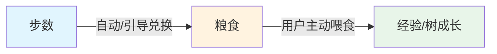
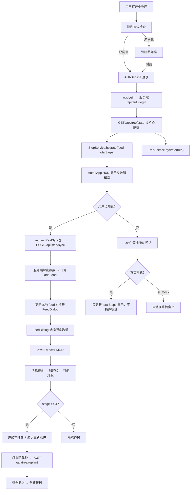
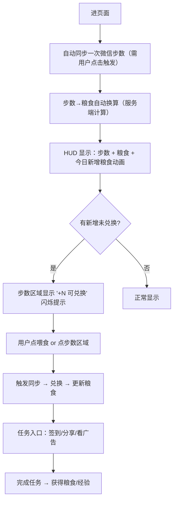

## 兑换和喂食解耦，挣钱和花钱

`2026-06-30`

> 有步数就必须兑换吗，兑换完就必须喂食吗。现在只有一个喂食按钮，这一步做了两件事吗，兑换和喂食吗


## 回答你的三个问题

### 问题 1：有步数就必须兑换吗？

**不是必须的，但当前设计是"有步数就应该兑换成粮食"的逻辑。**

实际上，步数和粮食是两个独立的资源：

```
步数（Steps）  ──兑换──→  粮食（Food）  ──喂食──→  经验（Exp）→ 树成长
```

步数是"原材料"，粮食是"加工后的道具"，喂食是"消耗道具换成长"。

**但当前代码有一个设计问题**：步数→粮食的兑换**不是自动的**，只在用户点击「喂食」按钮时才触发 `requestRealSync()`，也就是说：
- 你有 3000 步，但如果不点喂食，粮食永远是 0
- 步数不会"必须"兑换，而是"等你点喂食时才顺便兑换"

---

### 问题 2：兑换完就必须喂食吗？

**不是。** 兑换和喂食是两个独立的操作：

| 操作 | 做什么 | 触发时机 |
|------|--------|----------|
| **兑换** | 步数 → 粮食（存到 `user.food`） | 现在只在点「喂食」时才做 |
| **喂食** | 粮食 → 经验（存到 `tree.exp`） | 用户在 FeedDialog 里主动选数量确认 |

兑换后的粮食会**累积**在账户里，不喂食就一直存着，下次再喂。

---

### 问题 3：现在只有一个喂食按钮，这一步做了两件事吗？

**是的！这就是核心设计问题。** 让我用代码证据说明：

在 `HomeApp.ts` 的 `_onFeedClick`：

```typescript
private _onFeedClick() {
  if (StepService.isReal) {
    // ✅ 1. 先打开弹窗
    oops.gui.open(UIID.Feed);
    // ✅ 2. 后台异步同步步数（这一步做了"兑换"）
    StepService.requestRealSync(force).then((res) => { ... });
    return;
  }
  oops.gui.open(UIID.Feed);
}
```

然后在 `FeedDialog.ts` 的 `_onConfirm`：

```typescript
private _onConfirm() {
  // ✅ 3. 调用服务端喂食接口（这一步做了"喂食"）
  TreeApi.feed(count).then((resp) => {
    StepService.hydrate(resp.food, StepService.totalSteps);
    TreeService.hydrate(resp.tree);
  });
}
```

所以**点一次「喂食」按钮，实际上做了三件事**：
1. **打开弹窗**（UI 层）
2. **同步步数→兑换粮食**（`requestRealSync` → 服务端 `/api/step/sync`）
3. **确认喂食**（`TreeApi.feed` → 服务端 `/api/tree/feed`）

---

## 策划方案建议：把"兑换"和"喂食"分开

我认为合理的流程应该是这样：



**具体建议**：

| 操作 | 建议设计 |
|------|----------|
| **步数→粮食兑换** | 进页面时**引导用户点一下同步**，或者 HUD 步数区域显示"可兑换 N 粮食"，点一下就兑换 |
| **喂食** | 兑换完粮食后，用户**主动选择喂多少**，这才是真正的"喂食"操作 |
| **按钮拆分** | HUD 上步数区域变成可点击的"同步/兑换"入口，底部保留「喂食」按钮只做喂食 |

这样逻辑更清晰：**兑换是"赚钱"，喂食是"花钱"**，两件事不应该混在一个按钮里。


## 树方案

`2026-06-30`

> 方案一和方案二都是合理的，但是我想知道这是最好的策划方案吗，整个流程是合理的吗，步数转换成粮食，当前新增的步数呢，还是要有新增标志吧，后面接入签到任务、分享任务这些都怎么扩展呢


## 整体策划方案评估

### 一、当前流程梳理（完整版）



---

### 二、当前方案的核心问题

#### 问题 1：**步数→粮食的兑换触发机制不合理**

| | 当前逻辑 | 问题 |
|--|---------|------|
| **Mock 模式** | 自动换算 ✅ | 没问题 |
| **真实微信模式** | 只在点「喂食」时才触发 `requestRealSync()` | ❌ 用户不点喂食就永远不兑换 |

这导致了你看到的 **"3000 步但粮食 0"** 的现象。用户进了页面，看到有步数，但不知道要点喂食才能把步数换成粮食。

#### 问题 2：**没有"新增步数待兑换"的视觉反馈**

当前 HUD 只显示两个数字：
- `👣 步数：3000`
- `🍞 粮食：0`

用户完全不知道"这 3000 步里有多少已经换成粮食了，还有多少没换"。

#### 问题 3：**数据模型缺少"任务/奖励"扩展能力**

当前 `User` 表只有：
```sql
food, totalSteps, totalFeed, streakDays
```

如果要接入**签到、分享、看广告**等任务系统来获得粮食/经验，当前数据模型没有地方存：
- 任务完成记录
- 奖励领取状态
- 每日任务重置

---

### 三、推荐的策划方案（重新设计）

我认为合理的流程应该是这样的：

#### 方案核心思路：**步数自动兑换 + 新增步数高亮提示 + 任务系统可扩展**



#### 具体改动建议

**① 进页面时主动引导步数同步（解决 3000 步 0 粮食）**

微信限制：`wx.authorize` 和 `wx.getWeRunData` 必须在用户点击事件中触发。所以不能直接在 `onLoad` 里调。

**推荐做法**：进页面后弹一个轻量的引导气泡/"点击同步步数"按钮，或者在 HUD 步数区域显示一个 **"点击同步"** 的提示。用户点一下就触发同步，之后步数和粮食就都对得上了。

**② HUD 增加"今日新增"视觉表示**

在步数旁边加一个 **"+12 待兑换"** 的小标签（黄色/绿色高亮），表示这些步数对应的粮食还没兑换。兑换后就消失。

具体可以计算：`今日新增步数 = todaySteps - lastSyncTodaySteps`，然后 `待兑换粮食 = Math.floor(新增步数 / stepPerFood)`。

**③ 数据模型扩展（为签到/分享/任务系统做准备）**

建议在 `User` 模型里加几个字段，或者新建一张 `task_log` 表：

```sql
-- 方案 A：User 表加字段（简单任务够用）
ALTER TABLE user ADD COLUMN lastSignInDay VARCHAR(16) DEFAULT '';  -- 上次签到日期
ALTER TABLE user ADD COLUMN totalShareCount INT DEFAULT 0;          -- 累计分享次数

-- 方案 B：新建 task_log 表（推荐，扩展性强）
CREATE TABLE task_log (
  id INT PRIMARY KEY AUTO_INCREMENT,
  userId INT NOT NULL,
  taskType VARCHAR(32) NOT NULL,   -- 'sign_in', 'share', 'watch_ad', 'invite'
  day VARCHAR(16) NOT NULL,        -- YYYYMMDD
  rewardType VARCHAR(32),          -- 'food', 'exp'
  rewardAmount INT,
  createdAt DATETIME,
  UNIQUE KEY uk_user_task_day (userId, taskType, day)
);
```

**④ 任务系统的设计思路**

```
任务类型          获得奖励           重置周期
─────────────────────────────────────────────
每日签到          +3 粮食            每天
分享给好友        +5 粮食            每天 1 次
看广告            +2 粮食            每天 3 次
邀请新用户        +20 粮食           永久
连续打卡 7 天     解锁专属勋章        永久
```

这些任务都往 `task_log` 表里写记录，`taskType + day` 做唯一键防止重复领取。

---

### 四、总结：当前方案是否合理？

| 维度 | 评价 | 建议 |
|------|------|------|
| **步数→粮食兑换触发** | ❌ 不合理，依赖用户主动点喂食 | 进页面引导同步 + HUD 提示待兑换 |
| **新增步数视觉表示** | ❌ 完全没有 | HUD 加"待兑换"标签 |
| **数据模型扩展性** | ⚠️ 基本够用但缺任务系统 | 加 `task_log` 表 |
| **喂食→经验→升级** | ✅ 合理 | 无需改动 |
| **重新栽种流程** | ✅ 合理 | 无需改动 |
| **勋章系统** | ✅ 合理 | 无需改动 |

---

你想让我按这个方向改代码吗？我建议分两步：
1. **先修复核心体验问题**：进页面引导步数同步 + HUD 显示待兑换粮食
2. **再扩展数据模型**：加 `task_log` 表，接入签到/分享任务
