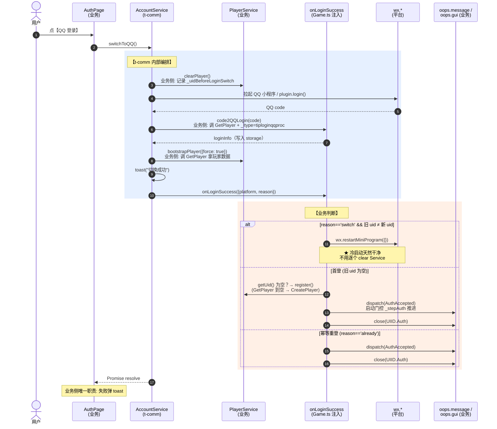
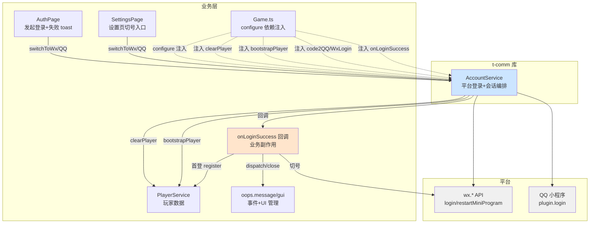
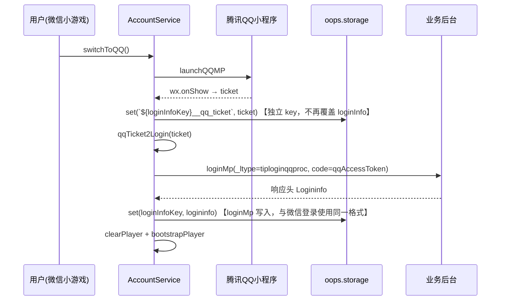
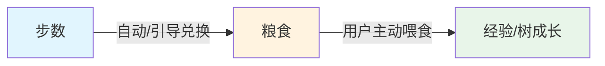
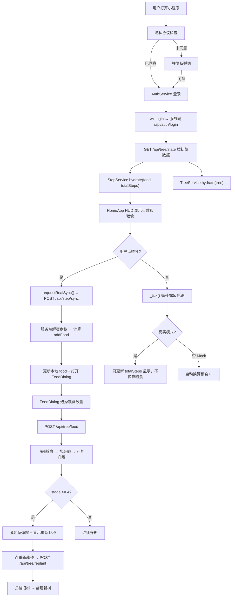
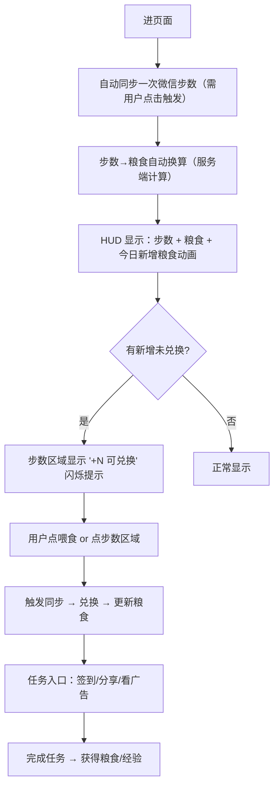

## 流水线里JS插件获取凭证

`2026-07-08`

```js
const sdk = require('@tencent/nodejs_atom_sdk');
const credential = await sdk.getCredential('ygw_git_woa_private_token')

console.log('credential', credential?.password)
```

Git 地址: https://git.aow.com/bkdevops/nodejs_atom_sdk

## 下蛋后喂食饱和度的归零时机

`2026-07-08`

> 我想让下蛋之后不立即进行喂食饱和度的归0，这里是不是 `assets/scripts/module/goose/view/HudPresenter.ts` 在 `this._refreshSatietyFromPet(pet ?? undefined); `这里加个延迟最简单最佳，还是有其他更好的方式


我先看下 HudPresenter 和相关的饱和度刷新链路，判断加延迟的最佳位置。
先梳理下下蛋触发链路，看 satiety 归 0 究竟是在哪一步发生的：
链路清楚了：

- **feed**（喂食）→ 后端返回 `satiety=100` → dispatch `PetFed` → HudPresenter 立刻把喂饱进度条拉满 ✅
- **layEgg**（下蛋接口）→ 后端返回 `satiety=0` + `canLayEgg=false` → dispatch `PetLayedEgg` → HudPresenter 立即把进度条清零 ← **你想延后的就是这一刻**
- 然后 `Game._installLayEggWatcher` 播 spine 动画 → 打开 `LayEggDialog` 弹窗展示蛋

## 你的方案（在 `_refreshSatietyFromPet` 加延迟）——不推荐

**问题**：
1. `_refreshSatietyFromPet` 是**共享入口**，不止 `PetLayedEgg` 会调，`PetFed`/`PetAdopted`/`PetInfoLoaded` 也调它。全都加延迟会让"喂完立刻满格"的正反馈也变慢，体验反而变差。
2. 就算按事件类型做条件延迟，也是"表现问题混进数据刷新层"，`HudPresenter` 本身职责单一（把 pet 数据渲染到进度条），一旦掺延迟就得管定时器、防抖、pet 被覆盖等一堆边界。
3. 后续如果再来一个 `PetInfoLoaded`（比如 `Game._installLayEggWatcher` 里的 `PetService.ins.refresh()`），会覆盖延迟里的旧值，还得加锁。

## 更好的方案（3 选 1）

### 方案 A（推荐）：`PetLayedEgg` 事件不刷 HudPresenter，让"归零"跟着弹窗关闭走

改动最小，语义最干净：

```typescript
// HudPresenter.subscribe 去掉 PetLayedEgg 订阅
// 改为监听 GuideReturnedHome（LayEggDialog.hide 时派发）
oops.message.on(EventName.GuideReturnedHome, this._onPetEvent, this);
```

时序变成：feed → 进度条满 → 播动画 → 弹 LayEgg → 用户点关闭 → **弹窗 hide 派发 `GuideReturnedHome`** → HudPresenter 才刷新 → 满格丝滑掉到 0。视觉上"看到蛋落地了再看到饱食度归零"，符合直觉。

### 方案 B：在 HudPresenter 里对 `PetLayedEgg` 单独做延时

只针对下蛋事件加延迟，其他保持即时：

```typescript
subscribe() {
    // 其他事件保持即时
    oops.message.on(EventName.PetFed, this._onPetEvent, this);
    oops.message.on(EventName.PetAdopted, this._onPetEvent, this);
    oops.message.on(EventName.PetInfoLoaded, this._onPetEvent, this);
    // 下蛋独立走延时通道
    oops.message.on(EventName.PetLayedEgg, this._onLayedEgg, this);
}

/** 下蛋后 satiety=0 归零动画延后到弹窗关闭之后 */
private _onLayedEgg = (payload?: any) => {
    const pet = payload?.pet as PetState | undefined;
    // 沿用 Game._LAY_EGG_MOMENT_DELAY_MS + _EGG_RESULT_DELAY_MS + 弹窗 3s = ~5s
    const DELAY_MS = 5000;
    setTimeout(() => this._refreshSatietyFromPet(pet ?? undefined), DELAY_MS);
};
```

**缺点**：延迟是拍脑袋值，跟 `Game.ts` 的 `_LAY_EGG_MOMENT_DELAY_MS`/`_EGG_RESULT_DELAY_MS`/`AUTO_CLOSE_SECONDS` 会散落多处，改一处忘一处就错位。

### 方案 C：Tween 补间"缓慢降到 0"

把归零改成一个 800ms 的补间动画（进度条从 100% 平滑降到 0%），有下蛋"付出"的语言。改动量最大但视觉最好，如果你在意"能看到饱食度慢慢消耗"，可以做。

---

## 我的建议

**上方案 A**。理由：
- `LayEggDialog.hide()` 已经派发了 `GuideReturnedHome`（引导用），刚好复用；不用引入 timer/魔法数字
- HudPresenter 保持"纯数据驱动"，不长脏心；`Game._installLayEggWatcher` 的时序也不用碰
- 用户体验最自然：**看到蛋 → 关掉弹窗 → 才发现鹅饿了**（与"下蛋消耗体力"的心智模型一致）

唯一副作用：如果用户在 layEgg 接口回来后、弹窗关闭前刷新页面，本地快照已经是 `satiety=0`，重进后进度条会直接是 0——这跟服务端权威一致，属于正确行为，不算问题。

要我按方案 A 直接改吗？

## 登录系统

`2026-07-07`


# 职责分离评估 + Mermaid 图

回到你的核心问题："t-comm 和业务的职责是否分离、界限是否清晰"。

## 一句话结论

**清晰但不完美**。t-comm 负责"平台登录 + 玩家数据加载"，业务负责"业务副作用（AuthAccepted、UIID.Auth 关闭、首登注册、切号重启）"，边界是 `configure()` 的依赖注入接口。有一个**灰色地带**（下面会指出）。

---

## 职责划分表

| 层 | 职责 | 具体动作 |
|---|---|---|
| **t-comm（AccountService）** | 平台登录 + 会话协调 | 拉起 QQ 小程序 / wx.login、写 loginInfo storage、切平台前后 clearPlayer / bootstrapPlayer 编排、成功后 toast 提示、幂等判断（already vs switch） |
| **业务（Game.configure 注入）** | 平台无关的业务副作用 | `clearPlayer`（PlayerService 清缓存）、`bootstrapPlayer`（GetPlayer）、`onLoginSuccess`（重启 or 派 AuthAccepted + close Auth + 首登 register）、`code2QQLogin` / `code2WxLogin`（业务后台登录 URL）、`toast`（业务的 ToastTip） |
| **业务（AuthPage）** | 只负责"发起登录 + 失败 toast" | `switchToWx()` / `switchToQQ()` 各一行 |

---

## 完整时序图（Mermaid）



---

## 组件依赖 & 职责边界图



---

## 边界评估

### ✅ 清晰的部分

1. **AuthPage 极简**：只做 `switchToXx()` + 失败 toast，无任何业务副作用。加新登录入口（设置页/引导页）零成本。
2. **t-comm 零业务耦合**：不感知 `AuthAccepted` 事件、不感知 `UIID.Auth`、不感知 `PlayerService.register`。这些通过 `configure` 注入。
3. **业务副作用统一入口**：所有登录成功后的收尾（重启、派事件、关页面、首登注册）都收敛在 `onLoginSuccess` 一个函数。
4. **依赖倒置**：t-comm 定义**接口**（`clearPlayer` / `bootstrapPlayer` / `onLoginSuccess`），业务实现。t-comm 不 `import` 任何业务代码。

### ⚠️ 灰色地带（值得记一笔）

1. **切号重启依赖 t-comm 的 `reason` 语义**：`onLoginSuccess` 里 `reason === 'switch'` 是 t-comm 3.3.16+ 的约定。如果 t-comm 未来把 reason 类型改成别的（比如加个 `'refresh'`），业务侧要跟着升级。
2. **`_uidBeforeLoginSwitch` 隐式依赖 t-comm 时序**：业务在 `clearPlayer` 回调里记录旧 uid，前提是 t-comm **保证** `clearPlayer → code2XxLogin → bootstrapPlayer → onLoginSuccess` 的顺序。这是**约定**不是**契约**，t-comm 内部重构可能破坏。**mitigation**：可在 t-comm 的 `onLoginSuccess` 参数里加个 `oldUid`（我提个建议），业务就不用自己 hook 时序。
3. **两套切号刷新逻辑并存**：
   - 新路径：`onLoginSuccess` → `wx.restartMiniProgram`（切号 = 重启）
   - 旧路径：`_installAccountSwitchWatcher` 监听 `LoginSuccess` 事件 → 逐个 `Service.clear() + refresh()`
   - 目前的角色：新路径**主用**，旧路径**兜底**（非小游戏环境 / restartMiniProgram 失败）。等 QA 验证稳定后可以直接删旧路径（我建议列到 TODO）。

### 🔧 可选的进一步收敛（当前不建议动，仅提示）

- **`_installAccountSwitchWatcher` 大瘦身**：因为新路径切号时会重启，不重启的场景（"进程首次登录"）本来就不算切号，watcher 里的 `Service.clear()` 分支基本用不到了。可以缩到"只保留非小游戏兜底 + AccountSwitched 事件派发"。等 QA 稳定后再动。

---

## 关于"卡了"

刚才没卡——是 tool 调用之间正常的间隔。改动已完成：

**变更文件**
- `assets/scripts/Game.ts`：
  - 新增 `_uidBeforeLoginSwitch` 静态字段（保存切号前的旧 uid）
  - `clearPlayer` 改为"记录旧 uid → clear"两步
  - `onLoginSuccess` 加"切号 → wx.restartMiniProgram" 前置分支（reason==='switch' + uid 变化）
  - 非小游戏环境自动降级到原有的 in-place 刷新路径

**行为对比**

| 场景 | reason | 旧 uid | 新 uid | 动作 |
|---|---|---|---|---|
| AuthPage 首次登录（微信/QQ） | switch | '' | 'abc' | 派 AuthAccepted + close Auth（不重启） |
| 已登录状态在设置页切换到另一个平台 | switch | 'abc' | 'def' | **wx.restartMiniProgram()** |
| 幂等重登（业务方调 switchToQQ 但已是 QQ） | already | 'abc' | 'abc' | 派 AuthAccepted + close Auth（不重启） |
| 微信开发者工具 / 非小游戏环境切号 | switch | 'abc' | 'def' | 降级：走 in-place 刷新（旧 watcher） |


## 登录优化

`2026-07-07`


## 完成总结

按你的指令假装 t-comm 3.3.16+ 已升级，把「AuthAccepted + close」下沉到 `AccountService.configure({ onLoginSuccess })`。

### 变更文件

#### 1. `assets/scripts/Game.ts`（AccountService.configure 新增 onLoginSuccess）

```208:225:assets/scripts/Game.ts
        onLoginSuccess: ({ platform, reason }) => {
          oops.log.logBusiness(`[Game] onLoginSuccess platform=${platform} reason=${reason}`);
          // 用 void IIFE 包一层：AccountService 签名是 () => void，不 await 也不 throw
          void (async () => {
            // 兜底：登录成功但本游戏未注册（首登 QQ / 首登微信）→ 走 CreatePlayer
            if (!PlayerService.ins.getUid()) {
              try {
                await PlayerService.ins.register();
              } catch (e) {
                oops.log.error('[Game] onLoginSuccess 首登 register 失败：', e);
                return; // register 失败不派 AuthAccepted，让用户在登录页看到 toast 后可重试
              }
            }
            oops.message.dispatch(EventName.AuthAccepted);
            // 关闭登录页：登录页没打开时 close 是 no-op，切号场景（设置页 → QQ）不受影响
            void oops.gui.close(UIID.Auth);
          })();
        },
```

#### 2. `assets/scripts/module/auth/view/AuthPage.ts`（登录方法极简化）

**微信登录**：从 `register + dispatch + close + toast` 收敛到 `switchToWx()`
**QQ 登录**：从「wasQQ 兜底 + bootstrap + register + dispatch + close」收敛到 `switchToQQ()`

```395:410:assets/scripts/module/auth/view/AuthPage.ts
  private async _onWechatLogin(): Promise<void> {
    if (this._busy) return;
    this._busy = true;
    try {
      await AccountService.ins.switchToWx();
    } catch (e: any) {
      oops.log.error('[AuthPage] 微信登录失败：', e);
      const tip = e?.msg || e?.err_msg || e?.err_desc || e?.message || '授权失败，请重试';
      // ★ 直接用 ToastTip.show 而不是 ShowToast 事件：
      //   AuthPage 出现在启动 Boot 阶段，此时 GooseHomeApp 还没初始化，
      //   没有监听 ShowToast 事件，走事件派发 toast 不会显示。
      ToastTip.show(tip);
    } finally {
      this._busy = false;
    }
  }
```

```421:433:assets/scripts/module/auth/view/AuthPage.ts
  private async _onQqLogin(): Promise<void> {
    if (this._busy) return;
    this._busy = true;
    try {
      await AccountService.ins.switchToQQ();
    } catch (e: any) {
      oops.log.error('[AuthPage] QQ 登录拉起失败：', e);
      const tip = e?.msg || e?.err_msg || e?.message || 'QQ 登录拉起失败，请稍后重试';
      ToastTip.show(tip);
    } finally {
      this._busy = false;
    }
  }
```

同时清理了 4 个 unused import：`UIID` / `EventName` / `PlayerService` / `isQQAccount`。

### 收敛后的调用链

```
用户点【QQ登录】/ 【微信登录】
   │
   ▼
AccountService.switchToQQ/Wx()   ← 业务侧就这一行
   │
   ▼ 【t-comm 内部】
_finishLoginOk(platform, reason)
   ├─ clearPlayer()
   ├─ bootstrapPlayer({ force: true })
   ├─ toast(switchXxSuccess)
   └─ onLoginSuccess({ platform, reason })   ← 回到业务侧
        │
        ▼ 【Game.ts 里注入的回调】
        ├─ 若 !getUid() → register()      // 首登本游戏兜底
        ├─ dispatch(AuthAccepted)         // 启动门控推进
        └─ close(UIID.Auth)                // 登录页收尾
```

### 收益

| 维度 | 之前 | 之后 |
|---|---|---|
| AuthPage 登录方法 | 微信 4 行 / QQ 8 行（含 wasQQ 兜底、bootstrap、register） | 各 1 行 `switchToXx()` |
| 登录成功收尾散落位置 | 每个登录入口自己处理 | 全局唯一入口 `onLoginSuccess` |
| 未来新增登录入口（如设置页） | 得在业务方重复"AuthAccepted + close" 逻辑 | 全部自动继承 `onLoginSuccess` |
| 首登本游戏 CreatePlayer | 每个入口自己 try register | 统一在 onLoginSuccess 兜底 |

### 关注点

- **`AuthAccepted` 每次登录都派**：切号场景（设置页触发 switchToWx/QQ）也会派 AuthAccepted，但启动门控 `_stepAuth` 是**一次性**监听（一旦推进就不再关心），登录后再收到没有副作用
- **`close(UIID.Auth)` 幂等**：登录页没打开时 close 是 no-op（`LayerManager.close` 会查表跳过），切号场景不会误关任何页面
- **`register()` 兜底的意义**：t-comm 的 `bootstrapPlayer` 只调 GetPlayer 拿玩家数据，如果本游戏首登（后端还没有 player 记录），需要业务侧调 CreatePlayer。这个兜底放在 `onLoginSuccess` 里，任何登录入口（登录页/设置页/引导页）都受益

### 变更文件清单

- `/Users/guowangyang/Documents/git-woa/cocos-game/assets/scripts/Game.ts`：新增 `onLoginSuccess` 依赖注入，含首登 register 兜底 + AuthAccepted 派发 + close UIID.Auth
- `/Users/guowangyang/Documents/git-woa/cocos-game/assets/scripts/module/auth/view/AuthPage.ts`：`_onWechatLogin` 和 `_onQqLogin` 简化到只做 `switchToXx()` + 错误 toast；清理 4 个 unused import


## isInGitRepo 问题

`2026-07-07`


## 问题定位

**`isInGitRepo` 本身没有问题**。GitHub CI 用 `actions/checkout` 拉代码后目录里是有 `.git` 的，所以 `isInGitRepo()` 返回 `true` 是**正确**的判断——它不是报错的根源。

真正刷屏的根源是 `execCommand` 里这一行（`src/node/node-command.ts:62`）：

```62:62:src/node/node-command.ts
    console.log('[execCommand] error: ', err);
```

即命令一旦失败，**无条件** `console.log` 打印整个 Error 堆栈。

### 为什么 CI 里会疯狂触发

`isInGitRepo` 放行后，`getGitCurBranch` / `getGitAuthor` 会真的去执行 git 命令，而 CI 环境下这两条命令天然会失败（退出码非 0）：

1. `git symbolic-ref --short -q HEAD`：`actions/checkout` 默认是 **detached HEAD**（checkout 到具体 commit 而非分支），此时该命令退出码为 1。注意 `-q` 只抑制 git 自身的 stderr，**不改变退出码**。
2. `git config user.name`：CI 里通常没配 `user.name`，退出码为 1。

虽然 `git.ts` 里给这两处传了 `stdio: ['ignore','pipe','ignore']` 忽略 git 的 stderr，但 `execSync` 仍会因退出码非 0 抛出 JS 异常 → 被 `execCommand` 的 `catch` 捕获 → `console.log` 把堆栈打出来。截图里的 `[execCommand] error: ...` 正是这行打印的（不是真的 crash）。

> 补充：截图堆栈里是 `t-comm@3.3.3`（旧版本，那会儿还没加 `isInGitRepo` 保护），但即使升级到当前 `3.3.14`，只要走到 git 命令失败，这行 `console.log` 依然会刷屏。

## 修复

`execCommand` 的设计语义就是「失败时静默返回空字符串」（`throwError` 默认 `false`），那就不该无条件打印。改成仅在需要抛错或显式开启 debug 时才打印：
## 总结

**`isInGitRepo` 没问题**，别改它——CI 里确实在 git 仓库内，它返回 `true` 是对的。

真正的刷屏根源是 `execCommand` 在命令失败时**无条件 `console.log` 打印错误堆栈**。而 CI 环境下有两条 git 命令必然失败：
- `git symbolic-ref --short -q HEAD` → GitHub checkout 默认 detached HEAD，退出码非 0
- `git config user.name` → CI 未配置用户名，退出码非 0

已做的修复（`src/node/node-command.ts`）：把无条件 `console.log` 改为
- `throwError=true` 时才 `throw`（原有行为保留）
- 仅当设置了 `T_COMM_DEBUG` 环境变量时才打印

这样默认「失败静默返回空字符串」的语义得以贯彻，CI 里不再刷屏，同时需要排查时可以 `T_COMM_DEBUG=1` 打开日志。lint 已通过。

如果你还想更干净，可以顺带在 `getGitCommitInfo` 里给 `git log` 那条命令也加 `stdio: ['ignore','pipe','ignore']`（目前它没传 stdio，空仓库/无 commit 时同样会经过这个 catch，不过现在已经静默了，影响不大）。需要的话我再补。


## 登录切换

`2026-06-30`


## 改动计划

### 1. `tx-t-comm/src/qq-mp/types.ts`
- 给 `HandleQQLoginOnShowOptions` 添加专门的 **票据 storage key**（与 loginInfo key 分离）。
- 给 `AccountServiceDeps` 增加可选注入 `qqTicket2Login?: (ticket: QQTicketInfo) => Promise<unknown> | unknown`。
- 给 `clearQQTicketInfo` / `readQQTicketInfo` 也用同样的票据 key。

### 2. `tx-t-comm/src/qq-mp/AccountService.ts`
- `_onWxShow` 用独立的票据 key 写票据，**不再覆盖** `loginInfoStorageKey`。
- `_consumeQQTicket` 优先调用 `deps.qqTicket2Login`（业务侧用 `loginMp(_ltype=tiploginqqproc, code=qqAccessToken)` 实现），fallback 到原 `queryQQLoginUserInfo`。
- `clearWxLoginStorageIfQQEnv` 的 `isWxLoggedIn` / 后续 `clearQQTicketInfo` 都用新的票据 key。

### 3. `cocos-game/assets/scripts/Game.ts`
- 注入 `qqTicket2Login`，复用现有 `loginMp` 路径，把 QQ access_token 当 code 走 `_ltype=tiploginqqproc`。

我先把当前实际相关文件再读一下，避免基于过期内容编辑（特别是 `qq-mini-plugin.ts` 的 `clearWxLoginStorageIfQQEnv` 形参，以及 `AccountService.spec.ts` 现状）。

现在所有上下文都齐全。我注意到几个重要细节：

1. `loginMp` 已经原生支持 `code` 参数透传 + `_ltype=tiploginqqproc` —— **正好可以接 QQ access_token**（虽然这里 `code` 是泛指，业务后台 `tiploginqqproc` 路径吃的就是票据信息）。
2. `AccountService.spec.ts` 当前对 `switchToWx` 的微信宿主分支断言依然是 "传 `loginInfoStorageKey` 给 `clearQQTicketInfo`"，方案 A 后这里要改为新的 ticket key。

为了**最小破坏性**，我做以下设计：

- 给 `HandleQQLoginOnShowOptions` 新增一个**必填** `storageKey`（票据 key），**不再**和 loginInfoKey 共用。
- 但 `clearQQTicketInfo` / `readQQTicketInfo` 已经接收 `storageKey` 参数，调用方传啥用啥；保持签名不动。
- `AccountServiceDeps`：
  - 新增 `qqTicketStorageKey?: string`，默认 `${loginInfoStorageKey}__qq_ticket`。
  - 新增可选 `qqTicket2Login?: (ticket) => Promise|unknown`。
- `AccountService` 内：
  - `_onWxShow` 用 `qqTicketStorageKey` 写票据（不会再覆盖 loginInfo）。
  - `_consumeQQTicket` 优先调 `qqTicket2Login`（成功则视同登录成功），否则 fallback 到原 `queryQQLoginUserInfo`。
  - `clearWxLoginStorageIfQQEnv.clearStorage` 同时清 `loginInfoStorageKey` 与 `qqTicketStorageKey`。
  - `switchToWx` 里清 QQ 票据时用 `qqTicketStorageKey`（之前用的就是 loginInfo key，是 bug）。

下面执行修改。`AccountService.ts` 是大文件但还能用 multi_replace；先改 `types.ts`。

现在改 `AccountService.ts`：增加 `qqTicketStorageKey` 与 `qqTicket2Login` 依赖，调整 `handleAppOnLaunch` / `_onWxShow` / `_consumeQQTicket` / `switchToWx` / `_switchToWxViaCode`。

同步更新 `AccountService.spec.ts` 的几处期望（switchToWx 用票据 key、onShow 写入用票据 key、新增 qqTicket2Login 用例）。

注意原测试里有一处 `it('switchToWx 成功路径...')` 对 `clearQQTicketInfo` 的期望我已改为 `'login_info__qq_ticket'`。但要再次确认我刚才修改的位置都是预期的（避免被同字符串多处替换）—— `multi_replace` 不指定 `replace_all` 默认只改一处，前面两处都是不同的上下文，OK。

接下来修改 `cocos-game/Game.ts` 注入 `qqTicket2Login`。


最后跑一下相关单测，确认改动正确。

---

## 改动总结

### 涉及文件

| 文件 | 关键改动 |
|---|---|
| `src/qq-mp/types.ts` | `HandleQQLoginOnShowOptions.storageKey` 加注释强调要与 loginInfo key 分离 |
| `src/qq-mp/AccountService.ts` | ① 新增可选依赖 `qqTicketStorageKey`（默认 `${loginInfoStorageKey}__qq_ticket`）<br>② 新增可选依赖 `qqTicket2Login(ticket)`<br>③ `_onWxShow` 用独立的票据 key 写入，**不再覆盖** loginInfo<br>④ `_consumeQQTicket` 优先调用 `qqTicket2Login`（业务方用 `loginMp` 实现），fallback 到旧 `queryQQLoginUserInfo`<br>⑤ `clearWxLoginStorageIfQQEnv.clearStorage` 同时清两 key<br>⑥ `switchToWx` / `_switchToWxViaCode` 清 QQ 票据时使用票据 key |
| `test/qq-mp/AccountService.spec.ts` | 同步更新 clearStorage / clearQQTicketInfo 的 key 期望；新增 票据写 key、`qqTicket2Login` 成功/失败 用例 |
| `cocos-game/assets/scripts/Game.ts` | 注入 `qqTicket2Login: ticket => loginMp({ _ltype: 'tiploginqqproc', code: ticket.qqAccessToken, ... })` |

### 修复后的微信宿主下 QQ 登录流程



### 解决了你提到的两个根因

1. **存储被覆盖**：QQ 票据现在落到独立 key `${loginInfoStorageKey}__qq_ticket`，不会再把 `loginMp` 写入的 loginInfo 顶掉。
2. **登录写入路径不一致**：微信宿主下也走 `loginMp(_ltype=tiploginqqproc)`，与 QQ App 直达路径、微信登录路径**统一**走 `Logininfo` header → `oops.storage[loginInfoStorageKey]`，业务下游读取登录态的逻辑不需要再为 QQ 路径做特殊兼容。

### 兼容性

- `qqTicket2Login` 与 `qqTicketStorageKey` 都是可选项，**未注入时不会破坏现有调用方**（fallback 到旧 `queryQQLoginUserInfo` 路径）。
- `cocos-game` 同步注入了 `qqTicket2Login`，立即生效。

## 兑换和喂食解耦，挣钱和花钱

`2026-06-30`

> 有步数就必须兑换吗，兑换完就必须喂食吗。现在只有一个喂食按钮，这一步做了两件事吗，兑换和喂食吗


### 回答你的三个问题

#### 问题 1：有步数就必须兑换吗？

**不是必须的，但当前设计是"有步数就应该兑换成粮食"的逻辑。**

实际上，步数和粮食是两个独立的资源：

```
步数（Steps）  ──兑换──→  粮食（Food）  ──喂食──→  经验（Exp）→ 树成长
```

步数是"原材料"，粮食是"加工后的道具"，喂食是"消耗道具换成长"。

**但当前代码有一个设计问题**：步数→粮食的兑换**不是自动的**，只在用户点击「喂食」按钮时才触发 `requestRealSync()`，也就是说：
- 你有 3000 步，但如果不点喂食，粮食永远是 0
- 步数不会"必须"兑换，而是"等你点喂食时才顺便兑换"

---

#### 问题 2：兑换完就必须喂食吗？

**不是。** 兑换和喂食是两个独立的操作：

| 操作 | 做什么 | 触发时机 |
|------|--------|----------|
| **兑换** | 步数 → 粮食（存到 `user.food`） | 现在只在点「喂食」时才做 |
| **喂食** | 粮食 → 经验（存到 `tree.exp`） | 用户在 FeedDialog 里主动选数量确认 |

兑换后的粮食会**累积**在账户里，不喂食就一直存着，下次再喂。

---

#### 问题 3：现在只有一个喂食按钮，这一步做了两件事吗？

**是的！这就是核心设计问题。** 让我用代码证据说明：

在 `HomeApp.ts` 的 `_onFeedClick`：

```typescript
private _onFeedClick() {
  if (StepService.isReal) {
    // ✅ 1. 先打开弹窗
    oops.gui.open(UIID.Feed);
    // ✅ 2. 后台异步同步步数（这一步做了"兑换"）
    StepService.requestRealSync(force).then((res) => { ... });
    return;
  }
  oops.gui.open(UIID.Feed);
}
```

然后在 `FeedDialog.ts` 的 `_onConfirm`：

```typescript
private _onConfirm() {
  // ✅ 3. 调用服务端喂食接口（这一步做了"喂食"）
  TreeApi.feed(count).then((resp) => {
    StepService.hydrate(resp.food, StepService.totalSteps);
    TreeService.hydrate(resp.tree);
  });
}
```

所以**点一次「喂食」按钮，实际上做了三件事**：
1. **打开弹窗**（UI 层）
2. **同步步数→兑换粮食**（`requestRealSync` → 服务端 `/api/step/sync`）
3. **确认喂食**（`TreeApi.feed` → 服务端 `/api/tree/feed`）

---

### 策划方案建议：把"兑换"和"喂食"分开

我认为合理的流程应该是这样：



**具体建议**：

| 操作 | 建议设计 |
|------|----------|
| **步数→粮食兑换** | 进页面时**引导用户点一下同步**，或者 HUD 步数区域显示"可兑换 N 粮食"，点一下就兑换 |
| **喂食** | 兑换完粮食后，用户**主动选择喂多少**，这才是真正的"喂食"操作 |
| **按钮拆分** | HUD 上步数区域变成可点击的"同步/兑换"入口，底部保留「喂食」按钮只做喂食 |

这样逻辑更清晰：**兑换是"赚钱"，喂食是"花钱"**，两件事不应该混在一个按钮里。


## 树方案

`2026-06-30`

> 方案一和方案二都是合理的，但是我想知道这是最好的策划方案吗，整个流程是合理的吗，步数转换成粮食，当前新增的步数呢，还是要有新增标志吧，后面接入签到任务、分享任务这些都怎么扩展呢


### 整体策划方案评估

#### 一、当前流程梳理（完整版）



---

#### 二、当前方案的核心问题

##### 问题 1：**步数→粮食的兑换触发机制不合理**

| | 当前逻辑 | 问题 |
|--|---------|------|
| **Mock 模式** | 自动换算 ✅ | 没问题 |
| **真实微信模式** | 只在点「喂食」时才触发 `requestRealSync()` | ❌ 用户不点喂食就永远不兑换 |

这导致了你看到的 **"3000 步但粮食 0"** 的现象。用户进了页面，看到有步数，但不知道要点喂食才能把步数换成粮食。

##### 问题 2：**没有"新增步数待兑换"的视觉反馈**

当前 HUD 只显示两个数字：
- `👣 步数：3000`
- `🍞 粮食：0`

用户完全不知道"这 3000 步里有多少已经换成粮食了，还有多少没换"。

##### 问题 3：**数据模型缺少"任务/奖励"扩展能力**

当前 `User` 表只有：
```sql
food, totalSteps, totalFeed, streakDays
```

如果要接入**签到、分享、看广告**等任务系统来获得粮食/经验，当前数据模型没有地方存：
- 任务完成记录
- 奖励领取状态
- 每日任务重置

---

#### 三、推荐的策划方案（重新设计）

我认为合理的流程应该是这样的：

##### 方案核心思路：**步数自动兑换 + 新增步数高亮提示 + 任务系统可扩展**



##### 具体改动建议

**① 进页面时主动引导步数同步（解决 3000 步 0 粮食）**

微信限制：`wx.authorize` 和 `wx.getWeRunData` 必须在用户点击事件中触发。所以不能直接在 `onLoad` 里调。

**推荐做法**：进页面后弹一个轻量的引导气泡/"点击同步步数"按钮，或者在 HUD 步数区域显示一个 **"点击同步"** 的提示。用户点一下就触发同步，之后步数和粮食就都对得上了。

**② HUD 增加"今日新增"视觉表示**

在步数旁边加一个 **"+12 待兑换"** 的小标签（黄色/绿色高亮），表示这些步数对应的粮食还没兑换。兑换后就消失。

具体可以计算：`今日新增步数 = todaySteps - lastSyncTodaySteps`，然后 `待兑换粮食 = Math.floor(新增步数 / stepPerFood)`。

**③ 数据模型扩展（为签到/分享/任务系统做准备）**

建议在 `User` 模型里加几个字段，或者新建一张 `task_log` 表：

```sql
-- 方案 A：User 表加字段（简单任务够用）
ALTER TABLE user ADD COLUMN lastSignInDay VARCHAR(16) DEFAULT '';  -- 上次签到日期
ALTER TABLE user ADD COLUMN totalShareCount INT DEFAULT 0;          -- 累计分享次数

-- 方案 B：新建 task_log 表（推荐，扩展性强）
CREATE TABLE task_log (
  id INT PRIMARY KEY AUTO_INCREMENT,
  userId INT NOT NULL,
  taskType VARCHAR(32) NOT NULL,   -- 'sign_in', 'share', 'watch_ad', 'invite'
  day VARCHAR(16) NOT NULL,        -- YYYYMMDD
  rewardType VARCHAR(32),          -- 'food', 'exp'
  rewardAmount INT,
  createdAt DATETIME,
  UNIQUE KEY uk_user_task_day (userId, taskType, day)
);
```

**④ 任务系统的设计思路**

```
任务类型          获得奖励           重置周期
─────────────────────────────────────────────
每日签到          +3 粮食            每天
分享给好友        +5 粮食            每天 1 次
看广告            +2 粮食            每天 3 次
邀请新用户        +20 粮食           永久
连续打卡 7 天     解锁专属勋章        永久
```

这些任务都往 `task_log` 表里写记录，`taskType + day` 做唯一键防止重复领取。

---

#### 四、总结：当前方案是否合理？

| 维度 | 评价 | 建议 |
|------|------|------|
| **步数→粮食兑换触发** | ❌ 不合理，依赖用户主动点喂食 | 进页面引导同步 + HUD 提示待兑换 |
| **新增步数视觉表示** | ❌ 完全没有 | HUD 加"待兑换"标签 |
| **数据模型扩展性** | ⚠️ 基本够用但缺任务系统 | 加 `task_log` 表 |
| **喂食→经验→升级** | ✅ 合理 | 无需改动 |
| **重新栽种流程** | ✅ 合理 | 无需改动 |
| **勋章系统** | ✅ 合理 | 无需改动 |

---

你想让我按这个方向改代码吗？我建议分两步：
1. **先修复核心体验问题**：进页面引导步数同步 + HUD 显示待兑换粮食
2. **再扩展数据模型**：加 `task_log` 表，接入签到/分享任务
