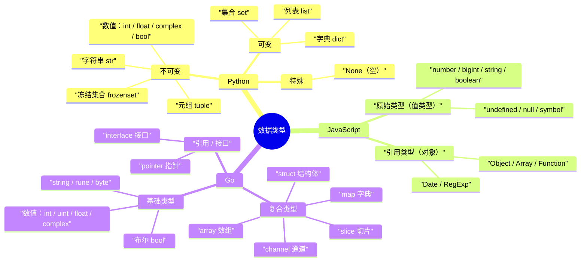

# Go 开发环境与工具

## 环境变量

### GOROOT

GOROOT 是 Go 语言的安装目录。通常情况下，使用官方安装包安装后，这个变量会自动设置。你可以通过以下命令查看：

```bash
go env GOROOT
```

一般情况下，你不需要手动设置 GOROOT，除非你有特殊需求（比如同时安装多个 Go 版本）。

### GOPATH

GOPATH 是 Go 语言的工作区目录，在 Go Modules 出现之前，这是 Go 开发的核心概念。虽然现在已经不那么重要了，但了解它仍然有价值。

在 Windows 上，你可以这样设置环境变量：

```bash
# 在命令提示符中设置
set GOPATH=C:\Users\你的用户名\go
set PATH=%PATH%;%GOPATH%\bin

# 或者通过系统设置永久设置
# 右键"此电脑" -> 属性 -> 高级系统设置 -> 环境变量
```

在 macOS 和 Linux 上：

```bash
# 临时设置
export GOPATH=$HOME/go
export PATH=$PATH:$GOPATH/bin

# 永久设置（添加到 ~/.bashrc 或 ~/.zshrc）
echo 'export GOPATH=$HOME/go' >> ~/.bashrc
echo 'export PATH=$PATH:$GOPATH/bin' >> ~/.bashrc
source ~/.bashrc
```

### GOPROXY

GOPROXY 是 Go 模块代理的设置，用于加速包的下载。在中国，由于网络问题，建议设置为国内的代理：

```bash
go env -w GOPROXY=https://goproxy.cn,direct
```

这个设置会让 Go 模块的下载速度大大提升。

## Go 工作区（GOPATH）

虽然现在 Go Modules 已经成为主流，但理解 GOPATH 的概念仍然很重要，因为很多老项目还在使用这种方式。

GOPATH 工作区的结构是固定的，包含三个子目录：

```plain
GOPATH/
├── bin/     # 存放编译后的可执行文件
├── pkg/     # 存放编译后的包文件
└── src/     # 存放源代码
    ├── github.com/
    ├── gitlab.com/
    └── 其他代码托管平台的域名/
```

想象一下，GOPATH 就像一个大型图书馆，src 目录是书架，按照出版社（代码托管平台）和作者（用户或组织）来组织书籍（项目）。

举个例子，如果你要开发一个项目，并且准备发布到 GitHub 上，你的代码应该放在：

```plain
$GOPATH/src/github.com/你的用户名/项目名/
```

这种组织方式的好处是统一和清晰，但缺点是比较僵化。这就是为什么 Go 1.11 引入了 Go Modules 的原因。

## 编译程序

除了直接运行，我们也可以将程序编译成可执行文件：

```bash
go build main.go
```

这会生成一个可执行文件（Windows 下是 `main.exe`，其他系统下是 `main`）。

你也可以指定输出文件名：

```bash
go build -o hello main.go
```

编译后的程序可以直接运行，不需要 Go 环境：

```bash
./hello     # Linux/macOS
hello.exe   # Windows
```

## 交叉编译

Go 语言支持交叉编译，也就是在一个平台上编译出其他平台的可执行文件。

例如，在 Linux 上编译 Windows 程序：

```bash
GOOS=windows GOARCH=amd64 go build -o hello.exe main.go
```

支持的平台组合很多，常用的包括：

- `GOOS=linux GOARCH=amd64`：Linux 64 位
- `GOOS=windows GOARCH=amd64`：Windows 64 位
- `GOOS=darwin GOARCH=amd64`：macOS 64 位
- `GOOS=linux GOARCH=arm64`：Linux ARM64

## Go 命令行工具介绍

Go 语言提供了丰富的命令行工具，这些工具是 Go 开发者日常工作的得力助手。

### 基础命令

`go run`：直接运行 Go 程序

```bash
go run main.go
```

`go build`：编译 Go 程序

```bash
go build main.go
go build .      # 编译当前目录的包
```

`go install`：编译并安装程序到 `$GOPATH/bin`

```bash
go install .
```

### 包管理命令

`go mod init`：初始化一个新的 module

```bash
go mod init myproject
```

`go mod tidy`：添加缺少的依赖，删除无用的依赖

```bash
go mod tidy
```

`go mod download`：下载依赖到本地缓存

```bash
go mod download
```

`go get`：获取依赖包

```bash
go get github.com/gin-gonic/gin
go get -u github.com/gin-gonic/gin   # 更新到最新版本
```

### 代码质量工具

`go fmt`：格式化代码

```bash
go fmt main.go
go fmt ./...    # 格式化当前目录及子目录的所有 Go 文件
```

`go vet`：检查代码中的常见错误

```bash
go vet main.go
go vet ./...
```

`go test`：运行测试

```bash
go test
go test -v      # 显示详细信息
go test ./...   # 运行所有测试
```

### 其他实用命令

`go doc`：查看文档

```bash
go doc fmt.Println
go doc -all fmt
```

`go env`：查看环境配置

```bash
go env
go env GOOS     # 查看特定环境变量
```

`go version`：查看 Go 版本

```bash
go version
```

`go clean`：清理编译文件

```bash
go clean
go clean -cache # 清理构建缓存
```

## iota 常量计数器

`iota` 是 Go 的常量计数器，只能在 `const` 块里使用。它在每个 `const` 块的第一行从 0 开始，之后每新增一行自动递增 1，遇到新的 `const` 块则重新归零。

### 基本用法

```go
const (
    // iota 从 0 开始，每行递增 1
    Monday = iota    // 0
    Tuesday          // 1
    Wednesday        // 2
    Thursday         // 3
    Friday           // 4
    Saturday         // 5
    Sunday           // 6
)

const (
    // 新 const 块，iota 重置为 0
    Spring = iota    // 0
    Summer           // 1
    Autumn           // 2
    Winter           // 3
)

const (
    // iota 可以参与表达式计算
    KB = 1 << (10 * iota)  // 1 << (10 * 0) = 1
    MB                     // 1 << (10 * 1) = 1024
    GB                     // 1 << (10 * 2) = 1048576
    TB                     // 1 << (10 * 3) = 1073741824
)

func main() {
    fmt.Println(Monday, Sunday)   // 0 6
    fmt.Println(Spring, Winter)   // 0 3
    fmt.Println(KB, MB, GB, TB)   // 1 1024 1048576 1073741824
}
```

### iota vs 手写数字

既然 `iota` 就是 0、1、2、3…，那直接用数字写死行不行？当然可以，结果完全一样：

```go
const (
    Monday    = 0
    Tuesday   = 1
    Wednesday = 2
    Thursday  = 3
    Friday    = 4
    Saturday  = 5
    Sunday    = 6
)
```

但 `iota` 的价值在于三个「省心」：

### 1. 中间插一项，不用手改后面所有值

```go
// 用数字：后面全要 +1，容易漏改
const (
    Monday    = 0
    Tuesday   = 1
    Weekend   = 2   // 新插的
    Wednesday = 3   // 原来是 2，现在要改
    Thursday  = 4   // 原来是 3 ...
)

// 用 iota：什么都不用动，编译器自动数
const (
    Monday  = iota  // 0
    Tuesday         // 1
    Weekend         // 2
    Wednesday       // 3
    Thursday        // 4
)
```

### 2. 配合表达式自动算（数字做不到）

```go
const (
    KB = 1 << (10 * iota)  // iota=0 → 1
    MB                     // iota=1 → 1024
    GB                     // iota=2 → 1048576
    TB                     // iota=3 → 1073741824
)
```

用数字写死的话，`1073741824` 这种数得自己算，加个 `PB` 也得手算 `1 << 40`。用 `iota` 只补一行就自动算好。

### 3. bit 掩码（最常见的实战用法）

```go
const (
    FlagRead  = 1 << iota  // 1
    FlagWrite              // 2
    FlagExec               // 4
)
```

手写 `1, 2, 4, 8, 16...` 是最容易出错的地方（写到 64、128 很容易记岔），`iota` 让编译器替你算。

### 小结

`iota` 本质就是「让编译器帮你数 0、1、2、3…」，结果和手写数字一样，但它**自动递增、插删不用改、还能套进表达式算**。

- 简单连续的 0~N 枚举，手写数字更直白，两者随意。
- 一旦有「插入/删除」「表达式」「位运算」需求，`iota` 明显更省事、更不容易错。

## Go 数据类型

Go 语言是一种静态类型语言，编译时类型就确定好了。Go 内置的数据类型丰富但数量克制，开发者可以直接使用，无需额外 import。

在深入每个类型之前，先看一张 Python / JavaScript / Go 三语言数据类型的思维导图，建立整体认知：



### 1. 整数类型

整数类型分两大类：有符号整数（可正可负）和无符号整数（只能为非负数）。Go 还提供了平台相关的整数类型，长度随操作系统位数变化。

#### 1.1 有符号整数

| 类型  | 位数 | 取值范围                   | 说明                                   |
| ----- | ---- | -------------------------- | -------------------------------------- |
| int8  | 8    | -128 到 127                | 1 字节，节省内存                       |
| int16 | 16   | -32768 到 32767            | 2 字节                                 |
| int32 | 32   | -2147483648 到 2147483647   | 4 字节，约 ±21 亿                      |
| int64 | 64   | -9223372036854775808 到 9223372036854775807 | 8 字节，约 ±922 京                 |

```go
func main() {
    // 有符号整数
    var i8 int8 = 127        // -128 到 127
    var i16 int16 = 32767    // -32768 到 32767
    var i32 int32 = 2147483647
    var i64 int64 = 9223372036854775807
}
```

#### 1.2 无符号整数

| 类型   | 位数 | 取值范围                    | 说明                   |
| ------ | ---- | --------------------------- | ---------------------- |
| uint8  | 8    | 0 到 255                    | 1 字节，常用于字节数据 |
| uint16 | 16   | 0 到 65535                  | 2 字节                 |
| uint32 | 32   | 0 到 4294967295             | 4 字节                 |
| uint64 | 64   | 0 到 18446744073709551615   | 8 字节                 |

```go
func main() {
    // 无符号整数
    var ui8 uint8 = 255        // 0 到 255
    var ui16 uint16 = 65535    // 0 到 65535
    var ui32 uint32 = 4294967295
    var ui64 uint64 = 18446744073709551615
}
```

#### 1.3 平台相关的整数类型

这是 Go 语言的"聪明"设计：写代码不用关心目标机器是 32 位还是 64 位，由编译器自动决定。日常开发推荐默认用 `int` 和 `uint`。

| 类型 | 32 位系统 | 64 位系统 | 说明                              |
| ---- | --------- | --------- | --------------------------------- |
| int  | int32     | int64     | 至少 32 位，一般用于循环计数、长度 |
| uint | uint32    | uint64    | 至少 32 位                        |

```go
func main() {
    var i int = 100  // 32 位系统上是 int32，64 位系统上是 int64
    var ui uint = 100 // 32 位系统上是 uint32，64 位系统上是 uint64
}
```

#### 1.4 类型别名

Go 提供了几个常用的类型别名，提升可读性：

| 别名  | 等价于   | 用途                                              |
| ----- | -------- | ------------------------------------------------- |
| byte  | uint8    | 强调这是一个字节，常用于二进制数据                |
| rune  | int32    | 强调这是一个 Unicode 码点（一个字符），常用于字符串处理 |

```go
var b byte = 'A'      // 'A' 的 ASCII 码是 65
var r rune = '中'      // '中' 的 Unicode 码点是 U+4E2D
```

### 2. 浮点类型

浮点数就是带小数点的数。Go 提供两种精度，按需选用。**日常默认用 `float64`**，因为它精度高，大多数 CPU 也能高效处理。

| 类型     | 位数 | 精度              | 范围（约）                    | 说明                          |
| -------- | ---- | ----------------- | ----------------------------- | ----------------------------- |
| float32  | 32   | 约 7 位有效数字   | ±3.4e38                       | 单精度，省内存                |
| float64  | 64   | 约 15 位有效数字  | ±1.8e308                      | 双精度，默认推荐              |

```go
func main() {
    var f32 float32 = 3.14       // 32 位浮点数
    var f64 float64 = 3.141592653589793 // 64 位浮点数
    var f = 3.14                 // 不写类型，默认推断为 float64
}
```

⚠️ **浮点数比较的坑**：因为浮点数有精度误差，不要用 `==` 直接比较两个浮点数是否相等，应该看差值是否小于某个极小值：

```go
a := 0.1 + 0.2
b := 0.3
// 错误：a == b  // false，因为 0.1+0.2=0.30000000000000004
// 正确：
math.Abs(a-b) < 1e-9
```

### 3. 复数类型

Go 原生支持复数（包含实部和虚部），少见但在某些数学和科学计算场景用得上。

| 类型        | 位数 | 实部 / 虚部 | 说明                       |
| ----------- | ---- | ----------- | -------------------------- |
| complex64   | 64   | float32     | 32 位实部 + 32 位虚部      |
| complex128  | 128  | float64     | 64 位实部 + 64 位虚部      |

```go
func main() {
    var c64 complex64 = 1 + 2i
    var c128 complex128 = 3.14 + 2.71i
    fmt.Println(real(c128))  // 3.14 提取实部
    fmt.Println(imag(c128))  // 2.71 提取虚部
}
```

### 4. 布尔类型

只有两个值：`true` 和 `false`，用于条件判断。

| 类型 | 位数 | 取值       |
| ---- | ---- | ---------- |
| bool | 1   | true/false |

⚠️ **Go 的严格规定**：布尔类型不能隐式转换为 0/1，也不能参与数值运算：

```go
b := true
// b = 1      // 错误：cannot use 1 (untyped int constant) as bool
// if b {}    // 正确
```

### 5. 字符串类型

字符串是 Go 的内置类型，**不可变**（创建后内容不能改）。底层是 UTF-8 字节序列，**不是定长数组**。

| 类型   | 说明                                        |
| ------ | ------------------------------------------- |
| string | UTF-8 编码的不可变字节序列，本质是 `[]byte` 的不可变视图 |

```go
func main() {
    s := "Hello, 世界"  // ASCII + 中文混排
    fmt.Println(len(s))   // 13（字节数，不是字符数）
    // s[0] = 'h'         // 错误：字符串不可变
}
```

字符串常用操作：
- `len(s)`：字节数
- `s[i]`：取第 i 个字节（不能直接得到字符）
- `for i, r := range s`：按 rune（字符）遍历
- `strings` 包：分割、拼接、替换、查找等

### 6. 字符类型

Go 中没有专门的 `char` 类型，字符用以下两种方式表示：

| 类型 | 实际类型 | 用途                                    |
| ---- | -------- | --------------------------------------- |
| byte | uint8    | 处理 ASCII 字符或原始字节              |
| rune | int32    | 处理 Unicode 字符（中文、emoji 等）    |

```go
func main() {
    var ch byte = 'A'   // 65，ASCII 字符
    var r rune = '中'   // 20013，Unicode 码点
    fmt.Printf("%c %c\n", ch, r)  // A 中
}
```

### 7. 派生类型

Go 中的派生类型是在基本类型基础上组合/封装出来的，开发者需要理解它们的特性：

| 类型         | 示例                          | 说明                                |
| ------------ | ----------------------------- | ----------------------------------- |
| 指针 (Pointer)     | `*int`, `*User`         | 存储另一个变量的内存地址            |
| 数组 (Array)       | `[3]int{1,2,3}`          | 固定长度，值类型                    |
| 切片 (Slice)       | `[]int{1,2,3}`           | 可变长度，是对数组的引用视图         |
| 映射 (Map)         | `map[string]int{}`       | 键值对集合，类似其他语言的字典      |
| 通道 (Channel)     | `chan int`               | goroutine 之间通信的管道            |
| 函数 (Function)    | `func(int) string`       | 函数本身也是一种类型                 |
| 接口 (Interface)   | `interface{ Read(p []byte) (n int, err error) }` | 方法签名的集合           |
| 结构体 (Struct)    | `type User struct { Name string }` | 自定义的复合类型         |

这些派生类型会在后续章节详细介绍，先知道 Go 的类型谱系长这样就够了。

### 8. 类型汇总表

最后给一张完整的速查表，方便查阅：

| 类别     | 类型                                                | 备注                          |
| -------- | --------------------------------------------------- | ----------------------------- |
| 整数     | int8 / int16 / int32 / int64                        | 有符号                        |
| 整数     | uint8 / uint16 / uint32 / uint64                    | 无符号                        |
| 整数     | int / uint                                          | 平台相关（32 / 64 位）        |
| 整数别名 | byte / rune                                         | byte=uint8，rune=int32        |
| 浮点     | float32 / float64                                   | 默认 float64                  |
| 复数     | complex64 / complex128                              | 含实部+虚部                   |
| 布尔     | bool                                                | true / false                  |
| 字符串   | string                                              | UTF-8 不可变                  |
| 派生     | 指针 / 数组 / 切片 / map / chan / func / interface / struct | 由基本类型组合     |

**实战经验**：

- **不知道该用啥时**：整数用 `int`、浮点用 `float64`、布尔用 `bool`、字符串用 `string`，覆盖 95% 场景。
- **二进制/网络协议**：用 `int32/uint32/int64/uint64` 固定宽度，避免跨平台差异。
- **省内存（嵌入式/大数组）**：用 `int8/int16/uint8` 明确指定宽度。
- **不要混用 int 和 int64**：Go 不会自动转换，跨类型运算需要显式 `int(int64Var)` 强转。

## Go 的循环

Go **没有 `while`、`do-while` 关键字，只有唯一的 `for` 循环**，while 逻辑全部用 for 模拟。

### 1. 普通 for（三段式，和 C 类似）

```go
// for 初始化; 条件; 增量
for i := 0; i < 10; i++ {
    fmt.Println(i)
}
```

### 2. 模拟 while 循环（去掉初始化和增量，只留条件）

```go
// 等价于 while(cond)
n := 0
for n < 5 {
    fmt.Println(n)
    n++
}
```

> 语法：`for 条件 { }`，这就是 Go 的 while。

### 3. 无限循环（死循环，相当于 while(true)）

把条件也省略，直接 `for {}`：

```go
for {
    fmt.Println("无限循环")
    break // 需要 break 退出
}
```

### 4. 模拟 do-while（先执行一次，再判断）

Go 没有 do-while，需要手动写：

```go
n := 0
for {
    fmt.Println(n)
    n++
    if n >= 5 {
        break
    }
}
```

### 5. for-range（遍历 slice / map / string / channel）

Go 专属，也是 for 的一种变体：

```go
s := []int{1, 2, 3}
for idx, val := range s {
    fmt.Println(idx, val)
}
```

`for-range` 遍历不同对象的含义：

| 对象       | 第一个返回值 | 第二个返回值 | 示例                        |
| ---------- | ------------ | ------------ | --------------------------- |
| slice/数组 | 索引 index   | 值 value     | `for i, v := range s`       |
| map        | 键 key       | 值 value     | `for k, v := range m`       |
| string     | 字节索引     | rune 字符    | `for i, r := range str`     |
| channel    | 元素值       | （无）       | `for v := range ch`         |

### 小结

- Go 只有 `for`，没有 `while` / `do-while`
- `for 条件 {}` → while
- `for {}` → while(true) 无限循环
- do-while 需要用 `for { ...; if !cond { break } }` 手动实现
- `for-range` 专门做遍历

## Go 结构体（struct）与方法

结构体是 Go 组织数据的核心方式，把不同类型的数据组合在一起，配合方法可实现类似面向对象的效果。它是**值类型**（赋值/传参会复制整个结构体）。

### 1. 定义与使用

用 `type` + `struct` 定义，字段各自带类型：

```go
type User struct {
    ID       int
    Name     string
    Email    string
    Age      int
    IsActive bool
}

func main() {
    var user User          // 零值结构体：所有字段都是类型零值
    user.ID = 1
    user.Name = "小明"
    fmt.Printf("%+v\n", user)  // {ID:1 Name:小明 Email: Age:0 IsActive:false}
}
```

**零值**：`string` 是 `""`、`int` 是 `0`、`bool` 是 `false`、`float` 是 `0.0`。

**匿名结构体**：临时用一下、不想单独定义类型时：

```go
course := struct {
    Title    string
    Duration int
}{
    Title:    "Go 入门",
    Duration: 120,
}
```

### 2. 初始化方式

| 方式         | 写法                          | 说明                       |
| ------------ | ----------------------------- | -------------------------- |
| 字段逐一赋值 | `var u User; u.Name = "x"`    | 先声明再赋值               |
| 字面量（推荐） | `u := User{Name: "x", Age: 1}` | 按字段名，可省略部分字段   |
| `new`        | `u := new(User)`              | 返回**指针**，字段为零值   |
| `&` 取地址   | `u := &User{Name: "x"}`       | 返回指针，等价 new+初始化  |
| 构造函数     | `func NewUser(...) *User`     | Go 无构造函数，用工厂函数  |

```go
// 按字段名初始化（推荐），顺序无关，可部分初始化
u := User{Name: "小明", Age: 26}

// 按顺序初始化（不推荐），字段顺序一变就出错
u2 := User{1, "小明", "", 26, true}

// 指针
p := &User{Name: "小明"}   // *User
```

> ⚠️ Go **没有构造函数**，惯例是写 `NewXxx(...)` 工厂函数，内部做校验后返回 `*Xxx` 或 `(*Xxx, error)`。

### 3. 方法：值接收者 vs 指针接收者

方法是在 `func` 和方法名之间加「接收者」，让结构体拥有行为。

```go
type Counter struct{ Count int }

func (c Counter) GetCount() int { return c.Count }  // 值接收者：只读

func (c *Counter) Increment() { c.Count++ }          // 指针接收者：能改
```

**核心规则（最重要）**：

| 场景                 | 用哪种接收者     |
| -------------------- | ---------------- |
| 需要**修改**接收者   | 指针 `*T`        |
| 结构体**很大**，避免复制开销 | 指针 `*T` |
| 只读、结构体小       | 值 `T`           |

```go
c := Counter{}
c.Increment()     // 值或指针都能调用指针接收者方法，Go 自动取地址
fmt.Println(c.Count) // 1

c2 := Counter{}
c2.GetCount()     // 值接收者，不改原数据
```

> Go 会自动转换：值类型变量也能直接调用指针接收者方法（`c.Increment()` 自动变成 `(&c).Increment()`），不需要手动写 `&`。

### 4. 嵌套与组合（模拟继承）

Go 没有继承，用「嵌入匿名字段」实现类似继承的效果。

**显式嵌套**：结构体作为字段，访问要一层层写：

```go
type Address struct{ City, Province string }
type Person struct {
    Name    string
    Address Address   // 显式嵌套
}
p := Person{Name: "小明", Address: Address{City: "深圳"}}
p.Address.City   // 访问要写全
```

**匿名字段（嵌入）**：只写类型不写字段名，可「直接」访问嵌入结构体的字段和方法：

```go
type BaseModel struct {
    ID        int
    CreatedAt string
}

type User struct {
    BaseModel          // 匿名嵌入，字段和方法被"继承"
    Name string
}

u := User{}
u.ID = 1              // 等价于 u.BaseModel.ID，直接访问
```

**方法的继承与重写**：嵌入结构体的方法会被「继承」，外层可定义同名方法「重写」：

```go
type Animal struct{ Name string }
func (a Animal) Speak() string { return a.Name + " 发出声音" }

type Dog struct {
    Animal
}
func (d Dog) Speak() string { return d.Name + " 汪汪叫" }  // 重写

dog := Dog{Animal{Name: "旺财"}}
dog.Speak()            // 旺财 汪汪叫（重写生效）
dog.Animal.Speak()     // 旺财 发出声音（显式调用被嵌入的方法）
```

### 5. 结构体标签（Tag）

写在字段类型后面的反引号字符串里，是字段的元数据，常用于 JSON 序列化、ORM 映射、参数校验。

```go
type Course struct {
    ID          int     `json:"id"`
    Title       string  `json:"title"`
    Description string  `json:"description,omitempty"` // 为空则序列化时省略
    Author      string  `json:"-"`                     // 序列化时完全忽略
}
```

常用 JSON 标签规则：

| 标签写法              | 含义                     |
| --------------------- | ------------------------ |
| `json:"name"`         | 序列化字段名改为 name    |
| `json:"name,omitempty"` | 零值时省略该字段       |
| `json:"-"`            | 忽略该字段，不序列化     |

标签本身只是字符串，需要配合 `encoding/json` 或 `reflect`（反射）才能发挥作用。自定义标签（如 `validate:"required,min:3"`）需要自己用反射解析实现校验逻辑。

### 小结

- 结构体 = 把不同类型字段打包，是 Go 模拟「类」的数据载体。
- 方法 = 绑定在类型上的函数，通过「接收者」关联。
- **值接收者不修改原数据，指针接收者能修改** —— 这是方法里最重要的一个判断。
- 嵌入匿名字段 = Go 实现代码复用和「继承」的方式，外层可重写内层方法。
- 结构体标签 = 字段元数据，配合反射驱动 JSON 序列化、ORM、校验。

## Go 接口（interface）与多态

接口是 Go 最强大的特性之一，它定义「做什么」而不关心「怎么做」。可以把它理解为插座标准：任何插头只要符合标准就能接上，电器可以随时更换。

### 1. 接口的定义

接口是**一组方法签名的集合**，只声明行为，不包含实现：

```go
type Storage interface {
    Save(data string) error
    Load(key string) (string, error)
    Delete(key string) error
}
```

### 2. 隐式实现（Go 最独特的特性）

Go 的接口实现是**隐式**的：类型只要拥有接口要求的全部方法，就自动实现了该接口，**不需要写 `implements` 关键字**（鸭子类型）。

```go
type FileStorage struct{ basePath string }

func (fs *FileStorage) Save(data string) error { /* ... */ return nil }
func (fs *FileStorage) Load(key string) (string, error) { /* ... */ return "", nil }
func (fs *FileStorage) Delete(key string) error { /* ... */ return nil }

// FileStorage 自动实现了 Storage 接口，可直接赋值
var s Storage = &FileStorage{basePath: "/data"}
```

这带来一个好处：**改实现方不用改调用方**。函数只依赖接口，传入任何实现了该接口的类型都能工作：

```go
func testStorage(store Storage, data string) {
    store.Save(data)
    result, _ := store.Load("key")
    store.Delete("key")
}
```

> ⚠️ 注意指针接收者 vs 值接收者对接口实现的影响：`func (fs *FileStorage) Save(...)` 是**指针接收者**，只有 `*FileStorage` 实现了接口；`func (c Circle) Area()` 是**值接收者**，则 `Circle` 和 `*Circle` 都实现了接口。

### 3. 空接口与类型断言

**空接口 `interface{}`**（Go 1.18 起可用别名 `any`）没有任何方法，因此**所有类型都实现了它**，可以存储任意值，类似其他语言的 `Object`。

```go
var x interface{}   // 等价于 var x any
x = "hello"         // 存字符串
x = 42              // 存整数
x = 3.14            // 存浮点
```

但空接口存进去容易，取出来要**类型断言**还原成具体类型。

**安全断言（推荐）**，用「comma-ok」写法避免 panic：

```go
if str, ok := x.(string); ok {
    fmt.Println("是字符串:", str)
} else if num, ok := x.(int); ok {
    fmt.Println("是整数:", num)
}
```

**不安全断言**：`str := x.(string)`，如果 x 实际不是 string 会直接 panic。

**类型选择（type switch）**，一次处理多种类型更简洁：

```go
switch v := x.(type) {
case string:
    fmt.Println("字符串:", v)
case int:
    fmt.Println("整数:", v)
case bool:
    fmt.Println("布尔:", v)
default:
    fmt.Printf("未知类型: %T\n", v)
}
```

> 推荐：能用具体类型就别用空接口；空接口主要用在 JSON 解析、配置项、泛型出现前的通用容器等场景。

### 4. 接口组合（嵌套）

Go 可以把多个小接口组合成一个大接口，实现接口的「模块化」：

```go
type Reader interface { Read(p []byte) (int, error) }
type Writer interface { Write(p []byte) (int, error) }
type Closer interface { Close() error }

// 组合接口：直接列出要包含的接口名
type ReadWriteCloser interface {
    Reader
    Writer
    Closer
}
```

一个类型要实现 `ReadWriteCloser`，就必须同时实现 `Read`、`Write`、`Close` 三个方法。组合接口的好处是：**小接口职责单一、易于复用**，需要啥就组合啥（这也是 Go 标准库 `io` 包的经典设计）。

### 5. 多态

多态 = 不同类型的对象对**同一个接口**做出**不同的响应**。接口是实现多态的主要方式：调用方只认接口，具体行为由传入的实际类型决定。

```go
type Notifier interface {
    Send(message string) error
}

type EmailNotifier struct{ /* ... */ }
func (n *EmailNotifier) Send(msg string) error { fmt.Println("邮件:", msg); return nil }

type SMSNotifier struct{ /* ... */ }
func (n *SMSNotifier) Send(msg string) error { fmt.Println("短信:", msg); return nil }

// 同一个函数，传入不同类型，行为不同
func notify(n Notifier, msg string) {
    n.Send(msg)
}

func main() {
    notify(&EmailNotifier{}, "欢迎")  // 邮件: 欢迎
    notify(&SMSNotifier{}, "验证码")  // 短信: 验证码

    // 存到切片里批量处理，运行时才确定具体类型
    notifiers := []Notifier{&EmailNotifier{}, &SMSNotifier{}}
    for _, n := range notifiers {
        n.Send("消息")
    }
}
```

**典型应用**：策略模式（评分策略、支付方式）、插件系统（注册多个实现）、依赖注入（传入 mock 测试实现）等。

### 小结

- 接口 = 方法签名集合，只定义行为不定义实现。
- **隐式实现**：方法齐了就自动实现接口，无需声明，这是 Go 与 Java/C++ 的最大区别。
- 空接口 `interface{}`（`any`）能存任意值，取出用**类型断言**（comma-ok）或 **type switch**。
- 接口组合 = 小接口拼大接口，职责单一、按需组合。
- 多态靠接口实现：调用方依赖接口，运行时由实际类型决定行为。
- 设计原则：**接口要小**（方法越少越通用），依赖接口而非具体实现。

## Go 指针与内存管理

指针存的是「内存地址」而不是值本身，就像门牌号：告诉别人地址，而不是把整栋房子搬过去。Go 有指针，但**比 C/C++ 安全得多**（有自动内存管理和垃圾回收）。

### 1. 指针基础：`&` 取地址、`*` 解引用

- `&x`：取变量 `x` 的内存地址
- `*p`：通过指针 `p` 访问/修改它指向的值

```go
x := 10
p := &x          // p 是指针，存的是 x 的地址
fmt.Println(*p)  // 10，解引用
*p = 20          // 通过指针修改 x
fmt.Println(x)   // 20
```

**指针零值是 `nil`**：解引用 nil 指针会 panic，使用前要判空：

```go
var p *int          // nil
// fmt.Println(*p)  // panic: 空指针解引用
if p != nil {
    fmt.Println(*p)
}
```

### 2. 声明指针的方式

| 方式         | 写法                            | 说明                 |
| ------------ | ------------------------------- | -------------------- |
| 取地址       | `p := &x`                       | 最常用               |
| 声明再赋值   | `var p *int; p = &x`            | 显式声明类型         |
| `new`        | `p := new(int)`                 | 分配内存并返回指针，值为零值 |

```go
x := 5
p1 := &x                 // *int，指向 x

p2 := new(int)           // *int，指向一块新内存，初始 0
*p2 = 42

var p3 *int              // nil，还没指向任何内存
p3 = &x
```

### 3. 指针与函数

**Go 所有参数都是值传递**，指针作为参数时，传递的是「地址的副本」，但通过这个地址能修改原始数据——这是指针在函数里最核心的用途：

```go
type User struct{ Name string; Age int }

func grow(u *User) {     // 指针参数：修改原始数据
    u.Age++
}

func nop(u User) {       // 值参数：修改的是副本，原数据不变
    u.Age++
}

func main() {
    u := User{Name: "小明", Age: 20}
    nop(u)               // 无效
    fmt.Println(u.Age)   // 20
    grow(&u)             // 有效
    fmt.Println(u.Age)   // 21
}
```

**函数返回指针**（工厂模式）：返回局部变量的指针是**安全**的，Go 会自动把它分配到堆上：

```go
func newUser(name string) *User {
    u := User{Name: name}   // 局部变量
    return &u               // 返回指针，安全，Go 会做逃逸分析
}
```

> ⚠️ 这里和 C 语言有本质区别：**在 Go 中返回局部变量的指针是安全的**，编译器检测到地址被返回，会自动把变量从栈挪到堆上。C 语言这样做会得到「野指针」。

### 4. 指针与结构体

结构体字段通过指针访问时，Go 会自动解引用，**不需要写 `(*p).Field`，直接 `p.Field` 即可**：

```go
u := &User{Name: "小明"}
u.Age = 30       // 等价于 (*u).Age = 30，Go 自动解引用
fmt.Println(u.Name)
```

这也呼应了前面结构体章节的指针接收者：`func (u *User) SetAge(age int) { u.Age = age }`。

### 5. 栈 vs 堆与逃逸分析

Go 编译器**自动决定**变量放栈还是堆，你无法手动指定（这点和 C 的 `malloc` 完全不同）：

| 内存  | 特点                          | 分配条件                     |
| ----- | ----------------------------- | ---------------------------- |
| 栈    | 快、函数结束自动回收          | 生命周期在函数内能确定       |
| 堆    | 慢、由 GC 回收                | 生命周期超出函数（被返回/引用） |

**常见会「逃逸」到堆的情况**（`go build -gcflags="-m"` 可查看逃逸分析）：

1. 返回局部变量的指针 → 逃逸到堆
2. 被闭包捕获的变量 → 逃逸到堆
3. 大对象（超过栈大小限制）→ 逃逸到堆
4. 赋值给 `interface{}` / 作为参数传给不确定的函数

```go
// 不逃逸：局部使用，函数结束即可回收
func noEscape() int {
    x := 10
    return x        // 返回的是值，x 在栈上
}

// 逃逸：返回了地址，x 必须活到函数外，挪到堆上
func escape() *int {
    x := 10
    return &x       // x 逃逸到堆
}
```

> 理解逃逸分析的意义：不是「用了指针就一定在堆上」，而是「生命周期需要才去堆上」。Go 自动管理，程序员只管写正确逻辑。

### 6. 垃圾回收（GC）

Go 有自动垃圾回收，**不需要手动 `free`**。GC 会自动回收不再被引用的内存：

```go
m := make([]int, 10000)  // 分配
m = nil                  // 不再引用，等 GC 自动回收
runtime.GC()             // 也可手动触发（一般不需要）
```

Go 的 GC 是并发三色标记算法，目标低延迟（STW 极短），日常开发基本无感知。

### 7. 内存安全最佳实践

Go 相比 C/C++ 已经安全很多（无指针算术、自动 GC、逃逸分析），但仍要注意：

1. **解引用前判空**：`if p != nil` 再 `*p`
2. **不要做指针算术**：Go 不允许 `p++` 这种操作（想操作内存需用 `unsafe` 包，普通业务禁用）
3. **注意引用未释放**：map/slice 里长期持有大对象的指针，会导致内存无法回收（可及时 `delete` 或置 nil）
4. **`defer` 配合资源清理**：文件、连接等用完记得关闭

```go
f, err := os.Open("file.txt")
if err != nil { return }
defer f.Close()   // 保证释放
```

### 小结

- 指针 = 存地址，`&` 取地址、`*` 解引用；零值是 `nil`，解引用前要判空。
- Go 参数**全部值传递**，想修改原数据就传指针。
- **返回局部变量的指针是安全的**（逃逸分析），这点和 C 不同。
- 结构体指针访问字段，Go 自动解引用，直接 `p.Field`。
- 栈/堆由编译器自动决定，程序员无法手动指定，用 `go build -gcflags="-m"` 看逃逸分析。
- Go 有自动 GC，不用 `free`；注意别长期持有大对象引用导致内存不回收。
- Go 无指针算术，比 C 安全；要操作内存用 `unsafe` 包（业务禁用）。
