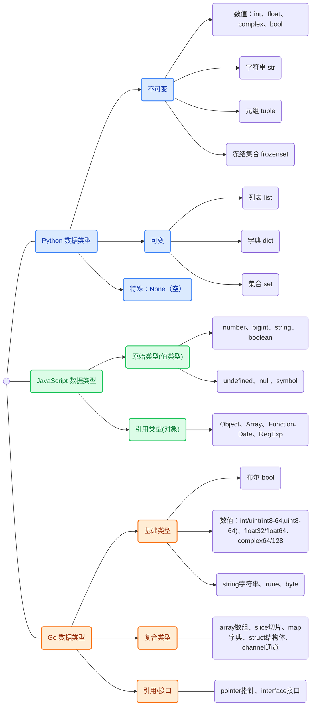

## 1. 环境变量

### 1.1. GOROOT

GOROOT 是 Go 语言的安装目录。通常情况下，使用官方安装包安装后，这个变量会自动设置。你可以通过以下命令查看：

```bash
go env GOROOT
```

一般情况下，你不需要手动设置 GOROOT，除非你有特殊需求（比如同时安装多个 Go 版本）。

### 1.2. GOPATH

GOPATH 是 Go 语言的工作区目录，在 Go Modules 出现之前，这是 Go 开发的核心概念。虽然现在已经不那么重要了，但了解它仍然有价值。

在 Windows 上，你可以这样设置环境变量：

```bash
# 在命令提示符中设置
set GOPATH=C:\Users\你的用户名\go
set PATH=%PATH%;%GOPATH%\bin

# 或者通过系统设置永久设置
# 右键"此电脑" -> 属性 -> 高级系统设置 -> 环境变量
```

在 macOS 和 Linux 上：

```bash
# 临时设置
export GOPATH=$HOME/go
export PATH=$PATH:$GOPATH/bin

# 永久设置（添加到 ~/.bashrc 或 ~/.zshrc）
echo 'export GOPATH=$HOME/go' >> ~/.bashrc
echo 'export PATH=$PATH:$GOPATH/bin' >> ~/.bashrc
source ~/.bashrc
```

### 1.3. GOPROXY

GOPROXY 是 Go 模块代理的设置，用于加速包的下载。在中国，由于网络问题，建议设置为国内的代理：

```bash
go env -w GOPROXY=https://goproxy.cn,direct
```

这个设置会让 Go 模块的下载速度大大提升。

## 2. Go 工作区（GOPATH）

虽然现在 Go Modules 已经成为主流，但理解 GOPATH 的概念仍然很重要，因为很多老项目还在使用这种方式。

GOPATH 工作区的结构是固定的，包含三个子目录：

```plain
GOPATH/
├── bin/     # 存放编译后的可执行文件
├── pkg/     # 存放编译后的包文件
└── src/     # 存放源代码
    ├── github.com/
    ├── gitlab.com/
    └── 其他代码托管平台的域名/
```

想象一下，GOPATH 就像一个大型图书馆，src 目录是书架，按照出版社（代码托管平台）和作者（用户或组织）来组织书籍（项目）。

举个例子，如果你要开发一个项目，并且准备发布到 GitHub 上，你的代码应该放在：

```plain
$GOPATH/src/github.com/你的用户名/项目名/
```

这种组织方式的好处是统一和清晰，但缺点是比较僵化。这就是为什么 Go 1.11 引入了 Go Modules 的原因。

## 3. 编译程序

除了直接运行，我们也可以将程序编译成可执行文件：

```bash
go build main.go
```

这会生成一个可执行文件（Windows 下是 `main.exe`，其他系统下是 `main`）。

你也可以指定输出文件名：

```bash
go build -o hello main.go
```

编译后的程序可以直接运行，不需要 Go 环境：

```bash
./hello     # Linux/macOS
hello.exe   # Windows
```

## 4. 交叉编译

Go 语言支持交叉编译，也就是在一个平台上编译出其他平台的可执行文件。

例如，在 Linux 上编译 Windows 程序：

```bash
GOOS=windows GOARCH=amd64 go build -o hello.exe main.go
```

支持的平台组合很多，常用的包括：

- `GOOS=linux GOARCH=amd64`：Linux 64 位
- `GOOS=windows GOARCH=amd64`：Windows 64 位
- `GOOS=darwin GOARCH=amd64`：macOS 64 位
- `GOOS=linux GOARCH=arm64`：Linux ARM64

## 5. Go 命令行工具介绍

Go 语言提供了丰富的命令行工具，这些工具是 Go 开发者日常工作的得力助手。

### 5.1. 基础命令

`go run`：直接运行 Go 程序

```bash
go run main.go
```

`go build`：编译 Go 程序

```bash
go build main.go
go build .      # 编译当前目录的包
```

`go install`：编译并安装程序到 `$GOPATH/bin`

```bash
go install .
```

### 5.2. 包管理命令

`go mod init`：初始化一个新的 module

```bash
go mod init myproject
```

`go mod tidy`：添加缺少的依赖，删除无用的依赖

```bash
go mod tidy
```

`go mod download`：下载依赖到本地缓存

```bash
go mod download
```

`go get`：获取依赖包

```bash
go get github.com/gin-gonic/gin
go get -u github.com/gin-gonic/gin   # 更新到最新版本
```

### 5.3. 代码质量工具

`go fmt`：格式化代码

```bash
go fmt main.go
go fmt ./...    # 格式化当前目录及子目录的所有 Go 文件
```

`go vet`：检查代码中的常见错误

```bash
go vet main.go
go vet ./...
```

`go test`：运行测试

```bash
go test
go test -v      # 显示详细信息
go test ./...   # 运行所有测试
```

### 5.4. 其他实用命令

`go doc`：查看文档

```bash
go doc fmt.Println
go doc -all fmt
```

`go env`：查看环境配置

```bash
go env
go env GOOS     # 查看特定环境变量
```

`go version`：查看 Go 版本

```bash
go version
```

`go clean`：清理编译文件

```bash
go clean
go clean -cache # 清理构建缓存
```

## 6. iota 常量计数器

`iota` 是 Go 的常量计数器，只能在 `const` 块里使用。它在每个 `const` 块的第一行从 0 开始，之后每新增一行自动递增 1，遇到新的 `const` 块则重新归零。

### 6.1. 基本用法

```go
const (
    // iota 从 0 开始，每行递增 1
    Monday = iota    // 0
    Tuesday          // 1
    Wednesday        // 2
    Thursday         // 3
    Friday           // 4
    Saturday         // 5
    Sunday           // 6
)

const (
    // 新 const 块，iota 重置为 0
    Spring = iota    // 0
    Summer           // 1
    Autumn           // 2
    Winter           // 3
)

const (
    // iota 可以参与表达式计算
    KB = 1 << (10 * iota)  // 1 << (10 * 0) = 1
    MB                     // 1 << (10 * 1) = 1024
    GB                     // 1 << (10 * 2) = 1048576
    TB                     // 1 << (10 * 3) = 1073741824
)

func main() {
    fmt.Println(Monday, Sunday)   // 0 6
    fmt.Println(Spring, Winter)   // 0 3
    fmt.Println(KB, MB, GB, TB)   // 1 1024 1048576 1073741824
}
```

### 6.2. iota vs 手写数字

既然 `iota` 就是 0、1、2、3…，那直接用数字写死行不行？当然可以，结果完全一样：

```go
const (
    Monday    = 0
    Tuesday   = 1
    Wednesday = 2
    Thursday  = 3
    Friday    = 4
    Saturday  = 5
    Sunday    = 6
)
```

但 `iota` 的价值在于三个「省心」：

### 6.3. 中间插一项，不用手改后面所有值

```go
// 用数字：后面全要 +1，容易漏改
const (
    Monday    = 0
    Tuesday   = 1
    Weekend   = 2   // 新插的
    Wednesday = 3   // 原来是 2，现在要改
    Thursday  = 4   // 原来是 3 ...
)

// 用 iota：什么都不用动，编译器自动数
const (
    Monday  = iota  // 0
    Tuesday         // 1
    Weekend         // 2
    Wednesday       // 3
    Thursday        // 4
)
```

### 6.4. 配合表达式自动算（数字做不到）

```go
const (
    KB = 1 << (10 * iota)  // iota=0 → 1
    MB                     // iota=1 → 1024
    GB                     // iota=2 → 1048576
    TB                     // iota=3 → 1073741824
)
```

用数字写死的话，`1073741824` 这种数得自己算，加个 `PB` 也得手算 `1 << 40`。用 `iota` 只补一行就自动算好。

### 6.5. bit 掩码（最常见的实战用法）

```go
const (
    FlagRead  = 1 << iota  // 1
    FlagWrite              // 2
    FlagExec               // 4
)
```

手写 `1, 2, 4, 8, 16...` 是最容易出错的地方（写到 64、128 很容易记岔），`iota` 让编译器替你算。

### 6.6. 小结

`iota` 本质就是「让编译器帮你数 0、1、2、3…」，结果和手写数字一样，但它**自动递增、插删不用改、还能套进表达式算**。

- 简单连续的 0~N 枚举，手写数字更直白，两者随意。
- 一旦有「插入/删除」「表达式」「位运算」需求，`iota` 明显更省事、更不容易错。

## 7. Go 数据类型

Go 语言是一种静态类型语言，编译时类型就确定好了。Go 内置的数据类型丰富但数量克制，开发者可以直接使用，无需额外 import。

在深入每个类型之前，先看一张 Python / JavaScript / Go 三语言数据类型的思维导图，建立整体认知：



### 7.1. 整数类型

整数类型分两大类：有符号整数（可正可负）和无符号整数（只能为非负数）。Go 还提供了平台相关的整数类型，长度随操作系统位数变化。

#### 7.1.1. 1.1 有符号整数

| 类型  | 位数 | 取值范围                   | 说明                                   |
| ----- | ---- | -------------------------- | -------------------------------------- |
| int8  | 8    | -128 到 127                | 1 字节，节省内存                       |
| int16 | 16   | -32768 到 32767            | 2 字节                                 |
| int32 | 32   | -2147483648 到 2147483647   | 4 字节，约 ±21 亿                      |
| int64 | 64   | -9223372036854775808 到 9223372036854775807 | 8 字节，约 ±922 京                 |

```go
func main() {
    // 有符号整数
    var i8 int8 = 127        // -128 到 127
    var i16 int16 = 32767    // -32768 到 32767
    var i32 int32 = 2147483647
    var i64 int64 = 9223372036854775807
}
```

#### 7.1.2. 1.2 无符号整数

| 类型   | 位数 | 取值范围                    | 说明                   |
| ------ | ---- | --------------------------- | ---------------------- |
| uint8  | 8    | 0 到 255                    | 1 字节，常用于字节数据 |
| uint16 | 16   | 0 到 65535                  | 2 字节                 |
| uint32 | 32   | 0 到 4294967295             | 4 字节                 |
| uint64 | 64   | 0 到 18446744073709551615   | 8 字节                 |

```go
func main() {
    // 无符号整数
    var ui8 uint8 = 255        // 0 到 255
    var ui16 uint16 = 65535    // 0 到 65535
    var ui32 uint32 = 4294967295
    var ui64 uint64 = 18446744073709551615
}
```

#### 7.1.3. 1.3 平台相关的整数类型

这是 Go 语言的"聪明"设计：写代码不用关心目标机器是 32 位还是 64 位，由编译器自动决定。日常开发推荐默认用 `int` 和 `uint`。

| 类型 | 32 位系统 | 64 位系统 | 说明                              |
| ---- | --------- | --------- | --------------------------------- |
| int  | int32     | int64     | 至少 32 位，一般用于循环计数、长度 |
| uint | uint32    | uint64    | 至少 32 位                        |

```go
func main() {
    var i int = 100  // 32 位系统上是 int32，64 位系统上是 int64
    var ui uint = 100 // 32 位系统上是 uint32，64 位系统上是 uint64
}
```

#### 7.1.4. 1.4 类型别名

Go 提供了几个常用的类型别名，提升可读性：

| 别名  | 等价于   | 用途                                              |
| ----- | -------- | ------------------------------------------------- |
| byte  | uint8    | 强调这是一个字节，常用于二进制数据                |
| rune  | int32    | 强调这是一个 Unicode 码点（一个字符），常用于字符串处理 |

```go
var b byte = 'A'      // 'A' 的 ASCII 码是 65
var r rune = '中'      // '中' 的 Unicode 码点是 U+4E2D
```

### 7.2. 浮点类型

浮点数就是带小数点的数。Go 提供两种精度，按需选用。**日常默认用 `float64`**，因为它精度高，大多数 CPU 也能高效处理。

| 类型     | 位数 | 精度              | 范围（约）                    | 说明                          |
| -------- | ---- | ----------------- | ----------------------------- | ----------------------------- |
| float32  | 32   | 约 7 位有效数字   | ±3.4e38                       | 单精度，省内存                |
| float64  | 64   | 约 15 位有效数字  | ±1.8e308                      | 双精度，默认推荐              |

```go
func main() {
    var f32 float32 = 3.14       // 32 位浮点数
    var f64 float64 = 3.141592653589793 // 64 位浮点数
    var f = 3.14                 // 不写类型，默认推断为 float64
}
```

⚠️ **浮点数比较的坑**：因为浮点数有精度误差，不要用 `==` 直接比较两个浮点数是否相等，应该看差值是否小于某个极小值：

```go
a := 0.1 + 0.2
b := 0.3
// 错误：a == b  // false，因为 0.1+0.2=0.30000000000000004
// 正确：
math.Abs(a-b) < 1e-9
```

### 7.3. 复数类型

Go 原生支持复数（包含实部和虚部），少见但在某些数学和科学计算场景用得上。

| 类型        | 位数 | 实部 / 虚部 | 说明                       |
| ----------- | ---- | ----------- | -------------------------- |
| complex64   | 64   | float32     | 32 位实部 + 32 位虚部      |
| complex128  | 128  | float64     | 64 位实部 + 64 位虚部      |

```go
func main() {
    var c64 complex64 = 1 + 2i
    var c128 complex128 = 3.14 + 2.71i
    fmt.Println(real(c128))  // 3.14 提取实部
    fmt.Println(imag(c128))  // 2.71 提取虚部
}
```

### 7.4. 布尔类型

只有两个值：`true` 和 `false`，用于条件判断。

| 类型 | 位数 | 取值       |
| ---- | ---- | ---------- |
| bool | 1   | true/false |

⚠️ **Go 的严格规定**：布尔类型不能隐式转换为 0/1，也不能参与数值运算：

```go
b := true
// b = 1      // 错误：cannot use 1 (untyped int constant) as bool
// if b {}    // 正确
```

### 7.5. 字符串类型

字符串是 Go 的内置类型，**不可变**（创建后内容不能改）。底层是 UTF-8 字节序列，**不是定长数组**。

| 类型   | 说明                                        |
| ------ | ------------------------------------------- |
| string | UTF-8 编码的不可变字节序列，本质是 `[]byte` 的不可变视图 |

```go
func main() {
    s := "Hello, 世界"  // ASCII + 中文混排
    fmt.Println(len(s))   // 13（字节数，不是字符数）
    // s[0] = 'h'         // 错误：字符串不可变
}
```

字符串常用操作：
- `len(s)`：字节数
- `s[i]`：取第 i 个字节（不能直接得到字符）
- `for i, r := range s`：按 rune（字符）遍历
- `strings` 包：分割、拼接、替换、查找等

### 7.6. 字符类型

Go 中没有专门的 `char` 类型，字符用以下两种方式表示：

| 类型 | 实际类型 | 用途                                    |
| ---- | -------- | --------------------------------------- |
| byte | uint8    | 处理 ASCII 字符或原始字节              |
| rune | int32    | 处理 Unicode 字符（中文、emoji 等）    |

```go
func main() {
    var ch byte = 'A'   // 65，ASCII 字符
    var r rune = '中'   // 20013，Unicode 码点
    fmt.Printf("%c %c\n", ch, r)  // A 中
}
```

### 7.7. 派生类型

Go 中的派生类型是在基本类型基础上组合/封装出来的，开发者需要理解它们的特性：

| 类型         | 示例                          | 说明                                |
| ------------ | ----------------------------- | ----------------------------------- |
| 指针 (Pointer)     | `*int`, `*User`         | 存储另一个变量的内存地址            |
| 数组 (Array)       | `[3]int{1,2,3}`          | 固定长度，值类型                    |
| 切片 (Slice)       | `[]int{1,2,3}`           | 可变长度，是对数组的引用视图         |
| 映射 (Map)         | `map[string]int{}`       | 键值对集合，类似其他语言的字典      |
| 通道 (Channel)     | `chan int`               | goroutine 之间通信的管道            |
| 函数 (Function)    | `func(int) string`       | 函数本身也是一种类型                 |
| 接口 (Interface)   | `interface{ Read(p []byte) (n int, err error) }` | 方法签名的集合           |
| 结构体 (Struct)    | `type User struct { Name string }` | 自定义的复合类型         |

这些派生类型会在后续章节详细介绍，先知道 Go 的类型谱系长这样就够了。

### 7.8. 类型汇总表

最后给一张完整的速查表，方便查阅：

| 类别     | 类型                                                | 备注                          |
| -------- | --------------------------------------------------- | ----------------------------- |
| 整数     | int8 / int16 / int32 / int64                        | 有符号                        |
| 整数     | uint8 / uint16 / uint32 / uint64                    | 无符号                        |
| 整数     | int / uint                                          | 平台相关（32 / 64 位）        |
| 整数别名 | byte / rune                                         | byte=uint8，rune=int32        |
| 浮点     | float32 / float64                                   | 默认 float64                  |
| 复数     | complex64 / complex128                              | 含实部+虚部                   |
| 布尔     | bool                                                | true / false                  |
| 字符串   | string                                              | UTF-8 不可变                  |
| 派生     | 指针 / 数组 / 切片 / map / chan / func / interface / struct | 由基本类型组合     |

**实战经验**：

- **不知道该用啥时**：整数用 `int`、浮点用 `float64`、布尔用 `bool`、字符串用 `string`，覆盖 95% 场景。
- **二进制/网络协议**：用 `int32/uint32/int64/uint64` 固定宽度，避免跨平台差异。
- **省内存（嵌入式/大数组）**：用 `int8/int16/uint8` 明确指定宽度。
- **不要混用 int 和 int64**：Go 不会自动转换，跨类型运算需要显式 `int(int64Var)` 强转。

## 8. Go 的循环

Go **没有 `while`、`do-while` 关键字，只有唯一的 `for` 循环**，while 逻辑全部用 for 模拟。

### 8.1. 普通 for（三段式，和 C 类似）

```go
// for 初始化; 条件; 增量
for i := 0; i < 10; i++ {
    fmt.Println(i)
}
```

### 8.2. 模拟 while 循环（去掉初始化和增量，只留条件）

```go
// 等价于 while(cond)
n := 0
for n < 5 {
    fmt.Println(n)
    n++
}
```

> 语法：`for 条件 { }`，这就是 Go 的 while。

### 8.3. 无限循环（死循环，相当于 while(true)）

把条件也省略，直接 `for {}`：

```go
for {
    fmt.Println("无限循环")
    break // 需要 break 退出
}
```

### 8.4. 模拟 do-while（先执行一次，再判断）

Go 没有 do-while，需要手动写：

```go
n := 0
for {
    fmt.Println(n)
    n++
    if n >= 5 {
        break
    }
}
```

### 8.5. for-range（遍历 slice / map / string / channel）

Go 专属，也是 for 的一种变体：

```go
s := []int{1, 2, 3}
for idx, val := range s {
    fmt.Println(idx, val)
}
```

`for-range` 遍历不同对象的含义：

| 对象       | 第一个返回值 | 第二个返回值 | 示例                        |
| ---------- | ------------ | ------------ | --------------------------- |
| slice/数组 | 索引 index   | 值 value     | `for i, v := range s`       |
| map        | 键 key       | 值 value     | `for k, v := range m`       |
| string     | 字节索引     | rune 字符    | `for i, r := range str`     |
| channel    | 元素值       | （无）       | `for v := range ch`         |

### 8.6. 小结

- Go 只有 `for`，没有 `while` / `do-while`
- `for 条件 {}` → while
- `for {}` → while(true) 无限循环
- do-while 需要用 `for { ...; if !cond { break } }` 手动实现
- `for-range` 专门做遍历

## 9. Go 结构体（struct）与方法

结构体是 Go 组织数据的核心方式，把不同类型的数据组合在一起，配合方法可实现类似面向对象的效果。它是**值类型**（赋值/传参会复制整个结构体）。

### 9.1. 定义与使用

用 `type` + `struct` 定义，字段各自带类型：

```go
type User struct {
    ID       int
    Name     string
    Email    string
    Age      int
    IsActive bool
}

func main() {
    var user User          // 零值结构体：所有字段都是类型零值
    user.ID = 1
    user.Name = "小明"
    fmt.Printf("%+v\n", user)  // {ID:1 Name:小明 Email: Age:0 IsActive:false}
}
```

**零值**：`string` 是 `""`、`int` 是 `0`、`bool` 是 `false`、`float` 是 `0.0`。

**匿名结构体**：临时用一下、不想单独定义类型时：

```go
course := struct {
    Title    string
    Duration int
}{
    Title:    "Go 入门",
    Duration: 120,
}
```

### 9.2. 初始化方式

| 方式         | 写法                          | 说明                       |
| ------------ | ----------------------------- | -------------------------- |
| 字段逐一赋值 | `var u User; u.Name = "x"`    | 先声明再赋值               |
| 字面量（推荐） | `u := User{Name: "x", Age: 1}` | 按字段名，可省略部分字段   |
| `new`        | `u := new(User)`              | 返回**指针**，字段为零值   |
| `&` 取地址   | `u := &User{Name: "x"}`       | 返回指针，等价 new+初始化  |
| 构造函数     | `func NewUser(...) *User`     | Go 无构造函数，用工厂函数  |

```go
// 按字段名初始化（推荐），顺序无关，可部分初始化
u := User{Name: "小明", Age: 26}

// 按顺序初始化（不推荐），字段顺序一变就出错
u2 := User{1, "小明", "", 26, true}

// 指针
p := &User{Name: "小明"}   // *User
```

> ⚠️ Go **没有构造函数**，惯例是写 `NewXxx(...)` 工厂函数，内部做校验后返回 `*Xxx` 或 `(*Xxx, error)`。

### 9.3. 方法：值接收者 vs 指针接收者

方法是在 `func` 和方法名之间加「接收者」，让结构体拥有行为。

```go
type Counter struct{ Count int }

func (c Counter) GetCount() int { return c.Count }  // 值接收者：只读

func (c *Counter) Increment() { c.Count++ }          // 指针接收者：能改
```

**核心规则（最重要）**：

| 场景                 | 用哪种接收者     |
| -------------------- | ---------------- |
| 需要**修改**接收者   | 指针 `*T`        |
| 结构体**很大**，避免复制开销 | 指针 `*T` |
| 只读、结构体小       | 值 `T`           |

```go
c := Counter{}
c.Increment()     // 值或指针都能调用指针接收者方法，Go 自动取地址
fmt.Println(c.Count) // 1

c2 := Counter{}
c2.GetCount()     // 值接收者，不改原数据
```

> Go 会自动转换：值类型变量也能直接调用指针接收者方法（`c.Increment()` 自动变成 `(&c).Increment()`），不需要手动写 `&`。

### 9.4. 嵌套与组合（模拟继承）

Go 没有继承，用「嵌入匿名字段」实现类似继承的效果。

**显式嵌套**：结构体作为字段，访问要一层层写：

```go
type Address struct{ City, Province string }
type Person struct {
    Name    string
    Address Address   // 显式嵌套
}
p := Person{Name: "小明", Address: Address{City: "深圳"}}
p.Address.City   // 访问要写全
```

**匿名字段（嵌入）**：只写类型不写字段名，可「直接」访问嵌入结构体的字段和方法：

```go
type BaseModel struct {
    ID        int
    CreatedAt string
}

type User struct {
    BaseModel          // 匿名嵌入，字段和方法被"继承"
    Name string
}

u := User{}
u.ID = 1              // 等价于 u.BaseModel.ID，直接访问
```

**方法的继承与重写**：嵌入结构体的方法会被「继承」，外层可定义同名方法「重写」：

```go
type Animal struct{ Name string }
func (a Animal) Speak() string { return a.Name + " 发出声音" }

type Dog struct {
    Animal
}
func (d Dog) Speak() string { return d.Name + " 汪汪叫" }  // 重写

dog := Dog{Animal{Name: "旺财"}}
dog.Speak()            // 旺财 汪汪叫（重写生效）
dog.Animal.Speak()     // 旺财 发出声音（显式调用被嵌入的方法）
```

### 9.5. 结构体标签（Tag）

写在字段类型后面的反引号字符串里，是字段的元数据，常用于 JSON 序列化、ORM 映射、参数校验。

```go
type Course struct {
    ID          int     `json:"id"`
    Title       string  `json:"title"`
    Description string  `json:"description,omitempty"` // 为空则序列化时省略
    Author      string  `json:"-"`                     // 序列化时完全忽略
}
```

常用 JSON 标签规则：

| 标签写法              | 含义                     |
| --------------------- | ------------------------ |
| `json:"name"`         | 序列化字段名改为 name    |
| `json:"name,omitempty"` | 零值时省略该字段       |
| `json:"-"`            | 忽略该字段，不序列化     |

标签本身只是字符串，需要配合 `encoding/json` 或 `reflect`（反射）才能发挥作用。自定义标签（如 `validate:"required,min:3"`）需要自己用反射解析实现校验逻辑。

### 9.6. 小结

- 结构体 = 把不同类型字段打包，是 Go 模拟「类」的数据载体。
- 方法 = 绑定在类型上的函数，通过「接收者」关联。
- **值接收者不修改原数据，指针接收者能修改** —— 这是方法里最重要的一个判断。
- 嵌入匿名字段 = Go 实现代码复用和「继承」的方式，外层可重写内层方法。
- 结构体标签 = 字段元数据，配合反射驱动 JSON 序列化、ORM、校验。

## 10. Go 接口（interface）与多态

接口是 Go 最强大的特性之一，它定义「做什么」而不关心「怎么做」。可以把它理解为插座标准：任何插头只要符合标准就能接上，电器可以随时更换。

### 10.1. 接口的定义

接口是**一组方法签名的集合**，只声明行为，不包含实现：

```go
type Storage interface {
    Save(data string) error
    Load(key string) (string, error)
    Delete(key string) error
}
```

### 10.2. 隐式实现（Go 最独特的特性）

Go 的接口实现是**隐式**的：类型只要拥有接口要求的全部方法，就自动实现了该接口，**不需要写 `implements` 关键字**（鸭子类型）。

```go
type FileStorage struct{ basePath string }

func (fs *FileStorage) Save(data string) error { /* ... */ return nil }
func (fs *FileStorage) Load(key string) (string, error) { /* ... */ return "", nil }
func (fs *FileStorage) Delete(key string) error { /* ... */ return nil }

// FileStorage 自动实现了 Storage 接口，可直接赋值
var s Storage = &FileStorage{basePath: "/data"}
```

这带来一个好处：**改实现方不用改调用方**。函数只依赖接口，传入任何实现了该接口的类型都能工作：

```go
func testStorage(store Storage, data string) {
    store.Save(data)
    result, _ := store.Load("key")
    store.Delete("key")
}
```

> ⚠️ 注意指针接收者 vs 值接收者对接口实现的影响：`func (fs *FileStorage) Save(...)` 是**指针接收者**，只有 `*FileStorage` 实现了接口；`func (c Circle) Area()` 是**值接收者**，则 `Circle` 和 `*Circle` 都实现了接口。

### 10.3. 空接口与类型断言

**空接口 `interface{}`**（Go 1.18 起可用别名 `any`）没有任何方法，因此**所有类型都实现了它**，可以存储任意值，类似其他语言的 `Object`。

```go
var x interface{}   // 等价于 var x any
x = "hello"         // 存字符串
x = 42              // 存整数
x = 3.14            // 存浮点
```

但空接口存进去容易，取出来要**类型断言**还原成具体类型。

**安全断言（推荐）**，用「comma-ok」写法避免 panic：

```go
if str, ok := x.(string); ok {
    fmt.Println("是字符串:", str)
} else if num, ok := x.(int); ok {
    fmt.Println("是整数:", num)
}
```

**不安全断言**：`str := x.(string)`，如果 x 实际不是 string 会直接 panic。

**类型选择（type switch）**，一次处理多种类型更简洁：

```go
switch v := x.(type) {
case string:
    fmt.Println("字符串:", v)
case int:
    fmt.Println("整数:", v)
case bool:
    fmt.Println("布尔:", v)
default:
    fmt.Printf("未知类型: %T\n", v)
}
```

> 推荐：能用具体类型就别用空接口；空接口主要用在 JSON 解析、配置项、泛型出现前的通用容器等场景。

### 10.4. 接口组合（嵌套）

Go 可以把多个小接口组合成一个大接口，实现接口的「模块化」：

```go
type Reader interface { Read(p []byte) (int, error) }
type Writer interface { Write(p []byte) (int, error) }
type Closer interface { Close() error }

// 组合接口：直接列出要包含的接口名
type ReadWriteCloser interface {
    Reader
    Writer
    Closer
}
```

一个类型要实现 `ReadWriteCloser`，就必须同时实现 `Read`、`Write`、`Close` 三个方法。组合接口的好处是：**小接口职责单一、易于复用**，需要啥就组合啥（这也是 Go 标准库 `io` 包的经典设计）。

### 10.5. 多态

多态 = 不同类型的对象对**同一个接口**做出**不同的响应**。接口是实现多态的主要方式：调用方只认接口，具体行为由传入的实际类型决定。

```go
type Notifier interface {
    Send(message string) error
}

type EmailNotifier struct{ /* ... */ }
func (n *EmailNotifier) Send(msg string) error { fmt.Println("邮件:", msg); return nil }

type SMSNotifier struct{ /* ... */ }
func (n *SMSNotifier) Send(msg string) error { fmt.Println("短信:", msg); return nil }

// 同一个函数，传入不同类型，行为不同
func notify(n Notifier, msg string) {
    n.Send(msg)
}

func main() {
    notify(&EmailNotifier{}, "欢迎")  // 邮件: 欢迎
    notify(&SMSNotifier{}, "验证码")  // 短信: 验证码

    // 存到切片里批量处理，运行时才确定具体类型
    notifiers := []Notifier{&EmailNotifier{}, &SMSNotifier{}}
    for _, n := range notifiers {
        n.Send("消息")
    }
}
```

**典型应用**：策略模式（评分策略、支付方式）、插件系统（注册多个实现）、依赖注入（传入 mock 测试实现）等。

### 10.6. 小结

- 接口 = 方法签名集合，只定义行为不定义实现。
- **隐式实现**：方法齐了就自动实现接口，无需声明，这是 Go 与 Java/C++ 的最大区别。
- 空接口 `interface{}`（`any`）能存任意值，取出用**类型断言**（comma-ok）或 **type switch**。
- 接口组合 = 小接口拼大接口，职责单一、按需组合。
- 多态靠接口实现：调用方依赖接口，运行时由实际类型决定行为。
- 设计原则：**接口要小**（方法越少越通用），依赖接口而非具体实现。

## 11. Go 指针与内存管理

指针存的是「内存地址」而不是值本身，就像门牌号：告诉别人地址，而不是把整栋房子搬过去。Go 有指针，但**比 C/C++ 安全得多**（有自动内存管理和垃圾回收）。

### 11.1. 指针基础：`&` 取地址、`*` 解引用

- `&x`：取变量 `x` 的内存地址
- `*p`：通过指针 `p` 访问/修改它指向的值

```go
x := 10
p := &x          // p 是指针，存的是 x 的地址
fmt.Println(*p)  // 10，解引用
*p = 20          // 通过指针修改 x
fmt.Println(x)   // 20
```

**指针零值是 `nil`**：解引用 nil 指针会 panic，使用前要判空：

```go
var p *int          // nil
// fmt.Println(*p)  // panic: 空指针解引用
if p != nil {
    fmt.Println(*p)
}
```

### 11.2. 声明指针的方式

| 方式         | 写法                            | 说明                 |
| ------------ | ------------------------------- | -------------------- |
| 取地址       | `p := &x`                       | 最常用               |
| 声明再赋值   | `var p *int; p = &x`            | 显式声明类型         |
| `new`        | `p := new(int)`                 | 分配内存并返回指针，值为零值 |

```go
x := 5
p1 := &x                 // *int，指向 x

p2 := new(int)           // *int，指向一块新内存，初始 0
*p2 = 42

var p3 *int              // nil，还没指向任何内存
p3 = &x
```

### 11.3. 指针与函数

**Go 所有参数都是值传递**，指针作为参数时，传递的是「地址的副本」，但通过这个地址能修改原始数据——这是指针在函数里最核心的用途：

```go
type User struct{ Name string; Age int }

func grow(u *User) {     // 指针参数：修改原始数据
    u.Age++
}

func nop(u User) {       // 值参数：修改的是副本，原数据不变
    u.Age++
}

func main() {
    u := User{Name: "小明", Age: 20}
    nop(u)               // 无效
    fmt.Println(u.Age)   // 20
    grow(&u)             // 有效
    fmt.Println(u.Age)   // 21
}
```

**函数返回指针**（工厂模式）：返回局部变量的指针是**安全**的，Go 会自动把它分配到堆上：

```go
func newUser(name string) *User {
    u := User{Name: name}   // 局部变量
    return &u               // 返回指针，安全，Go 会做逃逸分析
}
```

> ⚠️ 这里和 C 语言有本质区别：**在 Go 中返回局部变量的指针是安全的**，编译器检测到地址被返回，会自动把变量从栈挪到堆上。C 语言这样做会得到「野指针」。

### 11.4. 指针与结构体

结构体字段通过指针访问时，Go 会自动解引用，**不需要写 `(*p).Field`，直接 `p.Field` 即可**：

```go
u := &User{Name: "小明"}
u.Age = 30       // 等价于 (*u).Age = 30，Go 自动解引用
fmt.Println(u.Name)
```

这也呼应了前面结构体章节的指针接收者：`func (u *User) SetAge(age int) { u.Age = age }`。

### 11.5. 栈 vs 堆与逃逸分析

Go 编译器**自动决定**变量放栈还是堆，你无法手动指定（这点和 C 的 `malloc` 完全不同）：

| 内存  | 特点                          | 分配条件                     |
| ----- | ----------------------------- | ---------------------------- |
| 栈    | 快、函数结束自动回收          | 生命周期在函数内能确定       |
| 堆    | 慢、由 GC 回收                | 生命周期超出函数（被返回/引用） |

**常见会「逃逸」到堆的情况**（`go build -gcflags="-m"` 可查看逃逸分析）：

1. 返回局部变量的指针 → 逃逸到堆
2. 被闭包捕获的变量 → 逃逸到堆
3. 大对象（超过栈大小限制）→ 逃逸到堆
4. 赋值给 `interface{}` / 作为参数传给不确定的函数

```go
// 不逃逸：局部使用，函数结束即可回收
func noEscape() int {
    x := 10
    return x        // 返回的是值，x 在栈上
}

// 逃逸：返回了地址，x 必须活到函数外，挪到堆上
func escape() *int {
    x := 10
    return &x       // x 逃逸到堆
}
```

> 理解逃逸分析的意义：不是「用了指针就一定在堆上」，而是「生命周期需要才去堆上」。Go 自动管理，程序员只管写正确逻辑。

### 11.6. 垃圾回收（GC）

Go 有自动垃圾回收，**不需要手动 `free`**。GC 会自动回收不再被引用的内存：

```go
m := make([]int, 10000)  // 分配
m = nil                  // 不再引用，等 GC 自动回收
runtime.GC()             // 也可手动触发（一般不需要）
```

Go 的 GC 是并发三色标记算法，目标低延迟（STW 极短），日常开发基本无感知。

### 11.7. 内存安全最佳实践

Go 相比 C/C++ 已经安全很多（无指针算术、自动 GC、逃逸分析），但仍要注意：

1. **解引用前判空**：`if p != nil` 再 `*p`
2. **不要做指针算术**：Go 不允许 `p++` 这种操作（想操作内存需用 `unsafe` 包，普通业务禁用）
3. **注意引用未释放**：map/slice 里长期持有大对象的指针，会导致内存无法回收（可及时 `delete` 或置 nil）
4. **`defer` 配合资源清理**：文件、连接等用完记得关闭

```go
f, err := os.Open("file.txt")
if err != nil { return }
defer f.Close()   // 保证释放
```

### 11.8. 小结

- 指针 = 存地址，`&` 取地址、`*` 解引用；零值是 `nil`，解引用前要判空。
- Go 参数**全部值传递**，想修改原数据就传指针。
- **返回局部变量的指针是安全的**（逃逸分析），这点和 C 不同。
- 结构体指针访问字段，Go 自动解引用，直接 `p.Field`。
- 栈/堆由编译器自动决定，程序员无法手动指定，用 `go build -gcflags="-m"` 看逃逸分析。
- Go 有自动 GC，不用 `free`；注意别长期持有大对象引用导致内存不回收。
- Go 无指针算术，比 C 安全；要操作内存用 `unsafe` 包（业务禁用）。

## 12. Go 错误处理机制

Go 的哲学是**「错误即值」**：错误不是异常，而是普通的值，函数把它作为返回值显式返回，由调用方显式检查。没有 `try/catch`。

### 12.1. error 接口

Go 的内置错误类型是一个极简接口：

```go
type error interface {
    Error() string
}
```

任何类型只要实现了 `Error() string` 方法，就能当错误用。函数通过「最后一个返回值是 error」来报告错误：

```go
func validateScore(s string) (int, error) {
    score, err := strconv.Atoi(s)
    if err != nil {
        return 0, fmt.Errorf("格式错误: %s", s)   // 返回错误
    }
    return score, nil                              // 成功返回 nil
}

func main() {
    score, err := validateScore("85")
    if err != nil {        // 显式检查错误
        fmt.Println("出错了:", err)
        return
    }
    fmt.Println(score)
}
```

> **核心约定**：`err == nil` 表示成功，非 nil 表示出错。Go 强迫你检查每个可能出错的地方，这就是「显式错误处理」。

### 12.2. 创建错误的方式

| 方式              | 写法                              | 场景                     |
| ----------------- | --------------------------------- | ------------------------ |
| `errors.New`      | `errors.New("文件名不能为空")`    | 静态简单错误             |
| `fmt.Errorf`      | `fmt.Errorf("文件 %s 不存在", f)` | 带格式化的动态错误       |
| 自定义错误类型     | 实现 `Error()` 方法的结构体        | 需要携带更多字段/错误码  |

```go
// 方式一、二：直接用标准库
err1 := errors.New("出错了")
err2 := fmt.Errorf("用户 %d 不存在", id)

// 方式三：自定义错误类型，携带业务字段
type BizError struct {
    Code int
    Msg  string
}
func (e *BizError) Error() string {
    return fmt.Sprintf("业务错误[%d]: %s", e.Code, e.Msg)
}
```

### 12.3. 错误包装与链式处理（Go 1.13+）

用 `%w` 包装错误，**保留原始错误**，形成错误链；用 `errors.Is` / `errors.As` 沿链查找。

```go
// 定义哨兵错误（sentinel error）
var ErrNotFound = errors.New("记录不存在")

func query(id int) error {
    if id <= 0 {
        return fmt.Errorf("查询用户 %d 失败: %w", id, ErrNotFound)  // %w 包装
    }
    return nil
}

func main() {
    err := query(-1)
    if err != nil {
        fmt.Println(err)                       // 查询用户 -1 失败: 记录不存在

        if errors.Is(err, ErrNotFound) {       // 判断链上是否有该错误
            fmt.Println("确实是「不存在」错误")
        }
    }
}
```

三个关键点：

| 函数          | 作用                                       |
| ------------- | ------------------------------------------ |
| `%w`          | 包装错误，保留原始错误（错误链）            |
| `errors.Is`   | 判断错误链上**是否包含**某个特定错误（值）   |
| `errors.As`   | 判断错误链上是否有**某个类型的错误**，并提取出来 |

自定义错误类型要实现 `Unwrap()` 方法才能被 `errors.Is`/`As` 穿透：

```go
type SyncError struct {
    Op    string
    Cause error
}
func (e *SyncError) Error() string { return e.Op + ": " + e.Cause.Error() }
func (e *SyncError) Unwrap() error { return e.Cause }   // 让 Is/As 能继续往下找
```

> **记忆**：`%w` 打包、`Unwrap` 拆包、`Is` 判断值、`As` 判断类型。

### 12.4. defer：延迟执行 + 资源清理

`defer` 让函数在**返回前**执行某段代码，常用于释放资源（关文件、解锁）。多个 defer 按**后进先出（LIFO）**顺序执行。

```go
func readFile(path string) error {
    f, err := os.Open(path)
    if err != nil {
        return err
    }
    defer f.Close()   // 函数返回前一定会执行，保证资源释放

    // ... 处理文件
    return nil
}
```

```go
// LIFO 顺序演示
defer fmt.Println("1")   // 最后执行
defer fmt.Println("2")   // 倒数第二执行
defer fmt.Println("3")   // 最先执行
// 输出：3 2 1
```

**defer 的核心价值**：不管函数正常返回还是中途 return/panic，`defer` 保证执行，资源不会泄漏。

### 12.5. panic 与 recover

**panic** 表示程序遇到无法继续的严重错误（如数组越界、空指针解引用），会立即中断当前函数，向上传播。**recover** 用于捕获 panic，让程序恢复运行。

```go
func safeDiv(a, b int) (result int, err error) {
    defer func() {
        if r := recover(); r != nil {   // 捕获 panic，转成 error
            err = fmt.Errorf("panic: %v", r)
        }
    }()
    result = a / b   // b=0 会 panic
    return result, nil
}
```

**关键规则**：

1. **`recover` 只能在 `defer` 函数里直接调用才生效**（间接调用无效）。
2. **不要滥用 panic**：panic 用于「程序级不可恢复错误」，业务错误应该用 `error` 返回值，而不是 panic。
3. `panic` 会沿调用栈向上传播，直到被 `recover` 捕获或程序崩溃。

```go
// 错误示范：业务校验用 panic（不推荐）
if user == nil {
    panic("user 为空")   // ❌ 应该 return error

// 正确示范
if user == nil {
    return errors.New("user 为空")   // ✅
}
```

### 12.6. 错误处理最佳实践

1. **永远不要忽略错误**：`_ = doSomething()` 或裸 `doSomething()` 都是坏习惯，每个 error 都要处理。
2. **尽早返回**：错误判断用 `if err != nil { return }` 提前退出，避免深层嵌套。
3. **包装添加上下文**：向上返回时用 `fmt.Errorf("...: %w", err)` 补上下文，别只传原始错误（否则难以定位）。
4. **哨兵错误 vs 自定义类型**：简单判断用 `errors.New` 哨兵错误 + `errors.Is`；需要错误码/多字段用自定义类型 + `errors.As`。
5. **defer 管资源**：文件、连接、锁等拿到手就 `defer` 释放。
6. **panic 留给真崩溃**：能返回 error 的绝不用 panic；`recover` 只在边界兜底（如 goroutine 顶层、第三方库调用）。

### 12.7. 小结

- Go **没有 try/catch**，错误是普通值，靠函数返回 `error` + 调用方 `if err != nil` 检查。
- `error` 是内置接口，只有 `Error() string` 一个方法。
- `errors.New` / `fmt.Errorf` 创建错误；`%w` 包装、`errors.Is` / `errors.As` / `Unwrap` 处理错误链。
- `defer` 延迟执行、LIFO 顺序，保证资源释放。
- `panic` = 严重错误中断程序；`recover` = 在 defer 里捕获恢复；业务错误用 error 不用 panic。

## 13. Go panic 与 recover 深入

上一章讲了 panic/recover 的基本用法，本章深入它的**触发机制、执行顺序和最佳实践**。

### 13.1. 哪些操作会触发 panic

panic 分两类：**运行时自动触发**（不可预期的错误）和**主动调用**（`panic(...)`）。

**运行时自动触发**（写代码时最容易踩）：

| 触发场景                 | 示例                                  |
| ------------------------ | ------------------------------------- |
| 数组/切片越界            | `s := []int{1,2,3}; s[5]`             |
| 空指针解引用             | `var p *int; *p`                      |
| 向 nil map 写入          | `var m map[string]int; m["k"]=1`      |
| 向已关闭的 channel 发送  | `close(ch); ch <- 1`                  |
| 类型断言失败（非 comma-ok） | `x.(int)` 当 x 实际不是 int        |
| 整数除零                 | `a / 0`（浮点除零不 panic，得 Inf）   |

**主动触发**：程序遇到无法继续的严重错误时手动 `panic("msg")`。

```go
// 运行时自动 panic
s := []int{1, 2, 3}
_ = s[5]                    // panic: index out of range

var m map[string]int
m["a"] = 1                  // panic: assignment to entry in nil map

// 主动 panic
panic("程序无法继续")
```

> ⚠️ 最容易踩的坑：**向 nil map 写入会 panic**（读不会），所以用 map 前要么 `make` 初始化，要么写前判空。

### 13.2. panic 的传播与 defer 执行顺序

**关键机制**：panic 发生后，当前函数立即停止，然后**沿调用栈向上传播，但每一层的 defer 仍然会执行**（按 LIFO）。这正是 `recover` 能生效的原因——recover 放在 defer 里，就能在函数「崩溃退出」的途中截住 panic。

```go
func main() {
    defer func() {
        if r := recover(); r != nil {
            fmt.Println("捕获到:", r)   // 在这里恢复
        }
    }()
    doSomething()   // 这里 panic，会向上传播到 main 的 defer
}

func doSomething() {
    defer fmt.Println("doSomething 的 defer 仍会执行")
    panic("出错了")   // panic 从这里抛出
}
// 输出：
// doSomething 的 defer 仍会执行
// 捕获到: 出错了
```

### 13.3. recover 的三条铁律

1. **`recover` 只能在 `defer` 函数里直接调用才生效**（包一层普通函数就无效）：

```go
// ✅ 有效：直接在 defer 匿名函数里调用
defer func() { recover() }()

// ❌ 无效：recover 不是 defer 里的直接调用
defer func() { helper() }()
func helper() { recover() }   // 这里的 recover 返回 nil
```

2. **多重 recover：内层捕获了，外层就收不到**——panic 只被最近的一个 recover 截住：

```go
defer func() {
    if r := recover(); r != nil { fmt.Println("外层捕获:", r) }
}()
defer func() {
    if r := recover(); r != nil { fmt.Println("内层捕获:", r) }  // 先执行，先截住
}()
panic("x")
// 只有「内层捕获: x」，外层 recover 返回 nil（panic 已被处理）
```

3. **defer 里再 panic 会覆盖原始 panic**——如果恢复函数自己又 panic，那原来的 panic 信息就丢了：

```go
defer func() {
    panic("defer 中的新 panic")   // 会覆盖下面的原始 panic
}()
panic("原始 panic")
```

### 13.4. 获取 panic 的堆栈信息

recover 拿到 panic 后，用 `runtime.Stack` 或 `debug.Stack` 打印调用栈，方便排查：

```go
defer func() {
    if r := recover(); r != nil {
        fmt.Printf("panic: %v\n", r)
        debug.PrintStack()          // 打印完整堆栈
    }
}()
```

### 13.5. 最佳实践：何时用 panic，何时用 error

| 场景                          | 用什么              |
| ----------------------------- | ------------------- |
| 业务逻辑错误（参数非法等）    | `error` 返回值       |
| 程序启动阶段配置/连接失败      | `panic`（直接崩溃）  |
| Web 服务单个请求的兜底         | `recover` 中间件     |
| goroutine 顶层兜底            | `recover` 防崩溃     |
| 第三方库调用边界              | `recover` 包裹       |

**三条原则**：

1. **业务错误用 `error`，绝不用 panic**：`panic("用户ID无效")` 是反模式，应 `return errors.New(...)`。
2. **panic 用在「程序无法继续」的真崩溃场景**：如 `init` 阶段配置加载失败、数据库连接失败，此时程序就该挂掉，别勉强跑。
3. **recover 用在「边界」兜底**：Web 框架的请求中间件、每个 goroutine 的入口，防止单个请求/协程的 panic 拖垮整个进程。

```go
// ✅ 正确：启动阶段，严重错误直接 panic
func init() {
    cfg, err := loadConfig()
    if err != nil {
        panic(fmt.Sprintf("配置加载失败: %v", err))  // 程序无法启动，就该崩
    }
}

// ✅ 正确：业务错误用 error
func getUser(id int) (string, error) {
    if id <= 0 {
        return "", errors.New("无效的用户ID")   // 不 panic
    }
    return "张三", nil
}

// ✅ 正确：goroutine 顶层 recover，防止崩溃拖垮进程
go func() {
    defer func() {
        if r := recover(); r != nil {
            log.Printf("goroutine panic: %v", r)
        }
    }()
    riskyWork()
}()
```

### 13.6. 小结

- panic 由**运行时自动触发**（越界/nil map 写入/关闭的 channel 发送/类型断言失败等）或**主动 `panic()`**。
- panic 传播时，**每一层 defer 仍会执行**（LIFO），这是 recover 能生效的基础。
- `recover` 只能在 defer 里**直接**调用；内层 recover 截住后外层收不到；defer 里再 panic 会覆盖原 panic。
- 用 `runtime.Stack` / `debug.PrintStack` 拿堆栈排查。
- **业务错误用 error，panic 留给启动失败等真崩溃，recover 用在 goroutine/请求边界兜底**。

## 14. Go Goroutine 协程（并发）

Goroutine 是 Go 最强大的特性之一：一种**轻量级线程**，由 Go 运行时管理。它占用极小（几 KB 栈，可动态伸缩），可以轻松创建成千上万个，是 Go 高并发的基石。

### 14.1. 并发 vs 并行

| 概念 | 含义                           | 类比                     |
| ---- | ------------------------------ | ------------------------ |
| 并发 | 多个任务**交替**执行（单核）   | 一个服务员轮流服务多桌   |
| 并行 | 多个任务**同时**执行（多核）   | 多个服务员同时服务       |

Go 用 `goroutine` 实现并发，多核时自动并行。**并发是结构，并行是执行**——程序员写的是并发代码，运行时决定是否并行。

### 14.2. 创建 goroutine：`go` 关键字

在函数调用前加 `go` 即可启动一个 goroutine：

```go
func sayHello(name string) {
    fmt.Println("Hello,", name)
}

func main() {
    sayHello("同步")   // 同步执行
    go sayHello("异步") // 新 goroutine 并发执行
}
```

匿名函数也可以：

```go
go func() {
    fmt.Println("匿名 goroutine")
}()
```

> ⚠️ **主 goroutine 结束，程序直接退出**，不管其他 goroutine 是否跑完。所以光 `go` 不看结果，往往啥也打印不出来。

### 14.3. 循环变量捕获的坑（经典）

在 `for` 循环里启动 goroutine，闭包会捕获循环变量。**Go 1.21 及以前**，所有 goroutine 共享同一个循环变量，必须传参：

```go
// ❌ Go 1.21 前：所有 goroutine 都打印最后一个值
for i := 0; i < 5; i++ {
    go func() { fmt.Println(i) }()   // 捕获同一个 i
}

// ✅ 正确：把 i 作为参数传入，每次拷贝一份
for i := 0; i < 5; i++ {
    go func(n int) { fmt.Println(n) }(i)
}
```

> Go 1.22 起循环变量每次迭代都是新的，这个坑已被修复。但看到老代码里 `go func(x int)(...)` 这种传参写法要明白是在规避这个坑。

### 14.4. 等待 goroutine 完成：sync.WaitGroup

goroutine 是异步的，要用 `sync.WaitGroup` 等待它们全部完成：

```go
var wg sync.WaitGroup

for i := 0; i < 5; i++ {
    wg.Add(1)                 // 计数器 +1（启动前）
    go func(n int) {
        defer wg.Done()       // 结束时计数器 -1（用 defer 保证执行）
        process(n)
    }(i)
}

wg.Wait()                     // 阻塞，直到计数器归零
```

**三个要点**：`Add` 在启动前、`Done` 用 defer 保证、`Wait` 阻塞等待。

### 14.5. GMP 调度模型（简述）

Go 的调度器基于 GMP 模型，理解它有助于写出高效并发代码：

| 缩写 | 含义                       | 说明                       |
| ---- | -------------------------- | -------------------------- |
| G    | Goroutine                  | 协程，用户态轻量线程        |
| M    | Machine                    | 操作系统线程               |
| P    | Processor                  | 逻辑处理器，持 G 的队列    |

关键点：

- `GOMAXPROCS` 决定 P 的数量（默认 = CPU 核数），用 `runtime.GOMAXPROCS(0)` 查看。
- 一个 M 同一时刻只能跑一个 G，但 G 阻塞时会被换下，M 不闲着。
- goroutine 在**阻塞（系统调用/IO/channel 等待）**时会主动让出执行权，所以大量 IO 场景用 goroutine 效率极高。

```go
fmt.Println(runtime.NumCPU())         // CPU 核数
fmt.Println(runtime.GOMAXPROCS(0))    // 可并行数
fmt.Println(runtime.NumGoroutine())   // 当前 goroutine 数（排查泄漏用）
```

### 14.6. goroutine 泄漏与 context

goroutine 若**永久阻塞**（如一直等一个没人发的 channel、死循环没人叫停），就会泄漏，占用内存不释放。

**典型泄漏**：goroutine 卡在 `<-ch` 等数据，但没数据来，也没人让它退出。

**解法：用 `context` 传递取消信号**：

```go
ctx, cancel := context.WithCancel(context.Background())
defer cancel()

go func() {
    for {
        select {
        case <-ctx.Done():     // 收到取消信号，退出
            fmt.Println("goroutine 退出")
            return
        default:
            // 正常干活
        }
    }
}()

// 想停止时调用 cancel()
```

**判断泄漏**：反复用 `runtime.NumGoroutine()` 看数量是否持续增长、只增不减。

### 14.7. 最佳实践

1. **用 WaitGroup 等待**：不要靠 `time.Sleep` 猜等待时长。
2. **每个 goroutine 顶层 recover**：防止单个 goroutine 的 panic 拖垮整个进程。

```go
go func() {
    defer func() {
        if r := recover(); r != nil {
            log.Printf("goroutine panic: %v", r)
        }
    }()
    riskyWork()
}()
```

3. **控制并发数量**（工作池模式）：别无脑 `for { go ... }`，用带缓冲 channel 做信号量限流。

```go
sem := make(chan struct{}, 10)   // 最多 10 个并发
for _, job := range jobs {
    sem <- struct{}{}            // 占一个坑，满了就阻塞
    go func(j Job) {
        defer func() { <-sem }() // 干完释放坑
        process(j)
    }(job)
}
```

4. **用 context 管理生命周期**：能取消的 goroutine 才可控。
5. **循环里启动 goroutine 记得传参**（Go 1.21 前）。

### 14.8. 小结

- goroutine = 轻量级线程，`go func()` 创建，开销极小可开成千上万。
- 并发（交替）≠ 并行（同时），Go 用 goroutine 写并发，多核自动并行。
- **主 goroutine 结束程序就退出**，子 goroutine 用 `sync.WaitGroup` 等待。
- GMP 模型：G（协程）跑在 M（线程）上，由 P（处理器）调度。
- goroutine 永久阻塞会泄漏，用 `context` 取消 + `runtime.NumGoroutine()` 排查。
- 最佳实践：WaitGroup 等待、goroutine 顶层 recover、工作池限流、context 管理生命周期。

## 15. Go Channel 通道

Channel 是 goroutine 之间**安全通信的管道**，类型安全（只能传一种类型）。它体现了 Go 的并发哲学：

> **不要通过共享内存来通信，而要通过通信来共享内存。**（CSP 模型）

### 15.1. 创建、发送、接收

```go
ch := make(chan int)     // 创建传递 int 的 channel
ch <- 42                 // 发送：把 42 放进 channel
v := <-ch                // 接收：从 channel 取出
```

完整示例（goroutine 配合）：

```go
ch := make(chan string)

go func() {
    ch <- "你好"          // goroutine 里发送
}()

msg := <-ch              // main 里接收（阻塞直到有数据）
fmt.Println(msg)
```

**核心特性：channel 的发送/接收是阻塞的**——发送时没人接收就等着，接收时没数据也等着。这正是它在 goroutine 之间做同步的基础。

### 15.2. 无缓冲 vs 有缓冲

| 类型            | 创建方式           | 行为                          | 用途             |
| --------------- | ------------------ | ----------------------------- | ---------------- |
| 无缓冲（同步）  | `make(chan T)`     | 发送必须等接收，两者同时发生   | 精确同步、信号   |
| 有缓冲（异步）  | `make(chan T, n)`  | 缓冲区没满发送不阻塞          | 解耦、削峰、限流 |

```go
// 无缓冲：同步
ch := make(chan int)
go func() { ch <- 1 }()   // 阻塞，直到有人接收
v := <-ch                 // 此时才解除阻塞

// 有缓冲：缓冲区 3 个，没满不阻塞
ch := make(chan int, 3)
ch <- 1
ch <- 2
ch <- 3   // 缓冲区满了
// ch <- 4 // 这里会阻塞，直到有空间
```

`len(ch)` 看当前缓冲区数据量，`cap(ch)` 看容量。

### 15.3. 关闭 channel

用 `close(ch)` 关闭，配合 `range` 遍历或 `ok` 模式判断：

```go
ch := make(chan int, 3)
ch <- 1
ch <- 2
close(ch)               // 关闭

for v := range ch {      // range 会一直读，直到 channel 关闭
    fmt.Println(v)
}

// 或手动判断
v, ok := <-ch
if !ok { /* channel 已关闭且为空 */ }
```

**关闭的规则（必考，容易踩坑）**：

1. **向已关闭的 channel 发送会 panic**。
2. **重复关闭会 panic**。
3. **从已关闭的 channel 接收不 panic**，会拿到零值 + `ok=false`。
4. **只有发送方才应该关闭**（接收方不要 close）。

```go
ch := make(chan int)
close(ch)
// ch <- 1   // panic: send on closed channel
// close(ch) // panic: close of closed channel
v, ok := <-ch   // v=0, ok=false（安全）
```

> 记忆口诀：**发送方负责关，关了不能再发，接收关了得零值**。

### 15.4. 单向 channel（方向性）

函数签名里可以限制 channel 方向，提高类型安全：

```go
func send(ch chan<- int) {  // 只能发送
    ch <- 1
}

func recv(ch <-chan int) {  // 只能接收
    v := <-ch
}

ch := make(chan int)
go send(ch)   // 双向 channel 自动转单向
recv(ch)
```

- `chan<- T`：只发送（send-only）
- `<-chan T`：只接收（receive-only）

### 15.5. select：多路复用

`select` 类似 `switch`，但专门处理 channel，哪个 channel 先就绪就执行哪个分支：

```go
select {
case v := <-ch1:
    fmt.Println("ch1:", v)
case v := <-ch2:
    fmt.Println("ch2:", v)
default:                 // 可选：非阻塞
    fmt.Println("都还没就绪")
}
```

三个关键用法：

**① 超时控制**（`time.After`）：

```go
select {
case result := <-ch:
    fmt.Println("结果:", result)
case <-time.After(3 * time.Second):
    fmt.Println("超时了")
}
```

**② 非阻塞操作**（加 `default`）：

```go
select {
case ch <- 1:
    fmt.Println("发送成功")
default:
    fmt.Println("channel 满了，不阻塞")
}
```

**③ 监听取消信号**（配合 context）：

```go
select {
case <-ctx.Done():
    return        // 退出
case v := <-ch:
    process(v)
}
```

> 小技巧：**nil channel 的 case 在 select 中会被永久忽略**，可用于动态启用/禁用某个分支（需要时把 nil 换成真实 channel）。

### 15.6. 常见并发模式

**生产者-消费者**：一方生产数据放进 channel，另一方消费。用 `close` 通知消费者结束。

```go
jobs := make(chan int, 10)
// 生产者
go func() {
    for i := 0; i < 5; i++ {
        jobs <- i
    }
    close(jobs)   // 生产完关闭
}()
// 消费者
for j := range jobs {   // 关闭后 range 自动结束
    process(j)
}
```

**工作池**：固定数量 worker，共享一个任务 channel（也是限流手段）。

```go
jobs := make(chan int, 100)
var wg sync.WaitGroup

for w := 0; w < 3; w++ {         // 3 个 worker
    wg.Add(1)
    go func() {
        defer wg.Done()
        for job := range jobs {
            process(job)
        }
    }()
}

for j := 0; j < 9; j++ {
    jobs <- j
}
close(jobs)
wg.Wait()
```

**扇入扇出**：扇出 = 一个任务源分发给多个 worker 并行处理；扇入 = 多个 worker 的结果合并到一个 channel。核心是「多个 goroutine 写同一个结果 channel，再统一收集」。

### 15.7. 小结

- channel = goroutine 之间类型安全的通信管道，`<-` 发送/接收，默认阻塞。
- 无缓冲 = 同步；有缓冲 = 异步，`len`/`cap` 查状态。
- **发送方负责 close**；向关闭的 channel 发送或重复关闭会 panic，从关闭的 channel 接收得零值 + `ok=false`。
- 单向 channel（`chan<-` / `<-chan`）在函数签名里限制方向，更安全。
- `select` 多路复用：超时（`time.After`）、非阻塞（`default`）、取消（`ctx.Done()`）。
- 经典模式：生产者-消费者、工作池、扇入扇出。
- 核心哲学：**通过通信共享内存**，而不是用锁共享内存。

## 16. Go 并发控制与同步（sync 包）

Channel 负责「通信」，但有时仍需直接保护共享变量。`sync` 包提供了各种同步原语：`Mutex`、`RWMutex`、`WaitGroup`、`atomic`、`Once`。

### 16.1. 竞态条件与互斥锁 Mutex

**竞态条件（data race）**：多个 goroutine 同时读写同一变量，结果不确定。

```go
// ❌ 有竞态：1000 个 goroutine 同时 ++，结果往往 < 1000
var score int
for i := 0; i < 1000; i++ {
    go func() { score++ }()
}
```

用 `go run -race main.go` 可以检测出竞态（强烈建议并发代码都跑一遍）。

**Mutex 互斥锁**：保证同一时刻只有一个 goroutine 访问临界区。

```go
type Counter struct {
    mu    sync.Mutex
    value int
}

func (c *Counter) Add(n int) {
    c.mu.Lock()          // 加锁
    defer c.mu.Unlock()  // defer 保证解锁（即使 panic 也解锁）
    c.value += n
}
```

**关键规则**：

1. **`Lock` 后必须 `Unlock`**，用 `defer c.mu.Unlock()` 是标准写法。
2. **Mutex 不能复制**：包含 Mutex 的结构体只能用指针传递，值拷贝会复制锁导致失效。
3. 锁的粒度要小：只在访问共享数据的代码段加锁，别把耗时操作（IO）也放锁里。

### 16.2. 读写锁 RWMutex

读多写少的场景，`RWMutex` 比 `Mutex` 性能更好：**多个 goroutine 可以同时读，但写时独占**。

```go
type Cache struct {
    mu   sync.RWMutex
    data map[string]string
}

func (c *Cache) Get(k string) string {
    c.mu.RLock()          // 读锁：允许多个读并发
    defer c.mu.RUnlock()
    return c.data[k]
}

func (c *Cache) Set(k, v string) {
    c.mu.Lock()           // 写锁：独占
    defer c.mu.Unlock()
    c.data[k] = v
}
```

| 操作 | 方法           | 并发性             |
| ---- | -------------- | ------------------ |
| 读   | `RLock`/`RUnlock` | 多个读可同时进行   |
| 写   | `Lock`/`Unlock`   | 写时独占，读写互斥 |

> ⚠️ 注意：RWMutex **不能锁升级**——持有读锁时再请求写锁会死锁。

### 16.3. WaitGroup（回顾）

等待一组 goroutine 完成（第 16 章已详述）：

```go
var wg sync.WaitGroup
wg.Add(1)
go func() {
    defer wg.Done()
    work()
}()
wg.Wait()   // 阻塞直到计数器归零
```

### 16.4. 原子操作 atomic

对于**简单的数值操作**（计数、开关），`atomic` 比 Mutex 更轻量高效，无需加锁：

```go
var count int64

atomic.AddInt64(&count, 1)         // 原子自增
atomic.StoreInt64(&count, 100)     // 原子写入
v := atomic.LoadInt64(&count)      // 原子读取
```

| 场景             | 用 Mutex | 用 atomic |
| ---------------- | -------- | --------- |
| 单个数值 +1/-1   | 可以     | ✅ 更优   |
| 复杂结构/多字段  | ✅ 必须  | ❌ 不适合 |
| 需要整体一致性   | ✅       | ❌        |

**记忆**：`atomic` 只适合「单个变量的简单读写」，涉及多个字段或复杂逻辑还是用 Mutex。

### 16.5. sync.Once：确保只执行一次

`Once.Do` 保证传入的函数**全局只执行一次**，常用于单例、初始化。

```go
var (
    instance *Config
    once     sync.Once   // ⚠️ 必须是包级/结构体字段，不能是函数内局部变量
)

func GetConfig() *Config {
    once.Do(func() {      // 并发调用也只会执行一次
        instance = &Config{...}   // 初始化
    })
    return instance
}
```

> ⚠️ 常见错误：把 `var once sync.Once` 写在函数**内部**，每次调用都新建一个 once，导致单例失效。`once` 必须放包级变量或结构体字段。

### 16.6. 如何选择合适的同步机制

| 场景                       | 推荐方案                          |
| -------------------------- | --------------------------------- |
| goroutine 之间传数据        | Channel（首选，符合 Go 哲学）      |
| 保护共享变量（复杂结构）    | `sync.Mutex`                      |
| 读多写少                   | `sync.RWMutex`                    |
| 简单数值计数/开关          | `sync/atomic`                     |
| 等待一组 goroutine 完成    | `sync.WaitGroup`                  |
| 初始化/单例只做一次        | `sync.Once`                       |
| 取消/超时/生命周期管理      | `context`                         |

**三条核心原则**：

1. **优先用 Channel** 通信，锁是次选。
2. **不过度加锁**：锁粒度越小越好，能不用锁就不用。
3. **并发代码必跑 `go run -race`** 检测竞态。

### 16.7. 小结

- `Mutex` 互斥锁保护共享资源，`Lock`/`defer Unlock` 标准写法，**不能复制锁**。
- `RWMutex` 读多写少场景更优：读锁 `RLock` 可并发，写锁 `Lock` 独占。
- `WaitGroup` 等待一组 goroutine 完成。
- `atomic` 轻量原子操作，适合简单数值，复杂结构仍用 Mutex。
- `sync.Once` 保证函数只执行一次，`once` 必须是包级/结构体字段（不能是局部变量）。
- 选择顺序：**Channel 优先 → 需要保护共享变量用锁 → 简单计数用 atomic → 用 `-race` 检测竞态**。

## 17. Go 文件与 IO 操作

文件与 I/O 是程序与外界交互的基础。Go 用 `os` 包操作文件、`bufio` 做缓冲、`io` 提供通用抽象。

### 17.1. io.Reader / io.Writer：I/O 的核心抽象

Go 所有 I/O 都围绕两个接口设计，这是理解 Go 标准库的关键：

```go
type Reader interface {
    Read(p []byte) (n int, err error)   // 从源读数据到 p
}
type Writer interface {
    Write(p []byte) (n int, err error)  // 把 p 写到目标
}
```

**核心思想**：把「数据从哪来」和「数据到哪去」分离。文件、网络、字符串、内存，只要实现了 `Reader`/`Writer`，就能用同一套代码处理。

```go
// 文件、字符串、网络连接都实现了 Reader
var r io.Reader = strings.NewReader("hello")
var r2 io.Reader = os.Stdin    // 标准输入

// 文件、标准输出都实现了 Writer
var w io.Writer = os.Stdout    // 标准输出
w.Write([]byte("hi\n"))
```

**`io.Copy` 是最优雅的数据传输**：任意 Reader → 任意 Writer，内部自带缓冲：

```go
src := strings.NewReader("要拷贝的内容")
written, _ := io.Copy(os.Stdout, src)   // 拷贝到屏幕
```

### 17.2. 基本文件操作（os 包）

| 操作         | 函数                        | 说明                     |
| ------------ | --------------------------- | ------------------------ |
| 创建/清空    | `os.Create(name)`           | 已存在则清空             |
| 打开只读     | `os.Open(name)`             | 只读                     |
| 灵活打开     | `os.OpenFile(name, flag, perm)` | 指定读写模式和权限    |
| 写字节       | `f.Write([]byte)`           |                          |
| 写字符串     | `f.WriteString(s)`          |                          |
| 关闭         | `f.Close()`                 | 用 defer 保证            |
| 获取信息     | `os.Stat(name)`             | 大小/修改时间等          |
| 删除         | `os.Remove(name)`           |                          |

```go
// 创建并写日志
f, err := os.Create("app.log")
if err != nil { panic(err) }
defer f.Close()                      // 拿到文件就 defer 关闭

f.WriteString("第一行日志\n")         // 写字符串
f.Write([]byte("第二行日志\n"))       // 写字节

info, _ := os.Stat("app.log")
fmt.Println(info.Size(), info.ModTime())  // 大小、修改时间
```

**追加模式**（日志场景常用）：

```go
// O_APPEND 追加 + O_CREATE 不存在则建 + O_WRONLY 只写
f, err := os.OpenFile("app.log", os.O_APPEND|os.O_CREATE|os.O_WRONLY, 0666)
f.WriteString("追加一行\n")
```

### 17.3. 便捷读写：os.ReadFile / os.WriteFile

一次性读写整个文件，用这两个函数最简洁（**Go 1.16+ 已从 `ioutil` 移入 `os`**，旧代码里的 `ioutil.ReadFile` 是历史写法）：

```go
// 写文件（处理了打开、写入、关闭所有步骤）
err := os.WriteFile("config.txt", []byte("key=value"), 0666)

// 读文件
data, err := os.ReadFile("config.txt")
fmt.Println(string(data))
```

### 17.4. bufio：带缓冲的高效读写

频繁小块读写时，直接 `Read`/`Write` 会触发大量系统调用。`bufio` 用内存缓冲区合并操作，提高性能。

**缓冲写入**：多次小写合并成一次大写，**最后必须 `Flush`**：

```go
f, _ := os.Create("big.txt")
defer f.Close()
w := bufio.NewWriter(f)

for i := 0; i < 1000; i++ {
    w.WriteString(fmt.Sprintf("第 %d 行\n", i))
}
w.Flush()   // ⚠️ 必须 Flush，否则缓冲区数据不会写入文件
```

**逐行读取**：`bufio.Scanner` 是逐行读文本的最佳方式：

```go
f, _ := os.Open("data.txt")
defer f.Close()

scanner := bufio.NewScanner(f)
for scanner.Scan() {          // 每调用一次读一行
    line := scanner.Text()    // 当前行内容
    fmt.Println(line)
}
if err := scanner.Err(); err != nil { /* 处理扫描错误 */ }
```

### 17.5. 目录操作

| 操作         | 函数                          | 说明                       |
| ------------ | ----------------------------- | -------------------------- |
| 创建目录     | `os.MkdirAll(path, 0755)`     | 自动创建父目录（常用）      |
| 读目录内容   | `os.ReadDir(path)`            | 返回目录项列表             |
| 删除目录     | `os.RemoveAll(path)`          | 递归删除                   |
| 路径拼接     | `filepath.Join(a, b)`         | 跨平台，自动处理分隔符     |

```go
// 创建多级目录
os.MkdirAll("data/resumes", 0755)

// 遍历目录
entries, _ := os.ReadDir("data/resumes")
for _, e := range entries {
    fmt.Println(e.Name(), e.IsDir())   // 文件名、是否目录
}

// 路径拼接（不要用字符串拼 +，用 filepath.Join）
path := filepath.Join("data", "resumes", "a.pdf")
```

### 17.6. 文件拷贝（io.Copy 综合应用）

结合 `os.Open` + `os.Create` + `io.Copy`，十几行实现文件拷贝：

```go
func CopyFile(src, dst string) error {
    srcFile, err := os.Open(src)      // Reader
    if err != nil { return err }
    defer srcFile.Close()

    dstFile, err := os.Create(dst)    // Writer
    if err != nil { return err }
    defer dstFile.Close()

    _, err = io.Copy(dstFile, srcFile)   // 核心：Reader → Writer
    return err
}
```

### 17.7. 小结

- `io.Reader`/`io.Writer` 是 Go I/O 的核心抽象，把数据源和目的地分离，`io.Copy` 优雅传输。
- `os` 包：`Create`/`Open`/`OpenFile`/`Write`/`WriteString`/`Close`/`Stat`/`Remove`，**拿到文件就 defer Close**。
- 一次性读写用 `os.ReadFile`/`os.WriteFile`（Go 1.16+，替代旧的 `ioutil`）。
- 频繁小块读写用 `bufio`：`NewWriter` + **`Flush`**、`NewScanner` 逐行读。
- 目录：`MkdirAll`/`ReadDir`/`RemoveAll`，路径用 `filepath.Join` 拼接。
- 追加写日志用 `os.OpenFile` + `os.O_APPEND|os.O_CREATE|os.O_WRONLY`。

## 18. Go 网络编程基础（net 包）

网络编程让运行在不同机器上的程序互相通信。Go 的 `net` 包提供 TCP/UDP 支持，`net/http` 提供 HTTP 支持。

### 18.1. TCP vs UDP

| 协议 | 特点                     | 类比         | 适用场景             |
| ---- | ------------------------ | ------------ | -------------------- |
| TCP  | 可靠、面向连接、有序     | 挂号信       | 网页、文件下载、HTTP |
| UDP  | 快速、无连接、不保证送达 | 普通明信片   | 游戏、直播、DNS      |

**客户端-服务器模型**：服务器被动等待（`Listen`），客户端主动发起连接（`Dial`）。

### 18.2. TCP 服务器与客户端

**TCP 服务器**：经典三步——`Listen` 监听 → `Accept` 循环接受连接 → 每个连接开一个 goroutine。

```go
// 1. 监听端口
listener, err := net.Listen("tcp", ":8080")
if err != nil { panic(err) }
defer listener.Close()

// 2. 循环接受连接
for {
    conn, err := listener.Accept()   // 阻塞等待客户端连接
    if err != nil { continue }

    // 3. 每个连接一个 goroutine 处理
    go handleConn(conn)
}

func handleConn(conn net.Conn) {
    defer conn.Close()               // 确保连接关闭

    conn.Write([]byte("欢迎！\n"))   // 写数据

    buf := make([]byte, 1024)
    n, _ := conn.Read(buf)           // 读数据
    fmt.Println(string(buf[:n]))
}
```

**TCP 客户端**：`net.Dial` 连接服务器，然后读写。

```go
conn, err := net.Dial("tcp", "localhost:8080")
if err != nil { panic(err) }
defer conn.Close()

conn.Write([]byte("你好\n"))         // 发送
buf := make([]byte, 1024)
n, _ := conn.Read(buf)               // 接收
fmt.Println(string(buf[:n]))
```

> **核心要点**：`net.Conn` 同时实现了 `io.Reader` 和 `io.Writer`，所以可以用 `bufio`、`io.Copy` 等所有 I/O 工具处理网络数据。

### 18.3. UDP（无连接）

UDP 不需要建立连接，用 `ListenUDP` / `DialUDP`，发送用 `WriteToUDP`（要指定目标地址）：

```go
// 服务器
addr, _ := net.ResolveUDPAddr("udp", ":9999")
conn, _ := net.ListenUDP("udp", addr)
defer conn.Close()

buf := make([]byte, 1024)
n, clientAddr, _ := conn.ReadFromUDP(buf)       // 读 + 拿到发送方地址
conn.WriteToUDP([]byte("收到"), clientAddr)      // 回发给指定地址
```

> UDP 没有「连接」概念，每次发送都要指定目标地址；数据可能丢失、乱序，适合实时性要求高但能容忍丢失的场景。

### 18.4. HTTP 服务器与客户端

HTTP 是构建在 TCP 之上的应用层协议。`net/http` 让写 HTTP 服务极简单。

**HTTP 服务器**：注册路由 + 处理函数 + `ListenAndServe`：

```go
// 处理函数签名固定：func(w http.ResponseWriter, r *http.Request)
func helloHandler(w http.ResponseWriter, r *http.Request) {
    w.Header().Set("Content-Type", "text/html; charset=utf-8")
    fmt.Fprintf(w, "<h1>你好, %s</h1>", r.URL.Path)
}

func main() {
    http.HandleFunc("/hello", helloHandler)  // 注册路由
    http.ListenAndServe(":8080", nil)        // 启动服务
}
```

**HTTP 客户端**：`http.Get` 发请求，读响应体（**必须关闭 Body**）：

```go
resp, err := http.Get("http://localhost:8080/hello")
if err != nil { panic(err) }
defer resp.Body.Close()          // ⚠️ 必须关闭响应体

body, _ := io.ReadAll(resp.Body)
fmt.Println(resp.Status)         // 状态码，如 "200 OK"
fmt.Println(string(body))
```

**带超时的客户端**：

```go
client := &http.Client{ Timeout: 10 * time.Second }
resp, err := client.Get(url)
```

### 18.5. 网络错误处理：连接重试

网络环境复杂，连接经常失败，实际开发要加重试：

```go
func connectWithRetry(addr string, retries int) (net.Conn, error) {
    for i := 0; i < retries; i++ {
        conn, err := net.DialTimeout("tcp", addr, 5*time.Second)  // 带超时
        if err == nil {
            return conn, nil
        }
        time.Sleep(time.Duration(i+1) * time.Second)   // 退避重试
    }
    return nil, fmt.Errorf("重试 %d 次后仍无法连接", retries)
}
```

**网络编程的通用要点**：

1. **连接用完就 `defer Close`**（TCP 连接、HTTP 响应体都是资源）。
2. **所有网络操作都可能出错**，每个 `Dial`/`Read`/`Write`/`Get` 都要检查 err。
3. **每个 TCP 连接开一个 goroutine** 处理，实现并发。
4. **设置超时**：`net.DialTimeout`、`http.Client.Timeout`，避免无限等待。

### 18.6. 小结

- TCP 可靠（`Listen`/`Accept`/`Dial`），UDP 快速但无连接（`ListenUDP`/`WriteToUDP`）。
- TCP 服务器经典模式：`Listen` → `Accept` 循环 → 每连接一个 goroutine。
- `net.Conn` 实现了 `io.Reader`/`io.Writer`，可复用所有 I/O 工具。
- HTTP：`http.HandleFunc` + `http.ListenAndServe` 写服务；`http.Get` 写客户端，**记得 Close 响应体**。
- 网络编程必做：`defer Close`、检查每个 err、设超时、加重试。

## 19. Go 时间与日期处理（time 包）

`time` 包处理所有时间相关操作。最核心的概念是**参考时间格式 `2006-01-02 15:04:05`**。

### 19.1. 获取当前时间

```go
now := time.Now()

// 各组成部分
year, month, day := now.Date()
hour, minute, sec := now.Clock()
weekday := now.Weekday()        // 星期几
yearDay := now.YearDay()        // 一年第几天

// 时间戳
now.Unix()          // 秒
now.UnixMilli()     // 毫秒
now.UnixNano()      // 纳秒
```

### 19.2. 格式化与解析（记住 2006）

Go 的时间格式**不是** `YYYY-MM-DD`，而是一个固定的参考时间：`Mon Jan 2 15:04:05 MST 2006`，即 **`2006-01-02 15:04:05`**。

**记忆口诀**：`01/02 03:04:05PM '06 -0700` —— 依次是 **1 月 2 日 3 点 4 分 5 秒 2006 年**。

```go
now := time.Now()

// 格式化：把参考时间里的数字换成你要的
now.Format("2006-01-02 15:04:05")     // 2024-03-15 14:30:00
now.Format("2006/01/02")              // 2024/03/15
now.Format("2006年01月02日")           // 2024年03月15日
now.Format("15:04")                   // 14:30
now.Format(time.RFC3339)              // 2024-03-15T14:30:00+08:00
```

```go
// 解析：字符串 → time.Time（layout 也是用 2006 参考时间）
t, err := time.Parse("2006-01-02 15:04:05", "2024-03-15 14:30:00")

// 指定时区解析
loc, _ := time.LoadLocation("Asia/Shanghai")
t, err = time.ParseInLocation("2006-01-02 15:04:05", "2024-03-15 14:30:00", loc)
```

> ⚠️ 最常见的坑：格式字符串写错（比如写成 `YYYY-MM-DD`）。**永远用 `2006-01-02 15:04:05` 这套数字**。

### 19.3. 创建时间与时间戳

```go
// 指定时间点
t := time.Date(2024, 3, 15, 14, 30, 0, 0, time.UTC)

// 从时间戳
t := time.Unix(1709625600, 0)

// 相对时间
now := time.Now()
now.Add(1 * time.Hour)          // 1 小时后
now.Add(-30 * time.Minute)      // 30 分钟前
now.AddDate(0, 0, 1)            // 明天（加 1 天）
now.AddDate(0, 1, 0)            // 下个月
```

### 19.4. 时区处理

```go
// UTC
utc := time.Now().UTC()

// 加载时区
loc, _ := time.LoadLocation("Asia/Shanghai")
shanghaiTime := time.Now().In(loc)   // 转换到上海时区

// 常用时区
"Asia/Shanghai"       // 北京
"America/New_York"    // 纽约
"Europe/London"       // 伦敦
"Asia/Tokyo"          // 东京
```

**最佳实践**：**存储用 UTC，展示时转换成本地时区**。这样全球化应用才不会乱。

### 19.5. 时间计算与比较

```go
// 计算时间间隔
start := time.Now()
time.Sleep(100 * time.Millisecond)
duration := time.Since(start)      // 自动 = time.Now().Sub(start)
fmt.Println(duration)              // 100ms

// Duration 单位
time.Second / time.Millisecond / time.Minute / time.Hour
24 * time.Hour                     // 一天
2*time.Hour + 30*time.Minute       // 2.5 小时

// 比较（⚠️ 用方法，不要用 == 或 <）
t1.Before(t2)     // t1 是否早于 t2
t1.After(t2)      // t1 是否晚于 t2
t1.Equal(t2)      // 是否相等
```

> ⚠️ **为什么不能用 `==` 或 `<`**：`time.Now()` 返回的 time 包含**单调时钟**（monotonic clock），两个通过 `==` 比较的 time 可能因为内部单调时钟不同而不相等。所以比较必须用 `Before`/`After`/`Equal`。

### 19.6. 定时器 Timer 与 Ticker

**Timer**：一次性定时器，到期触发一次：

```go
timer := time.NewTimer(5 * time.Second)
<-timer.C              // 阻塞 5 秒，或等定时器触发
timer.Stop()           // 提前停止

// 便捷写法
<-time.After(1 * time.Second)   // 等 1 秒
```

**Ticker**：周期性定时器，每隔一段时间触发：

```go
ticker := time.NewTicker(2 * time.Second)
defer ticker.Stop()    // ⚠️ 记得 Stop，否则泄漏

for {
    select {
    case t := <-ticker.C:
        fmt.Println("每 2 秒执行一次", t)
    case <-done:
        return
    }
}
```

> `Timer`/`Ticker` 的 `C` 都是 channel，常配合 `select` 使用。用完后要 `Stop()` 释放资源。

### 19.7. 常见陷阱

1. **格式用错**：写成 `YYYY-MM-DD`，正确是 `2006-01-02`。
2. **时间比较用 `==`/`<`**：应该用 `Before`/`After`/`Equal`。
3. **忽略时区**：字符串解析没指定时区，跨服务器/跨国部署会出错。
4. **用 `time.Sleep` 做定时**：Sleep 无法提前取消，定时任务该用 `Ticker` + `select`。
5. **Ticker/Timer 不 Stop**：导致 goroutine 泄漏。

### 19.8. 小结

- `time.Now()` 获取当前时间，`.Unix()` 系列拿时间戳。
- **格式化/解析都用参考时间 `2006-01-02 15:04:05`**（口诀：1月2日3点4分5秒06年）。
- 创建时间用 `time.Date`/`time.Unix`，相对时间用 `Add`/`AddDate`。
- 时区：**存 UTC，展示转本地**；`LoadLocation` + `.In()`。
- 比较用 `Before`/`After`/`Equal`，计算用 `Sub`/`Since`，`Duration` 可加减乘除。
- 定时：一次性用 `Timer`/`time.After`，周期性用 `Ticker`，用完记得 `Stop()`。

## 20. Go 反射机制（reflect 包）

反射让程序在**运行时**检查和操作类型，相当于给程序一副「X 光眼镜」。它强大但**性能开销大、代码难读**，是「最后的手段」，主要用于框架开发、JSON 序列化、ORM 等场景。

### 20.1. 两个核心入口

```go
t := reflect.TypeOf(x)    // 类型信息（reflect.Type）
v := reflect.ValueOf(x)   // 值信息（reflect.Value）
```

- `TypeOf` 回答「这是什么类型」：`Name()`（如 `Course`）、`Kind()`（如 `struct`）、`NumField()`。
- `ValueOf` 回答「值是什么」：`String()`/`Int()`/`Float()`/`Bool()`、`Kind()`、`IsValid()`。

**Kind vs Name 的区别**：`Name` 是类型名（自定义类型才有，如 `Course`），`Kind` 是底层种类（`struct`/`int`/`slice` 等，所有类型都有）。内建类型（如 `int`、`[]string`）没有 Name。

```go
type Course struct{ Name string }
t := reflect.TypeOf(Course{})
t.Name()   // "Course"
t.Kind()   // reflect.Struct

reflect.TypeOf(42).Kind()   // reflect.Int
```

### 20.2. 反射三大定律（理解反射的钥匙）

Go 官方文档总结的反射三定律：

1. **从 `interface{}` 能获得 `reflect.Value`**（`reflect.ValueOf(x)` 内部就是把 x 转成 interface{}）。
2. **从 `reflect.Value` 能还原成 `interface{}`**（`v.Interface()`）。
3. **要修改反射对象，值必须是「可设置（Settable）」的**（第 3 条最关键）。

### 20.3. 获取和判断类型

用 `Kind()` 配合 switch 处理不同类型：

```go
func printValue(v reflect.Value) {
    switch v.Kind() {
    case reflect.String:
        fmt.Println("字符串:", v.String())
    case reflect.Int, reflect.Int64:
        fmt.Println("整数:", v.Int())
    case reflect.Float64:
        fmt.Println("浮点:", v.Float())
    case reflect.Bool:
        fmt.Println("布尔:", v.Bool())
    case reflect.Slice:
        fmt.Println("切片长度:", v.Len())
    }
}
```

### 20.4. 修改值（最容易踩坑）

**反射修改值三要素，缺一不可**：

1. **必须传指针**（否则拿不到可设置的值）
2. **必须 `Elem()`** 取指针指向的元素
3. **必须 `CanSet()` 检查**（不可设置会 panic）

```go
var x int = 10

// ❌ 错误：直接传值，不可设置
v := reflect.ValueOf(x)
// v.SetInt(20)   // panic: reflect: reflect.Value.SetInt using unaddressable value

// ✅ 正确：传指针 → Elem → CanSet → Set
v := reflect.ValueOf(&x)   // 指针
elem := v.Elem()           // 取指针指向的元素
if elem.CanSet() {
    elem.SetInt(20)        // 成功
}
fmt.Println(x)             // 20
```

> 记忆：**传指针、取 Elem、查 CanSet**，三步缺一不可。

**私有字段（小写开头）不可设置**：`CanSet()` 返回 false，这也是为了保护封装。

### 20.5. 结构体反射（字段 + 标签）

```go
type User struct {
    ID   int    `json:"id"`
    Name string `json:"name"`
}

v := reflect.ValueOf(User{})
t := reflect.TypeOf(User{})

for i := 0; i < t.NumField(); i++ {
    field := t.Field(i)         // StructField：字段信息
    value := v.Field(i)         // 字段值
    fmt.Println(field.Name)             // 字段名
    fmt.Println(field.Tag.Get("json"))  // 读取标签
    fmt.Println(field.IsExported())     // 是否导出（首字母大写）
}
```

**标签是反射最常用的应用**：`field.Tag.Get("json")` 读取结构体标签，`encoding/json`、`gorm`、各种配置框架都是靠这个驱动。

### 20.6. 方法调用

```go
v := reflect.ValueOf(obj)
method := v.MethodByName("MethodName")
result := method.Call([]reflect.Value{
    reflect.ValueOf(arg1),
    reflect.ValueOf(arg2),
})
// result 是 []reflect.Value，用 result[0].Interface() 取值
```

### 20.7. 典型应用与性能陷阱

**典型应用**（都是框架/库做的事，业务代码很少直接写）：

- **JSON 序列化**：`encoding/json` 遍历结构体字段 + 读 `json` 标签。
- **ORM**：`gorm` 读 `db` 标签做数据库映射。
- **配置解析**：读 `config` 标签把配置文件映射到结构体。
- **通用校验器**：读 `validate` 标签做参数校验。

**性能陷阱**：

| 操作             | 相对性能 |
| ---------------- | -------- |
| 直接访问字段      | 1x       |
| 反射读取值        | ~10x 慢  |
| 反射调用方法      | ~100x 慢 |

**三条使用原则**：

1. **反射是最后的手段**：能直接写死类型就别用反射。
2. **只在框架/库层用**：业务代码用反射会难读难维护。
3. **注意 `CanSet`/`IsValid`/`IsNil` 守卫**：反射对象可能无效或 nil，操作前先检查。

### 20.8. 小结

- 反射 = 运行时检查/操作类型，入口是 `reflect.TypeOf` / `reflect.ValueOf`。
- `Name` 是类型名，`Kind` 是底层种类；内建类型无 Name。
- **三大定律**：interface↔Value 互转、要修改必须 Settable。
- **改值三步**：传指针 → `Elem()` → `CanSet()`，缺一就 panic。
- 结构体反射：`NumField` 遍历、`Field(i).Tag.Get("json")` 读标签、私有字段不可设置。
- 反射慢（10-100x），**只在框架/库层用，业务代码避免**，是「最后的手段」。

## 21. Go 语言特有特性与设计哲学（总结）

这一章是整份笔记的收尾，不再展开细节（前面各章已详述），而是从**设计哲学**的视角串起 Go 的独特之处。

### 21.1. 设计哲学：少即是多（Less is More）

Go 由 Google 设计，目标解决「大型项目 + 多人协作 + 快速编译」的痛点。核心哲学是**极简主义**——宁可功能少一点，也要让代码简单、直白、易维护。

Go 刻意「缺失」的东西，恰恰是它的设计选择：

| Go 没有              | 替代方案                       | 好处                     |
| -------------------- | ------------------------------ | ------------------------ |
| 类（class）          | 结构体 + 方法                  | 更简单                   |
| 继承（extends）      | 结构体嵌入（组合）             | 避免继承链复杂           |
| try/catch 异常       | 显式 `error` 返回值            | 错误路径清晰可见         |
| 泛型（1.18 前）      | 接口 / 1.18 后 `any` + 泛型    | 早期保持简单             |
| 构造函数             | `NewXxx()` 工厂函数            | 惯例代替语法糖           |
| 注解（annotation）   | 结构体标签（tag）              | 轻量元数据               |
| 隐式类型转换         | 必须显式强转                   | 避免隐藏 bug             |

### 21.2. 组合优于继承（Go OOP 的核心）

Go 没有继承，而是用「结构体嵌入」实现代码复用。这是 Go 面向对象最反直觉、也最有特色的地方：

```go
// 用「嵌入」复用能力，而不是「继承」
type Logger struct{ prefix string }
func (l Logger) Log(msg string) { fmt.Printf("[%s] %s\n", l.prefix, msg) }

type Validator struct{ rules map[string]func(string) bool }
func (v Validator) Validate(field, val string) bool { /* ... */ }

// UserService 组合了 Logger 和 Validator 的能力
type UserService struct {
    Logger     // 嵌入：直接获得 Log 方法
    Validator  // 嵌入：直接获得 Validate 方法
}

service := UserService{Logger: Logger{prefix: "app"}}
service.Log("hello")        // 直接调用嵌入的方法
service.Validate("email", "x")
```

**组合 vs 继承的差异**：

| 维度     | 继承（Java/C++）           | 组合（Go）                 |
| -------- | -------------------------- | -------------------------- |
| 关系     | 「是一个」（is-a）         | 「有一个」（has-a）        |
| 复用方式 | 子类继承父类               | 结构体嵌入其他结构体       |
| 灵活性   | 单一继承，链式耦合         | 可组合多个，更灵活         |
| 方法冲突 | 需要 override 处理         | 同名方法外层优先（可显式调用内层） |

> Go 的理念：**优先组合小部件，而不是继承大类**。这也是「接口要小」的延伸。

### 21.3. Go 特有特性速查表（全书索引）

| 特性           | 核心要点                                   | 详见章节         |
| -------------- | ------------------------------------------ | ---------------- |
| 隐式接口实现   | 方法齐了自动实现接口，无需声明             | 接口与多态       |
| 错误即值       | `error` 是普通返回值，无 try/catch         | 错误处理         |
| defer          | 延迟执行 + LIFO，资源清理                  | 错误处理/panic   |
| panic/recover  | 崩溃/恢复，业务错误不用 panic              | panic 与 recover |
| goroutine      | 轻量级协程，`go` 关键字                    | Goroutine        |
| channel        | goroutine 通信，CSP 模型                   | Channel          |
| 空接口 any     | 存任意类型，配合类型断言                   | 接口与多态       |
| 结构体标签     | 字段元数据，驱动 JSON/ORM                  | 结构体与方法     |
| 反射           | 运行时检查类型，框架层专用                 | 反射机制         |
| 组合优于继承   | 结构体嵌入替代继承                         | 本章             |

### 21.4. 一句核心哲学

> **「不要通过共享内存来通信，而要通过通信来共享内存。」**（Go 并发哲学）

这句话浓缩了 Go 的并发设计：用 channel 通信，而不是用锁 + 共享变量。理解了这句话，就理解了 Go 为什么这么设计 goroutine 和 channel。

### 21.5. 小结

- Go 的设计哲学是**极简主义**：少即是多，刻意去掉类/继承/try-catch 等特性。
- **组合优于继承**：用结构体嵌入复用能力，关系是 has-a 而非 is-a。
- Go 的「缺失」是选择：错误显式返回、接口隐式实现、组合替代继承。
- 全书一句话：**通过通信共享内存**，用 channel 而非锁。

## 22. Go Web 开发实战

前面的网络编程章节讲了 HTTP 基础，本章聚焦 Web 开发实战：RESTful API、中间件、数据库集成。Go 标准库 `net/http` 就能构建高性能 Web 服务，无需第三方框架。

### 22.1. RESTful API 设计

REST 是现代 Web API 的设计规范，核心三点：**资源导向**（URL 标识资源）、**HTTP 动词**（方法表示操作）、**无状态**（每次请求独立）。

| HTTP 方法 | 语义   | 示例                 | 说明               |
| --------- | ------ | -------------------- | ------------------ |
| GET       | 读取   | `GET /users`         | 获取列表           |
| GET       | 读取   | `GET /users/1`       | 获取单个           |
| POST      | 创建   | `POST /users`        | 新建资源           |
| PUT       | 更新   | `PUT /users/1`       | 整体更新           |
| DELETE    | 删除   | `DELETE /users/1`    | 删除资源           |

**核心处理函数**：根据 `r.Method` 和路径分发：

```go
func usersHandler(w http.ResponseWriter, r *http.Request) {
    w.Header().Set("Content-Type", "application/json")

    switch r.Method {
    case "GET":
        // 读列表
        json.NewEncoder(w).Encode(users)
    case "POST":
        // 创建
        var u User
        json.NewDecoder(r.Body).Decode(&u)
        w.WriteHeader(http.StatusCreated)
        json.NewEncoder(w).Encode(u)
    default:
        http.Error(w, "不支持的请求方法", http.StatusMethodNotAllowed)
    }
}
```

### 22.2. JSON 请求与响应

HTTP 里最常用 JSON 交互，Go 有专门的便捷写法：

```go
// 读请求体 JSON → 结构体
var user User
json.NewDecoder(r.Body).Decode(&user)

// 写响应 JSON（自动设置好格式）
json.NewEncoder(w).Encode(user)     // 比 json.Marshal + w.Write 更简洁

// 设置响应头
w.Header().Set("Content-Type", "application/json")

// 设置状态码
w.WriteHeader(http.StatusCreated)   // 201
w.WriteHeader(http.StatusNotFound)  // 404
```

### 22.3. 中间件机制（本章核心）

中间件 = 包在业务处理函数外面的「包装层」，每个请求依次经过各层处理。常用于**日志、鉴权、CORS、错误恢复**。

**中间件是函数**，接收一个 handler，返回一个新的 handler：

```go
type Middleware func(http.HandlerFunc) http.HandlerFunc

// 日志中间件
func Logging(next http.HandlerFunc) http.HandlerFunc {
    return func(w http.ResponseWriter, r *http.Request) {
        start := time.Now()
        log.Printf("请求: %s %s", r.Method, r.URL.Path)
        next(w, r)                             // 调用下一个
        log.Printf("完成: %v", time.Since(start))
    }
}

// 鉴权中间件
func Auth(next http.HandlerFunc) http.HandlerFunc {
    return func(w http.ResponseWriter, r *http.Request) {
        if r.Header.Get("X-API-Key") != "secret" {
            http.Error(w, "未授权", http.StatusUnauthorized)
            return                              // 未通过直接返回，不调用 next
        }
        next(w, r)
    }
}
```

**链式组合多个中间件**（洋葱模型，从外到内）：

```go
func Chain(mws ...Middleware) Middleware {
    return func(final http.HandlerFunc) http.HandlerFunc {
        for i := len(mws) - 1; i >= 0; i-- {
            final = mws[i](final)
        }
        return final
    }
}

// 使用：日志 → CORS → 鉴权 → 业务
http.HandleFunc("/protected", Chain(Logging, Auth)(protectedHandler))
```

> 中间件「前处理 → next() → 后处理」的结构，就是常说的**洋葱模型**：请求一层层进，响应一层层出。

### 22.4. 数据库集成（database/sql）

Go 用 `database/sql` 做统一数据库接口，配合具体驱动（如 SQLite、MySQL、Postgres）。核心模式：

```go
import (
    "database/sql"
    _ "github.com/mattn/go-sqlite3"   // 驱动用 _ 导入，只注册不直接用
)

db, err := sql.Open("sqlite3", "./blog.db")
defer db.Close()

// 查询多行
rows, err := db.Query("SELECT id, title FROM articles WHERE author = ?", "鱼皮")
defer rows.Close()
for rows.Next() {
    var id int
    var title string
    rows.Scan(&id, &title)
}

// 查询单行
var title string
err = db.QueryRow("SELECT title FROM articles WHERE id = ?", 1).Scan(&title)
if err == sql.ErrNoRows { /* 不存在 */ }

// 插入/更新/删除
result, err := db.Exec("INSERT INTO articles (title) VALUES (?)", "标题")
id, _ := result.LastInsertId()
```

**关键点**：

1. **`?` 占位符**（不是字符串拼接），防 SQL 注入。
2. **`rows` 用 defer Close**，遍历用 `rows.Next()`。
3. **`QueryRow` 查单行**，用 `sql.ErrNoRows` 判断不存在。
4. 驱动用 **`_` 匿名导入**，只执行它的 init 注册，不直接调用。

> 实际项目通常用 ORM（如 `gorm`），但理解 `database/sql` 是基础。

### 22.5. 小结

- RESTful：资源用 URL 标识，操作用 HTTP 动词（GET/POST/PUT/DELETE）。
- JSON 交互：`json.NewDecoder(r.Body)` 读、`json.NewEncoder(w)` 写。
- **中间件是 Go Web 的精髓**：`func(http.HandlerFunc) http.HandlerFunc`，用 `Chain` 组合成洋葱模型。
- 数据库：`database/sql` + 驱动 `_` 导入，`?` 占位符、`rows.Next()` 遍历、`QueryRow` 查单行。

## 23. Go 命令行工具开发

命令行工具是程序员的日常利器。Go 编译出的单文件可执行文件，特别适合做 CLI 工具。`git`、`docker`、`kubectl` 这些工具都能用 Go 的思路来构建。

### 23.1. 命令行基础：os.Args 与退出码

`os.Args` 是命令行参数切片：`os.Args[0]` 是程序名，`os.Args[1:]` 是参数。

```go
// go run main.go hello world
// os.Args = ["main", "hello", "world"]
if len(os.Args) < 2 {
    fmt.Println("用法: myprogram <命令>")
    os.Exit(1)          // 退出码非 0 表示失败
}
command := os.Args[1]
```

**退出码约定**：`0` = 成功，非 `0` = 错误。`os.Exit(n)` 立即退出（不会执行 defer）。

### 23.2. flag 包解析参数

标准库 `flag` 处理命令行参数，支持 `-name value` 和 `-name=value` 两种写法：

```go
// flag.String/Bool/Int 都返回「指针」
name := flag.String("name", "world", "名字")    // -name，默认 "world"，说明文字
age := flag.Int("age", 0, "年龄")
verbose := flag.Bool("verbose", false, "详细输出")

flag.Parse()                       // 解析，必须调用

fmt.Println(*name, *age)           // 通过 * 取值
```

```bash
./app -name=鱼皮 -age=25 -verbose
```

常用函数：`String` / `Int` / `Bool` / `Float64`（都返回指针），`flag.Parse()` 解析。

### 23.3. 子命令：flag.NewFlagSet

工具支持多个子命令（如 `git status`、`git commit`）时，每个子命令用独立的 `flag.NewFlagSet`：

```go
func main() {
    if len(os.Args) < 2 {
        fmt.Println("用法: app <copy|paste|history>")
        os.Exit(1)
    }

    switch os.Args[1] {
    case "copy":
        copyCmd := flag.NewFlagSet("copy", flag.ExitOnError)
        text := copyCmd.String("text", "", "要复制的文本")
        copyCmd.Parse(os.Args[2:])       // 解析子命令的参数
        fmt.Println(*text)
    case "paste":
        // ...
    }
}
```

> `flag.ExitOnError` 表示参数解析出错时自动退出，否则默认会继续执行。

### 23.4. Cobra 框架（现代 CLI 标准）

手写 flag 适合简单工具，但复杂 CLI（多子命令、帮助文档、自动补全）用 **Cobra**——Docker、Kubernetes、GitHub CLI 都在用。

```bash
go get github.com/spf13/cobra@latest
```

```go
import "github.com/spf13/cobra"

// 根命令
var rootCmd = &cobra.Command{
    Use:   "mycli",
    Short: "我的命令行工具",
    Run: func(cmd *cobra.Command, args []string) {
        fmt.Println("Hello")
    },
}

// 子命令
var userCmd = &cobra.Command{
    Use:   "user",
    Short: "用户管理",
    Run: func(cmd *cobra.Command, args []string) {
        name, _ := cmd.Flags().GetString("name")
        fmt.Println("用户:", name)
    },
}

func init() {
    userCmd.Flags().StringP("name", "n", "", "用户名")  // StringP 带短选项 -n
    rootCmd.AddCommand(userCmd)                          // 挂载子命令
}

func main() {
    if err := rootCmd.Execute(); err != nil {
        os.Exit(1)
    }
}
```

**Cobra 核心概念**：

| 字段/方法              | 作用                          |
| ---------------------- | ----------------------------- |
| `Use`                  | 命令名和用法                  |
| `Short` / `Long`       | 简短/详细说明（显示在 help 里）|
| `Run`                  | 命令执行函数                  |
| `Args`                 | 参数校验（`cobra.ExactArgs(2)` 等）|
| `AddCommand`           | 挂载子命令                    |
| `Flags().StringP`      | 定义参数（`-n` 短选项）        |
| `Execute()`            | 启动命令                      |

> Cobra 自动生成 `-h/--help` 帮助、自动补全、子命令树，是大型 CLI 的标准选择。简单工具用 flag，复杂工具用 Cobra。

### 23.5. 小结

- `os.Args` 拿参数，`os.Exit(n)` 退出（0 成功，非 0 失败）。
- `flag` 包解析参数：`flag.String` 等返回指针，`flag.Parse()` 解析。
- 子命令用 `flag.NewFlagSet`；复杂 CLI 用 **Cobra**（Docker/K8s 同款）。
- 好的 CLI 三要素：清晰的帮助信息、友好的错误提示、合理的默认值。

## 24. Go 并发应用实战

前面的并发章节讲了 goroutine、channel、sync 的「零件」，本章把它们**组装成完整应用**，掌握实战套路。

### 24.1. 并发通用骨架（五段式模板）

几乎所有并发应用都遵循同一个「五段式」骨架，把它背下来，写并发代码就有章法：

```
① 任务 channel（缓冲）  ← 生产者往里面丢任务
② worker 池（N 个 goroutine）← 并发消费任务
③ 结果 channel（缓冲）  ← worker 写结果
④ sync.WaitGroup       ← 等所有 worker 完成
⑤ 收集结果             ← 主 goroutine 读结果
```

```go
tasks := make(chan Task, len(list))    // ① 任务 channel
results := make(chan Result, len(list)) // ③ 结果 channel
var wg sync.WaitGroup

// ② worker 池
for i := 0; i < workers; i++ {
    wg.Add(1)
    go func() {
        defer wg.Done()
        for task := range tasks {       // 消费任务，channel 关闭自动退出
            results <- doWork(task)     // 写结果
        }
    }()
}

// 生产者：投递任务后关闭
go func() {
    for _, t := range list {
        tasks <- t
    }
    close(tasks)                        // 关闭任务 channel，通知 worker 结束
}()

// ④⑤ 等 worker 完成后关闭结果，再收集
go func() {
    wg.Wait()
    close(results)
}()
for r := range results {
    // 处理结果
}
```

> 关键点：**生产者关闭 `tasks`，worker 的 `range tasks` 自动结束；`wg.Wait()` 后关闭 `results`**。这套「关闭顺序」是并发的精髓，顺序错了会死锁或漏结果。

### 24.2. 实战：并发下载器

用上面的骨架实现批量并发下载，限制并发数、带超时、收集每个文件的成功/失败：

```go
type DownloadResult struct {
    URL   string
    Size  int64
    Err   error
}

func downloadAll(urls []string, maxWorkers int) []DownloadResult {
    tasks := make(chan string, len(urls))
    results := make(chan DownloadResult, len(urls))
    var wg sync.WaitGroup

    // worker 池
    for i := 0; i < maxWorkers; i++ {
        wg.Add(1)
        go func() {
            defer wg.Done()
            for url := range tasks {
                results <- downloadOne(url)
            }
        }()
    }

    // 投递任务
    for _, u := range urls {
        tasks <- u
    }
    close(tasks)

    // 收尾
    go func() { wg.Wait(); close(results) }()

    var out []DownloadResult
    for r := range results {
        out = append(out, r)
    }
    return out
}

func downloadOne(url string) DownloadResult {
    client := &http.Client{ Timeout: 10 * time.Second }
    resp, err := client.Get(url)
    if err != nil {
        return DownloadResult{URL: url, Err: err}
    }
    defer resp.Body.Close()

    n, err := io.Copy(io.Discard, resp.Body)   // 只统计大小，不落盘
    if err != nil {
        return DownloadResult{URL: url, Err: err}
    }
    return DownloadResult{URL: url, Size: n}
}
```

**这个例子的价值**：把「goroutine + channel + WaitGroup + HTTP + 错误处理」全部组合起来。串行下载 N 个文件要 N×T 秒，并发下载只要约 `N/workers × T` 秒。

### 24.3. 生产者消费者模式（完整版）

生产者不停生产数据，消费者并发处理，中间用带缓冲 channel 解耦（缓冲满时生产者可丢弃或阻塞）：

```go
jobs := make(chan Comment, 20)    // 带缓冲，解耦生产消费
results := make(chan Result, 20)
var wg sync.WaitGroup

// 消费者：3 个并发处理
for i := 0; i < 3; i++ {
    wg.Add(1)
    go func(id int) {
        defer wg.Done()
        for c := range jobs {
            results <- process(c)
        }
    }(i)
}

// 生产者
go func() {
    for _, c := range allComments {
        select {
        case jobs <- c:           // 队列没满，投递
        default:                  // 满了，丢弃（或阻塞等待）
            fmt.Println("队列满，丢弃")
        }
    }
    close(jobs)
}()

go func() { wg.Wait(); close(results) }()
```

**生产者-消费者 vs 工作池的区别**：
- 生产者消费者：**生产者持续产出**，强调「生产与消费解耦」，用缓冲 channel 削峰。
- 工作池：**任务量固定**，强调「控制并发数」，用固定 N 个 worker。

### 24.4. 选择并发模式的决策

| 场景                       | 模式             |
| -------------------------- | ---------------- |
| 批量处理固定任务、限流     | 工作池           |
| 生产消费速率不一致、削峰   | 生产者消费者     |
| 一个源分发多个处理器       | 扇出             |
| 多个源合并到一个结果       | 扇入             |
| 事件广播给多个订阅者       | 发布订阅         |

### 24.5. 小结

- 并发应用 = 「任务 channel + worker 池 + 结果 channel + WaitGroup + 收集」**五段式骨架**。
- **关闭顺序是精髓**：生产者关任务 channel → `range` 自动结束 worker → `wg.Wait()` 后关结果 channel。
- 并发下载器是综合实战：goroutine + channel + HTTP + 超时 + 错误处理。
- 工作池控并发、生产者消费者解耦削峰、扇入扇出组合。

## 25. Go 测试与调试

Go 内置完整的测试工具链，**约定优于配置**：测试文件以 `_test.go` 结尾、测试函数以 `Test` 开头，就能直接 `go test`。

### 25.1. 测试基础

```go
// 被测函数 calculator.go
func CalculatePoints(posts, replies, likes int) int {
    return posts*10 + replies*5 + likes
}

// 测试文件 calculator_test.go（同目录、同 package）
func TestCalculatePoints(t *testing.T) {
    got := CalculatePoints(2, 5, 10)
    want := 45
    if got != want {
        t.Errorf("期望 %d, 得到 %d", want, got)   // Error：报告失败但继续
    }
}
```

**约定三要素**：

| 约定               | 说明                          |
| ------------------ | ----------------------------- |
| 文件 `_test.go`    | 测试文件后缀                  |
| 函数 `TestXxx`     | 测试函数前缀                  |
| 参数 `*testing.T`  | 测试对象                      |

**`t` 的方法**：`Error`/`Errorf`（报告失败继续）、`Fatal`/`Fatalf`（报告失败立即停止）、`Run`（子测试）。

### 25.2. 表格驱动测试（Go 社区惯例）

用「表格」组织多个测试用例，同一套逻辑跑多种场景——这是 Go 最推崇的测试写法：

```go
func TestCalculatePoints(t *testing.T) {
    tests := []struct {
        name  string
        posts, replies, likes int
        want  int
    }{
        {"新用户无活动", 0, 0, 0, 0},
        {"只发帖", 3, 0, 0, 30},
        {"全能用户", 5, 10, 20, 120},
    }

    for _, tt := range tests {
        t.Run(tt.name, func(t *testing.T) {   // t.Run 子测试，可单独运行
            got := CalculatePoints(tt.posts, tt.replies, tt.likes)
            if got != tt.want {
                t.Errorf("%s: 期望 %d, 得到 %d", tt.name, tt.want, got)
            }
        })
    }
}
```

好处：新增用例只加一行表格，一目了然；`t.Run` 可单独运行某个子测试。

### 25.3. 常用测试命令

```bash
go test                 # 运行当前包测试
go test ./...           # 运行所有包
go test -v              # 详细输出
go test -run TestName   # 只运行匹配的测试
go test -run TestName/子测试名   # 只运行某个子测试
go test -cover          # 显示覆盖率
go test -coverprofile=c.out && go tool cover -html=c.out   # HTML 覆盖率报告
```

### 25.4. 基准测试（性能测试）

函数以 `Benchmark` 开头、参数 `*testing.B`，用 `b.N` 循环：

```go
func BenchmarkStringConcat(b *testing.B) {
    for i := 0; i < b.N; i++ {
        s := ""
        for j := 0; j < 1000; j++ {
            s += "hello"          // 慢：每次拼接都重新分配
        }
    }
}

func BenchmarkStringBuilder(b *testing.B) {
    for i := 0; i < b.N; i++ {
        var sb strings.Builder
        for j := 0; j < 1000; j++ {
            sb.WriteString("hello")   // 快：预分配
        }
    }
}
```

```bash
go test -bench=.            # 运行所有基准测试
go test -bench=. -benchmem  # 额外显示内存分配次数/字节
```

> 结果里的 `ns/op`（每次操作耗时）、`B/op`（每次分配字节）、`allocs/op`（分配次数）是判断性能的关键指标。

### 25.5. HTTP 服务测试（httptest）

用 `httptest` 不启动真实服务器，直接测 handler：

```go
func TestHandler(t *testing.T) {
    req := httptest.NewRequest("GET", "/users", nil)
    w := httptest.NewRecorder()

    usersHandler(w, req)      // 直接调用 handler

    if w.Code != http.StatusOK {
        t.Errorf("期望 200, 得到 %d", w.Code)
    }
    // w.Body 里是响应内容
}
```

### 25.6. 调试与性能分析 pprof

**调试三件套**：`fmt.Printf`（简单）、`log`（带行号）、Delve（专业断点调试器）。

```go
// log 带文件名行号
log.SetFlags(log.LstdFlags | log.Lshortfile)
```

**pprof 性能分析**（找瓶颈）：

```go
import "runtime/pprof"

f, _ := os.Create("cpu.prof")
pprof.StartCPUProfile(f)      // 开始采样
heavyComputation()            // 被测代码
pprof.StopCPUProfile()        // 停止
f.Close()
```

```bash
go tool pprof cpu.prof            # 交互式分析
go tool pprof -http=:8080 cpu.prof   # Web 界面 + 火焰图
```

### 25.7. 测试驱动开发（TDD）

TDD 三步循环：**红灯（先写失败的测试）→ 绿灯（写最简实现让它过）→ 重构**。

核心思想：先写测试明确预期，再写代码满足预期，确保每行代码都有测试覆盖，测试本身就是最好的文档。

### 25.8. 小结

- 约定优于配置：`_test.go` + `Test` 开头 + `*testing.T`，直接 `go test`。
- **表格驱动测试**是 Go 惯例，`t.Run` 子测试可单独跑。
- `t.Error` 继续、`t.Fatal` 停止；`go test -run/-cover/-v` 常用。
- 基准测试 `Benchmark` + `b.N`，`-benchmem` 看内存分配。
- HTTP 测试用 `httptest`，不启真实服务器。
- 性能瓶颈用 `pprof`，TDD 是「先测试后编码」的习惯。

## 26. Go 项目管理与构建

这一章讲工程化实践：依赖管理、项目结构、自动化构建、CI/CD、代码质量。

### 26.1. Go Modules 深入

Go Modules 是现代 Go 开发的基石，遵循**语义化版本**（`major.minor.patch`，如 `v1.2.3`）。

**常用命令**：

```bash
go mod init github.com/you/project   # 初始化模块
go get github.com/gin-gonic/gin     # 安装依赖
go get -u github.com/gin-gonic/gin  # 更新到最新
go get github.com/gin-gonic/gin@v1.9.0   # 指定版本
go mod tidy                          # 整理依赖（加缺失、删多余）
go mod verify                        # 校验依赖完整性
go list -m -versions <pkg>           # 查看某包所有版本
```

**replace 指令**：把依赖替换成本地路径或另一个仓库，用于调试第三方包 bug：

```go
// go.mod
replace github.com/example/pkg => ../local-fixed-pkg          // 本地路径
replace github.com/old/pkg => github.com/new/pkg v2.0.0      // 换仓库
```

**Workspace（go.work）**：Go 1.18+，同时开发多个相关模块，本地模块间自动引用本地版本：

```bash
go work init ./api-server ./admin-server ./common-utils   # 生成 go.work
```

### 26.2. 标准项目结构

大型 Go 项目遵循社区标准布局（参考 `golang-standards/project-layout`）：

```plain
project/
├── cmd/           # 程序入口（每个子命令一个目录）
│   ├── server/main.go
│   └── cli/main.go
├── internal/      # 私有代码（Go 强制：外部无法 import）
│   ├── handler/   # HTTP 处理器（接口层）
│   ├── service/   # 业务逻辑层
│   ├── repository/ # 数据访问层
│   └── model/     # 数据模型
├── pkg/           # 可被外部引用的公共库
├── api/           # API 定义（OpenAPI/Swagger）
├── scripts/       # 构建脚本
├── configs/       # 配置文件
├── deployments/   # Docker/K8s 部署配置
├── go.mod / go.sum
└── Makefile
```

**关键约定**：

| 目录       | 作用                     | 关键点                     |
| ---------- | ------------------------ | -------------------------- |
| `cmd/`     | 可执行入口               | 每个程序一个子目录，main 极简 |
| `internal/`| 私有代码                 | **外部模块无法 import**（Go 强制）|
| `pkg/`     | 公共库                   | 可被外部复用               |

**分层架构**：`handler`（接口）→ `service`（业务）→ `repository`（数据），职责分离，便于测试和维护。

### 26.3. Makefile：一键构建

Makefile 是项目的「遥控器」，把构建/测试/部署封装成简单命令：

```makefile
.PHONY: build test clean

APP := myapp

build:                  # make build 构建
	go build -o bin/$(APP) ./cmd/server

test:                   # make test 跑测试
	go test ./...

fmt:                    # make fmt 格式化
	go fmt ./...

vet:                    # make vet 静态检查
	go vet ./...

lint:                   # make lint 质量检查
	golangci-lint run

clean:
	rm -rf bin/
```

关键：`.PHONY` 声明伪目标（避免和同名文件冲突）；`make` 不带参数执行第一个目标。

### 26.4. CI/CD 与代码质量

**CI（持续集成）**：每次提交自动跑「格式检查 → 静态检查 → 测试 → 构建」，用 GitHub Actions / GitLab CI。

CI 流水线标准步骤：

```yaml
# .github/workflows/ci.yml（核心骨架）
jobs:
  check:
    steps:
      - uses: actions/checkout@v4
      - uses: actions/setup-go@v4
        with: { go-version: "1.21" }
      - run: gofmt -l .          # 格式检查
      - run: go vet ./...        # 静态检查
      - run: go test ./...       # 测试
      - run: go build ./...      # 构建
```

**代码质量工具**：

| 工具            | 作用                          |
| --------------- | ----------------------------- |
| `gofmt`         | 格式化（Go 官方唯一格式）      |
| `go vet`        | 静态检查（官方）              |
| `golangci-lint` | 聚合 linter（errcheck/staticcheck 等）|
| `gosec`         | 安全检查                      |

### 26.5. API 文档生成（swaggo）

用注释标注 API，`swag init` 自动生成 Swagger 文档：

```go
// @Summary 获取算法列表
// @Tags algorithms
// @Param page query int false "页码"
// @Success 200 {object} AlgorithmListResponse
// @Router /algorithms [get]
func getAlgorithms(c *gin.Context) { /* ... */ }
```

```bash
go install github.com/swaggo/swag/cmd/swag@latest
swag init -g ./cmd/server/main.go -o ./docs   # 生成文档
```

### 26.6. 小结

- Go Modules：语义化版本、`go get`/`go mod tidy`、`replace` 换源、`go.work` 多模块工作区。
- 标准结构：`cmd/`（入口）+ `internal/`（私有，外部不可 import）+ `pkg/`（公共库）。
- 分层架构：handler → service → repository，职责分离。
- Makefile 一键 `build`/`test`/`fmt`/`vet`/`lint`，`.PHONY` 声明伪目标。
- CI 自动跑格式/静态检查/测试/构建；`golangci-lint` 聚合质量检查。
- swaggo 用注释生成 API 文档。

## 27. Go 部署与运维

这一章讲「代码写完 → 用户用上」的最后一公里：编译、容器化、部署、监控、排障。

### 27.1. 编译与构建优化

**优化编译选项**：

```bash
# 减小体积：-s 去掉符号表，-w 去掉调试信息
go build -ldflags="-s -w" -o myapp

# 静态链接（不依赖系统动态库），容器/交叉编译必备
CGO_ENABLED=0 go build -a -ldflags="-s -w" -o myapp

# 注入版本信息
go build -ldflags="-X main.version=1.0.0 -X main.buildTime=$(date +%s)" -o myapp
```

配合 `-X` 注入，代码里声明变量即可接收：

```go
var (
    version   = "unknown"   // 构建时用 -X main.version=xxx 注入
    buildTime = "unknown"
)
```

**构建标签（条件编译）**：不同环境编译不同版本：

```go
//go:build production
// config.go 生产配置
const DB = "prod-db"
```

```go
//go:build !production
// config_dev.go 开发配置
const DB = "localhost"
```

```bash
go build -tags production   # 用生产配置编译
go build                    # 默认开发配置
```

> 交叉编译（`GOOS`/`GOARCH`）在前面「交叉编译」章节已讲过，`CGO_ENABLED=0` 是交叉编译的关键。

### 27.2. Docker 容器化（多阶段构建）

Go 应用部署的最佳实践是 **Docker 多阶段构建**：第一阶段编译，第二阶段只复制二进制，最终镜像只有几 MB。

```dockerfile
# 阶段一：编译
FROM golang:1.21-alpine AS builder
WORKDIR /app
COPY go.mod go.sum ./
RUN go mod download
COPY . .
RUN CGO_ENABLED=0 GOOS=linux go build -a -ldflags="-s -w" -o main .

# 阶段二：运行（更小的基础镜像）
FROM alpine:latest
RUN apk --no-cache add ca-certificates   # HTTPS 需要
WORKDIR /root/
COPY --from=builder /app/main .
EXPOSE 8080
CMD ["./main"]
```

**核心思想**：最终镜像只含二进制文件，不包含 Go 工具链和源码，体积从 ~1GB 降到几 MB。

```bash
docker build -t myapp:latest .
docker run -d -p 8080:8080 --name myapp myapp:latest
docker logs myapp        # 看日志
```

**多容器编排**用 docker-compose（应用 + 数据库 + 缓存一起启动），前面「项目管理」章节已提及。

### 27.3. 云平台部署

**Kubernetes（K8s）**：容器编排标准，用 Deployment 声明副本数、Service 暴露服务：

```yaml
apiVersion: apps/v1
kind: Deployment
metadata: { name: myapp }
spec:
  replicas: 3                        # 3 个副本
  template:
    spec:
      containers:
      - name: myapp
        image: myapp:latest
        ports: [{ containerPort: 8080 }]
```

**Serverless**：无需管服务器，函数按需执行（腾讯云 SCF、阿里云函数计算），适合事件驱动的小功能。

> 部署方式选择：个人小项目用 Docker 或云主机；需要弹性伸缩用 K8s；事件触发的小函数用 Serverless。

### 27.4. 监控与日志

部署后必须监控，否则「蒙眼开车」。

**健康检查端点**：供负载均衡/监控系统探活：

```go
func healthCheck(w http.ResponseWriter, r *http.Request) {
    if err := db.Ping(); err != nil {          // 检查关键依赖
        w.WriteHeader(http.StatusServiceUnavailable)
        json.NewEncoder(w).Encode(map[string]string{"status": "unhealthy"})
        return
    }
    json.NewEncoder(w).Encode(map[string]string{"status": "healthy"})
}
```

**结构化日志**（JSON 格式，便于采集分析）：

```go
logger := log.WithFields(log.Fields{
    "service":    "myapp",
    "request_id": "req-123",
    "user_id":    "user-789",
})
logger.Info("处理用户请求")
logger.WithError(err).Error("操作失败")   // 错误带上下文
```

**指标监控**（Prometheus）：`_ "net/http/pprof"` 或 Prometheus client 暴露指标，用 Grafana 可视化。

### 27.5. 故障排查与熔断器

**熔断器模式**：防止下游服务故障引发雪崩。核心是状态机：

```
Closed（正常）→ 失败达到阈值 → Open（拒绝请求，快速失败）
Open → 超时后 → HalfOpen（试探放行少量请求）
HalfOpen → 成功 → Closed / 失败 → Open
```

```go
type CircuitBreaker struct {
    maxFailures int
    failures    int
    state       int   // Closed / Open / HalfOpen
}

func (cb *CircuitBreaker) Call(fn func() error) error {
    if cb.state == Open {
        return errors.New("熔断器开启，快速失败")   // 不调下游，直接失败
    }
    if err := fn(); err != nil {
        cb.failures++
        if cb.failures >= cb.maxFailures {
            cb.state = Open     // 触发熔断
        }
        return err
    }
    cb.failures = 0              // 成功重置
    cb.state = Closed
    return nil
}
```

> 核心价值：下游挂了就**快速失败**，而不是让请求堆积、资源耗尽、拖垮整个服务。

### 27.6. 小结

- 编译优化：`-ldflags="-s -w"` 减体积、`-X` 注入版本、`CGO_ENABLED=0` 静态链接。
- 构建标签 `//go:build` 做条件编译（区分环境）。
- **Docker 多阶段构建**：编译和运行分离，镜像只含二进制（几 MB）。
- 部署：个人用 Docker，弹性用 K8s，事件驱动用 Serverless。
- 上线必做：健康检查端点 + 结构化日志 + 指标监控（Prometheus）。
- 熔断器防雪崩：失败快速返回，不拖垮服务。

## 28. Go 常用第三方库

标准库是「基础工具箱」，第三方库是「电动工具」。这一章做一份**常用库速查**，按场景快速选型。

### 28.1. 库速查总表

| 库        | 场景         | 一句话说明                     | 前面章节 |
| --------- | ------------ | ------------------------------ | -------- |
| Gin       | Web 框架     | 高性能、中间件、JSON 验证      | Web 开发 |
| GORM      | 数据库 ORM   | 链式查询、自动迁移、关联       | 本章     |
| Viper     | 配置管理     | 多格式、多来源、热更新         | 本章     |
| logrus    | 日志         | 结构化日志、多级别、Hook       | 部署运维 |
| resty     | HTTP 客户端  | 链式调用、自动解析、重试       | 本章     |
| cobra     | CLI 工具     | 子命令树、自动补全             | CLI 工具 |
| testify   | 测试增强     | 断言、mock、suite              | 测试调试 |

### 28.2. GORM：数据库 ORM

GORM 把数据库操作变成操作普通对象，链式 API 直观。支持 MySQL/Postgres/SQLite。

```go
import (
    "gorm.io/gorm"
    "gorm.io/driver/sqlite"
)

type User struct {
    ID    uint   `gorm:"primaryKey"`
    Name  string `gorm:"size:100;not null"`
    Email string `gorm:"uniqueIndex"`
    Posts []Post `gorm:"foreignKey:UserID"`   // 关联
}

db, _ := gorm.Open(sqlite.Open("test.db"), &gorm.Config{})

// 自动迁移（按结构体建表）
db.AutoMigrate(&User{}, &Post{})

// 增删改查
db.Create(&user)                                   // 创建
db.First(&user, "name = ?", "鱼皮")                 // 查单个
db.Where("age > ?", 18).Find(&users)               // 条件查
db.Model(&user).Update("age", 26)                  // 更新
db.Delete(&Post{}, "title LIKE ?", "%测试%")        // 删除
```

**GORM 标签**（写在字段上）：`primaryKey`（主键）、`not null`、`uniqueIndex`（唯一）、`size:100`（长度）、`type:text`（类型）。

### 28.3. Viper：配置管理

Viper 从「文件 + 环境变量 + 命令行」多来源读配置，支持热更新。

```go
import "github.com/spf13/viper"

// 读配置文件
viper.SetConfigName("app")       // 文件名 app.yaml
viper.SetConfigType("yaml")
viper.AddConfigPath("./config")
viper.ReadInConfig()

// 设置默认值
viper.SetDefault("server.port", 8080)

// 读环境变量（自动）
viper.AutomaticEnv()

// 读取
port := viper.GetInt("server.port")        // 直接取值

// 解析到结构体
var cfg Config
viper.Unmarshal(&cfg)

// 热更新（配置文件变了自动回调）
viper.WatchConfig()
viper.OnConfigChange(func(e fsnotify.Event) { /* 重新加载 */ })
```

**配置优先级**（高 → 低）：`Set` 显式设置 → 命令行 → 环境变量 → 配置文件 → 默认值。

### 28.4. logrus：结构化日志

比 `fmt.Println`/`log` 强在：结构化字段、多级别、JSON 格式。

```go
import "github.com/sirupsen/logrus"

logger := logrus.New()
logger.SetLevel(logrus.InfoLevel)
logger.SetFormatter(&logrus.JSONFormatter{})   // JSON 格式（生产推荐）

// 结构化字段
logger.WithFields(logrus.Fields{
    "user_id": 123,
    "action":  "login",
}).Info("用户登录")

// 上下文日志（贯穿整个请求）
reqLogger := logger.WithFields(logrus.Fields{"request_id": "req-1"})
reqLogger.Info("开始处理")
```

**6 个级别**：`Debug` < `Info` < `Warn` < `Error` < `Fatal`（退出）< `Panic`。

### 28.5. resty：HTTP 客户端

比标准库 `net/http` 简洁：链式调用、自动解析、内置重试。

```go
import "github.com/go-resty/resty/v2"

client := resty.New()
client.SetBaseURL("https://api.example.com")
client.SetTimeout(10 * time.Second)
client.SetRetryCount(3)          // 自动重试

// GET：自动解析响应到结构体
var users []User
resp, err := client.R().
    SetResult(&users).            // 成功响应 → users
    SetError(&apiErr).            // 失败响应 → apiErr
    Get("/users")

// POST：设置请求体
resp, err = client.R().
    SetBody(newUser).
    Post("/users")

resp.StatusCode()                 // 状态码
resp.Time()                       // 耗时
```

### 28.6. Gin / cobra / testify（简述）

这三个在前面章节已详细讲过，这里只补关键点：

- **Gin**（Web 框架）：`gin.Default()` 创建、`r.GET/POST` 路由、`c.ShouldBindJSON(&obj)` 绑定验证、`r.Group("/api")` 分组、中间件 `r.Use(...)`。详见「Web 开发」章节。
- **cobra**（CLI）：`cobra.Command` + `AddCommand` 子命令树 + `Execute()`。详见「命令行工具」章节。
- **testify**（测试）：`assert.Equal` 断言、`require.X` 关键断言（失败即停）、`mock` 模拟依赖、`suite` 测试套件。相比标准库 `testing` 更简洁。

```go
// testify 断言示例
assert.Equal(t, 5, Add(2, 3))
assert.NoError(t, err)
assert.Contains(t, err.Error(), "除数")
require.NotNil(t, obj)      // 失败立即停止
```

### 28.7. 小结

- **选库五标准**：活跃度、文档、社区、API 设计、依赖数量。
- Web 用 **Gin**，数据库用 **GORM**，配置用 **Viper**，日志用 **logrus**。
- HTTP 客户端用 **resty**（链式+重试），CLI 用 **cobra**，测试用 **testify**。
- 记住「何时用哪个」，比背 API 更重要；优先标准库，标准库不够再上第三方库。

## 29. Go 语言生态与社区

这一章是「软知识」：语言历史、工具链、社区资源、开源贡献。掌握语法只是第一步，融入生态才能真正成长。

### 29.1. 发展历程（里程碑时间表）

Go 由 Google 的 **Robert Griesemer、Rob Pike、Ken Thompson** 三位大神设计（2007 年立项），目标是「C 的执行效率 + Python 的开发效率 + 现代多核并发」。

| 年份 | 里程碑                     | 意义                               |
| ---- | -------------------------- | ---------------------------------- |
| 2009 | 开源发布                   | 首次公开，设计理念：简洁、高效、并发 |
| 2012 | Go 1.0                    | 语言规范稳定，承诺向后兼容         |
| 2015 | Go 1.5 自举               | 用 Go 重写 Go 编译器               |
| 2018 | Go 1.11 Modules           | 解决依赖管理，告别 GOPATH          |
| 2022 | Go 1.18 泛型              | 最重要的语言特性更新               |

**成功原因**：踩中了云计算、微服务、容器化的时代节拍，是云原生时代基石。

### 29.2. 官方工具链速查

前面章节都详细讲过，这里只汇总：

| 工具        | 作用                              |
| ----------- | --------------------------------- |
| `go build`  | 编译                              |
| `go run`    | 编译并运行                        |
| `go install`| 编译并安装（CLI 工具标准方式）     |
| `gofmt`     | 统一代码格式（消除格式争议）       |
| `go vet`    | 静态分析，发现潜在 bug             |
| `go test`   | 内置测试框架                      |
| `go doc`    | 命令行查看文档                    |
| `pprof`     | 性能分析（CPU/内存/goroutine）     |

### 29.3. 社区资源清单

**官方资源**（第一站）：

| 资源           | 网址              | 作用                 |
| -------------- | ----------------- | -------------------- |
| golang.org     | 官网              | 语言规范、标准库文档 |
| Go Tour        | tour.golang.org   | 交互式教程（浏览器跑代码）|
| pkg.go.dev     | 包文档中心        | 查标准库+第三方包 API |

**社区平台**：GitHub（代码）、Stack Overflow（问答）、Reddit r/golang（讨论）。

**中文社区**：Go 语言中文网（study​golang.com）、技术博客/公众号、B 站/YouTube 视频教程。

**值得研究的开源项目**（学习最佳实践）：Docker、Kubernetes、Prometheus、etcd——都是 Go 写的，是云原生标杆。

**技术会议**：GopherCon（全球大会）、Gopher China（国内大会）、各地 meetup。

### 29.4. 开源贡献入门

贡献形式（按难度从低到高）：**文档改进 → 测试用例 → 报告 bug → 修复 bug → 新功能**。

入门步骤：

1. **选项目**：找带 `good first issue` 或 `help wanted` 标签、文档完善、社区友好的项目。
2. **读规范**：先看 `CONTRIBUTING.md`，了解代码风格和提交流程。
3. **从小处着手**：先修文档错字、补测试用例，别一上来就大改动。

**选项目/选包的五标准**：文档完整性、测试覆盖率、维护活跃度、社区规模（Star/Fork）、API 设计。

### 29.5. 未来趋势

- **语言演进**：泛型继续完善、错误处理探索、并发模型增强。
- **性能**：编译器优化、GC 演进、运行时性能提升。
- **领域扩展**：云原生（深耕）、边缘计算（轻量快速）、WebAssembly（浏览器端）。
- **生态**：工具链完善、包管理增强（安全扫描、许可证管理）、AI 工程化与模型服务部署。

### 29.6. 小结

- Go 里程碑：2009 开源 → 2012 稳定 → 2015 自举 → 2018 Modules → 2022 泛型。
- 学习资源：官网 + Go Tour（入门）+ pkg.go.dev（查 API）+ 中文社区。
- 开源贡献从 `good first issue` 入手，先读 `CONTRIBUTING.md`，从文档/测试做起。
- Go 的未来在云原生、边缘计算、WebAssembly。

---

*至此，Go 语言学习笔记完整收官：从基础语法 → 核心特性 → 并发编程 → 工程应用 → 高级特性 → Web 开发 → 命令行工具 → 并发实战 → 测试调试 → 项目管理 → 部署运维 → 第三方库 → 生态社区，共 28 个章节，覆盖了 Go 官方教程和主流教程的全部核心主题。*
