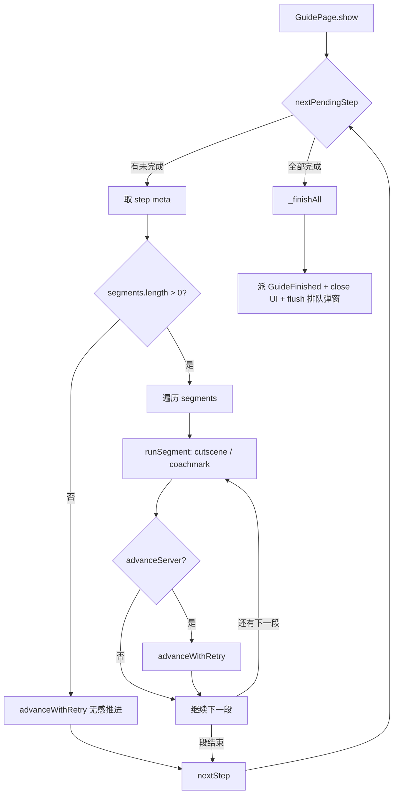

<!-- # 新手引导系统技术设计与实现 -->

## 1. 概述

本文档梳理 **Cocos** 项目新手引导系统的完整技术方案。引导系统负责在用户首次进入主页后，按顺序引导用户完成"喂食 → 收蛋 → 逛集市 → 赚鹅粮 → 碰一碰"五项核心操作。

系统采用**配置驱动的串行状态机**设计，每个引导步骤由若干 Segment 串行组成，每个 Segment 又根据类型分别由 `CutsceneRenderer`（全屏剧情展示）或 `CoachmarkRenderer`（高亮操作引导）渲染。

## 2. 整体架构

```
┌─────────────────────────────────────────────────────────┐
│                     GuideConfig.ts                      │
│   STEP_ORDER / STEP_META / ICoachmarkSeg / ICutsceneSeg │
│   （纯配置，描述引导步骤和每步的展示序列）                     │
└──────────────────────┬──────────────────────────────────┘
                       │ 驱动
┌──────────────────────▼──────────────────────────────────┐
│                    GuidePage.ts                         │
│   主状态机：_runFromStep → _runStep → _runSegment         │
│   负责串行推进步骤、调用渲染器、上报服务端进度                  │
└──────────────────────┬──────────────────────────────────┘
                       │ 调度
            ┌──────────┴──────────┐
            ▼                     ▼
   CutsceneRenderer      CoachmarkRenderer
   (全屏剧情/cutscene)     (高亮操作/coachmark)
            │                     │
            └──────────┬──────────┘
                       │ 辅助
            ┌──────────┼──────────┐
            ▼          ▼          ▼
    HollowMaskBuilder  BubbleBuilder  FingerBuilder
    (镂空蒙层)          (气泡切图)     (引导手势)
```

辅助组件：
- **`GuideAnchorRegistry`**：锚点注册表，业务侧注册目标节点，Renderer 异步等待
- **`GuideService`**：运行时单例，管理引导状态、弹窗排队、进度上报
- **`guideReturnHomeGuard`**：pure function 守卫模块，提供信号侧（baseline）与渲染侧（isHomePageClear）两套判断能力

## 3. 核心技术要点

### 3.1 Step & Segment 两层状态机

引导不是简单的"弹一个提示 → 点掉 → 下一个"，而是一个**两层串行状态机**：

- **Step 层**：5 个步骤按 `STEP_ORDER` 顺序串行执行（1→2→3→4→5），每步完成后调用 `advanceGuideStep` 上报服务端
- **Segment 层**：每个 Step 内部由若干 Segment 串行组成。例如 `STEP_FEED`：
  ```
  ① Cutscene（展示"获得鹅粮"动画 → 3s 倒计时或点击）
  ② Coachmark（高亮喂食按钮 → 点击 + 等 PetFed 事件 + 等用户回主页）
  ```



### 3.2 Segment 类型

#### Cutscene Segment（全屏剧情）

不需要用户与业务 UI 交互，只需要"看到"即可推进。

- **视觉结构**（自上而下）：标题切图 → 主体 prefab（如鹅粮包动画）→ 底部倒计时提示
- **推进信号**：空白点击 OR 倒计时归零（取先到者）
- **典型用例**：STEP_FEED 的「今日登录鹅鹅 收获鹅粮」全屏动画

#### Coachmark Segment（高亮操作引导）

需要用户在主页真实 UI 上执行操作。

- **视觉结构**：全屏半透明蒙层 + 镂空高亮区域 + 气泡切图 + 手指手势动画
- **推进信号**：
  - 无 `businessEvent`：仅点击即推进（如 `STEP_TAP` 碰一碰入口）
  - 有 `businessEvent` + `awaitReturnHome=false`：业务事件到达即推进
  - 有 `businessEvent` + `awaitReturnHome=true`：**双信号到齐**（businessEvent + GuideReturnedHome）才推进

### 3.3 双信号推进机制（核心难点）

这是整个系统最复杂的部分。以 `STEP_FEED` 的第二段 Coachmark 为例：

```
用户点击喂食按钮
  ↓ (ClickProxy 转发 TOUCH_END → 业务 Button 触发喂食)
  ↓
  ├─ 视觉让位：立即隐藏 dim（_hideVisuals），让用户看到主页动画
  ↓
  ├─ 等 PetFed 事件（喂食成功回包）
  │    ├─ 带 PetState 数据，可判断 canLayEgg
  │    └─ 3s 超时兜底（eventTimeout）
  ↓
  └─ 等 GuideReturnedHome 事件（用户从 LayEgg/Bazaar/TaskList 回到主页）
       ├─ canLayEgg=true  → LayEgg弹窗 → 关闭派 GuideReturnedHome → 推进
       ├─ canLayEgg=false → 不会有弹窗 → 直接跳过等待 → 零延迟推进
       └─ 30s 超时兜底（极端情况）
```

**设计要点**：
| 配置项 | 说明 | 兜底策略 |
|--------|------|----------|
| `businessEvent` | 业务事件名，如 `PetFed`、`BazaarOpened`、`TaskPanelOpened` | `eventTimeout`（默认3s） |
| `awaitReturnHome` | 是否等待用户从子页面回到主页 | 30s 兜底 timer + `canLayEgg` 捷径 |

### 3.4 锚点注册与异步等待

引导需要高亮的 UI 节点（喂食按钮、集市入口等）由各个业务模块在创建时注册到 `GuideAnchorRegistry`：

```typescript
// 业务侧（如 MainHomeBuilder）
GuideAnchorRegistry.ins.register('home.feed-button', feedButtonNode);
GuideAnchorRegistry.ins.register('home.bazaar-entry', bazaarEntryNode);
```

CoachmarkRenderer 通过 `waitFor(id, 5000)` 异步等待节点就绪，5s 超时后整段降级跳过。

**节点销毁自动摘除**：锚点节点被销毁时自动从注册表移除，避免悬挂引用。

### 3.5 镂空蒙层实现

采用 **Mask + 反向裁剪（inverted stencil）** 方案：

```
dim 容器（全屏 UITransform）
 ├─ HoleClip（Mask GRAPHICS_STENCIL + inverted=true + Graphics 画镂空形状）
 │    └─ DimFill（全屏 2x 放大黑色 Graphics）
 │         → 受 inverted Mask 影响：镂空内透明、镂空外暗色
 ├─ BubbleBuilder（气泡切图，直接挂 dim 下不进 Mask）
 ├─ FingerBuilder（手势动画）
 └─ ClickProxy（透明触摸代理，覆盖镂空区域）
```

为什么不直接用 Graphics 画 even-odd 路径？因为 Cocos 3.8 Graphics 仅支持 nonzero 填充规则，同一 path 反向走点不能稳定挖洞。

### 3.6 引导期弹窗守卫

引导正在运行时，非白名单的 PopUp/Dialog 层弹窗会被拦截入队，引导结束后按顺序弹出：

| 白名单 | 原因 |
|--------|------|
| `Guide` | 引导自身 |
| `LayEgg` | STEP_FEED 喂食后必须看到金蛋弹窗；hide 时派 GuideReturnedHome |
| `Bazaar` | STEP_COLLECT 点击集市入口后需要进入 |
| `TaskList` | STEP_EARN_FOOD 点击赚鹅粮入口后需要进入 |
| `GoodsDetail` | 用户在集市内主动点击兑换卡片 |
| `GetGameGooseFood` | 内部自带引导期守卫 |

### 3.7 蒙层渲染的三层守卫

由于双信号推进依赖多个上游 hide 各自派发 `GuideReturnedHome`（涉及 Bazaar / TaskListModal / BumpPage / LayEggDialog / ReceiveTipDialog / GameDataAuthDialog 六处），派发时序容易出问题。系统采取"信号侧 + 渲染侧"双重防护：

**信号侧守卫**（在事件到达时判断，防止错误推进）：
1. **残留信号守卫**：`businessEvent` 之前到达的 `GuideReturnedHome` 视为上一段延迟派发的残留信号，直接忽略
2. **baseline 守卫**：段启动时记录当前 active 的全屏弹窗集合作为 baseline；之后新打开的弹窗必须**全部关闭**才算"真的回主页"

**渲染侧守卫**（在蒙层要画的一刻判断，防止错误渲染）：
3. **isHomePageClear 守卫**：CoachmarkRenderer 在锚点等到后、构建镂空之前，主动查询当前 PopUp / Dialog 层的 active UIID 集合；除引导页自身外若还有其他弹窗，则轮询等待其关闭再渲染

三层守卫互相独立、逐层兜底——任一失效，下一层仍能拦住错位渲染。详见 [问题 7](#问题-7引导蒙层错位到子页面单纯信号侧守卫不够)。

## 4. 开发中遇到的问题与解决方案

### 问题 1：点击后引导迟迟不推进 —— 单信号等待的局限性

**现象**：最早的实现是"点击即推进"，点击喂食按钮后引导立刻销毁，但此时 `LayEgg` 弹窗还没弹出，导致引导结束后金蛋弹窗盖在正常 UI 上，体验混乱。

**根本原因**：点击与业务结果的时序不同步。点击只是触发请求，真正的业务结果（喂食成功、页面跳转）需要时间返回。

**解决方案**：引入 **双信号推进机制**——`businessEvent` 和 `GuideReturnedHome` 到齐后才推进：
- `businessEvent`（如 `PetFed`）确认业务已成功
- `GuideReturnedHome` 确认用户已从子页面/弹窗回到主页

### 问题 2：GuideReturnedHome 事件丢失

**现象**：用户不通过高亮区域点击，而是直接点击别的兑换卡片完成兑换 → Bazaar 自动关闭 → `GuideReturnedHome` 已派发，但 CoachmarkRenderer 还没订阅 → **事件被错过**，dim 蒙层残留，引导卡死。

**原因**：原实现把 `GuideReturnedHome` 的订阅放在 `_onTargetClicked()` 内部，如果用户不走高亮通道，订阅永远不会建立。

**解决方案**：将 `GuideReturnedHome` 的订阅提前到 `_start()` 阶段，与 `businessEvent` 同步订阅，确保无论事件何时到达都不会被错过。

### 问题 3：鹅不产蛋时的 5 秒空等

**现象**：用户喂食完 → `PetFed` 事件已到 → 但鹅 `canLayEgg = false`，`LayEggDialog` 不会弹出 → `GuideReturnedHome` 永远不会来 → 即使 5s 短兜底，用户也要硬等 5 秒才能看到下一步引导。

**原因**：上一版修复用了 `RETURNED_HOME_SHORT_TIMEOUT = 5000` 兜底，但仍然是空等。

**解决方案**：`_onBusinessEvent` 收到的 `PetFed` 事件 payload 携带 `PetState`，直接读取 `pet.canLayEgg`。如果为 `false`，立即将 `_returnedHomeFired` 置为 `true`，**零延迟推进**，不再等待任何 timer。

```typescript
// PetFed 事件携带 PetState，若 canLayEgg=false 则鹅不产蛋，
// LayEggDialog 不会弹出、GuideReturnedHome 永远不会来，直接跳过等待。
const petCanLay = (payload as any)?.pet?.canLayEgg;
if (petCanLay === false) {
  this._returnedHomeFired = true;
  this._clearReturnedHomeTimer();
}
```

### 问题 4：引导中"登录收获鹅粮"展示与后台任务系统不一致

**现象**：cutscene ① 硬编码假数据 `iconAmount = 10`，但实际奖励应由后台任务系统（签到 day-1）驱动。用户可能已经领过签到奖励，或者签到配置变更了金额，引导却仍展示虚假的 +10g。

**解决方案**：引入 `requireTaskClaim` 配置项。cutscene ① 运行时：
1. 调用 `TaskService.fetchTaskList()` 检查签到任务状态
2. 找到 `dayNumber=1、state='claimable'` 的任务
3. 有 → 调 `claimTaskReward(taskId)` 真正领取奖励，用返回的真实金额填充 `iconAmount`
4. 无 → 跳过此段 segment，不渲染任何 cutscene

### 问题 5：引导锚点等待超时

**现象**：某些引导步骤迟迟不出高亮，日志显示 `锚点 xxx 等待 5000ms 超时，降级跳过`。

**原因**：业务模块未及时注册锚点节点，或节点被提前销毁。

**解决方案**：
- `GuideAnchorRegistry` 提供 `waitFor(id, timeoutMs)` API，超时返回 `null`
- CoachmarkRenderer 对 `null` 结果做降级处理：整段 segment 跳过，继续推进下一步
- 节点销毁自动摘除（监听 `NODE_DESTROYED` 事件），避免下次拿到已销毁节点

### 问题 6：Mask 镂空无法透出背景

**现象**：用 Graphics + even-odd 规则画矩形挖圆，结果整片都是均匀暗色，无法透出高亮区域。

**原因**：Cocos 3.8 Graphics 仅支持 nonzero 填充规则，没有暴露 `fillRule` 参数。

**解决方案**：改用 **Mask(GRAPHICS_STENCIL) + inverted=true** 方案。在 HoleClip 节点上画镂空形状作为 stencil，反转裁剪后其子节点 DimFill 的全屏黑底仅在镂空外可见，镂空内自然透出背景。

### 问题 7：引导蒙层错位到子页面 —— 单纯信号侧守卫不够

**现象**：用户实际停留在**集市（Bazaar）页面**上，但 STEP_EARN_FOOD 的高亮蒙层（"在这里可以赚取更多鹅粮"气泡 + 圆形挖空）却渲染在了集市之上。目标锚点是主页的"赚鹅粮"入口 `home.task-entry`，但集市盖住了主页，蒙层按世界坐标画在了错误的位置。

**根本原因**：早期已加过两层"信号侧守卫"（残留信号守卫 + baseline 守卫，见 [3.7](#37-蒙层渲染的三层守卫)），但两者都只在 `GuideReturnedHome` 派发的**那一刻**做校验。只要有以下任一情况发生，就还会错位推进：

- 某个页面 hide 时漏派 `GuideReturnedHome`
- tween 期间派发 → 派发时 `node.active` 状态还没同步
- `eventTimeout` 强推兜底路径（如 businessEvent 超时降级）会直接推进，跳过所有守卫
- 用户绕开高亮直接操作 / 跨层弹窗嵌套 / 并发关闭派发多个信号

上游派发链条太长（Bazaar / TaskListModal / BumpPage / LayEggDialog / ReceiveTipDialog / GameDataAuthDialog **六处 hide 各自派发**），任何一处漏派或时序滑动都会让蒙层画在错误的位置。

**解决方案**：在蒙层要画的**那一刻**主动判断当前是否真的在主页——**渲染侧守卫**，不依赖任何上游派发时序。

#### 实现

**① `guideReturnHomeGuard.ts` 新增 `isHomePageClear` pure function**

```ts
export function isHomePageClear(
  getActiveUIs: GetActiveUIsFn,
  allowlist: Set<string>,  // 允许存在的白名单，仅 UIID.Guide 引导页自身
): { clear: boolean; blocking: string[] }
```

查询 PopUp + Dialog 两层当前所有 active UIID，过滤掉白名单（引导页自身必然 active，不算覆盖）后，剩余即"覆盖主页的弹窗"：

- `clear=true`：主页干净，可以安全渲染
- `clear=false`：`blocking` 里列出了阻塞项（如 `['Bazaar']`、`['ReceiveTip']`）

抛错时按"放行"处理，避免异常永远阻塞引导。

**② `CoachmarkRenderer._start` 在锚点等到后、构建镂空之前插入守卫**

```
锚点等待 → [新增] 渲染侧守卫 _waitForHomePageClear → 构建镂空 → 气泡 → 手势
```

守卫逻辑：
- 立即命中干净 → 同步 resolve，无额外延迟（绝大多数场景无副作用）
- 主页不干净 → 每 **200ms** 轮询一次，直到 `isHomePageClear` 返回 `clear=true` 再继续渲染
- 30s 兜底 → 超时强制降级渲染（宁可错位也不无限阻塞引导）
- 期间被 dispose → 立即停并放弃渲染

#### 修复后场景对照

| 场景 | 之前行为 | 修复后行为 |
|---|---|---|
| 正常关闭子页面回主页后推进 | 立即渲染 ✓ | 立即渲染（同步命中 clear） ✓ |
| 派发时序失准，推进到本段时用户还在集市 | **蒙层错位到集市** ✗ | 检测到 `blocking=['Bazaar']`，等到用户关闭集市再渲染 ✓ |
| eventTimeout 强推兜底，用户还在弹窗上 | **蒙层错位** ✗ | 守卫拦住，等干净再画 ✓ |
| 上游漏派 GuideReturnedHome | 依赖信号侧守卫，失效 ✗ | 渲染侧独立判断，不受影响 ✓ |
| 用户长期不关子页面 | 卡死 | 30s 超时降级渲染 |

#### 设计要点

- **信号侧 + 渲染侧双守卫**：信号侧防止"错误推进"，渲染侧防止"错误渲染"，两层独立，任一失效另一层兜底
- **不改上游六处 hide 派发逻辑**：改动完全收口在 CoachmarkRenderer 内部，风险面小
- **性能开销可忽略**：绝大多数场景（用户正常回主页）都是首次同步命中 `clear=true`，无轮询开销；只在异常时序下才轮询，200ms 间隔对用户无感知
- **30s 超时兜底**：不能无限阻塞引导，超时后走原行为（宁可错位一次也不卡死）

### 补充：喂食引导事件的选择

喂食的业务事件不能用"喂食成功"（`PetFed`），要用"喂食结束"（`PetFedEnd`）——不管喂食成功还是失败，都要进入下一步。否则失败路径下用户只能等到 `eventTimeout` 兜底才能推进，体验非常差。

## 5. 关键文件索引

| 文件 | 职责 |
|------|------|
| `module/guide/model/GuideConfig.ts` | 引导步骤与 Segment 配置定义、辅助函数 |
| `module/guide/view/GuidePage.ts` | 引导主状态机，Step/Segment 串行调度 |
| `module/guide/view/renderer/CoachmarkRenderer.ts` | Coachmark 渲染器，双信号推进 + 渲染侧守卫 |
| `module/guide/view/renderer/CutsceneRenderer.ts` | Cutscene 渲染器，倒计时/点击推进 |
| `module/guide/view/renderer/guideReturnHomeGuard.ts` | 守卫 pure function：baseline / isHomePageClear |
| `module/guide/view/builder/HollowMaskBuilder.ts` | 镂空蒙层构建（stencil 反向裁剪） |
| `module/guide/model/GuideAnchorRegistry.ts` | 锚点注册表，异步 waitFor |
| `module/guide/service/GuideService.ts` | 服务端进度上报、弹窗排队与守卫 |
| `module/guide/debug/GuideDebug.ts` | 控制台调试 API（`__guide__.*`） |

## 6. 设计原则总结

1. **配置驱动**：所有引导步骤的行为由 `STEP_META` 配置决定，不硬编码推进逻辑
2. **视觉与逻辑分离**：视觉组件（dim/气泡/手势）可随时隐藏让位，Renderer 继续运行订阅与 timer
3. **多层兜底**：每个异步等待点都有 timer 超时降级（anchor 5s、event 3s、returnHome 30s、renderGuard 30s）
4. **事件早订阅**：`businessEvent` 和 `GuideReturnedHome` 在 `_start()` 阶段就订阅，防止事件早于点击到达丢失
5. **信号侧 + 渲染侧双守卫**：信号侧防错误推进，渲染侧防错误渲染，任一失效另一层兜底
6. **可降级不阻塞**：锚点等待失败、服务端上报失败、timer 超时都不会卡死引导流程
7. **状态与视觉解耦**：`node.active` 未必反映真实用户所在页面（tween 期间 / 层叠弹窗），关键判断必须查 `oops.gui.getActiveUIs`
8. **deps 注入保持 this**：pure function 接受方法引用作参数时，调用方必须用箭头函数包装（`(layers) => oops.gui.getActiveUIs(layers)`），否则 class method 脱离对象 this 丢失
9. **GuideReturnedHome 语义正确性**：只在"用户操作最终目的地是主页"时派发。跨页面跳转（A→B 不经过主页）的 hide 用 `_skipGuideReturnedHome` flag 跳过派发，由最终目的地页面的 hide 负责


### 问题 8：`isHomePageClear` 守卫永远返回 clear=true —— 方法引用丢 this

**现象**：加了 `isHomePageClear` 守卫后，日志显示 TaskListModal 明明 active=true（全层 `getActiveUIs()` 能看到），但 `isHomePageClear` 内部传 `[PopUp, Dialog]` 参数调用时却返回空 → `clear=true` → 守卫形同虚设。

**根本原因**：`isHomePageClear` 的签名接受 `getActiveUIs: GetActiveUIsFn` 作为 deps 注入参数。调用方传的是**方法引用** `oops.gui.getActiveUIs`：

```ts
// ✗ 错误写法——方法引用脱离对象上下文，this 丢失
const ret = isHomePageClear(oops.gui.getActiveUIs, RENDER_GUARD_ALLOWLIST);
```

JavaScript 中把方法赋值给变量后调用，`this` 不再指向原对象。`getActiveUIs` 内部用 `this.instances` / `this.factories` 遍历已注册 UI，this 变成 `undefined` → 遍历空 → 永远返回 `[]`。

全层调用 `oops.gui.getActiveUIs()` 没问题是因为通过属性访问（`.` 操作符）保持了 this 绑定。

**解决方案**：所有传入的地方改成**箭头函数包装**保持 this：

```ts
// ✓ 正确写法——箭头函数保持 oops.gui 的 this 绑定
const ret = isHomePageClear((layers) => oops.gui.getActiveUIs(layers), RENDER_GUARD_ALLOWLIST);
```

**教训**：
- TypeScript 的 deps 注入模式（传函数引用作为参数）必须注意 this 绑定——class method 不是 arrow function，脱离对象调用 this 会丢
- 诊断手段：加对比日志——`getActiveUIs()` 不传参 vs `getActiveUIs([PopUp, Dialog])` 传参的结果差异直接暴露 this 丢失
- pure function 模块接受的 deps 参数，文档/类型上应标注"调用方需确保 this 正确"或直接改为要求传入 arrow function

### 问题 9：跨页面跳转时误派 GuideReturnedHome —— skip 模式

**现象**：
- 场景 A：集市里点公告条"去试试" → 关集市 + 开碰一碰。Bazaar.hide 无条件派 `GuideReturnedHome`，引导以为"用户回主页了" → 推进 → 蒙层错位到 BumpPage
- 场景 B：TaskListModal 里走授权流程后 `_batchGrantAndGoHome` 关 TaskList + 开 ReceiveTipDialog。TaskList.hide 派 `GuideReturnedHome` → 引导推进 → 蒙层错位

**根本原因**：`GuideReturnedHome` 语义是"用户回到了主页"。但"从页面 A 跳转到页面 B"并不是"回主页"——只是页面切换。无条件在 hide 里派发会欺骗引导系统。

**解决方案**：跳转场景（用户从当前页面直接去另一个页面，不经过主页）的 hide 不应派 `GuideReturnedHome`。引入 `_skipGuideReturnedHome` 标志位：

```ts
// Bazaar._onNoticeTap（集市跳碰一碰）
this._skipGuideReturnedHome = true;  // 标记"这次关闭是跳转"
this._close();
void oops.gui.open(UIID.Bump);

// Bazaar.hide 内部
if (this._skipGuideReturnedHome) {
  this._skipGuideReturnedHome = false;  // 重置
} else {
  oops.message.dispatch(EventName.GuideReturnedHome);
}
```

TaskListModal 同理——`_batchGrantAndGoHome` 设 flag，hide 里条件派发。

**设计原则**：`GuideReturnedHome` 只应在"用户操作的最终目的地是主页"时派发。如果关闭当前页面后紧接着要打开另一个页面（不回主页），由最终页面的 hide 负责派发。

---

## 7. 社区/游戏行业主流方案对比

上述问题反复出现说明"允许用户在引导中自由操作 + 靠信号/快照校验"的架构有天然缺陷。调研了行业主流方案供参考：

| 方案 | 代表 | 核心思路 | 优点 | 缺点 |
|------|------|----------|------|------|
| A. 强锁定 | 王者荣耀 / 明日方舟 | dim 永不完全隐藏，保留全屏透明拦截 | 从物理上杜绝错位 | 用户卡死风险，需 Skip 兜底 |
| B. 单点式 | — | 每段独立完成，段间挂起等主页干净再启动下段 | 每段生命周期短，错误影响小 | 改动大，需重写主循环 |
| C. 上下文感知 | intro.js / driver.js | 引导系统订阅 UI 栈变化，错误上下文自动隐藏 | 完全自适应 | 需全局改造 gui 接入 |
| D. 商业插件 | Cocos Store Guide | A + B 组合 | 主流验证 | 通用性差 |

本项目选择**不强锁定**（产品层面）——保留用户自由操作能力，靠 `isHomePageClear` 守卫 + skip 模式 + 渲染前守卫三层防护。
