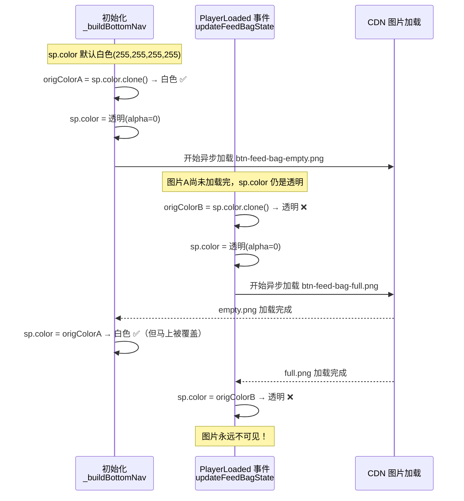
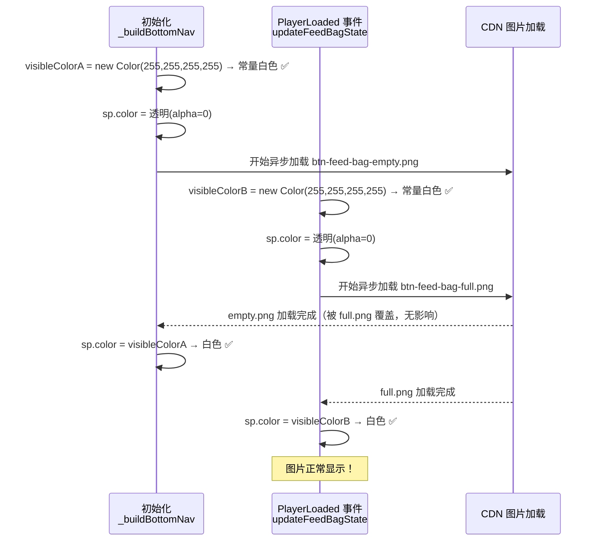

<!-- # CDN 图片存在但不显示 —— `_bindRemoteSprite` 竞态条件 Bug 修复记录 -->

## 一、`_bindRemoteSprite` 是什么，为什么要这样设计

### 背景：Cocos 的"渲染组件互斥"限制

在 Cocos Creator 中，**一个节点只能挂一个渲染组件**（`Sprite`、`Graphics`、`Label` 三者互斥）。如果一个节点已经挂了 `Graphics`（用来画占位矩形），再往同一个节点上 `addComponent(Sprite)` 就会报错：

```
Can't add renderable component "cc.Sprite" to a node that already has one
```

主界面的很多节点在构建时先用 `Graphics` 画了一个占位色块（方便开发阶段看布局），等图片加载完再显示真实切图。如果直接在这些节点上挂 `Sprite`，就会触发上面的报错。

### 解决方案：子节点承载 Sprite

`_bindRemoteSprite` 的核心思路是：**不在目标节点本身挂 `Sprite`，而是创建一个名为 `__remote_sprite` 的子节点，把 `Sprite` 挂在子节点上**。

```
目标节点（有 Graphics 占位）
└── __remote_sprite（挂 Sprite，承载真实图片）
```

这样父节点的 `Graphics` 占位和子节点的 `Sprite` 图片可以共存，互不干扰。

同时，为了防止重复调用时创建多个子节点，方法里会先 `getChildByName('__remote_sprite')`，有则复用，无则新建：

```ts
let spriteHost = node.getChildByName('__remote_sprite');
if (!spriteHost) {
    spriteHost = UIBuilder.createNode('__remote_sprite', node, w, h, 0, 0);
}
```

---

## 二、为什么要"加载前透明，加载后恢复"

图片加载是**异步**的，从发起请求到回调返回有一段时间差（网络延迟 + 纹理上传）。

如果不做任何处理，这段时间内 `Sprite` 组件存在但 `spriteFrame` 为空，Cocos 会渲染出一个**白色实心矩形**，覆盖在父节点的 `Graphics` 占位色块上，视觉上非常突兀。

所以设计了一个"加载中透明"的过渡策略：

```ts
// 加载前：把子节点设为透明，让父节点的 Graphics 占位"透出来"
sp.color = new Color(255, 255, 255, 0);   // alpha = 0，完全透明

oops.res.loadRemoteSpriteFrame(resName, (err, frame) => {
    sp.spriteFrame = frame;
    sp.color = visibleColor;              // 加载完成：恢复不透明，图片显现
});
```

**效果**：加载期间用户看到的是 `Graphics` 画的占位色块，图片加载完成后无缝替换，没有白色闪烁。

---

## 三、为什么用白色，用其他颜色行不行

### Cocos Sprite 的 `color` 是"色调叠加"，不是"背景色"

Cocos 中 `Sprite.color` 的作用是对图片像素做**逐通道乘法混合（Tint）**，公式是：

```
最终像素颜色 = 图片原始像素 × (color / 255)
```

| `sp.color` 设置 | 效果 |
|---|---|
| `(255, 255, 255, 255)` 白色 | `图片 × 1.0` → 图片原色，完全不变 ✅ |
| `(255, 0, 0, 255)` 红色 | `图片 × (1, 0, 0)` → 图片只保留红色通道，整体偏红 ❌ |
| `(128, 128, 128, 255)` 灰色 | `图片 × 0.5` → 图片整体变暗 ❌ |
| `(255, 255, 255, 0)` 透明白 | alpha=0 → 完全不可见（加载中状态）✅ |

所以**白色 `(255, 255, 255, 255)` 是唯一能让图片"原样显示"的颜色**，用其他颜色会让图片产生色偏或变暗。

---

## 四、Bug 是怎么产生的

### 旧代码的写法

```ts
// ❌ 旧代码
const origColor = sp.color.clone();  // 克隆当前颜色作为"恢复目标"
sp.color = new Color(origColor.r, origColor.g, origColor.b, 0);  // 设为透明

oops.res.loadRemoteSpriteFrame(resName, (err, frame) => {
    sp.spriteFrame = frame;
    sp.color = origColor;  // 加载完成后恢复
});
```

这个写法的意图是：先记住当前颜色，加载完成后恢复回去。**在只调用一次的情况下完全正确**。

### 竞态条件触发路径

问题出在 `_bindRemoteSprite` 被**同一个节点快速调用两次**的场景：



**根本原因**：`origColor` 依赖了一个"加载中的临时状态"（透明），而不是"图片应该显示的最终状态"（白色）。

---

## 五、修复方案

### 核心思路

`origColor` 不应该从 `sp.color` 克隆，因为 `sp.color` 在加载期间是临时的透明状态，不代表图片的正确显示颜色。

图片的正确显示颜色永远是**白色**（不带任何色调叠加），所以直接用常量替代：

```ts
// ✅ 修复后
const visibleColor = new Color(255, 255, 255, 255);  // 常量，不依赖 sp.color 的当前状态
sp.color = new Color(255, 255, 255, 0);              // 加载中透明

oops.res.loadRemoteSpriteFrame(resName, (err, frame) => {
    sp.spriteFrame = frame;
    sp.color = visibleColor;  // 始终恢复为白色，不受上一次调用状态影响
});
```

修复后的时序：



### 修改文件

`MainHomeBuilder.ts` 中的 `_bindRemoteSprite` 和 `_bindLocalSprite` 两个方法同步修复。

---

## 六、经验总结

> **异步操作的"完成后恢复值"必须是不可变常量，绝不能依赖可能被并发修改的共享状态。**

本案例中，`sp.color` 是共享的可变状态，在异步加载期间会被设为透明。如果把这个临时状态当作"原始值"保存，就会在下一次调用时把"临时状态"误认为"正常状态"，形成竞态。

类似的风险模式在其他异步场景中也很常见，排查时可以问自己：**"我保存的这个值，在异步回调执行时还是我期望的值吗？"**
