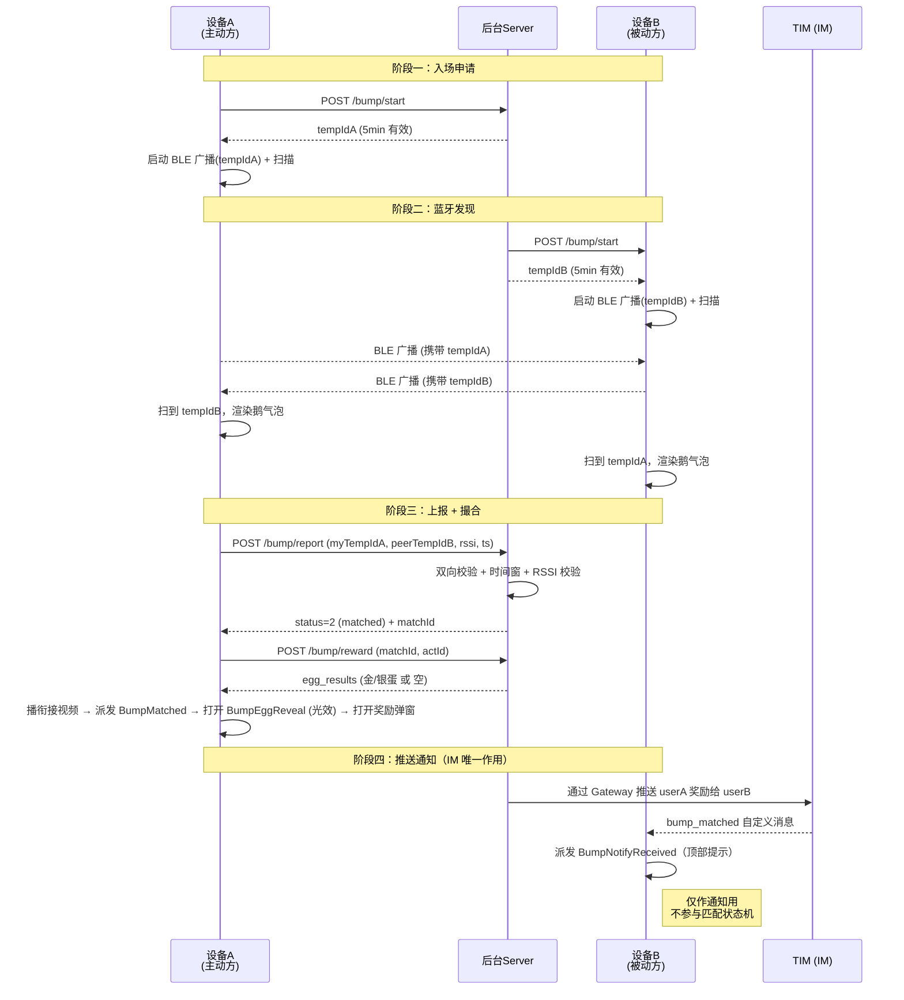

```mermaid
sequenceDiagram
    participant 设备A as 设备A<br/>(主动方)
    participant 后台Server as 后台Server
    participant 设备B as 设备B<br/>(被动方)
    participant TIM as TIM (IM)

    Note over 设备A,设备B: 阶段一：入场申请
    设备A->>后台Server: POST /bump/start
    后台Server-->>设备A: tempIdA (5min 有效)
    设备A->>设备A: 启动 BLE 广播(tempIdA) + 扫描

    Note over 设备A,设备B: 阶段二：蓝牙发现
    后台Server->>设备B: POST /bump/start
    后台Server-->>设备B: tempIdB (5min 有效)
    设备B->>设备B: 启动 BLE 广播(tempIdB) + 扫描
    设备A-->>设备B: BLE 广播 (携带 tempIdA)
    设备B-->>设备A: BLE 广播 (携带 tempIdB)
    设备A->>设备A: 扫到 tempIdB，渲染鹅气泡
    设备B->>设备B: 扫到 tempIdA，渲染鹅气泡

    Note over 设备A,设备B: 阶段三：上报 + 撮合
    设备A->>后台Server: POST /bump/report (myTempIdA, peerTempIdB, rssi, ts)
    后台Server->>后台Server: 双向校验 + 时间窗 + RSSI 校验
    后台Server-->>设备A: status=2 (matched) + matchId
    设备A->>后台Server: POST /bump/reward (matchId, actId)
    后台Server-->>设备A: egg_results (金/银蛋 或 空)
    设备A->>设备A: 播衔接视频 → 派发 BumpMatched → 打开 BumpEggReveal (光效) → 打开奖励弹窗

    Note over 设备A,设备B: 阶段四：推送通知（IM 唯一作用）
    后台Server->>TIM: 通过 Gateway 推送 userA 奖励给 userB
    TIM-->>设备B: bump_matched 自定义消息
    设备B->>设备B: 派发 BumpNotifyReceived（顶部提示）
    Note right of 设备B: 仅作通知用<br/>不参与匹配状态机

```
