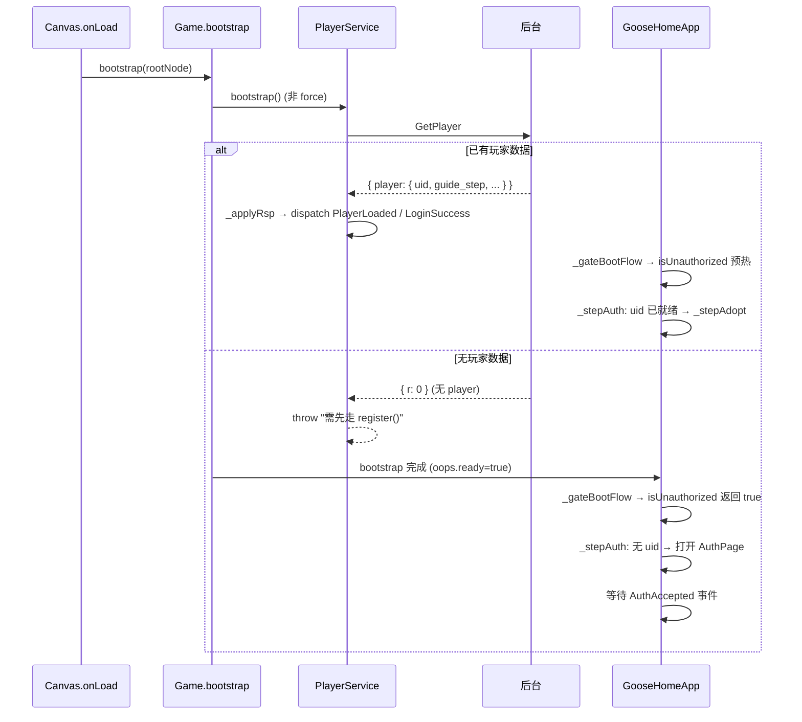
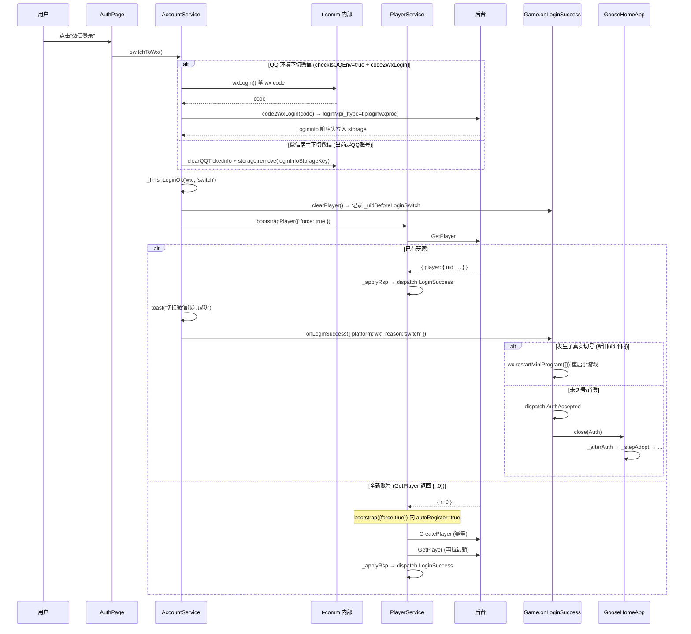
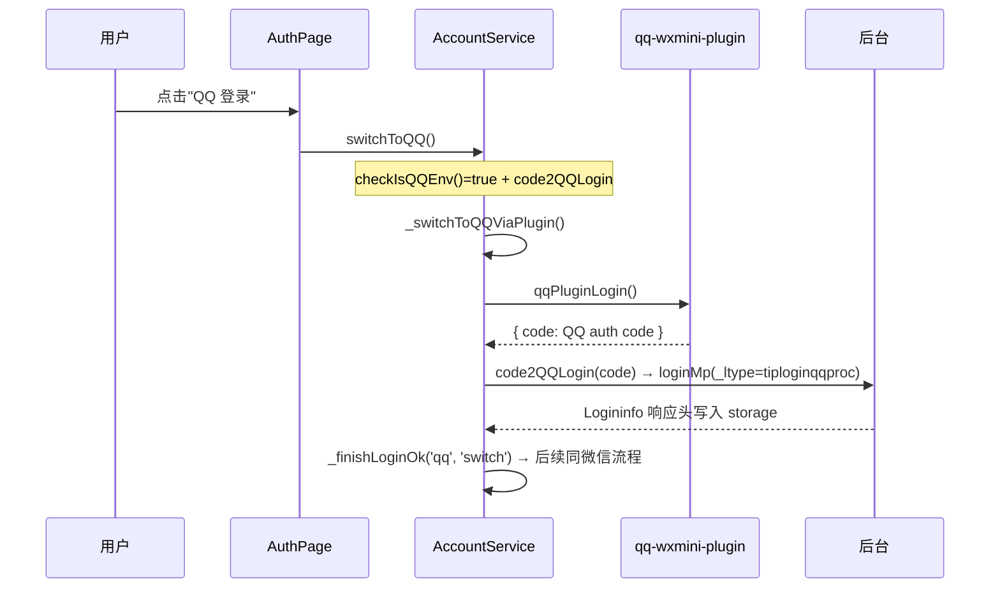
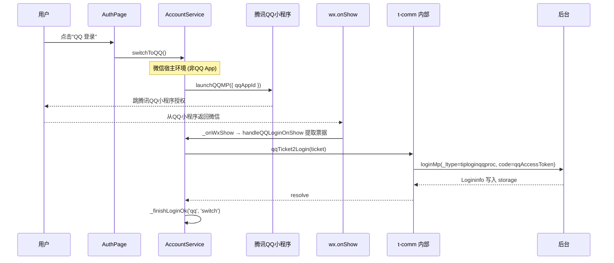
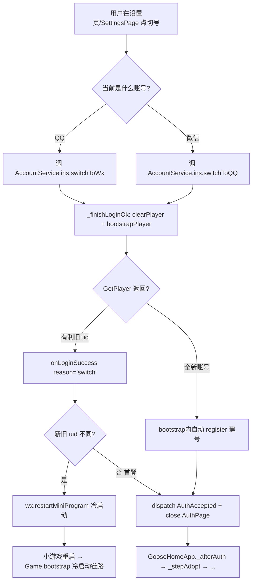
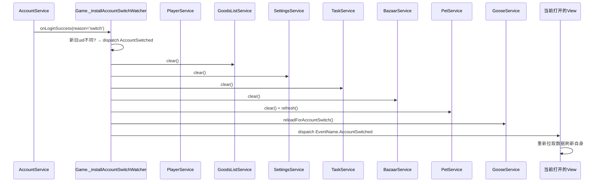
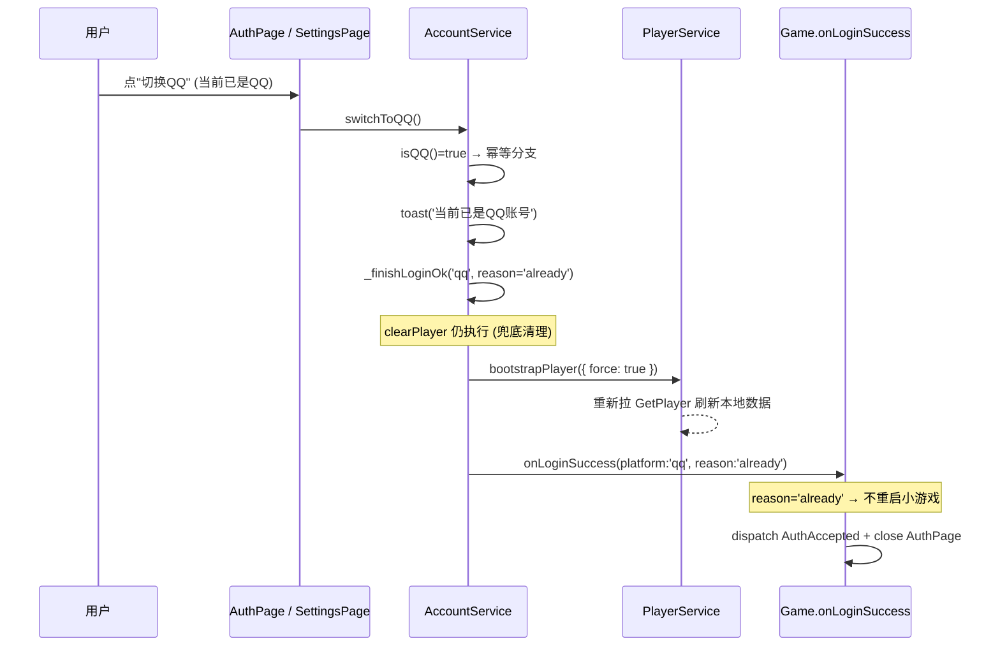
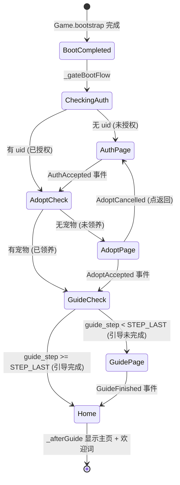

<!-- # 账号体系技术文档 -->

> 微信小游戏中的 QQ/微信双账号登录、切换账号、首登引导全链路。

## 1. 架构总览

项目基于 `@tencent/t-comm` 3.x 的 `AccountService`，业务侧通过 `Game.bootstrap()` 中 `AccountService.configure()` 注入依赖后，调用 `AccountService.ins.switchToQQ()` / `switchToWx()` 完成切号。所有登录成功路径最终汇聚到 `onLoginSuccess` 回调，再与 `GooseHomeApp` 的门控（_stepAuth → _stepAdopt → _stepGuide）衔接。

```
┌──────────────────────────────────────────────────────┐
│                    应用层 (Game.ts)                   │
│  AccountService.configure({                          │
│    clearPlayer / bootstrapPlayer / onLoginSuccess    │
│    code2QQLogin / code2WxLogin / qqTicket2Login      │
│  })                                                  │
├──────────────────────────────────────────────────────┤
│                    门控层 (GooseHomeApp.ts)           │
│  _gateBootFlow → _stepAuth → _stepAdopt →            │
│  _stepGuide → _afterGuide                            │
├──────────────────────────────────────────────────────┤
│                    登录 UI 层 (AuthPage.ts)           │
│  _onQqLogin() / _onWechatLogin()                     │
├──────────────────────────────────────────────────────┤
│                    玩家服务层 (PlayerService.ts)       │
│  bootstrap() / register() / _doBootstrap()           │
├──────────────────────────────────────────────────────┤
│                  t-comm 第三方层                      │
│  AccountService.switchToQQ / switchToWx              │
│  _finishLoginOk / _consumeQQTicket                   │
└──────────────────────────────────────────────────────┘
```

---

## 2. 核心角色与事件

| 角色 | 说明 |
|------|------|
| `AccountService` | t-comm 提供的双账号切号能力，业务侧注入依赖后使用 |
| `PlayerService` | 本游戏的玩家数据服务（GetPlayer / CreatePlayer），按 uid 存储玩家状态 |
| `PetService` | 宠物服务，判断是否已领养（`hasAnyPet()`） |
| `GuidePage` | 新手引导页，按 guide_step 切换步骤 |

| 事件 | 含义 | 派发者 | 消费者 |
|------|------|--------|--------|
| `LoginStart` | 登录开始 | PlayerService.bootstrap | — |
| `PlayerLoaded` | 玩家数据已就绪 | PlayerService._applyRsp | 主页 HUD 刷新等 |
| `LoginSuccess` | 登录成功 | PlayerService._applyRsp | 每日签到、上报、切号检测 |
| `LoginFail` | 登录失败 | PlayerService.bootstrap | — |
| `AuthAccepted` | 授权完成（用户点了登录按钮） | Game.onLoginSuccess | GooseHomeApp._afterAuth |
| `AdoptAccepted` | 领养完成 | AdoptPage | GooseHomeApp._afterAdopt |
| `AdoptCancelled` | 领养取消（点返回） | AdoptPage | GooseHomeApp._onAdoptCancelled |
| `GuideFinished` | 引导完成 | GuidePage | GooseHomeApp._afterGuide |
| `AccountSwitched` | 账号已切换 | Game._installAccountSwitchWatcher | 各 View 刷新自身 |

---

## 3. 冷启动完整链路



冷启动时的关键决策：
- `bootstrap()`（非 force）**不会静默注册** CreatePlayer。GetPlayer 没返回 player → 抛错，由 `GooseHomeApp._stepAuth` 弹 `AuthPage`，等用户显式点"微信登录"或"QQ 登录"
- `isUnauthorized()` 同步调用 GetPlayer + GetPetInfo，完成一次数据预热，结果落到 PlayerService / PetService 单源

---

## 4. 微信登录流程



关键点：
- `code2WxLogin` 走 `loginMp(_ltype=tiploginwxproc)`，响应头 `Logininfo` 写入 `loginInfoStorageKey`
- `_finishLoginOk` 内部时序：`clearPlayer → bootstrapPlayer → toast → onLoginSuccess`
- 切号后若新旧 uid 不同 → `wx.restartMiniProgram({})` 彻底重启，无需逐个 Service clear
- 全新账号 → `bootstrap({force:true})` 自动走 register 建号

---

## 5. QQ 登录流程

QQ 登录有两个子路径，取决于运行环境：

### 5.1. QQ App 直达路径（Plugin）



### 5.2. 微信宿主跳腾讯 QQ 小程序路径



`qqTicket2Login` 配置（Game.ts 第 299-311 行）：
```typescript
qqTicket2Login: ticket => loginMp({
    url: `${getBaseUrl()}/merc.iGoose.players_cgi.players_cgi/GetPlayer`,
    appid: QQ_APP_ID,
    _ltype: 'tiploginqqproc',
    code: `${ticket.qqAccessToken}`,    // QQ access_token 当 code 透传
    storage: loginInfoStorage,
    storageKey: apiConfig.loginInfoStorageKey,
    qqTicketInfo: ticket,
    onLoginInfo: () => {
        loginInfoStorage.remove('user_picked_wx'); // 切QQ清微信偏好
    },
}),
```

---

## 6. 切换账号全流程

### 6.1. 切号 → 重启（正常路径）



### 6.2. 切号 → 就地刷新（非小游戏环境兜底）

当 `wx.restartMiniProgram` 不可用时（如浏览器/编辑器预览），走 `_installAccountSwitchWatcher` 兜底：



---

## 7. 幂等重登流程（已是当前账号）

用户当前是 QQ 账号时点"切换QQ"，或当前是微信时点"切换微信"：



幂等重登的 `reason='already'` 跳过 `wx.restartMiniProgram` 判断，只拉最新玩家数据 + 关登录页。

---

## 8. PlayerService 关键方法

### 8.1. bootstrap

```
bootstrap({ force?: boolean })
│
├─ force=false (冷启动)
│   ├─ 已有 state.uid → 直接 return (缓存命中)
│   ├─ 无 uid → _doBootstrap(autoRegister=false)
│   │   ├─ GetPlayer 有 player → _applyRsp
│   │   └─ GetPlayer 无 player → throw "需先走 register()"
│   │                          → 上层 GooseHomeApp._stepAuth 弹 AuthPage
│   └─
│
└─ force=true (切号 / AuthPage 登录)
    ├─ state 清空为 createEmptyPlayerState()
    └─ _doBootstrap(autoRegister=true)
        ├─ GetPlayer 有 player → _applyRsp (回坑老号)
        └─ GetPlayer 无 player → this.register() 自动建号
            ├─ CreatePlayer (后端幂等)
            └─ GetPlayer 再拉最新 → _applyRsp
```

### 8.2. _applyRsp

```
_applyRsp(rsp)
├─ fromGetPlayerRsp(rsp) → state (含 uid/guide_step/food_amount/game_auths)
├─ oops.storage.set(STORAGE_KEY, state) → 本地持久化
├─ oops.storage.setUser(state.uid) → 切换 storage 命名空间
├─ dispatch EventName.PlayerLoaded
├─ dispatch EventName.LoginSuccess
└─ return state
```

---

## 9. GooseHomeApp 门控状态机



每一步门控都是独立的"全屏页拦截"，只有当前步骤通过才推进到下一步，最终到达 `_afterGuide` 显示主页面。

---

## 10. 关键文件索引

| 文件 | 职责 |
|------|------|
| `assets/scripts/Game.ts` | `AccountService.configure` 注入、`onLoginSuccess` 回调、`_installAccountSwitchWatcher` 切号兜底 |
| `assets/scripts/module/auth/view/AuthPage.ts` | 启动授权页 UI，`_onWechatLogin` / `_onQqLogin` 入口 |
| `assets/scripts/module/player/service/PlayerService.ts` | `bootstrap` / `register` / `_doBootstrap` / `isUnauthorized` |
| `assets/scripts/GooseHomeApp.ts` | `_gateBootFlow` → `_stepAuth` → `_stepAdopt` → `_stepGuide` → `_afterGuide` 门控 |
| `assets/scripts/module/adopt/view/AdoptPage.ts` | 领养取名页，派发 `AdoptAccepted` / `AdoptCancelled` |
| `assets/scripts/module/guide/view/GuidePage.ts` | 新手引导页，派发 `GuideFinished` |
| `assets/scripts/config/EventName.ts` | 事件枚举定义（`AuthAccepted` / `LoginSuccess` 等） |
| `node_modules/@tencent/t-comm/es/qq-mp/AccountService.mjs` | t-comm 第三方 AccountService 实现 |
| `node_modules/@tencent/t-comm/es/qq-mp/qq-mp.mjs` | `launchQQMP` / `handleQQLoginOnShow` QQ 小程序跳转 |
| `node_modules/@tencent/t-comm/es/qq-mp/qq-mini-plugin.mjs` | `initQQMiniPlugin` / `qqPluginLogin` / `wxLogin` |

---

## 11. 常见问题排查

### 11.1. 切到全新 QQ 账号后卡在授权页，日志报 `_finishLoginOk bootstrap 失败`

**原因**：`bootstrap({force:true})` 中 GetPlayer 返回 `{r:0}`（无 player），旧版 `_doBootstrap` 直接 throw，`onLoginSuccess` 兜底 register 走不到。

**解决**：`bootstrap({force:true})` 传 `autoRegister=true` 给 `_doBootstrap`，GetPlayer 无 player 时自动 `register()` 建号 → `onLoginSuccess` 正常触发。

### 11.2. Android 微信真机 `wx.getPhoneNumber` 返回 `fail: no permission`

**原因**：Android 端微信小游戏不支持该 API（仅 iOS 可用）。

**解决**：调用前做平台判断，Android 降级为手动输入 + 短信验证码。

### 11.3. 切号后主页数据没刷新

**正常路径**：切号检测新旧 uid 不同 → `wx.restartMiniProgram({})` → 小游戏完全重启，所有数据重新拉取。

**兜底路径**（非小游戏环境）：`_installAccountSwitchWatcher` 逐个 Service clear + PetService.refresh + 派发 `AccountSwitched`，当前打开的 View 需监听该事件自行刷新。
