# 蓝牙碰一碰通信机制详解

## 一、整体架构

本项目蓝牙碰一碰功能基于**微信小游戏 BLE API**（`wx.openBluetoothAdapter` / `wx.startBluetoothDevicesDiscovery` / `wx.createBLEPeripheralServer` 等）实现，采用三层架构：

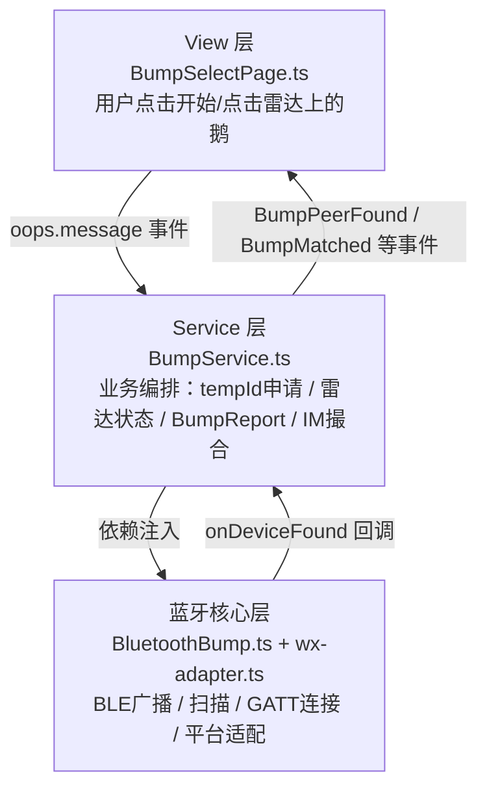

---

## 二、关键标识符

| 标识符 | 值 | 说明 |
|--------|-----|------|
| `DEFAULT_SERVICE_UUID` | `0000FEED-0000-1000-8000-00805F9B34FB` | 自定义 GATT Service UUID，作为"同一个小游戏"的识别标记 |
| `DEFAULT_CHARACTERISTIC_UUID` | `0000BEEF-0000-1000-8000-00805F9B34FB` | GATT Characteristic UUID，存放 payload 数据 |
| `BUMP_MANUFACTURER_ID` | `0xFEED` | Manufacturer Specific Data 的厂商 ID |
| `PAYLOAD_SEPARATOR` | `\|` | payload 分隔符，格式 `<tempId>\|<petId>` |

**payload 字符串示例**：`NLDY4WFJW6|3f4nv5bgfe9ad`

---

## 三、完整通信时序

### 3.1 启动阶段

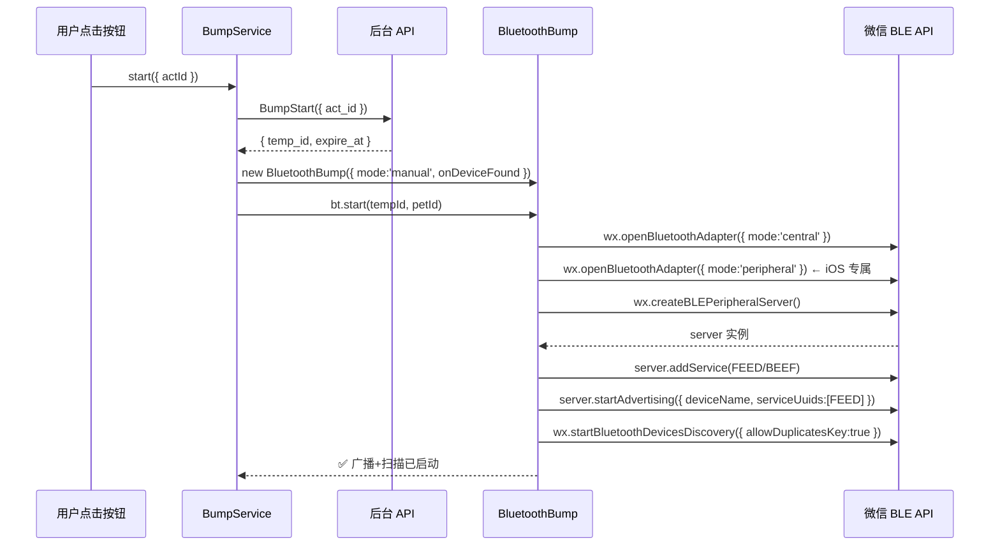

> **⚠️ iOS 限制**：`wx.openBluetoothAdapter` 必须在用户点击事件回调中调用，否则报 `fail click action before resolve is needed`。iOS 需要分别以 `central` 和 `peripheral` 两种 mode 各调一次。

---

### 3.2 广播阶段（Peripheral 角色）

每台设备通过 `wx.createBLEPeripheralServer` 创建外围设备服务器，向外广播身份信息。

#### 广播包结构

```
BLE Advertising Packet（31字节上限）
├── AD Type 0x01  Flags（3字节）
├── AD Type 0x07  Complete List of 128-bit UUIDs
│     └── 0000FEED-0000-1000-8000-00805F9B34FB（18字节）
├── AD Type 0x09  Complete Local Name
│     └── "NLDY4WFJW6_3f4nv5bgfe9ad"（25字节）
└── AD Type 0xFF  Manufacturer Specific Data
      └── mfrId(0xFEED, 2B) + payload字符串
```

**核心代码**（`wx-adapter.ts`）：

```ts
// 只广播 [FEED] 一个 UUID，释放广播包空间给完整 deviceName
server.startAdvertising({
  advertiseRequest: {
    deviceName: bumpName,                    // "NLDY4WFJW6_3f4nv5bgfe9ad"
    serviceUuids: [params.serviceUuid],      // ["0000FEED-..."]
    manufacturerData: [{ manufacturerId: BUMP_MANUFACTURER_ID, manufacturerSpecificData }],
    serviceData: [{ uuid: params.serviceUuid, data: valueBuf }],
  }
})
```

> **为什么去掉 `BUMP_` 前缀？**
> 早期同时广播 3 个 UUID（FEED + BE01 + BE02），广播包空间耗尽，iOS 系统将 `localName` 截断至仅剩 3 字节（`BUMP_NLDY4WFJW6_3f4nv5bgfe9ad` → `NLD`）。去掉前缀并只广播 `[FEED]` 一个 UUID 后，`localName` 有足够空间放下完整 25 字节 payload。

#### 广播 Fallback 机制

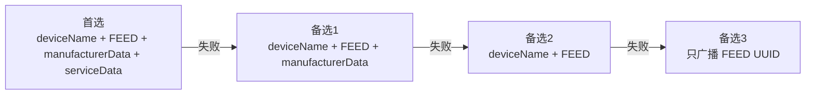

#### GATT Peripheral 三种响应机制

注册 GATT 服务后，iOS Peripheral 通过三种方式响应对端的数据请求：

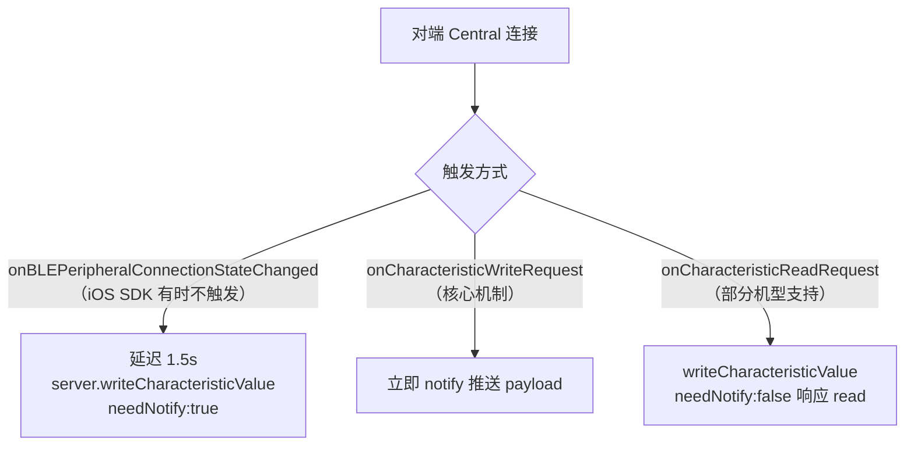

**核心代码**（`wx-adapter.ts`）：

```ts
// 核心：监听 write 请求，收到后立即 notify 推送 payload
// 绕过 onBLEPeripheralConnectionStateChanged 在微信 iOS SDK 里不触发的问题
if (typeof wx.onCharacteristicWriteRequest === 'function') {
  wx.onCharacteristicWriteRequest((res: any) => {
    server.writeCharacteristicValue({
      serviceId: params.serviceUuid,
      characteristicId: params.characteristicUuid,
      value: valueBuf,
      needNotify: true,   // 通过 Notification 推送给订阅方
    });
  });
}
```

---

### 3.3 扫描阶段（Central 角色）

每台设备通过 `wx.startBluetoothDevicesDiscovery` 扫描附近 BLE 设备。

#### 扫描参数

```ts
wx.startBluetoothDevicesDiscovery({
  allowDuplicatesKey: true,  // 允许重复上报，用于 RSSI 实时更新
  interval: 0,               // 最快扫描间隔
  // ⚠️ 不传 services 过滤！
  // 原因：iOS 广播包经微信 SDK 重新包装后 serviceUUIDs 格式可能不匹配，
  //       Android 传 services 过滤后实测完全扫不到 iOS 设备。
})
```

扫到设备后，通过 `wx.onBluetoothDeviceFound` 回调触发 `_onPeerFound`，再用 `matchesService()` 做软过滤：

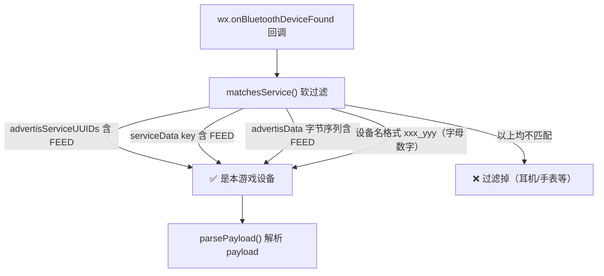

> **iOS 兜底轮询**：iOS 上 `allowDuplicatesKey: true` 有时不上报重复设备，导致 RSSI 不更新。因此每 1500ms 调一次 `wx.getBluetoothDevices()` 主动轮询。

---

### 3.4 Payload 解析：多通道候选池

`parsePayload()` 从多个通道并行解析，选出信息最完整的结果：

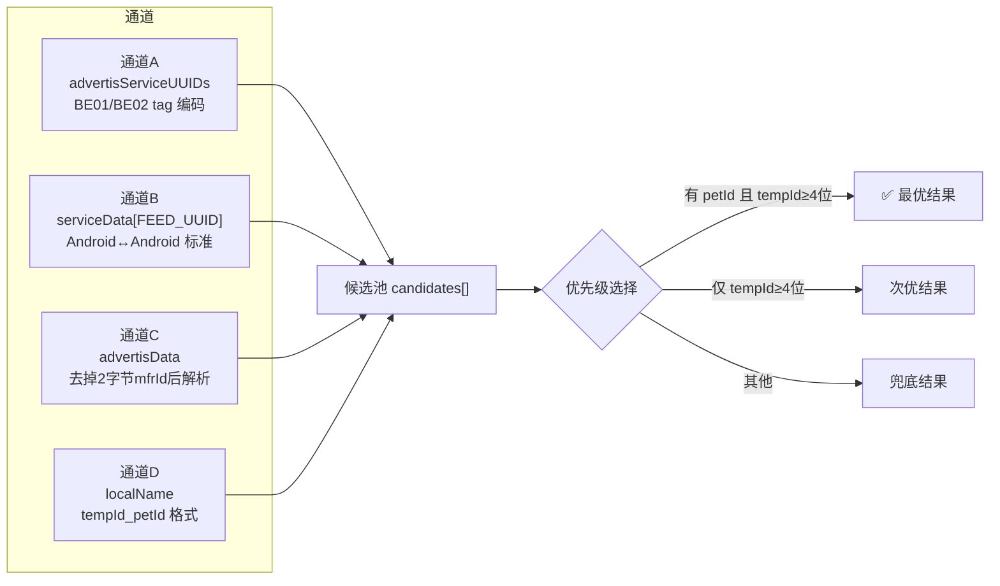

**核心代码**（`utils.ts`）：

```ts
// 挑最完整的：优先 (有 petId 且 tempId 长度 ≥ 4) > (仅 tempId 长度 ≥ 4) > 其他
const withPet = candidates.find((c) => !!c.petId && (c.myTempId?.length || 0) >= 4);
if (withPet) return withPet;
const fullTemp = candidates.find((c) => (c.myTempId?.length || 0) >= 4);
if (fullTemp) return fullTemp;
return candidates[0];
```

---

### 3.5 GATT 主动连接补齐（方案 C）

当广播里解析不出完整 payload 时（尤其是 **iOS 扫 Android** 场景），触发 GATT 主动连接读取。

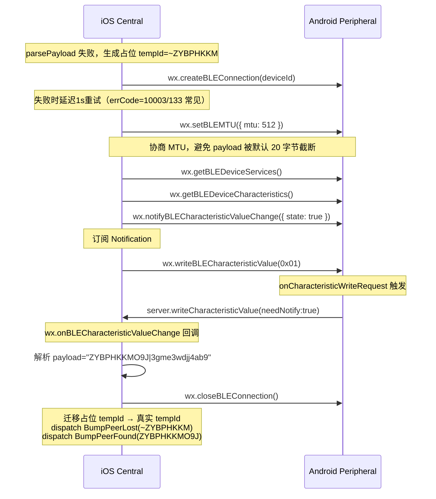

**核心代码**（`BumpService.ts`）：

```ts
// 广播里没拿到 petId 时，发起主动 GATT 连接读取对端特征值
if (rawPetId) {
  void this._fetchPeerNickAndUpdate(peerTempId, rawPetId);
} else if (deviceId && this.bt) {
  void this._fetchPeerPetIdViaGatt(peerTempId, deviceId);
}
```

**保护机制**：
- **并发去重**：同一 `deviceId` 的并发调用返回同一个 Promise
- **失败熔断**：累计失败 ≥ 3 次后直接返回空串，不再重试
- **超时兜底**：整个流程 8 秒超时，超时后强制 `wx.closeBLEConnection`

---

### 3.6 雷达状态机

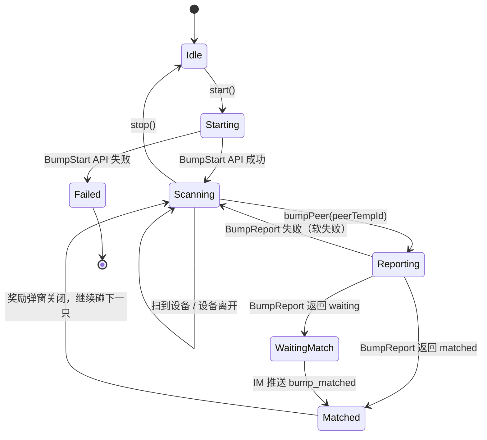

#### 雷达核心数据结构

```ts
// BumpService.ts 内部状态
peerLastSeen: Map<string, number>    // tempId → 最后扫到时间戳（超过8s视为离开）
deviceIdToPeer: Map<string, string>  // deviceId → tempId（去重 + 占位迁移）
peerNickCache: Map<string, string>   // petId → nick（避免重复请求 apiGetPetInfo）
bumpedSet: Set<string>               // 本会话已碰过的 tempId（不能重复碰）
```

#### 占位 tempId 迁移逻辑

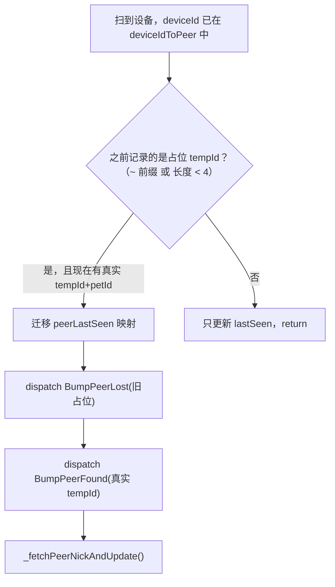

---

### 3.7 碰一碰上报与 IM 撮合

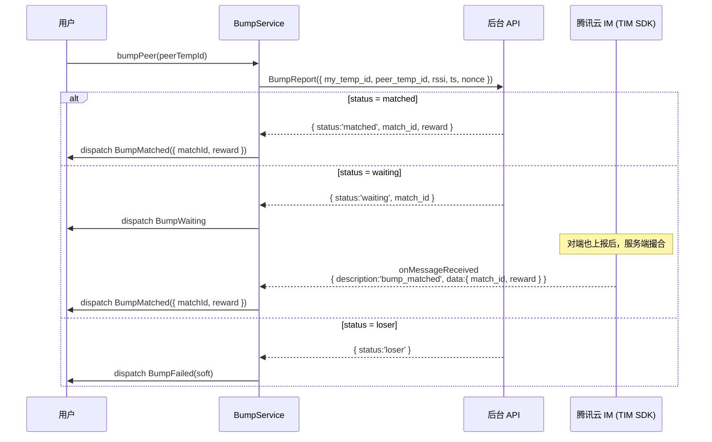

**IM 消息格式**（与服务端约定）：

```ts
// TIM 自定义消息（CUSTOM 类型）
{
  payload: {
    description: "bump_matched",          // 固定标识
    data: JSON.stringify({
      match_id: "xxx",
      peer_uid: "yyy",
      reward: { name: "古茗券", count: 1 }
    })
  }
}
```

---

## 四、跨平台兼容性矩阵

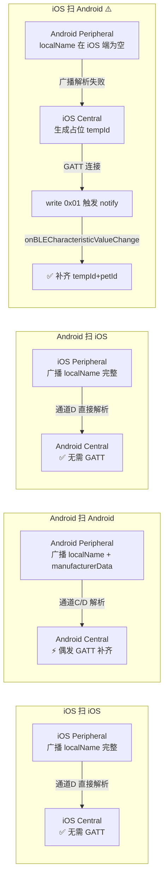

| 场景 | 主通道 | GATT 补齐 | 成功率 |
|------|--------|---------|--------|
| iOS 扫 iOS | `localName` 直接解析 | 不需要 | ~99% |
| Android 扫 Android | `localName` / `advertisData` | 偶发 | ~95% |
| Android 扫 iOS | `localName` 直接解析 | 不需要 | ~99% |
| **iOS 扫 Android** | 广播解析失败 → GATT | **必须** | ~90% |

---

## 五、关键踩坑与解决方案

### 坑1：iOS 广播 `localName` 被截断

**现象**：`NLDY4WFJW6_3f4nv5bgfe9ad`（25字节）被截断为 `NLD`（3字节）

**根因**：BLE 广播包总大小 31 字节，同时广播 3 个 128-bit UUID（FEED + BE01 + BE02）占用 54 字节，超出限制后 iOS 系统自动截断 `localName`。

**解决**：只广播 `[FEED]` 一个 UUID，释放 36 字节空间给 `localName`。

---

### 坑2：Android 传 `services` 过滤后扫不到 iOS 设备

**现象**：`wx.startBluetoothDevicesDiscovery({ services: [FEED_UUID] })` 后，Android 完全扫不到 iOS 设备。

**根因**：iOS 广播包经微信 SDK 重新包装后，`advertisServiceUUIDs` 里的 UUID 格式（大小写、短格式）与过滤条件不完全匹配，系统层直接过滤掉。

**解决**：双端都不传 `services` 过滤，改用 `matchesService()` 软过滤。

---

### 坑3：iOS Peripheral 的 `onCharacteristicReadRequest` 不触发

**现象**：Android Central 调 `wx.readBLECharacteristicValue` 后，8 秒内没有任何回调，超时。

**根因**：微信 iOS SDK 未完整暴露 CoreBluetooth 的 Peripheral 模式回调，`onCharacteristicReadRequest` 在 iOS 上不会触发。

**解决**：改用 **write 触发 notify** 方案——Android Central 订阅 notify 后发送 `0x01`，iOS Peripheral 的 `onCharacteristicWriteRequest` 收到后立即 notify 推送 payload。

---

### 坑4：Android↔Android GATT 连接 errCode=10003

**现象**：第一次 `wx.createBLEConnection` 失败，errCode=10003（errno=133）。

**根因**：Android BLE 栈的已知问题，第一次连接时 GATT 层偶发初始化失败。

**解决**：失败后延迟 1 秒重试一次。

---

### 坑5：GATT 默认 MTU 导致 payload 截断

**现象**：GATT 读取到的 payload 只有 20 字节，`3gme3wdjj4ab9` 被截断为 `3gme3wdj`。

**根因**：BLE GATT 默认 MTU=23，有效载荷只有 20 字节，而完整 payload `NLDY4WFJW6|3f4nv5bgfe9ad` 约 25 字节。

**解决**：连接成功后立即调 `wx.setBLEMTU({ mtu: 512 })`，Android 实际协商值通常为 185~512 字节。
