# 蓝牙碰一碰通信机制详解

## 1. 前置知识：BLE 核心概念

### 1.1. BLE 是什么？

**BLE（Bluetooth Low Energy，蓝牙低功耗）** 是蓝牙 4.0 标准引入的低功耗无线通信协议，与经典蓝牙（BR/EDR）并列，专为短距离、低频率、小数据量的场景设计。

| 对比项 | 经典蓝牙 | BLE |
|--------|---------|-----|
| 功耗 | 高 | 极低（纽扣电池可用数年） |
| 传输速率 | 高（音频/文件） | 低（传感器/信标） |
| 连接延迟 | 秒级 | 毫秒级 |
| 典型场景 | 耳机、音箱 | 心率带、门锁、碰一碰 |

微信小游戏通过 `wx.openBluetoothAdapter` 开启 BLE 适配器，本项目的碰一碰功能完全基于 BLE 实现。

---

### 1.2. 中心设备 vs 外围设备

BLE 通信中，两端角色是**不对称**的：

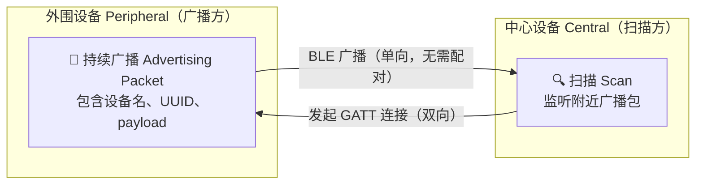

| 角色 | 英文 | 职责 | 微信 API |
|------|------|------|---------|
| **外围设备** | Peripheral | 主动广播自身信息，等待连接 | `wx.createBLEPeripheralServer()` |
| **中心设备** | Central | 扫描周围广播，主动发起连接 | `wx.startBluetoothDevicesDiscovery()` |

#### 1.2.1. 本项目的特殊之处：双角色同时运行

每台手机**同时扮演两个角色**：

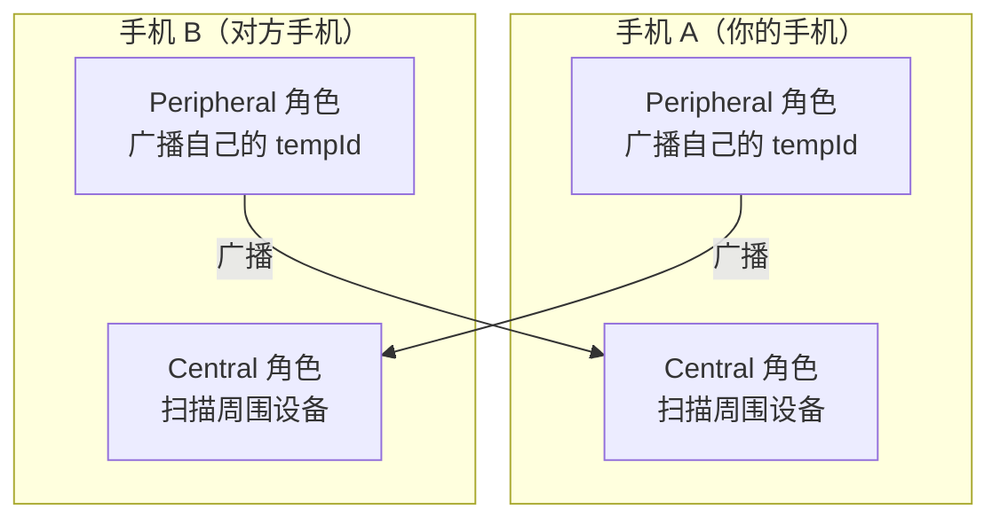

**核心代码**（`wx-adapter.ts`）：
```ts
// iOS 需要分别以两种 mode 各调一次
wx.openBluetoothAdapter({ mode: 'central' })   // 开启扫描能力
wx.openBluetoothAdapter({ mode: 'peripheral' }) // 开启广播能力
```

> **⚠️ iOS 限制**：Android 调一次 `openBluetoothAdapter` 即可同时具备两种能力；iOS 必须分别调用两次，且必须在用户点击事件回调中触发，否则报错。

---

### 1.3. GATT 是什么？

**GATT（Generic Attribute Profile，通用属性协议）** 是 BLE 在建立连接后，用于**读写数据**的标准协议框架。

#### 1.3.1. GATT 的层级结构

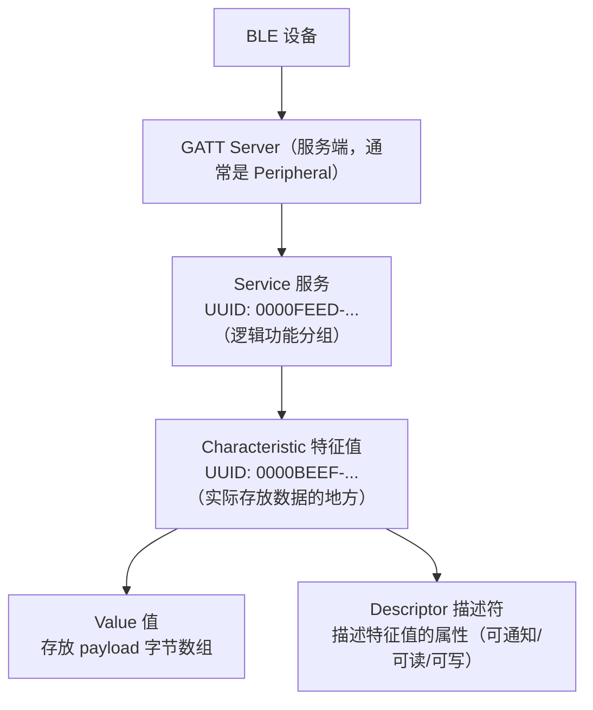

| 概念 | 类比 | 本项目的值 |
|------|------|-----------|
| **Service（服务）** | 一个功能模块 | `0000FEED-0000-1000-8000-00805F9B34FB` |
| **Characteristic（特征值）** | 模块里的一个数据字段 | `0000BEEF-0000-1000-8000-00805F9B34FB` |
| **Value（值）** | 字段里存的数据 | `aQ6jL3K0`（tempId，固定 8 位） |

#### 1.3.2. GATT 的数据交互方式（Write 触发 Notify）

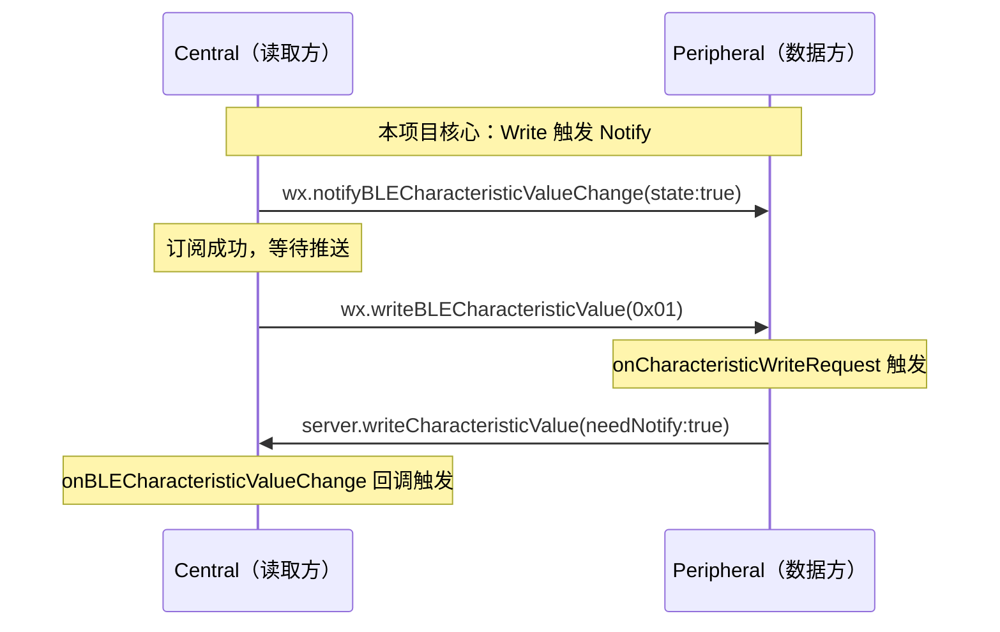

> **为什么用 Write 触发 Notify，而不是直接 Read？**
> 因为微信 iOS SDK 的 `onCharacteristicReadRequest` 回调**不会触发**（iOS CoreBluetooth 的 Peripheral 模式在微信 SDK 中未完整暴露）。所以改用：Central 先订阅 Notify，再发一个 Write `0x01` 作为"敲门砖"，Peripheral 收到 Write 请求后主动 Notify 推送 payload。

---

### 1.4. deviceId 是什么？

`deviceId` 是**微信 BLE API 为每台扫描到的蓝牙设备分配的唯一标识符**，由微信底层生成，开发者无法控制其格式。

| 平台 | deviceId 格式 | 示例 | 稳定性 |
|------|-------------|------|--------|
| **iOS** | UUID 格式（大写） | `A1B2C3D4-E5F6-7890-ABCD-EF1234567890` | ⚠️ 同一 session 内稳定，跨 session 可能变化 |
| **Android** | MAC 地址格式 | `AA:BB:CC:DD:EE:FF` | 相对稳定，但部分厂商有随机化 |

> **⚠️ 重要**：因为 deviceId 跨 session 不稳定（尤其 iOS），本项目的持久化缓存**不用 deviceId 做 key**，而是用后端分配的 `petId`（唯一稳定）。deviceId 仅作为会话内的临时去重标识。

---

### 1.5. 概念关系总图

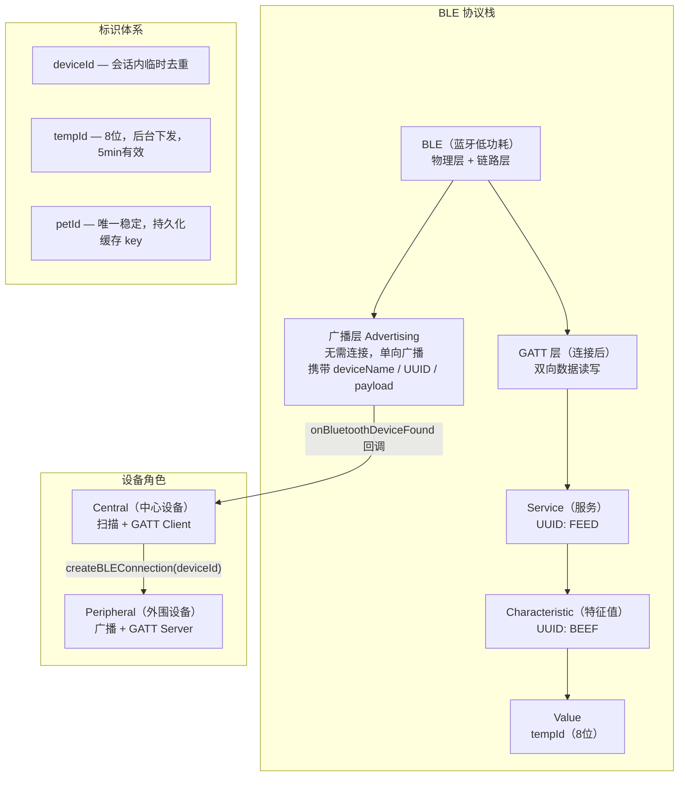

---

## 2. 整体架构

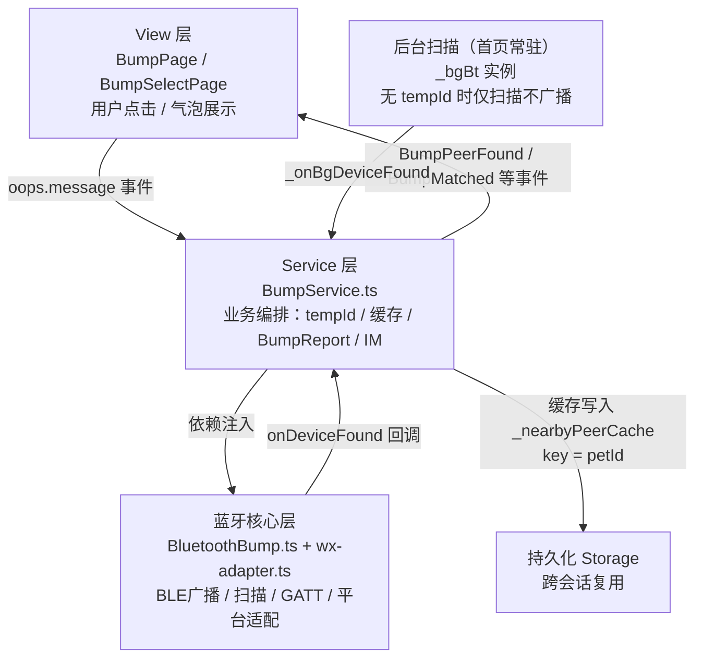

### 2.1. 两种扫描模式

| 模式 | BLE 实例 | 触发时机 | 广播 | 扫描 | 缓存写入 |
|------|---------|---------|------|------|---------|
| **后台扫描** | `_bgBt` | 首页 `_afterGuide` 后常驻 | 有 tempId 才广播 | ✅ 始终 | ✅ 写入 |
| **前台扫描** | `bt` | 用户点"碰一碰"进入 | ✅ 广播 | ✅ 扫描 | ✅ 写入 |

> **关键设计**：微信小游戏 BLE 适配器全局只有一个，两个实例不能同时运行。进入前台碰一碰时先 `stopBackgroundScan()`，退出时自动恢复后台扫描。

---

## 3. 关键标识符

| 标识符 | 值 | 说明 |
|--------|-----|------|
| `DEFAULT_SERVICE_UUID` | `0000FEED-0000-1000-8000-00805F9B34FB` | 自定义 GATT Service UUID |
| `DEFAULT_CHARACTERISTIC_UUID` | `0000BEEF-0000-1000-8000-00805F9B34FB` | GATT Characteristic UUID |
| `BUMP_MANUFACTURER_ID` | `0xFEED` | Manufacturer Specific Data 厂商 ID |
| **tempId** | 8 位字母数字 | 后台 BumpStart 下发，5 分钟有效 |
| **petId** | 后端唯一 ID | 持久化缓存的正式 key |

**payload 字符串**：`aQ6jL3K0`（仅 tempId，固定 8 位）

> **2026-07 简化**：payload 不再嵌入 petId。petId 通过 `getPetByTempId` 接口异步获取。

---

## 4. 完整通信时序

### 4.1. 后台扫描（首页常驻）

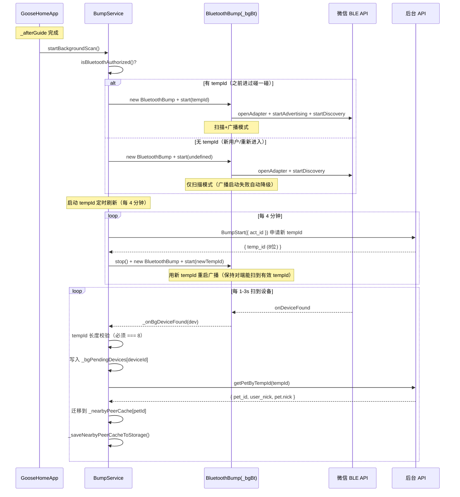

> **tempId 有效期 5 分钟**：后台扫描每 4 分钟通过 BumpStart 重新申请 tempId 并重启广播，预留 1 分钟安全边际。首次无 tempId 时也会在第一个 4 分钟周期尝试获取（从"仅扫描"升级为"扫描+广播"模式）。

---

### 4.2. 前台碰一碰启动

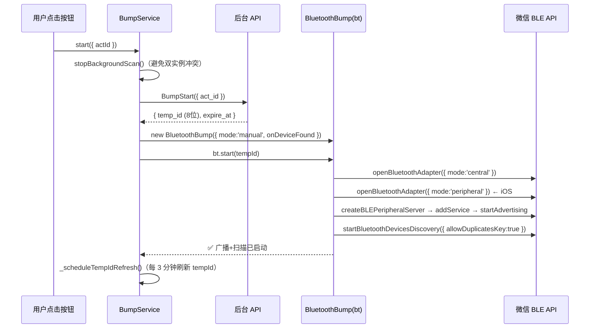

---

### 4.3. 设备发现与缓存（两阶段策略）

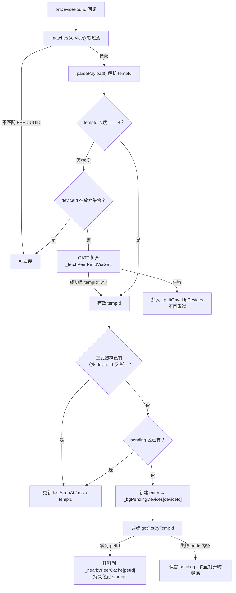

**核心设计**：
- **会话内去重**：用 deviceId（`_bgPendingDevices` + `_findCacheEntryByDeviceId`）
- **持久化 key**：用 petId（跨 session 稳定唯一）
- **tempId 校验**：后台固定下发 8 位，非 8 位是截断/损坏的无效数据，直接过滤

---

### 4.4. 退出碰一碰 → 恢复后台扫描

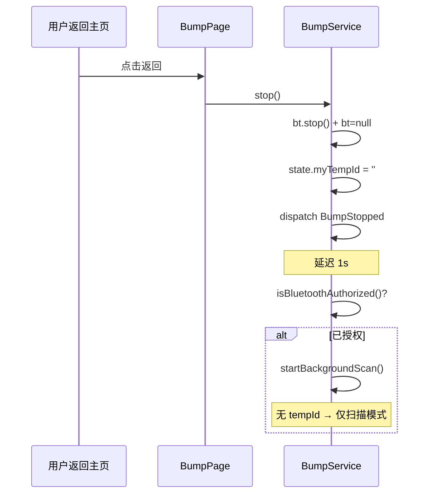

---

### 4.5. 碰一碰上报与 IM 撮合

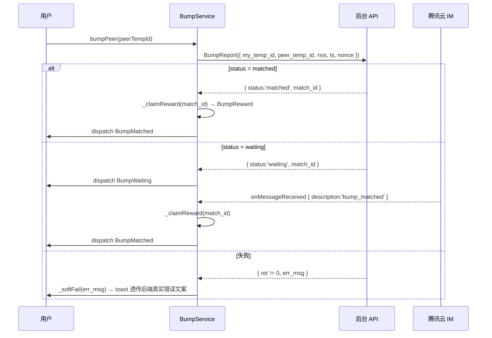

---

## 5. 雷达状态机

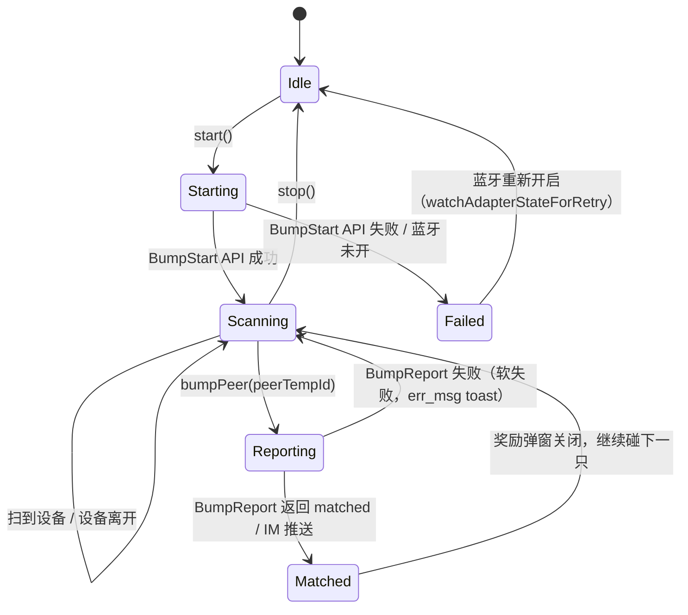

### 5.1. 核心数据结构

```ts
// BumpService.ts 前台碰一碰状态（stop 时清空）
peerLastSeen: Map<string, number>      // tempId → 最后扫到时间戳
deviceIdToPeer: Map<string, string>    // deviceId → tempId（会话内去重）
bumpingSet: Set<string>                // 正在发送 BumpReport 的对端（防双点）
_gattGaveUpDevices: Set<string>        // GATT 失败 3 次后放弃的 deviceId

// BumpService.ts 持久化缓存（跨会话复用）
_nearbyPeerCache: Map<string, NearbyPeerCache>  // key = petId（正式）
_bgPendingDevices: Map<string, NearbyPeerCache> // key = deviceId（临时 pending）
```

---

## 6. 跨平台兼容性矩阵

| 场景 | 主通道 | GATT 补齐 | tempId 来源 |
|------|--------|---------|------------|
| iOS 扫 iOS | `localName` 直接解析 | 不需要 | 广播包 |
| Android 扫 Android | `localName` / `advertisData` | 偶发 | 广播包 |
| Android 扫 iOS | `localName` 直接解析 | 不需要 | 广播包 |
| **iOS 扫 Android** | 广播解析失败 → GATT | **必须** | GATT notify |

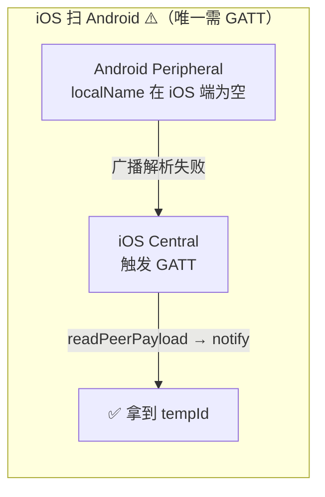

---

## 7. tempId 校验规则

后台 BumpStart 下发的 tempId **固定 8 位**（字母+数字），在以下 3 个入口做统一校验：

```ts
// 非 8 位直接过滤，不走后续流程
if (!rawTempId || rawTempId.length !== 8) {
  // 走 GATT 补齐（仅前台） 或 直接跳过（后台）
  return;
}
```

| 入口 | 校验失败行为 |
|------|------------|
| `_onPeerFound`（前台） | 走 GATT 补齐；已放弃的 deviceId 跳过 |
| `_onBgDeviceFound`（后台） | 直接 return |
| `_fetchPeerPetIdViaGatt` 回调 | 标记放弃 + return |

**效果**：
- 截断的 tempId（iOS 扫 Android，广播帧被裁剪）→ 走 GATT 补齐
- 噪音数据（非本游戏设备拼出的随机字符）→ 直接丢弃
- 避免用无效 tempId 调 `getPetByTempId`（省网络请求）

---

## 8. GATT 补齐与放弃机制

### 8.1. 触发条件

仅 **iOS 扫 Android** 场景：广播包里 `localName` 为空，`parsePayload` 解析不出有效 tempId。

### 8.2. 保护机制

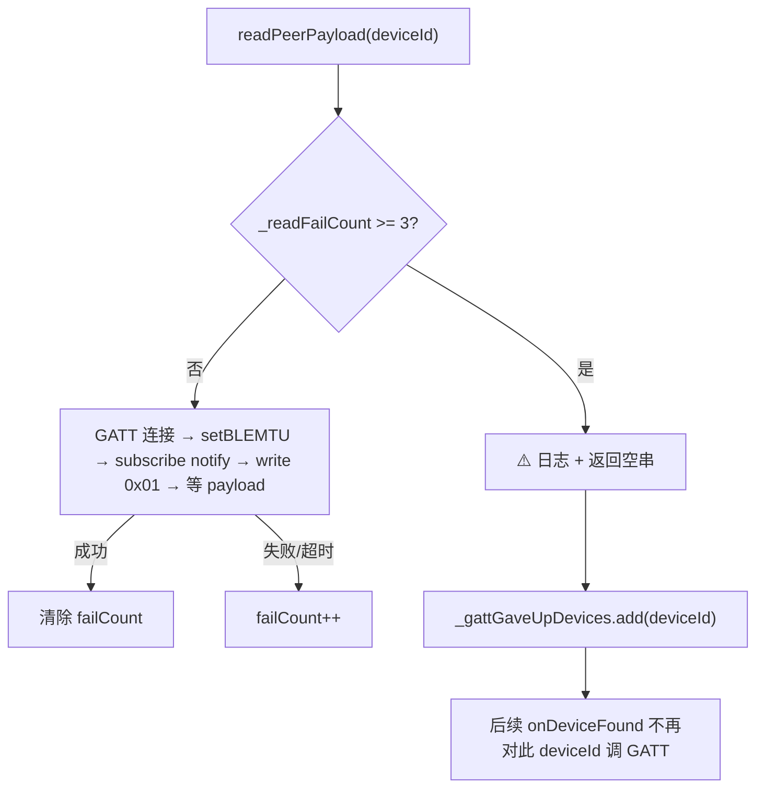

**关键**：`onDeviceFound` 每 1-3s 周期性重复上报同一台设备。如果没有放弃机制，GATT 失败后每秒都会打日志"已达失败上限"（无限循环）。`_gattGaveUpDevices` 在入口处直接跳过，彻底止血。

### 8.3. 重置时机

`_gattGaveUpDevices` 在 `BumpService.start()` 时清空——每次新会话给设备一次重新尝试的机会。

---

## 9. 关键踩坑与解决方案

### 9.1. iOS 广播 `localName` 被截断

**现象**：payload 被截断为 3 字节  
**解决**：只广播 `[FEED]` 一个 UUID，释放空间给 `localName`

### 9.2. Android 传 `services` 过滤后扫不到 iOS 设备

**解决**：不传 `services` 过滤，改用 `matchesService()` 软过滤

### 9.3. iOS Peripheral 的 `onCharacteristicReadRequest` 不触发

**解决**：改用 **write 触发 notify** 方案

### 9.4. GATT 默认 MTU 导致 payload 截断

**解决**：连接后立即 `wx.setBLEMTU({ mtu: 512 })`

### 9.5. 重新进入小游戏后扫描不到别人

**根因**：`stop()` 清空 `state.myTempId`，`startBackgroundScan()` 旧版要求 tempId 非空才启动  
**解决**：允许"仅扫描不广播"模式——没有 tempId 时仍启动 discovery，只是不 advertise

### 9.6. `readPeerPayload 已达失败上限` 日志疯狂打印

**根因**：`onDeviceFound` 每 1-3s 重复触发同一 deviceId，每次都调 `readPeerPayload`  
**解决**：新增 `_gattGaveUpDevices` Set，失败后标记放弃，入口处直接跳过

### 9.7. 同一用户显示两个气泡

**根因**：deviceId 在 iOS 跨 session 可能变化，缓存用 deviceId 做 key 导致同一用户存为两条  
**解决**：缓存 key 改为 petId（唯一稳定），deviceId 仅做会话内临时去重

---

## 10. 附录

### 10.1. iOS 扫描到的数据

鹅鹅

```json
{
    "deviceId": "D0A01C15-36CE-3623-A916-836319875456",
    "advertisServiceUUIDs": [
        "0000FEED-0000-1000-8000-00805F9B34FB"
    ],
    "localName": "aQ6jL3K0_1zcm232twliq0",
    "name": "guowang的iPhone",
    "connectable": true,
    "RSSI": -46
}
```

### 10.2. Android 扫描到的数据

鹅鹅

```json
{
    "deviceId": "4E:AA:2E:C4:FC:21",
    "name": "aQ6jL3K0_1zcm232twliq0",
    "RSSI": -43,
    "connectable": true,
    "advertisData": "<ArrayBuffer: byteLength=0>",
    "advertisServiceUUIDs": [
        "0000FEED-0000-1000-8000-00805F9B34FB"
    ],
    "localName": "aQ6jL3K0_1zcm232twliq0",
    "serviceData": {}
}
```

> 注：`localName` 格式为 `<tempId>_<petId>`，其中 tempId 固定 8 位（如 `aQ6jL3K0`）。前台扫描通过 `parsePayload` 从 localName 解析 tempId；petId 部分已不再使用（改为 `getPetByTempId` 接口异步获取）。
