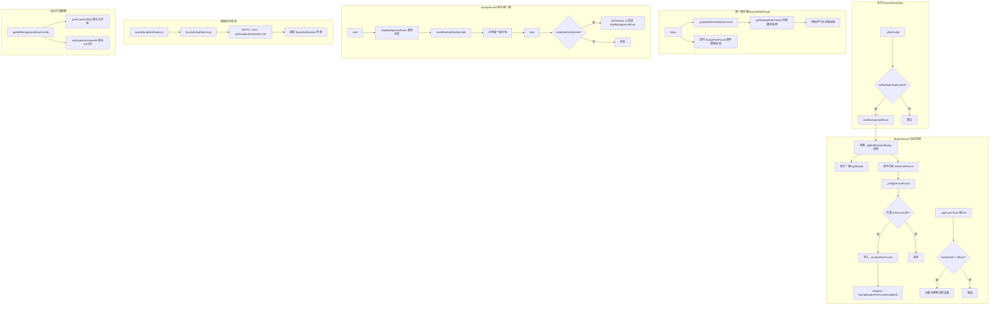

## 改动总结

### 核心需求实现

#### 1. 首页后台蓝牙广播/扫描
**文件**：`GooseHomeApp.ts`、`BumpService.ts`

- 用户进入过碰一碰（授权过蓝牙）后，回到首页自动启动后台蓝牙广播+扫描
- `BumpService.markBluetoothAuthorized()` 在 `start()` 成功时自动标记
- `GooseHomeApp._afterGuide()` 末尾检查 `isBluetoothAuthorized()` 后调 `startBackgroundScan()`
- 后台扫描实例独立于前台碰一碰实例（`_bgBt` vs `bt`），互不冲突
- 前台碰一碰启动时自动停止后台扫描，结束后自动恢复

#### 2. 附近设备缓存（最近半小时）
**文件**：`BumpService.ts`、`BumpModel.ts`

- `_nearbyPeerCache: Map<string, NearbyPeerCache>` 缓存所有扫到的设备
- 过期清理定时器每 10s 检查，超过 `peerCacheTtlMs`（默认 30 分钟）未再出现的设备自动移除
- `getNearbyPeerCache()` 供碰一碰页面打开时一次性获取缓存快照
- 时间窗口后台可调：`updateBackgroundScanConfig({ peerCacheTtlMs: xxx })`

#### 3. 雷达页预填充
**文件**：`BumpSelectPage.ts`

- `show()` 时调 `_populateFromNearbyCache()`，从缓存取出附近设备作为初始 peers
- 无需等待蓝牙实时扫描（通常需要 3-5s），雷达页打开即可展示气泡
- 后续实时 `BumpPeerFound` 事件仍然会追加/更新气泡

#### 4. 被碰流水查询（最近 24 小时）
**文件**：`BumpService.ts`、`BumpModel.ts`

- 新增 `queryBumpNotifications()` 方法，查询最近 `notificationWindowMs`（默认 24 小时）的被碰信息
- 时间窗口后台可调：`updateBackgroundScanConfig({ notificationWindowMs: xxx })`
- 返回 `BumpNotification[]` 数据，包含对端昵称、时间、奖励类型等

### 变更文件清单

| 文件 | 操作 | 说明 |
|------|------|------|
| `assets/scripts/module/bump/model/BumpModel.ts` | modified | 新增 `NearbyPeerCache`、`BumpBackgroundScanConfig`、`BumpNotification` 类型 |
| `assets/scripts/module/bump/service/BumpService.ts` | modified | 新增后台扫描、附近设备缓存、被碰流水查询；`start()`/`stop()` 增加后台扫描协调逻辑 |
| `assets/scripts/config/EventName.ts` | modified | 新增 `BumpNearbyPeerCacheUpdated` 事件 |
| `assets/scripts/GooseHomeApp.ts` | modified | 新增 `_startBumpBackgroundScanIfAuthorized()` + import BumpService |
| `assets/scripts/module/bump/view/BumpSelectPage.ts` | modified | 新增 `_populateFromNearbyCache()` 从缓存预填充 |

### 架构关系图

```
首页 (GooseHomeApp)
  └─ _afterGuide()
       └─ _startBumpBackgroundScanIfAuthorized()
            └─ BumpService.startBackgroundScan()
                 └─ BluetoothBump (后台实例, mode=manual)
                      └─ onDeviceFound → _nearbyPeerCache 记录

碰一碰页面 (BumpSelectPage)
  └─ show()
       └─ _populateFromNearbyCache() ← 从缓存取"最近半小时设备"
       └─ _onPeerFound() ← 实时蓝牙扫描继续追加

BumpService.start() (前台碰一碰)
  └─ stopBackgroundScan() ← 避免冲突
  └─ markBluetoothAuthorized()

BumpService.stop() (碰完回首页)
  └─ setTimeout(startBackgroundScan, 1000) ← 自动恢复后台扫描
```



