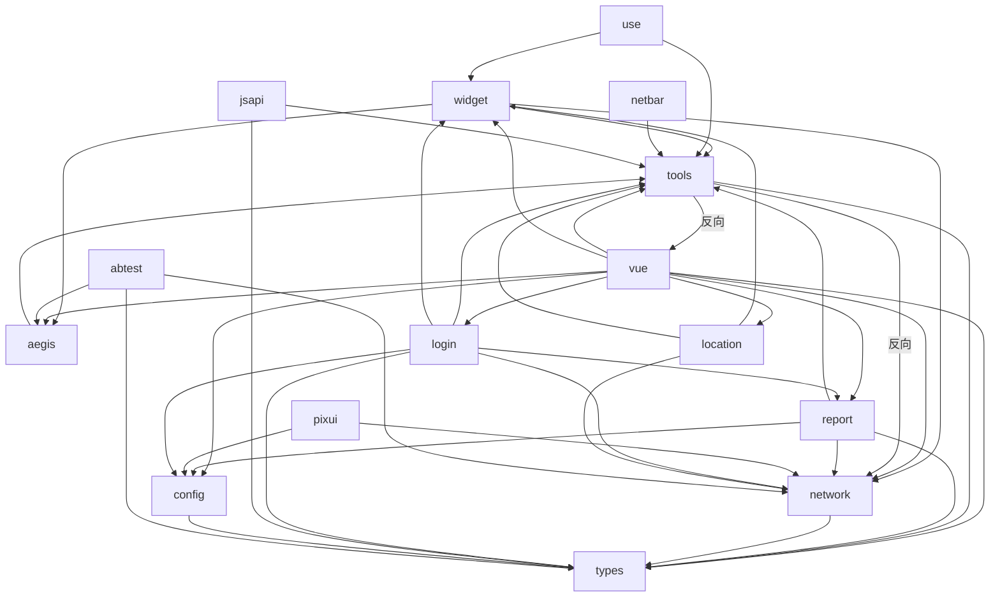
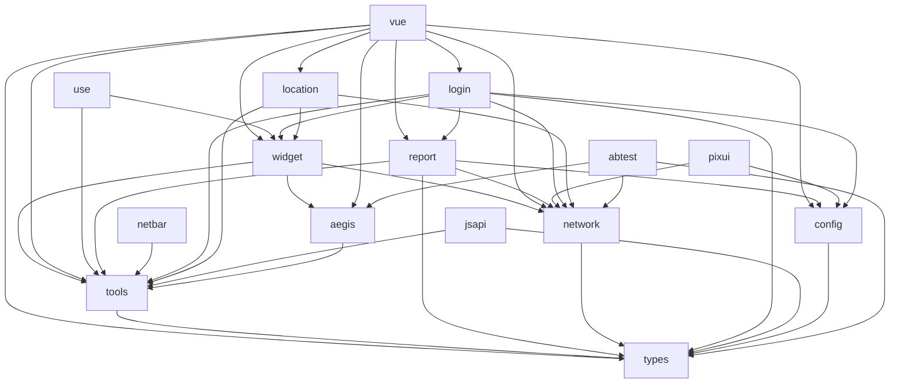
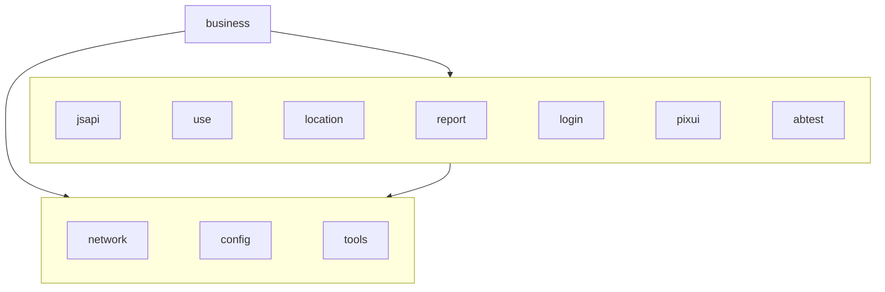
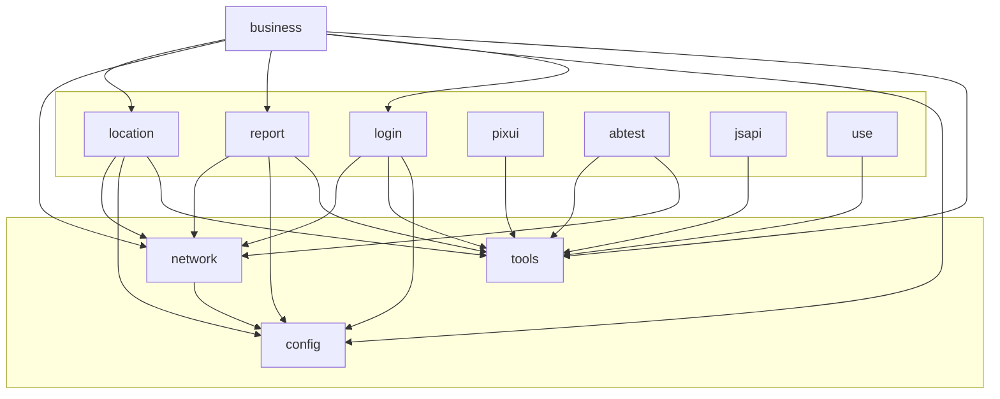
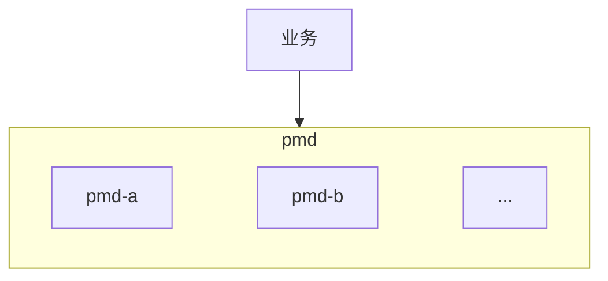
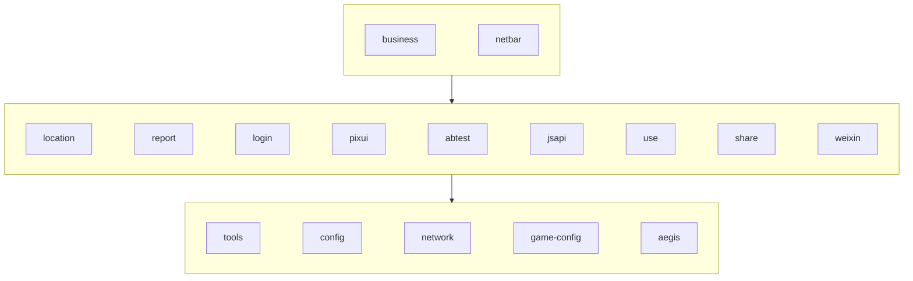
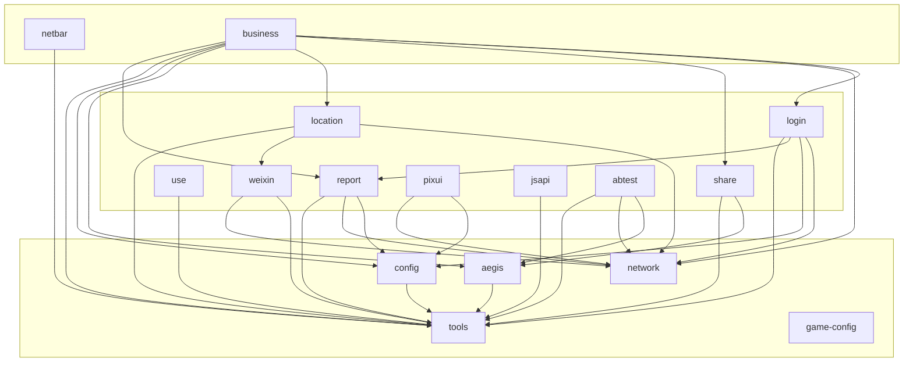
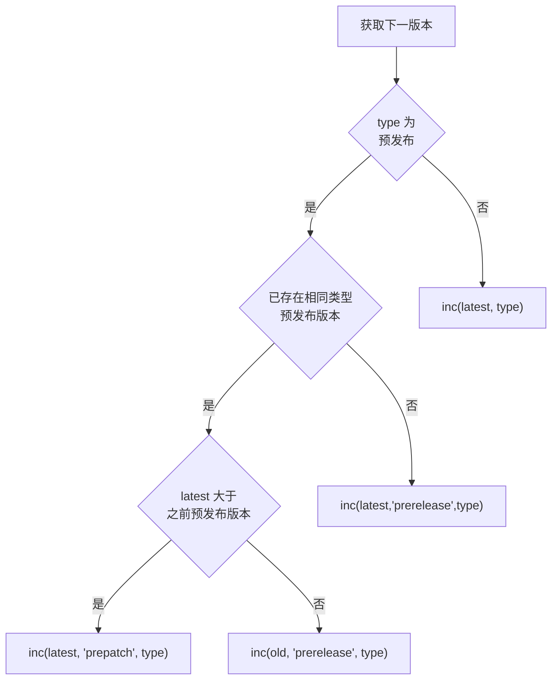
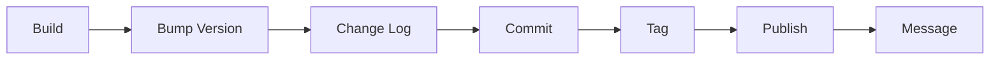

:::info 作者

novlan1

2025.12.8
:::

# PMD NPM 优化

## 1. 旧的依赖关系

当前的依赖关系（2025.12.5）。



上面有两个反向依赖。


去掉上面的反向依赖后，相对清晰一点（至少上下级关系明确了，`vue` 在最上层，`types/tools` 在下层）。



但还是不够清晰。更重要的是**易变的和不变的还是没有分开**。

目标依赖关系：



模板内部的依赖关系：



1. `types` 去掉，移动到对应的子包内
2. `widget` 去掉，业务无关放到 `press-plus`，业务相关放到 `business`
3. `report` 和 `ageis` 合并
4. `app-info` 去掉
5. `use` 放业务无关的钩子，业务相关的放到 `business`

物理存储

1. ~~`config/network` 拿走，放到 `plugin-light`~~
2. ~~参考模块变更频率，将 `tools` 中稳定的放到 `plugin-light`，易变的继续放到 `pmd-npm`~~
3. ~~`location/business` 等不动~~

## 2. 核心思想

1. 依赖分层，避免蜘蛛网，更不允许反向依赖。维护者自己都搞不清楚，新人、使用者怎么能搞清楚？
2. 分层，将底层的、稳定的、复用率高的拿走，中间层该合并的合并，该去掉的去掉。
3. 用数据说话，将不变的和变化的分开
4. 以下几种数据统计，需综合来看
   1. 依赖关系
   2. 变更频率
   3. 引用次数

## 3. 参考资料

- [Plugin Light 依赖关系](https://mobile.woa.com/plugin-light/CONTRIBUTING.html#_3-2-%E4%BE%9D%E8%B5%96%E5%85%B3%E7%B3%BB)
- [变更统计](https://mobile.woa.com/next-admin/change-statistics)
- [使用统计](https://mobile.woa.com/next-admin/component-statistics)

---

2025.12.11 更新

---

## 4. 独立发布


每个包独立版本，也不影响任何东西。因为业务从来都是 `pnpm i pmd-a@latest pmd-b@latest`，没真正关心过具体的版本号。

另外 `pmd` 包的 `dependencies` 也没声明过其他 `pmd` 子包，说明子包内部不关心其他包的版本，只关心其他包的内容。所以升级一个内容没改变的包的版本号并没有什么好处。

本质上，不管是我们自己的业务还是其他业务，`pmd` 提供的都是一个整体服务，尽管为了方便维护将他们分成了多包。



这一点和 `Press UI、Press Plus、Plugin Light` 中的子包是不一样的，这些是真正意义的独立子包，`pmd` 为了方便业务使用，做了权衡。

## 5. pnpm

yarn 改 pnpm，发布流水线改造

- 每个包独立发布
- 支持审核人
- 支持发布 `alpha/beta/patch` 版本
- 发布成功消息提醒，`alpha/beta` 同样支持

之前的发布就只能指定一个分支：


现在可以指定：

- 分支
- 版本类型
- 发布子包
- 发布原因


## 6. pmd-widget 改造

业务无关的组件放到 press-plus 中，业务相关的放到 business 中。

Press Plus 有完善的文档、示例，为啥要放到 pmd 中？

### 6.1. 总览

|序号|包|变更|类型|说明|
|---|---|---|---|---|
|1|toast|放到 `press-plus` 中|TS|`pmd` 已做转发|
|2|dialog|放到 `press-plus` 中|TS|`pmd` 已做转发|
|3|copy|放到 `press-plus` 中|TS|`pmd` 已做转发|
|4|clipboard|放到 `press-plus` 中|Vue|只有`match-igame-admin`一个业务引用；<br>新业务建议直接使用copy方法，而不是组件；<br/>`pmd` 不处理，不再维护|
|5|marquee|放到 `press-plus` 中|Vue|新业务直接使用 `press-plus` 中的组件；<br/>`pmd` 不处理，不再维护|
|6|image-generator|放到 `press-plus` 中|Vue|同 `marquee`|
|7|pag-animator|放到 `press-plus` 中|Vue|同 `marquee`|
|8|qrcode|放到 `press-plus` 中|Vue|新业务直接使用 `press-ui` 中的组件；<br/>`pmd` 不处理，不再维护|
|9|video-player|放到 `press-plus` 中|Vue|同 `marquee`|
|10|not-found|放到 `press-plus` 中|Vue|使用`press-not-found`|
|11|login|放到 `pmd-business` 中|Vue|-|
|12|share|放到 `pmd-share` 中|TS|-|
|13|share-v2|放到 `pmd-share` 中|TS|-|
|14|test-whitelist|放到 `pmd-business` 中|Vue|-|

### 6.2. Toast

之前的 `Toast` 放到了 `press-plus` 中，并在 `press-next` 放置了一个转发。你可以这样使用：

```js
import { Toast } from '@tencent/press-plus/common/toast';

// 或者
// import { Toast } from '@tencent/press-next/common/toast';

Toast.show('hello guowangyang');
```

同时，增加了类型提示和注释，对比如下。

之前的文档提示（零提示）：


现在的文档提示：


之前的类型提示：


现在的类型提示：


---

2025.12.23 更新

---

## 7. 新的依赖关系

新增了 `share`、`weixin` 两个子包，它们功能相对独立，依赖关系清晰。

目前的依赖关系：



内部模块实际依赖关系：



1. 总体三层结构，基础、业务中间层、业务上层
2. 无反向依赖
3. 独立的 `types` 已移除，放到对应的包之中

---

2025.12.31 更新

---

## 8. network-v2

参见 https://iwiki.woa.com/p/4017005417

## 9. share-v2

参见 https://iwiki.woa.com/p/4017017184

## 10. 参数缩减

部分函数的参数个数多于3个，不利于维护和使用。

新增工具方法 `getParameters`，可同时支持对象参数和分散参数。好处是保持渐进升级，不影响业务。使用示例如下：

```ts
import { getParameters, type OverloadedFn, type ImplementationArgs } from '@tencent/pmd-tools/lib/parameter';

interface ShowTipsDialogParams {
  content: string;
  pc?: boolean;
  title?: string;
  buttonText?: string;
  clickCallBack?: Function;
}

const showTipsDialogKeys = ['content', 'pc', 'title', 'buttonText', 'clickCallBack'] as const;

type ShowTipsDialogKeys = typeof showTipsDialogKeys;

Dialog.showTipsDialog = function (...args: ImplementationArgs<ShowTipsDialogParams, ShowTipsDialogKeys>) {
  const {
    content,
    pc = false,
    title = '温馨提示',
    buttonText = '我知道了',
    clickCallBack,
  } = getParameters<ShowTipsDialogParams>(showTipsDialogKeys, args);

  // ...
  // 其他逻辑
}
```

## 11. 迁移指南

- @tencent/pmd-tools/lib/weixin => @tencent/pmd-weixin
- @tencent/pmd-vue/lib/minijump => @tencent/pmd-weixin/lib/minijump
- @tencent/pmd-widget/lib/share => @tencent/pmd-share
- vue 其他，@tencent/pmd-vue/* => @tencent/pmd-business/*
- 少哪个包装哪个包

## 12. 附录

### 12.1. 版本更新策略

预发布即 `versionType` 为 `alpha/beta/rc`

下图 `type` 即为 `versionType`



### 12.2. 版本发布流程



### 12.3. 版本说明

|版本|发布分支|是否可以发布现网|用途|
|---|---|---|---|
|alpha|非 master|❌|新功能、缺陷修复|
|beta|非 master|✅|验证新功能、缺陷修复，以及大改动在某一项目上试跑一段时间|
|patch|master|✅|长期稳定版本|
