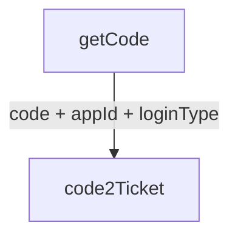
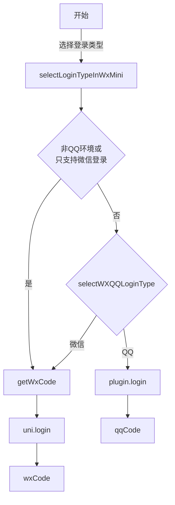

:::info 作者

novlan1

2025.12.31
:::

# 小程序登录

## 整体流程

获取 code 流程

理想情况下，将一个微信小程序支持在QQ环境中打开，只需要

1. 申请QQ的一个 `appId`，申请转换权限
2. `config.js` 填写 `login.qqAppIdInWxMini`

框架自动判断，当在QQ内打开微信小程序时，弹出选择QQ/微信，执行对应的登录流程。

