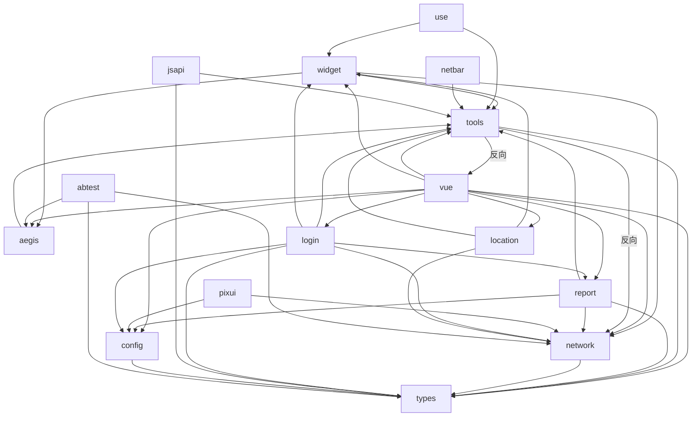
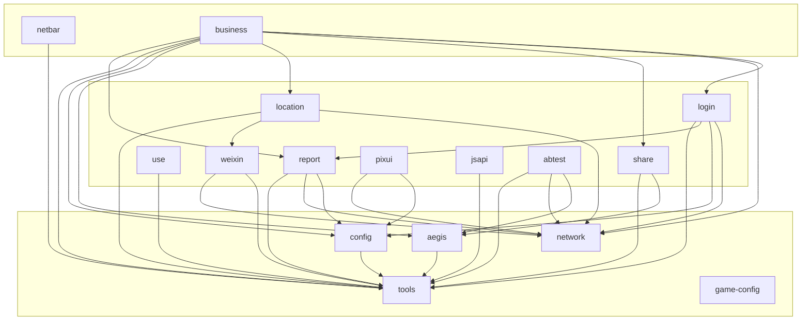
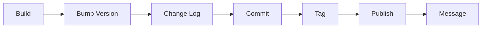
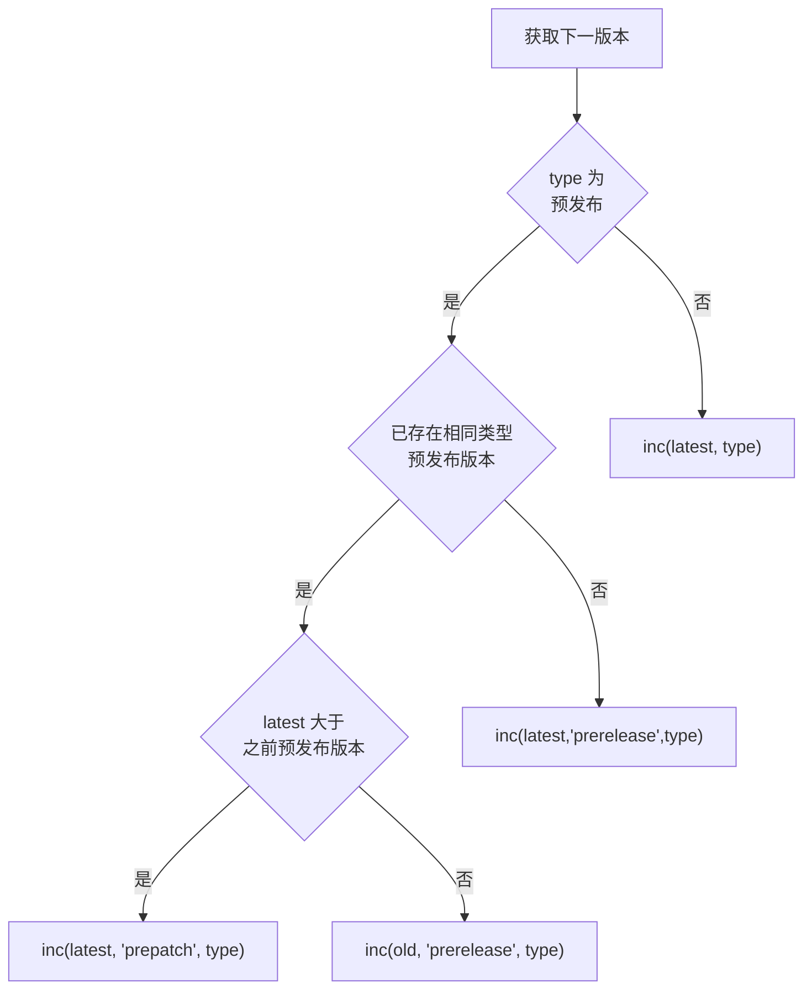
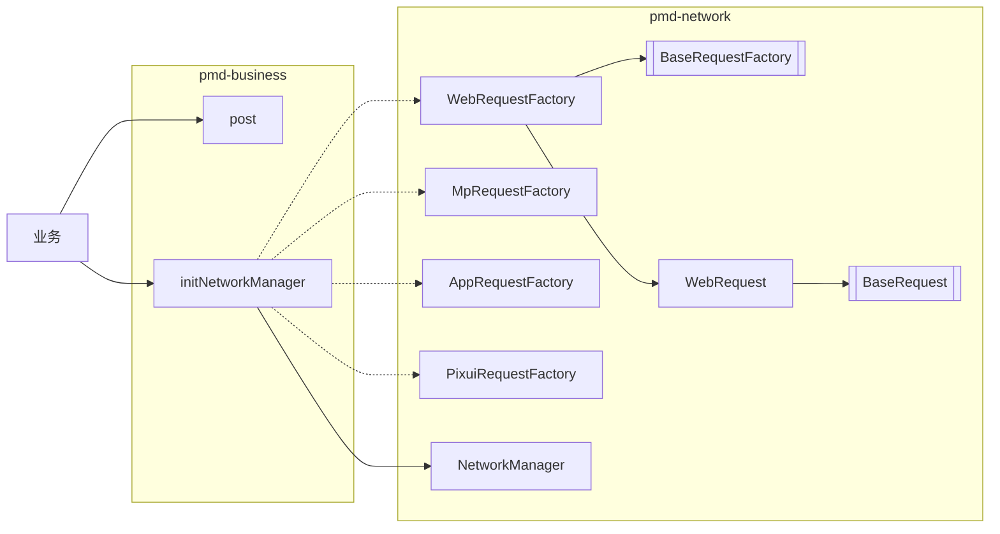
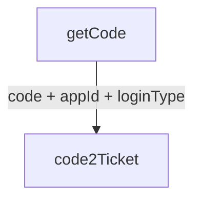
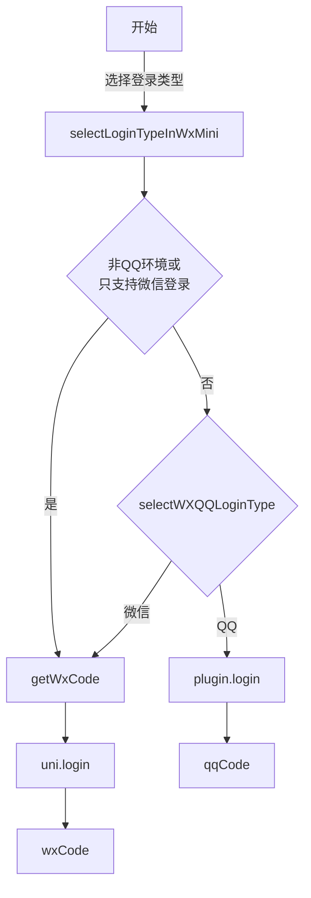
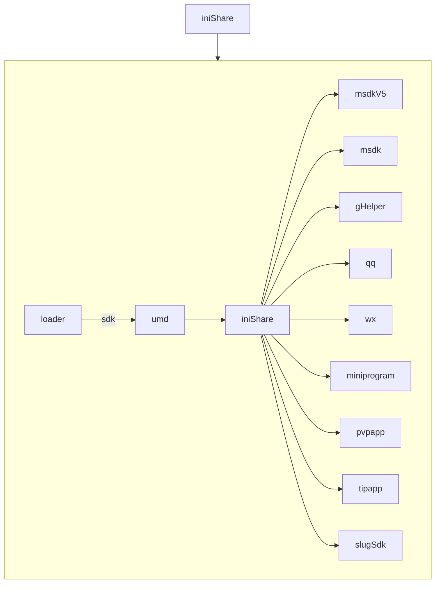

:::info 作者

novlan1

2025.12.31
:::

# PMD NPM 优化

## 1. 开始

记录下近期整理的 PMD NPM 包。

## 2. 依赖关系

优化前是蜘蛛网（2025.12.5）。

优化后是清晰的三层结构。

内部模块实际依赖关系：

1. 总体三层结构，基础、业务中间层、业务上层
2. 无反向依赖
3. 独立的 `types` 已移除，放到对应的包之中

## 3. 版本发布

## 4. 版本更新策略

## 5. 网络框架

## 6. 小程序登录

整体流程

获取 code 流程

理想情况下，将一个微信小程序支持在QQ环境中打开，只需要

1. 申请QQ的一个 `appId`，以及转换权限
2. `config.js` 填写 `login.qqAppIdInWxMini`

框架自动判断，当在QQ内打开微信小程序时，弹出选择QQ/微信，执行对应的登录流程。

## 7. 分享异步化

以 `iniShare` 为例。

