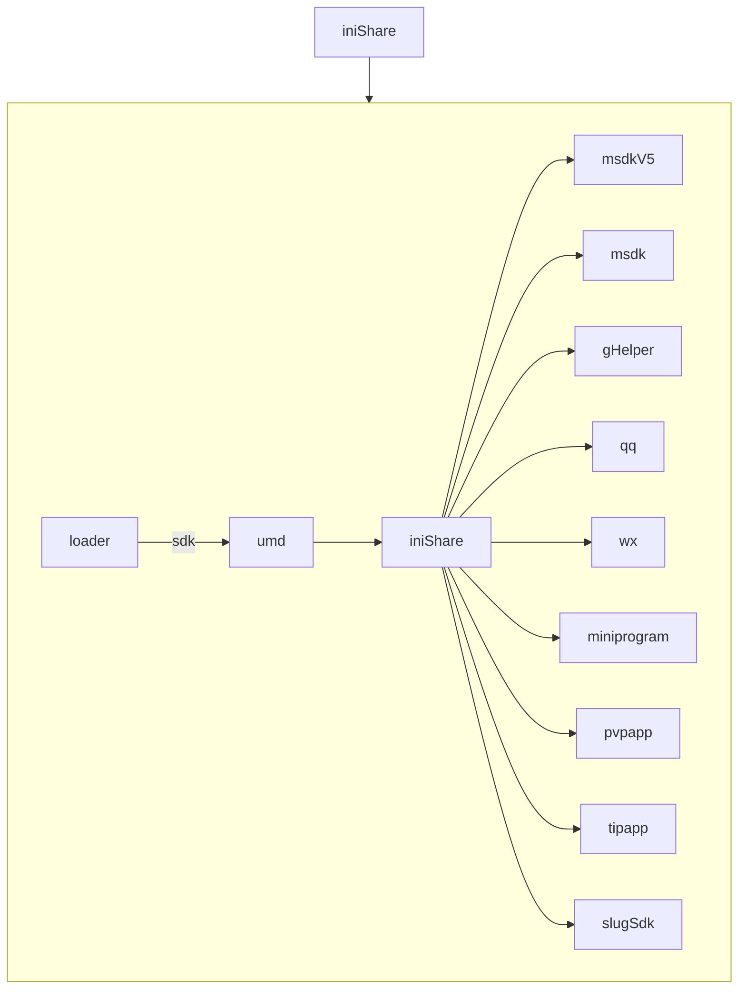

:::info 作者

novlan1

2025.12.31
:::

# 分享 V2

## 优势

1. 体积小，性能好
2. 类型完善

## 业务接入流程

修改代码，将 `@tencent/pmd-widget/lib/share` 的导出都改成 `@tencent/pmd-share` 的 `v2` 版本。

```diff
- import { initShare, hideShareBtn, openShareUI, setupWzydShare } from '@tencent/pmd-widget/lib/share'
+ import { initShareV2, hideShareBtnV2, openShareUIV2, setupWzydShareV2 } from '@tencent/pmd-share'
```

## 原理

以 `iniShare` 为例。



先加载 `sdk` 文件，然后用 `umd` 暴露出的全局变量执行真正的方法。
