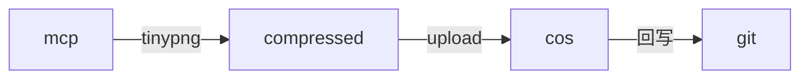
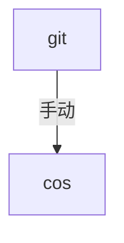
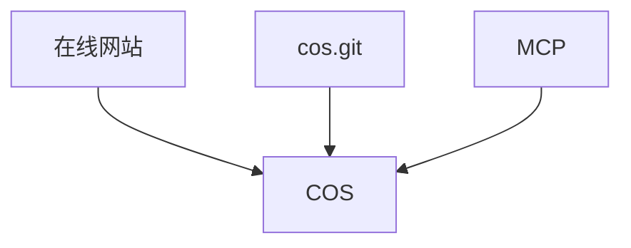
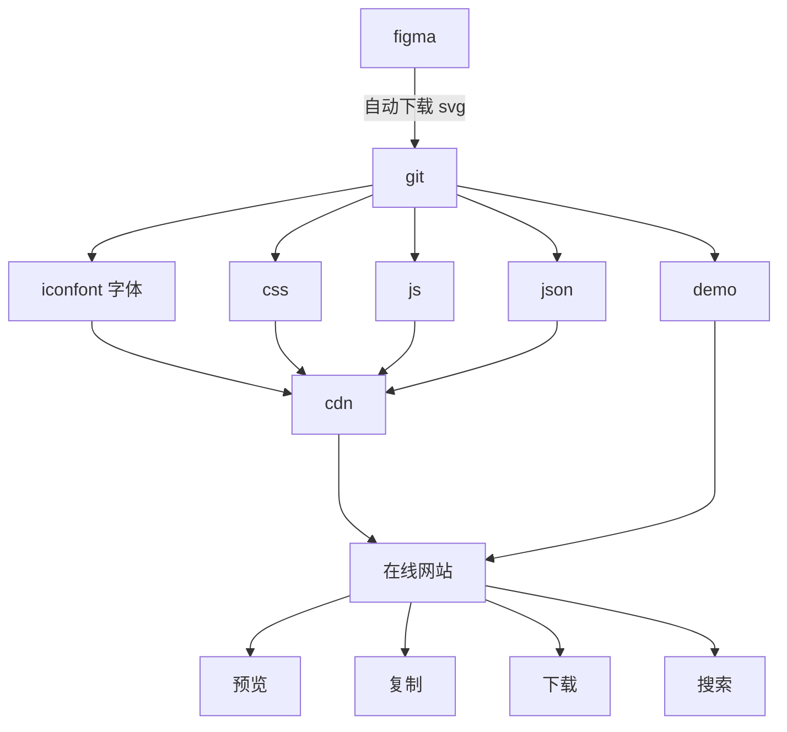
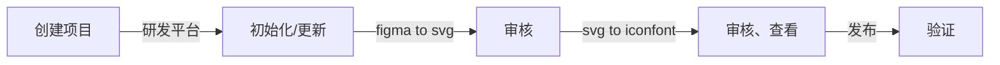

## 1. 位图

### 1.1. 问题

> 痛点1：手动在视觉设计稿中切图（用作项目静态图片或动态图片）——> 手动上传到 cos git 仓库、触发流水线上传到业务 cos 桶或手动直接上传到业务 cos 桶
>
> 痛点2：部分没接入 cos git 的业务，手动直达上传到业务cos桶，仍然需要肉眼检查图片是否重命名(不检测的话，覆盖线上资源会导致业务事故)

### 1.2. 优化

1. 提供 `upload-mcp` 工具，IDE 中一键上传
2. 自动压缩图片
3. 自动同步 `cos.git` 仓库，方便后续修改

已有

1. 通过 `cos.git` 上传
2. 通过在线工具上传

`mcp` 上传流程



修改时



注意，由于 COS 的 `open api` 限制一个前缀目录下只能拉取 1000 个文件，所以建议一个目录不要放太多东西。

在 `cos.git` 的 [.cos/sync.config.js](https://git.woa.com/pmd-mobile/pmd-h5/cos/blob/master/.cos/sync.config.js) 文件中存放要拉取的前缀列表，如

```js
module.exports = {
  getBucketLitPrefixList: {
    'image-1251917893': [
      'general-match/',
      'pmd-icon/',
    ],
  },
};
```

### 1.3. 三位一体



想用啥就用啥，喜欢用啥就用啥。

## 2. iconfont 图标

### 2.1. 问题

> 痛点1：手动下载svg ——> 手动上传到 cosdesign
>
> 痛点2：每次更新需肉眼检测图标是否重名，耗时耗力
>
> 痛点3：目前发现部分SVG文件上传至 codesign 后，会出现内容丢失或显示异常的问题。视觉同学通常无法定位具体原因，只能通过反复试错的方式将文件交由我们排查，这会占用我们不少时间（比如此前 “无畏” 项目中，遇到过不少图标出现此类问题，可能会花费时间协助检查和调整图标）。为了提升效率，期待提供一个 SVG 预览页面：视觉同学上传 SVG 文件后，页面可直接渲染展示效果，让他们能自主试错、调整图标并定位问题根源，减少对开发侧的依赖。

### 2.2. 优化

1. 支持自动下载 `figma` 中 `svg`，生成 `iconfont` 等
2. 支持在线工具预览、下载

> 核心：全自动化、流程左移、安全



操作节点



涉及内容较多

1. `figma` 中 `svg` 下载
2. `git` 存储
3. `svg` 生成 `iconfont` 字体、CSS
4. 上传 CSS/字体 到 `cos`
5. 网站拉取
6. `cos` 同步到 `git`

还有工程方面的：

1. 图标工程创建
2. 图标工程管理
3. 手动触发更新
4. 更新时发MR及审核

`icon.git` 功能

1. 执行 `svg` 手动更新，创建 MR 到 `master`
2. 执行 `iconfont` 生成，创建 MR，从 `master` 到 `release`
3. 执行上传 CDN，`release` 分支上进行

### 2.3. 操作指南

#### 2.3.1. 新建项目

研发平台点击“新建图标项目”，填写表单并提交。


#### 2.3.2. 项目管理

研发平台点击“图标项目管理”，可以编辑项目、查看图片、更新图标、复制样式链接等。


#### 2.3.3. 图标查看

点击项目卡片，可以进入项目图标示例页面，如 [https://mobile.woa.com/pmd-icon/match-common/demo.html](https://mobile.woa.com/pmd-icon/match-common/demo.html)，可进行 `svg/class/unicode` 不同形式的查看和校验。


项目卡片下方有图标CSS链接，如 [https://image-1251917893.file.myqcloud.com/pmd-icon/match-common/pmg-iconfont.css](https://image-1251917893.file.myqcloud.com/pmd-icon/match-common/pmg-iconfont.css)，点击即可复制。


#### 2.3.4. 图标更新

项目卡片右上角点击“更新”，会触发[流水线](https://devops.woa.com/console/pipeline/tip-h5/p-c988624124334c24b6872b10053c763e/history/history/4?page=1&pageSize=20)，进行图标的更新或初始化。


该流水线会创建一个[icon.git](https://git.woa.com/pmd-mobile/pmd-h5/icon)的 MR，开发人员可以查看 SVG 列表是否符合预期，如 [https://git.woa.com/pmd-mobile/pmd-h5/icon/-/merge_requests/1](https://git.woa.com/pmd-mobile/pmd-h5/icon/-/merge_requests/1)。


#### 2.3.5. 字体、CSS 更新

上面 MR 通过后，自动触发 `svg` 转 `iconfont` 流程，并上传预览页面到内网，以及创建 `master` 到 `release` 的MR，通过会才会同步到 CDN。

这里的审核会为了防止生成的 `iconfont` 不符合预期，避免引起线上问题。

举例，[https://git.woa.com/pmd-mobile/pmd-h5/icon/-/merge_requests/2](https://git.woa.com/pmd-mobile/pmd-h5/icon/-/merge_requests/2)。


### 2.4. 迁移建议

1. 新项目建议使用这套图标库，全自动化
2. 老项目，如果还在频繁更新的话，也建议早点迁移、做验证
3. 老项目，不咋更新的，就没有迁移的必要了
