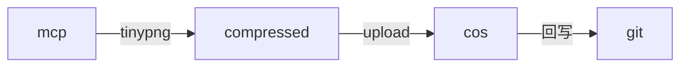
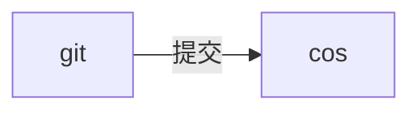
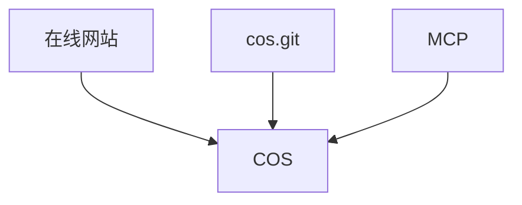
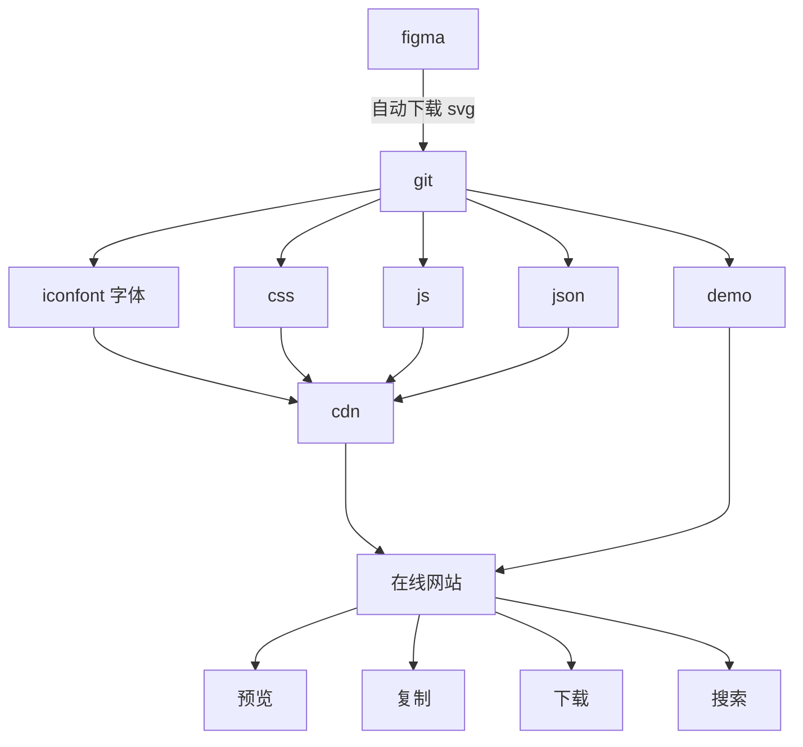
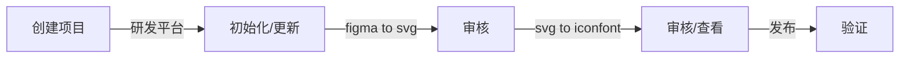
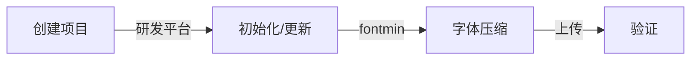

## 1. 位图

### 1.1. 问题

> 痛点1：手动在视觉设计稿中切图（用作项目静态图片或动态图片）——> 手动上传到 cos git 仓库、触发流水线上传到业务 cos 桶或手动直接上传到业务 cos 桶
>
> 痛点2：部分没接入 cos git 的业务，手动直达上传到业务cos桶，仍然需要肉眼检查图片是否重命名(不检测的话，覆盖线上资源会导致业务事故)

### 1.2. 优化

1. 提供 `upload-mcp` 工具，IDE 中一键上传
2. 自动压缩图片
3. 自动同步 `cos.git` 仓库，方便后续修改

已有

1. 通过 `cos.git` 上传
2. 通过在线工具上传

`mcp` 上传流程



修改时



注意，由于 COS 的 `open api` 限制一个前缀目录下只能拉取 1000 个文件，所以建议一个目录不要放太多东西。

在 `cos.git` 的 `.cos/sync.config.js` 文件中存放要拉取的前缀列表，如

```js
module.exports = {
  getBucketLitPrefixList: {
    'image-1251917893': [
      'general-match/',
      'pmd-icon/',
    ],
  },
};
```


### 1.3. 三位一体



想用啥就用啥，喜欢用啥就用啥。

## 2. iconfont 图标

### 2.1. 问题

> 痛点1：手动下载svg ——> 手动上传到 cosdesign
>
> 痛点2：每次更新需肉眼检测图标是否重名，耗时耗力
>
> 痛点3：目前发现部分SVG文件上传至 codesign 后，会出现内容丢失或显示异常的问题。视觉同学通常无法定位具体原因，只能通过反复试错的方式将文件交由我们排查，这会占用我们不少时间（比如此前 x 项目中，遇到过不少图标出现此类问题，可能会花费时间协助检查和调整图标）。为了提升效率，期待提供一个 SVG 预览页面：视觉同学上传 SVG 文件后，页面可直接渲染展示效果，让他们能自主试错、调整图标并定位问题根源，减少对开发侧的依赖。

### 2.2. 优化

1. 支持自动下载 `figma` 中 `svg`，生成 `iconfont` 等
2. 支持在线工具预览、下载

> 核心：全自动化、流程左移、安全

注意，这里是没有 MCP 的，**全自动化比 AI 更进一步**，只要源头数据是正确的，根本无需任何操作。



操作节点



涉及内容较多

1. `figma` 中 `svg` 下载
2. `git` 存储
3. `svg` 生成 `iconfont` 字体、CSS
4. 上传 CSS/字体 到 `cos`
5. 网站拉取
6. `cos` 同步到 `git`

还有工程方面的：

1. 图标工程创建
2. 图标工程管理
3. 手动触发更新
4. 更新时发MR及审核

`icon.git` 功能

1. 执行 `svg` 手动更新，创建 MR 到 `master`
2. 执行 `iconfont` 生成，创建 MR，从 `master` 到 `release`
3. 执行上传 CDN，`release` 分支上进行


### 2.3. FAQ

1. 类名会不会重复

基于流程整体左移的思路，由设计师保证不重复，由于在一张画布或一个 `figma` 文件中，能较轻松找到哪个重复。

对于语义确实重复的，可以添加 `-1`、`-2` 等标识，比如 `edit-1`、`edit-2`。

2. 图标黑框

检查是不是设置了 `clip content`，需要去掉。

3. 上传到 `devcloud` 失败

~~新增的项目可能需要登录 `devcloud` 手动新增一个目录。~~ 已使用流水线解决。

4. 有没有刷新 CDN 缓存

有。

上传的所有文件，包括位图、图标、字体、其他文件等，使用的所有方式，包括在线网站、MCP、`cos.git` 等，都会进行 CDN 缓存刷新！

## 3. 字体

### 3.1. 问题

> 痛点：手动处理(需使用font-spider进行特殊字体压缩，然后利用其他工具进行字体多格式转换)设计师给到的全量字体包，对字体进行精简——> 上传到字体资源存储仓库，用作记录存储—— > 手动上传到业务cos桶

### 3.2. 优化

用户上传全量字体包 ——> 输入对应文字 ——> 一键压缩 ——> 上传到 cos，并返回对应字体在线链接。

操作节点



无需手动多工具来回跳转，全部闭环操作。

几个核心点

1. 加载字体文件到 `document`
2. 为校验文字设置上传的字体


### 3.3. 图标和字体的不同

对比一下图标和字体设计上的不同

1. 图标由设计师在最上游处理好，重构、前端无需介入，全自动化，只需手动触发更新、审核即可
2. 字体需由重构或前端手动上传精简后的文字，这一步暂时无法取消。相应的，字体也不再需要两次审核，因为手动压缩的页面处已经相当于审核了，只要最终同步到 COS 后的校验即可
3. 图标项目需要有自己的 `git` 仓库，来保存无需上传到 COS 的 `svg` 文件等，而字体项目不需要，它没有中间文件，所有的字体文件都需要上传 COS，所以它不用新建仓库
4. 图标项目需要有自己的蓝盾流水线，用于执行拉取 SVG、生成 `iconfont`、创建 MR等，字体项目不需要

|类别|图标|字体|
|---|---|---|
|手动处理|无|有|
|多次审核|有|无|
|Git 仓库|有|无|
|流水线|有|无|
