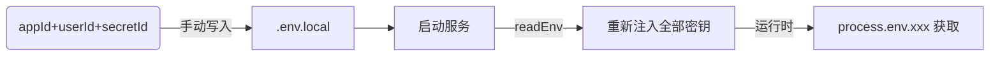
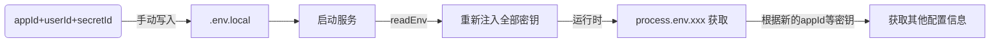

:::info 作者

novlan1

2026.1.15
:::

# 密钥初始化流程

```mermaid
graph LR

初始化密钥(appId+userId+secretId) --手动写入--> .env.local --> 启动服务 -- readEnv --> 重新注入全部密钥 -- 运行时 --> getEnv["process.env.xxx 获取"]
```

允许环境变量密钥与业务存储地址不一样，如 `abtest`。

```mermaid
graph LR

初始化密钥(appId+userId+secretId) --手动写入--> .env.local --> 启动服务 -- readEnv --> 重新注入全部密钥 -- 运行时 --> getEnv["process.env.xxx 获取"] --根据新的appId等密钥--> 获取其他配置信息
```
