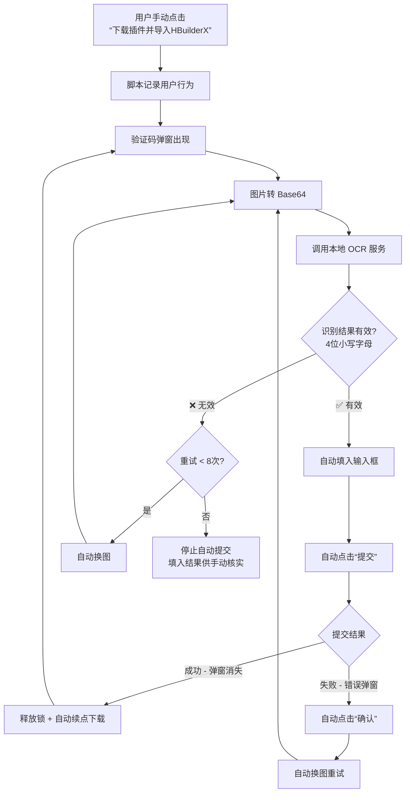

# DCloud 插件市场验证码自动识别脚本

## 简介

一个油猴（Tampermonkey）用户脚本，配合本地 OCR 服务，实现 DCloud 插件市场（`ext.dcloud.net.cn`）验证码的**全自动识别、填入、提交和错误重试**。用户只需手动点击一次"下载插件并导入HBuilderX"，后续的验证码流程全部自动完成。

### 核心架构

```
油猴脚本（前端）  ←→  本地 OCR 服务（localhost:18099）
     ↓                        ↓
MutationObserver          ddddocr 识别引擎
监听 DOM 变化              图片 → 4位小写字母
```

### 自动化流程



---

## 迭代历程

### v2.0 — 基础版本

**起点**：已有一个能自动识别验证码并填入输入框的脚本，具备：
- 验证码图片转 Base64（canvas / fetch 两种方式）
- 调用本地 OCR 服务识别（`GM_xmlhttpRequest` 跨域请求）
- 识别结果格式校验（`/^[a-z]{4}$/`）
- 格式无效时自动换图重试（最多 5 次）
- Base64 面板展示 + 复制功能

### v3.0 — 自动点击下载 + 自动提交 + 拦截弹窗

**用户需求**：OCR 识别填入后，自动点击"提交"按钮；页面加载时自动点击"下载插件并导入HBuilderX"；拦截浏览器的 `hbuilderx://` 协议弹窗。

**新增**：
- `autoClickDownloadBtn()` — 页面加载后自动点击下载按钮
- `autoClickSubmitBtn()` — 识别成功后延迟 600ms 自动提交
- `interceptProtocolDialog()` — 覆盖 `document.createElement` 拦截 iframe 协议跳转

### v3.1 — 移除协议拦截

**问题**：覆盖 `document.createElement` 导致页面报 `TypeError: Cannot read properties of undefined (reading 'click')`，且浏览器原生协议弹窗（"要打开 HBuilderX 吗？"）JS 无法控制。

**修复**：删除整个 `interceptProtocolDialog()` 函数，协议弹窗由用户手动处理。

### v3.2 — 错误弹窗自动处理

**用户需求**：验证码错误时会弹出 Bootstrap 模态框（"请输入验证码!"），希望自动点击"确认"并重试。

**新增**：
- `observeErrorDialog()` — MutationObserver 监听 `.modal-dialog` 出现
- 检测弹窗内容包含"验证码/请输入/错误"等关键词
- 自动点击确认按钮 → 自动换图 → 重新 OCR（最多 5 次）

### v3.3 — 🔥 修复死循环

**问题**：两个独立的重试计数器（OCR 格式校验 5 次 + 错误弹窗 5 次）互不影响，形成 **5+5+5+5+...** 的无限循环。

**根因分析**：
```
OCR 识别无效 → 换图重试 5 次 → 耗尽后填入无效结果并提交
→ 错误弹窗 → 确认 → 换图重试 5 次 → 又填入并提交
→ 又弹错误弹窗 → ... 无限循环
```

**修复**：
- 统一为**一个全局重试计数器** `retryCount`，上限 `MAX_TOTAL_RETRY = 8`
- OCR 重试耗尽后**只填入不提交**，切断循环链
- 添加 `isProcessing` 全局处理锁，防止并发触发

### v3.4 — 移除自动下载

**用户需求**：不希望页面加载时自动点击下载按钮，改为手动触发。

**修复**：删除 `autoClickDownloadBtn()`、`observeDownloadBtn()` 及相关变量。

### v3.4.1 — 修复语法错误

**问题**：删除代码时两段注释被错误合并，`function observeErrorDialog()` 被吞进注释，导致 `SyntaxError`。

**修复**：恢复正确的函数声明。

### v3.5 — 🔥 修复竞态条件

**问题**：OCR 识别正确并填入后，在等待提交的 600ms 内（或提交后），验证码图片 `src` 可能变化，MutationObserver 触发新一轮 OCR，**覆盖了已正确填入的验证码**，导致永远提交错误。

**修复**：
- 新增 `isSubmitting` 提交等待锁 — 填入成功后立即上锁，阻止新的 OCR 处理
- MutationObserver 检测到 `src` 变化时，若 `isSubmitting` 为 true 则忽略
- `src` 变化增加 600ms 防抖
- 锁释放时机：错误弹窗出现 / 5 秒超时 / 手动换图

### v3.6 — 弹窗消失检测

**问题**：验证码正确提交成功后，弹窗直接消失（不弹错误弹窗），`isSubmitting` 锁只能等 5 秒超时释放，导致短时间内再次操作时 OCR 不触发。

**修复**：在 `observeErrorDialog` 中增加 `removedNodes` 监听，检测包含验证码元素的 DOM 被移除时立即释放所有锁。

### v3.7 — 用户触发后自动续点下载

**用户需求**：希望加回自动点击下载按钮的功能，但改为**跟随用户行为**：用户手动点击过一次后，后续自动持续点击；未点击过则不主动触发。

**新增**：
- `userClickedDownload` 标记 — 记录用户是否手动点击过下载按钮
- `observeDownloadBtn()` — 事件委托监听用户点击下载按钮
- `autoClickDownloadBtn()` — 查找并点击下载按钮
- 提交成功（弹窗消失）后，若用户曾点击过，延迟 1.5 秒自动续点

### v3.8 — 🔥 修复自动换图导致卡住

**问题**：脚本自动调用 `clickRefreshCaptcha()` 换图时，`.click()` 产生的事件冒泡会触发 `observeRefreshButton` 中的监听器，导致两个严重问题：

1. **重试计数器被误重置**：`observeRefreshButton` 无条件执行 `retryCount = 0`，导致自动重试永远无法达到 `MAX_TOTAL_RETRY` 上限，OCR 持续返回无效结果时会无限重试
2. **双重触发竞态**：`observeRefreshButton`（800ms 延迟）和 MutationObserver 的 `src` 变化防抖（600ms）同时触发 `processCaptchaImg`，两者竞争导致 `isProcessing` 锁或 `b64Processed` 标记状态混乱，表现为脚本"卡住"不动

**根因分析**：
```
脚本自动换图 clickRefreshCaptcha()
  → .click() 事件冒泡到 document
  → observeRefreshButton 监听到 → retryCount = 0（误重置！）+ 800ms 后触发处理
  → 同时 MutationObserver 监听到 src 变化 → 600ms 防抖后触发处理
  → 两个处理竞争 → 状态混乱 → 卡住
```

**修复**：
- 新增 `isAutoRefreshing` 标记 — 脚本自动换图前设为 `true`，事件冒泡完成后重置
- `observeRefreshButton` 检测到 `isAutoRefreshing` 为 `true` 时跳过处理，不重置计数器也不重复触发
- 只有**用户手动点击**换图时才重置所有状态

### v3.9 — 🔥 修复连续下载时不再自动续点

**问题**：第一次验证码提交成功后能正常自动续点"下载插件并导入HBuilderX"，但第二次及以后不再自动续点。

**根因分析**：

DCloud 使用 Bootstrap 模态框，弹窗关闭时有两种方式：
1. **移除 DOM 节点**（`removedNodes` 可检测）
2. **CSS 隐藏**（`display: none` 或移除 `in` class）

之前的代码只通过 `MutationObserver` 的 `removedNodes` 检测弹窗消失。第一次提交成功时 DOM 被移除，检测正常；但后续提交成功时，Bootstrap 可能**复用已有 DOM 并通过 CSS 隐藏**，`removedNodes` 不会触发，导致 `handleSubmitSuccess` 永远不被调用。

**修复**：
- 提取公共函数 `handleSubmitSuccess()` — 统一处理提交成功后的状态重置和自动续点
- 新增 `startSubmitSuccessPolling()` — 提交后启动轮询（每 500ms），检查验证码弹窗是否仍可见（通过 `offsetParent` 和 `.modal.in` 判断）
- 保留原有的 `removedNodes` 检测作为快速路径，轮询作为兜底
- 两种检测方式互不冲突：先触发的执行 `handleSubmitSuccess()`，后触发的因 `isSubmitting` 已为 `false` 而跳过

### v3.10 — 🔥 修复 OCR 返回空字符串导致卡住

**问题**：OCR 服务偶尔返回空字符串 `""`，脚本卡住不动，不会自动换图重试。

**根因分析**：

两个缺陷叠加导致卡死：

1. **`recognizeCaptcha` 误判空字符串为失败**：判断条件 `data.code === 0 && data.result` 中，空字符串 `""` 是 falsy 值，导致走进 `reject` 分支抛出"识别失败"错误
2. **`processCaptchaImg` 的 catch 分支没有重试逻辑**：OCR 异常被 catch 后只显示错误信息，没有触发自动换图重试，脚本就此停止

```
OCR 返回 { code: 0, result: "" }
  → data.result 为 "" (falsy) → 条件 data.code === 0 && data.result 为 false
  → reject("识别失败") → 进入 catch 分支
  → 只显示错误面板，不换图不重试 → 卡住
```

**修复**：
- `recognizeCaptcha` 中将 `data.result` 的判断改为 `typeof data.result === 'string'`，允许空字符串通过，交给后续格式校验处理
- `processCaptchaImg` 的 catch 分支增加自动换图重试逻辑（共享全局重试计数器），OCR 服务异常时也能自动恢复

### v4.0 — 🐕 Watchdog 看门狗机制（彻底解决卡住问题）

**问题**：之前的方案是"逐个修复卡住的边界情况"，但总有新的边界情况出现（空字符串、DOM 异常、竞态条件……），修不完。

**新思路**：不再试图修复每一种卡住的情况，而是从"结果"出发——如果一段时间内没有任何有效活动，就判定卡住了，自动恢复。

**核心机制**：

```
用户首次点击"下载插件并导入HBuilderX"
  → 启动 Watchdog（每 3 秒检查一次）
  → 每次有效活动（OCR 请求/响应、提交、换图、成功）时更新 lastActivityTime
  → 如果超过 15 秒无活动 → 判定卡住
    → 验证码弹窗还在？→ 重置状态 + 换图重试
    → 弹窗不在？→ 重新点击下载按钮
    → 下载按钮也找不到？→ 3 秒后刷新整个页面
```

**关键改动**：
1. 新增 `tickActivity(reason)` — 在每个关键操作处调用，更新活动时间戳并打印心跳日志
2. 新增 `startWatchdog()` / `stopWatchdog()` — 用户首次点击下载后启动，定期检查活动超时
3. 新增 `resetAllState()` — 统一重置所有状态（看门狗触发时 / 提交成功时共用）
4. **去掉"达到重试上限就停止"的逻辑** — 达到 `MAX_TOTAL_RETRY` 后重置计数器继续重试，永不停止
5. 错误弹窗后的重试也不再有上限，由看门狗兜底防止无限循环

**活动心跳点**：
- OCR 请求发出 / 响应返回
- 验证码提交
- 无效结果换图重试
- OCR 失败换图重试
- 错误弹窗换图重试
- 提交成功
- 自动续点下载
- 用户点击下载按钮
- 看门狗恢复操作

---

## 关键技术点

| 技术 | 用途 |
|------|------|
| `MutationObserver` | 监听验证码弹窗出现/消失、图片 src 变化、错误弹窗 |
| `GM_xmlhttpRequest` | 跨域调用本地 OCR 服务 |
| Canvas / Fetch | 图片转 Base64 |
| 原生 `HTMLInputElement.prototype.value` setter | 绕过框架限制填入输入框 |
| 全局状态锁（`isProcessing` / `isSubmitting`） | 防止竞态条件和并发冲突 |
| 统一重试计数器 | 防止死循环 |
| 防抖（`srcChangeTimer`） | 避免 src 频繁变化重复触发 |
| 用户行为跟踪（`userClickedDownload`） | 智能续点下载 |
| 自动换图标记（`isAutoRefreshing`） | 区分脚本自动换图与用户手动换图，防止竞态 |
| 提交成功轮询（`submitSuccessTimer`） | 兼容 DOM 移除和 CSS 隐藏两种弹窗关闭方式 |
| OCR 失败自动重试 | catch 分支也触发换图重试，防止 OCR 异常导致卡死 |
| **Watchdog 看门狗** | **全局超时检测，无论什么原因卡住都能自动恢复** |
| **二级看门狗 + 页面刷新** | **检测浏览器系统弹窗卡住的情况，自动刷新页面恢复** |

### v4.1 — 🐕 看门狗增强：系统弹窗检测 + 自动刷新页面

**问题**：验证码提交成功后，浏览器会弹出系统级确认弹窗（"要打开 HBuilderX 吗？"），这是浏览器原生的 protocol handler 弹窗，**JavaScript 无法检测也无法关闭**。v4.0 的看门狗在这种情况下只会反复点击下载按钮，但系统弹窗挡住了，点击无效，脚本仍然卡住。

**解决方案**：三级恢复策略

```
看门狗触发（15秒无活动）
  ├─ 验证码弹窗还在？→ 换图重新识别
  ├─ 没有验证码弹窗？→ 点击下载按钮
  │   └─ 启动二级超时（10秒）
  │       ├─ 10秒内出现验证码弹窗 → 正常恢复 ✅
  │       └─ 10秒内仍无弹窗 → 被系统弹窗卡住 → 刷新页面 🔄
  └─ 下载按钮也找不到？→ 直接刷新页面 🔄

连续触发 > 2 次？→ 直接刷新页面（不再尝试恢复）🔄
```

**关键改动**：
1. 新增 `WATCHDOG_RECOVERY_TIMEOUT`（10秒）— 点击下载按钮后的二级超时，检测是否被系统弹窗卡住
2. 新增 `WATCHDOG_MAX_CONSECUTIVE`（2次）— 连续触发上限，超过直接刷新页面
3. 新增 `startRecoveryTimeout()` / `stopRecoveryTimeout()` — 二级超时管理
4. 新增 `watchdogConsecutiveCount` — 连续触发计数器，有正常活动时自动重置
5. `resetAllState()` 中增加清理二级超时定时器

### v4.2 — 🔄 刷新后自动恢复：sessionStorage 持久化

**问题**：v4.1 中看门狗检测到系统弹窗卡住后会刷新页面，但 `window.location.reload()` 后所有 JS 变量被重置，`userClickedDownload = false`，脚本不会自动点击下载按钮，必须等用户再次手动点击。

**解决方案**：用 `sessionStorage` 持久化"自动下载模式"标记（用完即删，无需手动清除）

```
用户首次点击"下载插件并导入HBuilderX"
  → sessionStorage.setItem('dcloud_captcha_auto_download', '1')
  → 启动看门狗

看门狗触发刷新前（reloadPage）
  → 重新写入 sessionStorage 标记（确保刷新后能恢复）

页面刷新后（init 阶段）
  → 检查 sessionStorage 标记
  → 标记存在？→ 立即删除标记（用完即删）
  → 恢复 userClickedDownload = true
  → 启动看门狗
  → 延迟 2 秒自动点击下载按钮（等待页面渲染）
  → 如果按钮未找到，再等 2 秒重试
```

**关键改动**：
1. 新增 `STORAGE_KEY_AUTO_DOWNLOAD` / `AUTO_DOWNLOAD_DELAY` 配置常量
2. 新增 `reloadPage()` — 统一刷新入口，刷新前自动写入 sessionStorage 标记
3. 新增 `tryAutoResumeAfterReload()` — 初始化时检查 sessionStorage，**读取后立即删除**（用完即删），自动恢复状态并点击下载
4. 新增 `clearAutoDownloadFlag()` — 清除标记并停止所有自动操作
5. 暴露 `window.__stopAutoDownload()` — 用户可在控制台手动停止自动下载
6. 所有 `window.location.reload()` 统一替换为 `reloadPage()`，确保刷新前写入标记
